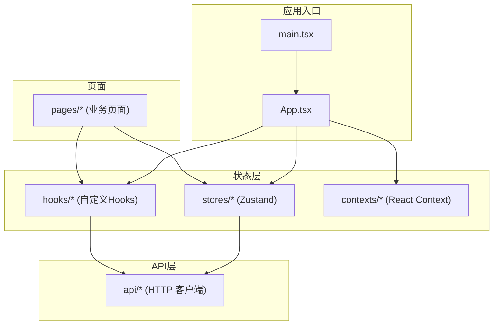
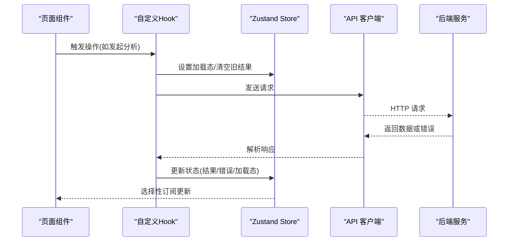
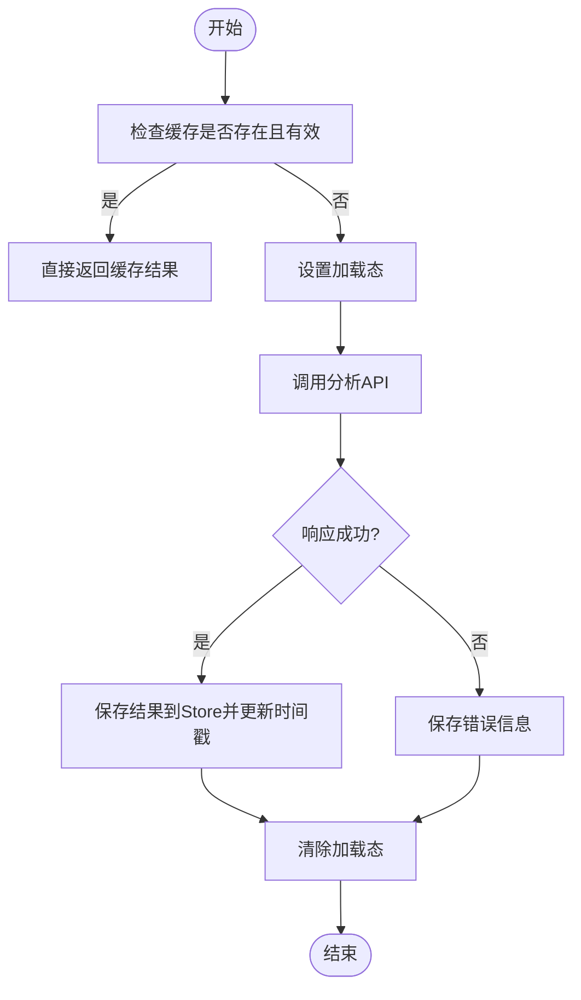
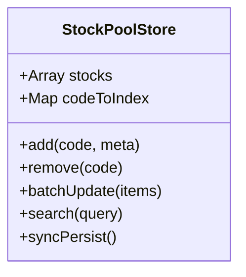
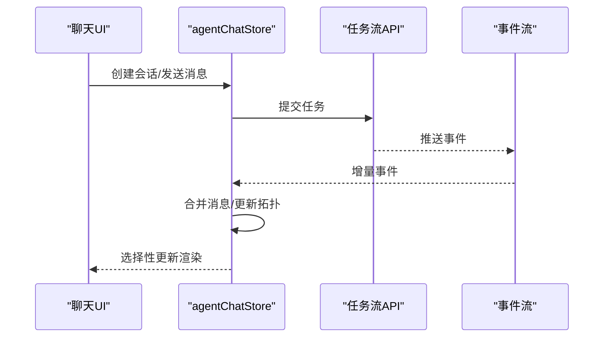
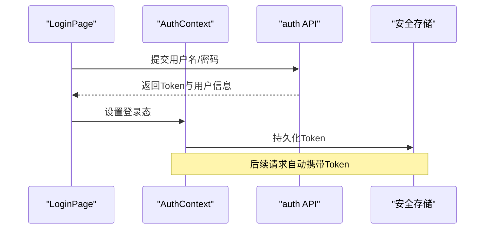
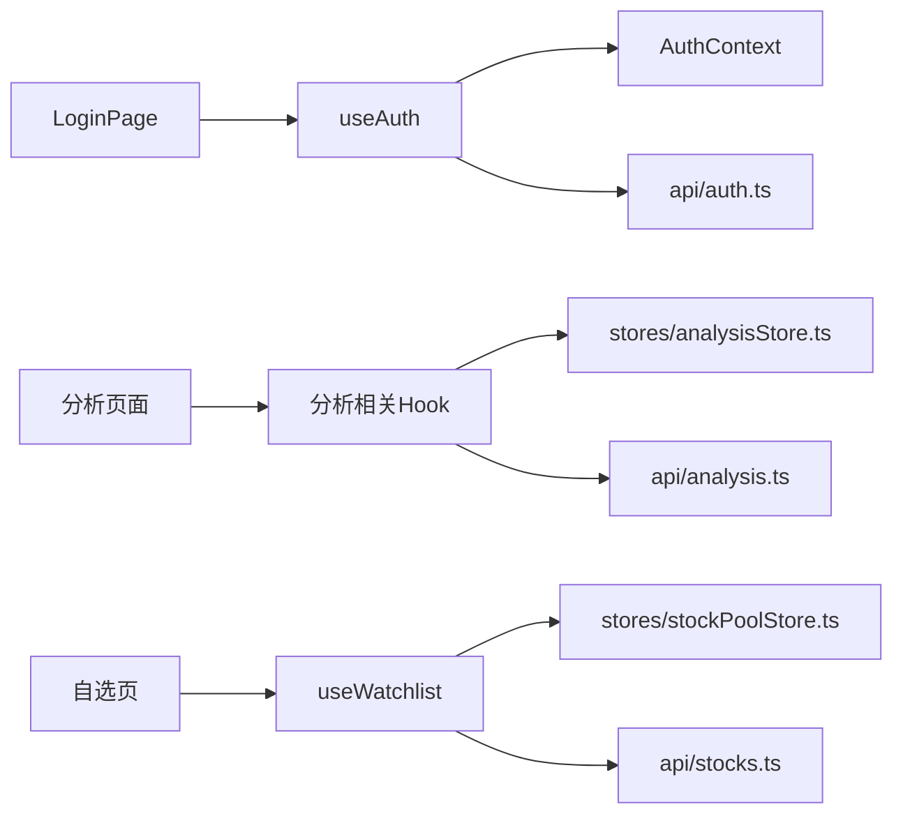

# 状态管理

<cite>
**本文档引用的文件**   
- [apps/dsa-web/src/stores/analysisStore.ts](file://apps/dsa-web/src/stores/analysisStore.ts)
- [apps/dsa-web/src/stores/stockPoolStore.ts](file://apps/dsa-web/src/stores/stockPoolStore.ts)
- [apps/dsa-web/src/stores/agentChatStore.ts](file://apps/dsa-web/src/stores/agentChatStore.ts)
- [apps/dsa-web/src/stores/index.ts](file://apps/dsa-web/src/stores/index.ts)
- [apps/dsa-web/src/hooks/useAuth.ts](file://apps/dsa-web/src/hooks/useAuth.ts)
- [apps/dsa-web/src/hooks/useSystemConfig.ts](file://apps/dsa-web/src/hooks/useSystemConfig.ts)
- [apps/dsa-web/src/hooks/useWatchlist.ts](file://apps/dsa-web/src/hooks/useWatchlist.ts)
- [apps/dsa-web/src/hooks/useStockIndex.ts](file://apps/dsa-web/src/hooks/useStockIndex.ts)
- [apps/dsa-web/src/hooks/useRunFlowSnapshot.ts](file://apps/dsa-web/src/hooks/useRunFlowSnapshot.ts)
- [apps/dsa-web/src/hooks/useDashboardLifecycle.ts](file://apps/dsa-web/src/hooks/useDashboardLifecycle.ts)
- [apps/dsa-web/src/hooks/useTaskStream.ts](file://apps/dsa-web/src/hooks/useTaskStream.ts)
- [apps/dsa-web/src/api/auth.ts](file://apps/dsa-web/src/api/auth.ts)
- [apps/dsa-web/src/api/analysis.ts](file://apps/dsa-web/src/api/analysis.ts)
- [apps/dsa-web/src/api/stocks.ts](file://apps/dsa-web/src/api/stocks.ts)
- [apps/dsa-web/src/api/systemConfig.ts](file://apps/dsa-web/src/api/systemConfig.ts)
- [apps/dsa-web/src/api/index.ts](file://apps/dsa-web/src/api/index.ts)
- [apps/dsa-web/src/contexts/AuthContext.tsx](file://apps/dsa-web/src/contexts/AuthContext.tsx)
- [apps/dsa-web/src/pages/LoginPage.tsx](file://apps/dsa-web/src/pages/LoginPage.tsx)
- [apps/dsa-web/src/App.tsx](file://apps/dsa-web/src/App.tsx)
- [apps/dsa-web/src/main.tsx](file://apps/dsa-web/src/main.tsx)
</cite>

## 目录
1. [简介](#简介)
2. [项目结构](#项目结构)
3. [核心组件](#核心组件)
4. [架构总览](#架构总览)
5. [详细组件分析](#详细组件分析)
6. [依赖关系分析](#依赖关系分析)
7. [性能考虑](#性能考虑)
8. [故障排查指南](#故障排查指南)
9. [结论](#结论)
10. [附录](#附录)

## 简介
本文件系统性梳理前端（Web）应用中的状态管理方案，重点围绕基于 Zustand 的全局状态、自定义 Hooks 的本地与跨组件状态、以及异步数据流处理。文档覆盖认证状态、分析结果状态、股票池状态等关键业务场景，并给出状态持久化、状态同步与性能优化策略，同时提供调试工具使用、测试方法与迁移指南，帮助读者在复杂状态场景中落地最佳实践。

## 项目结构
- 全局状态：位于 apps/dsa-web/src/stores，采用 Zustand store 组织领域状态（如分析、股票池、Agent 聊天）。
- 自定义 Hooks：位于 apps/dsa-web/src/hooks，封装 UI 交互、生命周期、任务流、系统配置等状态逻辑。
- API 层：位于 apps/dsa-web/src/api，统一网络请求与错误处理，供 Store/Hook 调用。
- Context：位于 apps/dsa-web/src/contexts，用于跨层级共享少量上下文（如认证上下文）。
- 页面与入口：pages 与 App.tsx/main.tsx 负责路由挂载与根级 Provider 初始化。

图表来源
- [apps/dsa-web/src/main.tsx](file://apps/dsa-web/src/main.tsx)
- [apps/dsa-web/src/App.tsx](file://apps/dsa-web/src/App.tsx)
- [apps/dsa-web/src/stores/index.ts](file://apps/dsa-web/src/stores/index.ts)
- [apps/dsa-web/src/hooks/index.ts](file://apps/dsa-web/src/hooks/index.ts)
- [apps/dsa-web/src/api/index.ts](file://apps/dsa-web/src/api/index.ts)

章节来源
- [apps/dsa-web/src/main.tsx](file://apps/dsa-web/src/main.tsx)
- [apps/dsa-web/src/App.tsx](file://apps/dsa-web/src/App.tsx)
- [apps/dsa-web/src/stores/index.ts](file://apps/dsa-web/src/stores/index.ts)
- [apps/dsa-web/src/api/index.ts](file://apps/dsa-web/src/api/index.ts)

## 核心组件
- 分析结果状态（analysisStore）：集中管理分析任务的生命周期、结果缓存、加载态与错误信息，支持按标的维度隔离数据。
- 股票池状态（stockPoolStore）：维护用户自选股列表、搜索建议、分页与去重策略，提供增删改查方法。
- Agent 聊天状态（agentChatStore）：管理对话历史、消息流、运行快照与事件订阅，支撑长时任务与增量更新。
- 认证上下文（AuthContext + useAuth）：封装登录态、权限校验与刷新流程，配合页面守卫实现鉴权控制。
- 系统配置（useSystemConfig）：读取/写入系统配置，支持默认值回退与热更新。
- 其他 Hooks：watchlist、stockIndex、runFlowSnapshot、dashboardLifecycle、taskStream 等，分别封装特定领域的状态与副作用。

章节来源
- [apps/dsa-web/src/stores/analysisStore.ts](file://apps/dsa-web/src/stores/analysisStore.ts)
- [apps/dsa-web/src/stores/stockPoolStore.ts](file://apps/dsa-web/src/stores/stockPoolStore.ts)
- [apps/dsa-web/src/stores/agentChatStore.ts](file://apps/dsa-web/src/stores/agentChatStore.ts)
- [apps/dsa-web/src/hooks/useAuth.ts](file://apps/dsa-web/src/hooks/useAuth.ts)
- [apps/dsa-web/src/hooks/useSystemConfig.ts](file://apps/dsa-web/src/hooks/useSystemConfig.ts)
- [apps/dsa-web/src/hooks/useWatchlist.ts](file://apps/dsa-web/src/hooks/useWatchlist.ts)
- [apps/dsa-web/src/hooks/useStockIndex.ts](file://apps/dsa-web/src/hooks/useStockIndex.ts)
- [apps/dsa-web/src/hooks/useRunFlowSnapshot.ts](file://apps/dsa-web/src/hooks/useRunFlowSnapshot.ts)
- [apps/dsa-web/src/hooks/useDashboardLifecycle.ts](file://apps/dsa-web/src/hooks/useDashboardLifecycle.ts)
- [apps/dsa-web/src/hooks/useTaskStream.ts](file://apps/dsa-web/src/hooks/useTaskStream.ts)

## 架构总览
整体采用“Store + Hook + API”的分层模式：
- Store 层：Zustand 存储领域状态，暴露读写方法与选择器。
- Hook 层：组合 Store、API 与 React 副作用，暴露稳定的接口给组件。
- API 层：统一 HTTP 请求、错误处理与重试策略。
- Context 层：跨层级共享轻量上下文（如认证）。
- 页面层：通过 Hook/Store 消费状态，渲染 UI。

图表来源
- [apps/dsa-web/src/hooks/useDashboardLifecycle.ts](file://apps/dsa-web/src/hooks/useDashboardLifecycle.ts)
- [apps/dsa-web/src/stores/analysisStore.ts](file://apps/dsa-web/src/stores/analysisStore.ts)
- [apps/dsa-web/src/api/analysis.ts](file://apps/dsa-web/src/api/analysis.ts)

## 详细组件分析

### 分析结果状态（analysisStore）
- 职责：管理分析任务的启动、进度、结果缓存、错误与取消；支持多标的并行与隔离。
- 数据结构：包含任务 ID、状态机（空闲/进行中/成功/失败）、结果对象、错误信息、时间戳等。
- 异步流：Hook 调用 API -> Store 置 loading -> 成功后缓存结果 -> 失败记录错误 -> 组件按需订阅。
- 性能：使用选择器精确订阅，避免全量重渲染；对大对象进行浅比较或分片缓存。

图表来源
- [apps/dsa-web/src/stores/analysisStore.ts](file://apps/dsa-web/src/stores/analysisStore.ts)
- [apps/dsa-web/src/api/analysis.ts](file://apps/dsa-web/src/api/analysis.ts)

章节来源
- [apps/dsa-web/src/stores/analysisStore.ts](file://apps/dsa-web/src/stores/analysisStore.ts)
- [apps/dsa-web/src/api/analysis.ts](file://apps/dsa-web/src/api/analysis.ts)

### 股票池状态（stockPoolStore）
- 职责：维护自选股集合、搜索建议、分页与去重；提供添加、删除、批量操作。
- 数据结构：数组/Map 存储标的代码、名称、元数据；索引字段加速查询。
- 持久化：与 localStorage/sessionStorage 同步，保证刷新后状态不丢失。
- 并发：批量操作合并更新，避免频繁写盘与重复渲染。

图表来源
- [apps/dsa-web/src/stores/stockPoolStore.ts](file://apps/dsa-web/src/stores/stockPoolStore.ts)

章节来源
- [apps/dsa-web/src/stores/stockPoolStore.ts](file://apps/dsa-web/src/stores/stockPoolStore.ts)

### Agent 聊天状态（agentChatStore）
- 职责：管理对话历史、消息流、运行快照与事件订阅；支持增量更新与断点恢复。
- 数据结构：消息队列、节点拓扑视图、事件日志、状态标志。
- 异步流：SSE/轮询接收事件 -> 更新局部状态 -> 渲染增量节点。
- 性能：消息分片、虚拟滚动、选择性订阅减少重渲染。

图表来源
- [apps/dsa-web/src/stores/agentChatStore.ts](file://apps/dsa-web/src/stores/agentChatStore.ts)
- [apps/dsa-web/src/hooks/useTaskStream.ts](file://apps/dsa-web/src/hooks/useTaskStream.ts)

章节来源
- [apps/dsa-web/src/stores/agentChatStore.ts](file://apps/dsa-web/src/stores/agentChatStore.ts)
- [apps/dsa-web/src/hooks/useTaskStream.ts](file://apps/dsa-web/src/hooks/useTaskStream.ts)

### 认证状态（AuthContext + useAuth）
- 职责：封装登录态、权限校验、Token 刷新与登出；提供页面守卫。
- 数据结构：用户信息、角色、Token、过期时间、刷新令牌。
- 异步流：登录 -> 获取 Token -> 存入安全存储 -> 拦截器自动附加 -> 过期自动刷新。
- 安全：敏感信息最小化暴露，避免在 URL/日志中泄露。

图表来源
- [apps/dsa-web/src/contexts/AuthContext.tsx](file://apps/dsa-web/src/contexts/AuthContext.tsx)
- [apps/dsa-web/src/hooks/useAuth.ts](file://apps/dsa-web/src/hooks/useAuth.ts)
- [apps/dsa-web/src/api/auth.ts](file://apps/dsa-web/src/api/auth.ts)
- [apps/dsa-web/src/pages/LoginPage.tsx](file://apps/dsa-web/src/pages/LoginPage.tsx)

章节来源
- [apps/dsa-web/src/contexts/AuthContext.tsx](file://apps/dsa-web/src/contexts/AuthContext.tsx)
- [apps/dsa-web/src/hooks/useAuth.ts](file://apps/dsa-web/src/hooks/useAuth.ts)
- [apps/dsa-web/src/api/auth.ts](file://apps/dsa-web/src/api/auth.ts)
- [apps/dsa-web/src/pages/LoginPage.tsx](file://apps/dsa-web/src/pages/LoginPage.tsx)

### 系统配置（useSystemConfig）
- 职责：读取/写入系统配置，提供默认值回退与热更新。
- 数据结构：键值对配置项，支持嵌套结构与类型校验。
- 持久化：与后端配置中心或本地存储同步，确保一致性。

章节来源
- [apps/dsa-web/src/hooks/useSystemConfig.ts](file://apps/dsa-web/src/hooks/useSystemConfig.ts)
- [apps/dsa-web/src/api/systemConfig.ts](file://apps/dsa-web/src/api/systemConfig.ts)

### 其他常用 Hooks
- useWatchlist：封装自选股列表的增删改查与本地同步。
- useStockIndex：拉取指数数据，提供缓存与错误重试。
- useRunFlowSnapshot：管理运行快照的生成、查看与对比。
- useDashboardLifecycle：页面生命周期钩子，统一初始化与清理。
- useTaskStream：任务流事件订阅与增量更新。

章节来源
- [apps/dsa-web/src/hooks/useWatchlist.ts](file://apps/dsa-web/src/hooks/useWatchlist.ts)
- [apps/dsa-web/src/hooks/useStockIndex.ts](file://apps/dsa-web/src/hooks/useStockIndex.ts)
- [apps/dsa-web/src/hooks/useRunFlowSnapshot.ts](file://apps/dsa-web/src/hooks/useRunFlowSnapshot.ts)
- [apps/dsa-web/src/hooks/useDashboardLifecycle.ts](file://apps/dsa-web/src/hooks/useDashboardLifecycle.ts)
- [apps/dsa-web/src/hooks/useTaskStream.ts](file://apps/dsa-web/src/hooks/useTaskStream.ts)

## 依赖关系分析
- Store 依赖 API 层进行数据获取与提交。
- Hook 组合 Store 与 API，并封装 React 副作用（如 useEffect、useState）。
- Context 为认证等跨层级状态提供共享能力。
- 页面通过 Hook/Store 消费状态，保持 UI 与逻辑解耦。

图表来源
- [apps/dsa-web/src/pages/LoginPage.tsx](file://apps/dsa-web/src/pages/LoginPage.tsx)
- [apps/dsa-web/src/hooks/useAuth.ts](file://apps/dsa-web/src/hooks/useAuth.ts)
- [apps/dsa-web/src/contexts/AuthContext.tsx](file://apps/dsa-web/src/contexts/AuthContext.tsx)
- [apps/dsa-web/src/api/auth.ts](file://apps/dsa-web/src/api/auth.ts)
- [apps/dsa-web/src/stores/analysisStore.ts](file://apps/dsa-web/src/stores/analysisStore.ts)
- [apps/dsa-web/src/api/analysis.ts](file://apps/dsa-web/src/api/analysis.ts)
- [apps/dsa-web/src/stores/stockPoolStore.ts](file://apps/dsa-web/src/stores/stockPoolStore.ts)
- [apps/dsa-web/src/api/stocks.ts](file://apps/dsa-web/src/api/stocks.ts)

章节来源
- [apps/dsa-web/src/stores/index.ts](file://apps/dsa-web/src/stores/index.ts)
- [apps/dsa-web/src/api/index.ts](file://apps/dsa-web/src/api/index.ts)

## 性能考虑
- 选择器与细粒度订阅：仅订阅所需字段，避免不必要重渲染。
- 数据分片与懒加载：大列表使用虚拟滚动与分页加载。
- 缓存策略：短期内存缓存 + 长期本地存储，结合失效时间与版本号。
- 防抖与节流：搜索输入、频繁点击等场景进行节流/防抖。
- 错误重试与降级：网络异常时指数退避重试，并提供降级路径。
- 并发控制：限制并行请求数量，避免雪崩。

[本节为通用指导，不直接分析具体文件]

## 故障排查指南
- 常见问题定位：
  - 状态未更新：检查选择器是否精确、是否误用引用导致浅比较失败。
  - 异步冲突：确认请求顺序与取消机制，避免竞态条件。
  - 持久化失败：检查存储配额、序列化兼容性与版本迁移。
  - 认证失效：确认 Token 刷新流程与拦截器配置。
- 调试工具：
  - 浏览器 DevTools 扩展（如 Redux/Zustand Devtools）观察状态变更。
  - 控制台打印关键状态快照与错误堆栈。
  - 单元测试与集成测试验证边界情况。

章节来源
- [apps/dsa-web/src/stores/__tests__/stockPoolStore.test.ts](file://apps/dsa-web/src/stores/__tests__/stockPoolStore.test.ts)
- [apps/dsa-web/src/hooks/__tests__/useWatchlist.test.tsx](file://apps/dsa-web/src/hooks/__tests__/useWatchlist.test.tsx)
- [apps/dsa-web/src/contexts/__tests__/AuthContext.test.tsx](file://apps/dsa-web/src/contexts/__tests__/AuthContext.test.tsx)

## 结论
本项目采用 Zustand + 自定义 Hooks 的状态管理模式，清晰分离了领域状态、UI 逻辑与网络请求，具备良好的可维护性与可扩展性。通过选择器、缓存、持久化与错误重试等策略，实现了高性能与健壮性。建议在新增功能时遵循现有分层约定，持续完善测试与调试手段，保障状态一致性与用户体验。

[本节为总结性内容，不直接分析具体文件]

## 附录
- 状态迁移指南：
  - 定义版本标识与迁移脚本，确保向后兼容。
  - 逐步替换旧字段，保留回滚路径。
  - 使用单元测试覆盖迁移逻辑。
- 最佳实践：
  - 单一职责：每个 Store/Hook 聚焦一个领域。
  - 不可变更新：避免直接修改状态，使用函数式更新。
  - 明确错误边界：捕获并展示友好错误信息。
  - 文档化接口：为公共 Hook/Store 方法编写说明与示例。

[本节为补充性内容，不直接分析具体文件]