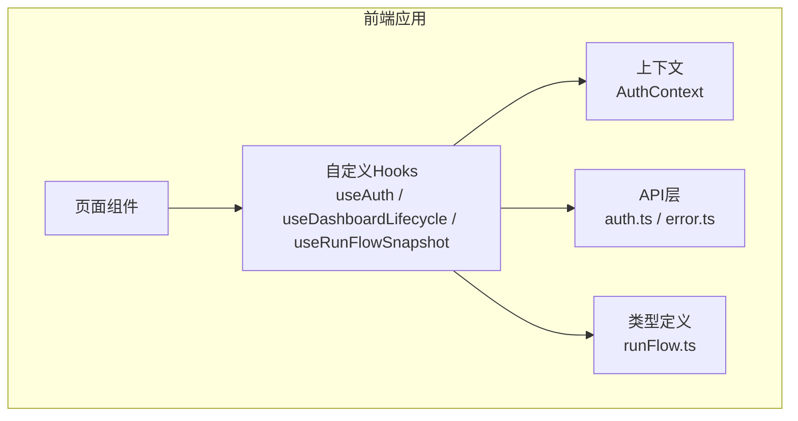
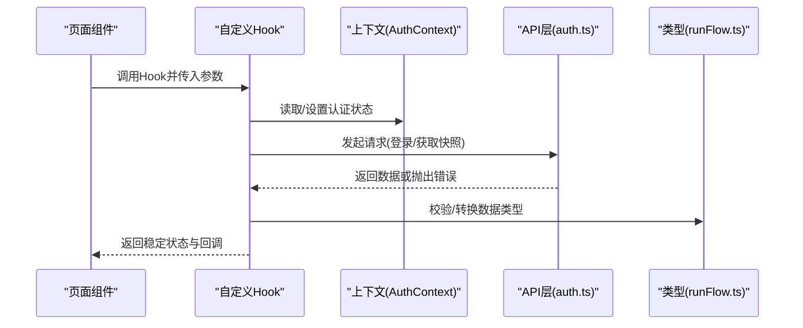
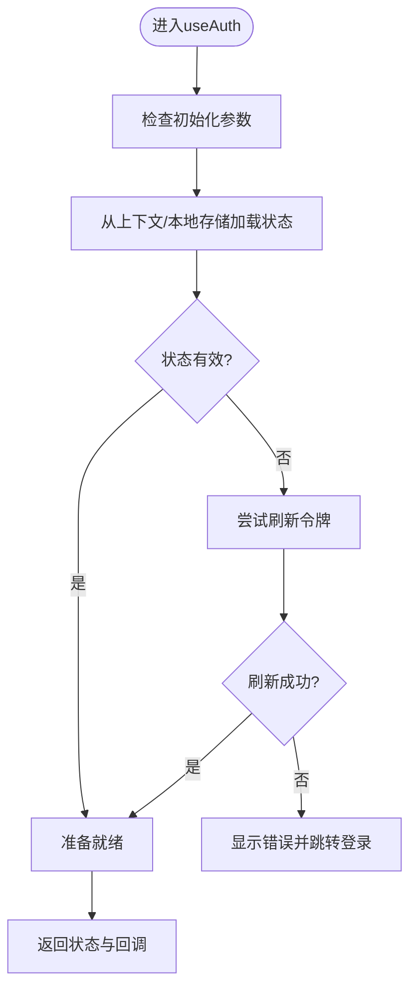
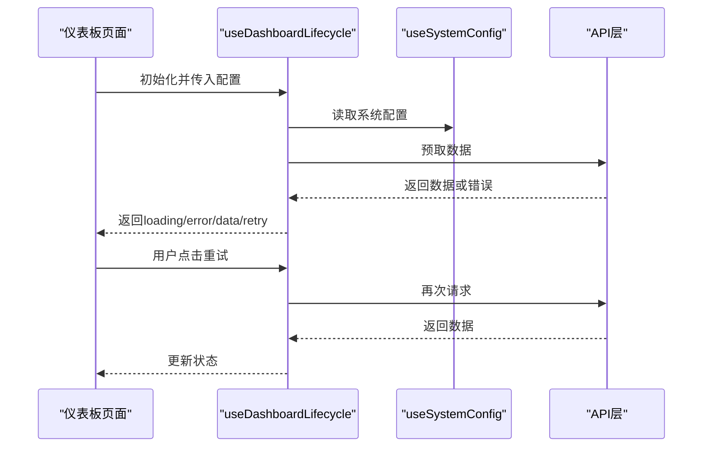
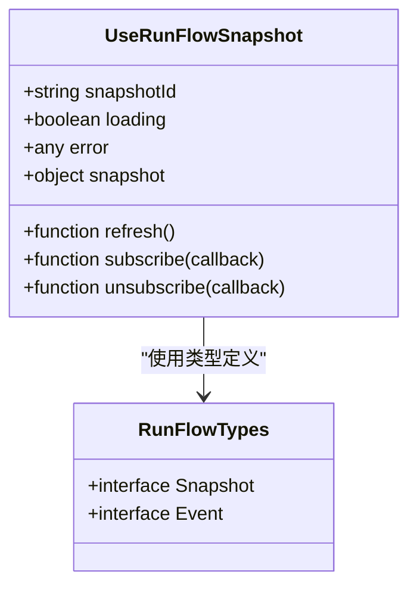
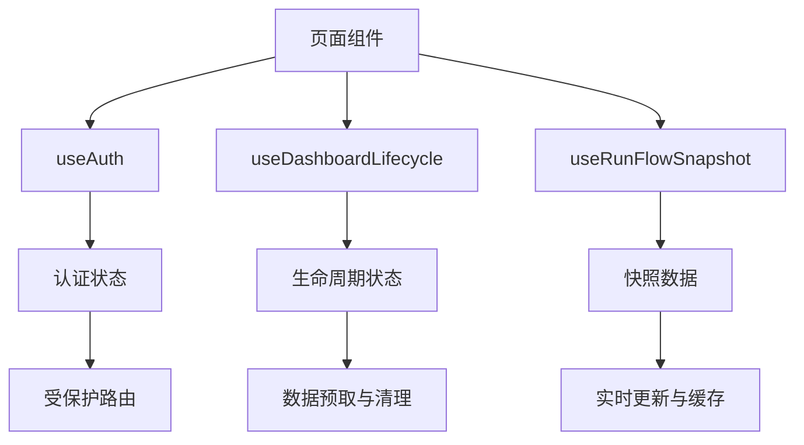
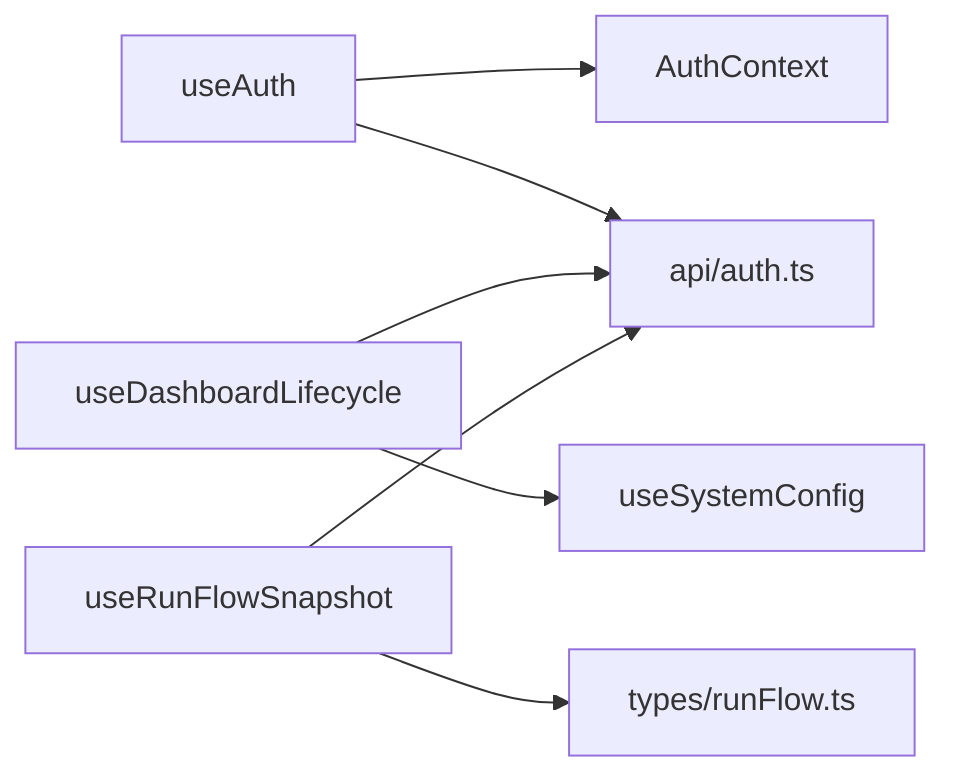

# 自定义Hooks

<cite>
**本文档引用的文件**   
- [useAuth.ts](file://apps/dsa-web/src/hooks/useAuth.ts)
- [useDashboardLifecycle.ts](file://apps/dsa-web/src/hooks/useDashboardLifecycle.ts)
- [useRunFlowSnapshot.ts](file://apps/dsa-web/src/hooks/useRunFlowSnapshot.ts)
- [index.ts](file://apps/dsa-web/src/hooks/index.ts)
- [AuthContext.tsx](file://apps/dsa-web/src/contexts/AuthContext.tsx)
- [api/auth.ts](file://apps/dsa-web/src/api/auth.ts)
- [runFlow.ts](file://apps/dsa-web/src/types/runFlow.ts)
- [useTaskStream.ts](file://apps/dsa-web/src/hooks/useTaskStream.ts)
- [useSystemConfig.ts](file://apps/dsa-web/src/hooks/useSystemConfig.ts)
- [error.ts](file://apps/dsa-web/src/api/error.ts)
</cite>

## 目录
1. [简介](#简介)
2. [项目结构](#项目结构)
3. [核心组件](#核心组件)
4. [架构总览](#架构总览)
5. [详细组件分析](#详细组件分析)
6. [依赖分析](#依赖分析)
7. [性能考虑](#性能考虑)
8. [故障排查指南](#故障排查指南)
9. [结论](#结论)
10. [附录](#附录)

## 简介
本文件面向基于React Hooks的自定义逻辑封装模式，聚焦以下核心Hook：
- useAuth：认证状态与鉴权能力封装
- useDashboardLifecycle：仪表板生命周期管理（挂载、卸载、刷新、错误恢复）
- useRunFlowSnapshot：运行流程快照的数据获取、缓存与事件同步

文档将系统化阐述Hook的设计模式、参数传递、返回值处理、错误处理机制，以及组合使用、性能优化与测试方法。同时覆盖异步数据处理、状态同步和事件监听的最佳实践。

## 项目结构
本项目的前端位于 apps/dsa-web/src，其中 hooks 目录集中存放自定义Hook；contexts 提供全局上下文；api 提供HTTP接口封装；types 定义数据结构。

**图表来源** 
- [useAuth.ts](file://apps/dsa-web/src/hooks/useAuth.ts)
- [useDashboardLifecycle.ts](file://apps/dsa-web/src/hooks/useDashboardLifecycle.ts)
- [useRunFlowSnapshot.ts](file://apps/dsa-web/src/hooks/useRunFlowSnapshot.ts)
- [AuthContext.tsx](file://apps/dsa-web/src/contexts/AuthContext.tsx)
- [api/auth.ts](file://apps/dsa-web/src/api/auth.ts)
- [runFlow.ts](file://apps/dsa-web/src/types/runFlow.ts)

**章节来源**
- [index.ts](file://apps/dsa-web/src/hooks/index.ts)

## 核心组件
- useAuth：封装用户认证状态、登录/登出、权限判断与错误提示，通常与 AuthContext 协作，提供统一的鉴权能力。
- useDashboardLifecycle：封装仪表板页面的生命周期钩子，包括初始化、数据预取、错误边界、清理副作用等。
- useRunFlowSnapshot：封装运行流程快照的获取、缓存、增量更新与事件订阅，支持流式或轮询更新。

这些Hook遵循“单一职责”、“可组合”、“可测试”的原则，通过参数化配置与返回稳定的对象结构，便于在页面中复用。

**章节来源**
- [useAuth.ts](file://apps/dsa-web/src/hooks/useAuth.ts)
- [useDashboardLifecycle.ts](file://apps/dsa-web/src/hooks/useDashboardLifecycle.ts)
- [useRunFlowSnapshot.ts](file://apps/dsa-web/src/hooks/useRunFlowSnapshot.ts)

## 架构总览
下图展示了Hook与上下文、API层、类型定义的交互关系，以及典型的数据流与控制流。

**图表来源** 
- [useAuth.ts](file://apps/dsa-web/src/hooks/useAuth.ts)
- [AuthContext.tsx](file://apps/dsa-web/src/contexts/AuthContext.tsx)
- [api/auth.ts](file://apps/dsa-web/src/api/auth.ts)
- [runFlow.ts](file://apps/dsa-web/src/types/runFlow.ts)

## 详细组件分析

### useAuth 认证Hook
- 设计模式
  - 与上下文协作：从 AuthContext 获取当前用户、登录态、权限信息；提供登录/登出动作。
  - 错误处理：统一捕获网络异常与业务错误，转换为UI友好的状态。
  - 参数化：支持是否自动刷新、是否忽略某些错误、是否启用本地持久化等选项。
- 参数传递
  - 可选参数：如是否需要立即检查登录态、是否禁用自动重试、是否绑定特定路由守卫。
- 返回值处理
  - 返回对象包含：用户信息、登录状态、权限集合、登录/登出函数、错误消息、加载状态。
- 错误处理机制
  - 网络错误：超时、断网、服务器错误分类处理。
  - 业务错误：未授权、令牌过期、账号锁定等。
  - 降级策略：失败时保留上次成功状态，避免UI闪烁。
- 最佳实践
  - 避免在渲染路径中执行副作用，所有副作用放在 useEffect/useMemo/useCallback 中。
  - 对敏感操作进行二次确认与防抖。
  - 结合路由守卫实现受保护页面。

**图表来源** 
- [useAuth.ts](file://apps/dsa-web/src/hooks/useAuth.ts)
- [AuthContext.tsx](file://apps/dsa-web/src/contexts/AuthContext.tsx)
- [api/auth.ts](file://apps/dsa-web/src/api/auth.ts)

**章节来源**
- [useAuth.ts](file://apps/dsa-web/src/hooks/useAuth.ts)
- [AuthContext.tsx](file://apps/dsa-web/src/contexts/AuthContext.tsx)
- [api/auth.ts](file://apps/dsa-web/src/api/auth.ts)

### useDashboardLifecycle 仪表板生命周期Hook
- 设计模式
  - 生命周期封装：在组件挂载时触发初始化、数据预取；在卸载时清理定时器、事件监听。
  - 错误恢复：捕获异常并记录日志，提供重试入口。
  - 组合性：可与 useAuth、useSystemConfig 等Hook组合，形成完整的仪表板能力。
- 参数传递
  - 初始化配置：如数据源、刷新间隔、错误阈值、是否懒加载。
  - 事件回调：如 onReady、onError、onRetry。
- 返回值处理
  - 返回：loading、error、retry、data、isMounted、cleanup 等。
- 错误处理机制
  - 区分网络错误与业务错误，提供用户可见的错误提示与重试按钮。
  - 支持指数退避重试与熔断策略。
- 最佳实践
  - 使用 useCallback 包装回调，避免不必要的重渲染。
  - 使用 useMemo 缓存计算结果，减少重复计算。
  - 在卸载时确保清理所有副作用，防止内存泄漏。

**图表来源** 
- [useDashboardLifecycle.ts](file://apps/dsa-web/src/hooks/useDashboardLifecycle.ts)
- [useSystemConfig.ts](file://apps/dsa-web/src/hooks/useSystemConfig.ts)
- [api/auth.ts](file://apps/dsa-web/src/api/auth.ts)

**章节来源**
- [useDashboardLifecycle.ts](file://apps/dsa-web/src/hooks/useDashboardLifecycle.ts)
- [useSystemConfig.ts](file://apps/dsa-web/src/hooks/useSystemConfig.ts)

### useRunFlowSnapshot 运行流程快照Hook
- 设计模式
  - 数据获取与缓存：首次请求后缓存结果，后续优先使用缓存，必要时增量更新。
  - 事件订阅：支持流式事件或轮询更新，保持UI与后端状态一致。
  - 类型安全：严格使用 runFlow.ts 中的类型定义，确保数据结构一致性。
- 参数传递
  - 快照ID、更新策略（立即/延迟）、最大重试次数、是否启用缓存。
- 返回值处理
  - 返回：snapshot、loading、error、refresh、subscribe、unsubscribe 等。
- 错误处理机制
  - 网络错误：自动重试与降级到缓存数据。
  - 数据不一致：提供版本校验与冲突解决。
- 最佳实践
  - 使用事件总线或WebSocket进行实时同步，避免频繁轮询。
  - 对大数据量进行分页或分片加载。
  - 提供手动刷新与自动刷新开关。

**图表来源** 
- [useRunFlowSnapshot.ts](file://apps/dsa-web/src/hooks/useRunFlowSnapshot.ts)
- [runFlow.ts](file://apps/dsa-web/src/types/runFlow.ts)

**章节来源**
- [useRunFlowSnapshot.ts](file://apps/dsa-web/src/hooks/useRunFlowSnapshot.ts)
- [runFlow.ts](file://apps/dsa-web/src/types/runFlow.ts)

### 概念总览
以下流程图展示了三个Hook的组合使用模式，体现状态同步与事件驱动的设计理念。

[此图为概念性流程图，不直接映射具体代码文件]

## 依赖分析
Hook之间的依赖关系如下：
- useAuth 依赖 AuthContext 与 api/auth.ts
- useDashboardLifecycle 依赖 useSystemConfig 与 API层
- useRunFlowSnapshot 依赖 types/runFlow.ts 与 API层

**图表来源** 
- [useAuth.ts](file://apps/dsa-web/src/hooks/useAuth.ts)
- [AuthContext.tsx](file://apps/dsa-web/src/contexts/AuthContext.tsx)
- [api/auth.ts](file://apps/dsa-web/src/api/auth.ts)
- [useDashboardLifecycle.ts](file://apps/dsa-web/src/hooks/useDashboardLifecycle.ts)
- [useSystemConfig.ts](file://apps/dsa-web/src/hooks/useSystemConfig.ts)
- [useRunFlowSnapshot.ts](file://apps/dsa-web/src/hooks/useRunFlowSnapshot.ts)
- [runFlow.ts](file://apps/dsa-web/src/types/runFlow.ts)

**章节来源**
- [index.ts](file://apps/dsa-web/src/hooks/index.ts)

## 性能考虑
- 避免不必要的重渲染：使用 useMemo 缓存计算结果，useCallback 稳定回调引用。
- 减少网络请求：启用缓存、合并请求、使用增量更新。
- 事件监听优化：及时清理事件监听器，避免内存泄漏。
- 大列表渲染：虚拟滚动、分页加载。
- 错误边界：捕获渲染错误，提供降级UI。

## 故障排查指南
- 常见问题
  - 认证失败：检查令牌有效期、网络连通性、服务端响应码。
  - 数据不同步：检查事件订阅是否正确清理，缓存版本是否一致。
  - 内存泄漏：确认 useEffect 的清理函数是否执行。
- 调试技巧
  - 使用浏览器开发者工具监控网络请求与状态变化。
  - 添加日志输出关键状态与错误信息。
  - 编写单元测试验证Hook行为。

**章节来源**
- [error.ts](file://apps/dsa-web/src/api/error.ts)

## 结论
通过自定义Hook封装认证、生命周期管理与快照数据逻辑，实现了高内聚、低耦合的前端架构。遵循设计模式与最佳实践，提升了代码的可维护性与可测试性。建议持续优化性能与错误处理，确保用户体验与系统稳定性。

## 附录
- 测试方法
  - 使用 React Testing Library 模拟Hook行为。
  - Mock API层与上下文，验证Hook在不同场景下的表现。
  - 编写端到端测试覆盖用户交互流程。
- 扩展建议
  - 增加更多业务Hook，如 useWatchlist、useTaskStream。
  - 引入状态管理库（如 Zustand）管理复杂状态。
  - 优化国际化与主题切换。

**章节来源**
- [useTaskStream.ts](file://apps/dsa-web/src/hooks/useTaskStream.ts)