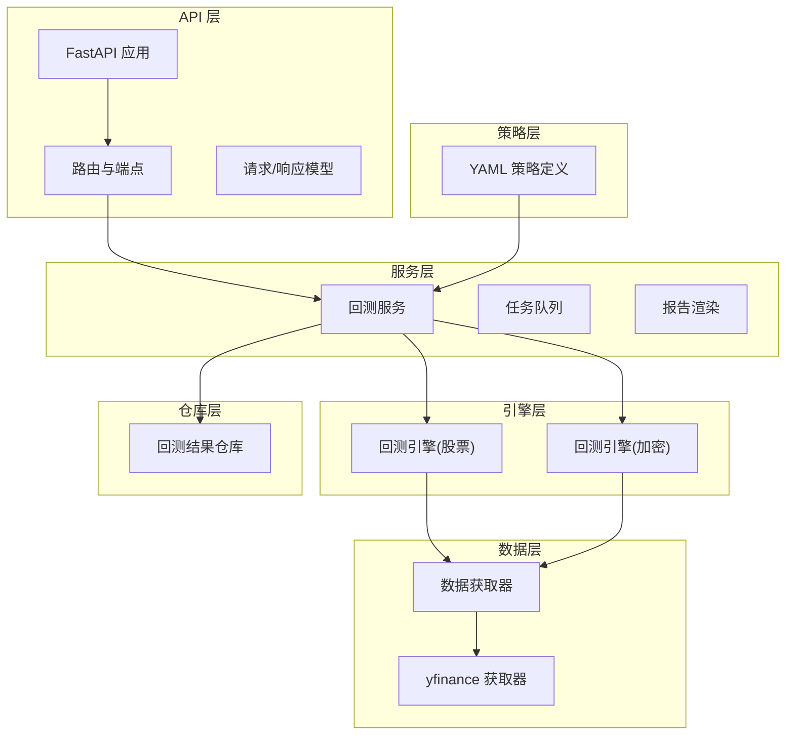
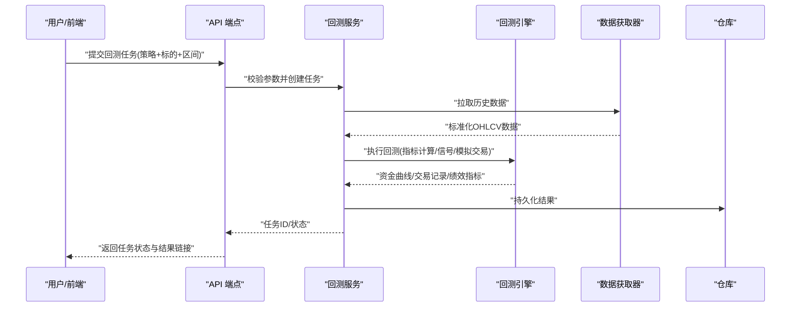
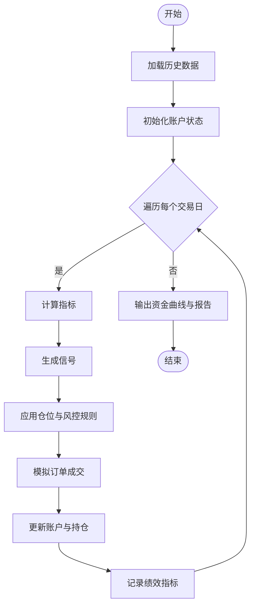
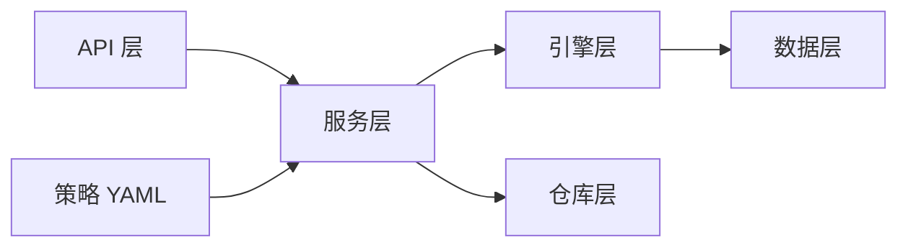

# 交易策略系统

<cite>
**本文引用的文件**   
- [main.py](file://main.py)
- [server.py](file://server.py)
- [api/app.py](file://api/app.py)
- [api/v1/router.py](file://api/v1/router.py)
- [api/v1/endpoints/backtest.py](file://api/v1/endpoints/backtest.py)
- [api/v1/schemas/backtest.py](file://api/v1/schemas/backtest.py)
- [src/core/backtest_engine.py](file://src/core/backtest_engine.py)
- [src/core/crypto_backtest_engine.py](file://src/core/crypto_backtest_engine.py)
- [src/services/backtest_service.py](file://src/services/backtest_service.py)
- [src/repositories/backtest_repo.py](file://src/repositories/backtest_repo.py)
- [strategies/bull_trend.yaml](file://strategies/bull_trend.yaml)
- [strategies/volume_breakout.yaml](file://strategies/volume_breakout.yaml)
- [data_provider/base.py](file://data_provider/base.py)
- [data_provider/yfinance_fetcher.py](file://data_provider/yfinance_fetcher.py)
- [src/agent/tools/backtest_tools.py](file://src/agent/tools/backtest_tools.py)
- [tests/test_backtest_engine.py](file://tests/test_backtest_engine.py)
- [tests/test_backtest_service.py](file://tests/test_backtest_service.py)
</cite>

## 目录
1. [简介](#简介)
2. [项目结构](#项目结构)
3. [核心组件](#核心组件)
4. [架构总览](#架构总览)
5. [详细组件分析](#详细组件分析)
6. [依赖关系分析](#依赖关系分析)
7. [性能考量](#性能考量)
8. [故障排查指南](#故障排查指南)
9. [结论](#结论)
10. [附录](#附录)

## 简介
本文件为交易策略系统的综合文档，覆盖策略定义、回测引擎与执行机制。重点说明：
- YAML 格式的策略配置文件结构与字段含义
- 技术指标计算与信号生成逻辑
- 回测引擎的实现原理、性能优化与历史数据验证方法
- 策略开发指南、自定义指标添加与策略测试框架
- 策略性能分析、风险评估与实盘对接方案

该系统采用分层架构：API 层暴露接口，服务层编排流程，引擎层负责回测与执行，数据层提供行情与历史数据，仓库层持久化结果，策略以 YAML 声明式配置驱动。

## 项目结构
- API 层：FastAPI 应用与路由、请求/响应模型
- 服务层：回测服务、任务队列、报告渲染等
- 引擎层：股票与加密货币回测引擎
- 数据层：多源数据获取器（yfinance、akshare、tushare 等）
- 策略层：YAML 策略定义，描述指标、阈值与信号规则
- 仓库层：回测结果、决策信号、组合与历史数据的持久化
- 前端与桌面端：Web UI 与 Electron 桌面应用

图表来源
- [api/app.py:1-200](file://api/app.py#L1-L200)
- [api/v1/router.py:1-200](file://api/v1/router.py#L1-L200)
- [src/services/backtest_service.py:1-300](file://src/services/backtest_service.py#L1-L300)
- [src/core/backtest_engine.py:1-300](file://src/core/backtest_engine.py#L1-L300)
- [src/core/crypto_backtest_engine.py:1-300](file://src/core/crypto_backtest_engine.py#L1-L300)
- [data_provider/base.py:1-200](file://data_provider/base.py#L1-L200)
- [data_provider/yfinance_fetcher.py:1-200](file://data_provider/yfinance_fetcher.py#L1-L200)
- [strategies/bull_trend.yaml:1-200](file://strategies/bull_trend.yaml#L1-L200)

章节来源
- [api/app.py:1-200](file://api/app.py#L1-L200)
- [api/v1/router.py:1-200](file://api/v1/router.py#L1-L200)
- [src/services/backtest_service.py:1-300](file://src/services/backtest_service.py#L1-L300)
- [src/core/backtest_engine.py:1-300](file://src/core/backtest_engine.py#L1-L300)
- [src/core/crypto_backtest_engine.py:1-300](file://src/core/crypto_backtest_engine.py#L1-L300)
- [data_provider/base.py:1-200](file://data_provider/base.py#L1-L200)
- [data_provider/yfinance_fetcher.py:1-200](file://data_provider/yfinance_fetcher.py#L1-L200)
- [strategies/bull_trend.yaml:1-200](file://strategies/bull_trend.yaml#L1-L200)

## 核心组件
- 回测引擎：实现按时间步推进的模拟交易，支持仓位管理、手续费、滑点、资金曲线与绩效统计
- 策略解析器：读取 YAML 策略，校验参数，构建指标与信号规则
- 数据获取器：统一抽象不同数据源，提供标准化 OHLCV 与基本面数据
- 服务层：编排数据拉取、指标计算、信号生成、订单模拟与结果持久化
- 仓库层：存储回测结果、决策信号、组合快照与运行日志
- 前端与 API：提供可视化界面与 REST 接口，支持任务提交、进度查询与结果下载

章节来源
- [src/core/backtest_engine.py:1-300](file://src/core/backtest_engine.py#L1-L300)
- [src/core/crypto_backtest_engine.py:1-300](file://src/core/crypto_backtest_engine.py#L1-L300)
- [src/services/backtest_service.py:1-300](file://src/services/backtest_service.py#L1-L300)
- [data_provider/base.py:1-200](file://data_provider/base.py#L1-L200)
- [src/repositories/backtest_repo.py:1-200](file://src/repositories/backtest_repo.py#L1-L200)

## 架构总览
系统通过 API 接收回测请求，服务层加载策略与数据，调用引擎执行回测，最终将结果写入仓库并返回给前端。

图表来源
- [api/v1/endpoints/backtest.py:1-200](file://api/v1/endpoints/backtest.py#L1-L200)
- [src/services/backtest_service.py:1-300](file://src/services/backtest_service.py#L1-L300)
- [src/core/backtest_engine.py:1-300](file://src/core/backtest_engine.py#L1-L300)
- [data_provider/base.py:1-200](file://data_provider/base.py#L1-L200)
- [src/repositories/backtest_repo.py:1-200](file://src/repositories/backtest_repo.py#L1-L200)

## 详细组件分析

### 策略定义与 YAML 配置
- 策略文件位于 strategies 目录，使用 YAML 声明式配置
- 典型字段包括：
  - 策略元信息：名称、版本、作者、描述
  - 数据范围：时间窗口、频率、市场类型
  - 指标定义：名称、参数、周期、聚合方式
  - 信号规则：条件表达式、优先级、过滤条件
  - 仓位管理：目标仓位、调仓频率、止损止盈
  - 费用与滑点：手续费率、滑点比例、最小交易量
  - 输出：信号列名、资金曲线列名、绩效指标列表

示例参考：
- [bull_trend.yaml](file://strategies/bull_trend.yaml)
- [volume_breakout.yaml](file://strategies/volume_breakout.yaml)

章节来源
- [strategies/bull_trend.yaml:1-200](file://strategies/bull_trend.yaml#L1-L200)
- [strategies/volume_breakout.yaml:1-200](file://strategies/volume_breakout.yaml#L1-L200)

### 技术指标计算与信号生成
- 指标计算：基于标准化 OHLCV 数据，按周期滚动计算（如均线、RSI、MACD、布林带、成交量比率等）
- 信号生成：根据策略规则对指标进行布尔判断，生成买入/卖出/持有信号
- 信号合并：多指标加权或投票机制，支持优先级与冲突处理
- 输出：每根 K 线的信号列，供引擎用于模拟交易

章节来源
- [src/core/backtest_engine.py:1-300](file://src/core/backtest_engine.py#L1-L300)
- [src/services/backtest_service.py:1-300](file://src/services/backtest_service.py#L1-L300)

### 回测引擎实现原理
- 时间步进：按日期顺序遍历历史数据，逐日更新指标与信号
- 账户状态：现金、持仓、成本、盈亏、手续费、滑点
- 订单模拟：市价单/限价单，成交概率与部分成交
- 绩效统计：收益率、夏普比率、最大回撤、胜率、盈亏比、换手率
- 并行优化：多标的/多策略并行回测，分块加载数据，缓存中间结果

图表来源
- [src/core/backtest_engine.py:1-300](file://src/core/backtest_engine.py#L1-L300)

章节来源
- [src/core/backtest_engine.py:1-300](file://src/core/backtest_engine.py#L1-L300)

### 加密货币回测引擎
- 与股票引擎类似，但针对加密市场特性：
  - 24/7 交易时间处理
  - 更高波动性与滑点设置
  - 支持合约与现货两种模式
  - 资金费率与资金占用模型

章节来源
- [src/core/crypto_backtest_engine.py:1-300](file://src/core/crypto_backtest_engine.py#L1-L300)

### 数据获取与标准化
- 抽象基类定义统一接口：get_history、get_realtime、get_fundamentals
- 具体实现适配不同数据源（yfinance、akshare、tushare、baostock 等）
- 数据清洗：缺失值填充、异常值剔除、复权处理、时区统一

章节来源
- [data_provider/base.py:1-200](file://data_provider/base.py#L1-L200)
- [data_provider/yfinance_fetcher.py:1-200](file://data_provider/yfinance_fetcher.py#L1-L200)

### API 与前端集成
- FastAPI 端点提供回测任务提交、状态查询、结果下载
- 请求模型包含策略 ID、标的列表、时间区间、参数覆盖
- 响应模型包含任务 ID、状态、进度、结果摘要与详情链接

章节来源
- [api/v1/endpoints/backtest.py:1-200](file://api/v1/endpoints/backtest.py#L1-L200)
- [api/v1/schemas/backtest.py:1-200](file://api/v1/schemas/backtest.py#L1-L200)
- [api/app.py:1-200](file://api/app.py#L1-L200)
- [api/v1/router.py:1-200](file://api/v1/router.py#L1-L200)

### 仓库与持久化
- 回测结果：资金曲线、交易明细、绩效指标、信号序列
- 任务元数据：策略版本、数据源、参数、运行环境
- 查询与导出：按策略/标的/时间范围筛选，支持 CSV/JSON 导出

章节来源
- [src/repositories/backtest_repo.py:1-200](file://src/repositories/backtest_repo.py#L1-L200)

### 策略开发指南
- 新增策略步骤：
  1. 在 strategies 目录创建 YAML 文件
  2. 定义指标与参数，确保数据可用
  3. 编写信号规则，明确触发条件与优先级
  4. 设置仓位管理与风控参数
  5. 本地回测验证，检查信号合理性
  6. 单元测试覆盖关键逻辑
- 自定义指标：
  - 在引擎或工具模块中实现指标计算函数
  - 注册到指标工厂，供策略引用
  - 提供默认参数与边界检查

章节来源
- [src/agent/tools/backtest_tools.py:1-200](file://src/agent/tools/backtest_tools.py#L1-L200)
- [strategies/bull_trend.yaml:1-200](file://strategies/bull_trend.yaml#L1-L200)

### 策略测试框架
- 单元测试：验证指标计算正确性、信号生成逻辑、订单模拟行为
- 集成测试：端到端回测流程，数据拉取、引擎执行、结果持久化
- 基准测试：性能回归测试，监控耗时与内存占用
- 数据验证：历史数据完整性、缺失值处理、异常值检测

章节来源
- [tests/test_backtest_engine.py:1-200](file://tests/test_backtest_engine.py#L1-L200)
- [tests/test_backtest_service.py:1-200](file://tests/test_backtest_service.py#L1-L200)

## 依赖关系分析
- API 层依赖服务层，服务层依赖引擎与数据层，仓库层独立于其他层
- 数据获取器通过抽象接口解耦，便于替换与扩展
- 策略 YAML 与引擎解耦，通过解析器动态加载

图表来源
- [api/app.py:1-200](file://api/app.py#L1-L200)
- [src/services/backtest_service.py:1-300](file://src/services/backtest_service.py#L1-L300)
- [src/core/backtest_engine.py:1-300](file://src/core/backtest_engine.py#L1-L300)
- [data_provider/base.py:1-200](file://data_provider/base.py#L1-L200)
- [src/repositories/backtest_repo.py:1-200](file://src/repositories/backtest_repo.py#L1-L200)

章节来源
- [api/app.py:1-200](file://api/app.py#L1-L200)
- [src/services/backtest_service.py:1-300](file://src/services/backtest_service.py#L1-L300)
- [src/core/backtest_engine.py:1-300](file://src/core/backtest_engine.py#L1-L300)
- [data_provider/base.py:1-200](file://data_provider/base.py#L1-L200)
- [src/repositories/backtest_repo.py:1-200](file://src/repositories/backtest_repo.py#L1-L200)

## 性能考量
- 数据加载：分块读取、缓存热点数据、避免重复拉取
- 指标计算：向量化运算、减少 Python 循环、使用 NumPy/Pandas 优化
- 回测引擎：并行回测、惰性计算、内存池复用
- 存储优化：压缩持久化、增量更新、索引加速查询
- 监控与 profiling：记录关键路径耗时、内存峰值、GC 行为

[本节为通用指导，不直接分析具体文件]

## 故障排查指南
- 数据问题：检查数据源可用性、网络超时、数据格式一致性
- 策略错误：YAML 语法校验、参数范围检查、指标未定义
- 引擎异常：除零错误、NaN 传播、订单无法成交
- 性能瓶颈：CPU/内存占用过高、I/O 阻塞、数据库锁竞争
- 调试建议：启用详细日志、断点调试、单元测试回归

章节来源
- [tests/test_backtest_engine.py:1-200](file://tests/test_backtest_engine.py#L1-L200)
- [tests/test_backtest_service.py:1-200](file://tests/test_backtest_service.py#L1-L200)

## 结论
本系统提供完整的交易策略开发与回测能力，支持多数据源、多策略并行、灵活配置与高性能执行。通过清晰的架构与完善的测试框架，可快速迭代策略并评估风险，为实盘对接奠定基础。

[本节为总结，不直接分析具体文件]

## 附录
- 实盘对接方案：
  - 订单通道：接入券商或交易所 API（如 Longbridge、Tushare Pro）
  - 风险控制：实时风控、熔断机制、仓位上限
  - 监控告警：延迟监控、成交回报、异常报警
  - 灰度发布：小资金试运行、逐步放量
- 常用指标参考：
  - 趋势类：MA、EMA、MACD
  - 动量类：RSI、KDJ、CCI
  - 波动类：ATR、布林带
  - 量能类：成交量比率、OBV、资金流向

[本节为补充信息，不直接分析具体文件]