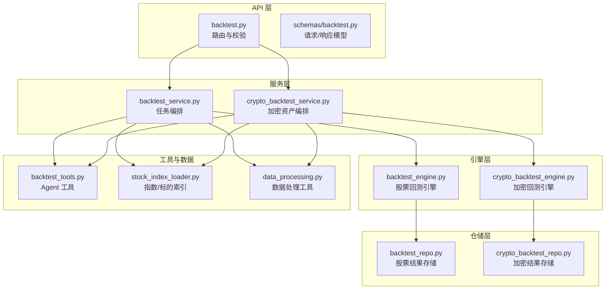
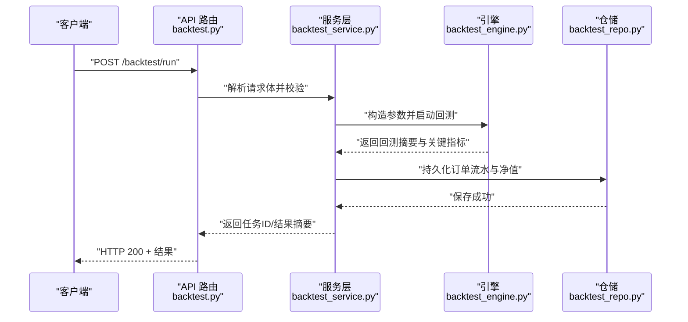
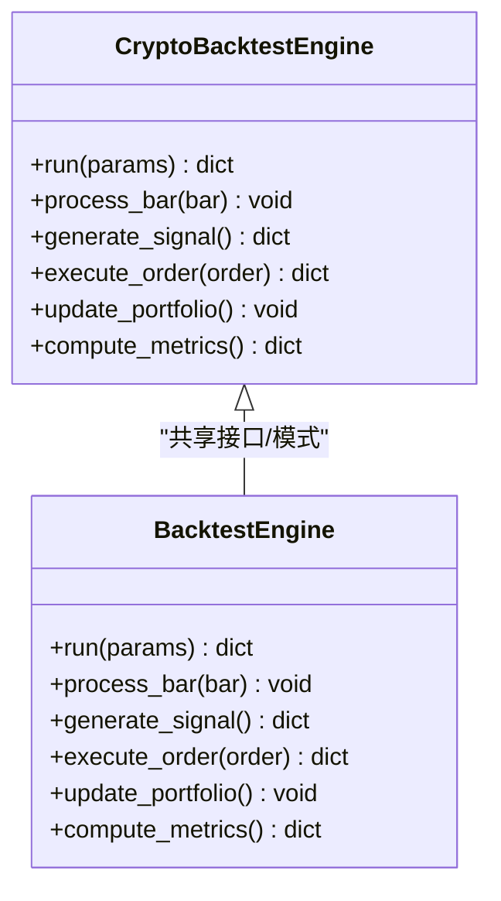
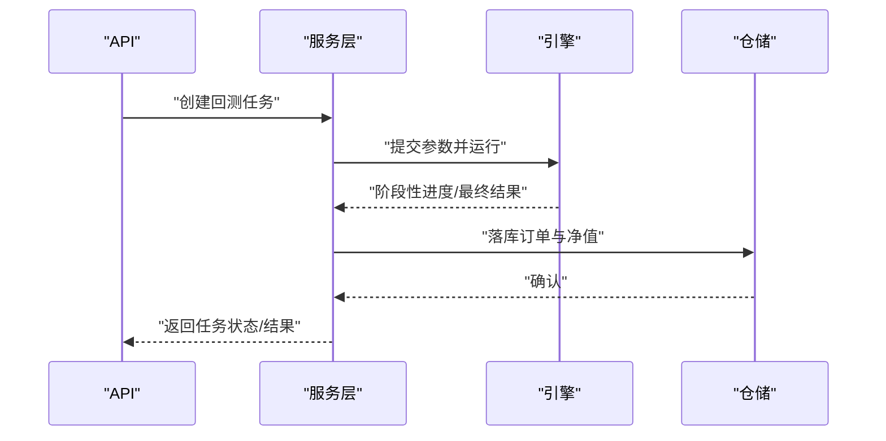
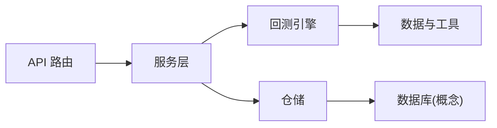

# 回测引擎

<cite>
**本文引用的文件**   
- [src/core/backtest_engine.py](file://src/core/backtest_engine.py)
- [src/core/crypto_backtest_engine.py](file://src/core/crypto_backtest_engine.py)
- [src/services/backtest_service.py](file://src/services/backtest_service.py)
- [src/services/crypto_backtest_service.py](file://src/services/crypto_backtest_service.py)
- [api/v1/endpoints/backtest.py](file://api/v1/endpoints/backtest.py)
- [api/v1/schemas/backtest.py](file://api/v1/schemas/backtest.py)
- [src/repositories/backtest_repo.py](file://src/repositories/backtest_repo.py)
- [src/repositories/crypto_backtest_repo.py](file://src/repositories/crypto_backtest_repo.py)
- [src/agent/tools/backtest_tools.py](file://src/agent/tools/backtest_tools.py)
- [src/data/stock_index_loader.py](file://src/data/stock_index_loader.py)
- [src/utils/data_processing.py](file://src/utils/data_processing.py)
- [tests/test_backtest_engine.py](file://tests/test_backtest_engine.py)
- [tests/test_crypto_backtest_engine.py](file://tests/test_crypto_backtest_engine.py)
- [tests/test_backtest_service.py](file://tests/test_backtest_service.py)
</cite>

## 目录
1. [简介](#简介)
2. [项目结构](#项目结构)
3. [核心组件](#核心组件)
4. [架构总览](#架构总览)
5. [详细组件分析](#详细组件分析)
6. [依赖关系分析](#依赖关系分析)
7. [性能考虑](#性能考虑)
8. [故障排查指南](#故障排查指南)
9. [结论](#结论)
10. [附录](#附录)

## 简介
本文件面向回测引擎的使用者与开发者，系统化阐述该项目的回测能力与实现方式。内容覆盖：
- 数据加载、信号生成、订单执行与绩效评估四大模块
- 历史数据处理流程、滑点模拟、手续费计算与资金管理
- 回测性能优化（并行、内存管理、缓存）
- 结果分析指标（夏普比率、最大回撤、胜率等）
- 回测脚本编写指南与批量回测功能

## 项目结构
回测相关代码主要分布在以下层次：
- API 层：提供 HTTP 接口与请求/响应模型定义
- 服务层：编排回测任务、协调引擎与存储
- 引擎层：股票与加密货币两类回测引擎，封装交易循环与绩效统计
- 仓储层：持久化回测结果与查询
- 工具与数据层：为回测提供数据加载、处理与辅助工具

图表来源
- [api/v1/endpoints/backtest.py:1-200](file://api/v1/endpoints/backtest.py#L1-L200)
- [api/v1/schemas/backtest.py:1-200](file://api/v1/schemas/backtest.py#L1-L200)
- [src/services/backtest_service.py:1-300](file://src/services/backtest_service.py#L1-L300)
- [src/services/crypto_backtest_service.py:1-300](file://src/services/crypto_backtest_service.py#L1-L300)
- [src/core/backtest_engine.py:1-400](file://src/core/backtest_engine.py#L1-L400)
- [src/core/crypto_backtest_engine.py:1-400](file://src/core/crypto_backtest_engine.py#L1-L400)
- [src/repositories/backtest_repo.py:1-200](file://src/repositories/backtest_repo.py#L1-L200)
- [src/repositories/crypto_backtest_repo.py:1-200](file://src/repositories/crypto_backtest_repo.py#L1-L200)
- [src/agent/tools/backtest_tools.py:1-200](file://src/agent/tools/backtest_tools.py#L1-L200)
- [src/data/stock_index_loader.py:1-200](file://src/data/stock_index_loader.py#L1-L200)
- [src/utils/data_processing.py:1-200](file://src/utils/data_processing.py#L1-L200)

章节来源
- [api/v1/endpoints/backtest.py:1-200](file://api/v1/endpoints/backtest.py#L1-L200)
- [api/v1/schemas/backtest.py:1-200](file://api/v1/schemas/backtest.py#L1-L200)
- [src/services/backtest_service.py:1-300](file://src/services/backtest_service.py#L1-L300)
- [src/services/crypto_backtest_service.py:1-300](file://src/services/crypto_backtest_service.py#L1-L300)
- [src/core/backtest_engine.py:1-400](file://src/core/backtest_engine.py#L1-L400)
- [src/core/crypto_backtest_engine.py:1-400](file://src/core/crypto_backtest_engine.py#L1-L400)
- [src/repositories/backtest_repo.py:1-200](file://src/repositories/backtest_repo.py#L1-L200)
- [src/repositories/crypto_backtest_repo.py:1-200](file://src/repositories/crypto_backtest_repo.py#L1-L200)
- [src/agent/tools/backtest_tools.py:1-200](file://src/agent/tools/backtest_tools.py#L1-L200)
- [src/data/stock_index_loader.py:1-200](file://src/data/stock_index_loader.py#L1-L200)
- [src/utils/data_processing.py:1-200](file://src/utils/data_processing.py#L1-L200)

## 核心组件
- 回测引擎（股票/加密）：负责按时间步推进历史数据，调用策略产生信号，执行订单并更新资金与持仓，记录成交与净值曲线，最终输出绩效指标。
- 服务层：接收 API 请求，组装参数，调度引擎运行，支持异步与批量任务，统一异常与日志。
- 仓储层：将回测结果（订单流水、净值、指标）持久化，并提供查询接口。
- Agent 工具：在对话式 Agent 中暴露回测能力，便于通过自然语言触发回测。
- 数据与工具：提供标的索引、数据清洗与常用计算函数，支撑回测的数据准备与后处理。

章节来源
- [src/core/backtest_engine.py:1-400](file://src/core/backtest_engine.py#L1-L400)
- [src/core/crypto_backtest_engine.py:1-400](file://src/core/crypto_backtest_engine.py#L1-L400)
- [src/services/backtest_service.py:1-300](file://src/services/backtest_service.py#L1-L300)
- [src/services/crypto_backtest_service.py:1-300](file://src/services/crypto_backtest_service.py#L1-L300)
- [src/repositories/backtest_repo.py:1-200](file://src/repositories/backtest_repo.py#L1-L200)
- [src/repositories/crypto_backtest_repo.py:1-200](file://src/repositories/crypto_backtest_repo.py#L1-L200)
- [src/agent/tools/backtest_tools.py:1-200](file://src/agent/tools/backtest_tools.py#L1-L200)
- [src/data/stock_index_loader.py:1-200](file://src/data/stock_index_loader.py#L1-L200)
- [src/utils/data_processing.py:1-200](file://src/utils/data_processing.py#L1-L200)

## 架构总览
下图展示一次典型回测请求从 API 到引擎再到存储的完整链路。

图表来源
- [api/v1/endpoints/backtest.py:1-200](file://api/v1/endpoints/backtest.py#L1-L200)
- [src/services/backtest_service.py:1-300](file://src/services/backtest_service.py#L1-L300)
- [src/core/backtest_engine.py:1-400](file://src/core/backtest_engine.py#L1-L400)
- [src/repositories/backtest_repo.py:1-200](file://src/repositories/backtest_repo.py#L1-L200)

## 详细组件分析

### 股票回测引擎
- 职责
  - 加载标的历史数据与基准
  - 按日频推进，计算技术指标与信号
  - 根据信号生成订单，应用滑点与手续费
  - 维护账户资金、持仓与成交明细
  - 计算净值曲线与绩效指标（如夏普比率、最大回撤、胜率等）
- 关键流程
  - 初始化：读取配置（初始资金、滑点、费率、风控阈值）
  - 数据准备：对齐时间轴、填充缺失值、标准化字段
  - 信号生成：调用策略或外部信号源
  - 订单执行：撮合逻辑、成交确认、费用扣除
  - 绩效统计：滚动窗口收益、波动率、回撤、胜率统计
- 性能要点
  - 向量化计算优先，减少 Python 循环
  - 内存复用与惰性加载，避免重复 IO
  - 可选并行：多标的并行回测

图表来源
- [src/core/backtest_engine.py:1-400](file://src/core/backtest_engine.py#L1-L400)
- [src/utils/data_processing.py:1-200](file://src/utils/data_processing.py#L1-L200)

章节来源
- [src/core/backtest_engine.py:1-400](file://src/core/backtest_engine.py#L1-L400)
- [tests/test_backtest_engine.py:1-200](file://tests/test_backtest_engine.py#L1-L200)

### 加密回测引擎
- 职责
  - 与股票引擎类似，但适配加密市场数据结构与交易规则（如 T+0、不同手续费模型）
  - 支持更细粒度的时间频率与链上/交易所数据
- 差异点
  - 数据源与字段映射不同
  - 滑点与手续费参数范围更大
  - 风控阈值与仓位管理策略可定制

图表来源
- [src/core/crypto_backtest_engine.py:1-400](file://src/core/crypto_backtest_engine.py#L1-L400)
- [src/core/backtest_engine.py:1-400](file://src/core/backtest_engine.py#L1-L400)

章节来源
- [src/core/crypto_backtest_engine.py:1-400](file://src/core/crypto_backtest_engine.py#L1-L400)
- [tests/test_crypto_backtest_engine.py:1-200](file://tests/test_crypto_backtest_engine.py#L1-L200)

### 服务层（股票/加密）
- 职责
  - 接收 API 请求，校验参数，构建回测上下文
  - 调度引擎执行，支持同步/异步与批量任务
  - 聚合结果并写入仓储，返回统一格式
- 关键点
  - 错误处理与重试机制
  - 任务队列与并发控制
  - 结果分页与增量查询

图表来源
- [src/services/backtest_service.py:1-300](file://src/services/backtest_service.py#L1-L300)
- [src/services/crypto_backtest_service.py:1-300](file://src/services/crypto_backtest_service.py#L1-L300)
- [src/repositories/backtest_repo.py:1-200](file://src/repositories/backtest_repo.py#L1-L200)
- [src/repositories/crypto_backtest_repo.py:1-200](file://src/repositories/crypto_backtest_repo.py#L1-L200)

章节来源
- [src/services/backtest_service.py:1-300](file://src/services/backtest_service.py#L1-L300)
- [src/services/crypto_backtest_service.py:1-300](file://src/services/crypto_backtest_service.py#L1-L300)
- [tests/test_backtest_service.py:1-200](file://tests/test_backtest_service.py#L1-L200)

### API 与模型
- 路由
  - 提供“单次回测”“批量回测”“结果查询”等端点
  - 统一鉴权、限流与错误码
- 模型
  - 定义回测输入（标的、时间窗、策略参数、风控参数）
  - 定义回测输出（净值、指标、订单明细、报告摘要）

章节来源
- [api/v1/endpoints/backtest.py:1-200](file://api/v1/endpoints/backtest.py#L1-L200)
- [api/v1/schemas/backtest.py:1-200](file://api/v1/schemas/backtest.py#L1-L200)

### Agent 工具
- 作用
  - 在对话式 Agent 中暴露回测能力，用户可通过自然语言触发回测
- 能力
  - 参数自动补全与校验
  - 结果摘要与可视化链接

章节来源
- [src/agent/tools/backtest_tools.py:1-200](file://src/agent/tools/backtest_tools.py#L1-L200)

### 数据与工具
- 标的索引
  - 提供股票/指数映射与筛选，加速数据加载
- 数据处理
  - 缺失值处理、时间对齐、字段标准化、滚动窗口计算

章节来源
- [src/data/stock_index_loader.py:1-200](file://src/data/stock_index_loader.py#L1-L200)
- [src/utils/data_processing.py:1-200](file://src/utils/data_processing.py#L1-L200)

## 依赖关系分析
- 耦合度
  - 服务层对引擎与仓储有强依赖；引擎内部高内聚（数据→信号→执行→统计）
- 外部依赖
  - 数据源（本地/远程）、消息队列（可选）、数据库（可选）
- 潜在风险
  - 数据质量不一致导致信号偏差
  - 并发任务过多导致资源争用

图表来源
- [api/v1/endpoints/backtest.py:1-200](file://api/v1/endpoints/backtest.py#L1-L200)
- [src/services/backtest_service.py:1-300](file://src/services/backtest_service.py#L1-L300)
- [src/core/backtest_engine.py:1-400](file://src/core/backtest_engine.py#L1-L400)
- [src/repositories/backtest_repo.py:1-200](file://src/repositories/backtest_repo.py#L1-L200)

章节来源
- [api/v1/endpoints/backtest.py:1-200](file://api/v1/endpoints/backtest.py#L1-L200)
- [src/services/backtest_service.py:1-300](file://src/services/backtest_service.py#L1-L300)
- [src/core/backtest_engine.py:1-400](file://src/core/backtest_engine.py#L1-L400)
- [src/repositories/backtest_repo.py:1-200](file://src/repositories/backtest_repo.py#L1-L200)

## 性能考虑
- 并行计算
  - 多标的并行回测：按标的划分任务，使用线程池/进程池
  - 批处理：批量提交回测任务，合并结果
- 内存管理
  - 惰性加载与分块读取，避免一次性载入大表
  - 数值类型降精度（如 float32）与对象复用
- 缓存策略
  - 指标与中间结果缓存（按标的+时间窗键）
  - 热点数据本地缓存（LRU）
- I/O 优化
  - 预取与异步读取，减少阻塞
  - 压缩存储与列式格式（如 Parquet）

[本节为通用指导，不直接分析具体文件]

## 故障排查指南
- 常见问题
  - 数据缺失或时间不对齐：检查清洗与对齐逻辑
  - 信号异常：核对指标计算与阈值
  - 订单未成交：检查流动性假设与价格限制
  - 资金不足：核对仓位管理与风控阈值
- 定位方法
  - 查看订单流水与净值曲线，定位异常时点
  - 打印关键中间变量（信号、成交价、费用）
  - 缩小回测区间进行复现
- 建议
  - 增加断言与边界用例测试
  - 引入回放模式对比真实成交

章节来源
- [tests/test_backtest_engine.py:1-200](file://tests/test_backtest_engine.py#L1-L200)
- [tests/test_crypto_backtest_engine.py:1-200](file://tests/test_crypto_backtest_engine.py#L1-L200)
- [tests/test_backtest_service.py:1-200](file://tests/test_backtest_service.py#L1-L200)

## 结论
本项目提供了完整的回测引擎体系，涵盖数据、信号、执行与绩效评估全流程，并通过服务层与 API 对外暴露能力。通过合理的并行、内存与缓存策略，可在保证准确性的同时提升回测效率。建议在策略迭代过程中结合单元测试与回归测试，确保稳定性与可复现性。

[本节为总结性内容，不直接分析具体文件]

## 附录

### 回测结果分析指标
- 收益类：累计收益率、年化收益、超额收益
- 风险类：波动率、最大回撤、下行风险
- 风险调整后：夏普比率、索提诺比率、卡玛比率
- 交易行为：胜率、盈亏比、平均持仓时长、换手率
- 稳健性：蒙特卡洛/滚动窗口稳定性

[本节为通用指标说明，不直接分析具体文件]

### 回测脚本编写指南
- 基本步骤
  - 选择标的与时间窗
  - 设置初始资金、滑点、手续费与风控参数
  - 编写或选择策略信号
  - 运行回测并导出净值与指标
- 最佳实践
  - 先小样本验证，再扩大范围
  - 固定随机种子，保证可复现
  - 记录参数与数据版本

[本节为通用指南，不直接分析具体文件]

### 批量回测功能
- 使用方式
  - 通过 API 提交多个回测任务，支持分批与优先级
  - 查询任务状态与汇总结果
- 注意事项
  - 控制并发度，避免资源耗尽
  - 合理拆分任务，平衡粒度与开销

[本节为通用功能说明，不直接分析具体文件]