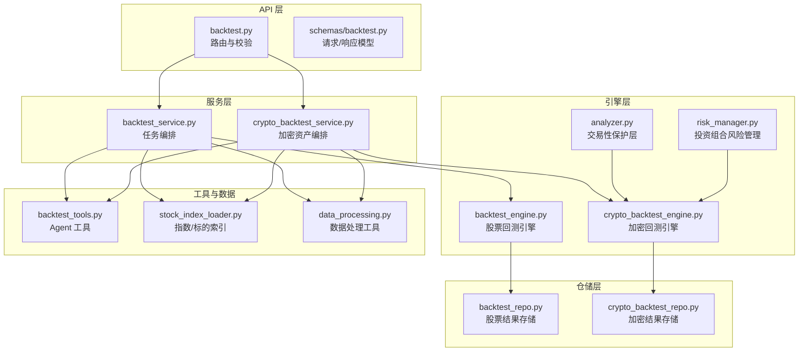
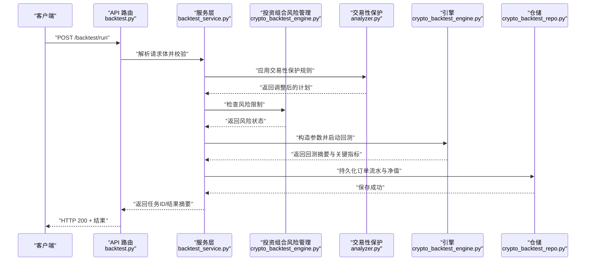
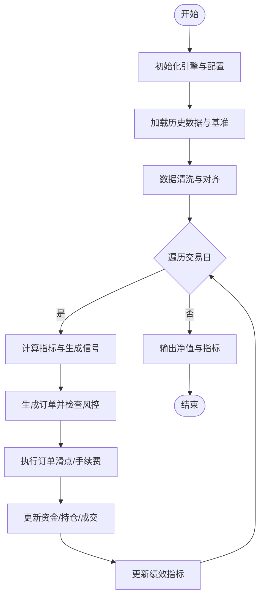
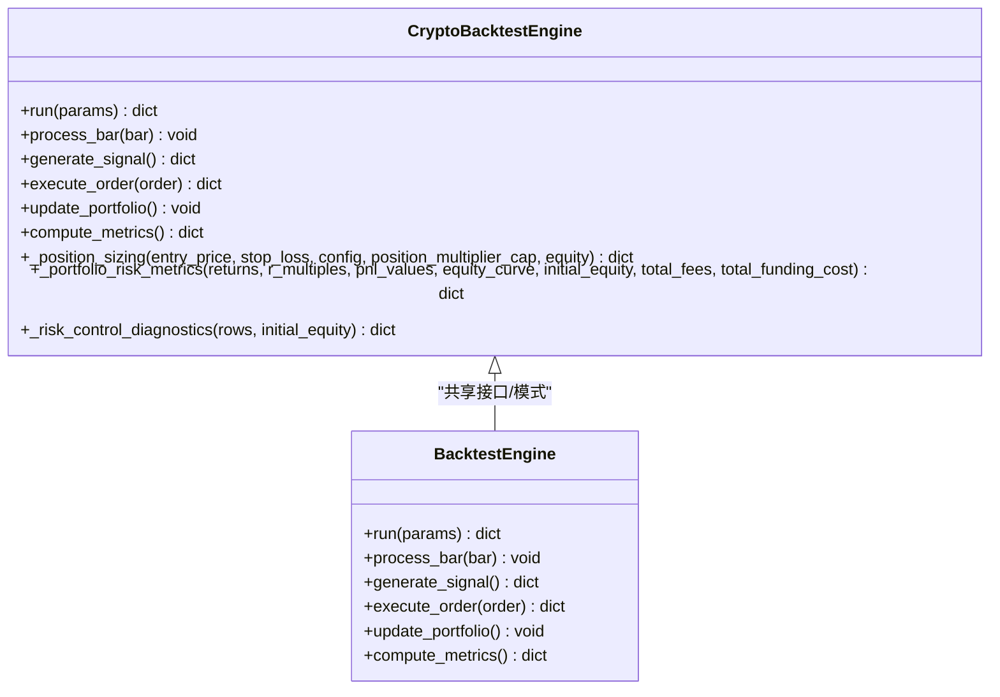
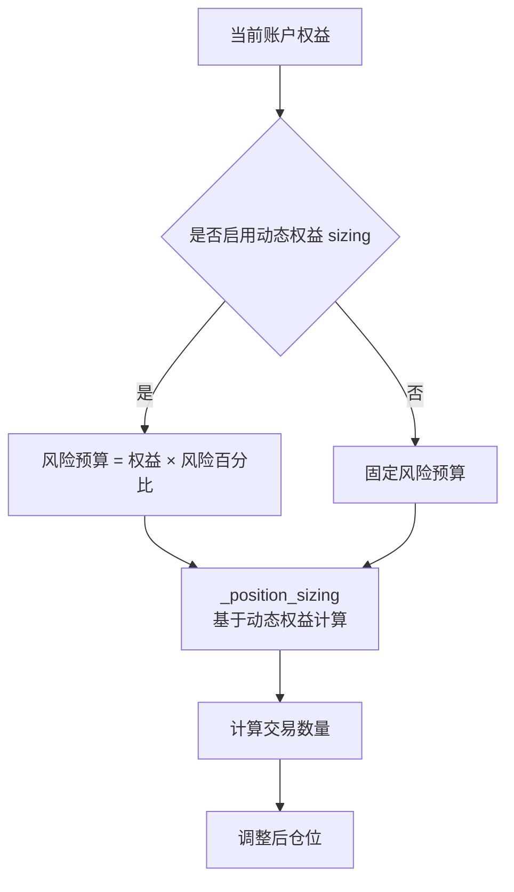
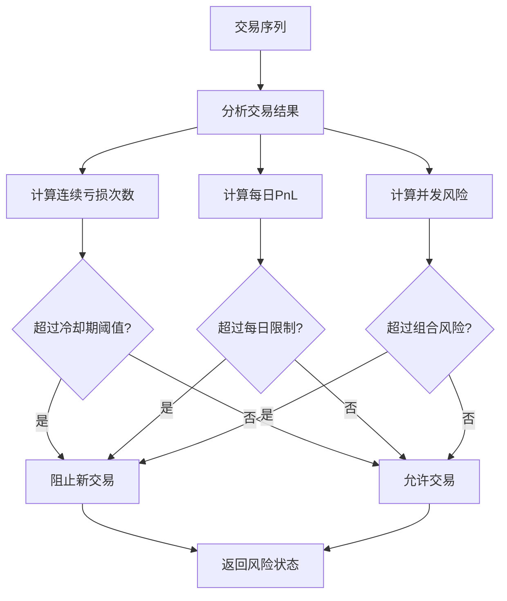
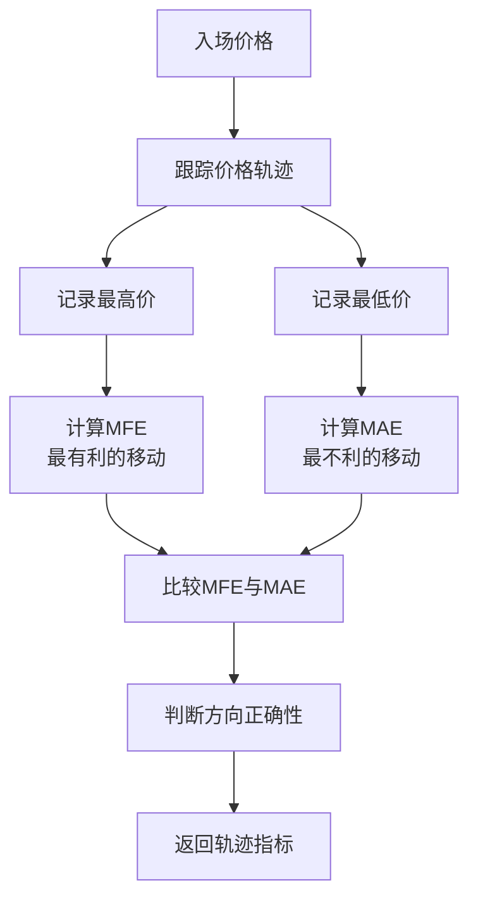
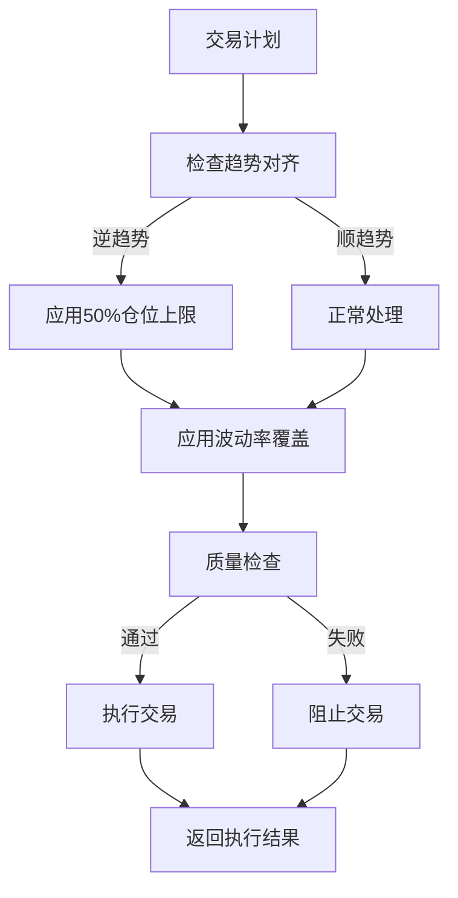
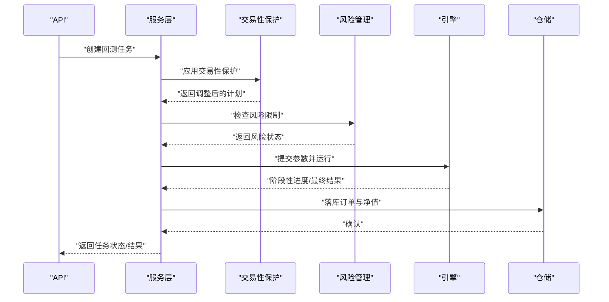
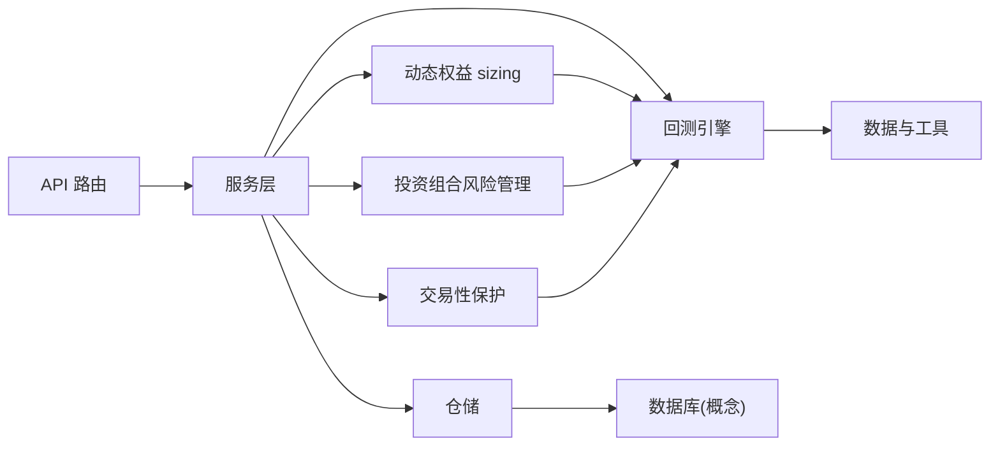

# 回测引擎

<cite>
**本文引用的文件**   
- [src/core/backtest_engine.py](file://src/core/backtest_engine.py)
- [src/core/crypto_backtest_engine.py](file://src/core/crypto_backtest_engine.py)
- [src/services/backtest_service.py](file://src/services/backtest_service.py)
- [src/services/crypto_backtest_service.py](file://src/services/crypto_backtest_service.py)
- [api/v1/endpoints/backtest.py](file://api/v1/endpoints/backtest.py)
- [api/v1/schemas/backtest.py](file://api/v1/schemas/backtest.py)
- [src/repositories/backtest_repo.py](file://src/repositories/backtest_repo.py)
- [src/repositories/crypto_backtest_repo.py](file://src/repositories/crypto_backtest_repo.py)
- [src/agent/tools/backtest_tools.py](file://src/agent/tools/backtest_tools.py)
- [src/data/stock_index_loader.py](file://src/data/stock_index_loader.py)
- [src/utils/data_processing.py](file://src/utils/data_processing.py)
- [src/analyzer.py](file://src/analyzer.py)
- [tests/test_backtest_engine.py](file://tests/test_backtest_engine.py)
- [tests/test_crypto_backtest_engine.py](file://tests/test_crypto_backtest_engine.py)
- [tests/test_backtest_service.py](file://tests/test_backtest_service.py)
- [tests/test_btc_execution_alignment.py](file://tests/test_btc_execution_alignment.py)
</cite>

## 更新摘要
**所做更改**   
- 新增动态权益 sizing 功能，支持基于当前权益的风险预算调整
- 增强投资组合风险管理，包含连续亏损冷却期和每日亏损限制
- 添加 MFE/MAE（最大有利/不利变动）跟踪功能
- 集成交易性保护系统，支持逆趋势策略仓位上限
- 完善风险评估指标，包含组合风险监控和触发条件检测
- 更新仓位管理逻辑，支持更精细的风险控制机制

## 目录
1. [简介](#简介)
2. [项目结构](#项目结构)
3. [核心组件](#核心组件)
4. [架构总览](#架构总览)
5. [详细组件分析](#详细组件分析)
6. [依赖关系分析](#依赖关系分析)
7. [性能考虑](#性能考虑)
8. [故障排查指南](#故障排查指南)
9. [结论](#结论)
10. [附录](#附录)

## 简介
本文件面向回测引擎的使用者与开发者，系统化阐述该项目的回测能力与实现方式。内容覆盖：
- 数据加载、信号生成、订单执行与绩效评估四大模块
- 历史数据处理流程、滑点模拟、手续费计算与资金管理
- **新增**：动态权益 sizing、投资组合风险限制、连续亏损冷却期、每日亏损限制
- **新增**：MFE/MAE 跟踪、交易性保护系统集成、逆趋势策略仓位上限
- 回测性能优化（并行、内存管理、缓存）
- 结果分析指标（夏普比率、最大回撤、胜率等）
- 回测脚本编写指南与批量回测功能

## 项目结构
回测相关代码主要分布在以下层次：
- API 层：提供 HTTP 接口与请求/响应模型定义
- 服务层：编排回测任务、协调引擎与存储
- 引擎层：股票与加密货币两类回测引擎，封装交易循环与绩效统计
- **新增**：动态权益 sizing 层：基于当前权益动态调整风险预算
- **新增**：投资组合风险管理层：监控连续亏损、每日亏损和组合风险
- **新增**：交易性保护层：集成逆趋势策略限制和波动率覆盖
- 仓储层：持久化回测结果与查询
- 工具与数据层：为回测提供数据加载、处理与辅助工具



**图表来源**
- [api/v1/endpoints/backtest.py:1-200](file://api/v1/endpoints/backtest.py#L1-L200)
- [api/v1/schemas/backtest.py:1-200](file://api/v1/schemas/backtest.py#L1-L200)
- [src/services/backtest_service.py:1-300](file://src/services/backtest_service.py#L1-L300)
- [src/services/crypto_backtest_service.py:1-300](file://src/services/crypto_backtest_service.py#L1-L300)
- [src/core/backtest_engine.py:1-400](file://src/core/backtest_engine.py#L1-L400)
- [src/core/crypto_backtest_engine.py:1-400](file://src/core/crypto_backtest_engine.py#L1-L400)
- [src/analyzer.py:2000-2199](file://src/analyzer.py#L2000-L2199)

**章节来源**
- [api/v1/endpoints/backtest.py:1-200](file://api/v1/endpoints/backtest.py#L1-L200)
- [api/v1/schemas/backtest.py:1-200](file://api/v1/schemas/backtest.py#L1-L200)
- [src/services/backtest_service.py:1-300](file://src/services/backtest_service.py#L1-L300)
- [src/services/crypto_backtest_service.py:1-300](file://src/services/crypto_backtest_service.py#L1-L300)
- [src/core/backtest_engine.py:1-400](file://src/core/backtest_engine.py#L1-L400)
- [src/core/crypto_backtest_engine.py:1-400](file://src/core/crypto_backtest_engine.py#L1-L400)
- [src/analyzer.py:2000-2199](file://src/analyzer.py#L2000-L2199)
- [src/repositories/backtest_repo.py:1-200](file://src/repositories/backtest_repo.py#L1-L200)
- [src/repositories/crypto_backtest_repo.py:1-200](file://src/repositories/crypto_backtest_repo.py#L1-L200)
- [src/agent/tools/backtest_tools.py:1-200](file://src/agent/tools/backtest_tools.py#L1-L200)
- [src/data/stock_index_loader.py:1-200](file://src/data/stock_index_loader.py#L1-L200)
- [src/utils/data_processing.py:1-200](file://src/utils/data_processing.py#L1-L200)

## 核心组件
- 回测引擎（股票/加密）：负责按时间步推进历史数据，调用策略产生信号，执行订单并更新资金与持仓，记录成交与净值曲线，最终输出绩效指标。
- 服务层：接收 API 请求，组装参数，调度引擎运行，支持异步与批量任务，统一异常与日志。
- **新增**：动态权益 sizing 层：基于当前账户权益动态调整风险预算和仓位大小
- **新增**：投资组合风险管理层：监控连续亏损冷却期、每日亏损限制和组合风险上限
- **新增**：交易性保护层：集成逆趋势策略限制、波动率覆盖和交易质量检查
- **新增**：MFE/MAE 跟踪层：记录最大有利变动和最大不利变动，用于绩效分析
- 仓储层：将回测结果（订单流水、净值、指标）持久化，并提供查询接口。
- Agent 工具：在对话式 Agent 中暴露回测能力，便于通过自然语言触发回测。
- 数据与工具：提供标的索引、数据清洗与常用计算函数，支撑回测的数据准备与后处理。

**章节来源**
- [src/core/backtest_engine.py:1-400](file://src/core/backtest_engine.py#L1-L400)
- [src/core/crypto_backtest_engine.py:1-400](file://src/core/crypto_backtest_engine.py#L1-L400)
- [src/analyzer.py:2000-2199](file://src/analyzer.py#L2000-L2199)
- [src/services/backtest_service.py:1-300](file://src/services/backtest_service.py#L1-L300)
- [src/services/crypto_backtest_service.py:1-300](file://src/services/crypto_backtest_service.py#L1-L300)
- [src/repositories/backtest_repo.py:1-200](file://src/repositories/backtest_repo.py#L1-L200)
- [src/repositories/crypto_backtest_repo.py:1-200](file://src/repositories/crypto_backtest_repo.py#L1-L200)
- [src/agent/tools/backtest_tools.py:1-200](file://src/agent/tools/backtest_tools.py#L1-L200)
- [src/data/stock_index_loader.py:1-200](file://src/data/stock_index_loader.py#L1-L200)
- [src/utils/data_processing.py:1-200](file://src/utils/data_processing.py#L1-L200)

## 架构总览
下图展示一次典型回测请求从 API 到引擎再到存储的完整链路，包括新增的风险管理和交易性保护功能。



**图表来源**
- [api/v1/endpoints/backtest.py:1-200](file://api/v1/endpoints/backtest.py#L1-L200)
- [src/services/backtest_service.py:1-300](file://src/services/backtest_service.py#L1-L300)
- [src/analyzer.py:2000-2199](file://src/analyzer.py#L2000-L2199)
- [src/core/crypto_backtest_engine.py:1941-2019](file://src/core/crypto_backtest_engine.py#L1941-L2019)
- [src/repositories/crypto_backtest_repo.py:1-200](file://src/repositories/crypto_backtest_repo.py#L1-L200)

## 详细组件分析

### 股票回测引擎
- 职责
  - 加载标的历史数据与基准
  - 按日频推进，计算技术指标与信号
  - 根据信号生成订单，应用滑点与手续费
  - 维护账户资金、持仓与成交明细
  - 计算净值曲线与绩效指标（如夏普比率、最大回撤、胜率等）
- 关键流程
  - 初始化：读取配置（初始资金、滑点、费率、风控阈值）
  - 数据准备：对齐时间轴、填充缺失值、标准化字段
  - 信号生成：调用策略或外部信号源
  - 订单执行：撮合逻辑、成交确认、费用扣除
  - 绩效统计：滚动窗口收益、波动率、回撤、胜率统计
- 性能要点
  - 向量化计算优先，减少 Python 循环
  - 内存复用与惰性加载，避免重复 IO
  - 可选并行：多标的并行回测



**图表来源**
- [src/core/backtest_engine.py:1-400](file://src/core/backtest_engine.py#L1-L400)
- [src/utils/data_processing.py:1-200](file://src/utils/data_processing.py#L1-L200)

**章节来源**
- [src/core/backtest_engine.py:1-400](file://src/core/backtest_engine.py#L1-L400)
- [tests/test_backtest_engine.py:1-200](file://tests/test_backtest_engine.py#L1-L200)

### 加密回测引擎
- 职责
  - 与股票引擎类似，但适配加密市场数据结构与交易规则（如 T+0、不同手续费模型）
  - 支持更细粒度的时间频率与链上/交易所数据
  - **新增**：支持动态权益 sizing，基于当前账户权益调整风险预算
  - **新增**：集成投资组合风险管理，监控连续亏损和每日亏损限制
  - **新增**：支持 MFE/MAE 跟踪，记录价格轨迹中的最大有利/不利变动
- 差异点
  - 数据源与字段映射不同
  - 滑点与手续费参数范围更大
  - 风控阈值与仓位管理策略可定制
  - **新增**：内置动态权益 sizing、风险管理和交易性保护验证机制



**图表来源**
- [src/core/crypto_backtest_engine.py:1-400](file://src/core/crypto_backtest_engine.py#L1-L400)
- [src/core/backtest_engine.py:1-400](file://src/core/backtest_engine.py#L1-L400)

**章节来源**
- [src/core/crypto_backtest_engine.py:1-400](file://src/core/crypto_backtest_engine.py#L1-L400)
- [tests/test_crypto_backtest_engine.py:1-200](file://tests/test_crypto_backtest_engine.py#L1-L200)

### 动态权益 Sizing（新增）
- 核心功能
  - **动态权益 sizing**：基于当前账户权益而非固定初始资金计算风险预算
  - **风险预算缩放**：根据当前权益按比例调整每笔交易的风险预算
  - **仓位自适应**：自动调整仓位大小以匹配当前账户规模
- 实现机制
  - `_position_sizing`方法接受`equity`参数，支持动态权益输入
  - 当`dynamic_equity_sizing=True`时，使用当前权益而非初始资金
  - 保持原有仓位计算方法不变，仅替换权益基准
- 效果验证
  - 在连续亏损后，权益下降导致风险预算自动缩减
  - 在盈利后，权益增长允许适当增加风险暴露
  - 确保仓位管理与实际账户状况保持一致



**图表来源**
- [src/core/crypto_backtest_engine.py:1400-1447](file://src/core/crypto_backtest_engine.py#L1400-L1447)
- [src/core/crypto_backtest_engine.py:1568-1645](file://src/core/crypto_backtest_engine.py#L1568-L1645)

**章节来源**
- [src/core/crypto_backtest_engine.py:1400-1447](file://src/core/crypto_backtest_engine.py#L1400-L1447)
- [src/core/crypto_backtest_engine.py:1568-1645](file://src/core/crypto_backtest_engine.py#L1568-L1645)

### 投资组合风险管理（新增）
- 核心功能
  - **连续亏损冷却期**：在连续亏损后暂停新交易一段时间
  - **每日亏损限制**：限制单日最大亏损比例
  - **组合风险上限**：监控同时持有的多个头寸的总风险暴露
- 实现机制
  - `_risk_control_diagnostics`方法分析交易序列，计算风险指标
  - 跟踪连续亏损次数、每日 PnL 和并发风险区间
  - 提供诊断信息用于决策是否阻止新交易
- 风险控制
  - 默认配置：连续亏损冷却期3次，每日亏损限制3%，组合风险上限2%
  - 支持自定义阈值配置
  - 提供详细的触发条件和历史记录



**图表来源**
- [src/core/crypto_backtest_engine.py:1941-2019](file://src/core/crypto_backtest_engine.py#L1941-L2019)

**章节来源**
- [src/core/crypto_backtest_engine.py:1941-2019](file://src/core/crypto_backtest_engine.py#L1941-L2019)

### MFE/MAE 跟踪（新增）
- 核心功能
  - **最大有利变动（MFE）**：记录交易中价格最有利的移动幅度
  - **最大不利变动（MAE）**：记录交易中价格最不利的移动幅度
  - **方向正确性判断**：基于MFE与MAE比较判断交易方向是否正确
- 实现机制
  - `_price_trajectory_metrics`方法计算每个交易的MFE和MAE
  - 支持长仓和短仓的不同计算逻辑
  - 提供方向正确性指标用于绩效分析
- 应用场景
  - 策略优化：分析入场时机和出场策略的有效性
  - 风险管理：识别过度止损或过早止盈的问题
  - 绩效归因：理解交易表现的价格驱动因素



**图表来源**
- [src/core/crypto_backtest_engine.py:1200-1224](file://src/core/crypto_backtest_engine.py#L1200-L1224)
- [src/core/crypto_backtest_engine.py:1226-1255](file://src/core/crypto_backtest_engine.py#L1226-L1255)

**章节来源**
- [src/core/crypto_backtest_engine.py:1200-1224](file://src/core/crypto_backtest_engine.py#L1200-L1224)
- [src/core/crypto_backtest_engine.py:1226-1255](file://src/core/crypto_backtest_engine.py#L1226-L1255)

### 交易性保护系统（新增）
- 核心功能
  - **逆趋势策略限制**：对逆趋势交易设置仓位上限（50%）
  - **波动率覆盖层**：基于EWMA波动预测动态调整仓位限制
  - **交易质量检查**：验证交易计划的可行性和风险收益比
- 实现机制
  - `align_btc_execution_plans`函数处理交易性保护规则
  - `_apply_btc_volatility_risk_overlay`应用波动率覆盖层
  - 支持多种保护模式和降级策略
- 保护策略
  - 逆趋势交易：仓位上限50%，有效期6根K线
  - 高波动环境：根据波动率预测调整仓位限制
  - 数据质量不足：降级为保守交易模式



**图表来源**
- [src/analyzer.py:2000-2199](file://src/analyzer.py#L2000-L2199)

**章节来源**
- [src/analyzer.py:2000-2199](file://src/analyzer.py#L2000-L2199)
- [tests/test_btc_execution_alignment.py:408-440](file://tests/test_btc_execution_alignment.py#L408-L440)

### 服务层（股票/加密）
- 职责
  - 接收 API 请求，校验参数，构建回测上下文
  - 调度引擎执行，支持同步/异步与批量任务
  - 聚合结果并写入仓储，返回统一格式
  - **新增**：集成动态权益 sizing、投资组合风险管理和交易性保护
- 关键点
  - 错误处理与重试机制
  - 任务队列与并发控制
  - 结果分页与增量查询
  - **新增**：支持动态权益配置和风险限制参数



**图表来源**
- [src/services/backtest_service.py:1-300](file://src/services/backtest_service.py#L1-L300)
- [src/services/crypto_backtest_service.py:1-300](file://src/services/crypto_backtest_service.py#L1-L300)
- [src/analyzer.py:2000-2199](file://src/analyzer.py#L2000-L2199)
- [src/repositories/backtest_repo.py:1-200](file://src/repositories/backtest_repo.py#L1-L200)
- [src/repositories/crypto_backtest_repo.py:1-200](file://src/repositories/crypto_backtest_repo.py#L1-L200)

**章节来源**
- [src/services/backtest_service.py:1-300](file://src/services/backtest_service.py#L1-L300)
- [src/services/crypto_backtest_service.py:1-300](file://src/services/crypto_backtest_service.py#L1-L300)
- [tests/test_backtest_service.py:1-200](file://tests/test_backtest_service.py#L1-L200)

### API 与模型
- 路由
  - 提供"单次回测""批量回测""结果查询"等端点
  - 统一鉴权、限流与错误码
- 模型
  - 定义回测输入（标的、时间窗、策略参数、风控参数）
  - 定义回测输出（净值、指标、订单明细、报告摘要）
  - **新增**：支持动态权益 sizing、投资组合风险限制和交易性保护参数

**章节来源**
- [api/v1/endpoints/backtest.py:1-200](file://api/v1/endpoints/backtest.py#L1-L200)
- [api/v1/schemas/backtest.py:1-200](file://api/v1/schemas/backtest.py#L1-L200)

### Agent 工具
- 作用
  - 在对话式 Agent 中暴露回测能力，用户可通过自然语言触发回测
- 能力
  - 参数自动补全与校验
  - 结果摘要与可视化链接
  - **新增**：支持高级风险管理参数的自然语言配置

**章节来源**
- [src/agent/tools/backtest_tools.py:1-200](file://src/agent/tools/backtest_tools.py#L1-L200)

### 数据与工具
- 标的索引
  - 提供股票/指数映射与筛选，加速数据加载
- 数据处理
  - 缺失值处理、时间对齐、字段标准化、滚动窗口计算
  - **新增**：支持MFE/MAE计算和轨迹分析工具

**章节来源**
- [src/data/stock_index_loader.py:1-200](file://src/data/stock_index_loader.py#L1-L200)
- [src/utils/data_processing.py:1-200](file://src/utils/data_processing.py#L1-L200)

## 依赖关系分析
- 耦合度
  - 服务层对引擎与仓储有强依赖；引擎内部高内聚（数据→信号→执行→统计）
  - **新增**：动态权益 sizing、投资组合风险管理和交易性保护作为独立模块，通过标准接口与回测引擎交互
- 外部依赖
  - 数据源（本地/远程）、消息队列（可选）、数据库（可选）
- 潜在风险
  - 数据质量不一致导致信号偏差
  - 并发任务过多导致资源争用
  - **新增**：动态权益计算可能引入额外的复杂性
  - **新增**：投资组合风险管理需要准确的交易时序数据



**图表来源**
- [api/v1/endpoints/backtest.py:1-200](file://api/v1/endpoints/backtest.py#L1-L200)
- [src/services/backtest_service.py:1-300](file://src/services/backtest_service.py#L1-L300)
- [src/core/backtest_engine.py:1-400](file://src/core/backtest_engine.py#L1-L400)
- [src/analyzer.py:2000-2199](file://src/analyzer.py#L2000-L2199)
- [src/repositories/backtest_repo.py:1-200](file://src/repositories/backtest_repo.py#L1-L200)

**章节来源**
- [api/v1/endpoints/backtest.py:1-200](file://api/v1/endpoints/backtest.py#L1-L200)
- [src/services/backtest_service.py:1-300](file://src/services/backtest_service.py#L1-L300)
- [src/core/backtest_engine.py:1-400](file://src/core/backtest_engine.py#L1-L400)
- [src/analyzer.py:2000-2199](file://src/analyzer.py#L2000-L2199)
- [src/repositories/backtest_repo.py:1-200](file://src/repositories/backtest_repo.py#L1-L200)

## 性能考虑
- 并行计算
  - 多标的并行回测：按标的划分任务，使用线程池/进程池
  - 批处理：批量提交回测任务，合并结果
- 内存管理
  - 惰性加载与分块读取，避免一次性载入大表
  - 数值类型降精度（如 float32）与对象复用
- 缓存策略
  - 指标与中间结果缓存（按标的+时间窗键）
  - 热点数据本地缓存（LRU）
- I/O 优化
  - 预取与异步读取，减少阻塞
  - 压缩存储与列式格式（如 Parquet）
- **新增**：动态权益 sizing 优化
  - 缓存权益计算结果，避免重复计算
  - 支持批量处理多个交易的权益更新
- **新增**：投资组合风险管理优化
  - 增量更新风险指标，避免全量重算
  - 支持滑动窗口的高效计算

[本节为通用指导，不直接分析具体文件]

## 故障排查指南
- 常见问题
  - 数据缺失或时间不对齐：检查清洗与对齐逻辑
  - 信号异常：核对指标计算与阈值
  - 订单未成交：检查流动性假设与价格限制
  - 资金不足：核对仓位管理与风控阈值
  - **新增**：动态权益 sizing 问题：检查权益数据质量和 sizing 配置
  - **新增**：投资组合风险管理问题：检查交易时序数据和风险阈值配置
  - **新增**：交易性保护问题：检查趋势对齐和波动率数据质量
- 定位方法
  - 查看订单流水与净值曲线，定位异常时点
  - 打印关键中间变量（信号、成交价、费用）
  - 缩小回测区间进行复现
  - **新增**：检查动态权益计算过程和风险指标变化
  - **新增**：分析交易性保护规则和触发条件
- 建议
  - 增加断言与边界用例测试
  - 引入回放模式对比真实成交
  - **新增**：测试不同市场环境下动态权益 sizing 的效果
  - **新增**：验证投资组合风险管理在不同交易频率下的准确性

**章节来源**
- [tests/test_backtest_engine.py:1-200](file://tests/test_backtest_engine.py#L1-L200)
- [tests/test_crypto_backtest_engine.py:1-200](file://tests/test_crypto_backtest_engine.py#L1-L200)
- [tests/test_backtest_service.py:1-200](file://tests/test_backtest_service.py#L1-L200)
- [tests/test_btc_execution_alignment.py:408-440](file://tests/test_btc_execution_alignment.py#L408-L440)

## 结论
本项目提供了完整的回测引擎体系，涵盖数据、信号、执行与绩效评估全流程，并通过服务层与 API 对外暴露能力。**新增的动态权益 sizing、投资组合风险管理、MFE/MAE 跟踪和交易性保护系统**进一步增强了风险管理和绩效分析能力。这些新功能能够在不同市场环境下自动调整仓位规模，提供更精确的风险控制和更深入的绩效洞察。通过合理的并行、内存与缓存策略，可在保证准确性的同时提升回测效率。建议在策略迭代过程中结合单元测试与回归测试，确保稳定性与可复现性。

[本节为总结性内容，不直接分析具体文件]

## 附录

### 回测结果分析指标
- 收益类：累计收益率、年化收益、超额收益
- 风险类：波动率、最大回撤、下行风险
- 风险调整后：夏普比率、索提诺比率、卡玛比率
- 交易行为：胜率、盈亏比、平均持仓时长、换手率
- 稳健性：蒙特卡洛/滚动窗口稳定性
- **新增**：动态权益 sizing 指标：权益变化对风险预算的影响
- **新增**：投资组合风险管理指标：连续亏损次数、每日亏损统计、并发风险水平
- **新增**：MFE/MAE 指标：最大有利变动、最大不利变动、方向正确性
- **新增**：交易性保护指标：逆趋势限制应用情况、波动率覆盖效果

[本节为通用指标说明，不直接分析具体文件]

### 回测脚本编写指南
- 基本步骤
  - 选择标的与时间窗
  - 设置初始资金、滑点、手续费与风控参数
  - 编写或选择策略信号
  - **新增**：配置动态权益 sizing 参数（如启用开关、风险百分比）
  - **新增**：设置投资组合风险管理参数（冷却期、每日限制、组合上限）
  - **新增**：配置交易性保护规则（逆趋势限制、波动率覆盖）
  - 运行回测并导出净值与指标
- 最佳实践
  - 先小样本验证，再扩大范围
  - 固定随机种子，保证可复现
  - 记录参数与数据版本
  - **新增**：测试不同市场环境下动态权益 sizing 的效果
  - **新增**：验证投资组合风险管理在不同交易频率下的准确性

[本节为通用指南，不直接分析具体文件]

### 批量回测功能
- 使用方式
  - 通过 API 提交多个回测任务，支持分批与优先级
  - 查询任务状态与汇总结果
- 注意事项
  - 控制并发度，避免资源耗尽
  - 合理拆分任务，平衡粒度与开销
  - **新增**：批量应用动态权益 sizing，提高处理效率
  - **新增**：批量计算投资组合风险指标，支持并行处理

[本节为通用功能说明，不直接分析具体文件]

### 动态权益 sizing 配置示例
- 基础配置
  ```python
  # 启用动态权益 sizing
  dynamic_equity_sizing = True
  
  # 设置风险百分比
  risk_per_trade_pct = 1.0
  
  # 在回测配置中传递
  config = CryptoPlanBacktestConfig(
      initial_equity=10000,
      risk_per_trade_pct=1.0,
      max_notional_pct=100,
      leverage=1.0,
      dynamic_equity_sizing=True
  )
  
  # 执行回测时使用当前权益
  result = CryptoBacktestEngine._position_sizing(
      entry_price=100,
      stop_loss=95,
      config=config,
      position_multiplier_cap=1.0,
      equity=current_equity  # 当前账户权益
  )
  ```
- 预期效果
  - 权益增长时风险预算相应增加
  - 权益下降时风险预算自动缩减
  - 保持仓位管理与实际账户状况一致

[本节为配置示例，不直接分析具体文件]

### 投资组合风险管理配置示例
- 基础配置
  ```python
  # 设置风险管理参数
  consecutive_loss_cooldown = 3  # 连续亏损冷却期
  daily_loss_limit_pct = 3.0     # 每日亏损限制
  max_portfolio_risk_pct = 2.0   # 组合风险上限
  
  # 在回测配置中传递
  config = CryptoPlanBacktestConfig(
      initial_equity=10000,
      risk_per_trade_pct=1.0,
      max_notional_pct=100,
      leverage=1.0,
      consecutive_loss_cooldown=3,
      daily_loss_limit_pct=3.0,
      max_portfolio_risk_pct=2.0
  )
  ```
- 预期效果
  - 连续亏损3次后暂停新交易
  - 单日亏损超过3%时触发限制
  - 并发风险超过2%时发出警告

[本节为配置示例，不直接分析具体文件]

### MFE/MAE 分析示例
- 基本用法
  ```python
  # 计算价格轨迹指标
  trajectory = CryptoBacktestEngine._price_trajectory_metrics(
      direction="long",
      reference_price=entry_price,
      trade_bars=trade_bars
  )
  
  # 获取MFE和MAE
  mfe_pct = trajectory["mfe_pct"]
  mae_pct = trajectory["mae_pct"]
  direction_correct = trajectory["direction_correct"]
  ```
- 分析应用
  - 优化入场时机：分析MFE分布确定最佳入场点
  - 改进出场策略：基于MAE分析调整止损设置
  - 绩效归因：理解交易表现的价格驱动因素

[本节为分析示例，不直接分析具体文件]

### 交易性保护配置示例
- 基础配置
  ```python
  # 技术上下文配置
  technical_context = {
      "timeframes": {
          "hourly": {
              "alignment": "countertrend_long",  # 逆趋势
              "daily_bias": "short",             # 日线看空
              "hourly_bias": "long"              # 小时线看涨
          }
      },
      "derivatives": {
          "data_quality": "available",
          "order_flow": {"data_quality": "available"}
      }
  }
  
  # 应用交易性保护
  aligned = align_btc_execution_plans(
      result,
      runtime_config=_runtime_config(),
      technical_context=technical_context
  )
  ```
- 预期效果
  - 逆趋势交易仓位限制为50%
  - 有效期限制为6根K线
  - 自动添加交易性保护标记

[本节为配置示例，不直接分析具体文件]