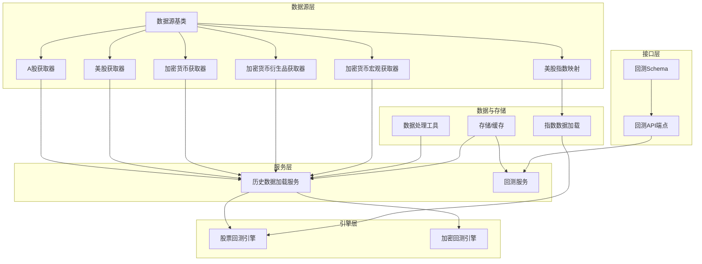
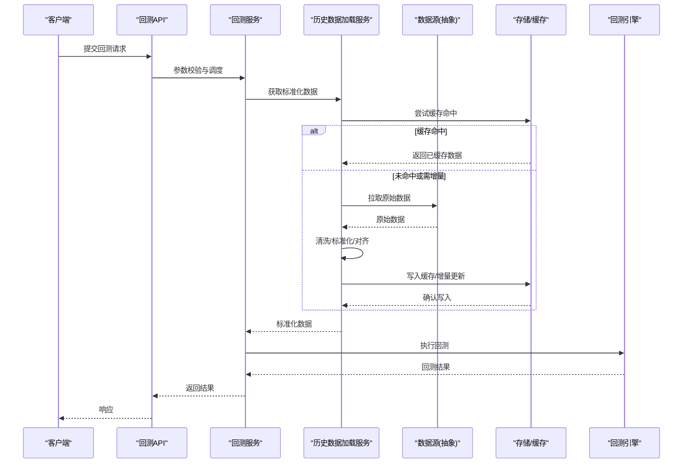
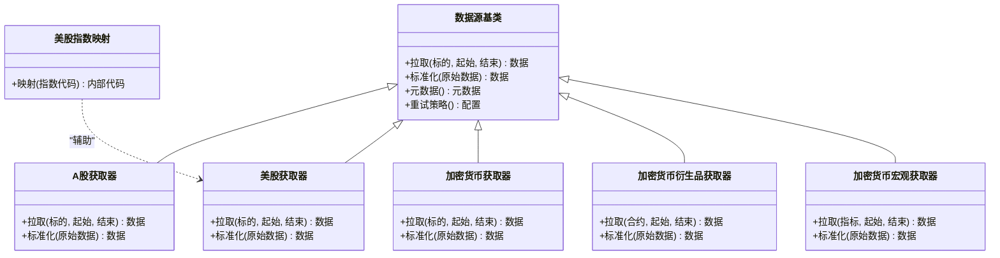
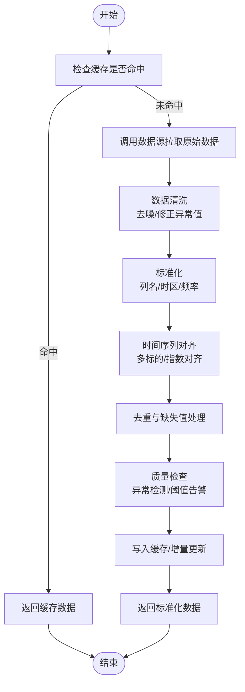
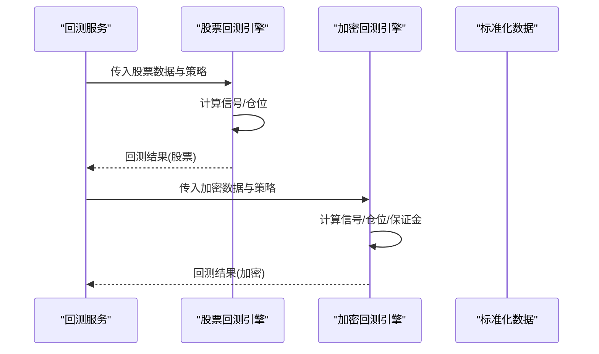
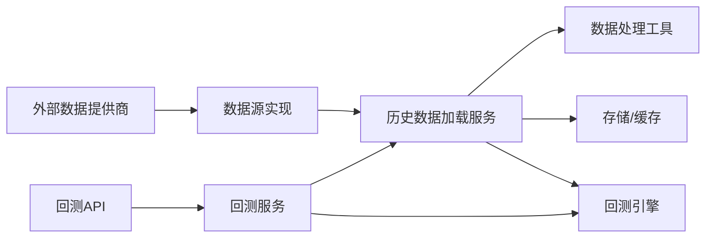

# 回测数据管理

<cite>
**本文引用的文件**   
- [data_provider/base.py](file://data_provider/base.py)
- [data_provider/akshare_fetcher.py](file://data_provider/akshare_fetcher.py)
- [data_provider/tushare_fetcher.py](file://data_provider/tushare_fetcher.py)
- [data_provider/yfinance_fetcher.py](file://data_provider/yfinance_fetcher.py)
- [data_provider/crypto_fetcher.py](file://data_provider/crypto_fetcher.py)
- [data_provider/crypto_derivatives_fetcher.py](file://data_provider/crypto_derivatives_fetcher.py)
- [data_provider/crypto_macro_fetcher.py](file://data_provider/crypto_macro_fetcher.py)
- [data_provider/us_index_mapping.py](file://data_provider/us_index_mapping.py)
- [src/services/history_loader.py](file://src/services/history_loader.py)
- [src/services/backtest_service.py](file://src/services/backtest_service.py)
- [src/core/backtest_engine.py](file://src/core/backtest_engine.py)
- [src/core/crypto_backtest_engine.py](file://src/core/crypto_backtest_engine.py)
- [src/data/stock_index_loader.py](file://src/data/stock_index_loader.py)
- [src/utils/data_processing.py](file://src/utils/data_processing.py)
- [src/storage.py](file://src/storage.py)
- [api/v1/endpoints/backtest.py](file://api/v1/endpoints/backtest.py)
- [api/v1/schemas/backtest.py](file://api/v1/schemas/backtest.py)
</cite>

## 目录
1. [简介](#简介)
2. [项目结构](#项目结构)
3. [核心组件](#核心组件)
4. [架构总览](#架构总览)
5. [详细组件分析](#详细组件分析)
6. [依赖关系分析](#依赖关系分析)
7. [性能考量](#性能考量)
8. [故障排查指南](#故障排查指南)
9. [结论](#结论)
10. [附录：扩展数据源与自定义格式指南](#附录扩展数据源与自定义格式指南)

## 简介
本文件面向“回测数据管理系统”的技术文档，聚焦以下目标：
- 抽象设计与实现：统一的数据源抽象、股票/加密货币/指数数据的获取机制。
- 预处理流程：清洗、标准化、时间序列对齐等关键步骤。
- 缓存策略：本地缓存、增量更新、一致性保证。
- 数据质量监控：异常检测、缺失值处理、重复数据清理。
- 扩展指南：如何新增数据提供商与自定义数据格式。

## 项目结构
系统围绕“数据提供者抽象层 + 多数据源实现 + 历史数据加载服务 + 回测引擎 + 存储与API”组织：
- data_provider：数据源抽象与具体实现（A股、美股、加密货币、衍生品、宏观指标、指数映射）。
- src/services：历史数据加载、回测服务等业务编排。
- src/core：回测引擎（股票与加密资产）。
- src/data：指数数据加载。
- src/utils：数据处理工具（清洗、对齐等）。
- src/storage：持久化与缓存。
- api：对外接口（回测相关端点与Schema）。

**图表来源** 
- [data_provider/base.py:1-200](file://data_provider/base.py#L1-L200)
- [data_provider/akshare_fetcher.py:1-200](file://data_provider/akshare_fetcher.py#L1-L200)
- [data_provider/tushare_fetcher.py:1-200](file://data_provider/tushare_fetcher.py#L1-L200)
- [data_provider/yfinance_fetcher.py:1-200](file://data_provider/yfinance_fetcher.py#L1-L200)
- [data_provider/crypto_fetcher.py:1-200](file://data_provider/crypto_fetcher.py#L1-L200)
- [data_provider/crypto_derivatives_fetcher.py:1-200](file://data_provider/crypto_derivatives_fetcher.py#L1-L200)
- [data_provider/crypto_macro_fetcher.py:1-200](file://data_provider/crypto_macro_fetcher.py#L1-L200)
- [data_provider/us_index_mapping.py:1-200](file://data_provider/us_index_mapping.py#L1-L200)
- [src/services/history_loader.py:1-200](file://src/services/history_loader.py#L1-L200)
- [src/services/backtest_service.py:1-200](file://src/services/backtest_service.py#L1-L200)
- [src/core/backtest_engine.py:1-200](file://src/core/backtest_engine.py#L1-L200)
- [src/core/crypto_backtest_engine.py:1-200](file://src/core/crypto_backtest_engine.py#L1-L200)
- [src/data/stock_index_loader.py:1-200](file://src/data/stock_index_loader.py#L1-L200)
- [src/utils/data_processing.py:1-200](file://src/utils/data_processing.py#L1-L200)
- [src/storage.py:1-200](file://src/storage.py#L1-L200)
- [api/v1/endpoints/backtest.py:1-200](file://api/v1/endpoints/backtest.py#L1-L200)
- [api/v1/schemas/backtest.py:1-200](file://api/v1/schemas/backtest.py#L1-L200)

**章节来源**
- [data_provider/base.py:1-200](file://data_provider/base.py#L1-L200)
- [src/services/history_loader.py:1-200](file://src/services/history_loader.py#L1-L200)
- [src/core/backtest_engine.py:1-200](file://src/core/backtest_engine.py#L1-L200)
- [src/core/crypto_backtest_engine.py:1-200](file://src/core/crypto_backtest_engine.py#L1-L200)
- [src/data/stock_index_loader.py:1-200](file://src/data/stock_index_loader.py#L1-L200)
- [src/utils/data_processing.py:1-200](file://src/utils/data_processing.py#L1-L200)
- [src/storage.py:1-200](file://src/storage.py#L1-L200)
- [api/v1/endpoints/backtest.py:1-200](file://api/v1/endpoints/backtest.py#L1-L200)
- [api/v1/schemas/backtest.py:1-200](file://api/v1/schemas/backtest.py#L1-L200)

## 核心组件
- 数据源抽象与实现：通过统一的基类定义拉取、标准化、元数据返回的契约；各具体Fetcher按市场适配。
- 历史数据加载服务：聚合多个数据源，负责缓存命中、增量更新、去重与对齐。
- 回测引擎：分别针对股票与加密资产提供回测执行能力，消费标准化的时序数据。
- 指数数据加载：维护指数映射与加载逻辑，为回测提供基准。
- 数据处理工具：清洗、填充、对齐、异常检测等通用方法。
- 存储与缓存：本地文件/内存缓存、版本标记、一致性校验。
- API层：暴露回测任务创建、查询、结果获取等接口。

**章节来源**
- [data_provider/base.py:1-200](file://data_provider/base.py#L1-L200)
- [src/services/history_loader.py:1-200](file://src/services/history_loader.py#L1-L200)
- [src/core/backtest_engine.py:1-200](file://src/core/backtest_engine.py#L1-L200)
- [src/core/crypto_backtest_engine.py:1-200](file://src/core/crypto_backtest_engine.py#L1-L200)
- [src/data/stock_index_loader.py:1-200](file://src/data/stock_index_loader.py#L1-L200)
- [src/utils/data_processing.py:1-200](file://src/utils/data_processing.py#L1-L200)
- [src/storage.py:1-200](file://src/storage.py#L1-L200)
- [api/v1/endpoints/backtest.py:1-200](file://api/v1/endpoints/backtest.py#L1-L200)

## 架构总览
整体采用分层解耦设计：
- 数据源层：抽象+多实现，屏蔽不同提供商差异。
- 服务层：编排数据拉取、缓存、预处理、质量检查。
- 引擎层：回测执行，读取标准化数据并运行策略。
- 存储层：本地缓存与持久化，支持增量与一致性。
- 接口层：REST API与Pydantic Schema校验。

**图表来源** 
- [api/v1/endpoints/backtest.py:1-200](file://api/v1/endpoints/backtest.py#L1-L200)
- [src/services/backtest_service.py:1-200](file://src/services/backtest_service.py#L1-L200)
- [src/services/history_loader.py:1-200](file://src/services/history_loader.py#L1-L200)
- [data_provider/base.py:1-200](file://data_provider/base.py#L1-L200)
- [src/storage.py:1-200](file://src/storage.py#L1-L200)
- [src/core/backtest_engine.py:1-200](file://src/core/backtest_engine.py#L1-L200)
- [src/core/crypto_backtest_engine.py:1-200](file://src/core/crypto_backtest_engine.py#L1-L200)

## 详细组件分析

### 数据源抽象与具体实现
- 抽象基类定义了统一的拉取接口、字段映射、错误处理与重试策略。
- 具体实现包括：
  - A股：AkShare、Tushare、EFinance、Baostock、Longbridge、Tencent、Tickflow等。
  - 美股与指数：yfinance、US指数映射。
  - 加密货币：现货、衍生品、宏观指标、WebSocket行情。
- 每个Fetcher负责将原始数据转换为标准列名与时区，便于后续对齐。

**图表来源** 
- [data_provider/base.py:1-200](file://data_provider/base.py#L1-L200)
- [data_provider/akshare_fetcher.py:1-200](file://data_provider/akshare_fetcher.py#L1-L200)
- [data_provider/tushare_fetcher.py:1-200](file://data_provider/tushare_fetcher.py#L1-L200)
- [data_provider/yfinance_fetcher.py:1-200](file://data_provider/yfinance_fetcher.py#L1-L200)
- [data_provider/crypto_fetcher.py:1-200](file://data_provider/crypto_fetcher.py#L1-L200)
- [data_provider/crypto_derivatives_fetcher.py:1-200](file://data_provider/crypto_derivatives_fetcher.py#L1-L200)
- [data_provider/crypto_macro_fetcher.py:1-200](file://data_provider/crypto_macro_fetcher.py#L1-L200)
- [data_provider/us_index_mapping.py:1-200](file://data_provider/us_index_mapping.py#L1-L200)

**章节来源**
- [data_provider/base.py:1-200](file://data_provider/base.py#L1-L200)
- [data_provider/akshare_fetcher.py:1-200](file://data_provider/akshare_fetcher.py#L1-L200)
- [data_provider/tushare_fetcher.py:1-200](file://data_provider/tushare_fetcher.py#L1-L200)
- [data_provider/yfinance_fetcher.py:1-200](file://data_provider/yfinance_fetcher.py#L1-L200)
- [data_provider/crypto_fetcher.py:1-200](file://data_provider/crypto_fetcher.py#L1-L200)
- [data_provider/crypto_derivatives_fetcher.py:1-200](file://data_provider/crypto_derivatives_fetcher.py#L1-L200)
- [data_provider/crypto_macro_fetcher.py:1-200](file://data_provider/crypto_macro_fetcher.py#L1-L200)
- [data_provider/us_index_mapping.py:1-200](file://data_provider/us_index_mapping.py#L1-L200)

### 历史数据加载服务与预处理
- 职责：
  - 根据标的类型选择合适的数据源。
  - 优先从本地缓存读取，未命中则调用数据源拉取。
  - 执行数据清洗、标准化、时间戳对齐、去重、缺失值处理。
  - 写入缓存并记录版本与一致性信息。
- 预处理流程关键点：
  - 清洗：去除无效行、修正异常值、统一币种/单位。
  - 标准化：统一列名、时区、频率（日线/分钟线）。
  - 对齐：基于交易日/交易时段对齐多标的与指数。
  - 质量：异常检测（跳变、NaN比例）、去重（主键+时间戳）。

**图表来源** 
- [src/services/history_loader.py:1-200](file://src/services/history_loader.py#L1-L200)
- [src/utils/data_processing.py:1-200](file://src/utils/data_processing.py#L1-L200)
- [src/storage.py:1-200](file://src/storage.py#L1-L200)

**章节来源**
- [src/services/history_loader.py:1-200](file://src/services/history_loader.py#L1-L200)
- [src/utils/data_processing.py:1-200](file://src/utils/data_processing.py#L1-L200)
- [src/storage.py:1-200](file://src/storage.py#L1-L200)

### 回测引擎（股票与加密）
- 股票回测引擎：
  - 输入：标准化日线/分钟线数据、策略参数、资金与手续费设置。
  - 输出：交易信号、持仓变化、收益曲线、风险指标。
- 加密回测引擎：
  - 输入：标准化加密资产数据（含衍生品可选）、杠杆/保证金参数。
  - 输出：交易记录、PnL、回撤、夏普比率等。

**图表来源** 
- [src/core/backtest_engine.py:1-200](file://src/core/backtest_engine.py#L1-L200)
- [src/core/crypto_backtest_engine.py:1-200](file://src/core/crypto_backtest_engine.py#L1-L200)
- [src/services/backtest_service.py:1-200](file://src/services/backtest_service.py#L1-L200)

**章节来源**
- [src/core/backtest_engine.py:1-200](file://src/core/backtest_engine.py#L1-L200)
- [src/core/crypto_backtest_engine.py:1-200](file://src/core/crypto_backtest_engine.py#L1-L200)
- [src/services/backtest_service.py:1-200](file://src/services/backtest_service.py#L1-L200)

### 指数数据加载
- 功能：维护指数映射表，加载指数时序数据，用于基准对比与策略评估。
- 特点：支持美股指数映射与跨市场指数对齐。

**章节来源**
- [src/data/stock_index_loader.py:1-200](file://src/data/stock_index_loader.py#L1-L200)
- [data_provider/us_index_mapping.py:1-200](file://data_provider/us_index_mapping.py#L1-L200)

### 数据存储与缓存策略
- 本地缓存：以标的+时间范围+版本为键，存储标准化后的数据。
- 增量更新：仅拉取新增时间段数据，合并后覆盖旧版本。
- 一致性保证：写入前进行校验（哈希/行数/时间边界），失败回滚。
- 失效策略：过期时间、手动刷新、依赖变更触发重建。

**章节来源**
- [src/storage.py:1-200](file://src/storage.py#L1-L200)
- [src/services/history_loader.py:1-200](file://src/services/history_loader.py#L1-L200)

### API与Schema
- 回测API端点：创建任务、查询状态、获取结果。
- Schema：严格校验请求参数与返回结构，确保前后端一致。

**章节来源**
- [api/v1/endpoints/backtest.py:1-200](file://api/v1/endpoints/backtest.py#L1-L200)
- [api/v1/schemas/backtest.py:1-200](file://api/v1/schemas/backtest.py#L1-L200)

## 依赖关系分析
- 数据源层对具体提供商库存在直接依赖（如AkShare、Tushare、yfinance等）。
- 历史数据加载服务依赖存储与数据处理工具。
- 回测引擎依赖标准化数据，不感知数据源细节。
- API层依赖Schema与服务层，保持接口稳定。

**图表来源** 
- [data_provider/base.py:1-200](file://data_provider/base.py#L1-L200)
- [src/services/history_loader.py:1-200](file://src/services/history_loader.py#L1-L200)
- [src/utils/data_processing.py:1-200](file://src/utils/data_processing.py#L1-L200)
- [src/storage.py:1-200](file://src/storage.py#L1-L200)
- [src/core/backtest_engine.py:1-200](file://src/core/backtest_engine.py#L1-L200)
- [src/core/crypto_backtest_engine.py:1-200](file://src/core/crypto_backtest_engine.py#L1-L200)
- [api/v1/endpoints/backtest.py:1-200](file://api/v1/endpoints/backtest.py#L1-L200)

**章节来源**
- [data_provider/base.py:1-200](file://data_provider/base.py#L1-L200)
- [src/services/history_loader.py:1-200](file://src/services/history_loader.py#L1-L200)
- [src/utils/data_processing.py:1-200](file://src/utils/data_processing.py#L1-L200)
- [src/storage.py:1-200](file://src/storage.py#L1-L200)
- [src/core/backtest_engine.py:1-200](file://src/core/backtest_engine.py#L1-L200)
- [src/core/crypto_backtest_engine.py:1-200](file://src/core/crypto_backtest_engine.py#L1-L200)
- [api/v1/endpoints/backtest.py:1-200](file://api/v1/endpoints/backtest.py#L1-L200)

## 性能考量
- 缓存命中率优化：合理划分时间窗口与标的粒度，避免冷数据频繁拉取。
- 增量更新：仅拉取新增区间，减少网络与IO开销。
- 并发控制：并行拉取多标的但限制并发度，避免限流与超时。
- 内存占用：大文件分块处理，及时释放中间对象。
- 对齐效率：使用向量化操作与索引优化时间对齐。

[本节为通用指导，无需引用具体文件]

## 故障排查指南
- 数据缺失：检查缓存版本与时间边界，确认增量更新是否成功。
- 异常值：查看质量检查日志，定位跳变与NaN比例过高的标的。
- 重复数据：核对主键与时间戳唯一性约束，必要时重建索引。
- 网络超时：调整重试策略与超时阈值，切换备用数据源。
- 一致性校验失败：检查写入原子性与回滚逻辑，确认哈希比对。

**章节来源**
- [src/services/history_loader.py:1-200](file://src/services/history_loader.py#L1-L200)
- [src/utils/data_processing.py:1-200](file://src/utils/data_processing.py#L1-L200)
- [src/storage.py:1-200](file://src/storage.py#L1-L200)

## 结论
本系统通过统一的数据源抽象、完善的历史数据加载与预处理、稳健的缓存与一致性保障，以及清晰的API与Schema设计，构建了可扩展、高性能的回测数据管理基础设施。未来可继续增强数据质量监控与自动化修复能力，进一步提升稳定性与可维护性。

[本节为总结，无需引用具体文件]

## 附录：扩展数据源与自定义格式指南
- 新增数据提供商步骤：
  1. 在data_provider下新建Fetcher，继承数据源基类，实现拉取与标准化接口。
  2. 注册到路由或工厂，以便历史数据加载服务自动发现。
  3. 编写单元测试验证数据正确性与异常处理。
- 自定义数据格式：
  1. 在数据处理工具中新增解析器，将原始格式转为标准列与时区。
  2. 在历史数据加载服务中集成该解析器，参与清洗与对齐流程。
  3. 更新Schema与API文档，确保前端与后端一致。
- 最佳实践：
  - 保持向后兼容，新增字段默认空值。
  - 明确错误码与日志级别，便于问题定位。
  - 提供降级与回退路径，提高鲁棒性。

**章节来源**
- [data_provider/base.py:1-200](file://data_provider/base.py#L1-L200)
- [src/utils/data_processing.py:1-200](file://src/utils/data_processing.py#L1-L200)
- [src/services/history_loader.py:1-200](file://src/services/history_loader.py#L1-L200)
- [api/v1/schemas/backtest.py:1-200](file://api/v1/schemas/backtest.py#L1-L200)