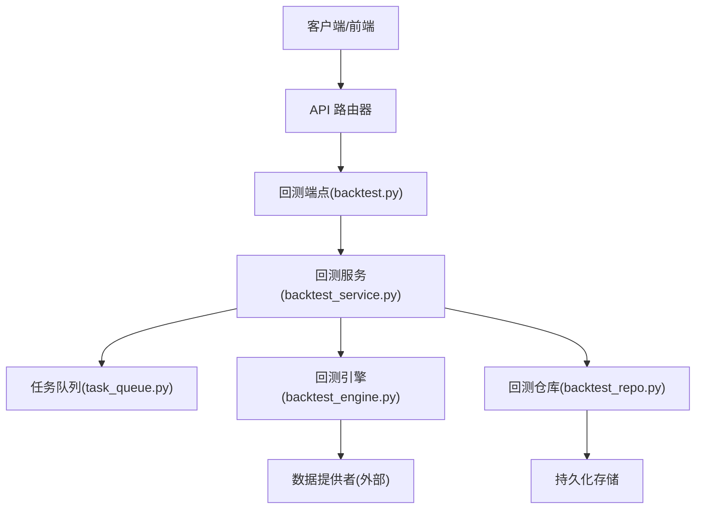
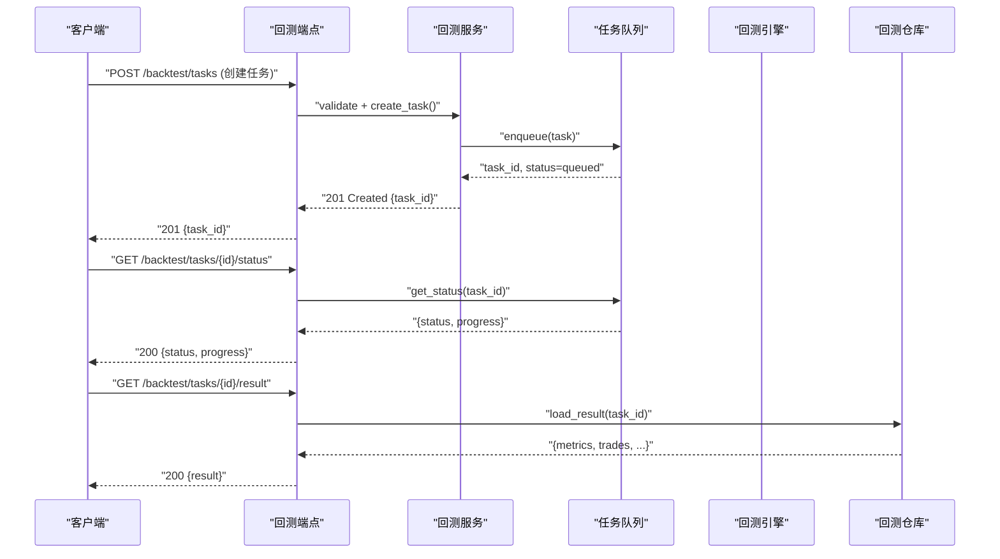
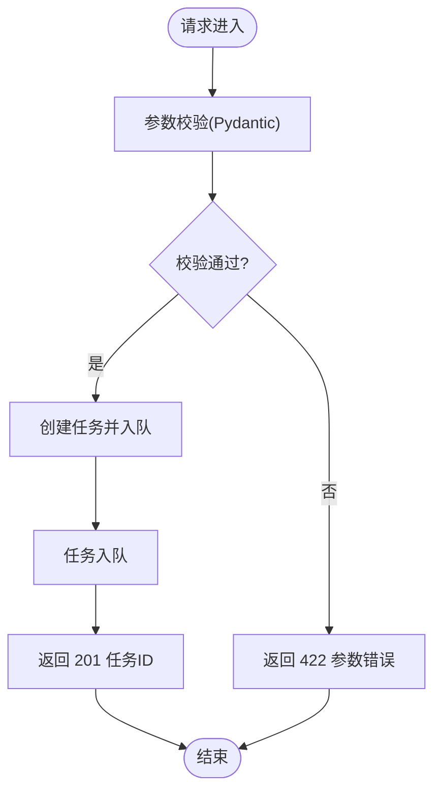
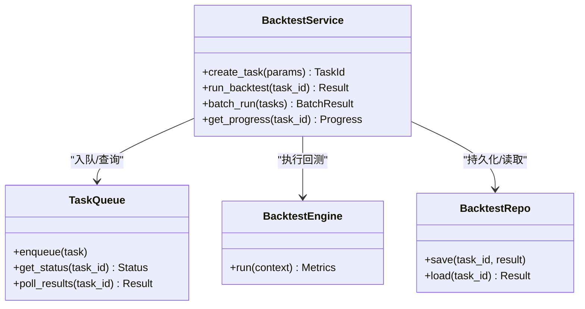
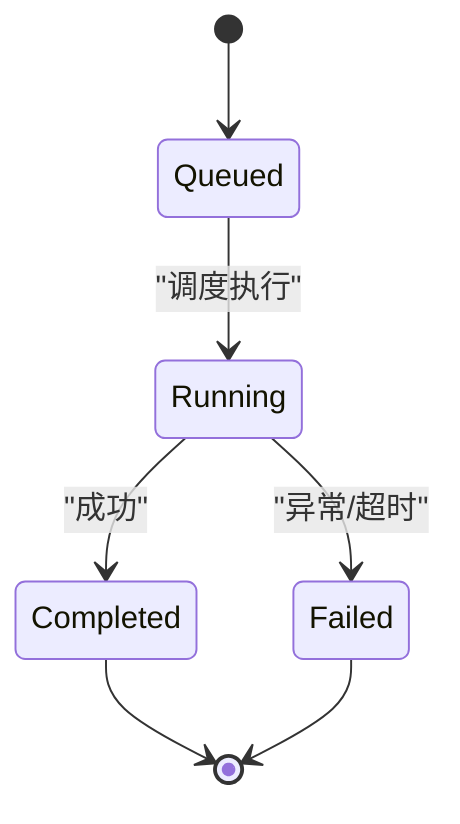
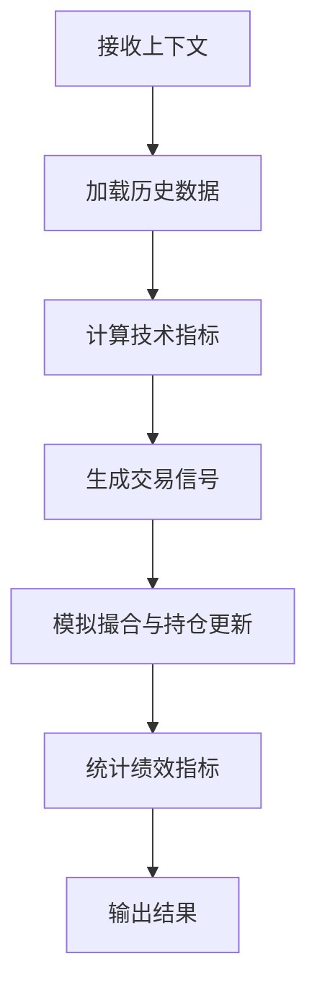
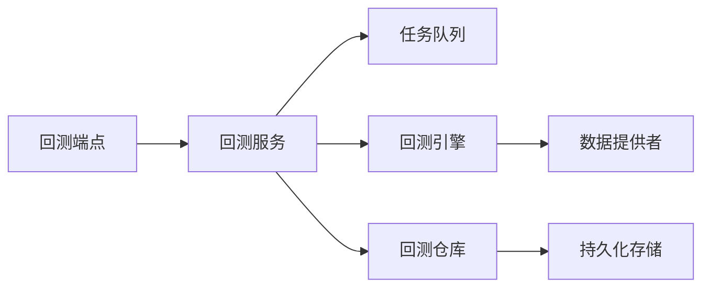

# 回测服务层

<cite>
**本文引用的文件**   
- [api/v1/endpoints/backtest.py](file://api/v1/endpoints/backtest.py)
- [api/v1/schemas/backtest.py](file://api/v1/schemas/backtest.py)
- [src/services/backtest_service.py](file://src/services/backtest_service.py)
- [src/core/backtest_engine.py](file://src/core/backtest_engine.py)
- [src/repositories/backtest_repo.py](file://src/repositories/backtest_repo.py)
- [src/services/task_queue.py](file://src/services/task_queue.py)
- [src/services/task_service.py](file://src/services/task_service.py)
- [api/app.py](file://api/app.py)
- [api/v1/router.py](file://api/v1/router.py)
- [src/config.py](file://src/config.py)
</cite>

## 目录
1. [简介](#简介)
2. [项目结构](#项目结构)
3. [核心组件](#核心组件)
4. [架构总览](#架构总览)
5. [详细组件分析](#详细组件分析)
6. [依赖关系分析](#依赖关系分析)
7. [性能考虑](#性能考虑)
8. [故障排查指南](#故障排查指南)
9. [结论](#结论)
10. [附录](#附录)

## 简介
本文件面向“回测服务层”的完整技术文档，覆盖以下目标：
- RESTful API 接口设计：端点定义、请求/响应格式、参数校验与错误处理。
- 回测任务管理：任务队列、进度跟踪、结果存储。
- 批量回测：并发控制、资源管理与结果聚合。
- 回测配置管理：策略参数调优、回测区间设置、数据源选择。
- 使用示例与集成指南：前端/客户端调用方式与最佳实践。

## 项目结构
围绕回测服务的代码主要分布在以下模块：
- API 层：路由与请求/响应模型定义
  - 路由注册与挂载
  - 回测相关端点
  - Pydantic 模型（参数校验）
- 服务层：业务编排与任务调度
  - 回测服务（单标的/批量）
  - 任务队列与任务服务（异步执行、进度、结果持久化）
- 引擎层：回测计算核心
  - 股票回测引擎
  - （可选）加密货币回测引擎
- 数据访问层：结果与历史数据的持久化
  - 回测结果仓库
- 配置与环境：系统配置与运行时参数

图表来源
- [api/v1/router.py](file://api/v1/router.py)
- [api/v1/endpoints/backtest.py](file://api/v1/endpoints/backtest.py)
- [src/services/backtest_service.py](file://src/services/backtest_service.py)
- [src/core/backtest_engine.py](file://src/core/backtest_engine.py)
- [src/repositories/backtest_repo.py](file://src/repositories/backtest_repo.py)
- [src/services/task_queue.py](file://src/services/task_queue.py)

章节来源
- [api/app.py](file://api/app.py)
- [api/v1/router.py](file://api/v1/router.py)
- [api/v1/endpoints/backtest.py](file://api/v1/endpoints/backtest.py)
- [api/v1/schemas/backtest.py](file://api/v1/schemas/backtest.py)
- [src/services/backtest_service.py](file://src/services/backtest_service.py)
- [src/core/backtest_engine.py](file://src/core/backtest_engine.py)
- [src/repositories/backtest_repo.py](file://src/repositories/backtest_repo.py)
- [src/services/task_queue.py](file://src/services/task_queue.py)
- [src/services/task_service.py](file://src/services/task_service.py)
- [src/config.py](file://src/config.py)

## 核心组件
- 回测端点（REST）
  - 负责接收请求、参数校验、返回统一响应体。
  - 支持创建回测任务、查询任务状态、获取结果、批量提交等。
- 回测服务
  - 编排回测流程：参数校验、构造任务、入队、等待完成、聚合结果。
  - 提供单标的与批量回测能力。
- 任务队列与任务服务
  - 异步执行器，维护任务生命周期（排队、运行、完成、失败）。
  - 提供进度上报与结果落库。
- 回测引擎
  - 基于策略与参数对历史数据进行回测计算，输出交易信号与绩效指标。
- 回测仓库
  - 负责回测结果的持久化与检索（按任务ID、时间范围、策略名等）。

章节来源
- [api/v1/endpoints/backtest.py](file://api/v1/endpoints/backtest.py)
- [api/v1/schemas/backtest.py](file://api/v1/schemas/backtest.py)
- [src/services/backtest_service.py](file://src/services/backtest_service.py)
- [src/services/task_queue.py](file://src/services/task_queue.py)
- [src/services/task_service.py](file://src/services/task_service.py)
- [src/core/backtest_engine.py](file://src/core/backtest_engine.py)
- [src/repositories/backtest_repo.py](file://src/repositories/backtest_repo.py)

## 架构总览
回测服务采用分层架构：API 层暴露 REST 接口；服务层进行业务编排与任务调度；引擎层实现回测算法；仓库层负责数据持久化。任务通过队列异步执行，支持进度跟踪与结果聚合。

图表来源
- [api/v1/endpoints/backtest.py](file://api/v1/endpoints/backtest.py)
- [src/services/backtest_service.py](file://src/services/backtest_service.py)
- [src/services/task_queue.py](file://src/services/task_queue.py)
- [src/core/backtest_engine.py](file://src/core/backtest_engine.py)
- [src/repositories/backtest_repo.py](file://src/repositories/backtest_repo.py)

## 详细组件分析

### 回测 API 端点与模型
- 端点职责
  - 创建回测任务：接收策略、标的、时间区间、数据源等参数，返回任务ID。
  - 查询任务状态：返回任务状态与进度。
  - 获取回测结果：返回绩效指标、交易明细等。
  - 批量回测：接受多个任务或批处理参数，返回批次ID与子任务列表。
- 参数校验
  - 使用 Pydantic 模型进行强类型校验，确保必填字段、取值范围、枚举值正确。
  - 常见字段包括：策略名称、标的代码、开始/结束日期、数据源、资金、手续费、滑点等。
- 错误处理
  - 统一的错误响应格式，包含错误码、消息与详情。
  - 参数校验失败返回 422；未找到任务返回 404；服务器内部错误返回 500。

图表来源
- [api/v1/endpoints/backtest.py](file://api/v1/endpoints/backtest.py)
- [api/v1/schemas/backtest.py](file://api/v1/schemas/backtest.py)

章节来源
- [api/v1/endpoints/backtest.py](file://api/v1/endpoints/backtest.py)
- [api/v1/schemas/backtest.py](file://api/v1/schemas/backtest.py)

### 回测服务（单标的与批量）
- 单标的回测
  - 校验输入参数，构造回测上下文（策略、标的、时间区间、数据源、资金、风控参数）。
  - 将任务加入队列，立即返回任务ID供后续查询。
- 批量回测
  - 支持传入多个标的或参数组合，生成多个子任务。
  - 并发控制：限制最大并行度，避免资源耗尽。
  - 结果聚合：汇总各子任务结果，提供批次级统计与导出。
- 进度跟踪
  - 任务状态机：queued、running、completed、failed。
  - 进度百分比与阶段信息（如数据准备、计算中、结果写入）。

图表来源
- [src/services/backtest_service.py](file://src/services/backtest_service.py)
- [src/services/task_queue.py](file://src/services/task_queue.py)
- [src/core/backtest_engine.py](file://src/core/backtest_engine.py)
- [src/repositories/backtest_repo.py](file://src/repositories/backtest_repo.py)

章节来源
- [src/services/backtest_service.py](file://src/services/backtest_service.py)
- [src/services/task_queue.py](file://src/services/task_queue.py)
- [src/core/backtest_engine.py](file://src/core/backtest_engine.py)
- [src/repositories/backtest_repo.py](file://src/repositories/backtest_repo.py)

### 任务队列与任务服务
- 任务队列
  - 支持内存或外部队列（如 Redis/Celery），根据配置切换。
  - 提供任务优先级、重试、超时与死信队列机制。
- 任务服务
  - 封装任务生命周期管理：创建、调度、监控、清理。
  - 提供进度上报接口，便于前端轮询或 SSE 推送。
- 并发与资源管理
  - 可配置工作进程数与线程池大小。
  - 限流与背压：当队列积压时拒绝新任务或降级。

图表来源
- [src/services/task_queue.py](file://src/services/task_queue.py)
- [src/services/task_service.py](file://src/services/task_service.py)

章节来源
- [src/services/task_queue.py](file://src/services/task_queue.py)
- [src/services/task_service.py](file://src/services/task_service.py)

### 回测引擎
- 输入上下文
  - 策略定义、标的列表、时间区间、数据源、初始资金、手续费、滑点、风控阈值等。
- 计算流程
  - 数据加载与清洗 -> 指标计算 -> 信号生成 -> 模拟交易 -> 绩效统计。
- 输出结果
  - 交易记录、净值曲线、风险指标（夏普、最大回撤等）、策略参数敏感性分析。

图表来源
- [src/core/backtest_engine.py](file://src/core/backtest_engine.py)

章节来源
- [src/core/backtest_engine.py](file://src/core/backtest_engine.py)

### 回测仓库（结果存储）
- 存储内容
  - 任务元数据（策略、标的、时间区间、参数哈希）。
  - 回测结果（交易明细、指标、图表数据）。
- 查询能力
  - 按任务ID、策略名、时间范围、标的集合查询。
  - 分页与排序支持。
- 一致性
  - 事务性写入，保证结果完整性。
  - 版本化与归档策略（长期保存与冷热分离）。

章节来源
- [src/repositories/backtest_repo.py](file://src/repositories/backtest_repo.py)

### 配置管理（策略参数、区间、数据源）
- 策略参数调优
  - 支持参数网格搜索或贝叶斯优化（由上层服务驱动）。
  - 参数校验与默认值回退。
- 回测区间设置
  - 起止日期、复权方式、交易日过滤。
- 数据源选择
  - 多数据源适配（A股、港股、美股、加密资产）。
  - 数据质量检查与回退策略。

章节来源
- [src/config.py](file://src/config.py)
- [api/v1/schemas/backtest.py](file://api/v1/schemas/backtest.py)

## 依赖关系分析
- 耦合与内聚
  - API 层与服务层解耦，通过明确接口契约交互。
  - 服务层对引擎与仓库的依赖清晰，便于替换实现。
- 外部依赖
  - 数据提供者（行情/基本面数据）。
  - 任务队列后端（内存/Redis/Celery）。
  - 存储后端（SQLite/PostgreSQL/MongoDB）。
- 循环依赖
  - 通过接口抽象与依赖注入避免循环引用。

图表来源
- [api/v1/endpoints/backtest.py](file://api/v1/endpoints/backtest.py)
- [src/services/backtest_service.py](file://src/services/backtest_service.py)
- [src/core/backtest_engine.py](file://src/core/backtest_engine.py)
- [src/repositories/backtest_repo.py](file://src/repositories/backtest_repo.py)
- [src/services/task_queue.py](file://src/services/task_queue.py)

章节来源
- [api/v1/endpoints/backtest.py](file://api/v1/endpoints/backtest.py)
- [src/services/backtest_service.py](file://src/services/backtest_service.py)
- [src/core/backtest_engine.py](file://src/core/backtest_engine.py)
- [src/repositories/backtest_repo.py](file://src/repositories/backtest_repo.py)
- [src/services/task_queue.py](file://src/services/task_queue.py)

## 性能考虑
- 并发控制
  - 合理设置队列工作进程数与线程池大小，避免 CPU/IO 瓶颈。
  - 批量任务分片处理，减少单次负载。
- 缓存与预取
  - 历史数据与指标缓存，减少重复计算。
  - 热点标的与策略的参数缓存。
- 结果聚合
  - 增量聚合与异步合并，降低主线程压力。
- 资源隔离
  - 不同策略或用户任务的资源配额与隔离。
- 监控与告警
  - 队列长度、任务耗时、失败率、内存/CPU 使用率监控。

[本节为通用指导，不直接分析具体文件]

## 故障排查指南
- 常见问题
  - 参数校验失败：检查必填字段、数据类型、取值范围。
  - 任务卡住：检查队列后端健康、工作进程是否存活。
  - 结果缺失：确认仓库写入成功与事务提交。
  - 数据源异常：检查网络连通性与数据提供方限流。
- 诊断步骤
  - 查看任务状态与日志，定位失败阶段。
  - 验证配置项（数据源、策略参数、区间）。
  - 使用最小化用例复现问题。
- 恢复策略
  - 重试失败任务，必要时清理死信队列。
  - 回滚不一致的结果，重新计算。

章节来源
- [api/v1/endpoints/backtest.py](file://api/v1/endpoints/backtest.py)
- [src/services/task_queue.py](file://src/services/task_queue.py)
- [src/repositories/backtest_repo.py](file://src/repositories/backtest_repo.py)

## 结论
回测服务层通过清晰的层次划分与明确的接口契约，实现了高内聚、低耦合的设计。API 端点提供统一的 REST 接口，服务层负责编排与调度，引擎层专注计算，仓库层保障结果持久化。任务队列与进度跟踪为批量回测提供了可扩展的基础。通过合理的并发控制、缓存与监控策略，系统可在大规模回测场景下保持稳定与高效。

[本节为总结性内容，不直接分析具体文件]

## 附录
- API 使用示例（概念性说明）
  - 创建回测任务：POST /backtest/tasks，请求体包含策略、标的、时间区间、数据源等。
  - 查询任务状态：GET /backtest/tasks/{id}/status，返回状态与进度。
  - 获取结果：GET /backtest/tasks/{id}/result，返回绩效与交易明细。
  - 批量回测：POST /backtest/batch，提交多个任务或参数组合，返回批次ID与子任务列表。
- 集成指南
  - 前端轮询或 SSE 订阅任务进度。
  - 客户端重试与超时处理。
  - 错误码与提示文案的统一处理。

[本节为概念性说明，不直接分析具体文件]