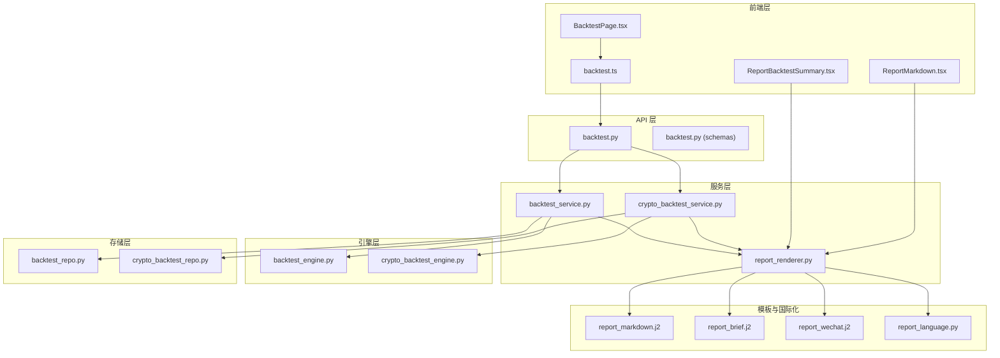
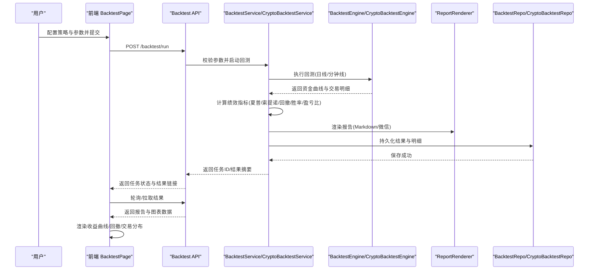
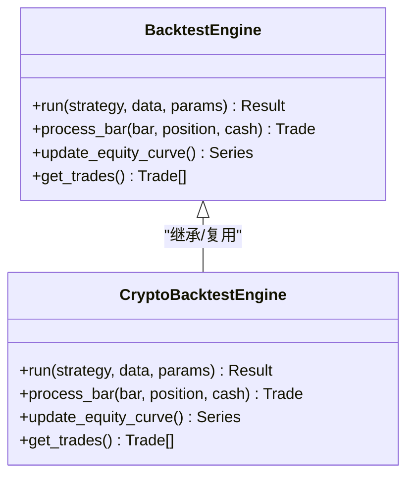
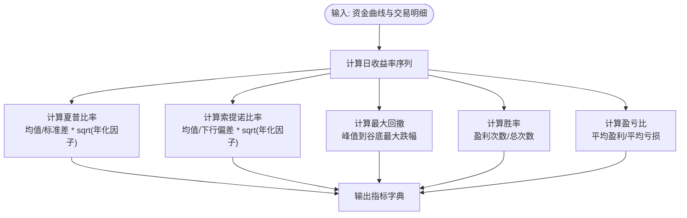
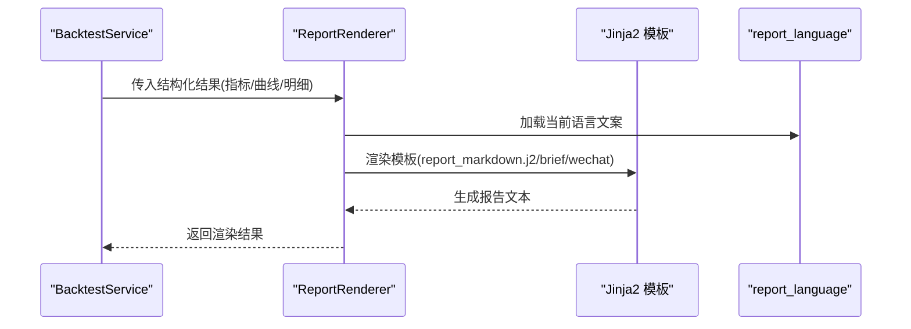
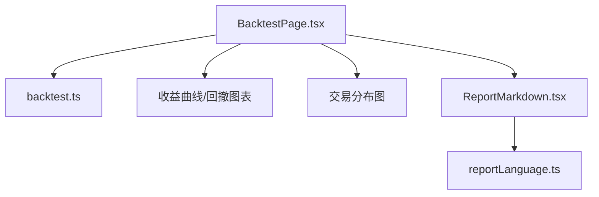
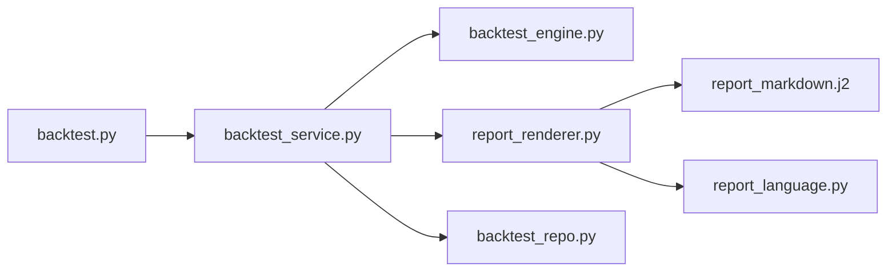

# 回测绩效分析

<cite>
**本文引用的文件**   
- [backtest_engine.py](file://src/core/backtest_engine.py)
- [crypto_backtest_engine.py](file://src/core/crypto_backtest_engine.py)
- [backtest_service.py](file://src/services/backtest_service.py)
- [crypto_backtest_service.py](file://src/services/crypto_backtest_service.py)
- [backtest_repo.py](file://src/repositories/backtest_repo.py)
- [crypto_backtest_repo.py](file://src/repositories/crypto_backtest_repo.py)
- [report_renderer.py](file://src/services/report_renderer.py)
- [formatters.py](file://src/formatters.py)
- [report_language.py](file://src/report_language.py)
- [templates/report_markdown.j2](file://templates/report_markdown.j2)
- [templates/report_brief.j2](file://templates/report_brief.j2)
- [templates/report_wechat.j2](file://templates/report_wechat.j2)
- [api/v1/endpoints/backtest.py](file://api/v1/endpoints/backtest.py)
- [api/v1/schemas/backtest.py](file://api/v1/schemas/backtest.py)
- [apps/dsa-web/src/api/backtest.ts](file://apps/dsa-web/src/api/backtest.ts)
- [apps/dsa-web/src/pages/BacktestPage.tsx](file://apps/dsa-web/src/pages/BacktestPage.tsx)
- [apps/dsa-web/src/components/report/ReportBacktestSummary.tsx](file://apps/dsa-web/src/components/report/ReportBacktestSummary.tsx)
- [apps/dsa-web/src/components/report/ReportMarkdown.tsx](file://apps/dsa-web/src/components/report/ReportMarkdown.tsx)
- [apps/dsa-web/src/utils/reportLanguage.ts](file://apps/dsa-web/src/utils/reportLanguage.ts)
- [tests/test_backtest_engine.py](file://tests/test_backtest_engine.py)
- [tests/test_backtest_service.py](file://tests/test_backtest_service.py)
- [tests/test_report_renderer.py](file://tests/test_report_renderer.py)
</cite>

## 目录
1. [简介](#简介)
2. [项目结构](#项目结构)
3. [核心组件](#核心组件)
4. [架构总览](#架构总览)
5. [详细组件分析](#详细组件分析)
6. [依赖关系分析](#依赖关系分析)
7. [性能考量](#性能考量)
8. [故障排查指南](#故障排查指南)
9. [结论](#结论)
10. [附录](#附录)

## 简介
本模块聚焦于“回测绩效分析”，涵盖策略回测引擎、绩效指标计算（夏普比率、索提诺比率、最大回撤、胜率、盈亏比等）、可视化展示（收益曲线、回撤图表、交易分布图）、报告生成（模板系统、数据格式化、多语言支持）以及对比分析（参数敏感性、基准对比）。文档以代码为依据，提供从架构到实现细节的系统性说明，帮助开发者与使用者快速理解并扩展该能力。

## 项目结构
回测绩效分析相关代码主要分布在以下层次：
- API 层：暴露回测任务提交、查询与结果获取接口
- 服务层：编排回测执行、指标计算、报告渲染与持久化
- 引擎层：股票与加密货币两类回测引擎，负责模拟交易与记录交易日志
- 存储层：回测结果的入库与检索
- 前端层：调用 API、渲染图表与报告
- 模板与国际化：Jinja2 模板与多语言文本

**图示来源** 
- [api/v1/endpoints/backtest.py](file://api/v1/endpoints/backtest.py)
- [api/v1/schemas/backtest.py](file://api/v1/schemas/backtest.py)
- [src/services/backtest_service.py](file://src/services/backtest_service.py)
- [src/services/crypto_backtest_service.py](file://src/services/crypto_backtest_service.py)
- [src/core/backtest_engine.py](file://src/core/backtest_engine.py)
- [src/core/crypto_backtest_engine.py](file://src/core/crypto_backtest_engine.py)
- [src/repositories/backtest_repo.py](file://src/repositories/backtest_repo.py)
- [src/repositories/crypto_backtest_repo.py](file://src/repositories/crypto_backtest_repo.py)
- [src/services/report_renderer.py](file://src/services/report_renderer.py)
- [templates/report_markdown.j2](file://templates/report_markdown.j2)
- [templates/report_brief.j2](file://templates/report_brief.j2)
- [templates/report_wechat.j2](file://templates/report_wechat.j2)
- [src/report_language.py](file://src/report_language.py)
- [apps/dsa-web/src/api/backtest.ts](file://apps/dsa-web/src/api/backtest.ts)
- [apps/dsa-web/src/pages/BacktestPage.tsx](file://apps/dsa-web/src/pages/BacktestPage.tsx)
- [apps/dsa-web/src/components/report/ReportBacktestSummary.tsx](file://apps/dsa-web/src/components/report/ReportBacktestSummary.tsx)
- [apps/dsa-web/src/components/report/ReportMarkdown.tsx](file://apps/dsa-web/src/components/report/ReportMarkdown.tsx)

**章节来源**
- [api/v1/endpoints/backtest.py](file://api/v1/endpoints/backtest.py)
- [src/services/backtest_service.py](file://src/services/backtest_service.py)
- [src/core/backtest_engine.py](file://src/core/backtest_engine.py)
- [src/services/report_renderer.py](file://src/services/report_renderer.py)
- [templates/report_markdown.j2](file://templates/report_markdown.j2)
- [apps/dsa-web/src/pages/BacktestPage.tsx](file://apps/dsa-web/src/pages/BacktestPage.tsx)

## 核心组件
- 回测引擎（股票/加密货币）：负责按日或分钟级数据回放策略信号，记录成交、持仓、资金曲线与交易明细
- 绩效指标计算：基于资金曲线与交易明细计算关键指标（夏普比率、索提诺比率、最大回撤、胜率、盈亏比等）
- 报告渲染器：将结构化结果通过 Jinja2 模板渲染为 Markdown/微信格式，并支持多语言
- 存储仓库：将回测结果与交易明细持久化，供查询与对比
- API 与服务：对外暴露任务提交、状态查询、结果下载；内部协调引擎、渲染与存储
- 前端页面与组件：发起回测、展示图表与报告、支持语言切换

**章节来源**
- [src/core/backtest_engine.py](file://src/core/backtest_engine.py)
- [src/core/crypto_backtest_engine.py](file://src/core/crypto_backtest_engine.py)
- [src/services/backtest_service.py](file://src/services/backtest_service.py)
- [src/services/report_renderer.py](file://src/services/report_renderer.py)
- [src/repositories/backtest_repo.py](file://src/repositories/backtest_repo.py)
- [api/v1/endpoints/backtest.py](file://api/v1/endpoints/backtest.py)
- [apps/dsa-web/src/pages/BacktestPage.tsx](file://apps/dsa-web/src/pages/BacktestPage.tsx)

## 架构总览
下图展示了从用户触发回测到报告输出的完整流程，包括指标计算与可视化渲染的关键环节。

**图示来源** 
- [api/v1/endpoints/backtest.py](file://api/v1/endpoints/backtest.py)
- [src/services/backtest_service.py](file://src/services/backtest_service.py)
- [src/core/backtest_engine.py](file://src/core/backtest_engine.py)
- [src/services/report_renderer.py](file://src/services/report_renderer.py)
- [src/repositories/backtest_repo.py](file://src/repositories/backtest_repo.py)
- [apps/dsa-web/src/pages/BacktestPage.tsx](file://apps/dsa-web/src/pages/BacktestPage.tsx)

## 详细组件分析

### 回测引擎（股票/加密货币）
- 功能要点
  - 读取历史行情数据，按时间步推进
  - 根据策略信号生成买卖指令，考虑滑点、手续费、仓位限制
  - 维护账户净值序列与逐笔交易记录
  - 输出标准化结果：资金曲线、交易明细、持仓快照
- 设计模式
  - 抽象统一接口，分别实现股票与加密资产的回测逻辑
  - 事件驱动式推进，便于接入不同频率数据与策略
- 复杂度与优化
  - 时间复杂度与数据长度线性相关；可通过向量化计算与缓存减少重复计算
  - 内存占用与交易次数成正比，建议分批处理长周期数据

**图示来源** 
- [src/core/backtest_engine.py](file://src/core/backtest_engine.py)
- [src/core/crypto_backtest_engine.py](file://src/core/crypto_backtest_engine.py)

**章节来源**
- [src/core/backtest_engine.py](file://src/core/backtest_engine.py)
- [src/core/crypto_backtest_engine.py](file://src/core/crypto_backtest_engine.py)
- [tests/test_backtest_engine.py](file://tests/test_backtest_engine.py)

### 绩效指标计算
- 指标定义与计算方法
  - 收益率序列：基于资金曲线计算日收益率
  - 夏普比率：超额收益均值除以标准差，通常以无风险利率为基准
  - 索提诺比率：下行偏差替代标准差，仅惩罚负波动
  - 最大回撤：累计峰值到谷底的最大跌幅
  - 胜率：盈利交易次数占总交易次数的比例
  - 盈亏比：平均盈利金额与平均亏损金额的比值
- 实现要点
  - 使用稳健的数值计算，避免除零与空序列异常
  - 对缺失值进行插值或剔除，确保一致性
  - 年化参数可配置（交易日/年），保证跨市场可比性

**图示来源** 
- [src/services/backtest_service.py](file://src/services/backtest_service.py)
- [src/services/crypto_backtest_service.py](file://src/services/crypto_backtest_service.py)

**章节来源**
- [src/services/backtest_service.py](file://src/services/backtest_service.py)
- [src/services/crypto_backtest_service.py](file://src/services/crypto_backtest_service.py)
- [tests/test_backtest_service.py](file://tests/test_backtest_service.py)

### 报告渲染与多语言支持
- 模板系统
  - 使用 Jinja2 模板渲染 Markdown、简报与微信格式报告
  - 模板变量包含策略信息、指标汇总、收益曲线与回撤图表数据、交易分布统计
- 数据格式化
  - 数字格式化（百分比、小数位数）、日期时间本地化
  - 图表数据序列化（折线、柱状、散点）
- 多语言支持
  - 通过 report_language 模块管理文案键值
  - 前端与后端均支持语言切换，模板渲染时注入对应语言文本

**图示来源** 
- [src/services/report_renderer.py](file://src/services/report_renderer.py)
- [templates/report_markdown.j2](file://templates/report_markdown.j2)
- [templates/report_brief.j2](file://templates/report_brief.j2)
- [templates/report_wechat.j2](file://templates/report_wechat.j2)
- [src/report_language.py](file://src/report_language.py)

**章节来源**
- [src/services/report_renderer.py](file://src/services/report_renderer.py)
- [src/formatters.py](file://src/formatters.py)
- [src/report_language.py](file://src/report_language.py)
- [templates/report_markdown.j2](file://templates/report_markdown.j2)
- [templates/report_brief.j2](file://templates/report_brief.j2)
- [templates/report_wechat.j2](file://templates/report_wechat.j2)
- [tests/test_report_renderer.py](file://tests/test_report_renderer.py)

### 前端可视化与交互
- 收益曲线与回撤图表
  - 使用折线图展示资金曲线与基准对比
  - 使用面积图或折线图展示回撤轨迹
- 交易分布图
  - 使用柱状图展示持有期分布、盈亏分布
- 报告查看
  - Markdown 渲染器展示结构化报告
  - 支持语言切换与导出

**图示来源** 
- [apps/dsa-web/src/pages/BacktestPage.tsx](file://apps/dsa-web/src/pages/BacktestPage.tsx)
- [apps/dsa-web/src/api/backtest.ts](file://apps/dsa-web/src/api/backtest.ts)
- [apps/dsa-web/src/components/report/ReportBacktestSummary.tsx](file://apps/dsa-web/src/components/report/ReportBacktestSummary.tsx)
- [apps/dsa-web/src/components/report/ReportMarkdown.tsx](file://apps/dsa-web/src/components/report/ReportMarkdown.tsx)
- [apps/dsa-web/src/utils/reportLanguage.ts](file://apps/dsa-web/src/utils/reportLanguage.ts)

**章节来源**
- [apps/dsa-web/src/pages/BacktestPage.tsx](file://apps/dsa-web/src/pages/BacktestPage.tsx)
- [apps/dsa-web/src/api/backtest.ts](file://apps/dsa-web/src/api/backtest.ts)
- [apps/dsa-web/src/components/report/ReportBacktestSummary.tsx](file://apps/dsa-web/src/components/report/ReportBacktestSummary.tsx)
- [apps/dsa-web/src/components/report/ReportMarkdown.tsx](file://apps/dsa-web/src/components/report/ReportMarkdown.tsx)
- [apps/dsa-web/src/utils/reportLanguage.ts](file://apps/dsa-web/src/utils/reportLanguage.ts)

### 对比分析与参数敏感性
- 基准对比
  - 将策略资金曲线与基准（如指数）叠加展示，计算相对收益与跟踪误差
- 参数敏感性
  - 批量运行不同参数组合，汇总指标矩阵
  - 通过热力图或表格展示参数变化对指标的影响
- 实现建议
  - 在服务层封装对比任务，支持异步执行与进度反馈
  - 结果聚合与排序，便于快速定位最优参数区间

[本节为概念性内容，不直接分析具体文件]

## 依赖关系分析
- 组件耦合
  - API 依赖服务层，服务层依赖引擎与渲染器，渲染器依赖模板与语言模块
  - 存储仓库独立于渲染与前端，提供数据持久化能力
- 外部依赖
  - Jinja2 模板引擎
  - 图表库（前端）用于可视化
  - 数据库/文件系统用于持久化

**图示来源** 
- [api/v1/endpoints/backtest.py](file://api/v1/endpoints/backtest.py)
- [src/services/backtest_service.py](file://src/services/backtest_service.py)
- [src/core/backtest_engine.py](file://src/core/backtest_engine.py)
- [src/services/report_renderer.py](file://src/services/report_renderer.py)
- [templates/report_markdown.j2](file://templates/report_markdown.j2)
- [src/report_language.py](file://src/report_language.py)
- [src/repositories/backtest_repo.py](file://src/repositories/backtest_repo.py)

**章节来源**
- [api/v1/endpoints/backtest.py](file://api/v1/endpoints/backtest.py)
- [src/services/backtest_service.py](file://src/services/backtest_service.py)
- [src/services/report_renderer.py](file://src/services/report_renderer.py)
- [src/repositories/backtest_repo.py](file://src/repositories/backtest_repo.py)

## 性能考量
- 回测引擎
  - 大数据量下采用向量化计算与增量更新，避免全量重算
  - 合理设置批大小与内存上限，防止 OOM
- 指标计算
  - 对收益率序列进行滚动窗口计算，降低复杂度
  - 缓存中间结果（如均值、方差、下行偏差）
- 报告渲染
  - 模板渲染前预处理数据，减少模板内逻辑
  - 按需渲染，避免一次性生成大体积报告
- 前端可视化
  - 使用虚拟滚动与分页加载大图数据
  - 图表数据压缩与懒加载

[本节提供通用指导，不直接分析具体文件]

## 故障排查指南
- 常见问题
  - 数据缺失或异常：检查数据清洗与插值逻辑
  - 指标计算异常：确认收益率序列非空、无除零与 NaN
  - 模板渲染失败：核对模板变量与语言键是否存在
  - 前端图表不显示：检查数据格式与字段映射
- 调试建议
  - 在引擎与服务层增加日志，记录关键步骤与中间结果
  - 使用单元测试覆盖边界条件（空数据、单条数据、极端波动）
  - 前端网络请求与响应打印，确认数据完整性

**章节来源**
- [tests/test_backtest_engine.py](file://tests/test_backtest_engine.py)
- [tests/test_backtest_service.py](file://tests/test_backtest_service.py)
- [tests/test_report_renderer.py](file://tests/test_report_renderer.py)

## 结论
本模块构建了完整的回测绩效分析闭环：从策略回测、指标计算、报告渲染到前端可视化与多语言支持。通过清晰的架构分层与可扩展的设计，能够灵活适配不同资产类别与策略需求。建议在后续迭代中加强对比分析与参数敏感性工具，提升策略评估效率与决策质量。

[本节为总结性内容，不直接分析具体文件]

## 附录
- 指标解读指南
  - 夏普比率：越高越好，但需结合样本长度与市场环境
  - 索提诺比率：关注下行风险，适合风险控制优先的策略
  - 最大回撤：衡量极端风险，需与止损机制配合
  - 胜率与盈亏比：二者互补，高胜率低盈亏比或低胜率高盈亏比均可成立
- 最佳实践
  - 使用多时间段与多资产验证稳定性
  - 避免过拟合，控制参数数量与搜索空间
  - 定期复盘与再校准，关注市场结构变化

[本节为概念性内容，不直接分析具体文件]