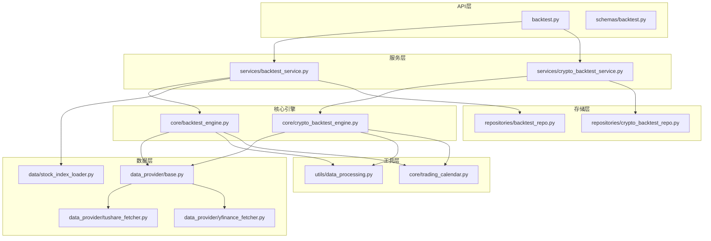
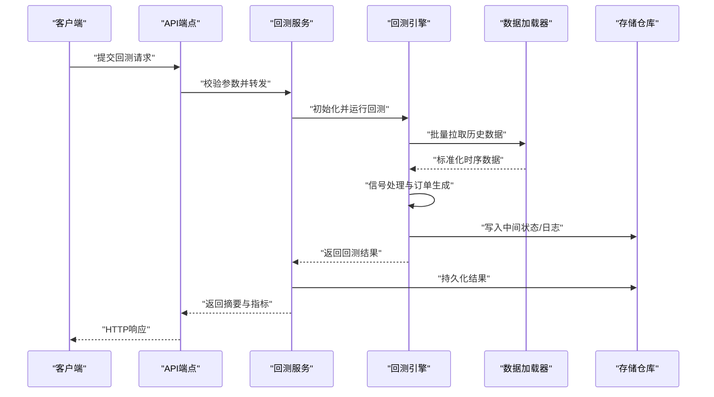
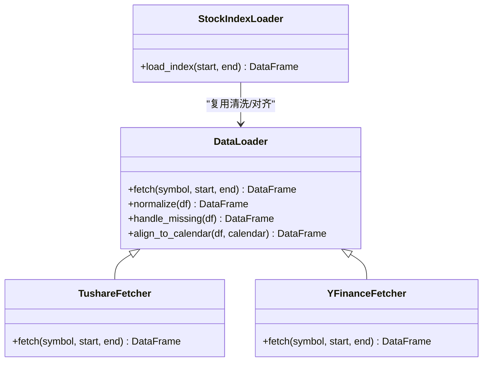
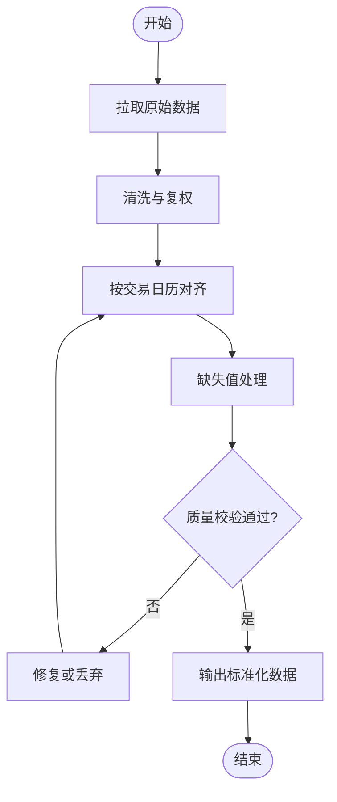
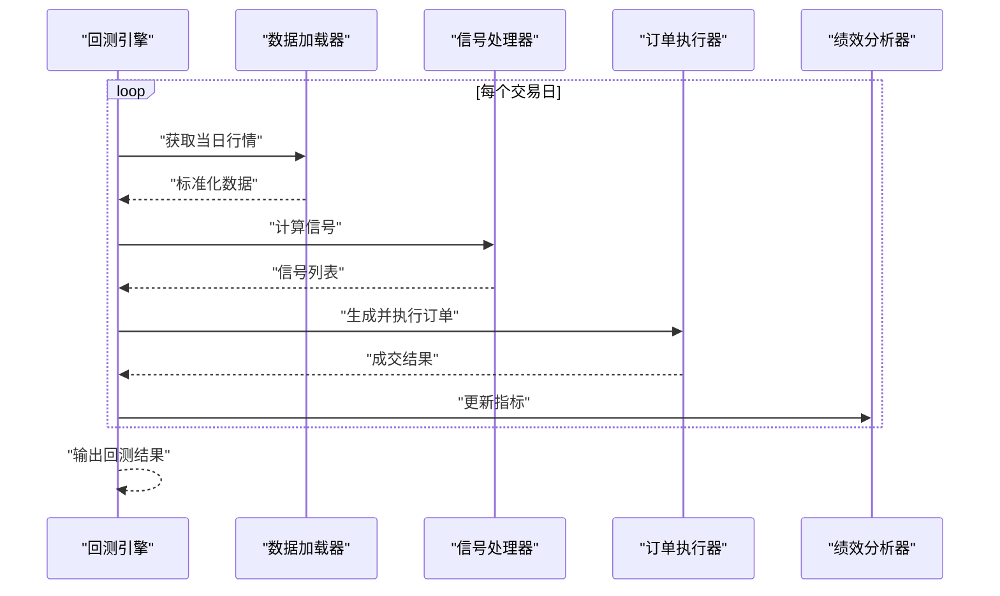
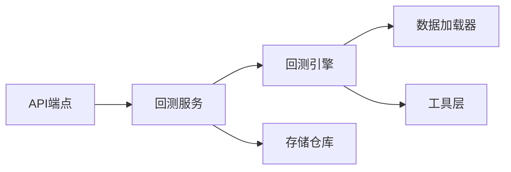

# 核心回测引擎

<cite>
**本文引用的文件**   
- [src/core/backtest_engine.py](file://src/core/backtest_engine.py)
- [src/core/crypto_backtest_engine.py](file://src/core/crypto_backtest_engine.py)
- [src/services/backtest_service.py](file://src/services/backtest_service.py)
- [src/services/crypto_backtest_service.py](file://src/services/crypto_backtest_service.py)
- [api/v1/endpoints/backtest.py](file://api/v1/endpoints/backtest.py)
- [api/v1/schemas/backtest.py](file://api/v1/schemas/backtest.py)
- [src/repositories/backtest_repo.py](file://src/repositories/backtest_repo.py)
- [src/repositories/crypto_backtest_repo.py](file://src/repositories/crypto_backtest_repo.py)
- [src/data/stock_index_loader.py](file://src/data/stock_index_loader.py)
- [data_provider/base.py](file://data_provider/base.py)
- [data_provider/tushare_fetcher.py](file://data_provider/tushare_fetcher.py)
- [data_provider/yfinance_fetcher.py](file://data_provider/yfinance_fetcher.py)
- [src/utils/data_processing.py](file://src/utils/data_processing.py)
- [src/core/trading_calendar.py](file://src/core/trading_calendar.py)
- [tests/test_backtest_engine.py](file://tests/test_backtest_engine.py)
- [tests/test_crypto_backtest_engine.py](file://tests/test_crypto_backtest_engine.py)
</cite>

## 目录
1. [简介](#简介)
2. [项目结构](#项目结构)
3. [核心组件](#核心组件)
4. [架构总览](#架构总览)
5. [详细组件分析](#详细组件分析)
6. [依赖关系分析](#依赖关系分析)
7. [性能考量](#性能考量)
8. [故障排查指南](#故障排查指南)
9. [结论](#结论)
10. [附录](#附录)

## 简介
本文件围绕“核心回测引擎”展开，系统性阐述其架构设计、数据加载器、信号处理器、订单执行器与绩效分析器的实现要点；覆盖历史数据处理流程（预处理、时间序列对齐、缺失值处理）、滑点模拟机制、手续费计算模型与资金管理策略；并总结回测性能优化技术（并行计算、内存管理、缓存策略）及配置使用示例。文档力求在保持技术深度的同时，对非专业读者友好。

## 项目结构
回测相关代码主要分布在以下模块：
- 核心引擎：股票与加密货币两类回测引擎
- 服务层：封装调用逻辑、任务编排与结果持久化
- API 层：对外暴露回测接口与请求/响应模式
- 数据层：统一数据源抽象与具体 Fetcher 实现
- 工具层：数据处理、日历与指标计算等通用能力
- 存储层：回测结果与中间态的持久化

图表来源
- [api/v1/endpoints/backtest.py](file://api/v1/endpoints/backtest.py)
- [api/v1/schemas/backtest.py](file://api/v1/schemas/backtest.py)
- [src/services/backtest_service.py](file://src/services/backtest_service.py)
- [src/services/crypto_backtest_service.py](file://src/services/crypto_backtest_service.py)
- [src/core/backtest_engine.py](file://src/core/backtest_engine.py)
- [src/core/crypto_backtest_engine.py](file://src/core/crypto_backtest_engine.py)
- [data_provider/base.py](file://data_provider/base.py)
- [data_provider/tushare_fetcher.py](file://data_provider/tushare_fetcher.py)
- [data_provider/yfinance_fetcher.py](file://data_provider/yfinance_fetcher.py)
- [src/data/stock_index_loader.py](file://src/data/stock_index_loader.py)
- [src/utils/data_processing.py](file://src/utils/data_processing.py)
- [src/core/trading_calendar.py](file://src/core/trading_calendar.py)
- [src/repositories/backtest_repo.py](file://src/repositories/backtest_repo.py)
- [src/repositories/crypto_backtest_repo.py](file://src/repositories/crypto_backtest_repo.py)

章节来源
- [src/core/backtest_engine.py](file://src/core/backtest_engine.py)
- [src/core/crypto_backtest_engine.py](file://src/core/crypto_backtest_engine.py)
- [src/services/backtest_service.py](file://src/services/backtest_service.py)
- [src/services/crypto_backtest_service.py](file://src/services/crypto_backtest_service.py)
- [api/v1/endpoints/backtest.py](file://api/v1/endpoints/backtest.py)
- [api/v1/schemas/backtest.py](file://api/v1/schemas/backtest.py)

## 核心组件
- 数据加载器：统一抽象数据源，支持多后端（Tushare、YFinance 等），提供标准化 OHLCV 与基础因子字段，负责拉取、清洗与缓存。
- 信号处理器：基于策略规则或外部输入生成交易信号，包含过滤、确认与去重逻辑。
- 订单执行器：将信号转换为可执行的订单，考虑仓位、资金约束、涨跌停与流动性限制。
- 绩效分析器：计算收益曲线、回撤、夏普、胜率、盈亏比等关键指标，并输出可视化与报告所需的数据结构。
- 回测引擎：串联上述组件，驱动时间步进，维护账户状态，记录交易日志与快照。

章节来源
- [src/core/backtest_engine.py](file://src/core/backtest_engine.py)
- [src/core/crypto_backtest_engine.py](file://src/core/crypto_backtest_engine.py)
- [src/services/backtest_service.py](file://src/services/backtest_service.py)
- [src/services/crypto_backtest_service.py](file://src/services/crypto_backtest_service.py)

## 架构总览
回测引擎采用分层解耦设计：API 层接收请求并校验参数；服务层编排任务、协调引擎与存储；核心引擎按时间步推进，调用数据加载器获取行情，由信号处理器产生信号，订单执行器生成订单并更新账户；绩效分析器在回测结束后汇总指标。

图表来源
- [api/v1/endpoints/backtest.py](file://api/v1/endpoints/backtest.py)
- [src/services/backtest_service.py](file://src/services/backtest_service.py)
- [src/core/backtest_engine.py](file://src/core/backtest_engine.py)
- [data_provider/base.py](file://data_provider/base.py)
- [src/repositories/backtest_repo.py](file://src/repositories/backtest_repo.py)

## 详细组件分析

### 数据加载器
- 统一抽象：定义数据源接口，约定拉取方法、字段映射与错误处理。
- 多后端实现：Tushare、YFinance 等实现类遵循同一契约，便于扩展。
- 数据清洗：去重、排序、异常值剔除、复权处理、缺失值插补。
- 索引对齐：以交易日历为基准进行时间对齐，确保多标的同步。
- 缓存策略：按标的与时间范围缓存，避免重复 IO。

图表来源
- [data_provider/base.py](file://data_provider/base.py)
- [data_provider/tushare_fetcher.py](file://data_provider/tushare_fetcher.py)
- [data_provider/yfinance_fetcher.py](file://data_provider/yfinance_fetcher.py)
- [src/data/stock_index_loader.py](file://src/data/stock_index_loader.py)

章节来源
- [data_provider/base.py](file://data_provider/base.py)
- [data_provider/tushare_fetcher.py](file://data_provider/tushare_fetcher.py)
- [data_provider/yfinance_fetcher.py](file://data_provider/yfinance_fetcher.py)
- [src/data/stock_index_loader.py](file://src/data/stock_index_loader.py)
- [src/utils/data_processing.py](file://src/utils/data_processing.py)

### 历史数据处理流程
- 预处理：去重、排序、异常值检测与替换、复权调整。
- 时间序列对齐：基于交易日历对齐多标的与多频率数据，填充不可交易日的空值。
- 缺失值处理：前向填充、线性插值或根据业务规则标记无效区间。
- 质量校验：字段完整性检查、NaN 比例阈值、极端值截断。

图表来源
- [src/utils/data_processing.py](file://src/utils/data_processing.py)
- [src/core/trading_calendar.py](file://src/core/trading_calendar.py)

章节来源
- [src/utils/data_processing.py](file://src/utils/data_processing.py)
- [src/core/trading_calendar.py](file://src/core/trading_calendar.py)

### 信号处理器
- 输入：标准化后的行情数据与可选基本面/情绪因子。
- 规则引擎：技术指标组合、阈值判断、形态识别与条件聚合。
- 信号确认：延迟确认、趋势过滤、波动率过滤。
- 去重与合并：同周期内多信号冲突消解，优先级策略。

章节来源
- [src/core/backtest_engine.py](file://src/core/backtest_engine.py)
- [src/core/crypto_backtest_engine.py](file://src/core/crypto_backtest_engine.py)

### 订单执行器
- 信号到订单：将买入/卖出信号转化为限价/市价单，考虑最小交易单位与涨跌停。
- 仓位管理：固定金额、固定比例、凯利公式或动态风控。
- 资金约束：可用资金、持仓上限、杠杆与保证金检查。
- 成交模拟：按收盘价或开盘价成交，支持部分成交与撤单策略。

章节来源
- [src/core/backtest_engine.py](file://src/core/backtest_engine.py)
- [src/core/crypto_backtest_engine.py](file://src/core/crypto_backtest_engine.py)

### 绩效分析器
- 收益曲线：净值曲线、累计收益、年化收益。
- 风险指标：最大回撤、波动率、下行风险、VaR。
- 交易统计：胜率、盈亏比、平均持仓时长、换手率。
- 归因分析：行业/因子贡献、买卖时点质量评估。

章节来源
- [src/core/backtest_engine.py](file://src/core/backtest_engine.py)
- [src/core/crypto_backtest_engine.py](file://src/core/crypto_backtest_engine.py)

### 回测引擎（股票）
- 时间步进：按交易日推进，逐日更新行情、计算信号、生成订单、执行成交。
- 账户状态：现金、持仓、成本、未实现盈亏、费用与滑点累计。
- 事件日志：每笔交易、滑点、手续费、拒绝原因记录。
- 快照与恢复：定期保存中间状态，支持中断续跑。

图表来源
- [src/core/backtest_engine.py](file://src/core/backtest_engine.py)
- [data_provider/base.py](file://data_provider/base.py)

章节来源
- [src/core/backtest_engine.py](file://src/core/backtest_engine.py)

### 回测引擎（加密货币）
- 市场特性：7x24 交易、无涨跌停、高波动与低流动性场景。
- 特殊处理：跨交易所价差、链上数据可用性、滑点放大。
- 风控增强：波动率自适应仓位、熔断与暂停机制。

章节来源
- [src/core/crypto_backtest_engine.py](file://src/core/crypto_backtest_engine.py)

### 滑点模拟机制
- 模型选择：固定百分比、成交量加权、价格分布拟合。
- 参数配置：依据流动性与波动率动态调整。
- 记录与审计：逐笔滑点明细与汇总统计。

章节来源
- [src/core/backtest_engine.py](file://src/core/backtest_engine.py)
- [src/core/crypto_backtest_engine.py](file://src/core/crypto_backtest_engine.py)

### 手续费计算模型
- 费率结构：固定费、阶梯费率、做市商返佣。
- 计算时机：下单时预估、成交后结算差异。
- 税务与规费：印花税、过户费等附加项。

章节来源
- [src/core/backtest_engine.py](file://src/core/backtest_engine.py)
- [src/core/crypto_backtest_engine.py](file://src/core/crypto_backtest_engine.py)

### 资金管理策略
- 仓位控制：固定比例、波动率倒数权重、风险平价。
- 止损止盈：固定价位、追踪止损、时间止损。
- 资金分配：多标的分散、相关性约束、行业限额。

章节来源
- [src/core/backtest_engine.py](file://src/core/backtest_engine.py)
- [src/core/crypto_backtest_engine.py](file://src/core/crypto_backtest_engine.py)

## 依赖关系分析
- API 层依赖服务层进行参数校验与任务编排。
- 服务层依赖核心引擎与存储仓库，完成回测执行与结果持久化。
- 核心引擎依赖数据加载器与工具层，保证数据质量与时间对齐。
- 存储仓库负责回测中间态与结果的读写。

图表来源
- [api/v1/endpoints/backtest.py](file://api/v1/endpoints/backtest.py)
- [src/services/backtest_service.py](file://src/services/backtest_service.py)
- [src/core/backtest_engine.py](file://src/core/backtest_engine.py)
- [data_provider/base.py](file://data_provider/base.py)
- [src/repositories/backtest_repo.py](file://src/repositories/backtest_repo.py)

章节来源
- [api/v1/endpoints/backtest.py](file://api/v1/endpoints/backtest.py)
- [src/services/backtest_service.py](file://src/services/backtest_service.py)
- [src/core/backtest_engine.py](file://src/core/backtest_engine.py)
- [data_provider/base.py](file://data_provider/base.py)
- [src/repositories/backtest_repo.py](file://src/repositories/backtest_repo.py)

## 性能考量
- 并行计算：数据拉取与指标计算采用并发策略，减少 IO 等待；注意线程安全与资源限制。
- 内存管理：分块读取、惰性计算、及时释放中间对象，避免大表驻留内存。
- 缓存策略：数据与中间结果按键缓存，命中优先；设置过期与淘汰策略。
- 批处理：批量拉取与批量写入，降低系统调用开销。
- 序列化优化：高效编码与压缩，提升存储与传输效率。

[本节为通用指导，不直接分析具体文件]

## 故障排查指南
- 数据问题：检查数据源连通性、字段映射、缺失值比例与异常值阈值。
- 对齐失败：核对交易日历与数据时间戳，确认时区与频率一致性。
- 信号异常：验证指标计算窗口、阈值与过滤条件，查看信号日志。
- 订单拒绝：检查资金约束、涨跌停与流动性限制，定位拒绝原因。
- 性能瓶颈：监控 CPU/内存/IO 占用，识别热点路径，优化缓存与并发。

章节来源
- [tests/test_backtest_engine.py](file://tests/test_backtest_engine.py)
- [tests/test_crypto_backtest_engine.py](file://tests/test_crypto_backtest_engine.py)

## 结论
本回测引擎通过清晰的分层设计与模块化组件，实现了从数据加载、信号生成、订单执行到绩效分析的完整闭环。针对股票与加密货币市场的差异化特性提供了专门处理逻辑，并在数据质量、时间对齐、滑点与手续费建模方面具备可扩展性与可配置性。结合并行计算、内存管理与缓存策略，可在大规模回测中保持良好性能。

[本节为总结性内容，不直接分析具体文件]

## 附录

### 配置与使用示例（步骤说明）
- 准备数据：选择数据源（如 Tushare/YFinance），配置凭证与速率限制。
- 初始化引擎：设置回测区间、初始资金、手续费与滑点参数。
- 编写策略：定义信号规则与仓位管理策略。
- 运行回测：调用服务层接口启动回测，监控日志与进度。
- 结果分析：查看收益曲线、风险指标与交易明细，导出报告。

章节来源
- [api/v1/schemas/backtest.py](file://api/v1/schemas/backtest.py)
- [src/services/backtest_service.py](file://src/services/backtest_service.py)
- [src/repositories/backtest_repo.py](file://src/repositories/backtest_repo.py)