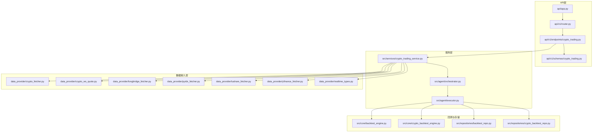
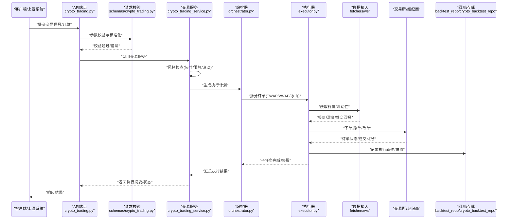
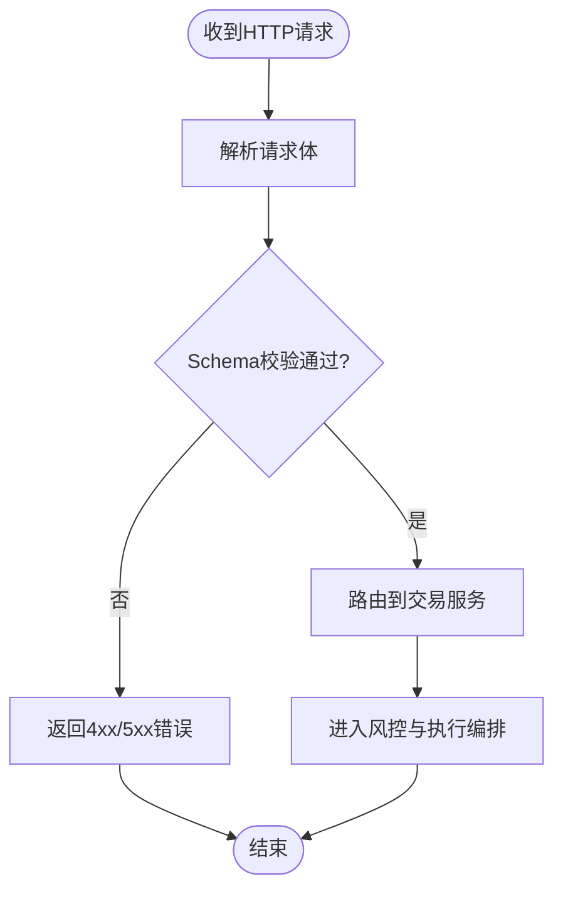
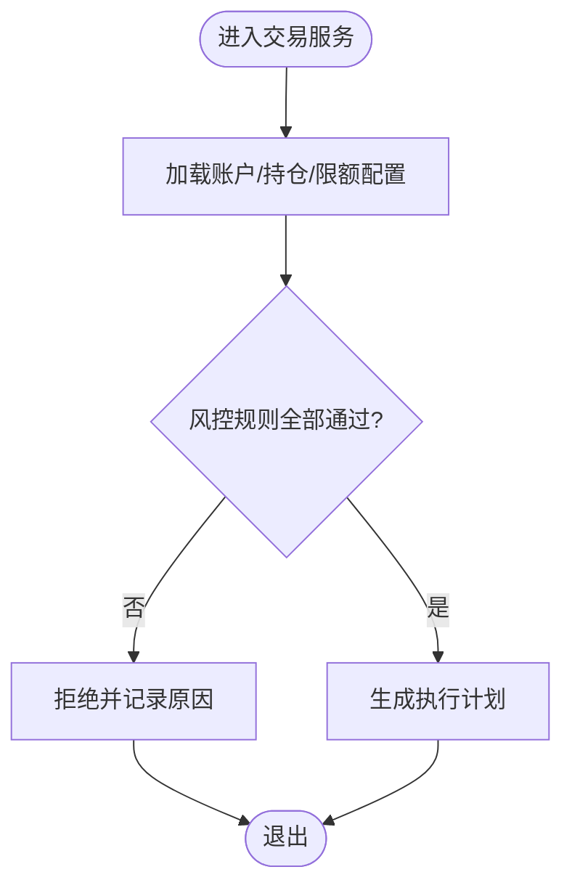
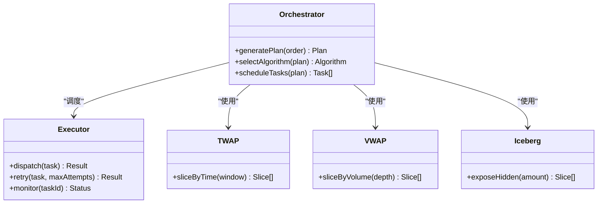
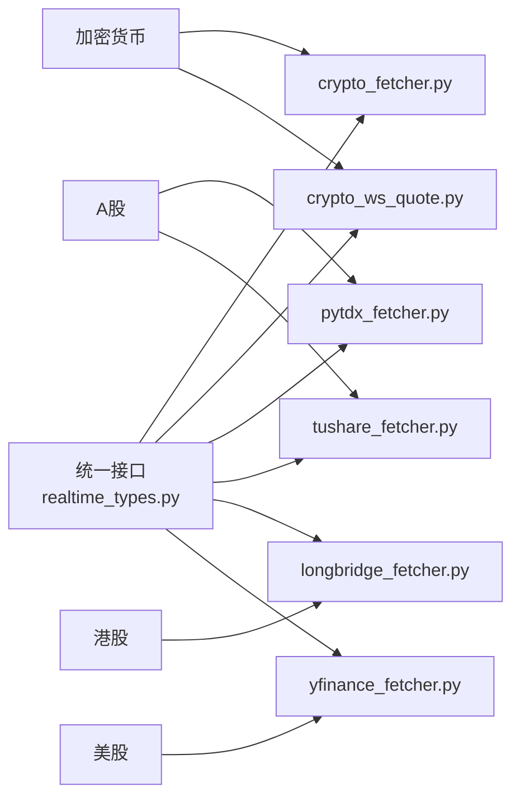
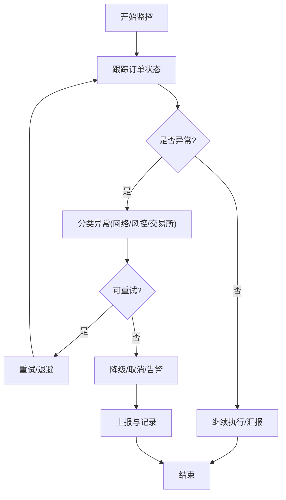
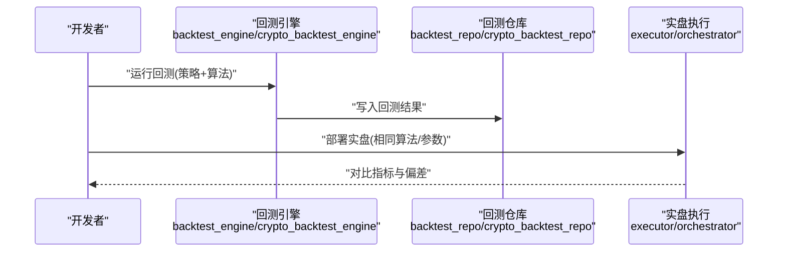
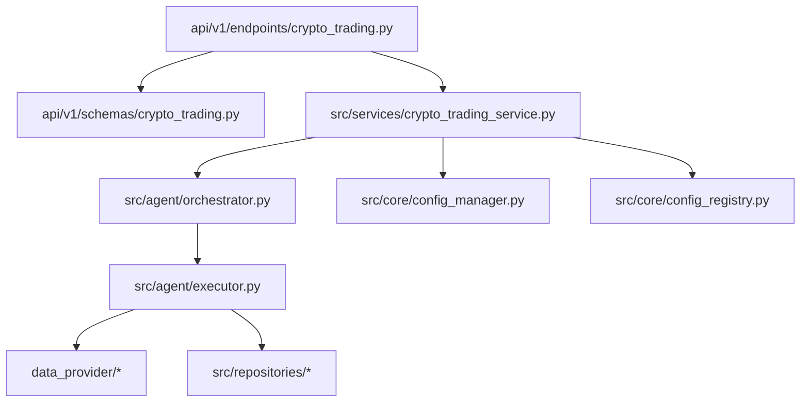

# 执行引擎

<cite>
**本文引用的文件**   
- [main.py](file://main.py)
- [server.py](file://server.py)
- [api/app.py](file://api/app.py)
- [api/v1/router.py](file://api/v1/router.py)
- [api/v1/endpoints/crypto_trading.py](file://api/v1/endpoints/crypto_trading.py)
- [api/v1/schemas/crypto_trading.py](file://api/v1/schemas/crypto_trading.py)
- [src/agent/orchestrator.py](file://src/agent/orchestrator.py)
- [src/agent/executor.py](file://src/agent/executor.py)
- [src/services/crypto_trading_service.py](file://src/services/crypto_trading_service.py)
- [data_provider/crypto_fetcher.py](file://data_provider/crypto_fetcher.py)
- [data_provider/crypto_ws_quote.py](file://data_provider/crypto_ws_quote.py)
- [data_provider/longbridge_fetcher.py](file://data_provider/longbridge_fetcher.py)
- [data_provider/pytdx_fetcher.py](file://data_provider/pytdx_fetcher.py)
- [data_provider/tushare_fetcher.py](file://data_provider/tushare_fetcher.py)
- [data_provider/yfinance_fetcher.py](file://data_provider/yfinance_fetcher.py)
- [data_provider/realtime_types.py](file://data_provider/realtime_types.py)
- [src/core/backtest_engine.py](file://src/core/backtest_engine.py)
- [src/core/crypto_backtest_engine.py](file://src/core/crypto_backtest_engine.py)
- [src/repositories/backtest_repo.py](file://src/repositories/backtest_repo.py)
- [src/repositories/crypto_backtest_repo.py](file://src/repositories/crypto_backtest_repo.py)
- [src/config_manager.py](file://src/core/config_manager.py)
- [src/config_registry.py](file://src/core/config_registry.py)
- [tests/test_btc_execution_alignment.py](file://tests/test_btc_execution_alignment.py)
- [tests/test_crypto_trading_service.py](file://tests/test_crypto_trading_service.py)
</cite>

## 目录
1. [简介](#简介)
2. [项目结构](#项目结构)
3. [核心组件](#核心组件)
4. [架构总览](#架构总览)
5. [详细组件分析](#详细组件分析)
6. [依赖关系分析](#依赖关系分析)
7. [性能考量](#性能考量)
8. [故障排查指南](#故障排查指南)
9. [结论](#结论)
10. [附录](#附录)

## 简介
本文件面向“执行引擎”的完整文档，聚焦实时交易执行流程与多市场数据接入。内容覆盖信号接收、订单路由、风险检查、执行监控；A股、港股、美股与加密货币市场的差异化接入方式；订单类型（市价单、限价单、止损单等）；执行算法（TWAP、VWAP、冰山订单）；以及执行监控面板与异常处理机制。文档以代码级为依据，结合架构图与时序图帮助读者快速理解系统行为与扩展点。

## 项目结构
执行引擎相关能力分布在API层、服务层、数据接入层与回测/持久化层：
- API层：提供交易控制与状态查询接口，定义请求/响应Schema。
- 服务层：封装策略到订单的执行编排、风控校验、订单拆分与调度。
- 数据接入层：对接不同交易所或聚合源，统一行情与订单回报。
- 回测与存储：为实盘执行提供历史验证与结果归档。

图表来源
- [api/app.py](file://api/app.py)
- [api/v1/router.py](file://api/v1/router.py)
- [api/v1/endpoints/crypto_trading.py](file://api/v1/endpoints/crypto_trading.py)
- [api/v1/schemas/crypto_trading.py](file://api/v1/schemas/crypto_trading.py)
- [src/services/crypto_trading_service.py](file://src/services/crypto_trading_service.py)
- [src/agent/orchestrator.py](file://src/agent/orchestrator.py)
- [src/agent/executor.py](file://src/agent/executor.py)
- [data_provider/crypto_fetcher.py](file://data_provider/crypto_fetcher.py)
- [data_provider/crypto_ws_quote.py](file://data_provider/crypto_ws_quote.py)
- [data_provider/longbridge_fetcher.py](file://data_provider/longbridge_fetcher.py)
- [data_provider/pytdx_fetcher.py](file://data_provider/pytdx_fetcher.py)
- [data_provider/tushare_fetcher.py](file://data_provider/tushare_fetcher.py)
- [data_provider/yfinance_fetcher.py](file://data_provider/yfinance_fetcher.py)
- [data_provider/realtime_types.py](file://data_provider/realtime_types.py)
- [src/core/backtest_engine.py](file://src/core/backtest_engine.py)
- [src/core/crypto_backtest_engine.py](file://src/core/crypto_backtest_engine.py)
- [src/repositories/backtest_repo.py](file://src/repositories/backtest_repo.py)
- [src/repositories/crypto_backtest_repo.py](file://src/repositories/crypto_backtest_repo.py)

章节来源
- [main.py](file://main.py)
- [server.py](file://server.py)
- [api/app.py](file://api/app.py)
- [api/v1/router.py](file://api/v1/router.py)

## 核心组件
- 信号接收与路由：API端点接收外部信号（如决策信号），经路由分发至交易服务。
- 交易服务：负责订单构建、风控校验、执行算法拆分与调度、状态跟踪。
- 执行器与编排：将复杂订单拆分为子任务，协调数据源与交易所通道。
- 数据接入：统一行情与订单回报，适配A股、港股、美股与加密货币。
- 回测与存储：支撑策略验证与执行结果归档。

章节来源
- [api/v1/endpoints/crypto_trading.py](file://api/v1/endpoints/crypto_trading.py)
- [api/v1/schemas/crypto_trading.py](file://api/v1/schemas/crypto_trading.py)
- [src/services/crypto_trading_service.py](file://src/services/crypto_trading_service.py)
- [src/agent/orchestrator.py](file://src/agent/orchestrator.py)
- [src/agent/executor.py](file://src/agent/executor.py)

## 架构总览
下图展示从信号接收到执行落地的端到端流程，涵盖风控、算法拆分、数据接入与监控。

图表来源
- [api/v1/endpoints/crypto_trading.py](file://api/v1/endpoints/crypto_trading.py)
- [api/v1/schemas/crypto_trading.py](file://api/v1/schemas/crypto_trading.py)
- [src/services/crypto_trading_service.py](file://src/services/crypto_trading_service.py)
- [src/agent/orchestrator.py](file://src/agent/orchestrator.py)
- [src/agent/executor.py](file://src/agent/executor.py)
- [data_provider/crypto_fetcher.py](file://data_provider/crypto_fetcher.py)
- [data_provider/crypto_ws_quote.py](file://data_provider/crypto_ws_quote.py)
- [src/repositories/backtest_repo.py](file://src/repositories/backtest_repo.py)
- [src/repositories/crypto_backtest_repo.py](file://src/repositories/crypto_backtest_repo.py)

## 详细组件分析

### 信号接收与订单路由
- API端点负责接收外部信号，进行Schema校验后转发给交易服务。
- 路由层按路径与方法分发到具体处理器，确保可扩展性。

图表来源
- [api/v1/router.py](file://api/v1/router.py)
- [api/v1/endpoints/crypto_trading.py](file://api/v1/endpoints/crypto_trading.py)
- [api/v1/schemas/crypto_trading.py](file://api/v1/schemas/crypto_trading.py)

章节来源
- [api/v1/router.py](file://api/v1/router.py)
- [api/v1/endpoints/crypto_trading.py](file://api/v1/endpoints/crypto_trading.py)
- [api/v1/schemas/crypto_trading.py](file://api/v1/schemas/crypto_trading.py)

### 交易服务与风控检查
- 交易服务在下单前进行多维度风控：账户可用资金、持仓限制、单笔/累计限额、波动率阈值、滑点容忍度等。
- 若风控不通过，直接拒绝并返回原因；通过后进入执行编排。

图表来源
- [src/services/crypto_trading_service.py](file://src/services/crypto_trading_service.py)
- [src/core/config_manager.py](file://src/core/config_manager.py)
- [src/core/config_registry.py](file://src/core/config_registry.py)

章节来源
- [src/services/crypto_trading_service.py](file://src/services/crypto_trading_service.py)
- [src/core/config_manager.py](file://src/core/config_manager.py)
- [src/core/config_registry.py](file://src/core/config_registry.py)

### 执行编排与算法拆分
- 编排器根据订单规模、时间窗口与流动性约束，选择执行算法：
  - TWAP：按时间切片均匀派发。
  - VWAP：按成交量权重动态派发。
  - 冰山订单：隐藏部分数量，逐步暴露。
- 执行器负责子任务调度、重试与幂等控制。

图表来源
- [src/agent/orchestrator.py](file://src/agent/orchestrator.py)
- [src/agent/executor.py](file://src/agent/executor.py)

章节来源
- [src/agent/orchestrator.py](file://src/agent/orchestrator.py)
- [src/agent/executor.py](file://src/agent/executor.py)

### 数据接入与市场差异
- 加密货币：通过REST与WebSocket双通道获取行情与订单回报，支持高频更新。
- A股：通过通达信/同花顺/Tushare等适配器拉取历史与实时数据。
- 港股：通过Longbridge等渠道接入。
- 美股：通过YFinance/Finnhub等聚合源获取。

图表来源
- [data_provider/crypto_fetcher.py](file://data_provider/crypto_fetcher.py)
- [data_provider/crypto_ws_quote.py](file://data_provider/crypto_ws_quote.py)
- [data_provider/pytdx_fetcher.py](file://data_provider/pytdx_fetcher.py)
- [data_provider/tushare_fetcher.py](file://data_provider/tushare_fetcher.py)
- [data_provider/longbridge_fetcher.py](file://data_provider/longbridge_fetcher.py)
- [data_provider/yfinance_fetcher.py](file://data_provider/yfinance_fetcher.py)
- [data_provider/realtime_types.py](file://data_provider/realtime_types.py)

章节来源
- [data_provider/crypto_fetcher.py](file://data_provider/crypto_fetcher.py)
- [data_provider/crypto_ws_quote.py](file://data_provider/crypto_ws_quote.py)
- [data_provider/pytdx_fetcher.py](file://data_provider/pytdx_fetcher.py)
- [data_provider/tushare_fetcher.py](file://data_provider/tushare_fetcher.py)
- [data_provider/longbridge_fetcher.py](file://data_provider/longbridge_fetcher.py)
- [data_provider/yfinance_fetcher.py](file://data_provider/yfinance_fetcher.py)
- [data_provider/realtime_types.py](file://data_provider/realtime_types.py)

### 订单类型支持
- 市价单：按当前最优价格立即成交，适合高流动性标的。
- 限价单：指定价格或更优价格成交，控制滑点。
- 止损单：触发条件后转为市价/限价单，用于风险控制。
- 组合订单：在风控与算法层面支持拆单与条件触发。

章节来源
- [api/v1/schemas/crypto_trading.py](file://api/v1/schemas/crypto_trading.py)
- [src/services/crypto_trading_service.py](file://src/services/crypto_trading_service.py)

### 执行监控面板与异常处理
- 监控面板：展示订单生命周期、子任务进度、成交回报与回撤指标。
- 异常处理：网络超时、交易所限流、行情延迟、订单被拒等场景均有重试与降级策略。
- 日志与追踪：关键节点埋点，便于问题定位与复盘。

图表来源
- [src/agent/executor.py](file://src/agent/executor.py)
- [src/services/crypto_trading_service.py](file://src/services/crypto_trading_service.py)

章节来源
- [src/agent/executor.py](file://src/agent/executor.py)
- [src/services/crypto_trading_service.py](file://src/services/crypto_trading_service.py)

### 回测与执行一致性
- 回测引擎为策略与执行算法提供历史验证，确保实盘与回测逻辑对齐。
- 加密货币与股票分别有专用回测引擎与仓库，便于隔离与扩展。

图表来源
- [src/core/backtest_engine.py](file://src/core/backtest_engine.py)
- [src/core/crypto_backtest_engine.py](file://src/core/crypto_backtest_engine.py)
- [src/repositories/backtest_repo.py](file://src/repositories/backtest_repo.py)
- [src/repositories/crypto_backtest_repo.py](file://src/repositories/crypto_backtest_repo.py)

章节来源
- [src/core/backtest_engine.py](file://src/core/backtest_engine.py)
- [src/core/crypto_backtest_engine.py](file://src/core/crypto_backtest_engine.py)
- [src/repositories/backtest_repo.py](file://src/repositories/backtest_repo.py)
- [src/repositories/crypto_backtest_repo.py](file://src/repositories/crypto_backtest_repo.py)

## 依赖关系分析
- API层依赖Schema与服务层，服务层依赖编排器与执行器。
- 执行器依赖数据接入层与交易所通道。
- 回测与存储独立于实盘执行，但共享算法与风控规则。

图表来源
- [api/v1/endpoints/crypto_trading.py](file://api/v1/endpoints/crypto_trading.py)
- [api/v1/schemas/crypto_trading.py](file://api/v1/schemas/crypto_trading.py)
- [src/services/crypto_trading_service.py](file://src/services/crypto_trading_service.py)
- [src/agent/orchestrator.py](file://src/agent/orchestrator.py)
- [src/agent/executor.py](file://src/agent/executor.py)
- [data_provider/crypto_fetcher.py](file://data_provider/crypto_fetcher.py)
- [data_provider/crypto_ws_quote.py](file://data_provider/crypto_ws_quote.py)
- [data_provider/longbridge_fetcher.py](file://data_provider/longbridge_fetcher.py)
- [data_provider/pytdx_fetcher.py](file://data_provider/pytdx_fetcher.py)
- [data_provider/tushare_fetcher.py](file://data_provider/tushare_fetcher.py)
- [data_provider/yfinance_fetcher.py](file://data_provider/yfinance_fetcher.py)
- [src/core/config_manager.py](file://src/core/config_manager.py)
- [src/core/config_registry.py](file://src/core/config_registry.py)
- [src/repositories/backtest_repo.py](file://src/repositories/backtest_repo.py)
- [src/repositories/crypto_backtest_repo.py](file://src/repositories/crypto_backtest_repo.py)

章节来源
- [api/v1/endpoints/crypto_trading.py](file://api/v1/endpoints/crypto_trading.py)
- [api/v1/schemas/crypto_trading.py](file://api/v1/schemas/crypto_trading.py)
- [src/services/crypto_trading_service.py](file://src/services/crypto_trading_service.py)
- [src/agent/orchestrator.py](file://src/agent/orchestrator.py)
- [src/agent/executor.py](file://src/agent/executor.py)

## 性能考量
- 行情接入：优先使用WebSocket获取低延迟报价，REST作为补充与校准。
- 订单拆分：根据流动性与波动率动态调整切片粒度，避免冲击成本过高。
- 并发与限流：对交易所限流进行自适应退避，避免被熔断。
- 缓存与去重：对重复订单与频繁查询进行缓存，减少冗余请求。
- 监控与告警：关键指标（延迟、滑点、成交率）实时上报，异常及时告警。

[本节为通用指导，不直接分析具体文件]

## 故障排查指南
- 常见问题：
  - 行情延迟或断连：检查WebSocket连接状态与重连策略。
  - 订单被拒：核对风控规则与交易所要求（最小手数、价格精度）。
  - 执行偏差：对比回测与实盘参数，确认算法实现一致。
- 排查步骤：
  - 查看执行日志与追踪ID，定位异常节点。
  - 检查配置中心的风控与限流设置。
  - 复现回测用例，验证算法与数据源一致性。

章节来源
- [src/agent/executor.py](file://src/agent/executor.py)
- [src/services/crypto_trading_service.py](file://src/services/crypto_trading_service.py)
- [src/core/config_manager.py](file://src/core/config_manager.py)
- [src/core/config_registry.py](file://src/core/config_registry.py)

## 结论
执行引擎通过清晰的层次划分与模块化设计，实现了从信号接收到执行落地的全链路闭环。多市场数据接入与统一的订单抽象使系统具备良好扩展性；风控与执行算法保障稳健性与效率；回测与监控为持续优化提供依据。建议在生产环境完善告警与演练机制，持续提升稳定性与可观测性。

[本节为总结性内容，不直接分析具体文件]

## 附录
- 测试与对齐：
  - BTC执行对齐测试验证实盘与回测的一致性。
  - 交易服务单元测试覆盖关键路径与边界条件。

章节来源
- [tests/test_btc_execution_alignment.py](file://tests/test_btc_execution_alignment.py)
- [tests/test_crypto_trading_service.py](file://tests/test_crypto_trading_service.py)