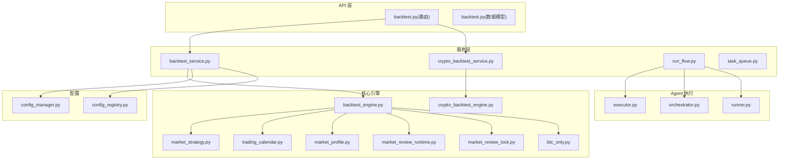
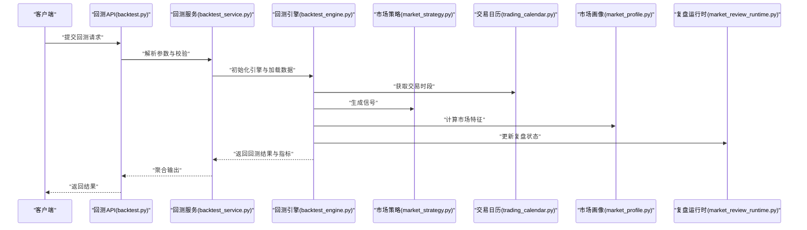
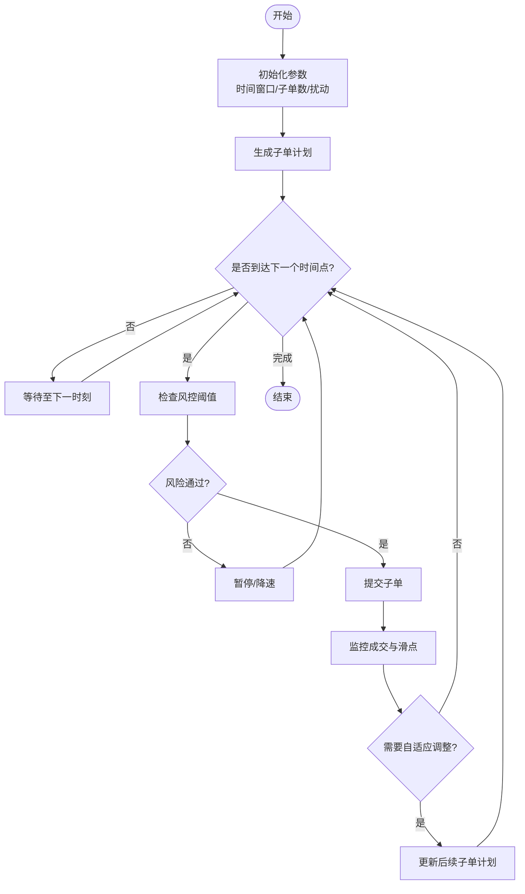
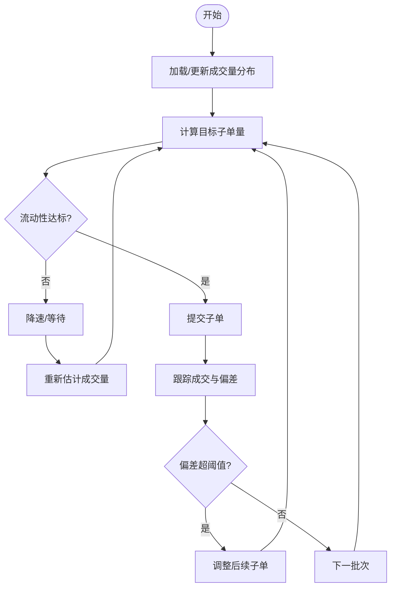
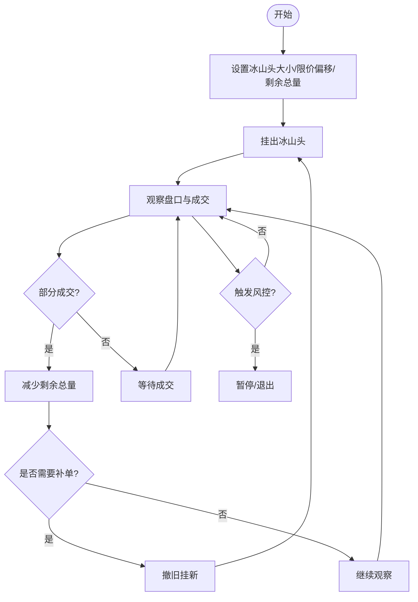
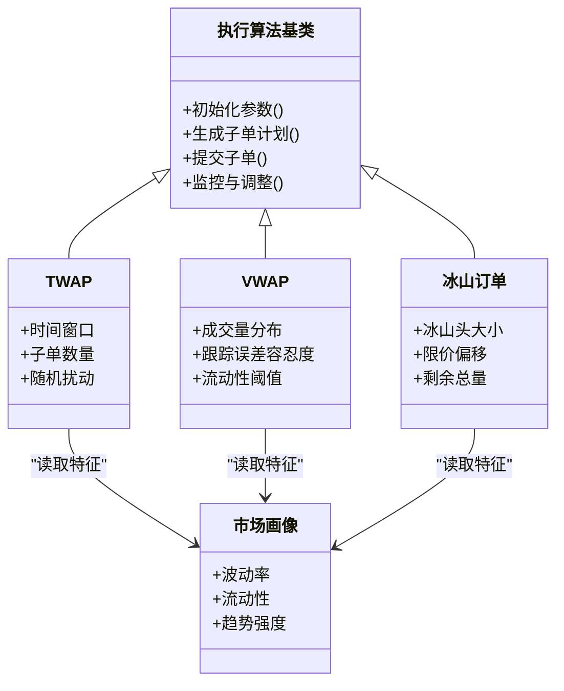
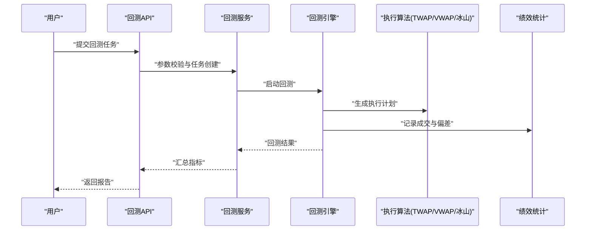
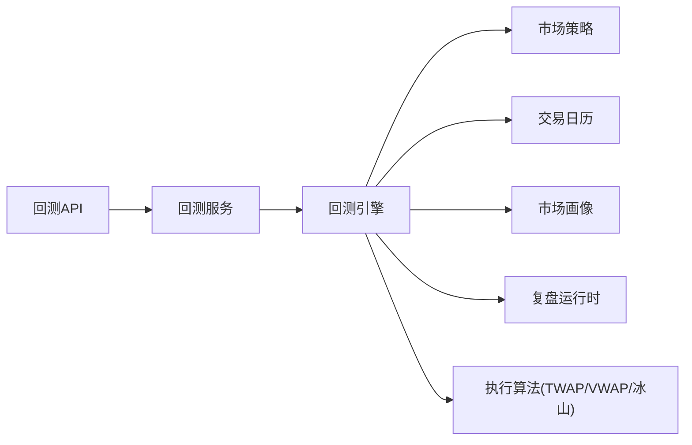

# 执行算法

<cite>
**本文引用的文件**   
- [backtest_engine.py](file://src/core/backtest_engine.py)
- [crypto_backtest_engine.py](file://src/core/crypto_backtest_engine.py)
- [backtest_service.py](file://src/services/backtest_service.py)
- [crypto_backtest_service.py](file://src/services/crypto_backtest_service.py)
- [executor.py](file://src/agent/executor.py)
- [orchestrator.py](file://src/agent/orchestrator.py)
- [runner.py](file://src/agent/runner.py)
- [market_strategy.py](file://src/core/market_strategy.py)
- [pipeline.py](file://src/core/pipeline.py)
- [trading_calendar.py](file://src/core/trading_calendar.py)
- [config_manager.py](file://src/core/config_manager.py)
- [config_registry.py](file://src/core/config_registry.py)
- [run_flow.py](file://src/services/run_flow.py)
- [task_queue.py](file://src/services/task_queue.py)
- [backtest.py](file://api/v1/endpoints/backtest.py)
- [backtest.py](file://api/v1/schemas/backtest.py)
- [btc_only.py](file://src/core/btc_only.py)
- [market_profile.py](file://src/core/market_profile.py)
- [market_review_runtime.py](file://src/core/market_review_runtime.py)
- [market_review_lock.py](file://src/core/market_review_lock.py)
</cite>

## 目录
1. [简介](#简介)
2. [项目结构](#项目结构)
3. [核心组件](#核心组件)
4. [架构总览](#架构总览)
5. [详细组件分析](#详细组件分析)
6. [依赖关系分析](#依赖关系分析)
7. [性能考虑](#性能考虑)
8. [故障排查指南](#故障排查指南)
9. [结论](#结论)
10. [附录](#附录)

## 简介
本文件聚焦于“执行算法”的文档化，覆盖时间加权平均价格（TWAP）、成交量加权平均价格（VWAP）与冰山订单等常见执行策略的实现原理、参数配置、性能优化与风险控制。同时给出算法选择策略与自适应调整机制的设计思路，并说明如何与回测框架集成以及如何进行效果评估。为便于不同技术背景的读者理解，文档采用由浅入深的层次化组织，并提供可视化图示辅助理解。

## 项目结构
围绕执行算法与回测能力，代码库主要分布在以下模块：
- 核心引擎与策略：位于 src/core，包含回测引擎、市场策略、交易日历、市场画像与复盘运行时等。
- 服务层：位于 src/services，封装回测服务、任务队列、运行流编排等。
- Agent 执行器：位于 src/agent，提供执行器、编排器与运行器，用于将策略与执行流程组合。
- API 层：位于 api/v1，暴露回测相关接口与数据模型。
- 其他支撑：配置管理、注册表、BTC 专用逻辑、市场画像等。

图表来源
- [backtest.py](file://api/v1/endpoints/backtest.py)
- [backtest.py](file://api/v1/schemas/backtest.py)
- [backtest_service.py](file://src/services/backtest_service.py)
- [crypto_backtest_service.py](file://src/services/crypto_backtest_service.py)
- [backtest_engine.py](file://src/core/backtest_engine.py)
- [crypto_backtest_engine.py](file://src/core/crypto_backtest_engine.py)
- [market_strategy.py](file://src/core/market_strategy.py)
- [trading_calendar.py](file://src/core/trading_calendar.py)
- [market_profile.py](file://src/core/market_profile.py)
- [market_review_runtime.py](file://src/core/market_review_runtime.py)
- [market_review_lock.py](file://src/core/market_review_lock.py)
- [btc_only.py](file://src/core/btc_only.py)
- [executor.py](file://src/agent/executor.py)
- [orchestrator.py](file://src/agent/orchestrator.py)
- [runner.py](file://src/agent/runner.py)
- [config_manager.py](file://src/core/config_manager.py)
- [config_registry.py](file://src/core/config_registry.py)
- [run_flow.py](file://src/services/run_flow.py)
- [task_queue.py](file://src/services/task_queue.py)

章节来源
- [backtest_engine.py](file://src/core/backtest_engine.py)
- [crypto_backtest_engine.py](file://src/core/crypto_backtest_engine.py)
- [backtest_service.py](file://src/services/backtest_service.py)
- [crypto_backtest_service.py](file://src/services/crypto_backtest_service.py)
- [executor.py](file://src/agent/executor.py)
- [orchestrator.py](file://src/agent/orchestrator.py)
- [runner.py](file://src/agent/runner.py)
- [market_strategy.py](file://src/core/market_strategy.py)
- [pipeline.py](file://src/core/pipeline.py)
- [trading_calendar.py](file://src/core/trading_calendar.py)
- [config_manager.py](file://src/core/config_manager.py)
- [config_registry.py](file://src/core/config_registry.py)
- [run_flow.py](file://src/services/run_flow.py)
- [task_queue.py](file://src/services/task_queue.py)
- [backtest.py](file://api/v1/endpoints/backtest.py)
- [backtest.py](file://api/v1/schemas/backtest.py)
- [btc_only.py](file://src/core/btc_only.py)
- [market_profile.py](file://src/core/market_profile.py)
- [market_review_runtime.py](file://src/core/market_review_runtime.py)
- [market_review_lock.py](file://src/core/market_review_lock.py)

## 核心组件
- 回测引擎（股票与加密）：负责历史数据回放、信号生成、成交模拟、滑点与手续费建模、绩效统计。
- 市场策略：定义入场/出场规则、仓位管理与风控阈值，作为执行算法的上层输入。
- 交易日历：过滤非交易日与节假日，确保回测与实盘的时间对齐。
- 市场画像与复盘运行时：提供市场状态特征（波动率、流动性、趋势强度），用于执行算法的自适应调整。
- 执行器与编排器：将策略与执行算法组合，形成可运行的流水线；支持任务调度与并发控制。
- 配置管理与注册表：集中管理执行算法参数、开关与扩展点，保证一致性与可维护性。

章节来源
- [backtest_engine.py](file://src/core/backtest_engine.py)
- [crypto_backtest_engine.py](file://src/core/crypto_backtest_engine.py)
- [market_strategy.py](file://src/core/market_strategy.py)
- [trading_calendar.py](file://src/core/trading_calendar.py)
- [market_profile.py](file://src/core/market_profile.py)
- [market_review_runtime.py](file://src/core/market_review_runtime.py)
- [executor.py](file://src/agent/executor.py)
- [orchestrator.py](file://src/agent/orchestrator.py)
- [runner.py](file://src/agent/runner.py)
- [config_manager.py](file://src/core/config_manager.py)
- [config_registry.py](file://src/core/config_registry.py)

## 架构总览
下图展示了从 API 到回测引擎、再到执行算法与绩效评估的整体调用链。

图表来源
- [backtest.py](file://api/v1/endpoints/backtest.py)
- [backtest_service.py](file://src/services/backtest_service.py)
- [backtest_engine.py](file://src/core/backtest_engine.py)
- [market_strategy.py](file://src/core/market_strategy.py)
- [trading_calendar.py](file://src/core/trading_calendar.py)
- [market_profile.py](file://src/core/market_profile.py)
- [market_review_runtime.py](file://src/core/market_review_runtime.py)

## 详细组件分析

### TWAP（时间加权平均价格）执行算法
- 实现原理
  - 将目标订单按时间均匀拆分为多个子单，在预设的时间窗口内依次触发，以平滑冲击成本。
  - 结合交易日历确定有效时间段，避免在非交易时段下单。
  - 可结合市场画像（如波动率、流动性）动态调整子单间隔与数量。
- 参数配置
  - 时间窗口：开始时间与结束时间，或持续时长。
  - 子单数量：拆分粒度，影响冲击与滑点。
  - 随机扰动：为避免被高频参与者捕捉，可在时间或数量上加入小幅度抖动。
  - 风控阈值：最大偏离基准价比例、最大回撤限制、暂停条件。
- 性能优化
  - 批量计算子单计划，减少实时决策开销。
  - 使用滑动窗口统计近期成交量与波动率，降低计算复杂度。
  - 缓存市场画像与交易日历，避免重复计算。
- 风险控制
  - 设置最大单笔量与累计量上限。
  - 监控滑点与成交质量，超过阈值自动降速或暂停。
  - 异常恢复：网络或交易所错误时重试与补偿。
- 自适应调整
  - 根据市场流动性与波动率动态调整子单频率与大小。
  - 当检测到异常波动时，自动延长执行时间或缩小子单规模。

图表来源
- [backtest_engine.py](file://src/core/backtest_engine.py)
- [trading_calendar.py](file://src/core/trading_calendar.py)
- [market_profile.py](file://src/core/market_profile.py)
- [market_review_runtime.py](file://src/core/market_review_runtime.py)

章节来源
- [backtest_engine.py](file://src/core/backtest_engine.py)
- [trading_calendar.py](file://src/core/trading_calendar.py)
- [market_profile.py](file://src/core/market_profile.py)
- [market_review_runtime.py](file://src/core/market_review_runtime.py)

### VWAP（成交量加权平均价格）执行算法
- 实现原理
  - 依据历史或实时成交量分布曲线，按比例分配子单，尽量使成交均价接近市场 VWAP。
  - 结合盘口深度与成交速率，动态修正预期成交量曲线。
- 参数配置
  - 成交量预测模型：基于历史分时段成交量或实时滚动统计。
  - 跟踪误差容忍度：允许偏离目标 VWAP 的比例。
  - 流动性阈值：低于阈值时降速或切换策略。
- 性能优化
  - 增量更新成交量分布，避免全量重算。
  - 使用近似算法快速估算剩余成交量与时间。
- 风险控制
  - 设置最大偏离与最大回撤，触发保护机制。
  - 监控成交延迟与失败率，进行退避与重试。
- 自适应调整
  - 根据实际成交与盘口变化，在线修正成交量曲线。
  - 在市场突变时切换到更保守的执行模式。

图表来源
- [backtest_engine.py](file://src/core/backtest_engine.py)
- [market_profile.py](file://src/core/market_profile.py)
- [market_review_runtime.py](file://src/core/market_review_runtime.py)

章节来源
- [backtest_engine.py](file://src/core/backtest_engine.py)
- [market_profile.py](file://src/core/market_profile.py)
- [market_review_runtime.py](file://src/core/market_review_runtime.py)

### 冰山订单（Iceberg）执行算法
- 实现原理
  - 将大单隐藏大部分数量，仅显示少量“冰山头”，逐步成交以避免市场冲击。
  - 配合限价单与撤单策略，维持隐蔽性与成交效率的平衡。
- 参数配置
  - 冰山头大小：每次可见与可成交的数量。
  - 剩余总量与目标成交速度。
  - 限价偏移：相对于中间价的偏移，控制成交概率与滑点。
- 性能优化
  - 使用事件驱动更新盘口与成交信息，减少轮询开销。
  - 缓存盘口快照，提高判断速度。
- 风险控制
  - 设置最大可见量与最大撤单次数，防止被频繁撤销导致惩罚。
  - 监控异常波动与流动性枯竭，及时暂停或退出。
- 自适应调整
  - 根据盘口深度与成交速率动态调整冰山头大小与限价偏移。
  - 在市场压力增大时减小可见量并提高限价偏移。

图表来源
- [backtest_engine.py](file://src/core/backtest_engine.py)
- [market_profile.py](file://src/core/market_profile.py)
- [market_review_runtime.py](file://src/core/market_review_runtime.py)

章节来源
- [backtest_engine.py](file://src/core/backtest_engine.py)
- [market_profile.py](file://src/core/market_profile.py)
- [market_review_runtime.py](file://src/core/market_review_runtime.py)

### 算法选择策略与自适应调整机制
- 选择策略
  - 基于市场画像（波动率、流动性、趋势强度）与订单特征（规模、时效性）选择合适算法。
  - 例如高波动低流动性场景优先冰山订单，平稳流动性充足场景优先 VWAP/TWAP。
- 自适应调整
  - 在线监测成交质量与偏差，动态调整参数（子单规模、时间间隔、限价偏移）。
  - 引入反馈控制回路，根据误差信号修正执行计划。
- 回测集成
  - 在回测引擎中注入算法插件，统一接口与数据源，便于对比评估。
  - 记录关键指标（成交均价、滑点、冲击成本、换手率、回撤）用于评估。

图表来源
- [backtest_engine.py](file://src/core/backtest_engine.py)
- [market_profile.py](file://src/core/market_profile.py)

章节来源
- [backtest_engine.py](file://src/core/backtest_engine.py)
- [market_profile.py](file://src/core/market_profile.py)

### 回测框架集成与效果评估
- 集成方式
  - 通过回测服务统一入口，传入策略与执行算法参数，引擎回放历史数据并模拟成交。
  - 支持股票与加密两类引擎，分别适配不同市场特性。
- 评估指标
  - 成交均价与基准比较（如 VWAP 偏差）。
  - 冲击成本与滑点统计。
  - 换手率、胜率、盈亏比、最大回撤、夏普比率等。
- 可视化与报告
  - 生成回测摘要与明细，便于对比不同算法与参数组合的效果。
  - 结合复盘运行时与市场画像，解释执行质量变化的原因。

图表来源
- [backtest.py](file://api/v1/endpoints/backtest.py)
- [backtest_service.py](file://src/services/backtest_service.py)
- [backtest_engine.py](file://src/core/backtest_engine.py)

章节来源
- [backtest.py](file://api/v1/endpoints/backtest.py)
- [backtest_service.py](file://src/services/backtest_service.py)
- [backtest_engine.py](file://src/core/backtest_engine.py)

## 依赖关系分析
- 组件耦合
  - 回测引擎依赖市场策略、交易日历、市场画像与复盘运行时，形成稳定的数据与状态输入。
  - 执行算法通过统一接口接入引擎，保持低耦合与高扩展性。
- 外部依赖
  - 数据源与交易所接口在引擎层抽象，便于替换与测试。
  - 配置管理集中化，确保参数一致性与版本兼容。
- 潜在循环依赖
  - 通过分层与接口隔离避免循环依赖，确保模块职责清晰。

图表来源
- [backtest_engine.py](file://src/core/backtest_engine.py)
- [market_strategy.py](file://src/core/market_strategy.py)
- [trading_calendar.py](file://src/core/trading_calendar.py)
- [market_profile.py](file://src/core/market_profile.py)
- [market_review_runtime.py](file://src/core/market_review_runtime.py)
- [backtest_service.py](file://src/services/backtest_service.py)
- [backtest.py](file://api/v1/endpoints/backtest.py)

章节来源
- [backtest_engine.py](file://src/core/backtest_engine.py)
- [market_strategy.py](file://src/core/market_strategy.py)
- [trading_calendar.py](file://src/core/trading_calendar.py)
- [market_profile.py](file://src/core/market_profile.py)
- [market_review_runtime.py](file://src/core/market_review_runtime.py)
- [backtest_service.py](file://src/services/backtest_service.py)
- [backtest.py](file://api/v1/endpoints/backtest.py)

## 性能考虑
- 计算复杂度
  - TWAP/VWAP 的子单计划生成应为 O(n)，n 为子单数量；成交量分布更新可采用增量方法降低复杂度。
  - 冰山订单的盘口监控应使用事件驱动，避免轮询带来的 CPU 浪费。
- 内存与缓存
  - 缓存市场画像与交易日历，减少重复计算。
  - 对历史数据进行分页与懒加载，避免一次性加载过大内存占用。
- 并发与异步
  - 使用任务队列与异步处理提升吞吐，注意线程安全与锁的使用。
- I/O 优化
  - 批量写入日志与指标，减少磁盘 I/O 频率。
  - 网络请求增加超时与重试策略，提升稳定性。

[本节为通用指导，不直接分析具体文件]

## 故障排查指南
- 常见问题
  - 参数校验失败：检查时间窗口、子单数量、限价偏移等是否在合理范围。
  - 成交失败或延迟：检查交易所接口状态、网络连通性与限流策略。
  - 风控触发：查看滑点、偏离阈值与回撤是否超限，调整参数或暂停执行。
- 调试建议
  - 启用详细日志，记录关键步骤与状态变化。
  - 使用回测环境复现问题，定位参数与数据问题。
  - 结合复盘运行时与市场画像，分析执行质量变化的原因。

章节来源
- [backtest_engine.py](file://src/core/backtest_engine.py)
- [market_review_runtime.py](file://src/core/market_review_runtime.py)
- [market_review_lock.py](file://src/core/market_review_lock.py)

## 结论
本文件系统化梳理了 TWAP、VWAP 与冰山订单等执行算法的实现原理、参数配置、性能优化与风险控制，并结合回测框架提供了集成与评估方法。通过市场画像与复盘运行时，可实现算法的自适应调整，提升执行质量与稳定性。建议在实盘前充分回测与压力测试，逐步上线并持续监控。

[本节为总结性内容，不直接分析具体文件]

## 附录
- 配置示例（概念性）
  - TWAP：时间窗口=开盘后1小时，子单数=20，随机扰动=±10%。
  - VWAP：成交量分布=历史分时段均值，跟踪误差容忍度=0.1%，流动性阈值=最低日均成交量×0.5%。
  - 冰山订单：冰山头大小=总规模的1%，限价偏移=中间价±0.05%，剩余总量=分批递减。
- 最佳实践
  - 先回测再上线，逐步扩大规模。
  - 监控关键指标，设置自动化告警。
  - 定期复盘与参数调优，适应市场变化。

[本节为补充信息，不直接分析具体文件]