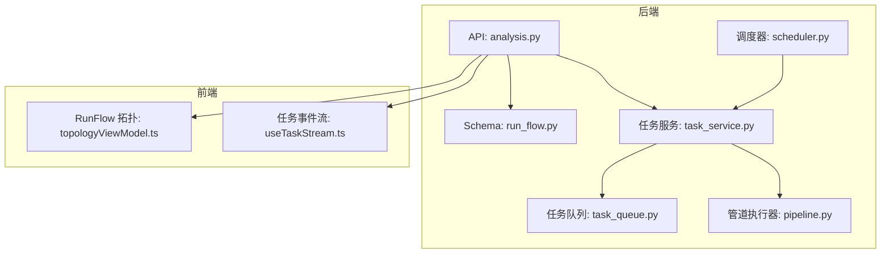
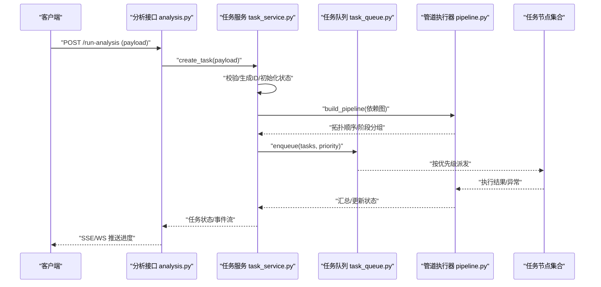
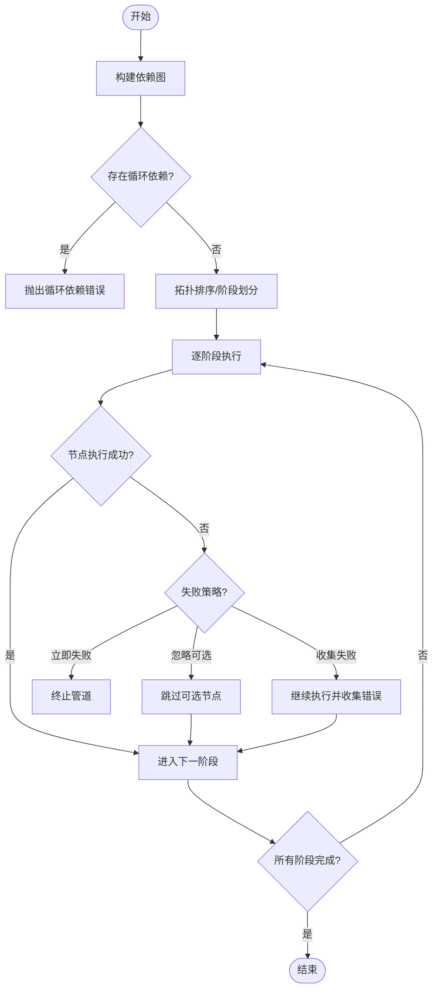
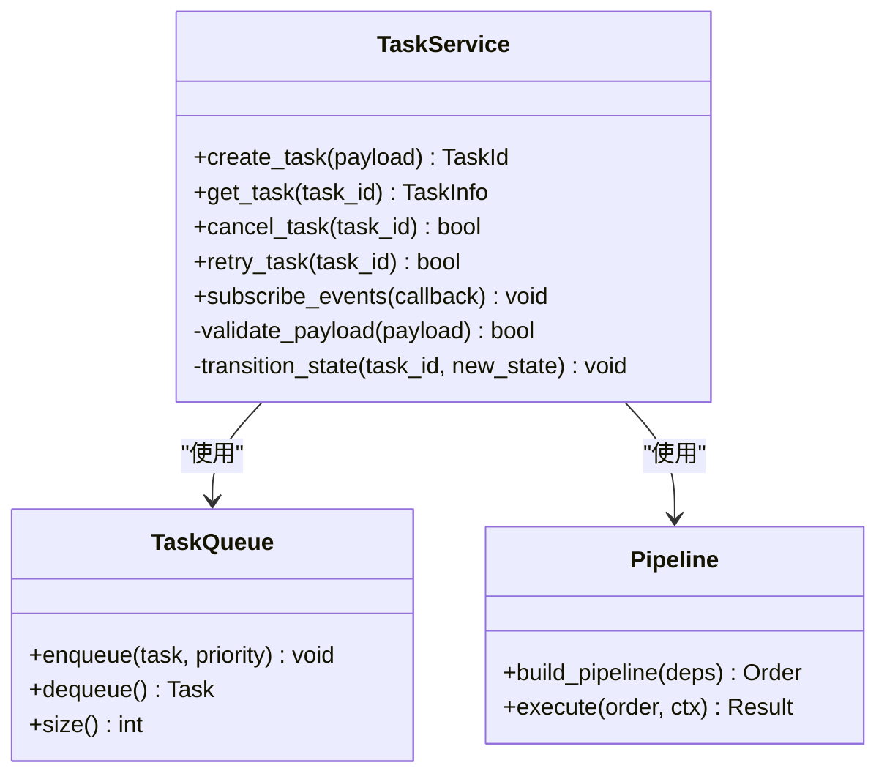
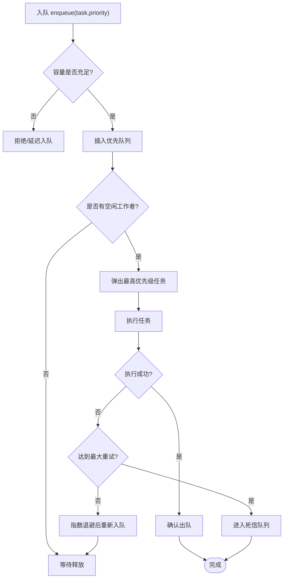
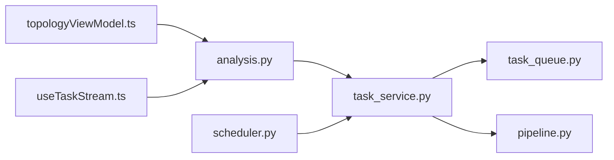

# 管道执行器

<cite>
**本文引用的文件**   
- [src/core/pipeline.py](file://src/core/pipeline.py)
- [src/services/task_service.py](file://src/services/task_service.py)
- [src/services/task_queue.py](file://src/services/task_queue.py)
- [src/scheduler.py](file://src/scheduler.py)
- [api/v1/endpoints/analysis.py](file://api/v1/endpoints/analysis.py)
- [api/v1/schemas/run_flow.py](file://api/v1/schemas/run_flow.py)
- [apps/dsa-web/src/components/run-flow/topologyViewModel.ts](file://apps/dsa-web/src/components/run-flow/topologyViewModel.ts)
- [apps/dsa-web/src/hooks/useTaskStream.ts](file://apps/dsa-web/src/hooks/useTaskStream.ts)
- [tests/test_pipeline_daily_market_context.py](file://tests/test_pipeline_daily_market_context.py)
- [tests/test_pipeline_fetch_error.py](file://tests/test_pipeline_fetch_error.py)
- [tests/test_run_flow.py](file://tests/test_run_flow.py)
</cite>

## 目录
1. [简介](#简介)
2. [项目结构](#项目结构)
3. [核心组件](#核心组件)
4. [架构总览](#架构总览)
5. [详细组件分析](#详细组件分析)
6. [依赖关系分析](#依赖关系分析)
7. [性能考虑](#性能考虑)
8. [故障排查指南](#故障排查指南)
9. [结论](#结论)
10. [附录](#附录)

## 简介
本文件面向“管道执行器”子系统，系统化说明任务管道的构建与执行流程，涵盖任务调度、依赖管理、错误处理、生命周期管理、并行执行机制与优先级排序，以及监控、日志记录与性能优化策略。文档同时提供配置示例与故障排查指南，帮助读者快速理解并高效使用该系统。

## 项目结构
围绕管道执行器的关键代码分布在后端服务层、API 层、前端可视化与测试用例中：
- 后端核心：管道定义与执行（pipeline）、任务服务（task_service）、任务队列（task_queue）、调度器（scheduler）
- API 层：分析接口入口与运行流 Schema
- 前端：运行流拓扑视图与事件流订阅
- 测试：覆盖日常上下文、拉取错误、运行流等场景

图表来源
- [api/v1/endpoints/analysis.py](file://api/v1/endpoints/analysis.py)
- [api/v1/schemas/run_flow.py](file://api/v1/schemas/run_flow.py)
- [src/services/task_service.py](file://src/services/task_service.py)
- [src/services/task_queue.py](file://src/services/task_queue.py)
- [src/core/pipeline.py](file://src/core/pipeline.py)
- [src/scheduler.py](file://src/scheduler.py)
- [apps/dsa-web/src/components/run-flow/topologyViewModel.ts](file://apps/dsa-web/src/components/run-flow/topologyViewModel.ts)
- [apps/dsa-web/src/hooks/useTaskStream.ts](file://apps/dsa-web/src/hooks/useTaskStream.ts)

章节来源
- [src/core/pipeline.py](file://src/core/pipeline.py)
- [src/services/task_service.py](file://src/services/task_service.py)
- [src/services/task_queue.py](file://src/services/task_queue.py)
- [src/scheduler.py](file://src/scheduler.py)
- [api/v1/endpoints/analysis.py](file://api/v1/endpoints/analysis.py)
- [api/v1/schemas/run_flow.py](file://api/v1/schemas/run_flow.py)
- [apps/dsa-web/src/components/run-flow/topologyViewModel.ts](file://apps/dsa-web/src/components/run-flow/topologyViewModel.ts)
- [apps/dsa-web/src/hooks/useTaskStream.ts](file://apps/dsa-web/src/hooks/useTaskStream.ts)

## 核心组件
- 管道执行器（Pipeline）：负责将多个任务节点按依赖关系组织为有向无环图（DAG），进行拓扑排序、阶段划分与执行编排。支持可选步骤、失败策略与结果透传。
- 任务服务（TaskService）：对外暴露创建、查询、取消、重试等操作；维护任务状态机、生命周期钩子、并发控制与资源隔离。
- 任务队列（TaskQueue）：基于优先级的任务分发与执行池，支持限流、背压、重试与退避策略。
- 调度器（Scheduler）：定时触发或事件驱动的任务提交，支持周期任务与一次性任务。
- API 层：接收请求、校验参数、调用任务服务，返回任务 ID 与进度事件。
- 前端：渲染运行流拓扑、实时展示节点状态与日志，支持用户交互（暂停、重试、取消）。

章节来源
- [src/core/pipeline.py](file://src/core/pipeline.py)
- [src/services/task_service.py](file://src/services/task_service.py)
- [src/services/task_queue.py](file://src/services/task_queue.py)
- [src/scheduler.py](file://src/scheduler.py)
- [api/v1/endpoints/analysis.py](file://api/v1/endpoints/analysis.py)
- [api/v1/schemas/run_flow.py](file://api/v1/schemas/run_flow.py)

## 架构总览
下图展示了从 API 到管道执行的端到端流程，包括任务创建、依赖解析、调度入队、并行执行、事件上报与结果聚合。

图表来源
- [api/v1/endpoints/analysis.py](file://api/v1/endpoints/analysis.py)
- [src/services/task_service.py](file://src/services/task_service.py)
- [src/services/task_queue.py](file://src/services/task_queue.py)
- [src/core/pipeline.py](file://src/core/pipeline.py)

## 详细组件分析

### 管道执行器（Pipeline）
- 功能要点
  - DAG 构建：根据任务依赖关系构建有向无环图，检测循环依赖。
  - 拓扑排序：计算可执行顺序，划分阶段以支持并行。
  - 执行编排：按阶段推进，支持跳过可选节点、失败回退与继续策略。
  - 数据传递：阶段间通过上下文对象传递中间结果。
  - 监控与日志：每个节点开始/结束/错误事件上报。
- 复杂度与性能
  - 拓扑排序时间复杂度 O(V+E)，V 为节点数，E 为依赖边数。
  - 阶段并行度受限于最大并发与资源限制。
- 错误处理
  - 节点级异常捕获与重试（指数退避）。
  - 失败策略：立即失败、忽略可选失败、收集全部失败后统一报告。

图表来源
- [src/core/pipeline.py](file://src/core/pipeline.py)

章节来源
- [src/core/pipeline.py](file://src/core/pipeline.py)

### 任务服务（TaskService）
- 职责
  - 任务生命周期管理：创建、启动、暂停、恢复、取消、重试、删除。
  - 状态机：维护任务各阶段状态（待处理、排队中、运行中、成功、失败、已取消）。
  - 并发控制：限制同时运行的任务数量，避免资源耗尽。
  - 事件总线：发布任务状态变更与进度事件，供前端订阅。
  - 与队列和管道集成：提交任务、获取执行结果、聚合日志。
- 设计模式
  - 观察者模式：事件通知。
  - 工厂模式：根据类型创建具体任务实例。
  - 策略模式：失败处理与重试策略。

图表来源
- [src/services/task_service.py](file://src/services/task_service.py)
- [src/services/task_queue.py](file://src/services/task_queue.py)
- [src/core/pipeline.py](file://src/core/pipeline.py)

章节来源
- [src/services/task_service.py](file://src/services/task_service.py)

### 任务队列（TaskQueue）
- 功能要点
  - 优先级队列：支持高优先级任务优先执行。
  - 执行池：固定大小的工作线程/协程池，限制并发。
  - 背压与限流：当队列长度超过阈值时拒绝或延迟入队。
  - 重试与退避：对失败任务自动重试，支持指数退避与最大重试次数。
- 数据结构
  - 优先队列：最小堆实现，按优先级键排序。
  - 任务元数据：包含任务 ID、类型、参数、优先级、重试计数、超时时间。

图表来源
- [src/services/task_queue.py](file://src/services/task_queue.py)

章节来源
- [src/services/task_queue.py](file://src/services/task_queue.py)

### 调度器（Scheduler）
- 功能要点
  - 定时触发：基于 cron 表达式或间隔触发任务提交。
  - 事件驱动：外部事件（如数据就绪）触发管道构建与执行。
  - 任务去重：相同参数的任务在同一时间窗口内不重复提交。
  - 健康检查：监控调度器自身状态与任务积压情况。
- 与任务服务集成
  - 调用任务服务创建任务，传入优先级与参数。
  - 监听任务服务的事件，调整调度策略（如失败率过高时降频）。

章节来源
- [src/scheduler.py](file://src/scheduler.py)

### API 层（analysis.py 与 run_flow.py）
- 接口职责
  - 接收前端请求，校验 payload 是否符合 Schema。
  - 调用任务服务创建任务，返回任务 ID 与初始状态。
  - 提供 SSE/WS 通道推送任务进度与日志。
- Schema 约束
  - run_flow.py 定义运行流的输入输出结构，确保前后端契约一致。

章节来源
- [api/v1/endpoints/analysis.py](file://api/v1/endpoints/analysis.py)
- [api/v1/schemas/run_flow.py](file://api/v1/schemas/run_flow.py)

### 前端可视化（topologyViewModel.ts 与 useTaskStream.ts）
- 拓扑视图
  - 根据任务依赖图渲染节点与边，支持点击查看详情。
  - 实时更新节点状态（运行、成功、失败、取消）。
- 事件流订阅
  - 使用 WebSocket/SSE 订阅任务事件，增量更新 UI。
  - 支持用户操作（暂停、重试、取消）并回写后端。

章节来源
- [apps/dsa-web/src/components/run-flow/topologyViewModel.ts](file://apps/dsa-web/src/components/run-flow/topologyViewModel.ts)
- [apps/dsa-web/src/hooks/useTaskStream.ts](file://apps/dsa-web/src/hooks/useTaskStream.ts)

## 依赖关系分析
- 组件耦合
  - 任务服务依赖管道执行器与任务队列，形成“编排-执行-调度”的三层解耦。
  - API 层仅依赖任务服务，屏蔽内部复杂性。
  - 前端通过事件流与后端解耦，关注展示与交互。
- 外部依赖
  - 消息通道（SSE/WS）用于实时通信。
  - 存储（持久化任务状态与日志）用于可观测性与恢复。
- 潜在循环依赖
  - 通过接口抽象与事件解耦避免循环导入。

图表来源
- [api/v1/endpoints/analysis.py](file://api/v1/endpoints/analysis.py)
- [src/services/task_service.py](file://src/services/task_service.py)
- [src/services/task_queue.py](file://src/services/task_queue.py)
- [src/core/pipeline.py](file://src/core/pipeline.py)
- [src/scheduler.py](file://src/scheduler.py)
- [apps/dsa-web/src/components/run-flow/topologyViewModel.ts](file://apps/dsa-web/src/components/run-flow/topologyViewModel.ts)
- [apps/dsa-web/src/hooks/useTaskStream.ts](file://apps/dsa-web/src/hooks/useTaskStream.ts)

章节来源
- [src/core/pipeline.py](file://src/core/pipeline.py)
- [src/services/task_service.py](file://src/services/task_service.py)
- [src/services/task_queue.py](file://src/services/task_queue.py)
- [src/scheduler.py](file://src/scheduler.py)
- [api/v1/endpoints/analysis.py](file://api/v1/endpoints/analysis.py)
- [apps/dsa-web/src/components/run-flow/topologyViewModel.ts](file://apps/dsa-web/src/components/run-flow/topologyViewModel.ts)
- [apps/dsa-web/src/hooks/useTaskStream.ts](file://apps/dsa-web/src/hooks/useTaskStream.ts)

## 性能考虑
- 并行执行
  - 阶段内任务并行执行，阶段间串行推进，最大化吞吐。
  - 通过执行池大小与 I/O 并发模型（协程/线程）调优。
- 优先级与公平性
  - 高优先级任务优先调度，但需防止饥饿问题，可采用加权公平队列。
- 背压与限流
  - 队列满时拒绝新任务或延迟入队，保护系统稳定性。
- 缓存与复用
  - 中间结果缓存减少重复计算。
  - 连接池与资源复用降低开销。
- 监控与告警
  - 跟踪队列长度、执行时长、失败率，设置阈值告警。

[本节为通用指导，无需特定文件引用]

## 故障排查指南
- 常见问题
  - 循环依赖：管道构建失败，检查依赖图是否正确。
  - 任务堆积：队列长度持续增长，检查消费者速度与资源上限。
  - 频繁失败：查看节点日志与重试策略，定位外部依赖不稳定。
  - 优先级倒置：高优先级任务未按时执行，检查调度器与执行池占用。
- 诊断步骤
  - 查看任务状态与事件流，确认生命周期是否正常。
  - 检查管道拓扑与阶段划分，验证依赖关系。
  - 监控队列指标与执行池利用率，识别瓶颈。
  - 启用详细日志与追踪 ID，关联上下游调用链。
- 参考测试用例
  - 日常上下文管道、拉取错误处理、运行流端到端流程。

章节来源
- [tests/test_pipeline_daily_market_context.py](file://tests/test_pipeline_daily_market_context.py)
- [tests/test_pipeline_fetch_error.py](file://tests/test_pipeline_fetch_error.py)
- [tests/test_run_flow.py](file://tests/test_run_flow.py)

## 结论
管道执行器通过 DAG 编排、优先级队列与事件驱动，实现了高内聚、低耦合的任务执行框架。结合完善的监控、日志与错误处理机制，能够支撑复杂的多阶段分析与数据处理流程。建议在生产环境中合理配置并发、限流与重试策略，并结合前端可视化进行实时监控与干预。

[本节为总结，无需特定文件引用]

## 附录
- 配置示例（概念性）
  - 任务队列：最大并发、队列容量、默认优先级、重试次数、退避策略。
  - 管道执行：失败策略（立即失败/忽略可选/收集失败）、阶段超时、上下文共享开关。
  - 调度器：cron 表达式、触发条件、去重窗口、健康检查间隔。
  - API：SSE/WS 通道、事件粒度、鉴权方式。
- 最佳实践
  - 明确任务依赖，避免过深层级。
  - 合理设置优先级与并发，避免资源争用。
  - 完善日志与追踪，便于问题定位。
  - 定期演练故障场景，提升系统韧性。

[本节为补充信息，无需特定文件引用]