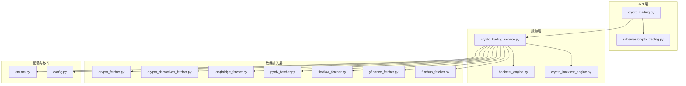
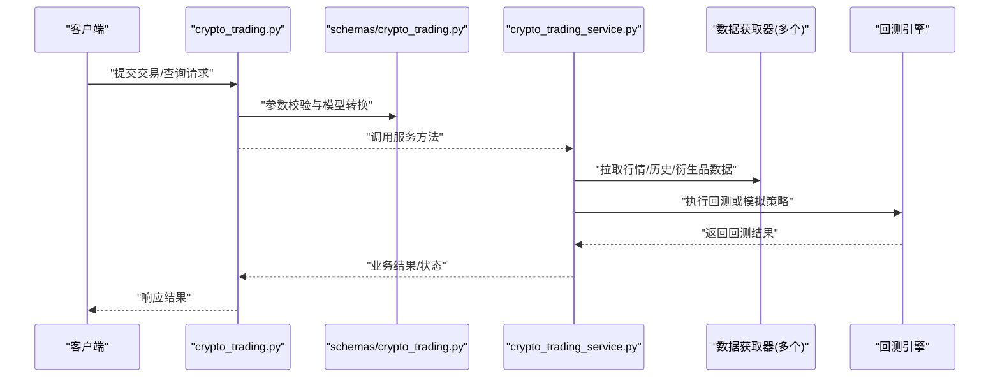
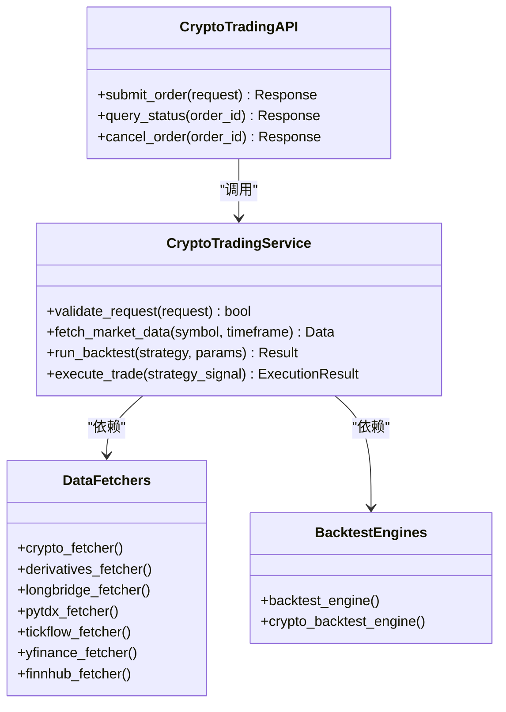
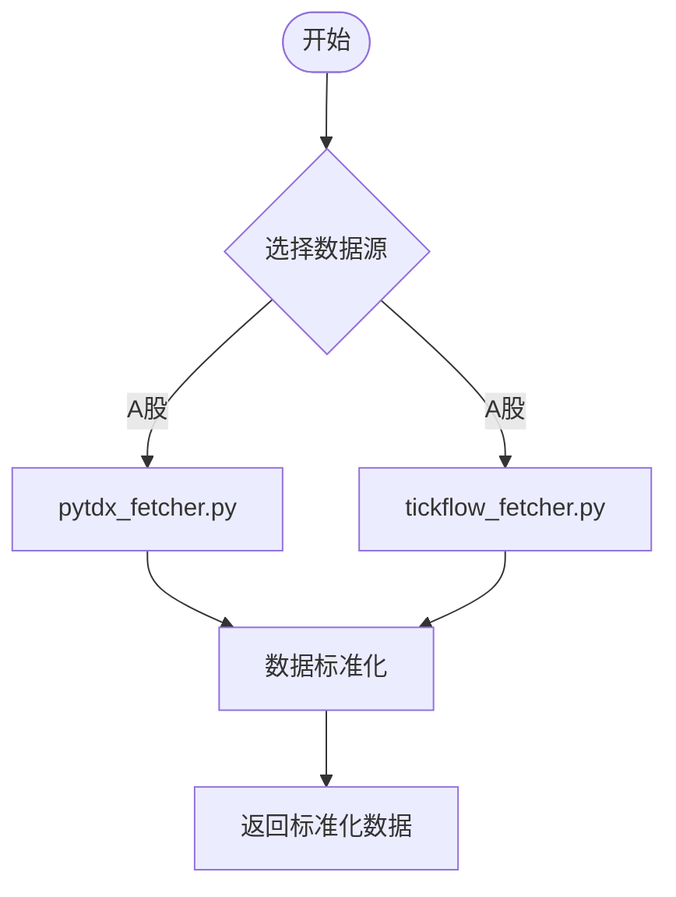
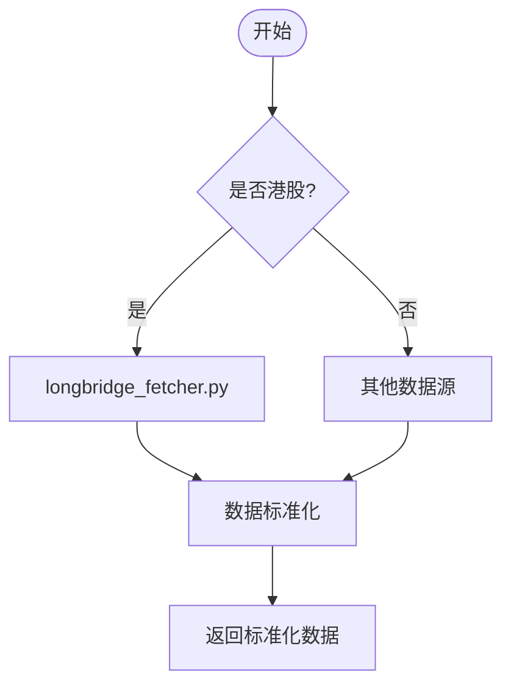
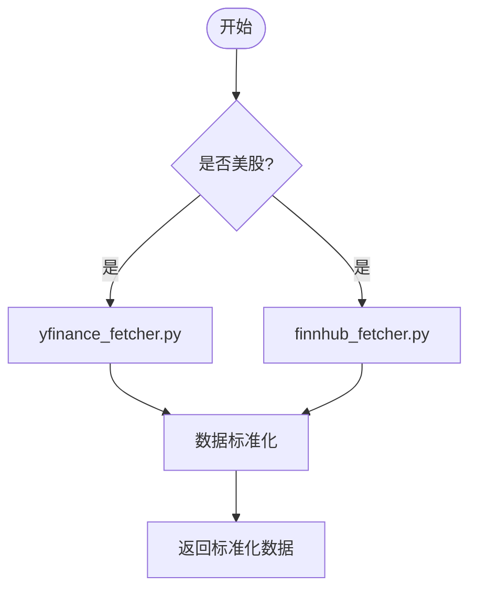
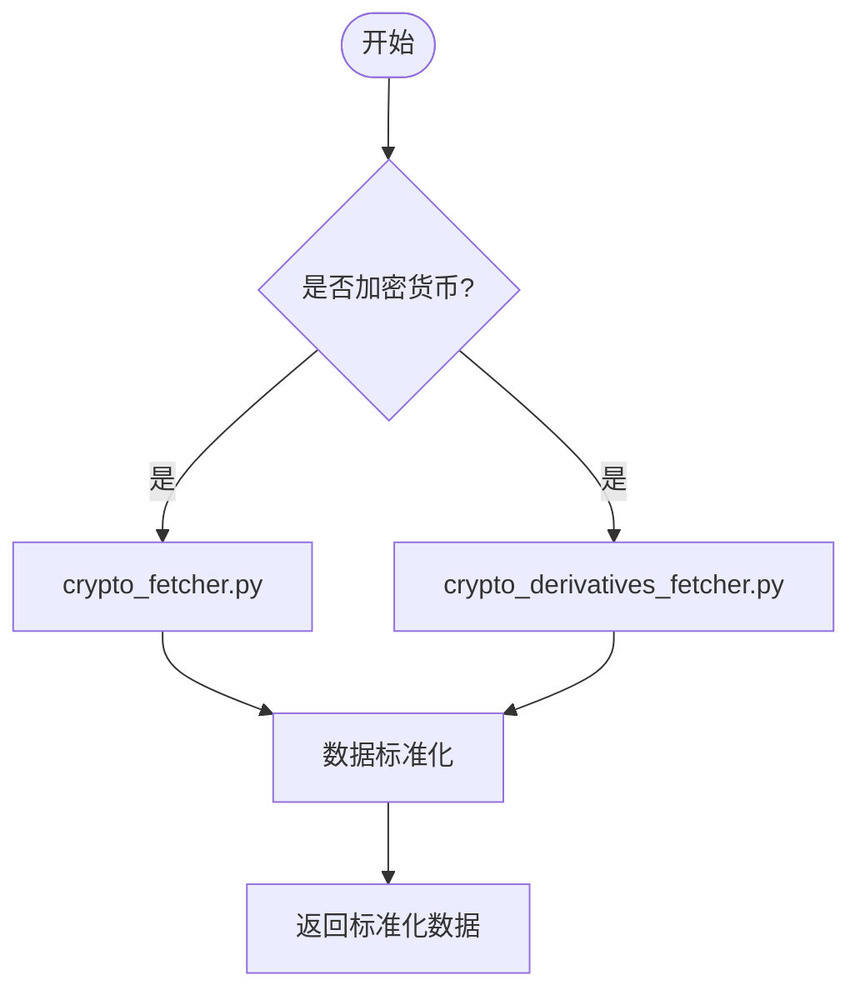
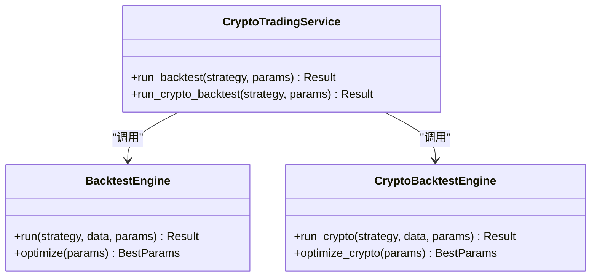
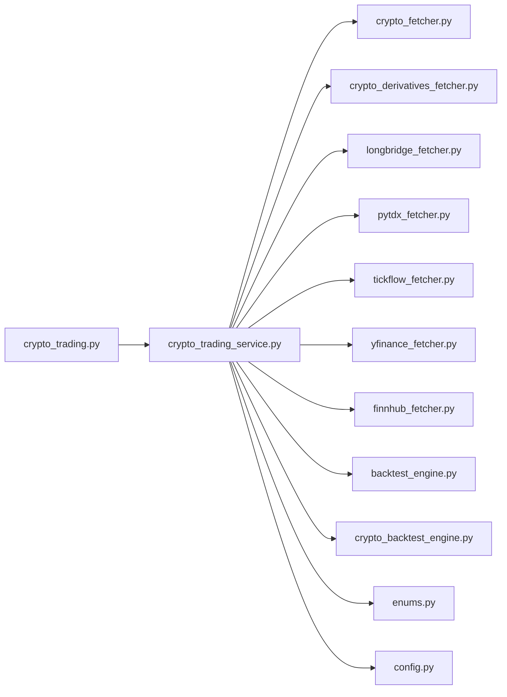

# 订单路由系统

<cite>
**本文档引用的文件**   
- [api/v1/endpoints/crypto_trading.py](file://api/v1/endpoints/crypto_trading.py)
- [api/v1/schemas/crypto_trading.py](file://api/v1/schemas/crypto_trading.py)
- [src/services/crypto_trading_service.py](file://src/services/crypto_trading_service.py)
- [data_provider/crypto_fetcher.py](file://data_provider/crypto_fetcher.py)
- [data_provider/crypto_derivatives_fetcher.py](file://data_provider/crypto_derivatives_fetcher.py)
- [data_provider/longbridge_fetcher.py](file://data_provider/longbridge_fetcher.py)
- [data_provider/pytdx_fetcher.py](file://data_provider/pytdx_fetcher.py)
- [data_provider/tickflow_fetcher.py](file://data_provider/tickflow_fetcher.py)
- [data_provider/yfinance_fetcher.py](file://data_provider/yfinance_fetcher.py)
- [data_provider/finnhub_fetcher.py](file://data_provider/finnhub_fetcher.py)
- [src/core/backtest_engine.py](file://src/core/backtest_engine.py)
- [src/core/crypto_backtest_engine.py](file://src/core/crypto_backtest_engine.py)
- [src/enums.py](file://src/enums.py)
- [src/config.py](file://src/config.py)
- [tests/test_crypto_trading_service.py](file://tests/test_crypto_trading_service.py)
</cite>

## 目录
1. [简介](#简介)
2. [项目结构](#项目结构)
3. [核心组件](#核心组件)
4. [架构总览](#架构总览)
5. [详细组件分析](#详细组件分析)
6. [依赖关系分析](#依赖关系分析)
7. [性能考虑](#性能考虑)
8. [故障排查指南](#故障排查指南)
9. [结论](#结论)
10. [附录：各市场接口与配置示例](#附录各市场接口与配置示例)

## 简介
本文件面向“订单路由系统”的文档化目标，聚焦多市场（A股、港股、美股、加密货币）的数据接入与交易执行路径。由于仓库中未实现统一的订单路由与下单引擎，本文基于现有代码梳理出“数据接入层 + 服务编排层 + API 暴露层”的架构，并重点说明加密货币市场的交易能力与回测能力，以及 A 股、港股、美股的数据接入方式。对于订单类型、验证、风控、执行监控、状态跟踪、成交回报与异常恢复等通用主题，本文给出概念性设计与最佳实践建议，便于在现有基础上扩展实现。

## 项目结构
从仓库结构看，API 层位于 api/v1，服务层位于 src/services，数据获取器位于 data_provider，回测引擎位于 src/core，枚举与配置分别位于 src/enums.py 与 src/config.py。加密货币交易相关能力集中在 crypto_trading_service 与对应 API 端点；A 股、港股、美股主要通过数据获取器完成行情与历史数据接入。

图表来源
- [api/v1/endpoints/crypto_trading.py](file://api/v1/endpoints/crypto_trading.py)
- [api/v1/schemas/crypto_trading.py](file://api/v1/schemas/crypto_trading.py)
- [src/services/crypto_trading_service.py](file://src/services/crypto_trading_service.py)
- [data_provider/crypto_fetcher.py](file://data_provider/crypto_fetcher.py)
- [data_provider/crypto_derivatives_fetcher.py](file://data_provider/crypto_derivatives_fetcher.py)
- [data_provider/longbridge_fetcher.py](file://data_provider/longbridge_fetcher.py)
- [data_provider/pytdx_fetcher.py](file://data_provider/pytdx_fetcher.py)
- [data_provider/tickflow_fetcher.py](file://data_provider/tickflow_fetcher.py)
- [data_provider/yfinance_fetcher.py](file://data_provider/yfinance_fetcher.py)
- [data_provider/finnhub_fetcher.py](file://data_provider/finnhub_fetcher.py)
- [src/core/backtest_engine.py](file://src/core/backtest_engine.py)
- [src/core/crypto_backtest_engine.py](file://src/core/crypto_backtest_engine.py)
- [src/enums.py](file://src/enums.py)
- [src/config.py](file://src/config.py)

章节来源
- [api/v1/endpoints/crypto_trading.py](file://api/v1/endpoints/crypto_trading.py)
- [api/v1/schemas/crypto_trading.py](file://api/v1/schemas/crypto_trading.py)
- [src/services/crypto_trading_service.py](file://src/services/crypto_trading_service.py)
- [data_provider/crypto_fetcher.py](file://data_provider/crypto_fetcher.py)
- [data_provider/crypto_derivatives_fetcher.py](file://data_provider/crypto_derivatives_fetcher.py)
- [data_provider/longbridge_fetcher.py](file://data_provider/longbridge_fetcher.py)
- [data_provider/pytdx_fetcher.py](file://data_provider/pytdx_fetcher.py)
- [data_provider/tickflow_fetcher.py](file://data_provider/tickflow_fetcher.py)
- [data_provider/yfinance_fetcher.py](file://data_provider/yfinance_fetcher.py)
- [data_provider/finnhub_fetcher.py](file://data_provider/finnhub_fetcher.py)
- [src/core/backtest_engine.py](file://src/core/backtest_engine.py)
- [src/core/crypto_backtest_engine.py](file://src/core/crypto_backtest_engine.py)
- [src/enums.py](file://src/enums.py)
- [src/config.py](file://src/config.py)

## 核心组件
- API 层：提供 HTTP 接口，接收客户端请求并进行参数校验，调用服务层处理业务逻辑。
- 服务层：封装跨数据源的策略与执行逻辑，协调数据获取、回测、通知与外部通道。
- 数据接入层：对接不同市场与数据源，统一返回标准化数据结构。
- 回测引擎：支持股票与加密货币的回测流程，为策略评估与参数调优提供基础。
- 配置与枚举：集中管理运行配置与市场/订单类型等枚举定义。

章节来源
- [api/v1/endpoints/crypto_trading.py](file://api/v1/endpoints/crypto_trading.py)
- [api/v1/schemas/crypto_trading.py](file://api/v1/schemas/crypto_trading.py)
- [src/services/crypto_trading_service.py](file://src/services/crypto_trading_service.py)
- [src/core/backtest_engine.py](file://src/core/backtest_engine.py)
- [src/core/crypto_backtest_engine.py](file://src/core/crypto_backtest_engine.py)
- [src/enums.py](file://src/enums.py)
- [src/config.py](file://src/config.py)

## 架构总览
下图展示从 API 到服务再到数据源的调用链，以及回测引擎的参与位置。该图映射了实际源码中的模块关系。

图表来源
- [api/v1/endpoints/crypto_trading.py](file://api/v1/endpoints/crypto_trading.py)
- [api/v1/schemas/crypto_trading.py](file://api/v1/schemas/crypto_trading.py)
- [src/services/crypto_trading_service.py](file://src/services/crypto_trading_service.py)
- [data_provider/crypto_fetcher.py](file://data_provider/crypto_fetcher.py)
- [data_provider/crypto_derivatives_fetcher.py](file://data_provider/crypto_derivatives_fetcher.py)
- [data_provider/longbridge_fetcher.py](file://data_provider/longbridge_fetcher.py)
- [data_provider/pytdx_fetcher.py](file://data_provider/pytdx_fetcher.py)
- [data_provider/tickflow_fetcher.py](file://data_provider/tickflow_fetcher.py)
- [data_provider/yfinance_fetcher.py](file://data_provider/yfinance_fetcher.py)
- [data_provider/finnhub_fetcher.py](file://data_provider/finnhub_fetcher.py)
- [src/core/backtest_engine.py](file://src/core/backtest_engine.py)
- [src/core/crypto_backtest_engine.py](file://src/core/crypto_backtest_engine.py)

## 详细组件分析

### 加密货币交易服务与 API
- API 端点负责接收交易相关请求，使用 Pydantic 模型进行输入校验，随后调用服务层执行具体逻辑。
- 服务层整合数据获取器（现货、衍生品）、回测引擎与可能的通知通道，形成端到端的交易工作流。
- 当前仓库实现了加密货币交易的服务与 API，但未发现统一的订单路由与下单执行模块。

图表来源
- [api/v1/endpoints/crypto_trading.py](file://api/v1/endpoints/crypto_trading.py)
- [api/v1/schemas/crypto_trading.py](file://api/v1/schemas/crypto_trading.py)
- [src/services/crypto_trading_service.py](file://src/services/crypto_trading_service.py)
- [data_provider/crypto_fetcher.py](file://data_provider/crypto_fetcher.py)
- [data_provider/crypto_derivatives_fetcher.py](file://data_provider/crypto_derivatives_fetcher.py)
- [data_provider/longbridge_fetcher.py](file://data_provider/longbridge_fetcher.py)
- [data_provider/pytdx_fetcher.py](file://data_provider/pytdx_fetcher.py)
- [data_provider/tickflow_fetcher.py](file://data_provider/tickflow_fetcher.py)
- [data_provider/yfinance_fetcher.py](file://data_provider/yfinance_fetcher.py)
- [data_provider/finnhub_fetcher.py](file://data_provider/finnhub_fetcher.py)
- [src/core/backtest_engine.py](file://src/core/backtest_engine.py)
- [src/core/crypto_backtest_engine.py](file://src/core/crypto_backtest_engine.py)

章节来源
- [api/v1/endpoints/crypto_trading.py](file://api/v1/endpoints/crypto_trading.py)
- [api/v1/schemas/crypto_trading.py](file://api/v1/schemas/crypto_trading.py)
- [src/services/crypto_trading_service.py](file://src/services/crypto_trading_service.py)
- [tests/test_crypto_trading_service.py](file://tests/test_crypto_trading_service.py)

### A 股数据接入（TDX/TickFlow/其他）
- TDX（通达信）与 TickFlow 等数据源用于 A 股行情与历史数据获取。
- 服务层通过统一的数据获取器接口抽象，屏蔽不同数据源的差异，向上提供一致的数据结构。

图表来源
- [data_provider/pytdx_fetcher.py](file://data_provider/pytdx_fetcher.py)
- [data_provider/tickflow_fetcher.py](file://data_provider/tickflow_fetcher.py)

章节来源
- [data_provider/pytdx_fetcher.py](file://data_provider/pytdx_fetcher.py)
- [data_provider/tickflow_fetcher.py](file://data_provider/tickflow_fetcher.py)

### 港股数据接入（LongBridge/YFinance）
- LongBridge 常用于港股行情与交易通道；YFinance 可作为补充数据源。
- 服务层根据市场标识与配置选择合适的数据获取器。

图表来源
- [data_provider/longbridge_fetcher.py](file://data_provider/longbridge_fetcher.py)
- [data_provider/yfinance_fetcher.py](file://data_provider/yfinance_fetcher.py)

章节来源
- [data_provider/longbridge_fetcher.py](file://data_provider/longbridge_fetcher.py)
- [data_provider/yfinance_fetcher.py](file://data_provider/yfinance_fetcher.py)

### 美股数据接入（YFinance/FinnHub）
- YFinance 与 Finnhub 可用于美股行情与基本面数据。
- 服务层按市场与标的解析后调用相应数据源。

图表来源
- [data_provider/yfinance_fetcher.py](file://data_provider/yfinance_fetcher.py)
- [data_provider/finnhub_fetcher.py](file://data_provider/finnhub_fetcher.py)

章节来源
- [data_provider/yfinance_fetcher.py](file://data_provider/yfinance_fetcher.py)
- [data_provider/finnhub_fetcher.py](file://data_provider/finnhub_fetcher.py)

### 加密货币数据接入（现货与衍生品）
- 现货与衍生品数据由 crypto_fetcher 与 crypto_derivatives_fetcher 提供。
- 服务层可组合多种数据源，支撑策略信号生成与回测。

图表来源
- [data_provider/crypto_fetcher.py](file://data_provider/crypto_fetcher.py)
- [data_provider/crypto_derivatives_fetcher.py](file://data_provider/crypto_derivatives_fetcher.py)

章节来源
- [data_provider/crypto_fetcher.py](file://data_provider/crypto_fetcher.py)
- [data_provider/crypto_derivatives_fetcher.py](file://data_provider/crypto_derivatives_fetcher.py)

### 回测引擎（股票与加密货币）
- backtest_engine 与 crypto_backtest_engine 分别提供股票与加密货币的回测能力。
- 服务层在策略评估、参数优化与模拟执行中使用回测引擎。

图表来源
- [src/core/backtest_engine.py](file://src/core/backtest_engine.py)
- [src/core/crypto_backtest_engine.py](file://src/core/crypto_backtest_engine.py)
- [src/services/crypto_trading_service.py](file://src/services/crypto_trading_service.py)

章节来源
- [src/core/backtest_engine.py](file://src/core/backtest_engine.py)
- [src/core/crypto_backtest_engine.py](file://src/core/crypto_backtest_engine.py)
- [src/services/crypto_trading_service.py](file://src/services/crypto_trading_service.py)

## 依赖关系分析
- API 层依赖服务层与 Pydantic 模型进行参数校验与序列化。
- 服务层依赖数据获取器与回测引擎，同时可能依赖配置与枚举。
- 数据获取器之间相互独立，通过服务层进行编排与标准化。

图表来源
- [api/v1/endpoints/crypto_trading.py](file://api/v1/endpoints/crypto_trading.py)
- [src/services/crypto_trading_service.py](file://src/services/crypto_trading_service.py)
- [data_provider/crypto_fetcher.py](file://data_provider/crypto_fetcher.py)
- [data_provider/crypto_derivatives_fetcher.py](file://data_provider/crypto_derivatives_fetcher.py)
- [data_provider/longbridge_fetcher.py](file://data_provider/longbridge_fetcher.py)
- [data_provider/pytdx_fetcher.py](file://data_provider/pytdx_fetcher.py)
- [data_provider/tickflow_fetcher.py](file://data_provider/tickflow_fetcher.py)
- [data_provider/yfinance_fetcher.py](file://data_provider/yfinance_fetcher.py)
- [data_provider/finnhub_fetcher.py](file://data_provider/finnhub_fetcher.py)
- [src/core/backtest_engine.py](file://src/core/backtest_engine.py)
- [src/core/crypto_backtest_engine.py](file://src/core/crypto_backtest_engine.py)
- [src/enums.py](file://src/enums.py)
- [src/config.py](file://src/config.py)

章节来源
- [api/v1/endpoints/crypto_trading.py](file://api/v1/endpoints/crypto_trading.py)
- [src/services/crypto_trading_service.py](file://src/services/crypto_trading_service.py)
- [data_provider/crypto_fetcher.py](file://data_provider/crypto_fetcher.py)
- [data_provider/crypto_derivatives_fetcher.py](file://data_provider/crypto_derivatives_fetcher.py)
- [data_provider/longbridge_fetcher.py](file://data_provider/longbridge_fetcher.py)
- [data_provider/pytdx_fetcher.py](file://data_provider/pytdx_fetcher.py)
- [data_provider/tickflow_fetcher.py](file://data_provider/tickflow_fetcher.py)
- [data_provider/yfinance_fetcher.py](file://data_provider/yfinance_fetcher.py)
- [data_provider/finnhub_fetcher.py](file://data_provider/finnhub_fetcher.py)
- [src/core/backtest_engine.py](file://src/core/backtest_engine.py)
- [src/core/crypto_backtest_engine.py](file://src/core/crypto_backtest_engine.py)
- [src/enums.py](file://src/enums.py)
- [src/config.py](file://src/config.py)

## 性能考虑
- 数据获取层应实现缓存与限流，避免重复请求与上游限制。
- 服务层对并发任务进行合理调度，避免阻塞与资源竞争。
- 回测引擎需支持增量计算与并行优化，缩短迭代时间。
- API 层对大请求体进行分页与异步处理，提升吞吐与稳定性。

[本节为通用指导，不直接分析具体文件]

## 故障排查指南
- 参数校验失败：检查 API 层的 Pydantic 模型与入参格式。
- 数据源不可用：检查数据获取器的连接配置与网络连通性。
- 回测异常：检查策略参数与数据完整性，查看回测日志。
- 服务层错误：定位服务方法调用链，确认依赖模块状态。

章节来源
- [api/v1/schemas/crypto_trading.py](file://api/v1/schemas/crypto_trading.py)
- [src/services/crypto_trading_service.py](file://src/services/crypto_trading_service.py)
- [src/core/backtest_engine.py](file://src/core/backtest_engine.py)
- [src/core/crypto_backtest_engine.py](file://src/core/crypto_backtest_engine.py)

## 结论
当前仓库已具备多市场数据接入与加密货币交易服务的基础能力，但尚未实现统一的订单路由与下单执行模块。建议在现有架构上扩展订单路由层，统一订单类型、验证、风控、执行监控、状态跟踪与成交回报处理，并通过配置化管理不同市场的接入细节。

[本节为总结性内容，不直接分析具体文件]

## 附录：各市场接口与配置示例
- 加密货币交易接口
  - 提交交易：POST /api/v1/crypto/trade
  - 查询状态：GET /api/v1/crypto/order/{order_id}
  - 取消订单：DELETE /api/v1/crypto/order/{order_id}
  - 说明：请求体与响应体遵循 schemas/crypto_trading.py 的定义；服务层调用 crypto_trading_service.py 进行处理。

- 配置项建议
  - 数据源密钥与 URL：在 config.py 中集中管理，按市场区分。
  - 市场路由规则：在 enums.py 中定义市场与标的编码规范。
  - 回测参数：在 backtest_engine.py 与 crypto_backtest_engine.py 中配置策略与参数范围。

章节来源
- [api/v1/endpoints/crypto_trading.py](file://api/v1/endpoints/crypto_trading.py)
- [api/v1/schemas/crypto_trading.py](file://api/v1/schemas/crypto_trading.py)
- [src/services/crypto_trading_service.py](file://src/services/crypto_trading_service.py)
- [src/config.py](file://src/config.py)
- [src/enums.py](file://src/enums.py)