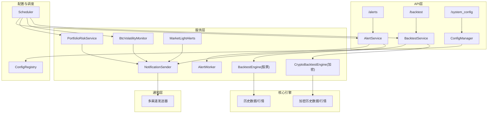
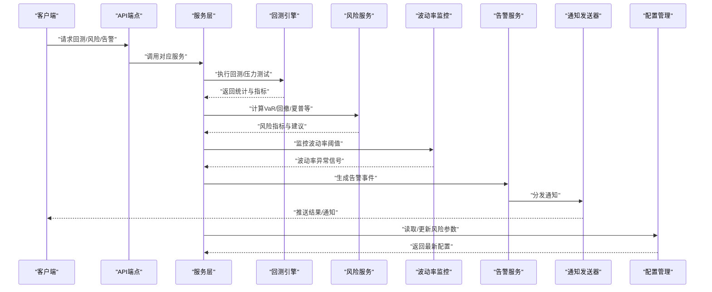
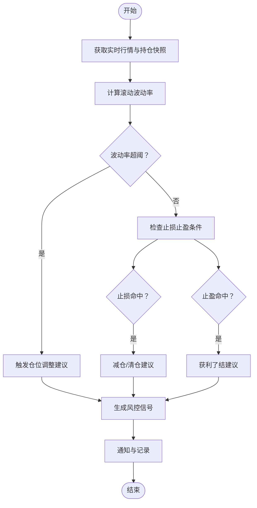
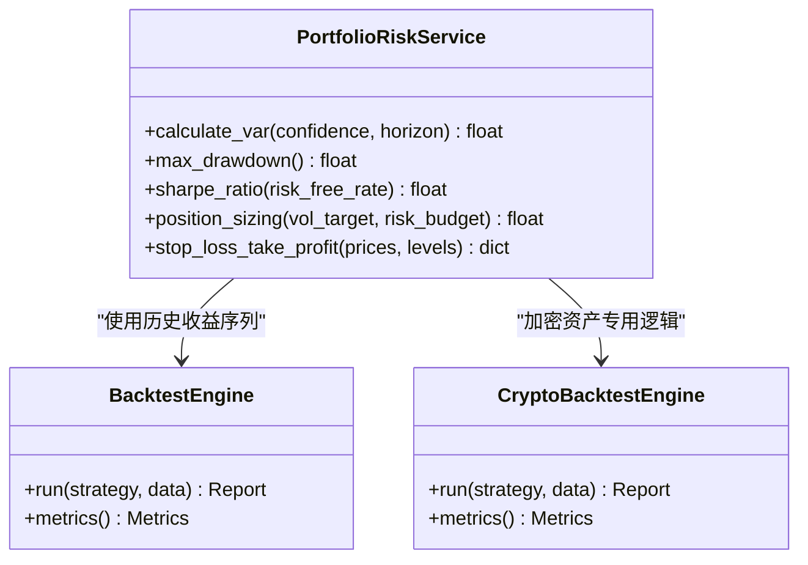
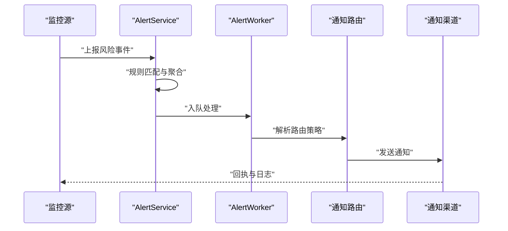
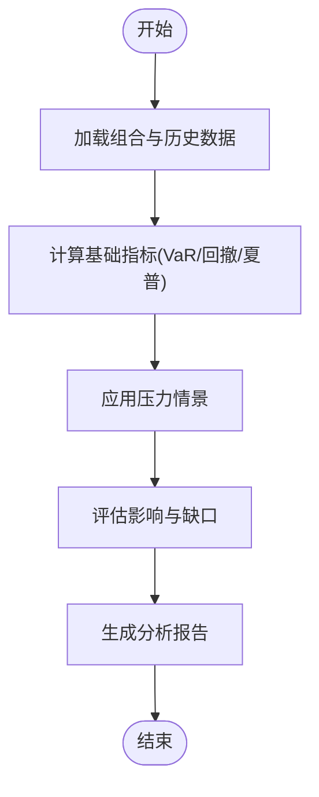
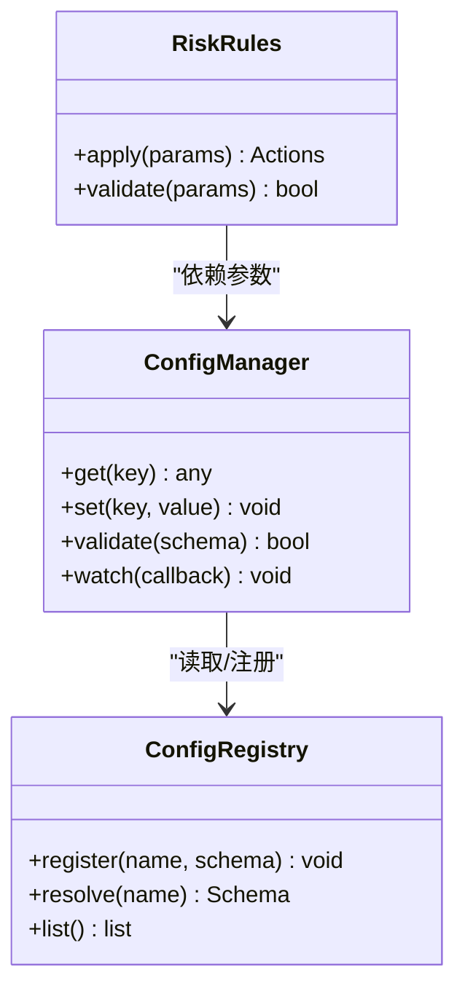
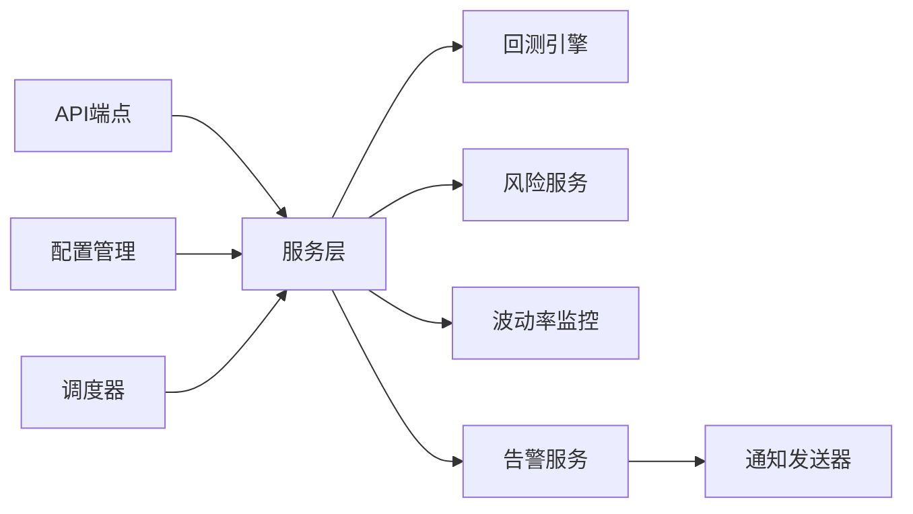

# 风险管理

<cite>
**本文档引用的文件**   
- [portfolio_risk_service.py](file://src/services/portfolio_risk_service.py)
- [btc_volatility_monitor.py](file://src/services/btc_volatility_monitor.py)
- [market_light_alerts.py](file://src/services/market_light_alerts.py)
- [alert_service.py](file://src/services/alert_service.py)
- [alert_worker.py](file://src/services/alert_worker.py)
- [notification.py](file://src/notification.py)
- [notification_sender/__init__.py](file://src/notification_sender/__init__.py)
- [backtest_engine.py](file://src/core/backtest_engine.py)
- [crypto_backtest_engine.py](file://src/core/crypto_backtest_engine.py)
- [backtest_service.py](file://src/services/backtest_service.py)
- [crypto_backtest_service.py](file://src/services/crypto_backtest_service.py)
- [api/v1/endpoints/backtest.py](file://api/v1/endpoints/backtest.py)
- [api/v1/schemas/backtest.py](file://api/v1/schemas/backtest.py)
- [api/v1/endpoints/alerts.py](file://api/v1/endpoints/alerts.py)
- [api/v1/schemas/alerts.py](file://api/v1/schemas/alerts.py)
- [api/v1/endpoints/system_config.py](file://api/v1/endpoints/system_config.py)
- [api/v1/schemas/system_config.py](file://api/v1/schemas/system_config.py)
- [core/config_manager.py](file://src/core/config_manager.py)
- [core/config_registry.py](file://src/core/config_registry.py)
- [scheduler.py](file://src/scheduler.py)
- [main.py](file://main.py)
</cite>

## 目录
1. [简介](#简介)
2. [项目结构](#项目结构)
3. [核心组件](#核心组件)
4. [架构总览](#架构总览)
5. [详细组件分析](#详细组件分析)
6. [依赖关系分析](#依赖关系分析)
7. [性能考量](#性能考量)
8. [故障排查指南](#故障排查指南)
9. [结论](#结论)
10. [附录](#附录)

## 简介
本文件面向风险管理子系统，系统性说明实时风险评估机制（仓位控制、止损止盈、波动率监控）、风险指标计算（VaR、最大回撤、夏普比率）、风险预警触发与通知、投资组合风险分析与压力测试，以及风险参数配置与自定义风险规则的实现方法。文档兼顾技术深度与可读性，帮助开发者与使用者快速理解并扩展系统能力。

## 项目结构
风险管理相关代码主要分布在以下模块：
- 服务层：组合风险、BTC波动率监控、市场光信号预警、通用告警服务与工作者、回测服务（股票/加密）
- 核心引擎：回测引擎（股票/加密）
- API层：回测、告警、系统配置等端点与数据模型
- 通知层：统一通知接口与各渠道发送器
- 配置层：配置管理与注册表
- 调度与入口：定时任务与主进程启动

图表来源
- [api/v1/endpoints/alerts.py](file://api/v1/endpoints/alerts.py)
- [api/v1/endpoints/backtest.py](file://api/v1/endpoints/backtest.py)
- [api/v1/endpoints/system_config.py](file://api/v1/endpoints/system_config.py)
- [src/services/alert_service.py](file://src/services/alert_service.py)
- [src/services/alert_worker.py](file://src/services/alert_worker.py)
- [src/services/backtest_service.py](file://src/services/backtest_service.py)
- [src/services/crypto_backtest_service.py](file://src/services/crypto_backtest_service.py)
- [src/services/portfolio_risk_service.py](file://src/services/portfolio_risk_service.py)
- [src/services/btc_volatility_monitor.py](file://src/services/btc_volatility_monitor.py)
- [src/services/market_light_alerts.py](file://src/services/market_light_alerts.py)
- [src/core/backtest_engine.py](file://src/core/backtest_engine.py)
- [src/core/crypto_backtest_engine.py](file://src/core/crypto_backtest_engine.py)
- [src/notification.py](file://src/notification.py)
- [src/notification_sender/__init__.py](file://src/notification_sender/__init__.py)
- [src/core/config_manager.py](file://src/core/config_manager.py)
- [src/core/config_registry.py](file://src/core/config_registry.py)
- [src/scheduler.py](file://src/scheduler.py)
- [main.py](file://main.py)

章节来源
- [api/v1/endpoints/alerts.py](file://api/v1/endpoints/alerts.py)
- [api/v1/endpoints/backtest.py](file://api/v1/endpoints/backtest.py)
- [api/v1/endpoints/system_config.py](file://api/v1/endpoints/system_config.py)
- [src/services/alert_service.py](file://src/services/alert_service.py)
- [src/services/alert_worker.py](file://src/services/alert_worker.py)
- [src/services/backtest_service.py](file://src/services/backtest_service.py)
- [src/services/crypto_backtest_service.py](file://src/services/crypto_backtest_service.py)
- [src/services/portfolio_risk_service.py](file://src/services/portfolio_risk_service.py)
- [src/services/btc_volatility_monitor.py](file://src/services/btc_volatility_monitor.py)
- [src/services/market_light_alerts.py](file://src/services/market_light_alerts.py)
- [src/core/backtest_engine.py](file://src/core/backtest_engine.py)
- [src/core/crypto_backtest_engine.py](file://src/core/crypto_backtest_engine.py)
- [src/notification.py](file://src/notification.py)
- [src/notification_sender/__init__.py](file://src/notification_sender/__init__.py)
- [src/core/config_manager.py](file://src/core/config_manager.py)
- [src/core/config_registry.py](file://src/core/config_registry.py)
- [src/scheduler.py](file://src/scheduler.py)
- [main.py](file://main.py)

## 核心组件
- 组合风险服务：负责组合层面的风险指标计算（如VaR、最大回撤、夏普比率）、仓位控制策略、止损止盈规则评估与执行建议输出。
- BTC波动率监控：对加密资产波动率进行实时监控与阈值判断，触发预警或联动风控动作。
- 市场光信号预警：基于市场状态与价格行为生成“光信号”级别的风险提示，用于快速响应极端行情。
- 告警服务与工作者：统一管理规则、事件聚合、去重、延迟与重试，驱动通知通道。
- 回测服务与引擎：提供历史回测与压力测试能力，支持股票与加密资产，输出风险指标与交易统计。
- 通知层：统一抽象多种通知渠道，支持模板化消息与路由策略。
- 配置管理：集中管理风险参数、规则开关、阈值与渠道配置，支持热更新与校验。

章节来源
- [src/services/portfolio_risk_service.py](file://src/services/portfolio_risk_service.py)
- [src/services/btc_volatility_monitor.py](file://src/services/btc_volatility_monitor.py)
- [src/services/market_light_alerts.py](file://src/services/market_light_alerts.py)
- [src/services/alert_service.py](file://src/services/alert_service.py)
- [src/services/alert_worker.py](file://src/services/alert_worker.py)
- [src/services/backtest_service.py](file://src/services/backtest_service.py)
- [src/services/crypto_backtest_service.py](file://src/services/crypto_backtest_service.py)
- [src/core/backtest_engine.py](file://src/core/backtest_engine.py)
- [src/core/crypto_backtest_engine.py](file://src/core/crypto_backtest_engine.py)
- [src/notification.py](file://src/notification.py)
- [src/notification_sender/__init__.py](file://src/notification_sender/__init__.py)
- [src/core/config_manager.py](file://src/core/config_manager.py)
- [src/core/config_registry.py](file://src/core/config_registry.py)

## 架构总览
下图展示从API到服务、引擎、通知与配置的端到端流程，覆盖回测、风险计算、波动率监控与告警通知。

图表来源
- [api/v1/endpoints/backtest.py](file://api/v1/endpoints/backtest.py)
- [api/v1/endpoints/alerts.py](file://api/v1/endpoints/alerts.py)
- [src/services/backtest_service.py](file://src/services/backtest_service.py)
- [src/services/crypto_backtest_service.py](file://src/services/crypto_backtest_service.py)
- [src/core/backtest_engine.py](file://src/core/backtest_engine.py)
- [src/core/crypto_backtest_engine.py](file://src/core/crypto_backtest_engine.py)
- [src/services/portfolio_risk_service.py](file://src/services/portfolio_risk_service.py)
- [src/services/btc_volatility_monitor.py](file://src/services/btc_volatility_monitor.py)
- [src/services/alert_service.py](file://src/services/alert_service.py)
- [src/notification.py](file://src/notification.py)
- [src/core/config_manager.py](file://src/core/config_manager.py)

## 详细组件分析

### 实时风险评估机制（仓位控制、止损止盈、波动率监控）
- 仓位控制：根据组合规模、波动率估计与风险预算动态调整头寸大小，避免过度暴露。
- 止损止盈：基于价格路径与波动区间设置触发条件，结合趋势与流动性过滤减少误触发。
- 波动率监控：对标的或指数波动率进行滚动计算，超过阈值即触发降级或减仓建议。

图表来源
- [src/services/portfolio_risk_service.py](file://src/services/portfolio_risk_service.py)
- [src/services/btc_volatility_monitor.py](file://src/services/btc_volatility_monitor.py)
- [src/services/market_light_alerts.py](file://src/services/market_light_alerts.py)

章节来源
- [src/services/portfolio_risk_service.py](file://src/services/portfolio_risk_service.py)
- [src/services/btc_volatility_monitor.py](file://src/services/btc_volatility_monitor.py)
- [src/services/market_light_alerts.py](file://src/services/market_light_alerts.py)

### 风险指标计算（VaR、最大回撤、夏普比率）
- VaR（在险价值）：基于历史分布或蒙特卡洛模拟估算一定置信水平下的潜在损失。
- 最大回撤：衡量峰值到谷底的最大累计亏损幅度，反映极端下行风险。
- 夏普比率：收益与波动率的比值，衡量单位风险下的超额回报。

图表来源
- [src/services/portfolio_risk_service.py](file://src/services/portfolio_risk_service.py)
- [src/core/backtest_engine.py](file://src/core/backtest_engine.py)
- [src/core/crypto_backtest_engine.py](file://src/core/crypto_backtest_engine.py)

章节来源
- [src/services/portfolio_risk_service.py](file://src/services/portfolio_risk_service.py)
- [src/core/backtest_engine.py](file://src/core/backtest_engine.py)
- [src/core/crypto_backtest_engine.py](file://src/core/crypto_backtest_engine.py)

### 风险预警触发条件与通知机制
- 触发条件：波动率突破阈值、止损/止盈命中、组合VaR超限、市场光信号等级提升。
- 事件聚合：按标的、时间窗口与严重等级聚合，避免重复与风暴。
- 通知路由：根据规则选择渠道（邮件、即时通讯、Webhook等），支持模板与优先级。

图表来源
- [src/services/alert_service.py](file://src/services/alert_service.py)
- [src/services/alert_worker.py](file://src/services/alert_worker.py)
- [src/notification.py](file://src/notification.py)
- [src/notification_sender/__init__.py](file://src/notification_sender/__init__.py)

章节来源
- [src/services/alert_service.py](file://src/services/alert_service.py)
- [src/services/alert_worker.py](file://src/services/alert_worker.py)
- [src/notification.py](file://src/notification.py)
- [src/notification_sender/__init__.py](file://src/notification_sender/__init__.py)

### 投资组合风险分析与压力测试
- 组合分析：汇总各标的权重、相关性、波动率与尾部风险，输出整体VaR与回撤。
- 压力测试：注入历史冲击场景（如2008、2020）或自定义情景，评估组合脆弱性与对冲效果。
- 报告输出：包含关键指标、归因分析与改进建议。

图表来源
- [src/services/backtest_service.py](file://src/services/backtest_service.py)
- [src/services/crypto_backtest_service.py](file://src/services/crypto_backtest_service.py)
- [src/core/backtest_engine.py](file://src/core/backtest_engine.py)
- [src/core/crypto_backtest_engine.py](file://src/core/crypto_backtest_engine.py)

章节来源
- [src/services/backtest_service.py](file://src/services/backtest_service.py)
- [src/services/crypto_backtest_service.py](file://src/services/crypto_backtest_service.py)
- [src/core/backtest_engine.py](file://src/core/backtest_engine.py)
- [src/core/crypto_backtest_engine.py](file://src/core/crypto_backtest_engine.py)

### 风险参数配置与自定义风险规则
- 参数项：VaR置信度与持有期、波动率阈值、止损止盈比例、仓位上限、夏普目标等。
- 规则扩展：通过配置注册表定义新规则类型，结合服务层策略进行动态加载与校验。
- 热更新：运行时更新参数，无需重启服务；变更审计与回滚支持。

图表来源
- [src/core/config_manager.py](file://src/core/config_manager.py)
- [src/core/config_registry.py](file://src/core/config_registry.py)

章节来源
- [src/core/config_manager.py](file://src/core/config_manager.py)
- [src/core/config_registry.py](file://src/core/config_registry.py)
- [api/v1/endpoints/system_config.py](file://api/v1/endpoints/system_config.py)
- [api/v1/schemas/system_config.py](file://api/v1/schemas/system_config.py)

## 依赖关系分析
- API层依赖服务层：回测、告警、系统配置端点分别调用对应服务。
- 服务层依赖核心引擎：回测服务调用股票/加密回测引擎；风险服务依赖历史数据与行情。
- 通知层解耦：服务通过统一通知接口选择具体发送器，降低耦合。
- 配置中心：所有服务从配置管理器读取参数，注册表提供规则扩展点。
- 调度器：定时任务驱动风险计算、波动率监控与回测任务。

图表来源
- [api/v1/endpoints/backtest.py](file://api/v1/endpoints/backtest.py)
- [api/v1/endpoints/alerts.py](file://api/v1/endpoints/alerts.py)
- [api/v1/endpoints/system_config.py](file://api/v1/endpoints/system_config.py)
- [src/services/backtest_service.py](file://src/services/backtest_service.py)
- [src/services/crypto_backtest_service.py](file://src/services/crypto_backtest_service.py)
- [src/services/portfolio_risk_service.py](file://src/services/portfolio_risk_service.py)
- [src/services/btc_volatility_monitor.py](file://src/services/btc_volatility_monitor.py)
- [src/services/alert_service.py](file://src/services/alert_service.py)
- [src/notification.py](file://src/notification.py)
- [src/core/config_manager.py](file://src/core/config_manager.py)
- [src/scheduler.py](file://src/scheduler.py)

章节来源
- [api/v1/endpoints/backtest.py](file://api/v1/endpoints/backtest.py)
- [api/v1/endpoints/alerts.py](file://api/v1/endpoints/alerts.py)
- [api/v1/endpoints/system_config.py](file://api/v1/endpoints/system_config.py)
- [src/services/backtest_service.py](file://src/services/backtest_service.py)
- [src/services/crypto_backtest_service.py](file://src/services/crypto_backtest_service.py)
- [src/services/portfolio_risk_service.py](file://src/services/portfolio_risk_service.py)
- [src/services/btc_volatility_monitor.py](file://src/services/btc_volatility_monitor.py)
- [src/services/alert_service.py](file://src/services/alert_service.py)
- [src/notification.py](file://src/notification.py)
- [src/core/config_manager.py](file://src/core/config_manager.py)
- [src/scheduler.py](file://src/scheduler.py)

## 性能考量
- 批量计算：对多标的风险指标采用批处理与缓存，减少重复计算。
- 异步处理：告警工作者与通知发送采用异步队列，避免阻塞主流程。
- 增量更新：波动率与VaR采用滚动窗口与增量算法，降低CPU与内存占用。
- 回测优化：并行扫描历史数据与策略，限制并发度以避免资源争用。
- 配置热更新：参数变更不重启服务，但需保证线程安全与一致性。

[本节为通用指导，不直接分析具体文件]

## 故障排查指南
- 回测失败：检查输入数据完整性、策略参数合法性与引擎版本兼容性。
- 风险指标异常：确认时间窗口、频率与缺失值处理方式；核对VaR置信度与持有期。
- 波动率监控误报：调整阈值与平滑窗口，检查数据源质量与异常值剔除。
- 告警风暴：启用聚合与去重，检查规则优先级与冷却时间。
- 通知失败：验证渠道配置、网络连通性与限流策略；查看回执与错误码。
- 配置不一致：对比注册表与运行时配置，启用校验与审计日志。

章节来源
- [src/services/backtest_service.py](file://src/services/backtest_service.py)
- [src/services/crypto_backtest_service.py](file://src/services/crypto_backtest_service.py)
- [src/services/portfolio_risk_service.py](file://src/services/portfolio_risk_service.py)
- [src/services/btc_volatility_monitor.py](file://src/services/btc_volatility_monitor.py)
- [src/services/alert_service.py](file://src/services/alert_service.py)
- [src/notification.py](file://src/notification.py)
- [src/core/config_manager.py](file://src/core/config_manager.py)

## 结论
本风险管理子系统以模块化设计实现实时风险评估、指标计算、预警通知与压力测试，具备高可扩展性与可观测性。通过配置管理与规则注册，用户可灵活定制风险参数与策略。建议在生产环境强化数据质量治理、监控告警与容量规划，确保系统在极端行情下稳定运行。

[本节为总结性内容，不直接分析具体文件]

## 附录
- API参考：
  - 回测接口：[api/v1/endpoints/backtest.py](file://api/v1/endpoints/backtest.py)、[api/v1/schemas/backtest.py](file://api/v1/schemas/backtest.py)
  - 告警接口：[api/v1/endpoints/alerts.py](file://api/v1/endpoints/alerts.py)、[api/v1/schemas/alerts.py](file://api/v1/schemas/alerts.py)
  - 系统配置接口：[api/v1/endpoints/system_config.py](file://api/v1/endpoints/system_config.py)、[api/v1/schemas/system_config.py](file://api/v1/schemas/system_config.py)
- 核心服务：
  - 组合风险：[src/services/portfolio_risk_service.py](file://src/services/portfolio_risk_service.py)
  - BTC波动率监控：[src/services/btc_volatility_monitor.py](file://src/services/btc_volatility_monitor.py)
  - 市场光信号预警：[src/services/market_light_alerts.py](file://src/services/market_light_alerts.py)
  - 告警服务与工作者：[src/services/alert_service.py](file://src/services/alert_service.py)、[src/services/alert_worker.py](file://src/services/alert_worker.py)
  - 回测服务：[src/services/backtest_service.py](file://src/services/backtest_service.py)、[src/services/crypto_backtest_service.py](file://src/services/crypto_backtest_service.py)
- 核心引擎：
  - 股票回测引擎：[src/core/backtest_engine.py](file://src/core/backtest_engine.py)
  - 加密回测引擎：[src/core/crypto_backtest_engine.py](file://src/core/crypto_backtest_engine.py)
- 通知与配置：
  - 通知接口与发送器：[src/notification.py](file://src/notification.py)、[src/notification_sender/__init__.py](file://src/notification_sender/__init__.py)
  - 配置管理与注册表：[src/core/config_manager.py](file://src/core/config_manager.py)、[src/core/config_registry.py](file://src/core/config_registry.py)
- 调度与入口：
  - 调度器：[src/scheduler.py](file://src/scheduler.py)
  - 主进程：[main.py](file://main.py)