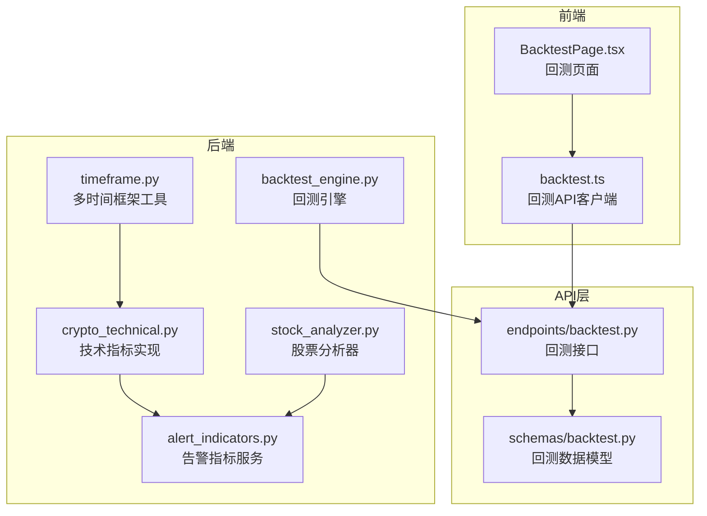
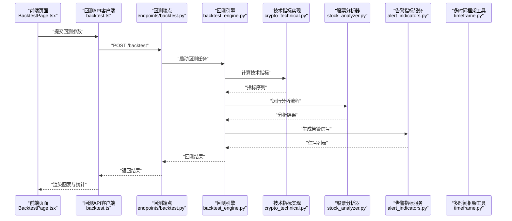
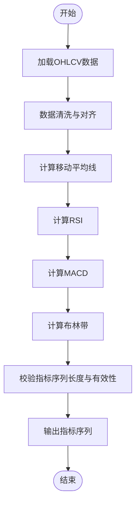
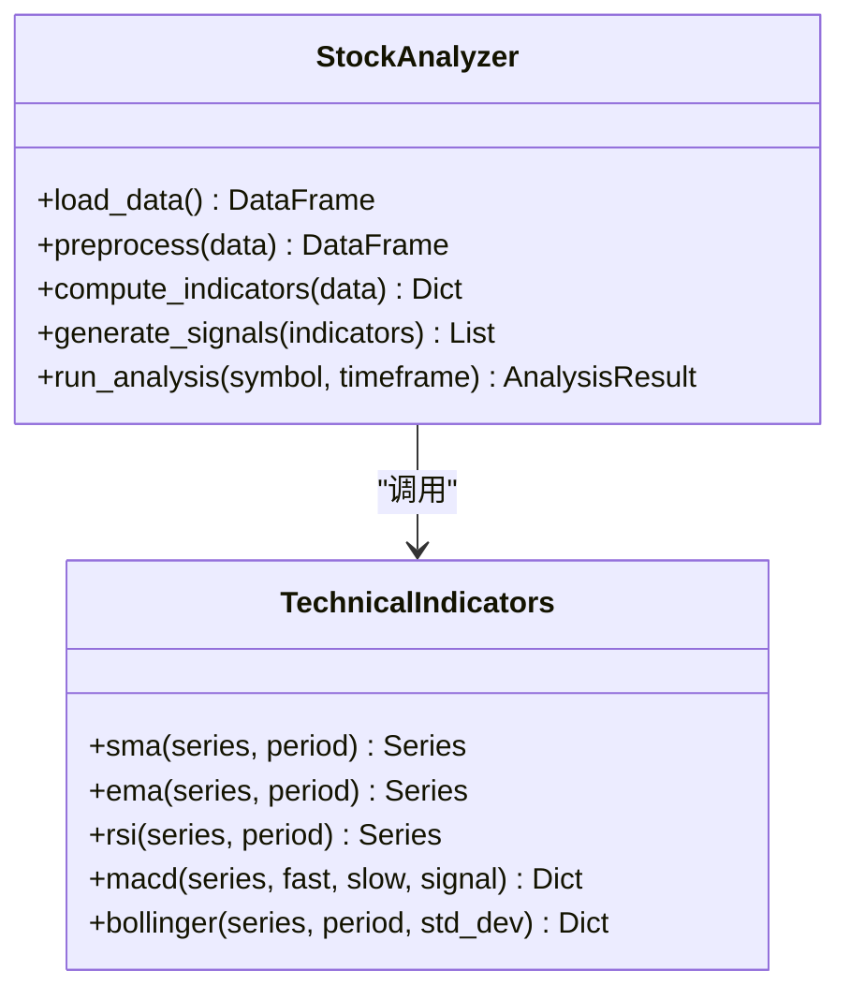
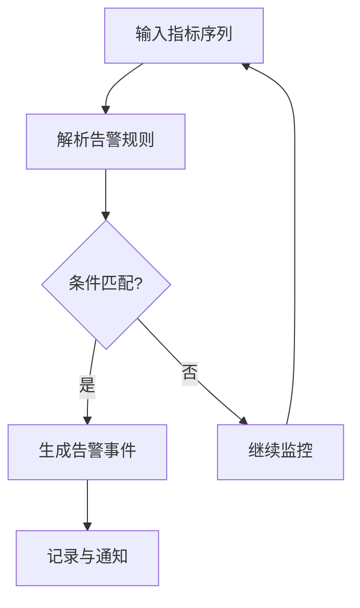
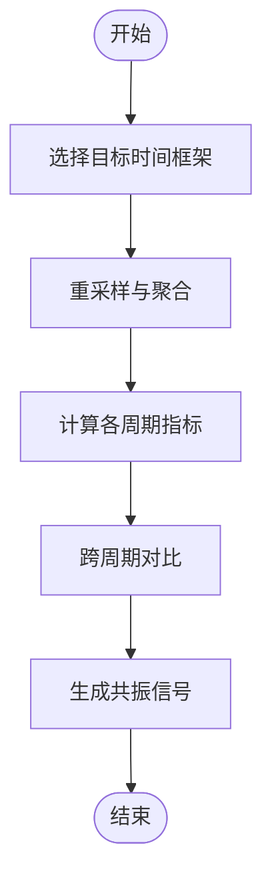
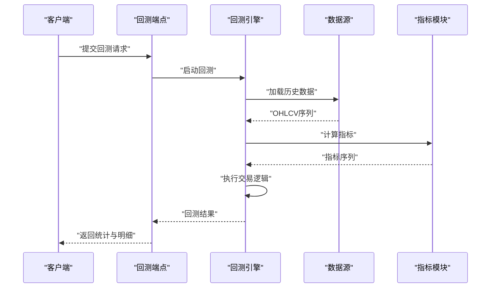
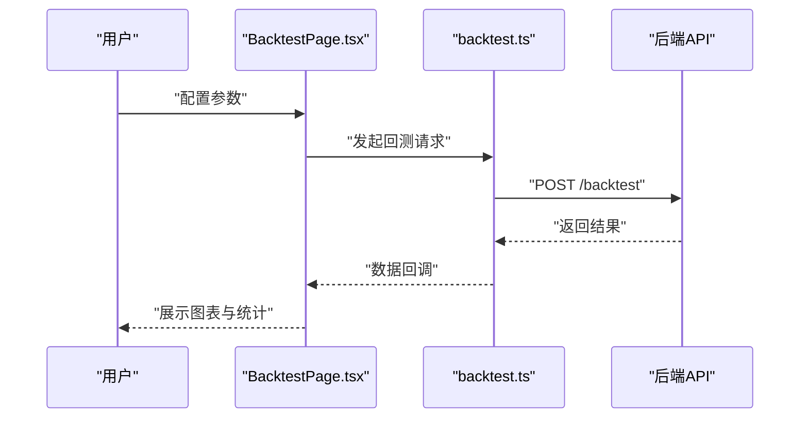
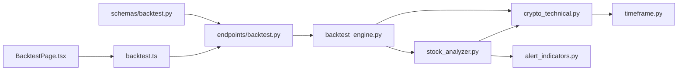

# 技术指标系统

<cite>
**本文引用的文件**   
- [src/crypto_technical.py](file://src/crypto_technical.py)
- [src/stock_analyzer.py](file://src/stock_analyzer.py)
- [src/services/alert_indicators.py](file://src/services/alert_indicators.py)
- [src/utils/timeframe.py](file://src/utils/timeframe.py)
- [src/core/backtest_engine.py](file://src/core/backtest_engine.py)
- [api/v1/endpoints/backtest.py](file://api/v1/endpoints/backtest.py)
- [api/v1/schemas/backtest.py](file://api/v1/schemas/backtest.py)
- [apps/dsa-web/src/api/backtest.ts](file://apps/dsa-web/src/api/backtest.ts)
- [apps/dsa-web/src/pages/BacktestPage.tsx](file://apps/dsa-web/src/pages/BacktestPage.tsx)
- [tests/test_crypto_technical.py](file://tests/test_crypto_technical.py)
- [tests/test_stock_analyzer_rsi.py](file://tests/test_stock_analyzer_rsi.py)
</cite>

## 目录
1. [简介](#简介)
2. [项目结构](#项目结构)
3. [核心组件](#核心组件)
4. [架构总览](#架构总览)
5. [详细组件分析](#详细组件分析)
6. [依赖关系分析](#依赖关系分析)
7. [性能考量](#性能考量)
8. [故障排查指南](#故障排查指南)
9. [结论](#结论)
10. [附录](#附录)

## 简介
本文件面向“技术指标系统”的综合文档，覆盖内置指标（移动平均线、RSI、MACD、布林带等）、自定义指标开发接口与计算方法、多时间框架分析与指标组合策略、性能优化与实时计算方案、可视化展示与回测集成方法。文档以代码级事实为依据，结合架构图、流程图与时序图，帮助读者从入门到深入掌握系统的指标能力与扩展方式。

## 项目结构
与技术指标相关的代码主要分布在以下位置：
- 后端指标实现与服务层：src/crypto_technical.py、src/stock_analyzer.py、src/services/alert_indicators.py、src/utils/timeframe.py
- 回测引擎与API：src/core/backtest_engine.py、api/v1/endpoints/backtest.py、api/v1/schemas/backtest.py
- Web前端回测页面与API调用：apps/dsa-web/src/api/backtest.ts、apps/dsa-web/src/pages/BacktestPage.tsx
- 测试用例：tests/test_crypto_technical.py、tests/test_stock_analyzer_rsi.py

图表来源
- [src/crypto_technical.py](file://src/crypto_technical.py)
- [src/stock_analyzer.py](file://src/stock_analyzer.py)
- [src/services/alert_indicators.py](file://src/services/alert_indicators.py)
- [src/utils/timeframe.py](file://src/utils/timeframe.py)
- [src/core/backtest_engine.py](file://src/core/backtest_engine.py)
- [api/v1/endpoints/backtest.py](file://api/v1/endpoints/backtest.py)
- [api/v1/schemas/backtest.py](file://api/v1/schemas/backtest.py)
- [apps/dsa-web/src/api/backtest.ts](file://apps/dsa-web/src/api/backtest.ts)
- [apps/dsa-web/src/pages/BacktestPage.tsx](file://apps/dsa-web/src/pages/BacktestPage.tsx)

章节来源
- [src/crypto_technical.py](file://src/crypto_technical.py)
- [src/stock_analyzer.py](file://src/stock_analyzer.py)
- [src/services/alert_indicators.py](file://src/services/alert_indicators.py)
- [src/utils/timeframe.py](file://src/utils/timeframe.py)
- [src/core/backtest_engine.py](file://src/core/backtest_engine.py)
- [api/v1/endpoints/backtest.py](file://api/v1/endpoints/backtest.py)
- [api/v1/schemas/backtest.py](file://api/v1/schemas/backtest.py)
- [apps/dsa-web/src/api/backtest.ts](file://apps/dsa-web/src/api/backtest.ts)
- [apps/dsa-web/src/pages/BacktestPage.tsx](file://apps/dsa-web/src/pages/BacktestPage.tsx)

## 核心组件
- 技术指标实现层
  - 加密货币技术指标模块提供常用指标的向量化实现，如移动平均线、RSI、MACD、布林带等，支持批量计算与高效数据处理。
  - 股票分析器封装了更通用的技术分析流程，包括数据预处理、指标计算与信号生成。
- 告警指标服务
  - 将指标结果转化为可触发的告警规则，支持阈值、交叉、形态等条件组合。
- 多时间框架工具
  - 提供时间周期转换与聚合逻辑，支撑跨周期分析与指标组合。
- 回测引擎与API
  - 回测引擎负责历史数据的回放、指标计算与交易逻辑执行；API层暴露回测任务创建与查询接口；Schema定义请求与响应结构。
- 前端回测集成
  - 前端通过API客户端发起回测请求并渲染结果，支持参数配置与可视化展示。

章节来源
- [src/crypto_technical.py](file://src/crypto_technical.py)
- [src/stock_analyzer.py](file://src/stock_analyzer.py)
- [src/services/alert_indicators.py](file://src/services/alert_indicators.py)
- [src/utils/timeframe.py](file://src/utils/timeframe.py)
- [src/core/backtest_engine.py](file://src/core/backtest_engine.py)
- [api/v1/endpoints/backtest.py](file://api/v1/endpoints/backtest.py)
- [api/v1/schemas/backtest.py](file://api/v1/schemas/backtest.py)
- [apps/dsa-web/src/api/backtest.ts](file://apps/dsa-web/src/api/backtest.ts)
- [apps/dsa-web/src/pages/BacktestPage.tsx](file://apps/dsa-web/src/pages/BacktestPage.tsx)

## 架构总览
下图展示了从前端到后端的核心数据流与控制流，涵盖指标计算、回测执行与结果返回。

图表来源
- [apps/dsa-web/src/pages/BacktestPage.tsx](file://apps/dsa-web/src/pages/BacktestPage.tsx)
- [apps/dsa-web/src/api/backtest.ts](file://apps/dsa-web/src/api/backtest.ts)
- [api/v1/endpoints/backtest.py](file://api/v1/endpoints/backtest.py)
- [src/core/backtest_engine.py](file://src/core/backtest_engine.py)
- [src/crypto_technical.py](file://src/crypto_technical.py)
- [src/stock_analyzer.py](file://src/stock_analyzer.py)
- [src/services/alert_indicators.py](file://src/services/alert_indicators.py)
- [src/utils/timeframe.py](file://src/utils/timeframe.py)

## 详细组件分析

### 技术指标实现（移动平均线、RSI、MACD、布林带）
- 功能要点
  - 移动平均线：支持简单移动平均（SMA）、指数移动平均（EMA），用于趋势跟踪与平滑价格序列。
  - RSI（相对强弱指数）：衡量价格变动速度与幅度，识别超买超卖区域。
  - MACD（移动平均收敛发散）：基于快慢均线差值与信号线，捕捉趋势变化与动能。
  - 布林带：基于均值与标准差构建上下轨，识别波动率与突破信号。
- 实现特征
  - 采用向量化计算提升批量数据处理效率。
  - 统一输入输出格式，便于在回测与分析流程中复用。
  - 支持多时间框架聚合，适配不同周期的指标计算需求。

图表来源
- [src/crypto_technical.py](file://src/crypto_technical.py)

章节来源
- [src/crypto_technical.py](file://src/crypto_technical.py)
- [tests/test_crypto_technical.py](file://tests/test_crypto_technical.py)

### 股票分析器（通用分析流程）
- 功能要点
  - 整合数据获取、预处理、指标计算与信号生成。
  - 提供统一的分析上下文，便于后续策略与告警使用。
- 关键流程
  - 数据准备：拉取历史K线，进行缺失值处理与时间对齐。
  - 指标计算：调用技术指标模块生成各指标序列。
  - 信号生成：基于指标交叉、阈值、形态等规则生成买卖信号。
  - 结果封装：输出结构化结果供回测或可视化使用。

图表来源
- [src/stock_analyzer.py](file://src/stock_analyzer.py)
- [src/crypto_technical.py](file://src/crypto_technical.py)

章节来源
- [src/stock_analyzer.py](file://src/stock_analyzer.py)
- [tests/test_stock_analyzer_rsi.py](file://tests/test_stock_analyzer_rsi.py)

### 告警指标服务（指标组合与触发）
- 功能要点
  - 将指标序列转换为可配置的告警规则，支持阈值、交叉、区间等条件。
  - 支持多指标组合与优先级排序，减少误报与噪音。
- 典型用法
  - 设置RSI超买阈值触发卖出信号。
  - 结合MACD金叉与布林带上轨突破确认趋势反转。
  - 多时间框架共振：日线与周线同时满足条件时增强信号强度。

图表来源
- [src/services/alert_indicators.py](file://src/services/alert_indicators.py)

章节来源
- [src/services/alert_indicators.py](file://src/services/alert_indicators.py)

### 多时间框架分析（时间周期转换与聚合）
- 功能要点
  - 提供分钟、小时、日、周等不同周期的数据聚合与重采样。
  - 支持跨周期指标对比与共振分析，提高信号可靠性。
- 应用场景
  - 短周期入场信号由长周期趋势过滤。
  - 多周期指标一致性检查，降低假突破风险。

图表来源
- [src/utils/timeframe.py](file://src/utils/timeframe.py)

章节来源
- [src/utils/timeframe.py](file://src/utils/timeframe.py)

### 回测引擎与API（历史回放与策略验证）
- 功能要点
  - 回测引擎负责按时间顺序回放历史数据，执行指标计算与交易逻辑。
  - API端点接收回测请求，返回统计结果与明细数据。
  - Schema定义请求参数（标的、时间范围、指标参数）与响应结构（收益曲线、胜率、最大回撤等）。
- 关键流程
  - 参数校验与初始化。
  - 数据加载与对齐。
  - 指标计算与信号生成。
  - 交易模拟与绩效统计。
  - 结果序列化与返回。

图表来源
- [src/core/backtest_engine.py](file://src/core/backtest_engine.py)
- [api/v1/endpoints/backtest.py](file://api/v1/endpoints/backtest.py)
- [api/v1/schemas/backtest.py](file://api/v1/schemas/backtest.py)

章节来源
- [src/core/backtest_engine.py](file://src/core/backtest_engine.py)
- [api/v1/endpoints/backtest.py](file://api/v1/endpoints/backtest.py)
- [api/v1/schemas/backtest.py](file://api/v1/schemas/backtest.py)

### 前端回测集成（可视化与交互）
- 功能要点
  - 前端页面提供回测参数配置表单，调用后端API获取结果。
  - 渲染收益曲线、指标叠加图与关键统计指标。
  - 支持导出报告与分享链接。
- 交互流程
  - 用户填写参数并提交。
  - 前端轮询或等待异步任务完成。
  - 渲染图表与表格，支持交互筛选。

图表来源
- [apps/dsa-web/src/pages/BacktestPage.tsx](file://apps/dsa-web/src/pages/BacktestPage.tsx)
- [apps/dsa-web/src/api/backtest.ts](file://apps/dsa-web/src/api/backtest.ts)

章节来源
- [apps/dsa-web/src/pages/BacktestPage.tsx](file://apps/dsa-web/src/pages/BacktestPage.tsx)
- [apps/dsa-web/src/api/backtest.ts](file://apps/dsa-web/src/api/backtest.ts)

## 依赖关系分析
- 模块耦合
  - 回测引擎依赖指标实现与分析器，形成“数据→指标→信号→交易”的流水线。
  - 告警指标服务与分析器解耦，便于独立扩展规则库。
  - 多时间框架工具为指标计算与分析提供基础能力。
- 外部依赖
  - 数据源抽象化，支持多种行情数据接入。
  - 前端依赖HTTP客户端与图表库进行可视化。

图表来源
- [src/core/backtest_engine.py](file://src/core/backtest_engine.py)
- [src/crypto_technical.py](file://src/crypto_technical.py)
- [src/stock_analyzer.py](file://src/stock_analyzer.py)
- [src/services/alert_indicators.py](file://src/services/alert_indicators.py)
- [src/utils/timeframe.py](file://src/utils/timeframe.py)
- [api/v1/endpoints/backtest.py](file://api/v1/endpoints/backtest.py)
- [api/v1/schemas/backtest.py](file://api/v1/schemas/backtest.py)
- [apps/dsa-web/src/api/backtest.ts](file://apps/dsa-web/src/api/backtest.ts)
- [apps/dsa-web/src/pages/BacktestPage.tsx](file://apps/dsa-web/src/pages/BacktestPage.tsx)

章节来源
- [src/core/backtest_engine.py](file://src/core/backtest_engine.py)
- [src/crypto_technical.py](file://src/crypto_technical.py)
- [src/stock_analyzer.py](file://src/stock_analyzer.py)
- [src/services/alert_indicators.py](file://src/services/alert_indicators.py)
- [src/utils/timeframe.py](file://src/utils/timeframe.py)
- [api/v1/endpoints/backtest.py](file://api/v1/endpoints/backtest.py)
- [api/v1/schemas/backtest.py](file://api/v1/schemas/backtest.py)
- [apps/dsa-web/src/api/backtest.ts](file://apps/dsa-web/src/api/backtest.ts)
- [apps/dsa-web/src/pages/BacktestPage.tsx](file://apps/dsa-web/src/pages/BacktestPage.tsx)

## 性能考量
- 向量化计算
  - 优先使用数组级运算替代循环，提升批量数据处理效率。
- 内存管理
  - 对大序列进行分块处理与惰性求值，避免内存峰值过高。
- 缓存与复用
  - 对常用指标参数与中间结果进行缓存，减少重复计算。
- 并发与异步
  - 回测任务支持异步执行，前端轮询或SSE推送结果。
- 实时计算
  - 增量更新机制，仅对新数据窗口重新计算，保持低延迟。

[本节为通用指导，不直接分析具体文件]

## 故障排查指南
- 常见问题
  - 数据缺失或时间不对齐导致指标计算异常。
  - 参数越界（如周期过小）引发NaN或除零错误。
  - 回测任务超时或内存不足。
- 排查步骤
  - 检查输入数据完整性与时间戳连续性。
  - 验证指标参数合理性，增加边界保护。
  - 查看日志定位失败阶段，必要时降级计算精度。
- 测试用例参考
  - 技术指标单元测试确保核心算法正确性。
  - 股票分析器RSI专项测试验证信号生成逻辑。

章节来源
- [tests/test_crypto_technical.py](file://tests/test_crypto_technical.py)
- [tests/test_stock_analyzer_rsi.py](file://tests/test_stock_analyzer_rsi.py)

## 结论
本技术指标系统以模块化设计为基础，提供丰富的内置指标、灵活的自定义扩展接口、多时间框架分析与回测集成能力。通过向量化计算与异步处理，系统在性能与实时性方面具备良好表现。建议在实际使用中结合业务场景选择合适的指标组合与参数，并通过回测验证策略有效性。

[本节为总结性内容，不直接分析具体文件]

## 附录
- 术语表
  - OHLCV：开盘价、最高价、最低价、收盘价、成交量
  - SMA/EMA：简单移动平均/指数移动平均
  - RSI/MACD/布林带：常见技术指标缩写
- 最佳实践
  - 先单指标验证，再逐步组合复杂策略。
  - 使用多时间框架过滤噪音，提高信号稳定性。
  - 定期回测与参数优化，适应市场变化。

[本节为补充信息，不直接分析具体文件]