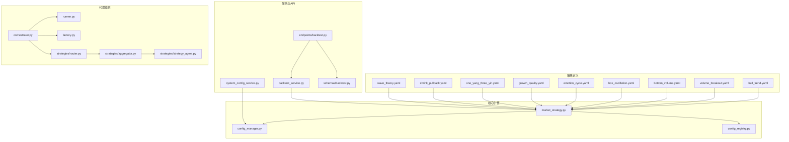
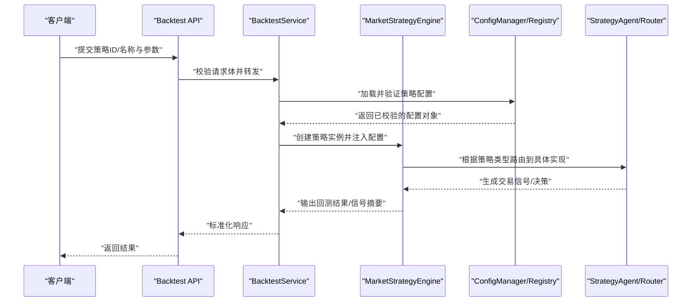
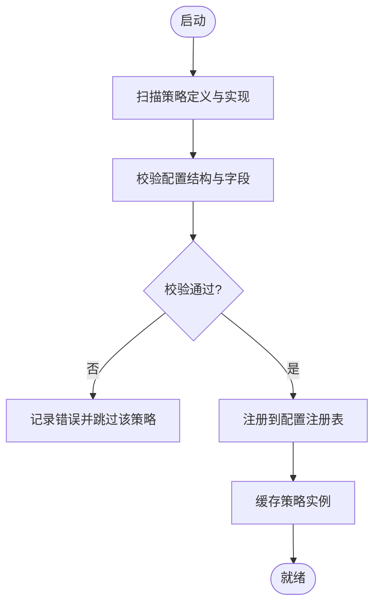

# 策略定义与配置

<cite>
**本文引用的文件**   
- [strategies/README.md](file://strategies/README.md)
- [strategies/bull_trend.yaml](file://strategies/bull_trend.yaml)
- [strategies/volume_breakout.yaml](file://strategies/volume_breakout.yaml)
- [strategies/bottom_volume.yaml](file://strategies/bottom_volume.yaml)
- [strategies/box_oscillation.yaml](file://strategies/box_oscillation.yaml)
- [strategies/emotion_cycle.yaml](file://strategies/emotion_cycle.yaml)
- [strategies/growth_quality.yaml](file://strategies/growth_quality.yaml)
- [strategies/one_yang_three_yin.yaml](file://strategies/one_yang_three_yin.yaml)
- [strategies/shrink_pullback.yaml](file://strategies/shrink_pullback.yaml)
- [strategies/wave_theory.yaml](file://strategies/wave_theory.yaml)
- [src/core/market_strategy.py](file://src/core/market_strategy.py)
- [src/core/config_manager.py](file://src/core/config_manager.py)
- [src/core/config_registry.py](file://src/core/config_registry.py)
- [src/services/backtest_service.py](file://src/services/backtest_service.py)
- [src/services/system_config_service.py](file://src/services/system_config_service.py)
- [api/v1/endpoints/backtest.py](file://api/v1/endpoints/backtest.py)
- [api/v1/schemas/backtest.py](file://api/v1/schemas/backtest.py)
- [src/agent/orchestrator.py](file://src/agent/orchestrator.py)
- [src/agent/runner.py](file://src/agent/runner.py)
- [src/agent/factory.py](file://src/agent/factory.py)
- [src/agent/strategies/router.py](file://src/agent/strategies/router.py)
- [src/agent/strategies/aggregator.py](file://src/agent/strategies/aggregator.py)
- [src/agent/strategies/strategy_agent.py](file://src/agent/strategies/strategy_agent.py)
- [tests/test_market_strategy.py](file://tests/test_market_strategy.py)
- [tests/test_backtest_service.py](file://tests/test_backtest_service.py)
- [tests/test_system_config_service.py](file://tests/test_system_config_service.py)
</cite>

## 目录
1. [简介](#简介)
2. [项目结构](#项目结构)
3. [核心组件](#核心组件)
4. [架构总览](#架构总览)
5. [详细组件分析](#详细组件分析)
6. [依赖关系分析](#依赖关系分析)
7. [性能考量](#性能考量)
8. [故障排查指南](#故障排查指南)
9. [结论](#结论)
10. [附录](#附录)

## 简介
本文件系统化阐述策略定义与配置的完整机制，覆盖YAML格式的策略配置文件结构（技术指标参数、买卖条件、风险控制等）、策略注册与加载流程、配置校验规则、内置策略实现说明、自定义策略开发指南、版本管理、配置热重载与调试方法。文档面向不同技术背景的读者，提供从概念到代码级的渐进式说明与可视化图示。

## 项目结构
策略相关代码主要分布在以下位置：
- 策略定义文件：strategies/*.yaml
- 策略运行时与引擎：src/core/market_strategy.py、src/core/config_manager.py、src/core/config_registry.py
- 服务层与API：src/services/backtest_service.py、src/services/system_config_service.py、api/v1/endpoints/backtest.py、api/v1/schemas/backtest.py
- 代理编排与执行：src/agent/orchestrator.py、src/agent/runner.py、src/agent/factory.py、src/agent/strategies/*
- 测试用例：tests/test_market_strategy.py、tests/test_backtest_service.py、tests/test_system_config_service.py

图表来源
- [src/core/market_strategy.py](file://src/core/market_strategy.py)
- [src/core/config_manager.py](file://src/core/config_manager.py)
- [src/core/config_registry.py](file://src/core/config_registry.py)
- [src/services/backtest_service.py](file://src/services/backtest_service.py)
- [src/services/system_config_service.py](file://src/services/system_config_service.py)
- [api/v1/endpoints/backtest.py](file://api/v1/endpoints/backtest.py)
- [api/v1/schemas/backtest.py](file://api/v1/schemas/backtest.py)
- [src/agent/orchestrator.py](file://src/agent/orchestrator.py)
- [src/agent/runner.py](file://src/agent/runner.py)
- [src/agent/factory.py](file://src/agent/factory.py)
- [src/agent/strategies/router.py](file://src/agent/strategies/router.py)
- [src/agent/strategies/aggregator.py](file://src/agent/strategies/aggregator.py)
- [src/agent/strategies/strategy_agent.py](file://src/agent/strategies/strategy_agent.py)

章节来源
- [strategies/README.md](file://strategies/README.md)
- [src/core/market_strategy.py](file://src/core/market_strategy.py)
- [src/core/config_manager.py](file://src/core/config_manager.py)
- [src/core/config_registry.py](file://src/core/config_registry.py)
- [src/services/backtest_service.py](file://src/services/backtest_service.py)
- [src/services/system_config_service.py](file://src/services/system_config_service.py)
- [api/v1/endpoints/backtest.py](file://api/v1/endpoints/backtest.py)
- [api/v1/schemas/backtest.py](file://api/v1/schemas/backtest.py)
- [src/agent/orchestrator.py](file://src/agent/orchestrator.py)
- [src/agent/runner.py](file://src/agent/runner.py)
- [src/agent/factory.py](file://src/agent/factory.py)
- [src/agent/strategies/router.py](file://src/agent/strategies/router.py)
- [src/agent/strategies/aggregator.py](file://src/agent/strategies/aggregator.py)
- [src/agent/strategies/strategy_agent.py](file://src/agent/strategies/strategy_agent.py)

## 核心组件
- 策略定义（YAML）：以声明式方式描述技术指标、买卖条件、风控参数与元数据，便于版本管理与共享。
- 策略引擎（market_strategy.py）：负责解析YAML、构建策略实例、计算信号、执行回测或实盘逻辑。
- 配置管理（config_manager.py, config_registry.py）：集中管理策略配置、系统配置、校验与热重载。
- 服务层（backtest_service.py, system_config_service.py）：封装业务调用，暴露统一接口给API层。
- API层（endpoints/backtest.py, schemas/backtest.py）：对外提供策略运行、回测、配置管理等REST接口。
- 代理编排（orchestrator.py, runner.py, factory.py, strategies/*）：将策略作为可插拔的Agent进行调度、聚合与路由。

章节来源
- [src/core/market_strategy.py](file://src/core/market_strategy.py)
- [src/core/config_manager.py](file://src/core/config_manager.py)
- [src/core/config_registry.py](file://src/core/config_registry.py)
- [src/services/backtest_service.py](file://src/services/backtest_service.py)
- [src/services/system_config_service.py](file://src/services/system_config_service.py)
- [api/v1/endpoints/backtest.py](file://api/v1/endpoints/backtest.py)
- [api/v1/schemas/backtest.py](file://api/v1/schemas/backtest.py)
- [src/agent/orchestrator.py](file://src/agent/orchestrator.py)
- [src/agent/runner.py](file://src/agent/runner.py)
- [src/agent/factory.py](file://src/agent/factory.py)
- [src/agent/strategies/router.py](file://src/agent/strategies/router.py)
- [src/agent/strategies/aggregator.py](file://src/agent/strategies/aggregator.py)
- [src/agent/strategies/strategy_agent.py](file://src/agent/strategies/strategy_agent.py)

## 架构总览
下图展示了从YAML策略定义到策略执行的端到端流程，包括配置加载、校验、注册、路由、执行与结果返回。

图表来源
- [api/v1/endpoints/backtest.py](file://api/v1/endpoints/backtest.py)
- [api/v1/schemas/backtest.py](file://api/v1/schemas/backtest.py)
- [src/services/backtest_service.py](file://src/services/backtest_service.py)
- [src/core/market_strategy.py](file://src/core/market_strategy.py)
- [src/core/config_manager.py](file://src/core/config_manager.py)
- [src/core/config_registry.py](file://src/core/config_registry.py)
- [src/agent/strategies/router.py](file://src/agent/strategies/router.py)
- [src/agent/strategies/strategy_agent.py](file://src/agent/strategies/strategy_agent.py)

## 详细组件分析

### YAML策略配置文件结构
YAML策略文件用于声明式定义策略行为，典型字段包括：
- 元数据：名称、版本、作者、描述、适用市场/标的范围
- 技术指标：指标名称、周期、阈值、权重、组合逻辑
- 买卖条件：入场触发、出场触发、过滤条件、优先级
- 风险控制：止损止盈、仓位控制、最大回撤、波动率限制
- 执行参数：滑点、手续费、最小下单量、时间窗口
- 扩展字段：标签、分类、兼容性标记、依赖项

建议遵循“单一职责”原则，每个YAML聚焦一种策略思想（如趋势跟踪、均值回归、突破等），并通过版本号管理变更。

章节来源
- [strategies/bull_trend.yaml](file://strategies/bull_trend.yaml)
- [strategies/volume_breakout.yaml](file://strategies/volume_breakout.yaml)
- [strategies/bottom_volume.yaml](file://strategies/bottom_volume.yaml)
- [strategies/box_oscillation.yaml](file://strategies/box_oscillation.yaml)
- [strategies/emotion_cycle.yaml](file://strategies/emotion_cycle.yaml)
- [strategies/growth_quality.yaml](file://strategies/growth_quality.yaml)
- [strategies/one_yang_three_yin.yaml](file://strategies/one_yang_three_yin.yaml)
- [strategies/shrink_pullback.yaml](file://strategies/shrink_pullback.yaml)
- [strategies/wave_theory.yaml](file://strategies/wave_theory.yaml)

### 策略注册机制与加载流程
- 注册机制：通过配置注册表集中登记策略标识与实现映射，支持按名称或ID动态查找。
- 加载流程：启动时扫描策略定义与实现，校验配置完整性，缓存策略实例；运行时按需加载或热更新。
- 校验规则：必填字段检查、类型校验、取值范围校验、依赖项存在性校验、兼容性检查。

图表来源
- [src/core/config_registry.py](file://src/core/config_registry.py)
- [src/core/config_manager.py](file://src/core/config_manager.py)
- [src/core/market_strategy.py](file://src/core/market_strategy.py)

章节来源
- [src/core/config_registry.py](file://src/core/config_registry.py)
- [src/core/config_manager.py](file://src/core/config_manager.py)
- [src/core/market_strategy.py](file://src/core/market_strategy.py)

### 内置策略实现概览
以下为常见内置策略的思想与关键参数要点（不展示具体代码内容）：
- 趋势跟踪（bull_trend.yaml）：基于均线、动量、趋势强度等指标识别方向性行情，设置趋势确认与回调过滤。
- 成交量突破（volume_breakout.yaml）：结合价格突破与放量信号，控制假突破风险，设定突破后持有与退出条件。
- 底部放量（bottom_volume.yaml）：在下跌末端捕捉放量企稳信号，配合支撑位与反转形态过滤。
- 箱体震荡（box_oscillation.yaml）：识别区间震荡，采用高抛低吸策略，设置边界突破与区间收敛处理。
- 情绪周期（emotion_cycle.yaml）：利用情绪指标与资金流向判断周期阶段，调整仓位与持仓结构。
- 成长质量（growth_quality.yaml）：结合基本面与估值因子筛选高质量标的，侧重中长期持有。
- 一阳三阴（one_yang_three_yin.yaml）：K线形态驱动，关注短期反转与动能衰竭。
- 缩量回调（shrink_pullback.yaml）：上涨趋势中的缩量回调买入，结合支撑与量能恢复。
- 波浪理论（wave_theory.yaml）：基于波浪划分与斐波那契回撤定位波段机会。

章节来源
- [strategies/bull_trend.yaml](file://strategies/bull_trend.yaml)
- [strategies/volume_breakout.yaml](file://strategies/volume_breakout.yaml)
- [strategies/bottom_volume.yaml](file://strategies/bottom_volume.yaml)
- [strategies/box_oscillation.yaml](file://strategies/box_oscillation.yaml)
- [strategies/emotion_cycle.yaml](file://strategies/emotion_cycle.yaml)
- [strategies/growth_quality.yaml](file://strategies/growth_quality.yaml)
- [strategies/one_yang_three_yin.yaml](file://strategies/one_yang_three_yin.yaml)
- [strategies/shrink_pullback.yaml](file://strategies/shrink_pullback.yaml)
- [strategies/wave_theory.yaml](file://strategies/wave_theory.yaml)

### 策略版本管理
- 版本字段：在策略元数据中声明版本号，支持语义化版本（主版本.次版本.修订号）。
- 兼容性与迁移：重大变更需升级主版本，保持向后兼容；提供迁移脚本或配置转换规则。
- 历史回溯：保留历史版本以便复现实验与对比回测结果。

章节来源
- [strategies/bull_trend.yaml](file://strategies/bull_trend.yaml)
- [strategies/volume_breakout.yaml](file://strategies/volume_breakout.yaml)

### 配置热重载
- 监听机制：监控策略YAML文件变化，增量更新注册表与缓存。
- 原子替换：新配置校验通过后原子替换旧实例，避免运行时不一致。
- 回滚策略：若新配置导致异常，自动回滚至上一稳定版本。

章节来源
- [src/core/config_manager.py](file://src/core/config_manager.py)
- [src/core/config_registry.py](file://src/core/config_registry.py)

### 调试方法
- 日志级别：开启DEBUG级别输出策略加载、校验、执行过程。
- 断点与追踪：在策略引擎与服务层关键路径插入断点，观察输入输出。
- 单元测试：使用测试用例验证策略逻辑与配置校验。
- 回测沙箱：通过API发起回测任务，查看信号与绩效报告。

章节来源
- [tests/test_market_strategy.py](file://tests/test_market_strategy.py)
- [tests/test_backtest_service.py](file://tests/test_backtest_service.py)
- [tests/test_system_config_service.py](file://tests/test_system_config_service.py)

## 依赖关系分析
策略系统的关键依赖如下：
- YAML策略文件依赖配置解析器与校验器
- 策略引擎依赖配置管理器与注册表
- 服务层依赖引擎与配置服务
- API层依赖服务层与数据模型Schema
- 代理编排依赖策略路由与聚合器

图表来源
- [src/core/config_manager.py](file://src/core/config_manager.py)
- [src/core/config_registry.py](file://src/core/config_registry.py)
- [src/core/market_strategy.py](file://src/core/market_strategy.py)
- [src/agent/strategies/router.py](file://src/agent/strategies/router.py)
- [src/agent/strategies/aggregator.py](file://src/agent/strategies/aggregator.py)
- [src/services/backtest_service.py](file://src/services/backtest_service.py)
- [api/v1/endpoints/backtest.py](file://api/v1/endpoints/backtest.py)

章节来源
- [src/core/config_manager.py](file://src/core/config_manager.py)
- [src/core/config_registry.py](file://src/core/config_registry.py)
- [src/core/market_strategy.py](file://src/core/market_strategy.py)
- [src/agent/strategies/router.py](file://src/agent/strategies/router.py)
- [src/agent/strategies/aggregator.py](file://src/agent/strategies/aggregator.py)
- [src/services/backtest_service.py](file://src/services/backtest_service.py)
- [api/v1/endpoints/backtest.py](file://api/v1/endpoints/backtest.py)

## 性能考量
- 配置缓存：对已校验的策略配置进行内存缓存，减少重复解析与校验开销。
- 异步执行：回测与信号计算采用异步任务队列，提升并发处理能力。
- 增量更新：热重载仅更新变更的策略，避免全量重建。
- 资源隔离：为长耗时任务分配独立进程或线程池，防止阻塞主循环。

[本节为通用指导，无需引用具体文件]

## 故障排查指南
常见问题与排查步骤：
- 配置校验失败：检查必填字段、数据类型与取值范围，查看校验错误日志。
- 策略未注册：确认策略文件命名规范与注册表映射是否正确。
- 热重载无效：检查文件监听权限与原子替换逻辑，确认无并发写入冲突。
- 回测结果异常：核对数据源、时间窗口、滑点与手续费设置，逐步缩小问题范围。

章节来源
- [src/core/config_manager.py](file://src/core/config_manager.py)
- [src/core/config_registry.py](file://src/core/config_registry.py)
- [tests/test_system_config_service.py](file://tests/test_system_config_service.py)

## 结论
本系统通过声明式YAML策略定义与模块化引擎设计，实现了灵活、可扩展的策略体系。借助配置注册表、校验与热重载机制，保障了策略的生命周期管理与稳定性。内置策略覆盖了趋势跟踪、均值回归、突破等多种经典思路，同时提供清晰的自定义开发指南与调试方法，便于快速迭代与生产部署。

[本节为总结性内容，无需引用具体文件]

## 附录

### 自定义策略开发指南
- 新建YAML：在strategies目录下新增策略文件，填写元数据、技术指标、买卖条件与风控参数。
- 实现策略逻辑：在策略引擎或代理层添加对应实现类，确保与YAML字段映射一致。
- 注册与校验：在配置注册表中登记策略标识，完善校验规则与依赖检查。
- 测试与验证：编写单元测试与集成测试，覆盖正常路径与异常分支。
- 发布与版本：提交策略文件与实现，标注版本号与变更说明，纳入版本管理。

章节来源
- [src/core/market_strategy.py](file://src/core/market_strategy.py)
- [src/core/config_registry.py](file://src/core/config_registry.py)
- [src/agent/strategies/strategy_agent.py](file://src/agent/strategies/strategy_agent.py)

### 最佳实践
- 单一职责：每个YAML专注一种策略思想，避免过度耦合。
- 参数外置：将敏感或易变参数放入外部配置，便于环境隔离与动态调整。
- 可观测性：增加关键指标与事件日志，便于监控与排障。
- 可回滚：热重载与版本管理保证快速回退到稳定状态。
- 文档化：为每个策略提供使用说明与示例，降低上手成本。

[本节为通用指导，无需引用具体文件]