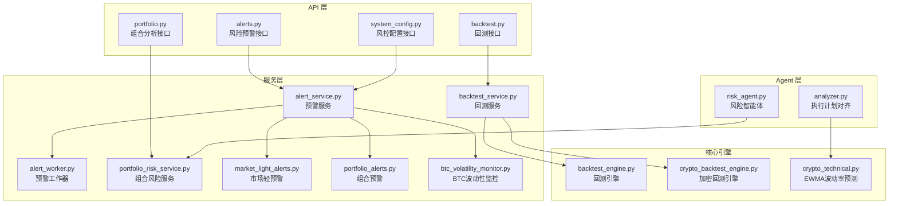
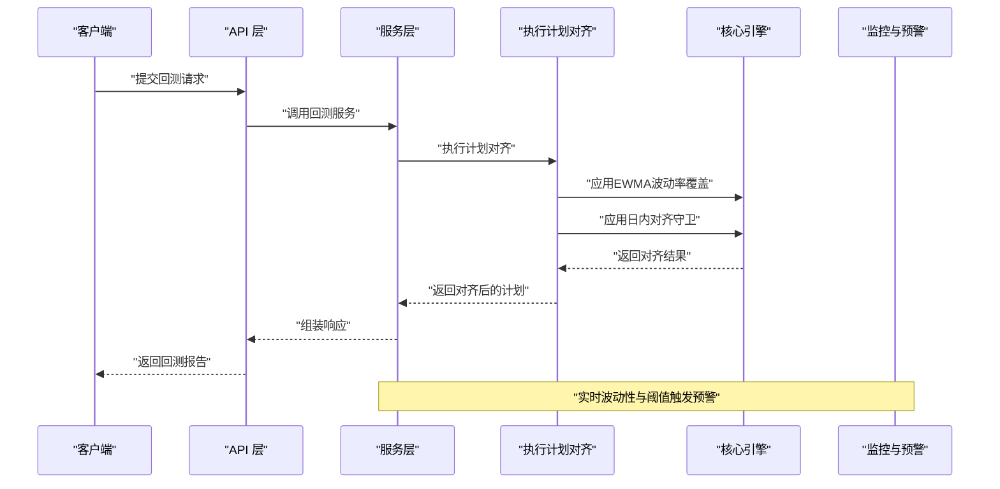
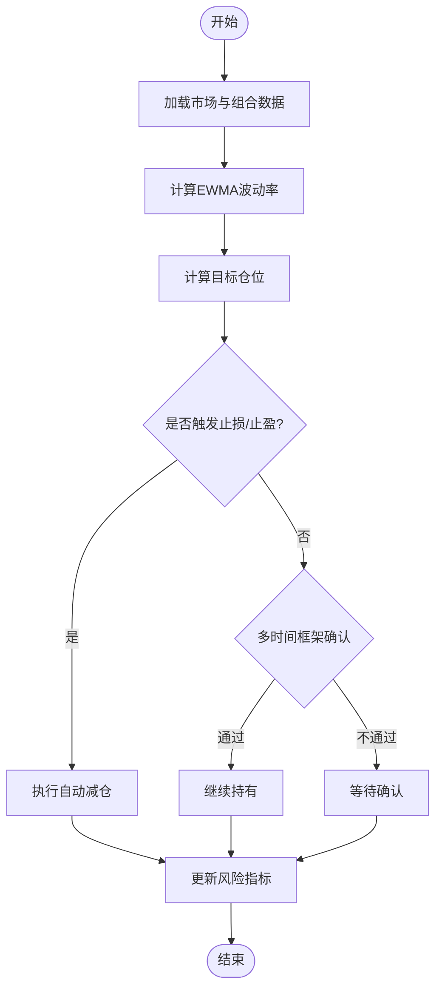
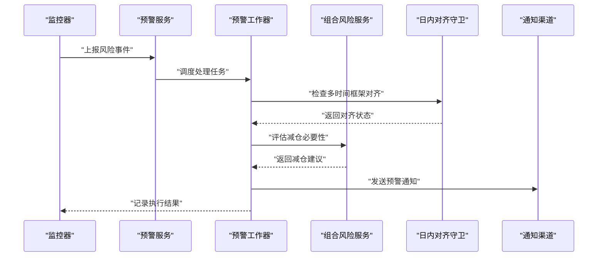
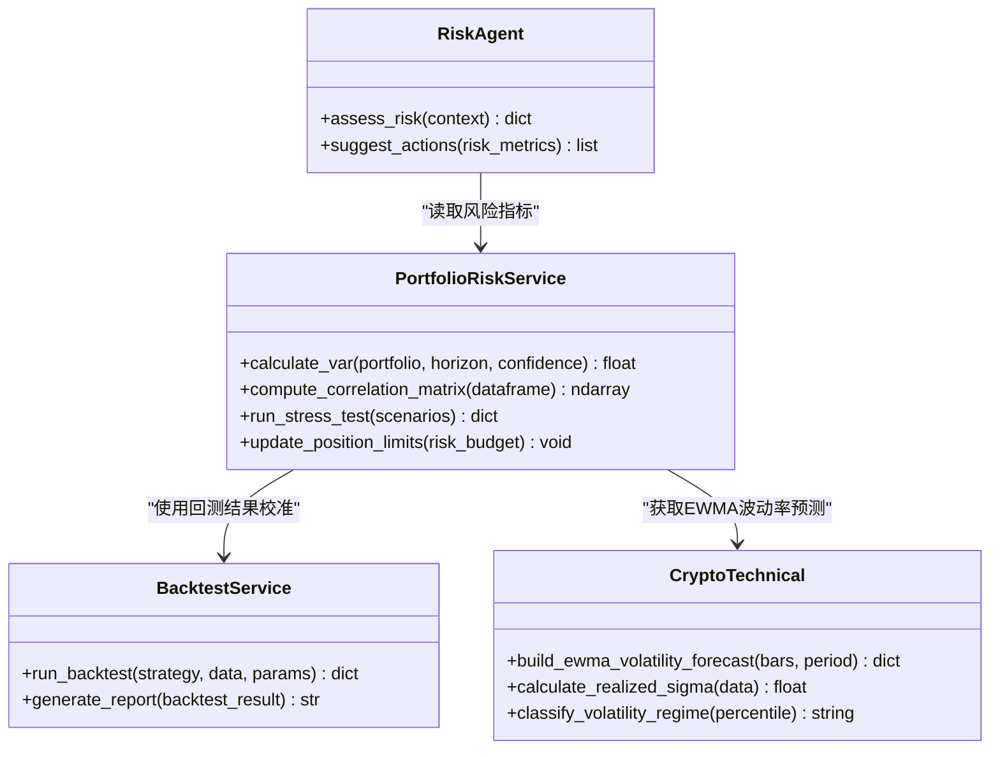
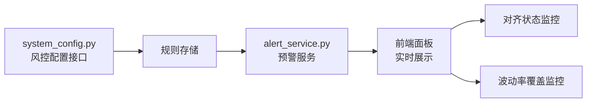
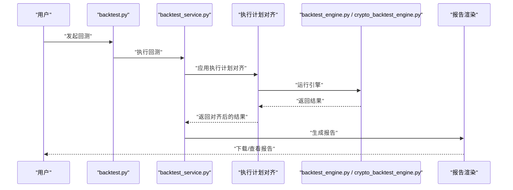
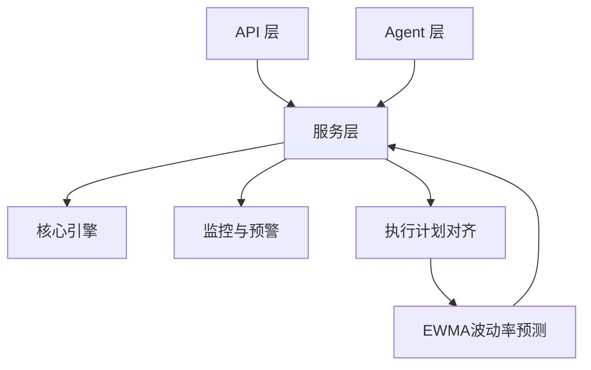

# 风险管理

<cite>
**本文档引用的文件**   
- [risk_agent.py](file://src/agent/agents/risk_agent.py)
- [portfolio_risk_service.py](file://src/services/portfolio_risk_service.py)
- [alert_service.py](file://src/services/alert_service.py)
- [alert_worker.py](file://src/services/alert_worker.py)
- [backtest_service.py](file://src/services/backtest_service.py)
- [btc_volatility_monitor.py](file://src/services/btc_volatility_monitor.py)
- [market_light_alerts.py](file://src/services/market_light_alerts.py)
- [portfolio_alerts.py](file://src/services/portfolio_alerts.py)
- [backtest_engine.py](file://src/core/backtest_engine.py)
- [crypto_backtest_engine.py](file://src/core/crypto_backtest_engine.py)
- [analyzer.py](file://src/analyzer.py)
- [crypto_technical.py](file://src/crypto_technical.py)
- [alerts.py](file://api/v1/endpoints/alerts.py)
- [backtest.py](file://api/v1/endpoints/backtest.py)
- [portfolio.py](file://api/v1/endpoints/portfolio.py)
- [system_config.py](file://api/v1/endpoints/system_config.py)
- [alerts.py](file://api/v1/schemas/alerts.py)
- [backtest.py](file://api/v1/schemas/backtest.py)
- [portfolio.py](file://api/v1/schemas/portfolio.py)
- [system_config.py](file://api/v1/schemas/system_config.py)
</cite>

## 更新摘要
**变更内容**   
- 新增基于EWMA的波动率风险覆盖系统，实现自动化的仓位乘数上限控制
- 新增日内对齐守卫机制，支持多时间框架确认和方向性保护
- 增强BTC执行计划对齐功能，集成多种风控机制
- 更新风险评估模型以包含新的波动率预测和风险控制逻辑

## 目录
1. [简介](#简介)
2. [项目结构](#项目结构)
3. [核心组件](#核心组件)
4. [架构总览](#架构总览)
5. [详细组件分析](#详细组件分析)
6. [依赖关系分析](#依赖关系分析)
7. [性能考量](#性能考量)
8. [故障排查指南](#故障排查指南)
9. [结论](#结论)
10. [附录](#附录)

## 简介
本文件面向风险管理子系统，覆盖风险评估模型（仓位控制、止损止盈、波动性管理）、风险预警与自动减仓、投资组合风险分析工具（VaR、相关性分析、压力测试）、风控规则配置与实时监控面板，以及风险报告生成与历史回测能力。文档以代码为依据，提供架构图、数据流图与关键流程时序图，帮助读者快速理解并落地使用。

**更新** 新增了基于EWMA的波动率风险覆盖系统和日内对齐守卫机制，实现了自动化的仓位乘数上限和多时间框架确认。

## 项目结构
风险管理相关能力分布在以下层次：
- API 层：暴露风险预警、回测、组合分析与系统配置的接口
- 服务层：封装风险计算、预警触发、回测执行、监控等核心逻辑
- Agent 层：风险智能体负责策略编排与决策辅助
- 核心引擎：回测引擎与加密资产波动性监控
- 前端：Web UI 中的告警、回测、组合页面与实时面板

图表来源
- [alerts.py](file://api/v1/endpoints/alerts.py)
- [backtest.py](file://api/v1/endpoints/backtest.py)
- [portfolio.py](file://api/v1/endpoints/portfolio.py)
- [system_config.py](file://api/v1/endpoints/system_config.py)
- [alert_service.py](file://src/services/alert_service.py)
- [alert_worker.py](file://src/services/alert_worker.py)
- [portfolio_risk_service.py](file://src/services/portfolio_risk_service.py)
- [market_light_alerts.py](file://src/services/market_light_alerts.py)
- [portfolio_alerts.py](file://src/services/portfolio_alerts.py)
- [btc_volatility_monitor.py](file://src/services/btc_volatility_monitor.py)
- [backtest_service.py](file://src/services/backtest_service.py)
- [backtest_engine.py](file://src/core/backtest_engine.py)
- [crypto_backtest_engine.py](file://src/core/crypto_backtest_engine.py)
- [risk_agent.py](file://src/agent/agents/risk_agent.py)
- [analyzer.py](file://src/analyzer.py)
- [crypto_technical.py](file://src/crypto_technical.py)

章节来源
- [alerts.py](file://api/v1/endpoints/alerts.py)
- [backtest.py](file://api/v1/endpoints/backtest.py)
- [portfolio.py](file://api/v1/endpoints/portfolio.py)
- [system_config.py](file://api/v1/endpoints/system_config.py)
- [alert_service.py](file://src/services/alert_service.py)
- [alert_worker.py](file://src/services/alert_worker.py)
- [portfolio_risk_service.py](file://src/services/portfolio_risk_service.py)
- [market_light_alerts.py](file://src/services/market_light_alerts.py)
- [portfolio_alerts.py](file://src/services/portfolio_alerts.py)
- [btc_volatility_monitor.py](file://src/services/btc_volatility_monitor.py)
- [backtest_service.py](file://src/services/backtest_service.py)
- [backtest_engine.py](file://src/core/backtest_engine.py)
- [crypto_backtest_engine.py](file://src/core/crypto_backtest_engine.py)
- [risk_agent.py](file://src/agent/agents/risk_agent.py)
- [analyzer.py](file://src/analyzer.py)
- [crypto_technical.py](file://src/crypto_technical.py)

## 核心组件
- 风险智能体（Risk Agent）：整合市场与组合信息，输出风险控制建议与动作信号，驱动后续预警与减仓逻辑
- 组合风险服务：计算 VaR、相关性、压力测试指标，结合仓位与止损止盈参数进行动态评估
- 预警服务与工作器：基于阈值与事件触发预警，支持多通道通知与自动减仓策略
- 回测服务与引擎：提供历史回测能力，验证风控策略有效性
- 波动性监控：针对高波动标的（如 BTC）进行实时监控与预警联动
- **新增** EWMA波动率预测：基于指数加权移动平均的波动率预测模型，提供自动化的仓位乘数上限
- **新增** 日内对齐守卫：多时间框架确认机制，防止逆趋势交易

章节来源
- [risk_agent.py](file://src/agent/agents/risk_agent.py)
- [portfolio_risk_service.py](file://src/services/portfolio_risk_service.py)
- [alert_service.py](file://src/services/alert_service.py)
- [alert_worker.py](file://src/services/alert_worker.py)
- [backtest_service.py](file://src/services/backtest_service.py)
- [btc_volatility_monitor.py](file://src/services/btc_volatility_monitor.py)
- [analyzer.py](file://src/analyzer.py)
- [crypto_technical.py](file://src/crypto_technical.py)

## 架构总览
风险管理子系统采用"接口-服务-引擎"分层架构：
- API 层统一对外暴露风险预警、回测、组合分析与配置接口
- 服务层实现业务逻辑，协调各子模块完成风险计算、预警触发与回测执行
- 引擎层提供高性能回测与监控能力，支撑策略验证与实时风控

图表来源
- [backtest.py](file://api/v1/endpoints/backtest.py)
- [backtest_service.py](file://src/services/backtest_service.py)
- [backtest_engine.py](file://src/core/backtest_engine.py)
- [crypto_backtest_engine.py](file://src/core/crypto_backtest_engine.py)
- [alert_service.py](file://src/services/alert_service.py)
- [btc_volatility_monitor.py](file://src/services/btc_volatility_monitor.py)
- [analyzer.py](file://src/analyzer.py)

## 详细组件分析

### 风险评估模型（仓位控制、止损止盈、波动性管理）
- 仓位控制：根据账户净值、波动率与风险预算动态调整头寸规模，避免过度集中
- 止损止盈：按标的或组合维度设置触发条件，支持百分比、ATR、移动均线等多类型
- 波动性管理：基于历史与实时波动率估计，动态调整风险敞口与预警阈值

**更新** 新增基于EWMA的波动率风险覆盖系统：
- 使用指数加权移动平均（EWMA）算法预测下一根K线的波动率
- 根据波动率分位数自动调整仓位乘数上限（正常100%、升高50%、极端25%）
- 支持多时间框架的波动率预测和风险控制

图表来源
- [portfolio_risk_service.py](file://src/services/portfolio_risk_service.py)
- [alert_service.py](file://src/services/alert_service.py)
- [market_light_alerts.py](file://src/services/market_light_alerts.py)
- [portfolio_alerts.py](file://src/services/portfolio_alerts.py)
- [crypto_technical.py](file://src/crypto_technical.py)

章节来源
- [portfolio_risk_service.py](file://src/services/portfolio_risk_service.py)
- [alert_service.py](file://src/services/alert_service.py)
- [market_light_alerts.py](file://src/services/market_light_alerts.py)
- [portfolio_alerts.py](file://src/services/portfolio_alerts.py)
- [crypto_technical.py](file://src/crypto_technical.py)

### 风险预警机制与自动减仓逻辑
- 预警机制：基于阈值（价格、波动率、回撤）与事件（突破、背离）触发
- 自动减仓：在风险超限时按比例或固定数量减仓，降低组合风险
- 通知渠道：支持多种消息通道推送预警与执行结果

**更新** 新增日内对齐守卫机制：
- 检查日线与小时线的时间框架一致性
- 当多时间框架均指向同一方向时，阻止反向的日内交易计划
- 提供详细的拒绝原因和等待确认的指导

图表来源
- [alert_service.py](file://src/services/alert_service.py)
- [alert_worker.py](file://src/services/alert_worker.py)
- [portfolio_risk_service.py](file://src/services/portfolio_risk_service.py)
- [market_light_alerts.py](file://src/services/market_light_alerts.py)
- [portfolio_alerts.py](file://src/services/portfolio_alerts.py)
- [analyzer.py](file://src/analyzer.py)

章节来源
- [alert_service.py](file://src/services/alert_service.py)
- [alert_worker.py](file://src/services/alert_worker.py)
- [portfolio_risk_service.py](file://src/services/portfolio_risk_service.py)
- [market_light_alerts.py](file://src/services/market_light_alerts.py)
- [portfolio_alerts.py](file://src/services/portfolio_alerts.py)
- [analyzer.py](file://src/analyzer.py)

### 投资组合风险分析工具（VaR、相关性分析、压力测试）
- VaR 计算：基于历史模拟或参数法估算潜在损失
- 相关性分析：衡量资产间联动性，识别集中度风险
- 压力测试：模拟极端市场情景，评估组合韧性

**更新** 新增EWMA波动率预测集成：
- 基于指数加权移动平均的波动率预测模型
- 提供波动率分位数和状态分类（正常、升高、极端、压缩）
- 自动计算仓位乘数上限和风险行动建议

图表来源
- [portfolio_risk_service.py](file://src/services/portfolio_risk_service.py)
- [backtest_service.py](file://src/services/backtest_service.py)
- [risk_agent.py](file://src/agent/agents/risk_agent.py)
- [crypto_technical.py](file://src/crypto_technical.py)

章节来源
- [portfolio_risk_service.py](file://src/services/portfolio_risk_service.py)
- [backtest_service.py](file://src/services/backtest_service.py)
- [risk_agent.py](file://src/agent/agents/risk_agent.py)
- [crypto_technical.py](file://src/crypto_technical.py)

### 风控规则配置与实时监控面板
- 风控规则：通过系统配置接口维护阈值、策略开关与参数
- 实时监控：前端面板展示风险指标、预警状态与执行日志

**更新** 新增执行计划对齐配置：
- 支持多时间框架对齐状态的配置
- 可配置EWMA波动率预测的参数和阈值
- 提供详细的对齐守卫和波动率覆盖的执行状态

图表来源
- [system_config.py](file://api/v1/endpoints/system_config.py)
- [system_config.py](file://api/v1/schemas/system_config.py)
- [alert_service.py](file://src/services/alert_service.py)
- [analyzer.py](file://src/analyzer.py)

章节来源
- [system_config.py](file://api/v1/endpoints/system_config.py)
- [system_config.py](file://api/v1/schemas/system_config.py)
- [alert_service.py](file://src/services/alert_service.py)
- [analyzer.py](file://src/analyzer.py)

### 风险报告生成与历史回测
- 报告生成：汇总风险指标、预警记录与减仓执行结果
- 历史回测：验证策略在不同市场环境下的表现

**更新** 新增执行计划对齐报告：
- 包含EWMA波动率预测的详细分析
- 显示多时间框架对齐状态和守卫触发情况
- 提供仓位乘数上限的调整历史和原因

图表来源
- [backtest.py](file://api/v1/endpoints/backtest.py)
- [backtest_service.py](file://src/services/backtest_service.py)
- [backtest_engine.py](file://src/core/backtest_engine.py)
- [crypto_backtest_engine.py](file://src/core/crypto_backtest_engine.py)
- [analyzer.py](file://src/analyzer.py)

章节来源
- [backtest.py](file://api/v1/endpoints/backtest.py)
- [backtest_service.py](file://src/services/backtest_service.py)
- [backtest_engine.py](file://src/core/backtest_engine.py)
- [crypto_backtest_engine.py](file://src/core/crypto_backtest_engine.py)
- [analyzer.py](file://src/analyzer.py)

## 依赖关系分析
风险管理子系统内部依赖清晰，服务层作为中枢协调各模块：
- API 层依赖服务层接口
- 服务层依赖引擎与监控模块
- Agent 层与服务层交互，提供智能决策支持

**更新** 新增执行计划对齐依赖：
- analyzer.py 依赖 crypto_technical.py 进行EWMA波动率预测
- 多个服务模块依赖 align_btc_execution_plans 函数进行风控对齐
- 测试套件提供了完整的对齐逻辑验证

图表来源
- [alerts.py](file://api/v1/endpoints/alerts.py)
- [backtest.py](file://api/v1/endpoints/backtest.py)
- [portfolio.py](file://api/v1/endpoints/portfolio.py)
- [system_config.py](file://api/v1/endpoints/system_config.py)
- [alert_service.py](file://src/services/alert_service.py)
- [backtest_service.py](file://src/services/backtest_service.py)
- [portfolio_risk_service.py](file://src/services/portfolio_risk_service.py)
- [btc_volatility_monitor.py](file://src/services/btc_volatility_monitor.py)
- [risk_agent.py](file://src/agent/agents/risk_agent.py)
- [analyzer.py](file://src/analyzer.py)
- [crypto_technical.py](file://src/crypto_technical.py)

章节来源
- [alerts.py](file://api/v1/endpoints/alerts.py)
- [backtest.py](file://api/v1/endpoints/backtest.py)
- [portfolio.py](file://api/v1/endpoints/portfolio.py)
- [system_config.py](file://api/v1/endpoints/system_config.py)
- [alert_service.py](file://src/services/alert_service.py)
- [backtest_service.py](file://src/services/backtest_service.py)
- [portfolio_risk_service.py](file://src/services/portfolio_risk_service.py)
- [btc_volatility_monitor.py](file://src/services/btc_volatility_monitor.py)
- [risk_agent.py](file://src/agent/agents/risk_agent.py)
- [analyzer.py](file://src/analyzer.py)
- [crypto_technical.py](file://src/crypto_technical.py)

## 性能考量
- 回测引擎优化：并行计算与缓存机制提升大规模历史数据处理效率
- 预警服务异步化：工作器队列避免阻塞主线程，提高响应速度
- 波动性监控采样：合理选择时间窗口与频率，平衡精度与资源消耗
- 内存管理：大数据集分块处理，防止内存溢出
- **新增** EWMA计算优化：使用向量化操作和增量计算减少CPU开销
- **新增** 多时间框架检查：仅在必要时执行对齐守卫，避免不必要的计算

[本节为通用指导，不直接分析具体文件]

## 故障排查指南
- 预警未触发：检查阈值配置与数据源可用性
- 减仓失败：确认权限与交易接口状态
- 回测结果异常：核对参数与数据质量
- 监控延迟：评估系统负载与网络状况
- **新增** 对齐守卫误判：检查多时间框架数据质量和对齐状态
- **新增** EWMA预测异常：验证数据样本数量和波动率计算参数

章节来源
- [alert_service.py](file://src/services/alert_service.py)
- [alert_worker.py](file://src/services/alert_worker.py)
- [backtest_service.py](file://src/services/backtest_service.py)
- [btc_volatility_monitor.py](file://src/services/btc_volatility_monitor.py)
- [analyzer.py](file://src/analyzer.py)
- [crypto_technical.py](file://src/crypto_technical.py)

## 结论
风险管理子系统通过模块化设计与清晰的分层架构，实现了从风险评估、预警到自动减仓的完整闭环。结合回测与报告功能，为策略验证与持续优化提供了有力支撑。**新增的EWMA波动率风险覆盖系统和日内对齐守卫机制进一步增强了系统的智能化水平和风险控制能力**。建议在生产环境中加强监控与日志记录，确保系统稳定可靠。

[本节为总结性内容，不直接分析具体文件]

## 附录
- 术语表：VaR（风险价值）、ATR（平均真实波幅）、回撤（Drawdown）、EWMA（指数加权移动平均）
- 最佳实践：定期校准风险参数，结合多因子模型提升预测准确性
- 扩展方向：引入机器学习模型增强波动性预测与异常检测
- **新增** EWMA参数说明：lambda=0.94，最小样本数20，波动率状态分类阈值
- **新增** 对齐守卫规则：日线与小时线一致时阻止反向日内交易

[本节为补充信息，不直接分析具体文件]