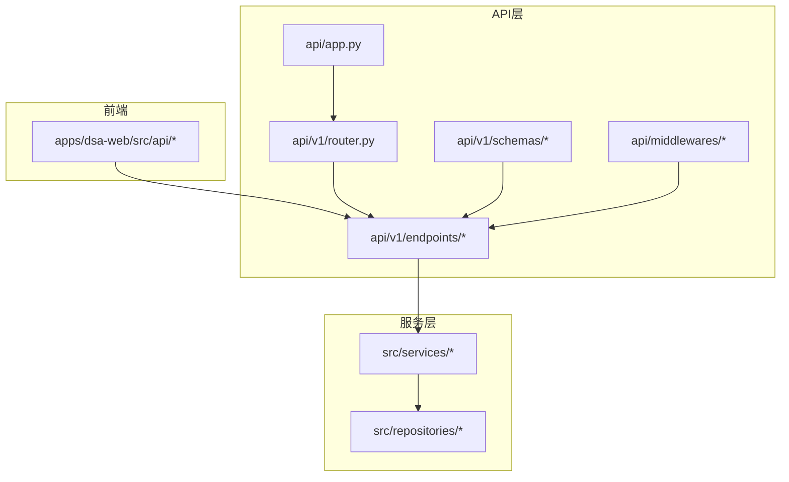
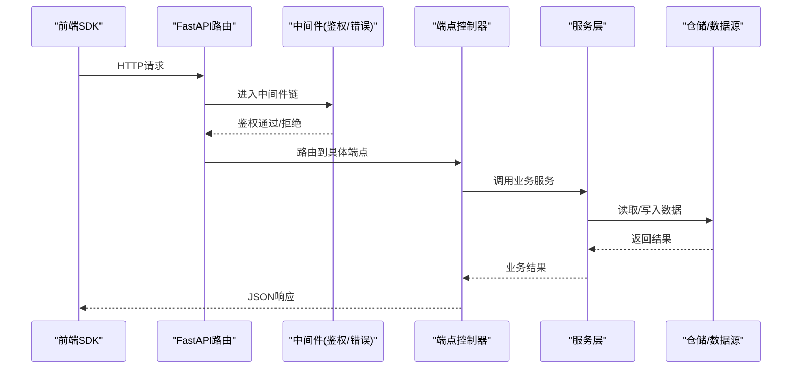
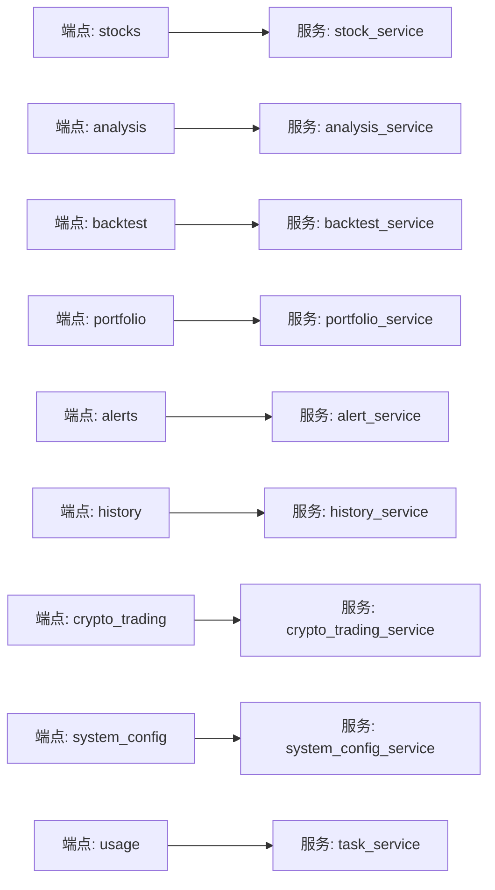

# API调用示例

<cite>
**本文引用的文件**
- [api/app.py](file://api/app.py)
- [api/v1/router.py](file://api/v1/router.py)
- [api/v1/endpoints/stocks.py](file://api/v1/endpoints/stocks.py)
- [api/v1/endpoints/analysis.py](file://api/v1/endpoints/analysis.py)
- [api/v1/endpoints/backtest.py](file://api/v1/endpoints/backtest.py)
- [api/v1/endpoints/portfolio.py](file://api/v1/endpoints/portfolio.py)
- [api/v1/endpoints/alerts.py](file://api/v1/endpoints/alerts.py)
- [api/v1/endpoints/history.py](file://api/v1/endpoints/history.py)
- [api/v1/endpoints/crypto_trading.py](file://api/v1/endpoints/crypto_trading.py)
- [api/v1/endpoints/system_config.py](file://api/v1/endpoints/system_config.py)
- [api/v1/endpoints/usage.py](file://api/v1/endpoints/usage.py)
- [api/v1/endpoints/agent.py](file://api/v1/endpoints/agent.py)
- [api/v1/endpoints/decision_signals.py](file://api/v1/endpoints/decision_signals.py)
- [api/v1/schemas/common.py](file://api/v1/schemas/common.py)
- [api/v1/schemas/stocks.py](file://api/v1/schemas/stocks.py)
- [api/v1/schemas/analysis.py](file://api/v1/schemas/analysis.py)
- [api/v1/schemas/backtest.py](file://api/v1/schemas/backtest.py)
- [api/v1/schemas/portfolio.py](file://api/v1/schemas/portfolio.py)
- [api/v1/schemas/alerts.py](file://api/v1/schemas/alerts.py)
- [api/v1/schemas/history.py](file://api/v1/schemas/history.py)
- [api/v1/schemas/crypto_trading.py](file://api/v1/schemas/crypto_trading.py)
- [api/v1/schemas/system_config.py](file://api/v1/schemas/system_config.py)
- [api/v1/schemas/usage.py](file://api/v1/schemas/usage.py)
- [api/v1/errors.py](file://api/v1/errors.py)
- [api/middlewares/auth.py](file://api/middlewares/auth.py)
- [api/middlewares/error_handler.py](file://api/middlewares/error_handler.py)
- [src/services/stock_service.py](file://src/services/stock_service.py)
- [src/services/analysis_service.py](file://src/services/analysis_service.py)
- [src/services/backtest_service.py](file://src/services/backtest_service.py)
- [src/services/portfolio_service.py](file://src/services/portfolio_service.py)
- [src/services/alert_service.py](file://src/services/alert_service.py)
- [src/services/history_service.py](file://src/services/history_service.py)
- [src/services/crypto_trading_service.py](file://src/services/crypto_trading_service.py)
- [src/services/system_config_service.py](file://src/services/system_config_service.py)
- [src/services/task_service.py](file://src/services/task_service.py)
- [apps/dsa-web/src/api/index.ts](file://apps/dsa-web/src/api/index.ts)
- [apps/dsa-web/src/api/stocks.ts](file://apps/dsa-web/src/api/stocks.ts)
- [apps/dsa-web/src/api/analysis.ts](file://apps/dsa-web/src/api/analysis.ts)
- [apps/dsa-web/src/api/backtest.ts](file://apps/dsa-web/src/api/backtest.ts)
- [apps/dsa-web/src/api/portfolio.ts](file://apps/dsa-web/src/api/portfolio.ts)
- [apps/dsa-web/src/api/alerts.ts](file://apps/dsa-web/src/api/alerts.ts)
- [apps/dsa-web/src/api/history.ts](file://apps/dsa-web/src/api/history.ts)
- [apps/dsa-web/src/api/cryptoTrading.ts](file://apps/dsa-web/src/api/cryptoTrading.ts)
- [apps/dsa-web/src/api/systemConfig.ts](file://apps/dsa-web/src/api/systemConfig.ts)
- [apps/dsa-web/src/api/usage.ts](file://apps/dsa-web/src/api/usage.ts)
- [apps/dsa-web/src/api/agent.ts](file://apps/dsa-web/src/api/agent.ts)
- [apps/dsa-web/src/api/decisionSignals.ts](file://apps/dsa-web/src/api/decisionSignals.ts)
</cite>

## 目录
1. [简介](#简介)
2. [项目结构](#项目结构)
3. [核心组件](#核心组件)
4. [架构总览](#架构总览)
5. [详细组件分析](#详细组件分析)
6. [依赖关系分析](#依赖关系分析)
7. [性能考虑](#性能考虑)
8. [故障排查指南](#故障排查指南)
9. [结论](#结论)
10. [附录](#附录)

## 简介
本文件面向开发者与使用者，提供股票分析系统的RESTful API调用示例与最佳实践。覆盖以下核心能力：
- 股票数据与行情查询
- 分析与决策信号
- 回测引擎（含加密货币）
- 投资组合管理
- 通知与告警设置
- 系统配置与用量统计
- 批量操作、异步任务与实时数据获取

文档包含：
- 请求/响应格式说明
- 认证方式与错误处理
- Python SDK、JavaScript客户端与curl命令示例
- 高级用法：批量、异步、实时流

## 项目结构
后端采用FastAPI模块化路由组织，按功能划分v1版本端点；前端为React+TypeScript应用，封装了各模块的HTTP调用。

图表来源
- [api/app.py](file://api/app.py)
- [api/v1/router.py](file://api/v1/router.py)
- [api/v1/endpoints/stocks.py](file://api/v1/endpoints/stocks.py)
- [api/v1/schemas/common.py](file://api/v1/schemas/common.py)
- [api/middlewares/auth.py](file://api/middlewares/auth.py)
- [api/middlewares/error_handler.py](file://api/middlewares/error_handler.py)
- [apps/dsa-web/src/api/index.ts](file://apps/dsa-web/src/api/index.ts)

章节来源
- [api/app.py](file://api/app.py)
- [api/v1/router.py](file://api/v1/router.py)

## 核心组件
- 路由与中间件
  - 统一入口与版本化路由挂载
  - 鉴权中间件、全局异常处理器
- 端点模块
  - 股票、分析、回测、组合、历史、加密交易、系统配置、用量、Agent、决策信号等
- 数据模型
  - Pydantic Schemas定义请求/响应结构
- 服务层
  - 业务逻辑封装，调用仓储与外部数据源
- 前端SDK
  - TypeScript封装，统一错误处理与类型安全

章节来源
- [api/v1/router.py](file://api/v1/router.py)
- [api/middlewares/auth.py](file://api/middlewares/auth.py)
- [api/middlewares/error_handler.py](file://api/middlewares/error_handler.py)
- [api/v1/schemas/common.py](file://api/v1/schemas/common.py)
- [apps/dsa-web/src/api/index.ts](file://apps/dsa-web/src/api/index.ts)

## 架构总览
整体调用链路：前端SDK -> FastAPI路由 -> 中间件（鉴权/错误处理）-> 端点控制器 -> 服务层 -> 仓储/外部数据源。

图表来源
- [api/v1/router.py](file://api/v1/router.py)
- [api/middlewares/auth.py](file://api/middlewares/auth.py)
- [api/middlewares/error_handler.py](file://api/middlewares/error_handler.py)
- [api/v1/endpoints/stocks.py](file://api/v1/endpoints/stocks.py)
- [src/services/stock_service.py](file://src/services/stock_service.py)

## 详细组件分析

### 认证与通用约定
- 认证方式
  - 基于令牌或会话的鉴权中间件，未通过则返回401/403
- 通用响应结构
  - 成功：{ code, message, data }
  - 失败：{ code, message, errors? }
- 分页与排序
  - 支持page/page_size、sort/order等参数（由Schema定义）

章节来源
- [api/middlewares/auth.py](file://api/middlewares/auth.py)
- [api/v1/schemas/common.py](file://api/v1/schemas/common.py)
- [api/v1/errors.py](file://api/v1/errors.py)

### 股票数据与行情
- 主要端点
  - 股票列表/搜索、基本信息、历史K线、实时报价、板块/指数映射
- 典型请求/响应字段
  - 股票代码、名称、时间范围、指标、分页信息
- 调用示例
  - curl：GET /api/v1/stocks/search?q=...&limit=...
  - Python SDK：调用stocks模块方法
  - JavaScript客户端：调用对应TS函数

章节来源
- [api/v1/endpoints/stocks.py](file://api/v1/endpoints/stocks.py)
- [api/v1/schemas/stocks.py](file://api/v1/schemas/stocks.py)
- [src/services/stock_service.py](file://src/services/stock_service.py)
- [apps/dsa-web/src/api/stocks.ts](file://apps/dsa-web/src/api/stocks.ts)

### 分析与决策信号
- 主要端点
  - 单股分析、批量分析、上下文构建、决策信号提取与展示
- 典型流程
  - 提交标的与参数 -> 异步任务 -> 轮询/事件流获取结果
- 调用示例
  - curl：POST /api/v1/analysis/run
  - Python SDK：analysis.run(...)
  - JavaScript客户端：analysis.run(...)

章节来源
- [api/v1/endpoints/analysis.py](file://api/v1/endpoints/analysis.py)
- [api/v1/schemas/analysis.py](file://api/v1/schemas/analysis.py)
- [src/services/analysis_service.py](file://src/services/analysis_service.py)
- [apps/dsa-web/src/api/analysis.ts](file://apps/dsa-web/src/api/analysis.ts)

### 回测引擎（含加密货币）
- 主要端点
  - 创建回测任务、查询进度、获取结果、策略配置
- 典型流程
  - 提交策略与参数 -> 异步执行 -> 拉取快照/最终报告
- 调用示例
  - curl：POST /api/v1/backtest/run
  - Python SDK：backtest.run(...)
  - JavaScript客户端：backtest.run(...)

章节来源
- [api/v1/endpoints/backtest.py](file://api/v1/endpoints/backtest.py)
- [api/v1/schemas/backtest.py](file://api/v1/schemas/backtest.py)
- [src/services/backtest_service.py](file://src/services/backtest_service.py)
- [apps/dsa-web/src/api/backtest.ts](file://apps/dsa-web/src/api/backtest.ts)

### 投资组合管理
- 主要端点
  - 组合CRUD、持仓导入、风险指标、快照与对比
- 典型流程
  - 导入/更新持仓 -> 计算风险与收益 -> 导出报告
- 调用示例
  - curl：POST /api/v1/portfolio/import
  - Python SDK：portfolio.import_holdings(...)
  - JavaScript客户端：portfolio.importHoldings(...)

章节来源
- [api/v1/endpoints/portfolio.py](file://api/v1/endpoints/portfolio.py)
- [api/v1/schemas/portfolio.py](file://api/v1/schemas/portfolio.py)
- [src/services/portfolio_service.py](file://src/services/portfolio_service.py)
- [apps/dsa-web/src/api/portfolio.ts](file://apps/dsa-web/src/api/portfolio.ts)

### 通知与告警
- 主要端点
  - 规则管理、触发历史、通道测试、聚合报告
- 典型流程
  - 创建规则 -> 监控触发 -> 发送通知 -> 查看历史
- 调用示例
  - curl：POST /api/v1/alerts/rules
  - Python SDK：alerts.create_rule(...)
  - JavaScript客户端：alerts.createRule(...)

章节来源
- [api/v1/endpoints/alerts.py](file://api/v1/endpoints/alerts.py)
- [api/v1/schemas/alerts.py](file://api/v1/schemas/alerts.py)
- [src/services/alert_service.py](file://src/services/alert_service.py)
- [apps/dsa-web/src/api/alerts.ts](file://apps/dsa-web/src/api/alerts.ts)

### 历史数据
- 主要端点
  - 多周期历史、新闻、资金流向、对比分析
- 典型流程
  - 指定标的与时间范围 -> 拉取数据 -> 格式化输出
- 调用示例
  - curl：GET /api/v1/history/quotes?symbol=...&start=...&end=...
  - Python SDK：history.get_quotes(...)
  - JavaScript客户端：history.getQuotes(...)

章节来源
- [api/v1/endpoints/history.py](file://api/v1/endpoints/history.py)
- [api/v1/schemas/history.py](file://api/v1/schemas/history.py)
- [src/services/history_service.py](file://src/services/history_service.py)
- [apps/dsa-web/src/api/history.ts](file://apps/dsa-web/src/api/history.ts)

### 加密货币交易
- 主要端点
  - 行情、衍生品、波动率监控、交易信号
- 典型流程
  - 订阅/查询 -> 计算指标 -> 生成信号
- 调用示例
  - curl：GET /api/v1/crypto/trading/signals
  - Python SDK：crypto_trading.get_signals(...)
  - JavaScript客户端：cryptoTrading.getSignals(...)

章节来源
- [api/v1/endpoints/crypto_trading.py](file://api/v1/endpoints/crypto_trading.py)
- [api/v1/schemas/crypto_trading.py](file://api/v1/schemas/crypto_trading.py)
- [src/services/crypto_trading_service.py](file://src/services/crypto_trading_service.py)
- [apps/dsa-web/src/api/cryptoTrading.ts](file://apps/dsa-web/src/api/cryptoTrading.ts)

### 系统配置与用量
- 主要端点
  - 系统配置读写、LLM渠道配置、Token用量统计
- 典型流程
  - 读取/更新配置 -> 校验 -> 生效
- 调用示例
  - curl：GET /api/v1/system-config
  - Python SDK：system_config.get(...)
  - JavaScript客户端：systemConfig.get(...)

章节来源
- [api/v1/endpoints/system_config.py](file://api/v1/endpoints/system_config.py)
- [api/v1/schemas/system_config.py](file://api/v1/schemas/system_config.py)
- [src/services/system_config_service.py](file://src/services/system_config_service.py)
- [apps/dsa-web/src/api/systemConfig.ts](file://apps/dsa-web/src/api/systemConfig.ts)

### Agent与对话
- 主要端点
  - 对话、工具调用、运行流可视化
- 典型流程
  - 发起对话 -> 编排执行 -> 事件流推送
- 调用示例
  - curl：POST /api/v1/agent/chat
  - Python SDK：agent.chat(...)
  - JavaScript客户端：agent.chat(...)

章节来源
- [api/v1/endpoints/agent.py](file://api/v1/endpoints/agent.py)
- [apps/dsa-web/src/api/agent.ts](file://apps/dsa-web/src/api/agent.ts)

### 决策信号
- 主要端点
  - 信号抽取、展示、过滤与导出
- 典型流程
  - 输入上下文 -> 抽取动作 -> 持久化与展示
- 调用示例
  - curl：POST /api/v1/decision-signals/extract
  - Python SDK：decision_signals.extract(...)
  - JavaScript客户端：decisionSignals.extract(...)

章节来源
- [api/v1/endpoints/decision_signals.py](file://api/v1/endpoints/decision_signals.py)
- [apps/dsa-web/src/api/decisionSignals.ts](file://apps/dsa-web/src/api/decisionSignals.ts)

### 用量统计
- 主要端点
  - Token使用量、调用次数、成本估算
- 典型流程
  - 查询时间段 -> 聚合统计 -> 返回报表
- 调用示例
  - curl：GET /api/v1/usage?period=...
  - Python SDK：usage.get_usage(...)
  - JavaScript客户端：usage.getUsage(...)

章节来源
- [api/v1/endpoints/usage.py](file://api/v1/endpoints/usage.py)
- [api/v1/schemas/usage.py](file://api/v1/schemas/usage.py)
- [apps/dsa-web/src/api/usage.ts](file://apps/dsa-web/src/api/usage.ts)

## 依赖关系分析
- 模块耦合
  - 端点依赖服务层，服务层依赖仓储与外部数据源
  - 前端SDK与后端Schema保持类型一致
- 关键依赖图

图表来源
- [api/v1/endpoints/stocks.py](file://api/v1/endpoints/stocks.py)
- [api/v1/endpoints/analysis.py](file://api/v1/endpoints/analysis.py)
- [api/v1/endpoints/backtest.py](file://api/v1/endpoints/backtest.py)
- [api/v1/endpoints/portfolio.py](file://api/v1/endpoints/portfolio.py)
- [api/v1/endpoints/alerts.py](file://api/v1/endpoints/alerts.py)
- [api/v1/endpoints/history.py](file://api/v1/endpoints/history.py)
- [api/v1/endpoints/crypto_trading.py](file://api/v1/endpoints/crypto_trading.py)
- [api/v1/endpoints/system_config.py](file://api/v1/endpoints/system_config.py)
- [api/v1/endpoints/usage.py](file://api/v1/endpoints/usage.py)
- [src/services/stock_service.py](file://src/services/stock_service.py)
- [src/services/analysis_service.py](file://src/services/analysis_service.py)
- [src/services/backtest_service.py](file://src/services/backtest_service.py)
- [src/services/portfolio_service.py](file://src/services/portfolio_service.py)
- [src/services/alert_service.py](file://src/services/alert_service.py)
- [src/services/history_service.py](file://src/services/history_service.py)
- [src/services/crypto_trading_service.py](file://src/services/crypto_trading_service.py)
- [src/services/system_config_service.py](file://src/services/system_config_service.py)
- [src/services/task_service.py](file://src/services/task_service.py)

## 性能考虑
- 异步与批处理
  - 长耗时任务（分析、回测）采用异步任务队列，避免阻塞
  - 批量接口建议分片提交，控制单次负载
- 缓存与限流
  - 热点数据（如指数映射、基础信息）可缓存
  - 对高频接口实施限流与重试退避
- 实时数据
  - 使用事件流（SSE/WebSocket）推送增量数据，减少轮询开销

[本节为通用指导，不直接分析具体文件]

## 故障排查指南
- 常见错误码
  - 400：参数校验失败（参考Schema约束）
  - 401/403：鉴权失败或权限不足
  - 404：资源不存在
  - 429：请求过多（限流）
  - 500：服务端异常
- 排查步骤
  - 检查请求头与认证令牌
  - 核对请求体字段与类型
  - 查看服务端日志与错误堆栈
  - 对复杂流程拆分验证（先最小用例复现）

章节来源
- [api/v1/errors.py](file://api/v1/errors.py)
- [api/middlewares/error_handler.py](file://api/middlewares/error_handler.py)
- [api/middlewares/auth.py](file://api/middlewares/auth.py)

## 结论
本API体系以模块化、类型化与服务化为核心，提供从数据获取、分析、回测到组合管理与通知的全链路能力。通过统一的中间件与错误处理机制，保障稳定性与可观测性。结合Python SDK与JavaScript客户端，可实现快速集成与高效开发。

[本节为总结，不直接分析具体文件]

## 附录

### 认证与错误处理要点
- 认证
  - 在请求头携带令牌或通过会话建立身份
- 错误处理
  - 统一错误响应结构，便于前端集中处理
- 参数校验
  - 使用Pydantic Schema进行严格校验，减少非法请求

章节来源
- [api/middlewares/auth.py](file://api/middlewares/auth.py)
- [api/v1/schemas/common.py](file://api/v1/schemas/common.py)
- [api/v1/errors.py](file://api/v1/errors.py)

### 批量操作示例
- 批量分析
  - 提交多个标的与参数，返回任务ID，轮询或事件流获取结果
- 批量导入组合
  - 上传CSV/JSON，解析并入库，返回导入摘要

章节来源
- [api/v1/endpoints/analysis.py](file://api/v1/endpoints/analysis.py)
- [api/v1/endpoints/portfolio.py](file://api/v1/endpoints/portfolio.py)
- [src/services/task_service.py](file://src/services/task_service.py)

### 异步处理与实时数据
- 异步任务
  - 提交任务后返回任务ID，通过状态接口或事件流获取进度
- 实时数据
  - 使用事件流订阅行情或分析结果增量

章节来源
- [api/v1/endpoints/analysis.py](file://api/v1/endpoints/analysis.py)
- [api/v1/endpoints/crypto_trading.py](file://api/v1/endpoints/crypto_trading.py)
- [src/services/task_service.py](file://src/services/task_service.py)

### 前端SDK使用要点
- 初始化
  - 配置Base URL与认证信息
- 调用方法
  - 使用类型安全的函数，自动序列化/反序列化
- 错误处理
  - 统一捕获并提示用户

章节来源
- [apps/dsa-web/src/api/index.ts](file://apps/dsa-web/src/api/index.ts)
- [apps/dsa-web/src/api/stocks.ts](file://apps/dsa-web/src/api/stocks.ts)
- [apps/dsa-web/src/api/analysis.ts](file://apps/dsa-web/src/api/analysis.ts)
- [apps/dsa-web/src/api/backtest.ts](file://apps/dsa-web/src/api/backtest.ts)
- [apps/dsa-web/src/api/portfolio.ts](file://apps/dsa-web/src/api/portfolio.ts)
- [apps/dsa-web/src/api/alerts.ts](file://apps/dsa-web/src/api/alerts.ts)
- [apps/dsa-web/src/api/history.ts](file://apps/dsa-web/src/api/history.ts)
- [apps/dsa-web/src/api/cryptoTrading.ts](file://apps/dsa-web/src/api/cryptoTrading.ts)
- [apps/dsa-web/src/api/systemConfig.ts](file://apps/dsa-web/src/api/systemConfig.ts)
- [apps/dsa-web/src/api/usage.ts](file://apps/dsa-web/src/api/usage.ts)
- [apps/dsa-web/src/api/agent.ts](file://apps/dsa-web/src/api/agent.ts)
- [apps/dsa-web/src/api/decisionSignals.ts](file://apps/dsa-web/src/api/decisionSignals.ts)