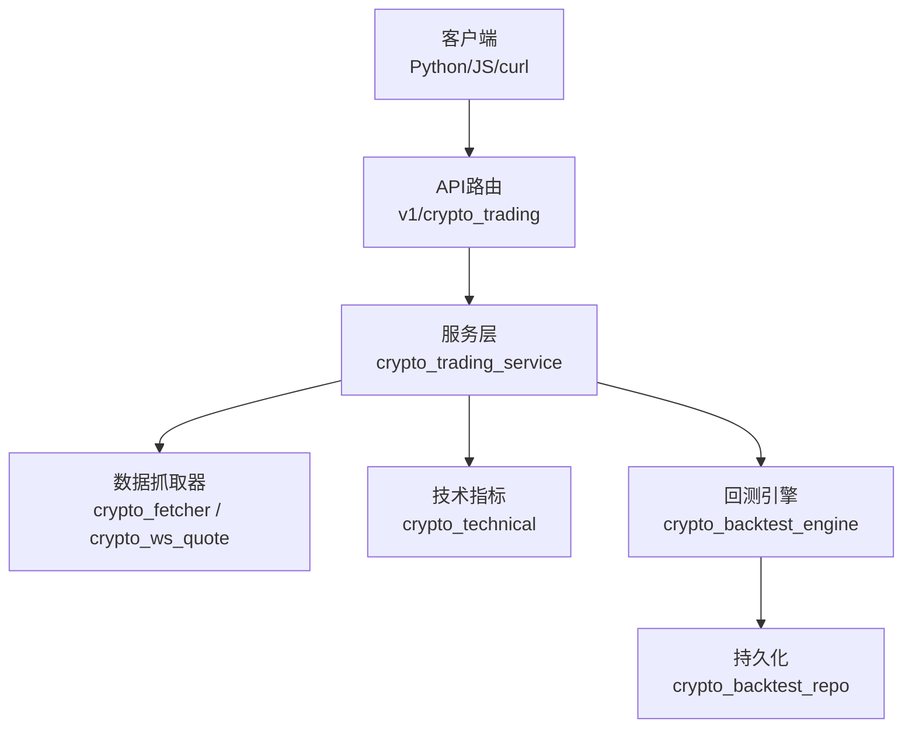
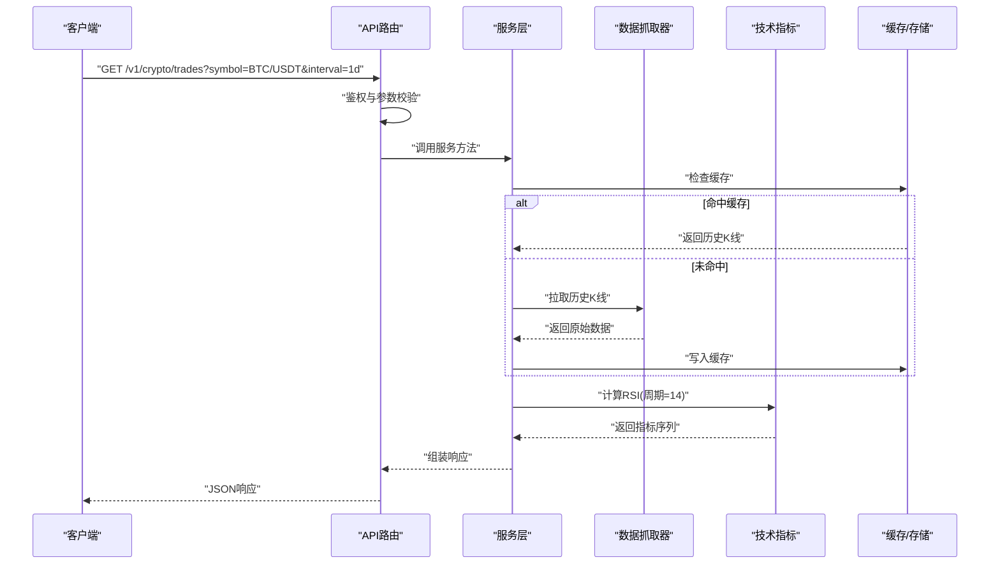
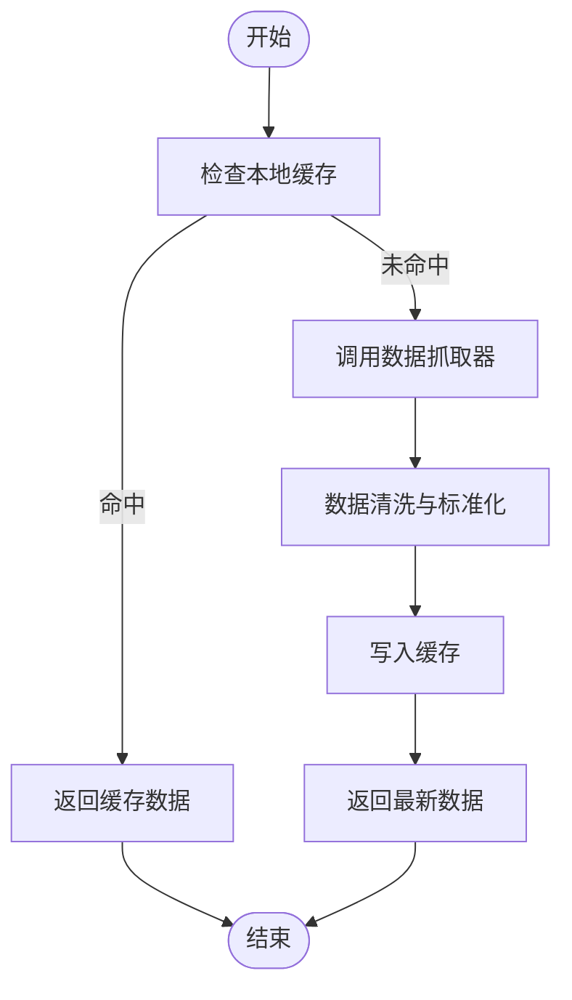
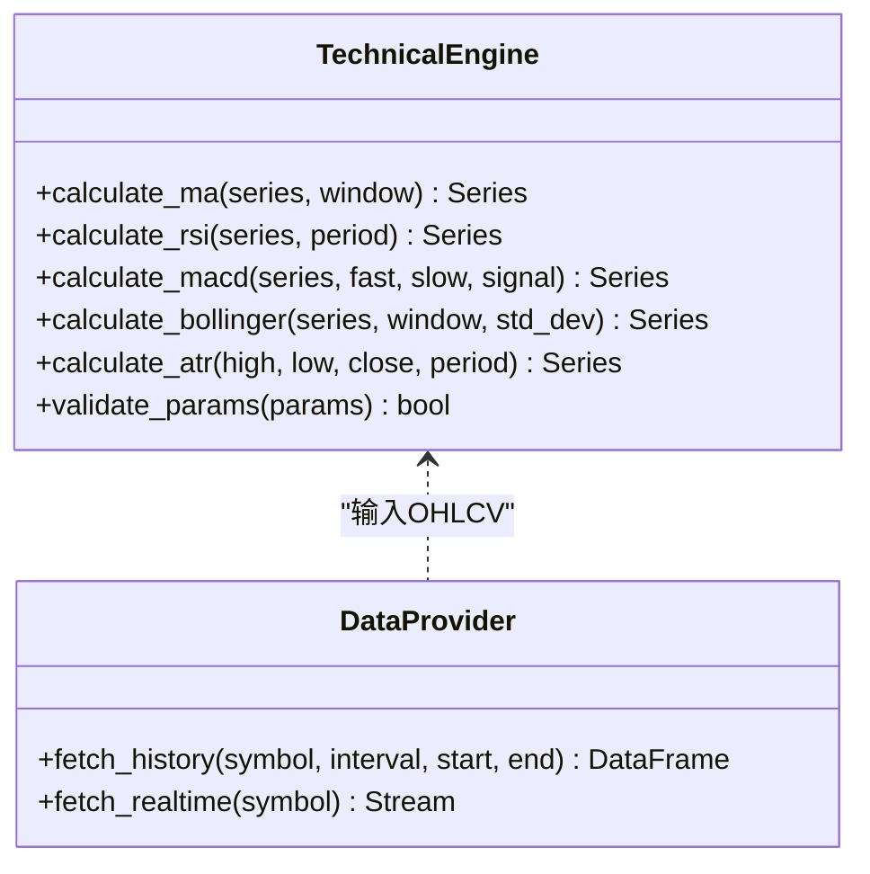
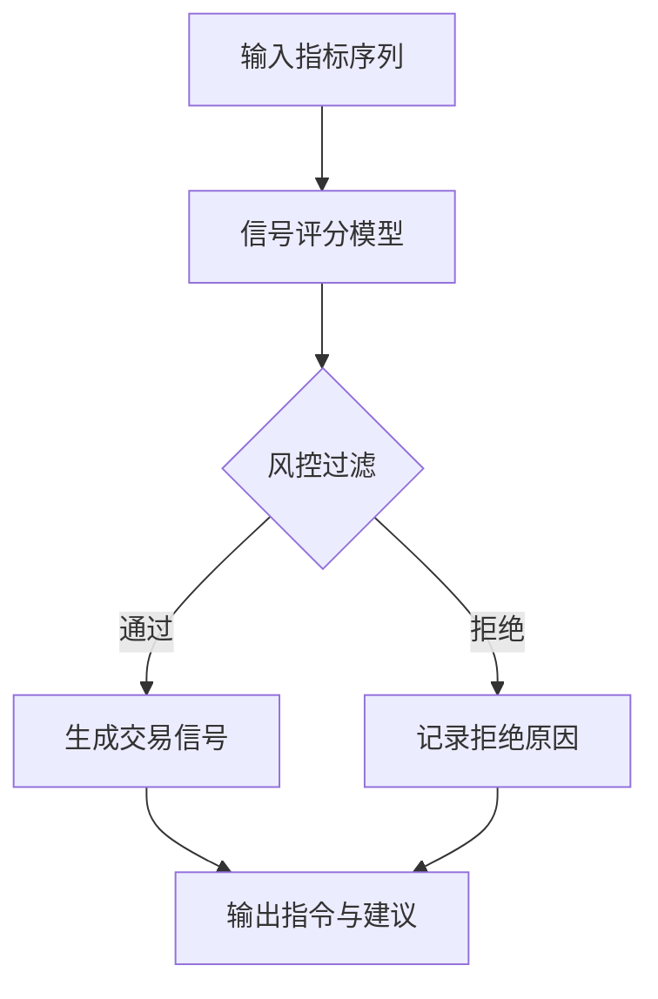
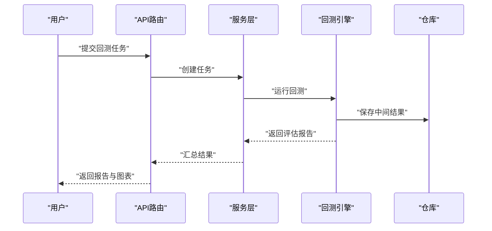
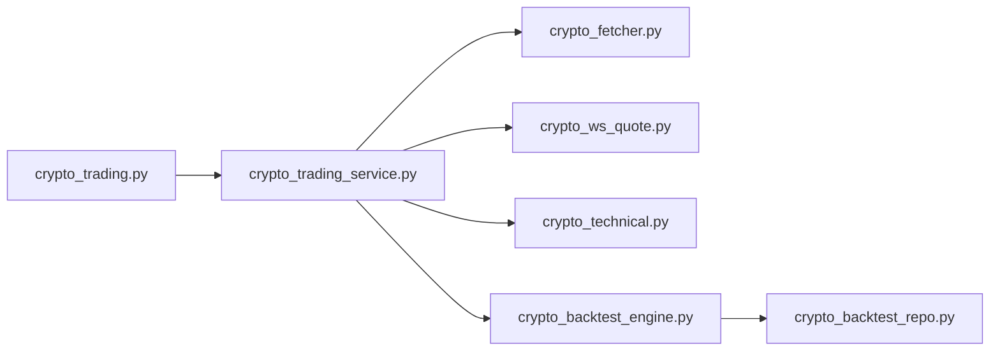

# 加密货币交易API示例

<cite>
**本文引用的文件**   
- [api/v1/endpoints/crypto_trading.py](file://api/v1/endpoints/crypto_trading.py)
- [api/v1/schemas/crypto_trading.py](file://api/v1/schemas/crypto_trading.py)
- [src/services/crypto_trading_service.py](file://src/services/crypto_trading_service.py)
- [data_provider/crypto_fetcher.py](file://data_provider/crypto_fetcher.py)
- [data_provider/crypto_ws_quote.py](file://data_provider/crypto_ws_quote.py)
- [src/crypto_technical.py](file://src/crypto_technical.py)
- [src/core/crypto_backtest_engine.py](file://src/core/crypto_backtest_engine.py)
- [src/repositories/crypto_backtest_repo.py](file://src/repositories/crypto_backtest_repo.py)
- [apps/dsa-web/src/api/cryptoTrading.ts](file://apps/dsa-web/src/api/cryptoTrading.ts)
- [api/app.py](file://api/app.py)
</cite>

## 目录
1. [简介](#简介)
2. [项目结构](#项目结构)
3. [核心组件](#核心组件)
4. [架构总览](#架构总览)
5. [详细组件分析](#详细组件分析)
6. [依赖关系分析](#依赖关系分析)
7. [性能考量](#性能考量)
8. [故障排查指南](#故障排查指南)
9. [结论](#结论)
10. [附录：API调用示例与数据格式](#附录api调用示例与数据格式)

## 简介
本文件面向需要集成或使用加密货币交易相关API的开发者，提供从行情获取、技术分析、交易信号到风险控制与回测的一站式接口使用指南。文档涵盖：
- 实时行情订阅（WebSocket）与批量数据处理
- 技术指标计算与参数说明
- 交易信号生成与风控规则
- Python SDK、JavaScript客户端与curl命令的多语言调用示例
- 异常处理与最佳实践

## 项目结构
本项目采用分层架构：API层暴露REST接口，服务层封装业务逻辑，数据层对接多源数据提供者（含加密货币现货与衍生品），同时提供前端Web API客户端与WebSocket行情订阅能力。

图表来源
- [api/v1/endpoints/crypto_trading.py](file://api/v1/endpoints/crypto_trading.py)
- [src/services/crypto_trading_service.py](file://src/services/crypto_trading_service.py)
- [data_provider/crypto_fetcher.py](file://data_provider/crypto_fetcher.py)
- [data_provider/crypto_ws_quote.py](file://data_provider/crypto_ws_quote.py)
- [src/crypto_technical.py](file://src/crypto_technical.py)
- [src/core/crypto_backtest_engine.py](file://src/core/crypto_backtest_engine.py)
- [src/repositories/crypto_backtest_repo.py](file://src/repositories/crypto_backtest_repo.py)

章节来源
- [api/app.py](file://api/app.py)

## 核心组件
- 行情获取：支持历史K线、逐笔/快照、聚合数据的批量拉取与缓存策略
- 技术分析：常用指标（如均线、RSI、MACD、布林带等）的参数化计算与组合
- 交易信号：基于指标阈值、形态识别与风险约束的信号生成
- 风险控制：仓位管理、止损止盈、波动率过滤、回撤控制
- 回测：事件驱动或向量化回测，支持滑点、手续费、资金曲线统计

章节来源
- [api/v1/endpoints/crypto_trading.py](file://api/v1/endpoints/crypto_trading.py)
- [api/v1/schemas/crypto_trading.py](file://api/v1/schemas/crypto_trading.py)
- [src/services/crypto_trading_service.py](file://src/services/crypto_trading_service.py)
- [data_provider/crypto_fetcher.py](file://data_provider/crypto_fetcher.py)
- [data_provider/crypto_ws_quote.py](file://data_provider/crypto_ws_quote.py)
- [src/crypto_technical.py](file://src/crypto_technical.py)
- [src/core/crypto_backtest_engine.py](file://src/core/crypto_backtest_engine.py)
- [src/repositories/crypto_backtest_repo.py](file://src/repositories/crypto_backtest_repo.py)

## 架构总览
下图展示一次“获取BTC/USDT日线并计算RSI”的典型请求流程，包括鉴权、参数校验、数据获取、指标计算与响应返回。

图表来源
- [api/v1/endpoints/crypto_trading.py](file://api/v1/endpoints/crypto_trading.py)
- [src/services/crypto_trading_service.py](file://src/services/crypto_trading_service.py)
- [data_provider/crypto_fetcher.py](file://data_provider/crypto_fetcher.py)
- [src/crypto_technical.py](file://src/crypto_technical.py)

## 详细组件分析

### 行情获取与订阅
- 历史K线：支持多时间粒度、多标的批量查询；具备分页与增量更新能力
- 实时行情：通过WebSocket订阅深度、成交与资金流；断线重连与心跳保活
- 数据清洗：去重、对齐时间戳、缺失值填充、异常值过滤

图表来源
- [data_provider/crypto_fetcher.py](file://data_provider/crypto_fetcher.py)
- [data_provider/crypto_ws_quote.py](file://data_provider/crypto_ws_quote.py)

章节来源
- [data_provider/crypto_fetcher.py](file://data_provider/crypto_fetcher.py)
- [data_provider/crypto_ws_quote.py](file://data_provider/crypto_ws_quote.py)

### 技术分析模块
- 指标类型：趋势类（MA、EMA）、动量类（RSI、MACD、Stochastic）、波动类（ATR、布林带）、成交量类（OBV、VWAP）
- 参数配置：窗口长度、平滑系数、通道宽度等可配置
- 输出格式：按时间对齐的数值序列，附带质量标记（NaN/有效）

图表来源
- [src/crypto_technical.py](file://src/crypto_technical.py)

章节来源
- [src/crypto_technical.py](file://src/crypto_technical.py)

### 交易信号与风控
- 信号生成：基于指标交叉、突破、背离与形态识别；支持多因子加权评分
- 风控规则：最大持仓比例、单笔止损、移动止盈、波动率过滤、相关性限制
- 执行建议：入场价区间、目标价、止损价、仓位大小、持有期建议

图表来源
- [src/services/crypto_trading_service.py](file://src/services/crypto_trading_service.py)

章节来源
- [src/services/crypto_trading_service.py](file://src/services/crypto_trading_service.py)

### 回测引擎
- 引擎模式：事件驱动与向量化两种；支持多标的并行回测
- 成本模型：手续费、滑点、资金占用利息
- 评估指标：年化收益、夏普比率、最大回撤、胜率、盈亏比、资金曲线

图表来源
- [src/core/crypto_backtest_engine.py](file://src/core/crypto_backtest_engine.py)
- [src/repositories/crypto_backtest_repo.py](file://src/repositories/crypto_backtest_repo.py)

章节来源
- [src/core/crypto_backtest_engine.py](file://src/core/crypto_backtest_engine.py)
- [src/repositories/crypto_backtest_repo.py](file://src/repositories/crypto_backtest_repo.py)

## 依赖关系分析
- API路由依赖服务层进行业务编排
- 服务层依赖数据抓取器与技术指标模块
- 回测引擎依赖仓库进行结果持久化
- 前端客户端通过统一API访问所有功能

图表来源
- [api/v1/endpoints/crypto_trading.py](file://api/v1/endpoints/crypto_trading.py)
- [src/services/crypto_trading_service.py](file://src/services/crypto_trading_service.py)
- [data_provider/crypto_fetcher.py](file://data_provider/crypto_fetcher.py)
- [data_provider/crypto_ws_quote.py](file://data_provider/crypto_ws_quote.py)
- [src/crypto_technical.py](file://src/crypto_technical.py)
- [src/core/crypto_backtest_engine.py](file://src/core/crypto_backtest_engine.py)
- [src/repositories/crypto_backtest_repo.py](file://src/repositories/crypto_backtest_repo.py)

章节来源
- [api/v1/endpoints/crypto_trading.py](file://api/v1/endpoints/crypto_trading.py)
- [src/services/crypto_trading_service.py](file://src/services/crypto_trading_service.py)

## 性能考量
- 缓存策略：对历史K线与指标结果做多级缓存（内存+磁盘），减少重复请求
- 批处理：批量拉取与计算，降低网络与CPU开销
- 异步与并发：WebSocket订阅与HTTP请求分离，避免阻塞
- 数据压缩：传输大体积数据时启用压缩与分页
- 资源限流：对高频接口实施速率限制与熔断保护

[本节为通用指导，不直接分析具体文件]

## 故障排查指南
- 连接失败：检查网络、代理、证书与端口；确认WebSocket握手成功
- 数据缺失：核对时间范围、标的代码、交易所映射与数据源可用性
- 指标异常：检查输入数据质量（NaN、重复、时间错乱）与参数合法性
- 回测偏差：确认成本模型、复权方式与滑点设置是否与实际一致
- 错误码定位：查看API错误响应体中的错误码与消息，结合服务端日志定位

章节来源
- [api/v1/endpoints/crypto_trading.py](file://api/v1/endpoints/crypto_trading.py)
- [api/v1/schemas/crypto_trading.py](file://api/v1/schemas/crypto_trading.py)

## 结论
本API体系覆盖加密货币交易全链路：从数据接入、指标计算、信号生成到回测验证与风控约束。通过模块化设计与清晰的接口契约，便于在不同语言环境中快速集成与扩展。建议在生产环境启用缓存、限流与监控，确保稳定性与性能。

[本节为总结性内容，不直接分析具体文件]

## 附录：API调用示例与数据格式

### REST接口概览
- 基础路径：/v1/crypto
- 认证：根据部署配置可能要求Bearer Token或API Key
- 通用响应字段：code、message、data、trace_id

章节来源
- [api/v1/endpoints/crypto_trading.py](file://api/v1/endpoints/crypto_trading.py)
- [api/v1/schemas/crypto_trading.py](file://api/v1/schemas/crypto_trading.py)

### 行情获取
- 历史K线
  - 方法：GET
  - 路径：/v1/crypto/history
  - 参数：symbol、interval、start、end、limit、offset
  - 响应：包含时间戳、开高低收量（OHLCV）数组
- 实时行情
  - 方法：WebSocket
  - 路径：ws://host/v1/crypto/ws?channels=trade,depth&symbols=BTC/USDT
  - 事件：trade、depth、heartbeat、error

章节来源
- [data_provider/crypto_fetcher.py](file://data_provider/crypto_fetcher.py)
- [data_provider/crypto_ws_quote.py](file://data_provider/crypto_ws_quote.py)

### 技术分析
- 指标计算
  - 方法：POST
  - 路径：/v1/crypto/indicators
  - 请求体：symbol、interval、indicators（数组，每项含type与params）
  - 响应：各指标按时间对齐的数值序列与质量标记

章节来源
- [src/crypto_technical.py](file://src/crypto_technical.py)

### 交易信号与风控
- 信号生成
  - 方法：POST
  - 路径：/v1/crypto/signals
  - 请求体：symbol、interval、strategy（含指标阈值与权重）
  - 响应：入场/出场建议、止损止盈、仓位建议、置信度
- 风控规则
  - 方法：POST
  - 路径：/v1/crypto/risk/check
  - 请求体：当前持仓、拟下单信息、市场状态
  - 响应：通过/拒绝及原因

章节来源
- [src/services/crypto_trading_service.py](file://src/services/crypto_trading_service.py)

### 回测
- 提交回测
  - 方法：POST
  - 路径：/v1/crypto/backtest
  - 请求体：策略配置、标的列表、时间范围、成本模型
  - 响应：任务ID，用于查询进度与结果
- 查询结果
  - 方法：GET
  - 路径：/v1/crypto/backtest/{task_id}
  - 响应：评估指标、资金曲线、交易明细

章节来源
- [src/core/crypto_backtest_engine.py](file://src/core/crypto_backtest_engine.py)
- [src/repositories/crypto_backtest_repo.py](file://src/repositories/crypto_backtest_repo.py)

### 数据格式规范
- OHLCV字段：timestamp、open、high、low、close、volume
- 指标字段：name、values（按时间顺序）、metadata（参数与质量）
- 信号字段：action、entry_range、stop_loss、take_profit、position_size、confidence
- 错误字段：code、message、details、trace_id

章节来源
- [api/v1/schemas/crypto_trading.py](file://api/v1/schemas/crypto_trading.py)

### 多语言调用示例

- curl命令
  - 获取历史K线
    - GET http://host/v1/crypto/history?symbol=BTC/USDT&interval=1d&limit=100
  - 计算指标
    - POST http://host/v1/crypto/indicators
    - 请求体：{"symbol":"BTC/USDT","interval":"1d","indicators":[{"type":"rsi","params":{"period":14}}]}
  - 生成信号
    - POST http://host/v1/crypto/signals
    - 请求体：{"symbol":"BTC/USDT","interval":"1d","strategy":{"rules":[...]}}
  - 提交回测
    - POST http://host/v1/crypto/backtest
    - 请求体：{"symbols":["BTC/USDT"],"start":"2024-01-01","end":"2024-12-31","strategy":{...}}

- JavaScript客户端（浏览器/Node）
  - 使用封装的API模块发起请求与订阅
  - WebSocket连接后监听trade与depth事件，处理心跳与重连

章节来源
- [apps/dsa-web/src/api/cryptoTrading.ts](file://apps/dsa-web/src/api/cryptoTrading.ts)

- Python SDK
  - 初始化客户端并设置认证
  - 调用history、indicators、signals、backtest等方法
  - 处理异常与重试策略

章节来源
- [api/v1/endpoints/crypto_trading.py](file://api/v1/endpoints/crypto_trading.py)
- [src/services/crypto_trading_service.py](file://src/services/crypto_trading_service.py)

### 高级用法
- 实时订阅与批量处理
  - 建立多个WebSocket通道，合并不同标的数据
  - 使用环形缓冲区与批处理队列，降低CPU与内存峰值
- 异常处理
  - 网络异常：指数退避重连
  - 数据异常：跳过坏数据并记录告警
  - 业务异常：降级策略与兜底响应
- 性能优化
  - 启用GZIP压缩与分页
  - 指标计算缓存与增量更新
  - 回测任务异步化与分片执行

章节来源
- [data_provider/crypto_ws_quote.py](file://data_provider/crypto_ws_quote.py)
- [src/crypto_technical.py](file://src/crypto_technical.py)
- [src/core/crypto_backtest_engine.py](file://src/core/crypto_backtest_engine.py)