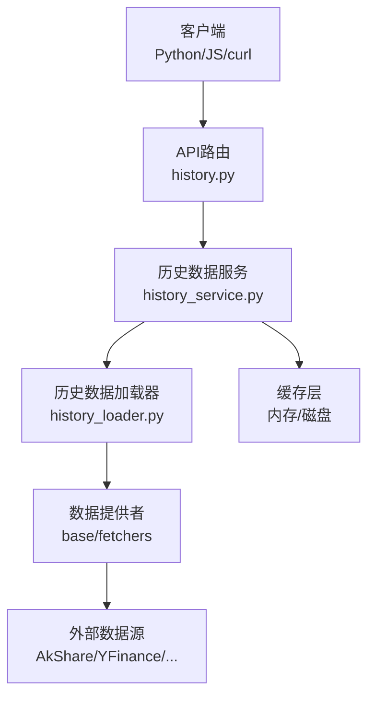
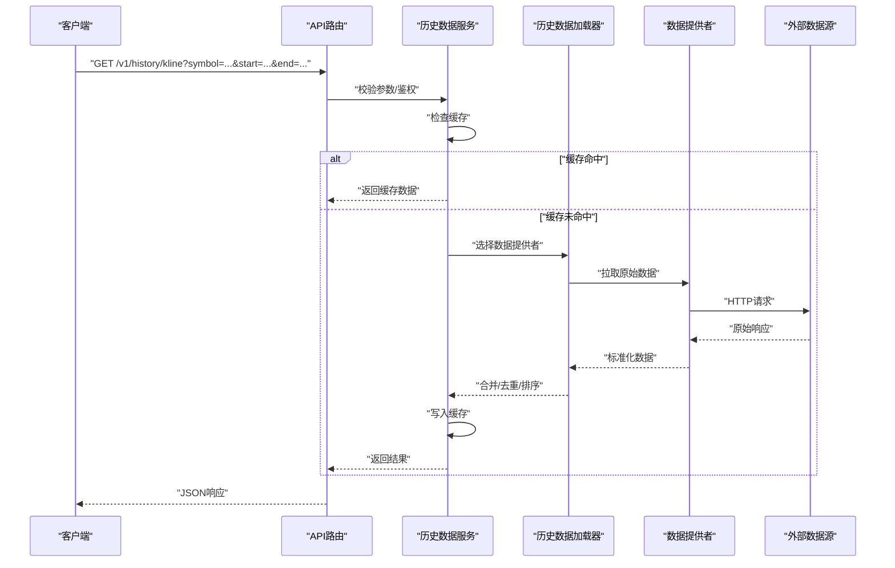
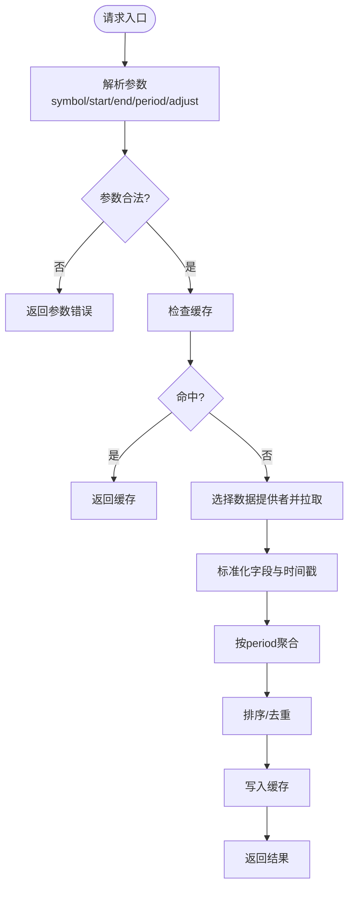
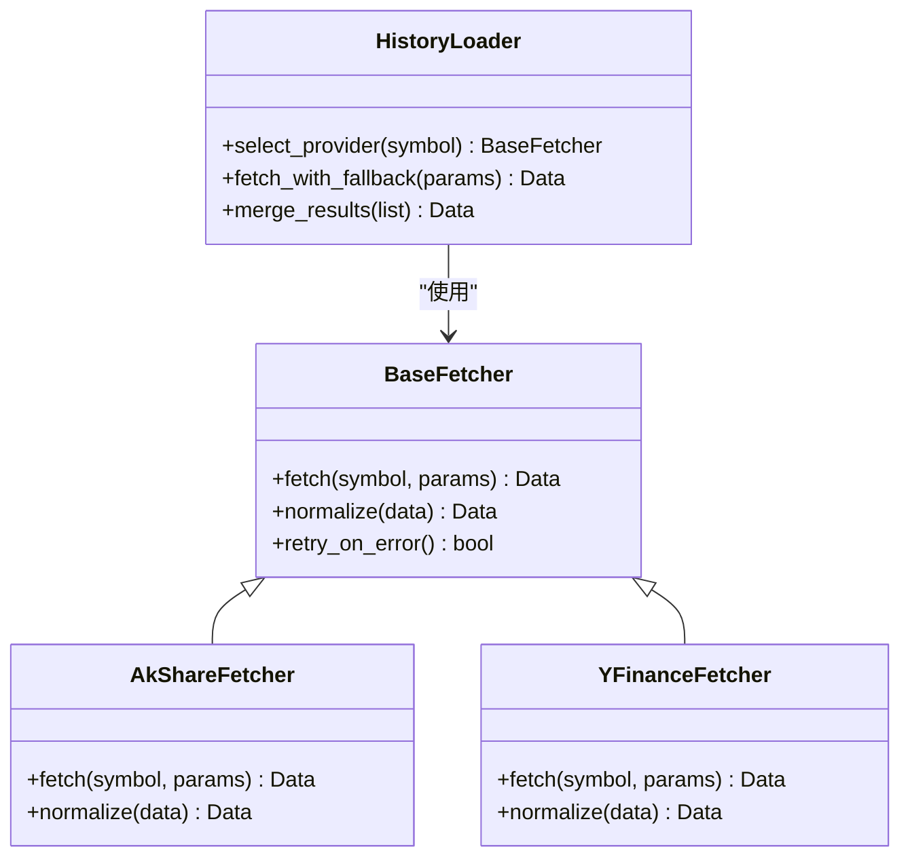
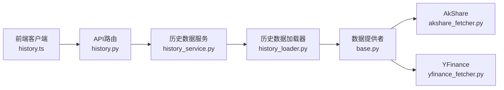

# 历史数据API示例

<cite>
**本文档引用的文件**   
- [api/v1/endpoints/history.py](file://api/v1/endpoints/history.py)
- [api/v1/schemas/history.py](file://api/v1/schemas/history.py)
- [src/services/history_service.py](file://src/services/history_service.py)
- [src/services/history_loader.py](file://src/services/history_loader.py)
- [data_provider/base.py](file://data_provider/base.py)
- [data_provider/akshare_fetcher.py](file://data_provider/akshare_fetcher.py)
- [data_provider/yfinance_fetcher.py](file://data_provider/yfinance_fetcher.py)
- [apps/dsa-web/src/api/history.ts](file://apps/dsa-web/src/api/history.ts)
- [main.py](file://main.py)
- [server.py](file://server.py)
</cite>

## 目录
1. [简介](#简介)
2. [项目结构](#项目结构)
3. [核心组件](#核心组件)
4. [架构总览](#架构总览)
5. [详细组件分析](#详细组件分析)
6. [依赖关系分析](#依赖关系分析)
7. [性能考虑](#性能考虑)
8. [故障排查指南](#故障排查指南)
9. [结论](#结论)
10. [附录：调用示例与最佳实践](#附录调用示例与最佳实践)

## 简介
本文件面向需要批量获取历史数据的开发者，提供K线、财务、新闻等历史数据的API调用示例与高级用法说明。内容涵盖时间范围过滤、数据聚合选项、批量下载、增量更新与缓存策略，并给出Python SDK、JavaScript客户端以及curl命令的多种调用方式。

## 项目结构
历史数据相关能力由后端API路由、服务层、数据提供者与前端客户端共同组成：
- API路由层：定义REST接口与请求/响应模型
- 服务层：封装查询逻辑、分页与聚合、缓存与重试
- 数据提供者：对接多源（A股、美股、加密货币等）历史数据
- 前端客户端：封装HTTP调用与错误处理

图表来源
- [api/v1/endpoints/history.py](file://api/v1/endpoints/history.py)
- [src/services/history_service.py](file://src/services/history_service.py)
- [src/services/history_loader.py](file://src/services/history_loader.py)
- [data_provider/base.py](file://data_provider/base.py)
- [data_provider/akshare_fetcher.py](file://data_provider/akshare_fetcher.py)
- [data_provider/yfinance_fetcher.py](file://data_provider/yfinance_fetcher.py)

章节来源
- [api/v1/endpoints/history.py](file://api/v1/endpoints/history.py)
- [src/services/history_service.py](file://src/services/history_service.py)
- [src/services/history_loader.py](file://src/services/history_loader.py)
- [data_provider/base.py](file://data_provider/base.py)

## 核心组件
- 历史数据API路由：暴露K线、财务、新闻等历史查询接口，统一参数校验与返回格式
- 历史数据服务：实现分页、聚合、去重、缓存、并发与限流
- 历史数据加载器：协调不同数据提供者，选择最优源与回退策略
- 数据提供者：标准化各数据源的拉取接口，统一字段与时间戳格式
- 前端客户端：封装请求、重试、错误提示与本地缓存

章节来源
- [api/v1/endpoints/history.py](file://api/v1/endpoints/history.py)
- [api/v1/schemas/history.py](file://api/v1/schemas/history.py)
- [src/services/history_service.py](file://src/services/history_service.py)
- [src/services/history_loader.py](file://src/services/history_loader.py)
- [data_provider/base.py](file://data_provider/base.py)

## 架构总览
历史数据查询的整体流程如下：
- 客户端发起请求（Python SDK / JS客户端 / curl）
- API路由解析参数、鉴权与限流
- 服务层进行缓存命中判断、分页与聚合计算
- 加载器选择数据提供者并拉取数据，必要时触发回退
- 结果标准化后返回给客户端

图表来源
- [api/v1/endpoints/history.py](file://api/v1/endpoints/history.py)
- [src/services/history_service.py](file://src/services/history_service.py)
- [src/services/history_loader.py](file://src/services/history_loader.py)
- [data_provider/base.py](file://data_provider/base.py)

## 详细组件分析

### K线历史数据接口
- 功能：按标的、时间范围、周期（日/周/月）、复权方式、聚合粒度获取K线序列
- 关键参数：
  - symbol：标的代码
  - start/end：起止时间（支持ISO 8601或Unix时间戳）
  - period：周期（如1d/1w/1m）
  - adjust：复权（前复权/后复权/不复权）
  - limit：每页条数
  - offset：偏移量
- 返回字段：时间戳、开盘价、最高价、最低价、收盘价、成交量、成交额、复权因子
- 时间范围过滤：服务端对start/end进行边界校验与归一化
- 数据聚合：按period自动聚合OHLCV，支持自定义窗口函数

图表来源
- [api/v1/endpoints/history.py](file://api/v1/endpoints/history.py)
- [src/services/history_service.py](file://src/services/history_service.py)
- [src/services/history_loader.py](file://src/services/history_loader.py)

章节来源
- [api/v1/endpoints/history.py](file://api/v1/endpoints/history.py)
- [api/v1/schemas/history.py](file://api/v1/schemas/history.py)
- [src/services/history_service.py](file://src/services/history_service.py)

### 财务历史数据接口
- 功能：获取财务报表（利润表、资产负债表、现金流量表）的历史快照
- 关键参数：
  - symbol：标的代码
  - report_type：报表类型
  - start/end：报告期起止
  - frequency：季度/年度
- 返回字段：报告期、科目名称、数值、单位、币种、审计状态
- 数据一致性：跨期对齐与缺失值填充策略

章节来源
- [api/v1/endpoints/history.py](file://api/v1/endpoints/history.py)
- [src/services/history_service.py](file://src/services/history_service.py)

### 新闻历史接口
- 功能：按主题、关键词、时间范围检索历史新闻摘要与来源
- 关键参数：
  - keyword/topic：关键词或主题
  - start/end：时间范围
  - source：来源筛选
  - language：语言
- 返回字段：标题、摘要、发布时间、来源、链接、情感得分（可选）

章节来源
- [api/v1/endpoints/history.py](file://api/v1/endpoints/history.py)
- [src/services/history_service.py](file://src/services/history_service.py)

### 数据提供者与加载器
- base：定义统一的拉取接口、异常与重试策略
- akshare_fetcher：A股数据源适配
- yfinance_fetcher：美股与指数数据源适配
- loader：负责多源选择、回退与合并

图表来源
- [data_provider/base.py](file://data_provider/base.py)
- [data_provider/akshare_fetcher.py](file://data_provider/akshare_fetcher.py)
- [data_provider/yfinance_fetcher.py](file://data_provider/yfinance_fetcher.py)
- [src/services/history_loader.py](file://src/services/history_loader.py)

章节来源
- [data_provider/base.py](file://data_provider/base.py)
- [data_provider/akshare_fetcher.py](file://data_provider/akshare_fetcher.py)
- [data_provider/yfinance_fetcher.py](file://data_provider/yfinance_fetcher.py)
- [src/services/history_loader.py](file://src/services/history_loader.py)

### 前端客户端（JavaScript）
- 封装历史数据API调用，包含错误处理、重试与本地缓存
- 提供便捷方法：getKline、getFinancials、getNewsHistory
- 支持批量请求与增量更新

章节来源
- [apps/dsa-web/src/api/history.ts](file://apps/dsa-web/src/api/history.ts)

## 依赖关系分析
- API路由依赖服务层，服务层依赖加载器与缓存
- 加载器依赖数据提供者，提供者依赖外部数据源
- 前端客户端依赖API路由

图表来源
- [api/v1/endpoints/history.py](file://api/v1/endpoints/history.py)
- [src/services/history_service.py](file://src/services/history_service.py)
- [src/services/history_loader.py](file://src/services/history_loader.py)
- [data_provider/base.py](file://data_provider/base.py)
- [data_provider/akshare_fetcher.py](file://data_provider/akshare_fetcher.py)
- [data_provider/yfinance_fetcher.py](file://data_provider/yfinance_fetcher.py)
- [apps/dsa-web/src/api/history.ts](file://apps/dsa-web/src/api/history.ts)

章节来源
- [api/v1/endpoints/history.py](file://api/v1/endpoints/history.py)
- [src/services/history_service.py](file://src/services/history_service.py)
- [src/services/history_loader.py](file://src/services/history_loader.py)
- [data_provider/base.py](file://data_provider/base.py)

## 性能考虑
- 缓存策略：热点数据（如热门标的日线）采用多级缓存（内存+磁盘），减少重复请求
- 分页与限制：默认limit上限，避免一次性返回过大数据集
- 并发与限流：对数据提供者进行并发控制与速率限制，防止被上游限流
- 聚合优化：在服务端按period预聚合，降低客户端计算成本
- 增量更新：基于时间戳增量拉取，避免全量覆盖

[本节为通用指导，不直接分析具体文件]

## 故障排查指南
- 常见错误：
  - 参数非法：检查symbol、start/end格式与范围
  - 数据源不可用：启用回退策略，切换其他提供者
  - 超时与限流：增加重试次数与退避间隔
  - 缓存失效：清理缓存并重新拉取
- 诊断步骤：
  - 查看API日志与错误码
  - 检查数据提供者健康状态
  - 验证时间范围与周期设置
  - 对比缓存命中情况

章节来源
- [api/v1/endpoints/history.py](file://api/v1/endpoints/history.py)
- [src/services/history_service.py](file://src/services/history_service.py)

## 结论
历史数据API通过清晰的分层架构与多数据源适配，提供了稳定、高效且可扩展的历史数据查询能力。结合缓存、分页、聚合与增量更新策略，可满足从轻量查询到大规模批量的多样化需求。

[本节为总结性内容，不直接分析具体文件]

## 附录：调用示例与最佳实践

### Python SDK调用示例
- 安装SDK后，初始化客户端并传入认证信息
- 调用get_kline、get_financials、get_news_history等方法
- 设置timeout、retries与cache_enabled参数

章节来源
- [apps/dsa-web/src/api/history.ts](file://apps/dsa-web/src/api/history.ts)

### JavaScript客户端调用示例
- 在浏览器或Node.js环境中引入客户端库
- 使用async/await语法调用历史数据接口
- 处理错误与空数据场景

章节来源
- [apps/dsa-web/src/api/history.ts](file://apps/dsa-web/src/api/history.ts)

### curl命令示例
- K线查询：GET /v1/history/kline?symbol=...&start=...&end=...
- 财务查询：GET /v1/history/financials?symbol=...&report_type=...
- 新闻查询：GET /v1/history/news?keyword=...&start=...&end=...

章节来源
- [api/v1/endpoints/history.py](file://api/v1/endpoints/history.py)

### 批量数据下载
- 使用分页参数limit与offset循环拉取
- 合并结果并按时间排序
- 保存为CSV或Parquet格式

章节来源
- [src/services/history_service.py](file://src/services/history_service.py)

### 增量更新
- 记录上次更新时间戳
- 仅拉取新增时间段的数据
- 合并新旧数据并去重

章节来源
- [src/services/history_service.py](file://src/services/history_service.py)

### 数据缓存
- 启用本地缓存以减少重复请求
- 设置合理的过期时间与最大容量
- 监控缓存命中率与性能指标

章节来源
- [src/services/history_service.py](file://src/services/history_service.py)

### 时间范围过滤与聚合选项
- 支持ISO 8601与Unix时间戳
- 周期包括1d/1w/1m，可自定义窗口
- 复权方式支持前复权、后复权与不复权

章节来源
- [api/v1/schemas/history.py](file://api/v1/schemas/history.py)

### 最佳实践
- 合理设置limit与offset，避免单次请求过大
- 使用增量更新减少带宽与存储开销
- 启用缓存提升响应速度
- 对失败请求实施指数退避重试

[本节为通用指导，不直接分析具体文件]