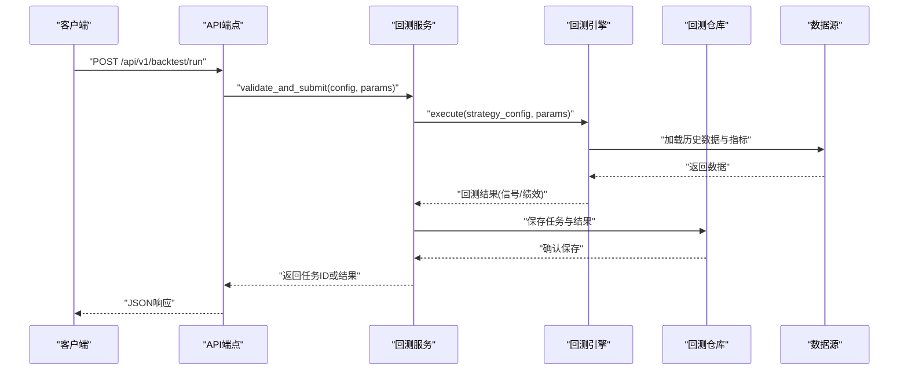
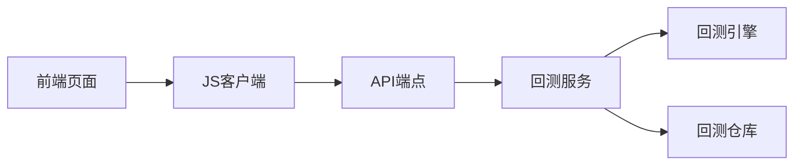

# 回测API示例

<cite>
**本文档引用的文件**   
- [backtest.py](file://api/v1/endpoints/backtest.py)
- [backtest.py](file://api/v1/schemas/backtest.py)
- [backtest_service.py](file://src/services/backtest_service.py)
- [backtest_engine.py](file://src/core/backtest_engine.py)
- [backtest_repo.py](file://src/repositories/backtest_repo.py)
- [backtest_tools.py](file://src/agent/tools/backtest_tools.py)
- [backtest.ts](file://apps/dsa-web/src/api/backtest.ts)
- [BacktestPage.tsx](file://apps/dsa-web/src/pages/BacktestPage.tsx)
- [backtest.ts](file://apps/dsa-web/src/types/backtest.ts)
</cite>

## 目录
1. [简介](#简介)
2. [项目结构](#项目结构)
3. [核心组件](#核心组件)
4. [架构总览](#架构总览)
5. [详细组件分析](#详细组件分析)
6. [依赖关系分析](#依赖关系分析)
7. [性能考虑](#性能考虑)
8. [故障排查指南](#故障排查指南)
9. [结论](#结论)
10. [附录：调用示例与最佳实践](#附录调用示例与最佳实践)

## 简介
本文件面向使用回测API的开发者与量化研究者，提供从策略配置、参数设置到结果解析的完整示例。内容覆盖：
- 策略回测接口使用方法（同步与异步）
- 参数优化流程与批量回测
- 结果数据模型与可视化建议
- Python SDK、JavaScript客户端与curl命令的多语言调用示例
- 高级用法：任务队列、缓存策略、错误处理与重试

## 项目结构
回测功能由后端API层、服务层、引擎层与存储层组成，前端通过JS客户端调用API并渲染结果。关键路径如下：
- API端点：定义HTTP路由与请求/响应Schema
- 服务层：编排回测任务、参数优化、结果聚合
- 引擎层：执行回测计算
- 存储层：持久化回测任务与结果
- 前端：封装API调用、展示回测报告与图表

```mermaid
graph TB
Client["客户端<br/>Python/JS/curl"] --> API["API端点<br/>/api/v1/backtest/*"]
API --> Service["回测服务<br/>BacktestService"]
Service --> Engine["回测引擎<br/>BacktestEngine"]
Service --> Repo["回测仓库<br/>BacktestRepo"]
Engine --> Data["数据源<br/>历史行情/指标"]
Repo --> DB["持久化存储"]
Client <- --> Frontend["Web前端<br/>BacktestPage + backtest.ts"]
```

**图示来源** 
- [backtest.py](file://api/v1/endpoints/backtest.py)
- [backtest_service.py](file://src/services/backtest_service.py)
- [backtest_engine.py](file://src/core/backtest_engine.py)
- [backtest_repo.py](file://src/repositories/backtest_repo.py)

**章节来源**
- [backtest.py](file://api/v1/endpoints/backtest.py)
- [backtest_service.py](file://src/services/backtest_service.py)
- [backtest_engine.py](file://src/core/backtest_engine.py)
- [backtest_repo.py](file://src/repositories/backtest_repo.py)

## 核心组件
- 回测端点：暴露REST接口，接收策略配置与回测参数，返回任务ID或结果
- 回测服务：协调引擎执行、参数优化、任务调度与结果聚合
- 回测引擎：核心计算逻辑，按策略与参数生成交易信号与绩效指标
- 回测仓库：读写回测任务与结果，支持分页与过滤
- 工具与SDK：Python工具函数与JS客户端封装，简化调用

**章节来源**
- [backtest.py](file://api/v1/endpoints/backtest.py)
- [backtest_service.py](file://src/services/backtest_service.py)
- [backtest_engine.py](file://src/core/backtest_engine.py)
- [backtest_repo.py](file://src/repositories/backtest_repo.py)

## 架构总览
回测API采用分层架构，职责清晰、扩展性强。请求进入API层后，由服务层进行业务编排，引擎层负责计算，仓库层负责持久化。前端通过JS客户端发起请求并渲染结果。



**图示来源** 
- [backtest.py](file://api/v1/endpoints/backtest.py)
- [backtest_service.py](file://src/services/backtest_service.py)
- [backtest_engine.py](file://src/core/backtest_engine.py)
- [backtest_repo.py](file://src/repositories/backtest_repo.py)

## 详细组件分析

### 回测端点（API层）
- 主要接口
  - 启动回测：POST /api/v1/backtest/run
  - 查询状态：GET /api/v1/backtest/{task_id}
  - 获取结果：GET /api/v1/backtest/{task_id}/result
  - 参数优化：POST /api/v1/backtest/optimize
  - 批量回测：POST /api/v1/backtest/batch
- 请求体字段
  - strategy_config：策略配置对象（见“策略配置格式”）
  - params：回测参数（时间范围、初始资金、手续费等）
- 响应体字段
  - task_id：任务标识
  - status：任务状态（pending/running/completed/failed）
  - result：回测结果（当同步返回时）

**章节来源**
- [backtest.py](file://api/v1/endpoints/backtest.py)
- [backtest.py](file://api/v1/schemas/backtest.py)

### 回测服务（业务编排）
- 职责
  - 校验输入参数与策略配置
  - 调度引擎执行（同步或异步）
  - 管理任务生命周期与状态
  - 聚合多轮优化结果
- 关键方法
  - run_backtest：执行单次回测
  - optimize_params：参数优化（网格搜索/随机搜索）
  - batch_run：批量回测（并发控制）
  - get_task_status：查询任务状态
  - get_result：获取回测结果

**章节来源**
- [backtest_service.py](file://src/services/backtest_service.py)

### 回测引擎（计算核心）
- 职责
  - 根据策略配置生成交易信号
  - 模拟交易过程，计算绩效指标
  - 输出交易日志与统计摘要
- 关键方法
  - execute：主入口，接受策略与参数
  - generate_signals：信号生成
  - simulate_trades：交易模拟
  - compute_metrics：指标计算（收益率、最大回撤、夏普比率等）

**章节来源**
- [backtest_engine.py](file://src/core/backtest_engine.py)

### 回测仓库（持久化）
- 职责
  - 保存回测任务元数据与结果
  - 支持分页、过滤与排序
  - 提供结果查询接口
- 关键方法
  - save_task：保存任务
  - update_status：更新状态
  - save_result：保存结果
  - query_tasks：查询任务列表
  - get_result：获取结果

**章节来源**
- [backtest_repo.py](file://src/repositories/backtest_repo.py)

### 前端集成（JS客户端与页面）
- JS客户端
  - 封装API调用，处理错误与重试
  - 提供类型定义与默认参数
- BacktestPage
  - 表单收集策略配置与参数
  - 显示任务状态与结果图表
  - 支持批量与优化任务的交互

**章节来源**
- [backtest.ts](file://apps/dsa-web/src/api/backtest.ts)
- [BacktestPage.tsx](file://apps/dsa-web/src/pages/BacktestPage.tsx)
- [backtest.ts](file://apps/dsa-web/src/types/backtest.ts)

## 依赖关系分析
组件间依赖清晰，服务层依赖引擎与仓库，API层依赖服务层，前端依赖JS客户端。



**图示来源** 
- [backtest.py](file://api/v1/endpoints/backtest.py)
- [backtest_service.py](file://src/services/backtest_service.py)
- [backtest_engine.py](file://src/core/backtest_engine.py)
- [backtest_repo.py](file://src/repositories/backtest_repo.py)
- [backtest.ts](file://apps/dsa-web/src/api/backtest.ts)
- [BacktestPage.tsx](file://apps/dsa-web/src/pages/BacktestPage.tsx)

**章节来源**
- [backtest.py](file://api/v1/endpoints/backtest.py)
- [backtest_service.py](file://src/services/backtest_service.py)
- [backtest_engine.py](file://src/core/backtest_engine.py)
- [backtest_repo.py](file://src/repositories/backtest_repo.py)
- [backtest.ts](file://apps/dsa-web/src/api/backtest.ts)
- [BacktestPage.tsx](file://apps/dsa-web/src/pages/BacktestPage.tsx)

## 性能考虑
- 异步任务：长耗时回测应使用异步模式，避免阻塞
- 并发控制：批量回测需限制并发数，防止资源耗尽
- 缓存策略：对相同参数组合的结果进行缓存，减少重复计算
- 数据预取：提前加载历史数据，缩短引擎执行时间
- 分页查询：大结果集使用分页，降低内存占用

[本节为通用指导，不直接分析具体文件]

## 故障排查指南
- 常见错误
  - 参数校验失败：检查strategy_config与params字段是否完整
  - 数据源不可用：确认历史数据接口可用性与权限
  - 任务超时：增加超时阈值或拆分任务
  - 结果缺失：检查任务状态是否为completed
- 调试步骤
  - 查看任务日志与状态
  - 验证策略配置语法
  - 逐步缩小参数范围定位问题
  - 使用单只股票或小时间窗口测试

**章节来源**
- [backtest_service.py](file://src/services/backtest_service.py)
- [backtest_engine.py](file://src/core/backtest_engine.py)

## 结论
本回测API提供了完整的策略回测、参数优化与结果分析能力，支持多种调用方式与高级用法。通过合理的架构设计与性能优化，可满足从个人研究到团队协作的多样化需求。

[本节为总结性内容，不直接分析具体文件]

## 附录：调用示例与最佳实践

### 策略配置格式
- 必填字段
  - name：策略名称
  - type：策略类型（如趋势跟踪、均值回归等）
  - rules：交易规则数组（入场、出场、止损、止盈）
- 可选字段
  - params：策略参数（如均线周期、RSI阈值）
  - filters：数据过滤器（如市值、流动性）
  - risk：风险控制参数（如仓位比例、最大回撤限制）

**章节来源**
- [backtest.py](file://api/v1/schemas/backtest.py)

### 回测参数设置
- 时间范围：start_date, end_date
- 资金与费用：initial_capital, commission_rate, slippage
- 标的选择：stock_codes, universe
- 频率：frequency（日线/小时线等）

**章节来源**
- [backtest.py](file://api/v1/schemas/backtest.py)

### 结果数据解析
- 绩效指标：total_return, annualized_return, max_drawdown, sharpe_ratio
- 交易记录：trades（入场/出场时间、价格、数量）
- 净值曲线：equity_curve（时间点与净值）
- 风险指标：volatility, beta, alpha

**章节来源**
- [backtest.py](file://api/v1/schemas/backtest.py)
- [backtest.ts](file://apps/dsa-web/src/types/backtest.ts)

### Python SDK调用示例
- 安装依赖：pip install requests
- 基本调用：构造请求头与请求体，发送POST请求
- 异步调用：使用线程池或asyncio并发提交多个任务
- 结果轮询：定时查询任务状态，直到completed

**章节来源**
- [backtest.py](file://api/v1/endpoints/backtest.py)

### JavaScript客户端调用示例
- 引入客户端：import { backtest } from './api/backtest'
- 同步调用：await backtest.run(config, params)
- 异步调用：backtest.optimize(config, params).then(...)
- 错误处理：try-catch捕获网络与业务错误

**章节来源**
- [backtest.ts](file://apps/dsa-web/src/api/backtest.ts)
- [BacktestPage.tsx](file://apps/dsa-web/src/pages/BacktestPage.tsx)

### curl命令示例
- 启动回测：curl -X POST -H "Content-Type: application/json" -d '{"strategy_config": {...}, "params": {...}}' http://localhost:8000/api/v1/backtest/run
- 查询状态：curl http://localhost:8000/api/v1/backtest/{task_id}
- 获取结果：curl http://localhost:8000/api/v1/backtest/{task_id}/result

**章节来源**
- [backtest.py](file://api/v1/endpoints/backtest.py)

### 高级用法
- 批量回测：提交多个策略配置，后台并发执行
- 参数优化：定义参数空间，自动搜索最优组合
- 结果缓存：基于参数哈希缓存结果，加速重复查询
- 任务队列：使用消息队列（如Redis/RabbitMQ）管理任务

**章节来源**
- [backtest_service.py](file://src/services/backtest_service.py)
- [backtest_repo.py](file://src/repositories/backtest_repo.py)

### 最佳实践
- 参数校验：在客户端与服务端双重校验
- 错误重试：对网络错误实现指数退避重试
- 日志记录：记录关键步骤与异常信息
- 监控告警：对长时间运行与失败任务设置告警

**章节来源**
- [backtest_service.py](file://src/services/backtest_service.py)
- [backtest_engine.py](file://src/core/backtest_engine.py)