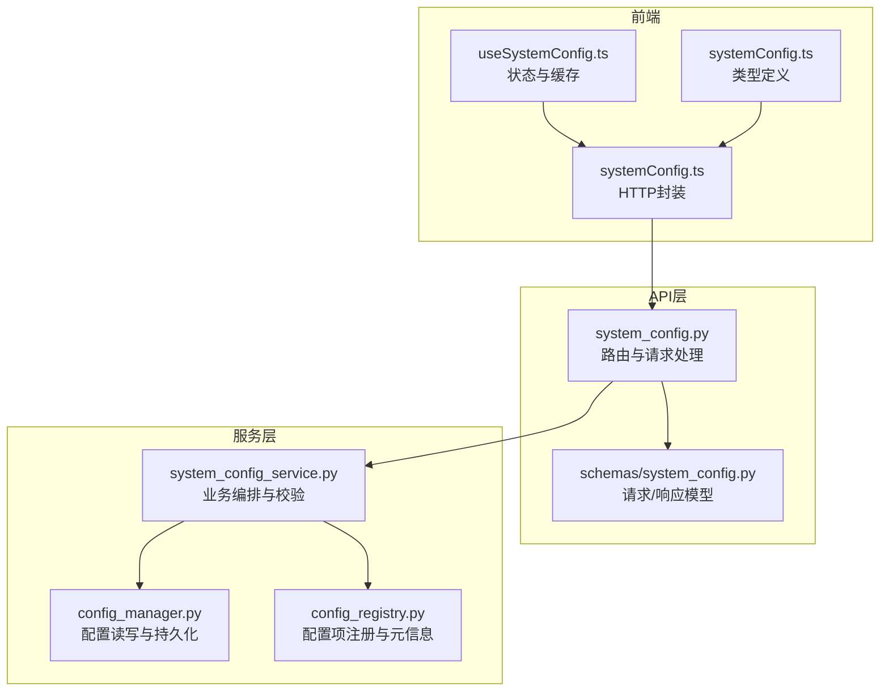
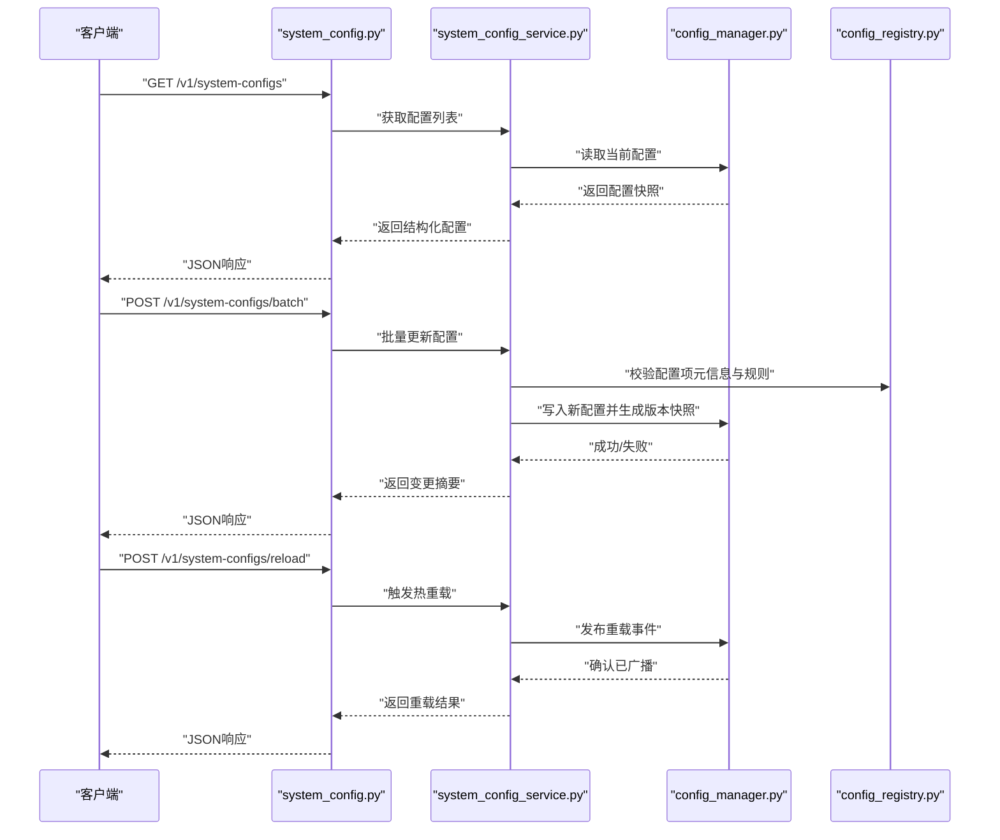
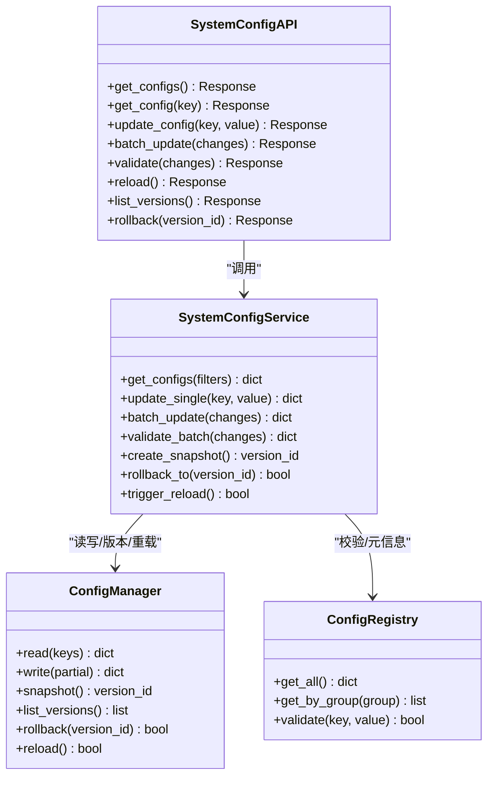
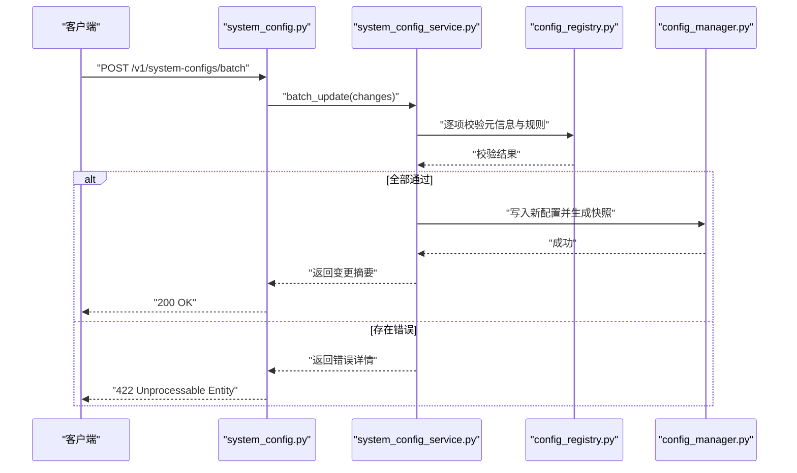
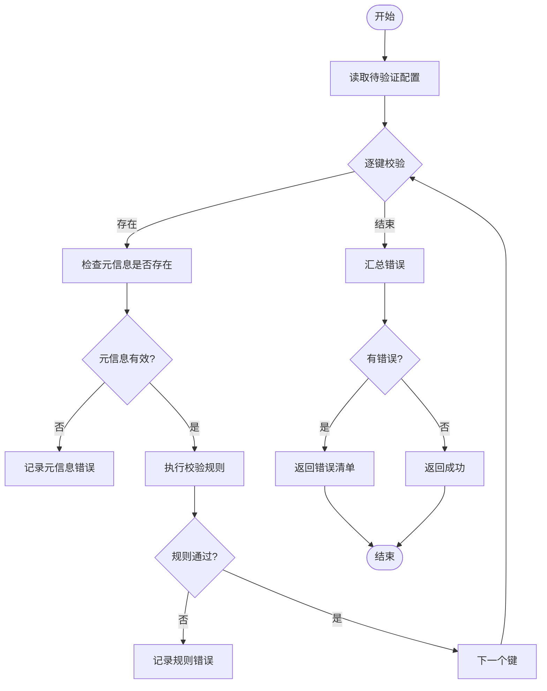
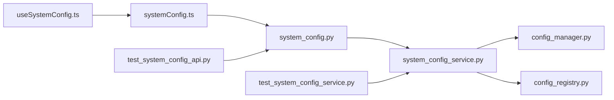

# 系统配置API示例

<cite>
**本文档引用的文件**
- [api/v1/endpoints/system_config.py](file://api/v1/endpoints/system_config.py)
- [api/v1/schemas/system_config.py](file://api/v1/schemas/system_config.py)
- [src/services/system_config_service.py](file://src/services/system_config_service.py)
- [src/core/config_manager.py](file://src/core/config_manager.py)
- [src/core/config_registry.py](file://src/core/config_registry.py)
- [apps/dsa-web/src/api/systemConfig.ts](file://apps/dsa-web/src/api/systemConfig.ts)
- [apps/dsa-web/src/hooks/useSystemConfig.ts](file://apps/dsa-web/src/hooks/useSystemConfig.ts)
- [apps/dsa-web/src/types/systemConfig.ts](file://apps/dsa-web/src/types/systemConfig.ts)
- [tests/test_system_config_api.py](file://tests/test_system_config_api.py)
- [tests/test_system_config_service.py](file://tests/test_system_config_service.py)
</cite>

## 目录
1. [简介](#简介)
2. [项目结构](#项目结构)
3. [核心组件](#核心组件)
4. [架构总览](#架构总览)
5. [详细组件分析](#详细组件分析)
6. [依赖关系分析](#依赖关系分析)
7. [性能考虑](#性能考虑)
8. [故障排查指南](#故障排查指南)
9. [结论](#结论)
10. [附录](#附录)

## 简介
本文件面向需要集成或调用“系统配置”相关接口的开发者，提供系统配置的完整API使用示例与说明。覆盖LLM配置、数据源配置、通知渠道配置等关键设置项，包含字段说明、校验规则、热重载机制、批量更新、版本管理与验证的高级用法，并提供Python SDK、JavaScript客户端与curl命令的多种调用方式。

## 项目结构
系统配置能力由后端API端点、服务层、配置管理器与注册表共同实现；前端通过TypeScript API封装与Hook进行交互。

图表来源
- [api/v1/endpoints/system_config.py](file://api/v1/endpoints/system_config.py)
- [api/v1/schemas/system_config.py](file://api/v1/schemas/system_config.py)
- [src/services/system_config_service.py](file://src/services/system_config_service.py)
- [src/core/config_manager.py](file://src/core/config_manager.py)
- [src/core/config_registry.py](file://src/core/config_registry.py)
- [apps/dsa-web/src/api/systemConfig.ts](file://apps/dsa-web/src/api/systemConfig.ts)
- [apps/dsa-web/src/hooks/useSystemConfig.ts](file://apps/dsa-web/src/hooks/useSystemConfig.ts)
- [apps/dsa-web/src/types/systemConfig.ts](file://apps/dsa-web/src/types/systemConfig.ts)

章节来源
- [api/v1/endpoints/system_config.py](file://api/v1/endpoints/system_config.py)
- [api/v1/schemas/system_config.py](file://api/v1/schemas/system_config.py)
- [src/services/system_config_service.py](file://src/services/system_config_service.py)
- [src/core/config_manager.py](file://src/core/config_manager.py)
- [src/core/config_registry.py](file://src/core/config_registry.py)
- [apps/dsa-web/src/api/systemConfig.ts](file://apps/dsa-web/src/api/systemConfig.ts)
- [apps/dsa-web/src/hooks/useSystemConfig.ts](file://apps/dsa-web/src/hooks/useSystemConfig.ts)
- [apps/dsa-web/src/types/systemConfig.ts](file://apps/dsa-web/src/types/systemConfig.ts)

## 核心组件
- 配置项注册表：集中管理所有可配置项的元信息（名称、分组、默认值、校验规则、是否敏感等），为前端动态渲染与后端校验提供依据。
- 配置管理器：负责配置的读取、写入、合并、版本快照与持久化，支持热重载触发与事件广播。
- 配置服务：对外暴露统一的配置操作接口，包括查询、更新、批量更新、验证、回滚与热重载。
- API端点：基于FastAPI的路由，将HTTP请求映射到服务方法，完成鉴权、参数校验与结果返回。
- 前端封装：TypeScript API模块与Hook封装了请求、缓存、错误处理与UI状态同步。

章节来源
- [src/core/config_registry.py](file://src/core/config_registry.py)
- [src/core/config_manager.py](file://src/core/config_manager.py)
- [src/services/system_config_service.py](file://src/services/system_config_service.py)
- [api/v1/endpoints/system_config.py](file://api/v1/endpoints/system_config.py)
- [apps/dsa-web/src/api/systemConfig.ts](file://apps/dsa-web/src/api/systemConfig.ts)
- [apps/dsa-web/src/hooks/useSystemConfig.ts](file://apps/dsa-web/src/hooks/useSystemConfig.ts)

## 架构总览
系统配置API的请求流程如下：前端发起HTTP请求，API层解析并校验参数，调用服务层执行业务逻辑，服务层通过配置管理器读写配置，必要时触发热重载。

图表来源
- [api/v1/endpoints/system_config.py](file://api/v1/endpoints/system_config.py)
- [src/services/system_config_service.py](file://src/services/system_config_service.py)
- [src/core/config_manager.py](file://src/core/config_manager.py)
- [src/core/config_registry.py](file://src/core/config_registry.py)

## 详细组件分析

### 配置项注册表（ConfigRegistry）
- 职责：维护配置项的元数据，包括分组、显示名、默认值、数据类型、取值范围、必填性、是否敏感、校验函数等。
- 设计要点：
  - 按分组组织（如LLM、数据源、通知渠道）。
  - 提供查询接口供前端动态构建表单。
  - 提供校验器集合，用于服务端统一校验。
- 复杂度：注册表为O(1)查找，校验为O(n)遍历配置项。

章节来源
- [src/core/config_registry.py](file://src/core/config_registry.py)

### 配置管理器（ConfigManager）
- 职责：配置读/写、合并、版本快照、持久化、热重载事件广播。
- 关键点：
  - 支持多版本快照，便于回滚与审计。
  - 支持增量更新与全量替换两种模式。
  - 热重载通过事件总线通知各子系统重新加载配置。
- 性能：读写采用内存缓存+持久化落盘，避免频繁IO。

章节来源
- [src/core/config_manager.py](file://src/core/config_manager.py)

### 配置服务（SystemConfigService）
- 职责：聚合配置项校验、版本管理、批量更新、验证与热重载。
- 主要能力：
  - 查询配置：按分组或键查询。
  - 更新配置：单键更新与批量更新。
  - 验证配置：运行注册表的校验器，返回错误详情。
  - 版本管理：创建快照、列出历史、回滚指定版本。
  - 热重载：触发配置生效并广播事件。
- 错误处理：对非法输入、权限不足、版本冲突等进行明确错误码与消息。

章节来源
- [src/services/system_config_service.py](file://src/services/system_config_service.py)

### API端点（system_config.py）
- 路由设计：
  - GET /v1/system-configs：获取配置列表（支持分组过滤）。
  - GET /v1/system-configs/{key}：获取单个配置项。
  - PUT /v1/system-configs/{key}：更新单个配置项。
  - POST /v1/system-configs/batch：批量更新配置。
  - POST /v1/system-configs/validate：批量验证配置。
  - POST /v1/system-configs/reload：触发热重载。
  - GET /v1/system-configs/versions：列出配置版本。
  - POST /v1/system-configs/rollback：回滚到指定版本。
- 鉴权与限流：在中间件层统一处理。
- 响应格式：统一包装成功/失败结构与错误码。

章节来源
- [api/v1/endpoints/system_config.py](file://api/v1/endpoints/system_config.py)

### 前端封装（systemConfig.ts与useSystemConfig.ts）
- systemConfig.ts：封装HTTP请求，统一错误处理与重试策略。
- useSystemConfig.ts：提供React Hook，缓存配置、自动刷新、错误提示与乐观更新。
- types/systemConfig.ts：定义配置项类型与接口契约。

章节来源
- [apps/dsa-web/src/api/systemConfig.ts](file://apps/dsa-web/src/api/systemConfig.ts)
- [apps/dsa-web/src/hooks/useSystemConfig.ts](file://apps/dsa-web/src/hooks/useSystemConfig.ts)
- [apps/dsa-web/src/types/systemConfig.ts](file://apps/dsa-web/src/types/systemConfig.ts)

### 类图（代码级关系）

图表来源
- [src/core/config_registry.py](file://src/core/config_registry.py)
- [src/core/config_manager.py](file://src/core/config_manager.py)
- [src/services/system_config_service.py](file://src/services/system_config_service.py)
- [api/v1/endpoints/system_config.py](file://api/v1/endpoints/system_config.py)

### 序列图（批量更新与验证）

图表来源
- [api/v1/endpoints/system_config.py](file://api/v1/endpoints/system_config.py)
- [src/services/system_config_service.py](file://src/services/system_config_service.py)
- [src/core/config_registry.py](file://src/core/config_registry.py)
- [src/core/config_manager.py](file://src/core/config_manager.py)

### 流程图（配置验证算法）

图表来源
- [src/services/system_config_service.py](file://src/services/system_config_service.py)
- [src/core/config_registry.py](file://src/core/config_registry.py)

## 依赖关系分析
- API层依赖服务层，服务层依赖配置管理器与注册表。
- 前端依赖API封装与类型定义。
- 测试用例覆盖API与服务层的关键路径。

图表来源
- [api/v1/endpoints/system_config.py](file://api/v1/endpoints/system_config.py)
- [src/services/system_config_service.py](file://src/services/system_config_service.py)
- [src/core/config_manager.py](file://src/core/config_manager.py)
- [src/core/config_registry.py](file://src/core/config_registry.py)
- [apps/dsa-web/src/api/systemConfig.ts](file://apps/dsa-web/src/api/systemConfig.ts)
- [apps/dsa-web/src/hooks/useSystemConfig.ts](file://apps/dsa-web/src/hooks/useSystemConfig.ts)
- [tests/test_system_config_api.py](file://tests/test_system_config_api.py)
- [tests/test_system_config_service.py](file://tests/test_system_config_service.py)

章节来源
- [tests/test_system_config_api.py](file://tests/test_system_config_api.py)
- [tests/test_system_config_service.py](file://tests/test_system_config_service.py)

## 性能考虑
- 配置读取：优先从内存缓存读取，减少IO开销。
- 批量更新：在服务层合并变更，减少多次持久化。
- 校验优化：注册表预编译校验器，避免重复计算。
- 热重载：异步广播事件，避免阻塞主流程。

[本节为通用指导，不直接分析具体文件]

## 故障排查指南
- 常见错误：
  - 422：参数校验失败，检查字段类型与取值范围。
  - 403：权限不足，确认用户角色与访问控制。
  - 500：内部错误，查看日志与堆栈定位问题。
- 调试建议：
  - 启用详细日志，关注配置写入与版本快照。
  - 使用验证接口先行检查批量配置。
  - 通过版本回滚快速恢复稳定配置。

章节来源
- [api/v1/endpoints/system_config.py](file://api/v1/endpoints/system_config.py)
- [src/services/system_config_service.py](file://src/services/system_config_service.py)

## 结论
系统配置API提供了完善的配置管理能力，涵盖LLM、数据源、通知渠道等关键领域。通过注册表与校验器确保配置正确性，借助版本管理与热重载提升运维效率。前端封装简化集成，适合多种调用场景。

[本节为总结，不直接分析具体文件]

## 附录

### API端点与调用示例

- 获取配置列表
  - HTTP: GET /v1/system-configs?group=llm
  - Python SDK: 调用get_configs(group="llm")
  - JavaScript: await getSystemConfigs({ group: "llm" })
  - curl: curl -X GET "http://localhost:8000/v1/system-configs?group=llm"

- 获取单个配置项
  - HTTP: GET /v1/system-configs/{key}
  - Python SDK: 调用get_config(key)
  - JavaScript: await getSystemConfig(key)
  - curl: curl -X GET "http://localhost:8000/v1/system-configs/llm.api_key"

- 更新单个配置项
  - HTTP: PUT /v1/system-configs/{key}
  - Python SDK: 调用update_config(key, value)
  - JavaScript: await updateSystemConfig(key, value)
  - curl: curl -X PUT "http://localhost:8000/v1/system-configs/llm.api_key" -H "Content-Type: application/json" -d '{"value":"new_key"}'

- 批量更新配置
  - HTTP: POST /v1/system-configs/batch
  - Python SDK: 调用batch_update(changes)
  - JavaScript: await batchUpdateSystemConfigs(changes)
  - curl: curl -X POST "http://localhost:8000/v1/system-configs/batch" -H "Content-Type: application/json" -d '{"changes":{"llm.api_key":"new_key","notify.email.smtp_host":"smtp.example.com"}}'

- 批量验证配置
  - HTTP: POST /v1/system-configs/validate
  - Python SDK: 调用validate_batch(changes)
  - JavaScript: await validateSystemConfigs(changes)
  - curl: curl -X POST "http://localhost:8000/v1/system-configs/validate" -H "Content-Type: application/json" -d '{"changes":{"llm.api_key":"","notify.email.smtp_port":"abc"}}'

- 触发热重载
  - HTTP: POST /v1/system-configs/reload
  - Python SDK: 调用trigger_reload()
  - JavaScript: await reloadSystemConfigs()
  - curl: curl -X POST "http://localhost:8000/v1/system-configs/reload"

- 列出配置版本
  - HTTP: GET /v1/system-configs/versions
  - Python SDK: 调用list_versions()
  - JavaScript: await listSystemConfigVersions()
  - curl: curl -X GET "http://localhost:8000/v1/system-configs/versions"

- 回滚到指定版本
  - HTTP: POST /v1/system-configs/rollback
  - Python SDK: 调用rollback_to(version_id)
  - JavaScript: await rollbackSystemConfig(version_id)
  - curl: curl -X POST "http://localhost:8000/v1/system-configs/rollback" -H "Content-Type: application/json" -d '{"version_id":"v123"}'

章节来源
- [api/v1/endpoints/system_config.py](file://api/v1/endpoints/system_config.py)
- [src/services/system_config_service.py](file://src/services/system_config_service.py)
- [apps/dsa-web/src/api/systemConfig.ts](file://apps/dsa-web/src/api/systemConfig.ts)

### 配置项说明与校验规则（示例）
- LLM配置
  - api_key: 字符串，必填，长度限制，非空校验
  - base_url: 字符串，URL格式校验
  - model: 枚举，限定模型名称
  - temperature: 浮点数，范围0~2
- 数据源配置
  - provider: 枚举，限定数据源类型
  - api_key: 字符串，必填，敏感字段
  - timeout: 整数，正数校验
- 通知渠道配置
  - channel: 枚举，限定渠道类型
  - webhook_url: 字符串，URL格式校验
  - retry_count: 整数，非负校验

章节来源
- [src/core/config_registry.py](file://src/core/config_registry.py)
- [api/v1/schemas/system_config.py](file://api/v1/schemas/system_config.py)

### 热重载机制
- 触发方式：通过API端点触发，服务层调用配置管理器广播事件。
- 影响范围：订阅配置变化的组件或服务收到事件后重新加载。
- 注意事项：避免在高频更新时频繁触发，建议批量变更后统一重载。

章节来源
- [src/core/config_manager.py](file://src/core/config_manager.py)
- [src/services/system_config_service.py](file://src/services/system_config_service.py)

### 版本管理与回滚
- 版本快照：每次批量更新自动生成快照，记录时间戳与变更摘要。
- 版本列表：支持分页与筛选，便于审计与回溯。
- 回滚操作：指定版本ID进行回滚，确保系统稳定性。

章节来源
- [src/core/config_manager.py](file://src/core/config_manager.py)
- [src/services/system_config_service.py](file://src/services/system_config_service.py)