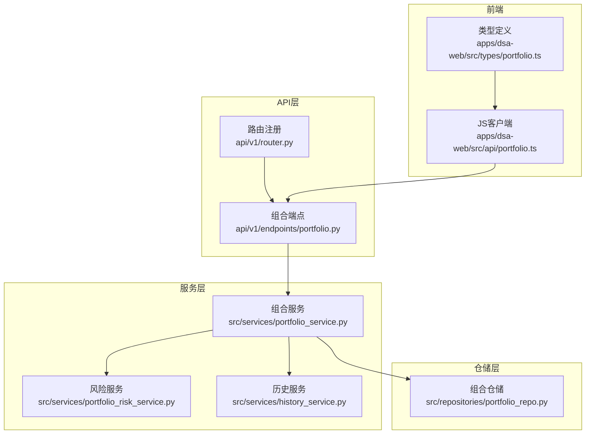
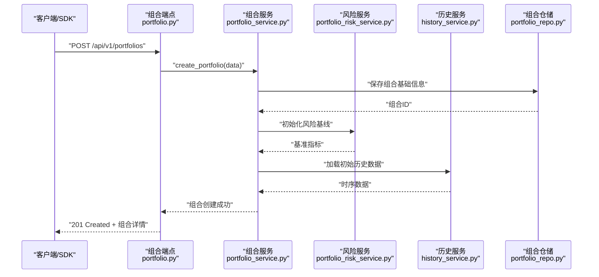
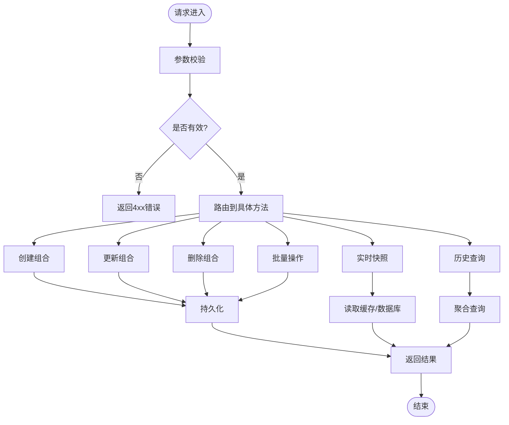
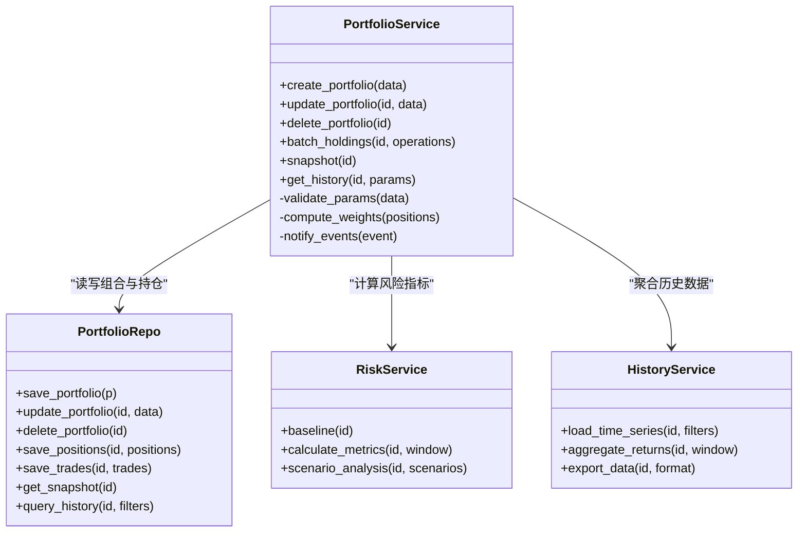
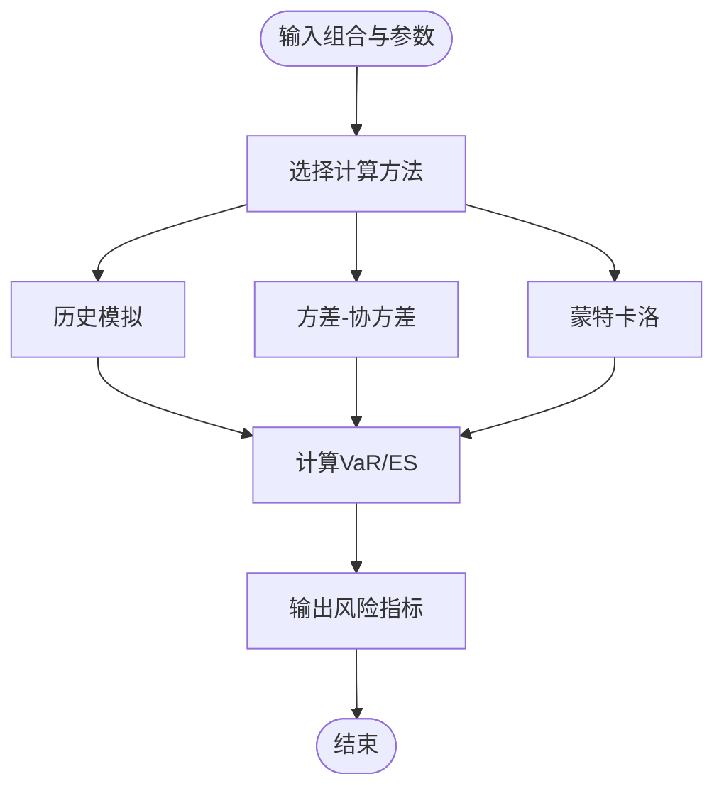
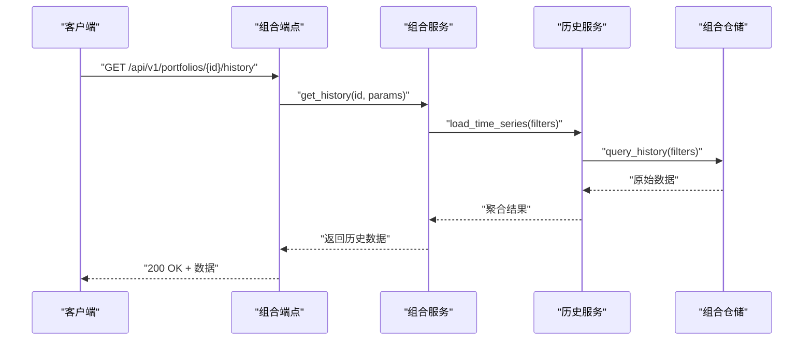
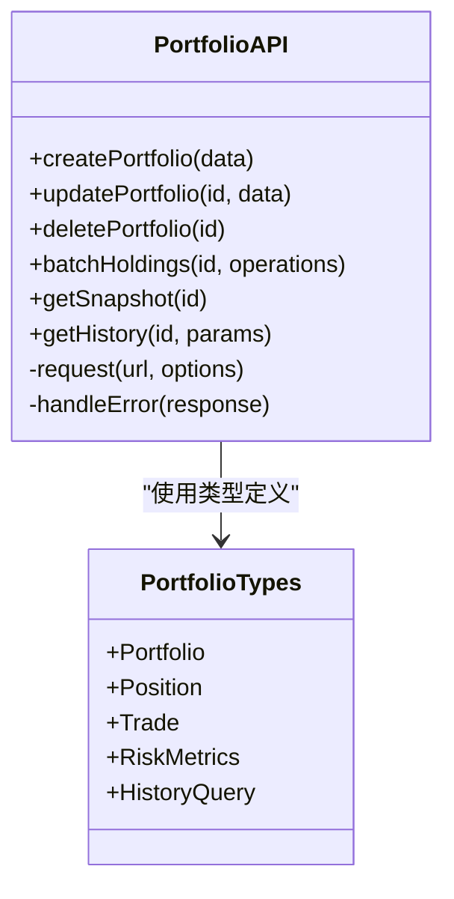
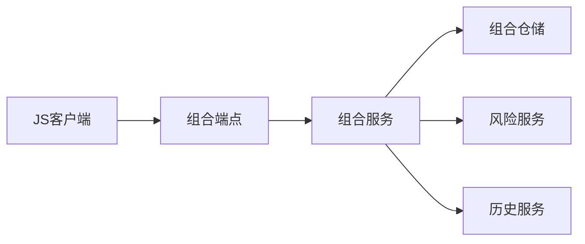

# 组合管理API示例

<cite>
**本文档引用的文件**   
- [api/v1/endpoints/portfolio.py](file://api/v1/endpoints/portfolio.py)
- [api/v1/schemas/portfolio.py](file://api/v1/schemas/portfolio.py)
- [src/services/portfolio_service.py](file://src/services/portfolio_service.py)
- [src/repositories/portfolio_repo.py](file://src/repositories/portfolio_repo.py)
- [src/services/portfolio_risk_service.py](file://src/services/portfolio_risk_service.py)
- [src/services/history_service.py](file://src/services/history_service.py)
- [api/app.py](file://api/app.py)
- [api/v1/router.py](file://api/v1/router.py)
- [apps/dsa-web/src/api/portfolio.ts](file://apps/dsa-web/src/api/portfolio.ts)
- [apps/dsa-web/src/types/portfolio.ts](file://apps/dsa-web/src/types/portfolio.ts)
</cite>

## 目录
1. [简介](#简介)
2. [项目结构](#项目结构)
3. [核心组件](#核心组件)
4. [架构总览](#架构总览)
5. [详细组件分析](#详细组件分析)
6. [依赖关系分析](#依赖关系分析)
7. [性能考虑](#性能考虑)
8. [故障排查指南](#故障排查指南)
9. [结论](#结论)
10. [附录：API调用示例与数据结构](#附录api调用示例与数据结构)

## 简介
本文件面向使用“组合管理”能力的开发者，提供投资组合创建、持仓管理、风险评估、收益分析等功能的接口使用方法。文档包含：
- 完整的组合数据模型与交易记录格式
- 批量操作、实时监控、历史数据查询的高级用法
- Python SDK、JavaScript客户端与curl命令的多种调用方式
- 常见错误处理与性能优化建议

## 项目结构
后端采用FastAPI模块化设计，路由定义在v1下，业务逻辑通过服务层封装，数据访问由仓储层实现；前端Web应用通过独立的API客户端模块调用后端接口。

**图表来源** 
- [api/v1/router.py](file://api/v1/router.py)
- [api/v1/endpoints/portfolio.py](file://api/v1/endpoints/portfolio.py)
- [src/services/portfolio_service.py](file://src/services/portfolio_service.py)
- [src/repositories/portfolio_repo.py](file://src/repositories/portfolio_repo.py)
- [src/services/portfolio_risk_service.py](file://src/services/portfolio_risk_service.py)
- [src/services/history_service.py](file://src/services/history_service.py)
- [apps/dsa-web/src/api/portfolio.ts](file://apps/dsa-web/src/api/portfolio.ts)
- [apps/dsa-web/src/types/portfolio.ts](file://apps/dsa-web/src/types/portfolio.ts)

**章节来源**
- [api/v1/router.py](file://api/v1/router.py)
- [api/v1/endpoints/portfolio.py](file://api/v1/endpoints/portfolio.py)
- [src/services/portfolio_service.py](file://src/services/portfolio_service.py)
- [src/repositories/portfolio_repo.py](file://src/repositories/portfolio_repo.py)
- [src/services/portfolio_risk_service.py](file://src/services/portfolio_risk_service.py)
- [src/services/history_service.py](file://src/services/history_service.py)
- [apps/dsa-web/src/api/portfolio.ts](file://apps/dsa-web/src/api/portfolio.ts)
- [apps/dsa-web/src/types/portfolio.ts](file://apps/dsa-web/src/types/portfolio.ts)

## 核心组件
- 组合端点（Portfolio Endpoints）：暴露REST接口，负责参数校验、权限控制、请求分发与响应格式化。
- 组合服务（Portfolio Service）：编排组合生命周期、持仓变更、批量操作、快照生成与事件通知。
- 风险服务（Risk Service）：计算VaR、回撤、波动率、相关性等指标，支持多因子与情景分析。
- 历史服务（History Service）：聚合行情与成交数据，提供时间序列查询与回测数据导出。
- 组合仓储（Portfolio Repo）：持久化组合、持仓、交易记录与快照，保证事务一致性。
- 前端JS客户端：封装HTTP调用、错误处理与类型安全的数据模型。

**章节来源**
- [api/v1/endpoints/portfolio.py](file://api/v1/endpoints/portfolio.py)
- [src/services/portfolio_service.py](file://src/services/portfolio_service.py)
- [src/services/portfolio_risk_service.py](file://src/services/portfolio_risk_service.py)
- [src/services/history_service.py](file://src/services/history_service.py)
- [src/repositories/portfolio_repo.py](file://src/repositories/portfolio_repo.py)
- [apps/dsa-web/src/api/portfolio.ts](file://apps/dsa-web/src/api/portfolio.ts)

## 架构总览
组合管理的请求从前端或外部系统进入API网关，经路由分发到组合端点，再由服务层协调风险与历史服务完成计算与数据聚合，最终通过仓储层进行持久化并返回结果。

**图表来源** 
- [api/v1/endpoints/portfolio.py](file://api/v1/endpoints/portfolio.py)
- [src/services/portfolio_service.py](file://src/services/portfolio_service.py)
- [src/services/portfolio_risk_service.py](file://src/services/portfolio_risk_service.py)
- [src/services/history_service.py](file://src/services/history_service.py)
- [src/repositories/portfolio_repo.py](file://src/repositories/portfolio_repo.py)

## 详细组件分析

### 组合端点（Portfolio Endpoints）
- 职责：接收HTTP请求，校验入参，调用服务层方法，返回标准JSON响应。
- 关键能力：
  - 创建组合：校验名称、策略、币种范围、风控阈值等。
  - 更新组合：增量更新字段，保留审计日志。
  - 删除组合：软删除并清理关联缓存。
  - 批量操作：批量添加/移除持仓，支持幂等键与重试。
  - 实时快照：按组合ID获取最新净值、权重与风险指标。
  - 历史查询：按时间窗口、标的维度拉取净值曲线与交易明细。

**图表来源** 
- [api/v1/endpoints/portfolio.py](file://api/v1/endpoints/portfolio.py)

**章节来源**
- [api/v1/endpoints/portfolio.py](file://api/v1/endpoints/portfolio.py)

### 组合服务（Portfolio Service）
- 职责：编排组合生命周期、持仓变更、批量操作、快照生成与事件通知。
- 关键能力：
  - 组合创建：生成唯一ID、初始化默认配置、写入审计日志。
  - 持仓管理：买入/卖出/调仓，支持分批提交与补偿机制。
  - 批量操作：批量指令合并、去重、冲突检测与回滚。
  - 快照生成：计算权重、净值、收益与风险指标，异步落盘。
  - 事件通知：推送组合状态变化至消息队列或订阅通道。

**图表来源** 
- [src/services/portfolio_service.py](file://src/services/portfolio_service.py)
- [src/repositories/portfolio_repo.py](file://src/repositories/portfolio_repo.py)
- [src/services/portfolio_risk_service.py](file://src/services/portfolio_risk_service.py)
- [src/services/history_service.py](file://src/services/history_service.py)

**章节来源**
- [src/services/portfolio_service.py](file://src/services/portfolio_service.py)
- [src/repositories/portfolio_repo.py](file://src/repositories/portfolio_repo.py)
- [src/services/portfolio_risk_service.py](file://src/services/portfolio_risk_service.py)
- [src/services/history_service.py](file://src/services/history_service.py)

### 风险服务（Risk Service）
- 职责：计算组合风险指标，支持多因子与情景分析。
- 关键能力：
  - VaR计算：基于历史模拟、方差-协方差与蒙特卡洛方法。
  - 回撤分析：最大回撤、平均回撤与回撤持续时间。
  - 波动率估计：滚动窗口、GARCH族模型。
  - 相关性矩阵：资产间相关性与稳定性评估。
  - 情景分析：压力测试与极端市场假设。

**图表来源** 
- [src/services/portfolio_risk_service.py](file://src/services/portfolio_risk_service.py)

**章节来源**
- [src/services/portfolio_risk_service.py](file://src/services/portfolio_risk_service.py)

### 历史服务（History Service）
- 职责：聚合行情与成交数据，提供时间序列查询与回测数据导出。
- 关键能力：
  - 时间序列加载：按标的、时间窗口、频率加载K线与分钟线。
  - 收益聚合：日度/周度/月度收益率与累计收益。
  - 数据导出：CSV/Parquet格式导出，支持分片下载。

**图表来源** 
- [api/v1/endpoints/portfolio.py](file://api/v1/endpoints/portfolio.py)
- [src/services/portfolio_service.py](file://src/services/portfolio_service.py)
- [src/services/history_service.py](file://src/services/history_service.py)
- [src/repositories/portfolio_repo.py](file://src/repositories/portfolio_repo.py)

**章节来源**
- [src/services/history_service.py](file://src/services/history_service.py)

### 前端JS客户端（Portfolio API Client）
- 职责：封装HTTP调用、错误处理与类型安全的数据模型。
- 关键能力：
  - 组合CRUD：创建、更新、删除组合。
  - 持仓操作：批量买入/卖出、调仓。
  - 风险查询：获取VaR、回撤、波动率等指标。
  - 历史查询：按时间窗口与标的维度拉取数据。

**图表来源** 
- [apps/dsa-web/src/api/portfolio.ts](file://apps/dsa-web/src/api/portfolio.ts)
- [apps/dsa-web/src/types/portfolio.ts](file://apps/dsa-web/src/types/portfolio.ts)

**章节来源**
- [apps/dsa-web/src/api/portfolio.ts](file://apps/dsa-web/src/api/portfolio.ts)
- [apps/dsa-web/src/types/portfolio.ts](file://apps/dsa-web/src/types/portfolio.ts)

## 依赖关系分析
- 组件耦合：
  - 组合端点依赖组合服务，服务依赖仓储与风险/历史服务。
  - 前端JS客户端直接调用组合端点，类型定义确保前后端契约一致。
- 外部依赖：
  - 数据存储：组合、持仓、交易记录与快照持久化。
  - 风险引擎：数值计算库与统计模型。
  - 历史数据源：行情与成交数据提供者。

**图表来源** 
- [api/v1/endpoints/portfolio.py](file://api/v1/endpoints/portfolio.py)
- [src/services/portfolio_service.py](file://src/services/portfolio_service.py)
- [src/repositories/portfolio_repo.py](file://src/repositories/portfolio_repo.py)
- [src/services/portfolio_risk_service.py](file://src/services/portfolio_risk_service.py)
- [src/services/history_service.py](file://src/services/history_service.py)
- [apps/dsa-web/src/api/portfolio.ts](file://apps/dsa-web/src/api/portfolio.ts)

**章节来源**
- [api/v1/endpoints/portfolio.py](file://api/v1/endpoints/portfolio.py)
- [src/services/portfolio_service.py](file://src/services/portfolio_service.py)
- [src/repositories/portfolio_repo.py](file://src/repositories/portfolio_repo.py)
- [src/services/portfolio_risk_service.py](file://src/services/portfolio_risk_service.py)
- [src/services/history_service.py](file://src/services/history_service.py)
- [apps/dsa-web/src/api/portfolio.ts](file://apps/dsa-web/src/api/portfolio.ts)

## 性能考虑
- 批量操作：合并多个持仓变更为单次事务，减少锁竞争与网络往返。
- 缓存策略：对热点快照与风险指标设置TTL缓存，降低数据库压力。
- 异步处理：耗时计算（如蒙特卡洛模拟）放入任务队列，避免阻塞主线程。
- 分页与限流：历史查询支持分页与速率限制，防止大查询导致超时。
- 连接池：数据库与外部数据源使用连接池，提升并发处理能力。

[本节为通用指导，不直接分析具体文件]

## 故障排查指南
- 常见错误：
  - 参数校验失败：检查必填字段、数据类型与取值范围。
  - 权限不足：确认用户角色与组合访问权限。
  - 数据不一致：检查持仓与交易记录的原子性，必要时回滚。
  - 外部依赖超时：重试机制与降级策略，监控外部服务健康状态。
- 调试建议：
  - 启用详细日志，记录请求ID与关键步骤。
  - 使用健康检查端点验证服务可用性。
  - 对高风险操作开启审计日志与告警。

**章节来源**
- [api/v1/endpoints/portfolio.py](file://api/v1/endpoints/portfolio.py)
- [src/services/portfolio_service.py](file://src/services/portfolio_service.py)

## 结论
本组合管理API提供了完整的组合生命周期管理能力，涵盖创建、持仓管理、风险评估与收益分析。通过清晰的分层架构与类型安全的客户端，开发者可快速集成并扩展功能。建议在生产环境中启用缓存、异步处理与监控告警，以提升性能与可靠性。

[本节为总结，不直接分析具体文件]

## 附录：API调用示例与数据结构

### 组合数据模型
- 组合（Portfolio）：
  - 字段：组合ID、名称、策略、币种范围、风控阈值、创建时间、更新时间。
  - 约束：名称唯一，风控阈值为正数。
- 持仓（Position）：
  - 字段：标的代码、数量、成本价、当前价、市值、权重。
  - 约束：数量为正，权重总和为1。
- 交易记录（Trade）：
  - 字段：交易ID、组合ID、标的代码、方向（买入/卖出）、数量、价格、手续费、时间戳。
  - 约束：数量为正，价格为正，方向合法。

**章节来源**
- [api/v1/schemas/portfolio.py](file://api/v1/schemas/portfolio.py)
- [apps/dsa-web/src/types/portfolio.ts](file://apps/dsa-web/src/types/portfolio.ts)

### 风险评估参数
- VaR方法：历史模拟、方差-协方差、蒙特卡洛。
- 置信水平：95%、99%。
- 时间窗口：1天、5天、20天。
- 情景分析：压力测试场景（如市场暴跌、利率上升）。

**章节来源**
- [src/services/portfolio_risk_service.py](file://src/services/portfolio_risk_service.py)

### 历史数据查询参数
- 时间范围：开始时间、结束时间。
- 频率：日度、周度、月度。
- 标的过滤：单个或多个标的代码。
- 导出格式：CSV、Parquet。

**章节来源**
- [src/services/history_service.py](file://src/services/history_service.py)

### curl命令示例
- 创建组合：
  - 方法：POST
  - 路径：/api/v1/portfolios
  - 请求体：组合数据（名称、策略、风控阈值等）
  - 响应：组合详情（ID、状态、创建时间）
- 批量添加持仓：
  - 方法：POST
  - 路径：/api/v1/portfolios/{id}/positions/batch
  - 请求体：持仓操作列表（标的、方向、数量、价格）
  - 响应：操作结果（成功/失败列表）
- 查询历史数据：
  - 方法：GET
  - 路径：/api/v1/portfolios/{id}/history
  - 查询参数：时间范围、频率、标的过滤
  - 响应：时间序列数据（净值、收益、成交量）

**章节来源**
- [api/v1/endpoints/portfolio.py](file://api/v1/endpoints/portfolio.py)

### Python SDK示例
- 初始化客户端：
  - 配置：Base URL、认证令牌、超时设置。
- 创建组合：
  - 方法：client.portfolios.create(data)
  - 参数：组合数据字典
  - 返回：组合对象
- 批量操作：
  - 方法：client.portfolios.batch_holdings(id, operations)
  - 参数：组合ID与操作列表
  - 返回：操作结果
- 风险查询：
  - 方法：client.risk.calculate_metrics(id, window)
  - 参数：组合ID与时间窗口
  - 返回：风险指标（VaR、回撤、波动率）

**章节来源**
- [src/services/portfolio_service.py](file://src/services/portfolio_service.py)
- [src/services/portfolio_risk_service.py](file://src/services/portfolio_risk_service.py)

### JavaScript客户端示例
- 导入客户端：
  - import { PortfolioAPI } from './api/portfolio'
- 创建组合：
  - const portfolio = await PortfolioAPI.createPortfolio(data)
- 批量持仓：
  - const result = await PortfolioAPI.batchHoldings(id, operations)
- 历史查询：
  - const history = await PortfolioAPI.getHistory(id, params)

**章节来源**
- [apps/dsa-web/src/api/portfolio.ts](file://apps/dsa-web/src/api/portfolio.ts)
- [apps/dsa-web/src/types/portfolio.ts](file://apps/dsa-web/src/types/portfolio.ts)