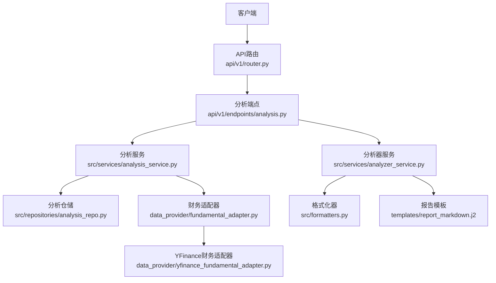
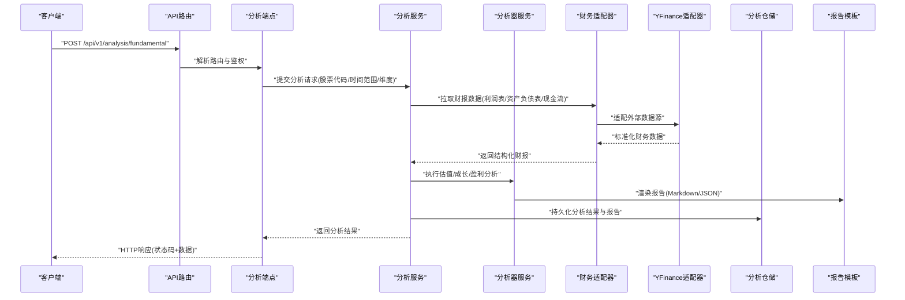
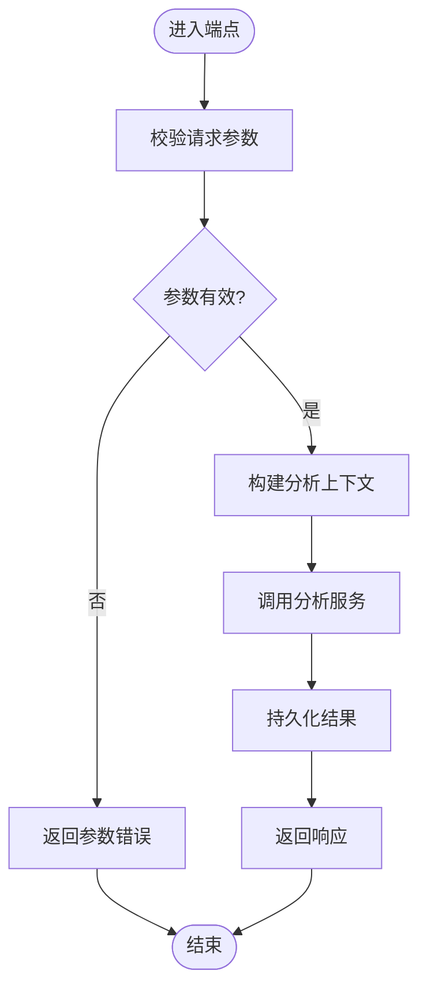
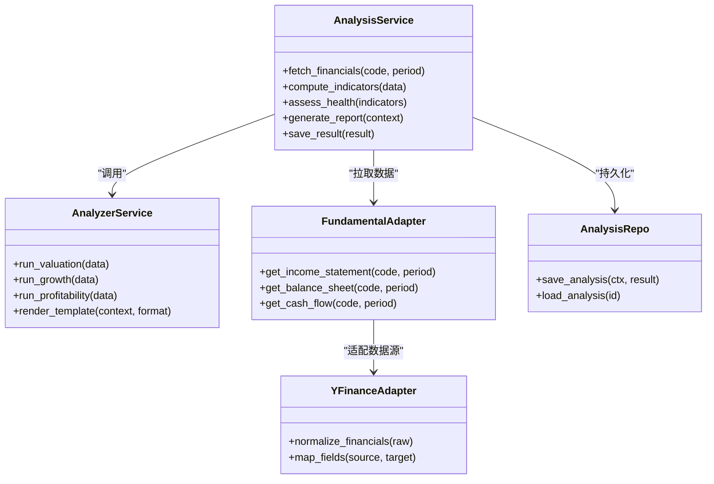
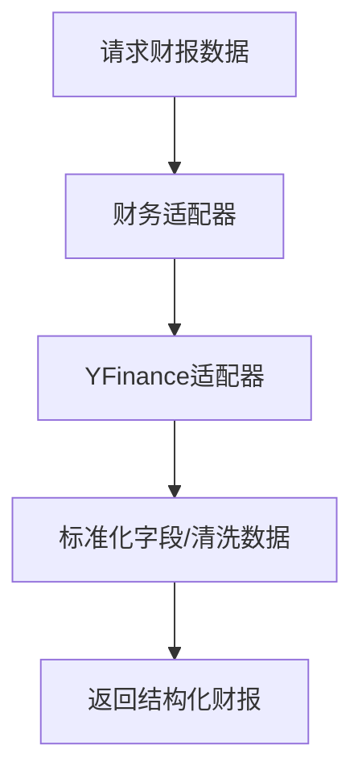
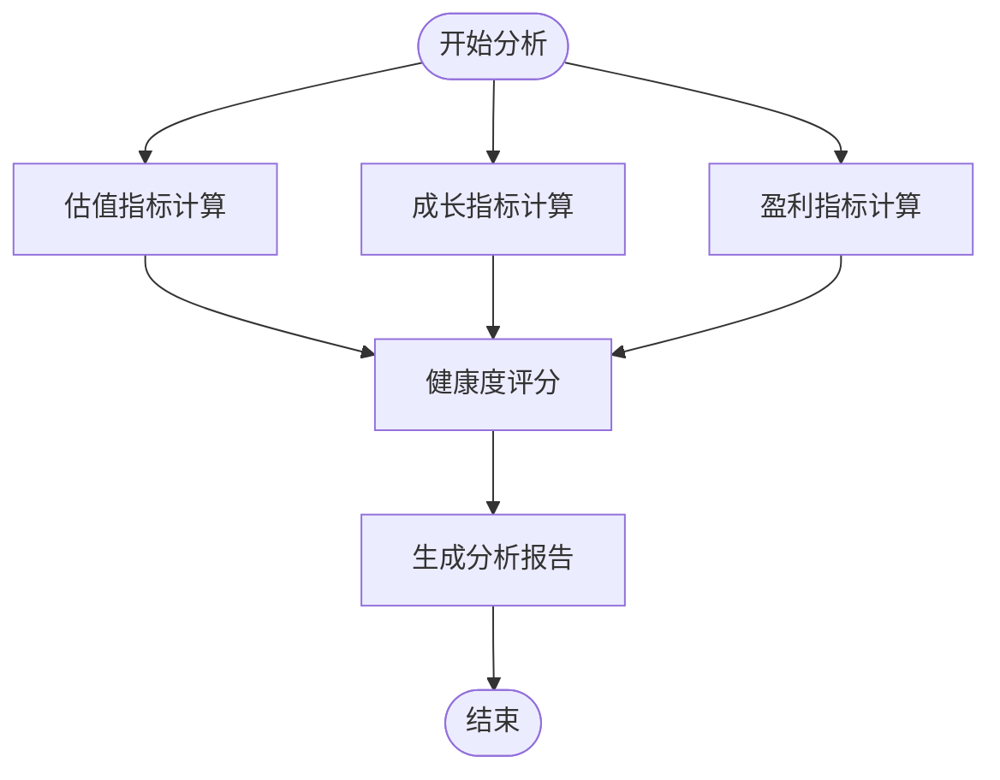
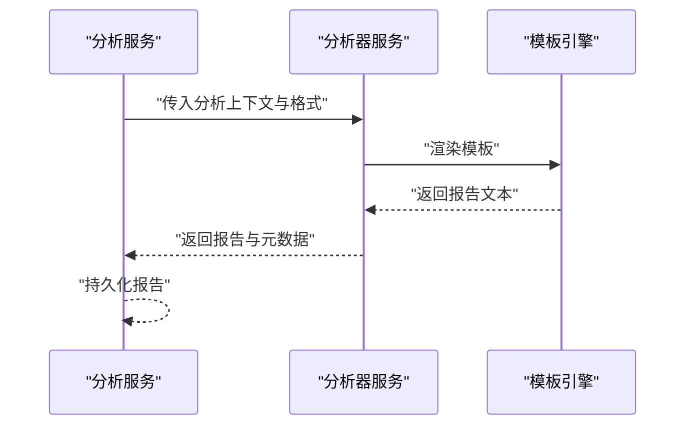
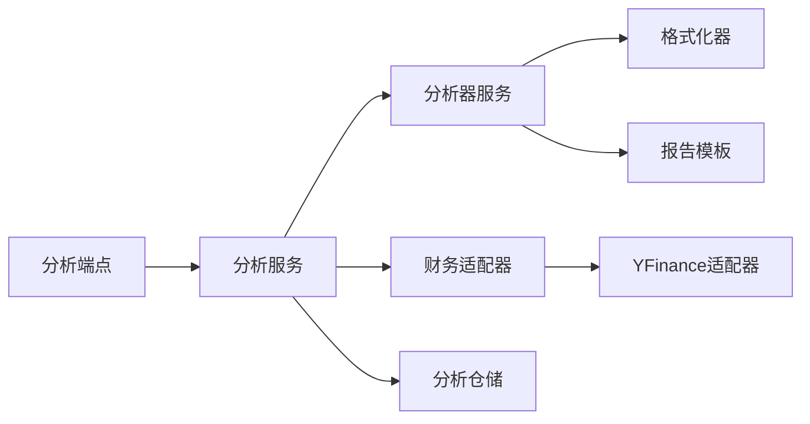

# 基本面分析示例

<cite>
**本文引用的文件**   
- [api/v1/router.py](file://api/v1/router.py)
- [api/v1/endpoints/analysis.py](file://api/v1/endpoints/analysis.py)
- [api/v1/schemas/analysis.py](file://api/v1/schemas/analysis.py)
- [data_provider/fundamental_adapter.py](file://data_provider/fundamental_adapter.py)
- [data_provider/yfinance_fundamental_adapter.py](file://data_provider/yfinance_fundamental_adapter.py)
- [src/services/analysis_service.py](file://src/services/analysis_service.py)
- [src/services/analyzer_service.py](file://src/services/analyzer_service.py)
- [src/repositories/analysis_repo.py](file://src/repositories/analysis_repo.py)
- [src/formatters.py](file://src/formatters.py)
- [templates/report_markdown.j2](file://templates/report_markdown.j2)
</cite>

## 目录
1. [简介](#简介)
2. [项目结构](#项目结构)
3. [核心组件](#核心组件)
4. [架构总览](#架构总览)
5. [详细组件分析](#详细组件分析)
6. [依赖关系分析](#依赖关系分析)
7. [性能考虑](#性能考虑)
8. [故障排查指南](#故障排查指南)
9. [结论](#结论)
10. [附录](#附录)

## 简介
本文件面向使用“基本面分析API”的开发者与分析师，提供从财务报表数据获取、估值指标计算到财务健康度评估的一站式调用示例。文档涵盖：
- 接口使用方法与参数说明（筛选条件、分析维度、报告生成）
- 企业价值评估、成长性分析、盈利能力分析的实战案例
- 数据流与处理逻辑、错误处理与性能优化建议

## 项目结构
本项目采用分层架构：API层暴露REST接口，服务层编排业务逻辑，数据提供者负责拉取并标准化财务数据，仓储层持久化分析结果，模板层渲染报告。

**图表来源** 
- [api/v1/router.py](file://api/v1/router.py)
- [api/v1/endpoints/analysis.py](file://api/v1/endpoints/analysis.py)
- [src/services/analysis_service.py](file://src/services/analysis_service.py)
- [src/services/analyzer_service.py](file://src/services/analyzer_service.py)
- [data_provider/fundamental_adapter.py](file://data_provider/fundamental_adapter.py)
- [data_provider/yfinance_fundamental_adapter.py](file://data_provider/yfinance_fundamental_adapter.py)
- [src/repositories/analysis_repo.py](file://src/repositories/analysis_repo.py)
- [src/formatters.py](file://src/formatters.py)
- [templates/report_markdown.j2](file://templates/report_markdown.j2)

**章节来源**
- [api/v1/router.py](file://api/v1/router.py)
- [api/v1/endpoints/analysis.py](file://api/v1/endpoints/analysis.py)

## 核心组件
- 分析端点：接收请求、校验参数、调度服务层完成基本面分析与报告生成。
- 分析服务：协调数据拉取、指标计算、健康度评分与结果持久化。
- 分析器服务：执行具体分析任务（估值、成长、盈利等），调用格式化器与模板渲染报告。
- 财务适配器：统一抽象不同数据源的财报数据获取与标准化。
- 分析仓储：保存分析上下文、指标结果与报告元数据。
- 格式化器与模板：将结构化指标转换为可读的报告内容。

**章节来源**
- [api/v1/endpoints/analysis.py](file://api/v1/endpoints/analysis.py)
- [src/services/analysis_service.py](file://src/services/analysis_service.py)
- [src/services/analyzer_service.py](file://src/services/analyzer_service.py)
- [data_provider/fundamental_adapter.py](file://data_provider/fundamental_adapter.py)
- [data_provider/yfinance_fundamental_adapter.py](file://data_provider/yfinance_fundamental_adapter.py)
- [src/repositories/analysis_repo.py](file://src/repositories/analysis_repo.py)
- [src/formatters.py](file://src/formatters.py)
- [templates/report_markdown.j2](file://templates/report_markdown.j2)

## 架构总览
下图展示一次基本面分析请求的端到端流程：客户端通过API发起请求，路由分发至分析端点，服务层组合数据源与分析器，最终输出结构化结果与报告。

**图表来源** 
- [api/v1/router.py](file://api/v1/router.py)
- [api/v1/endpoints/analysis.py](file://api/v1/endpoints/analysis.py)
- [src/services/analysis_service.py](file://src/services/analysis_service.py)
- [src/services/analyzer_service.py](file://src/services/analyzer_service.py)
- [data_provider/fundamental_adapter.py](file://data_provider/fundamental_adapter.py)
- [data_provider/yfinance_fundamental_adapter.py](file://data_provider/yfinance_fundamental_adapter.py)
- [src/repositories/analysis_repo.py](file://src/repositories/analysis_repo.py)
- [templates/report_markdown.j2](file://templates/report_markdown.j2)

## 详细组件分析

### 分析端点与请求模型
- 功能：接收基本面分析请求，校验输入参数（如股票代码、时间范围、分析维度），调用分析服务并返回结果。
- 关键参数：
  - 筛选条件：股票代码、报告期起止、行业/板块过滤、数据质量阈值
  - 分析维度：估值（PE/PB/EV/EBITDA）、成长（营收/净利增速、ROIC）、盈利（毛利率/净利率/ROE）
  - 报告生成：语言、格式（Markdown/JSON）、是否包含历史对比
- 典型流程：参数校验→构建分析上下文→调用服务→持久化→响应

**图表来源** 
- [api/v1/endpoints/analysis.py](file://api/v1/endpoints/analysis.py)
- [api/v1/schemas/analysis.py](file://api/v1/schemas/analysis.py)

**章节来源**
- [api/v1/endpoints/analysis.py](file://api/v1/endpoints/analysis.py)
- [api/v1/schemas/analysis.py](file://api/v1/schemas/analysis.py)

### 分析服务与服务编排
- 功能：编排数据拉取、指标计算、健康度评分与报告生成；管理并发与重试；聚合多源数据。
- 关键职责：
  - 数据拉取：通过财务适配器获取利润表、资产负债表、现金流
  - 指标计算：估值、成长、盈利与健康度评分
  - 报告生成：调用分析器服务与模板渲染
  - 持久化：保存分析结果与报告元数据

**图表来源** 
- [src/services/analysis_service.py](file://src/services/analysis_service.py)
- [src/services/analyzer_service.py](file://src/services/analyzer_service.py)
- [data_provider/fundamental_adapter.py](file://data_provider/fundamental_adapter.py)
- [data_provider/yfinance_fundamental_adapter.py](file://data_provider/yfinance_fundamental_adapter.py)
- [src/repositories/analysis_repo.py](file://src/repositories/analysis_repo.py)

**章节来源**
- [src/services/analysis_service.py](file://src/services/analysis_service.py)
- [src/services/analyzer_service.py](file://src/services/analyzer_service.py)
- [data_provider/fundamental_adapter.py](file://data_provider/fundamental_adapter.py)
- [data_provider/yfinance_fundamental_adapter.py](file://data_provider/yfinance_fundamental_adapter.py)
- [src/repositories/analysis_repo.py](file://src/repositories/analysis_repo.py)

### 财务数据获取与标准化
- 财务适配器：统一对外暴露利润表、资产负债表、现金流接口，屏蔽底层数据源差异。
- YFinance适配器：将原始数据映射为内部标准字段，处理缺失值与异常值。
- 数据质量：支持阈值过滤、时间对齐、单位换算。

**图表来源** 
- [data_provider/fundamental_adapter.py](file://data_provider/fundamental_adapter.py)
- [data_provider/yfinance_fundamental_adapter.py](file://data_provider/yfinance_fundamental_adapter.py)

**章节来源**
- [data_provider/fundamental_adapter.py](file://data_provider/fundamental_adapter.py)
- [data_provider/yfinance_fundamental_adapter.py](file://data_provider/yfinance_fundamental_adapter.py)

### 估值、成长与盈利分析
- 估值分析：基于PE、PB、EV/EBITDA等指标进行相对与绝对估值判断。
- 成长性分析：营收与净利润复合增速、ROIC趋势、资本开支效率。
- 盈利能力分析：毛利率、净利率、ROE分解与同业对比。
- 健康度评估：流动性、杠杆、现金流覆盖与盈利稳定性综合评分。

**图表来源** 
- [src/services/analyzer_service.py](file://src/services/analyzer_service.py)
- [src/formatters.py](file://src/formatters.py)
- [templates/report_markdown.j2](file://templates/report_markdown.j2)

**章节来源**
- [src/services/analyzer_service.py](file://src/services/analyzer_service.py)
- [src/formatters.py](file://src/formatters.py)
- [templates/report_markdown.j2](file://templates/report_markdown.j2)

### 报告生成与输出
- 报告格式：支持Markdown与JSON，可配置语言与是否包含历史对比。
- 模板渲染：根据分析上下文填充模板，生成可读性强的报告。
- 输出位置：服务端存储与API响应均可返回报告内容。

**图表来源** 
- [src/services/analyzer_service.py](file://src/services/analyzer_service.py)
- [src/formatters.py](file://src/formatters.py)
- [templates/report_markdown.j2](file://templates/report_markdown.j2)

**章节来源**
- [src/services/analyzer_service.py](file://src/services/analyzer_service.py)
- [src/formatters.py](file://src/formatters.py)
- [templates/report_markdown.j2](file://templates/report_markdown.j2)

## 依赖关系分析
- 低耦合：端点仅负责参数校验与调度，服务层专注业务编排，数据提供者与仓储独立。
- 可扩展：新增数据源只需实现适配器接口；新增分析维度可在分析器服务中扩展。
- 潜在风险：数据源不稳定可能导致拉取失败，需增加重试与降级策略。

**图表来源** 
- [api/v1/endpoints/analysis.py](file://api/v1/endpoints/analysis.py)
- [src/services/analysis_service.py](file://src/services/analysis_service.py)
- [src/services/analyzer_service.py](file://src/services/analyzer_service.py)
- [data_provider/fundamental_adapter.py](file://data_provider/fundamental_adapter.py)
- [data_provider/yfinance_fundamental_adapter.py](file://data_provider/yfinance_fundamental_adapter.py)
- [src/repositories/analysis_repo.py](file://src/repositories/analysis_repo.py)
- [src/formatters.py](file://src/formatters.py)
- [templates/report_markdown.j2](file://templates/report_markdown.j2)

**章节来源**
- [api/v1/endpoints/analysis.py](file://api/v1/endpoints/analysis.py)
- [src/services/analysis_service.py](file://src/services/analysis_service.py)
- [src/services/analyzer_service.py](file://src/services/analyzer_service.py)
- [data_provider/fundamental_adapter.py](file://data_provider/fundamental_adapter.py)
- [data_provider/yfinance_fundamental_adapter.py](file://data_provider/yfinance_fundamental_adapter.py)
- [src/repositories/analysis_repo.py](file://src/repositories/analysis_repo.py)
- [src/formatters.py](file://src/formatters.py)
- [templates/report_markdown.j2](file://templates/report_markdown.j2)

## 性能考虑
- 数据拉取：对高频数据源启用缓存与限流，避免重复请求。
- 并发处理：并行拉取多期财报与多指标计算，缩短响应时间。
- 内存管理：大报表数据分块处理，避免一次性加载过多对象。
- 超时与重试：设置合理超时与指数退避重试，提升鲁棒性。

[本节为通用指导，不直接分析具体文件]

## 故障排查指南
- 常见错误：
  - 参数校验失败：检查股票代码、时间范围与分析维度是否符合规范
  - 数据源不可用：确认网络连通性与数据源配额，必要时切换备用源
  - 指标计算异常：检查数据缺失与异常值，调整清洗规则
  - 报告渲染失败：验证模板变量与格式配置
- 定位方法：
  - 查看端点日志与错误处理器输出
  - 检查仓储写入是否成功
  - 使用最小化请求复现问题

**章节来源**
- [api/v1/endpoints/analysis.py](file://api/v1/endpoints/analysis.py)
- [src/repositories/analysis_repo.py](file://src/repositories/analysis_repo.py)

## 结论
本API提供了完整的基本面分析能力，覆盖数据获取、指标计算、健康度评估与报告生成。通过清晰的层次结构与可扩展的适配器设计，用户可快速集成并定制分析维度与报告格式。建议在生产环境中加强数据源容错与性能优化，确保稳定高效的分析体验。

[本节为总结，不直接分析具体文件]

## 附录
- 调用示例（概念性步骤）：
  - 准备请求参数：股票代码、报告期起止、分析维度（估值/成长/盈利）、报告格式
  - 发送HTTP请求至分析端点
  - 解析响应：获取指标结果与报告内容
  - 可选：查询历史分析结果或导出报告
- 最佳实践：
  - 批量请求时合并时间范围以减少重复拉取
  - 对关键指标设置阈值告警
  - 定期更新数据源适配器的字段映射

[本节为补充信息，不直接分析具体文件]