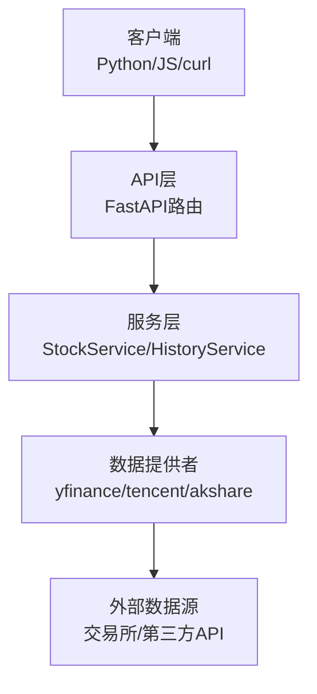
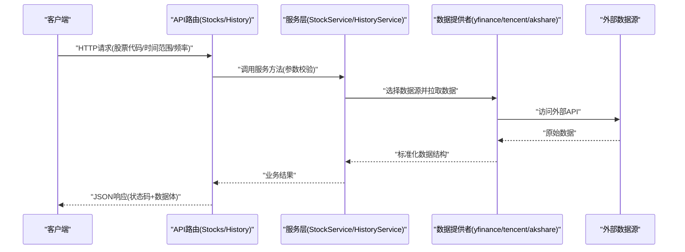
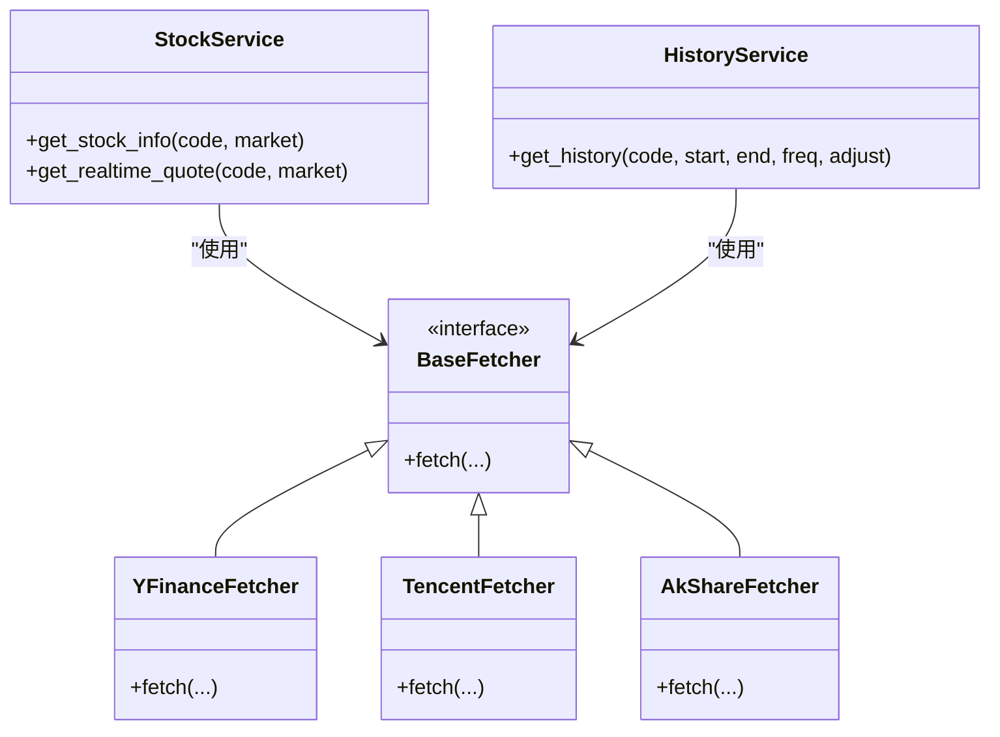

# 基础股票分析示例

<cite>
**本文档引用的文件**   
- [api/v1/endpoints/stocks.py](file://api/v1/endpoints/stocks.py)
- [api/v1/endpoints/history.py](file://api/v1/endpoints/history.py)
- [api/v1/schemas/stocks.py](file://api/v1/schemas/stocks.py)
- [api/v1/schemas/history.py](file://api/v1/schemas/history.py)
- [api/app.py](file://api/app.py)
- [src/services/stock_service.py](file://src/services/stock_service.py)
- [data_provider/base.py](file://data_provider/base.py)
- [data_provider/yfinance_fetcher.py](file://data_provider/yfinance_fetcher.py)
- [data_provider/tencent_fetcher.py](file://data_provider/tencent_fetcher.py)
- [data_provider/akshare_fetcher.py](file://data_provider/akshare_fetcher.py)
- [data_provider/realtime_types.py](file://data_provider/realtime_types.py)
- [src/utils/timeframe.py](file://src/utils/timeframe.py)
- [src/services/history_service.py](file://src/services/history_service.py)
</cite>

## 目录
1. [简介](#简介)
2. [项目结构](#项目结构)
3. [核心组件](#核心组件)
4. [架构总览](#架构总览)
5. [详细组件分析](#详细组件分析)
6. [依赖关系分析](#依赖关系分析)
7. [性能注意事项](#性能注意事项)
8. [故障排查指南](#故障排查指南)
9. [结论](#结论)
10. [附录：API调用示例](#附录api调用示例)

## 简介
本示例文档面向希望快速上手“基础股票分析API”的开发者，聚焦以下核心能力：
- 个股基本信息查询
- 实时行情获取（价格、涨跌幅、成交量等）
- 历史数据查询（按时间范围与频率拉取K线或日频数据）

文档提供完整的请求参数说明、响应数据格式，并给出Python SDK、JavaScript客户端与curl命令的实际调用示例，帮助读者快速验证接口可用性。

## 项目结构
本项目采用分层设计：
- API层：FastAPI路由与Pydantic模型定义，负责HTTP入参校验与出参序列化
- 服务层：业务编排与领域逻辑
- 数据提供者：多源数据抓取与标准化（如yfinance、tencent、akshare等）
- 工具与配置：时间粒度、错误处理、鉴权中间件等

图表来源
- [api/app.py:1-200](file://api/app.py#L1-L200)
- [api/v1/endpoints/stocks.py:1-200](file://api/v1/endpoints/stocks.py#L1-L200)
- [api/v1/endpoints/history.py:1-200](file://api/v1/endpoints/history.py#L1-L200)
- [src/services/stock_service.py:1-200](file://src/services/stock_service.py#L1-L200)
- [src/services/history_service.py:1-200](file://src/services/history_service.py#L1-L200)

章节来源
- [api/app.py:1-200](file://api/app.py#L1-L200)
- [api/v1/router.py:1-200](file://api/v1/router.py#L1-L200)

## 核心组件
- 股票信息接口：用于获取个股基本信息（名称、代码、市场、行业等）
- 实时行情接口：返回最新价、涨跌额、涨跌幅、成交量、成交额等
- 历史数据接口：支持按起止时间与频率（日/周/月等）获取历史K线或日频数据

关键实现位置：
- 路由与模型：[api/v1/endpoints/stocks.py](file://api/v1/endpoints/stocks.py)、[api/v1/schemas/stocks.py](file://api/v1/schemas/stocks.py)
- 历史数据路由与模型：[api/v1/endpoints/history.py](file://api/v1/endpoints/history.py)、[api/v1/schemas/history.py](file://api/v1/schemas/history.py)
- 服务层：[src/services/stock_service.py](file://src/services/stock_service.py)、[src/services/history_service.py](file://src/services/history_service.py)
- 数据提供者抽象与实现：[data_provider/base.py](file://data_provider/base.py)、[data_provider/yfinance_fetcher.py](file://data_provider/yfinance_fetcher.py)、[data_provider/tencent_fetcher.py](file://data_provider/tencent_fetcher.py)、[data_provider/akshare_fetcher.py](file://data_provider/akshare_fetcher.py)

章节来源
- [api/v1/endpoints/stocks.py:1-200](file://api/v1/endpoints/stocks.py#L1-L200)
- [api/v1/schemas/stocks.py:1-200](file://api/v1/schemas/stocks.py#L1-L200)
- [api/v1/endpoints/history.py:1-200](file://api/v1/endpoints/history.py#L1-L200)
- [api/v1/schemas/history.py:1-200](file://api/v1/schemas/history.py#L1-L200)
- [src/services/stock_service.py:1-200](file://src/services/stock_service.py#L1-L200)
- [src/services/history_service.py:1-200](file://src/services/history_service.py#L1-L200)
- [data_provider/base.py:1-200](file://data_provider/base.py#L1-L200)

## 架构总览
下图展示从客户端到数据源的完整调用链路，以及各层的职责分工。

图表来源
- [api/v1/endpoints/stocks.py:1-200](file://api/v1/endpoints/stocks.py#L1-L200)
- [api/v1/endpoints/history.py:1-200](file://api/v1/endpoints/history.py#L1-L200)
- [src/services/stock_service.py:1-200](file://src/services/stock_service.py#L1-L200)
- [src/services/history_service.py:1-200](file://src/services/history_service.py#L1-L200)
- [data_provider/base.py:1-200](file://data_provider/base.py#L1-L200)

## 详细组件分析

### 个股基本信息查询
- 功能说明：根据股票代码获取个股的基本信息（如名称、上市市场、行业分类等）
- 输入参数：
  - 股票代码：字符串，支持A股/港股/美股常见编码规则
  - 可选：市场标识（若未提供则自动识别）
- 输出字段（示例）：
  - 代码、名称、市场、行业、上市日期、状态等
- 错误处理：
  - 无效代码或无权限时返回4xx；数据源不可用时降级或返回空集合并提示

章节来源
- [api/v1/endpoints/stocks.py:1-200](file://api/v1/endpoints/stocks.py#L1-L200)
- [api/v1/schemas/stocks.py:1-200](file://api/v1/schemas/stocks.py#L1-L200)
- [src/services/stock_service.py:1-200](file://src/services/stock_service.py#L1-L200)

### 实时行情获取
- 功能说明：获取最新价、涨跌额、涨跌幅、成交量、成交额、买卖盘口快照等
- 输入参数：
  - 股票代码：必填
  - 市场标识：可选（不同市场策略不同）
- 输出字段（示例）：
  - 最新价、开盘价、最高价、最低价、昨收、涨跌额、涨跌幅、成交量、成交额、换手率等
- 数据源路由：
  - 优先使用低延迟本地或近源数据（如腾讯），失败回退至通用数据源（如yfinance/akshare）

章节来源
- [api/v1/endpoints/stocks.py:1-200](file://api/v1/endpoints/stocks.py#L1-L200)
- [data_provider/realtime_types.py:1-200](file://data_provider/realtime_types.py#L1-L200)
- [data_provider/tencent_fetcher.py:1-200](file://data_provider/tencent_fetcher.py#L1-L200)
- [data_provider/yfinance_fetcher.py:1-200](file://data_provider/yfinance_fetcher.py#L1-L200)
- [data_provider/akshare_fetcher.py:1-200](file://data_provider/akshare_fetcher.py#L1-L200)

### 历史数据查询
- 功能说明：按起止时间与频率获取历史K线或日频数据，支持复权、指标扩展等
- 输入参数：
  - 股票代码：必填
  - 起始时间/结束时间：ISO 8601或Unix时间戳
  - 频率：日/周/月等
  - 复权方式：前复权/后复权/不复权
- 输出字段（示例）：
  - 时间、开、高、低、收、成交量、成交额、技术指标（可选）
- 复杂度与性能：
  - 时间窗口越大，数据量线性增长；建议分页或限制最大条数

章节来源
- [api/v1/endpoints/history.py:1-200](file://api/v1/endpoints/history.py#L1-L200)
- [api/v1/schemas/history.py:1-200](file://api/v1/schemas/history.py#L1-L200)
- [src/services/history_service.py:1-200](file://src/services/history_service.py#L1-L200)
- [src/utils/timeframe.py:1-200](file://src/utils/timeframe.py#L1-L200)

## 依赖关系分析
- API路由依赖服务层，服务层通过数据提供者抽象统一接入多数据源
- 数据提供者遵循统一接口，便于替换与扩展
- 错误处理与重试策略在服务层与数据提供者中协同实现

图表来源
- [src/services/stock_service.py:1-200](file://src/services/stock_service.py#L1-L200)
- [src/services/history_service.py:1-200](file://src/services/history_service.py#L1-L200)
- [data_provider/base.py:1-200](file://data_provider/base.py#L1-L200)
- [data_provider/yfinance_fetcher.py:1-200](file://data_provider/yfinance_fetcher.py#L1-L200)
- [data_provider/tencent_fetcher.py:1-200](file://data_provider/tencent_fetcher.py#L1-L200)
- [data_provider/akshare_fetcher.py:1-200](file://data_provider/akshare_fetcher.py#L1-L200)

章节来源
- [src/services/stock_service.py:1-200](file://src/services/stock_service.py#L1-L200)
- [src/services/history_service.py:1-200](file://src/services/history_service.py#L1-L200)
- [data_provider/base.py:1-200](file://data_provider/base.py#L1-L200)

## 性能注意事项
- 批量请求限流：对高频实时行情与历史拉取设置合理QPS上限
- 缓存策略：对热点标的的实时行情进行短时缓存，降低下游压力
- 超时与重试：为网络I/O设置超时与指数退避重试
- 数据裁剪：历史查询默认限制最大条数，避免大窗口导致内存与带宽峰值

## 故障排查指南
- 常见问题
  - 股票代码不合法或市场不匹配：检查代码前缀与市场映射
  - 数据源不可用：观察日志中的Provider错误，切换备用数据源
  - 时间范围过大：拆分请求或缩小窗口
- 定位步骤
  - 查看API层错误码与消息
  - 检查服务层异常堆栈与重试次数
  - 确认数据提供者是否成功连接外部源

章节来源
- [api/v1/endpoints/stocks.py:1-200](file://api/v1/endpoints/stocks.py#L1-L200)
- [api/v1/endpoints/history.py:1-200](file://api/v1/endpoints/history.py#L1-L200)
- [src/services/stock_service.py:1-200](file://src/services/stock_service.py#L1-L200)
- [src/services/history_service.py:1-200](file://src/services/history_service.py#L1-L200)

## 结论
通过统一的API层与服务层抽象，结合多数据提供者，系统能够稳定地提供个股基本信息、实时行情与历史数据查询能力。开发者可基于本文档的参数与示例快速集成，并根据自身需求扩展更多数据源与分析能力。

## 附录：API调用示例

### 接口概览
- 基础路径：/api/v1
- 认证：如需鉴权，请在请求头携带Token（具体以部署环境为准）
- 内容类型：application/json

### 1) 个股基本信息查询
- 端点：GET /api/v1/stocks/info
- 请求参数（Query）：
  - code: 字符串，必填
  - market: 字符串，可选（如CN/HK/US）
- 响应字段（示例）：
  - code, name, market, industry, list_date, status 等

- curl示例
  - GET http://localhost:8000/api/v1/stocks/info?code=000001.SZ&market=CN

- Python SDK示例
  - import requests
  - resp = requests.get("http://localhost:8000/api/v1/stocks/info", params={"code": "000001.SZ", "market": "CN"})
  - print(resp.json())

- JavaScript客户端示例
  - fetch("http://localhost:8000/api/v1/stocks/info?code=000001.SZ&market=CN")
    .then(r => r.json())
    .then(console.log);

章节来源
- [api/v1/endpoints/stocks.py:1-200](file://api/v1/endpoints/stocks.py#L1-L200)
- [api/v1/schemas/stocks.py:1-200](file://api/v1/schemas/stocks.py#L1-L200)

### 2) 实时行情获取
- 端点：GET /api/v1/stocks/quote
- 请求参数（Query）：
  - code: 字符串，必填
  - market: 字符串，可选
- 响应字段（示例）：
  - code, price, open, high, low, prev_close, change, pct_change, volume, amount, turnover_rate 等

- curl示例
  - GET http://localhost:8000/api/v1/stocks/quote?code=000001.SZ&market=CN

- Python SDK示例
  - import requests
  - resp = requests.get("http://localhost:8000/api/v1/stocks/quote", params={"code": "000001.SZ", "market": "CN"})
  - print(resp.json())

- JavaScript客户端示例
  - fetch("http://localhost:8000/api/v1/stocks/quote?code=000001.SZ&market=CN")
    .then(r => r.json())
    .then(console.log);

章节来源
- [api/v1/endpoints/stocks.py:1-200](file://api/v1/endpoints/stocks.py#L1-L200)
- [data_provider/realtime_types.py:1-200](file://data_provider/realtime_types.py#L1-L200)

### 3) 历史数据查询
- 端点：GET /api/v1/history/kline
- 请求参数（Query）：
  - code: 字符串，必填
  - start: 字符串，ISO 8601或Unix时间戳
  - end: 字符串，ISO 8601或Unix时间戳
  - freq: 字符串，日/周/月等
  - adjust: 字符串，前复权/后复权/不复权
- 响应字段（示例）：
  - items: [{datetime, open, high, low, close, volume, amount}, ...]
  - meta: {code, start, end, freq, adjust}

- curl示例
  - GET "http://localhost:8000/api/v1/history/kline?code=000001.SZ&start=2024-01-01&end=2024-01-31&freq=daily&adjust=front"

- Python SDK示例
  - import requests
  - params = {"code": "000001.SZ", "start": "2024-01-01", "end": "2024-01-31", "freq": "daily", "adjust": "front"}
  - resp = requests.get("http://localhost:8000/api/v1/history/kline", params=params)
  - print(resp.json())

- JavaScript客户端示例
  - const url = new URL("http://localhost:8000/api/v1/history/kline");
  - url.searchParams.set("code", "000001.SZ");
  - url.searchParams.set("start", "2024-01-01");
  - url.searchParams.set("end", "2024-01-31");
  - url.searchParams.set("freq", "daily");
  - url.searchParams.set("adjust", "front");
  - fetch(url).then(r => r.json()).then(console.log);

章节来源
- [api/v1/endpoints/history.py:1-200](file://api/v1/endpoints/history.py#L1-L200)
- [api/v1/schemas/history.py:1-200](file://api/v1/schemas/history.py#L1-L200)
- [src/services/history_service.py:1-200](file://src/services/history_service.py#L1-L200)
- [src/utils/timeframe.py:1-200](file://src/utils/timeframe.py#L1-L200)