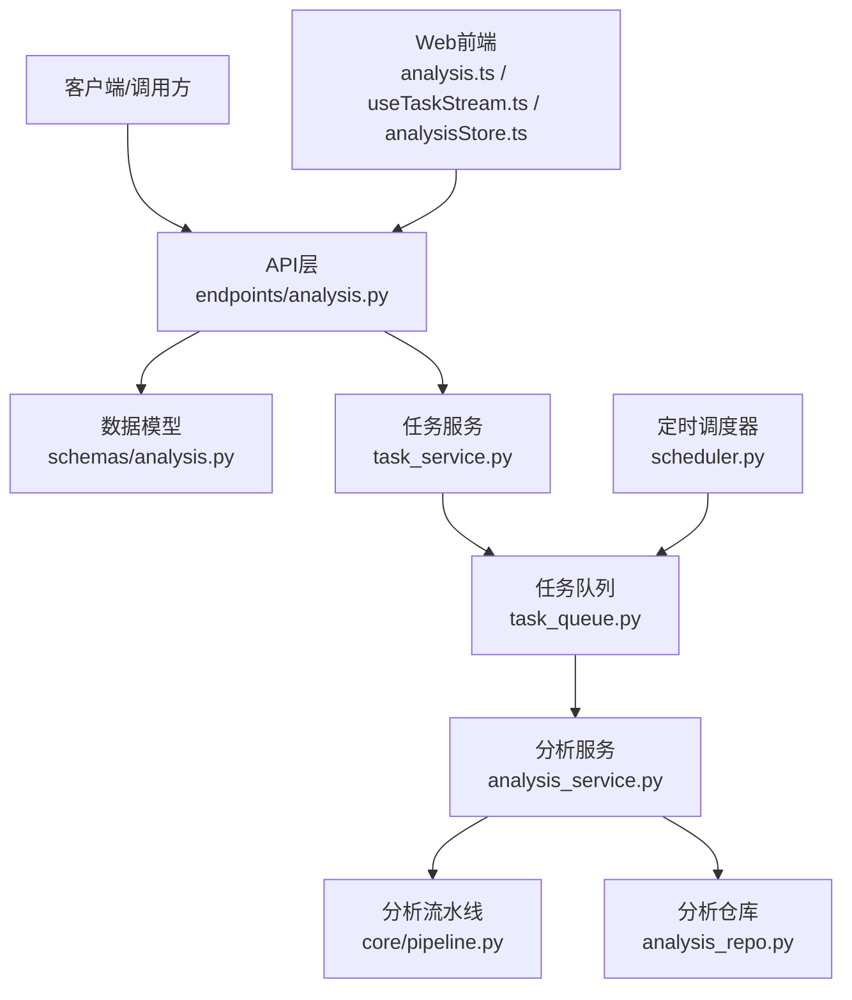
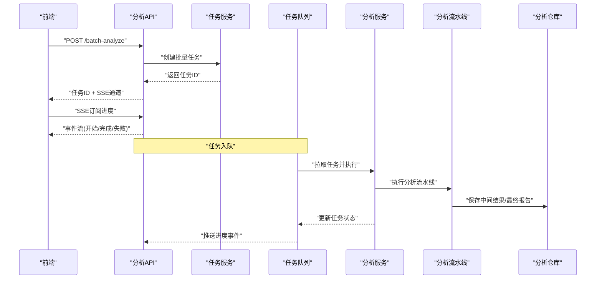
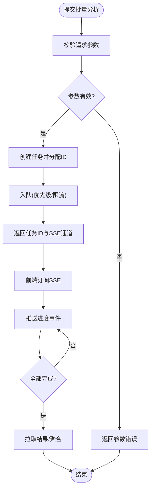
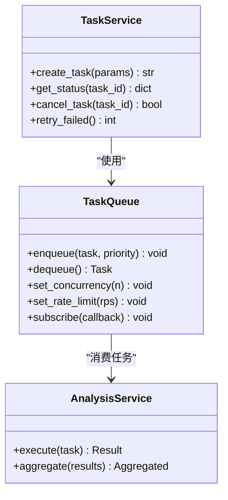
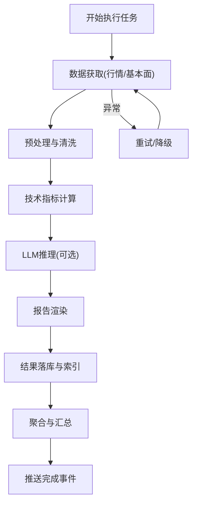
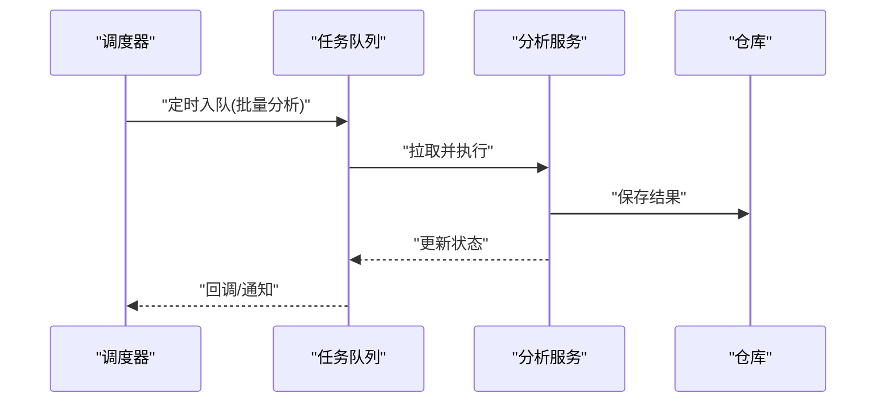
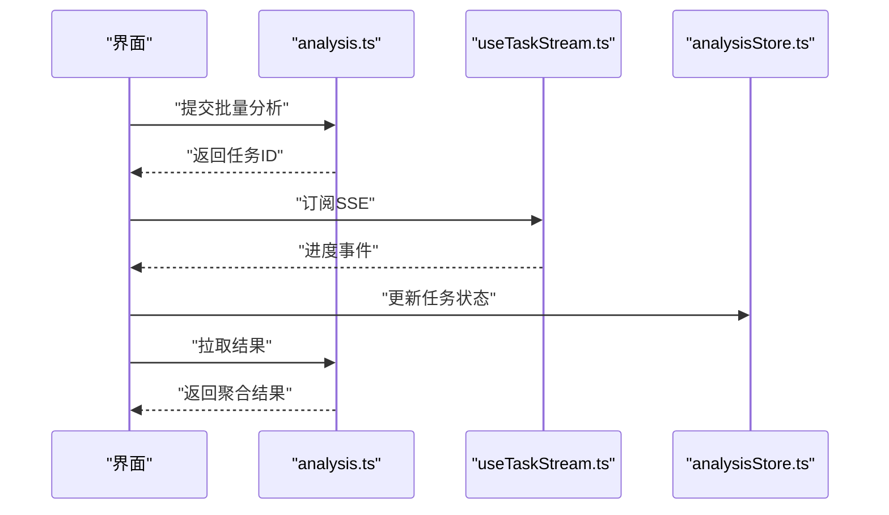
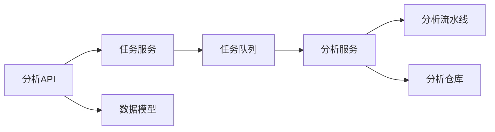

# 批量分析示例

<cite>
**本文引用的文件**   
- [api/v1/endpoints/analysis.py](file://api/v1/endpoints/analysis.py)
- [api/v1/schemas/analysis.py](file://api/v1/schemas/analysis.py)
- [src/services/task_queue.py](file://src/services/task_queue.py)
- [src/services/task_service.py](file://src/services/task_service.py)
- [src/services/analysis_service.py](file://src/services/analysis_service.py)
- [src/repositories/analysis_repo.py](file://src/repositories/analysis_repo.py)
- [src/core/pipeline.py](file://src/core/pipeline.py)
- [src/scheduler.py](file://src/scheduler.py)
- [apps/dsa-web/src/api/analysis.ts](file://apps/dsa-web/src/api/analysis.ts)
- [apps/dsa-web/src/hooks/useTaskStream.ts](file://apps/dsa-web/src/hooks/useTaskStream.ts)
- [apps/dsa-web/src/stores/analysisStore.ts](file://apps/dsa-web/src/stores/analysisStore.ts)
</cite>

## 目录
1. [简介](#简介)
2. [项目结构](#项目结构)
3. [核心组件](#核心组件)
4. [架构总览](#架构总览)
5. [详细组件分析](#详细组件分析)
6. [依赖分析](#依赖分析)
7. [性能考虑](#性能考虑)
8. [故障排查指南](#故障排查指南)
9. [结论](#结论)
10. [附录：高级调用示例与最佳实践](#附录高级调用示例与最佳实践)

## 简介
本文件面向需要“批量股票分析”的高级用户，系统讲解如何提交批量任务、异步处理、进度跟踪、队列管理、并发控制与错误处理等能力。文档结合后端API、服务层、任务队列与前端流式交互，给出大规模股票池分析、定时批量分析与结果聚合处理的完整使用指南与代码片段路径，帮助读者快速落地生产级方案。

## 项目结构
本项目采用前后端分离的架构：
- 后端提供REST API（v1），封装分析、历史、组合、回测等能力；其中分析相关接口位于 endpoints/analysis.py，数据模型在 schemas/analysis.py。
- 服务层包含任务队列、任务调度、分析编排、仓库访问等模块，负责将HTTP请求转化为可执行的分析任务，并通过队列进行异步处理。
- 前端通过TS API与hooks实现任务提交、SSE进度推送与状态聚合展示。

**图表来源** 
- [api/v1/endpoints/analysis.py](file://api/v1/endpoints/analysis.py)
- [api/v1/schemas/analysis.py](file://api/v1/schemas/analysis.py)
- [src/services/task_service.py](file://src/services/task_service.py)
- [src/services/task_queue.py](file://src/services/task_queue.py)
- [src/services/analysis_service.py](file://src/services/analysis_service.py)
- [src/core/pipeline.py](file://src/core/pipeline.py)
- [src/repositories/analysis_repo.py](file://src/repositories/analysis_repo.py)
- [src/scheduler.py](file://src/scheduler.py)
- [apps/dsa-web/src/api/analysis.ts](file://apps/dsa-web/src/api/analysis.ts)
- [apps/dsa-web/src/hooks/useTaskStream.ts](file://apps/dsa-web/src/hooks/useTaskStream.ts)
- [apps/dsa-web/src/stores/analysisStore.ts](file://apps/dsa-web/src/stores/analysisStore.ts)

**章节来源**
- [api/v1/endpoints/analysis.py](file://api/v1/endpoints/analysis.py)
- [api/v1/schemas/analysis.py](file://api/v1/schemas/analysis.py)
- [src/services/task_service.py](file://src/services/task_service.py)
- [src/services/task_queue.py](file://src/services/task_queue.py)
- [src/services/analysis_service.py](file://src/services/analysis_service.py)
- [src/core/pipeline.py](file://src/core/pipeline.py)
- [src/repositories/analysis_repo.py](file://src/repositories/analysis_repo.py)
- [src/scheduler.py](file://src/scheduler.py)
- [apps/dsa-web/src/api/analysis.ts](file://apps/dsa-web/src/api/analysis.ts)
- [apps/dsa-web/src/hooks/useTaskStream.ts](file://apps/dsa-web/src/hooks/useTaskStream.ts)
- [apps/dsa-web/src/stores/analysisStore.ts](file://apps/dsa-web/src/stores/analysisStore.ts)

## 核心组件
- 分析API端点：接收批量分析请求，校验入参，创建任务并返回任务ID，支持SSE进度推送。
- 任务服务：统一的任务生命周期管理（创建、派发、查询、取消）。
- 任务队列：基于内存或持久化后端的任务队列，支持优先级、重试、限流与并发控制。
- 分析服务：编排具体股票分析流程，包括数据获取、指标计算、LLM推理、报告生成与落库。
- 分析仓库：读写分析结果与元数据，支持分页、过滤与聚合查询。
- 分析流水线：将多阶段数据处理串联为可插拔的阶段，便于扩展与监控。
- 定时调度器：按周期触发批量分析任务，适合大盘或全市场扫描。
- 前端交互：通过TS API发起请求，使用SSE钩子实时订阅进度，并在Store中聚合结果。

**章节来源**
- [api/v1/endpoints/analysis.py](file://api/v1/endpoints/analysis.py)
- [src/services/task_service.py](file://src/services/task_service.py)
- [src/services/task_queue.py](file://src/services/task_queue.py)
- [src/services/analysis_service.py](file://src/services/analysis_service.py)
- [src/repositories/analysis_repo.py](file://src/repositories/analysis_repo.py)
- [src/core/pipeline.py](file://src/core/pipeline.py)
- [src/scheduler.py](file://src/scheduler.py)
- [apps/dsa-web/src/api/analysis.ts](file://apps/dsa-web/src/api/analysis.ts)
- [apps/dsa-web/src/hooks/useTaskStream.ts](file://apps/dsa-web/src/hooks/useTaskStream.ts)
- [apps/dsa-web/src/stores/analysisStore.ts](file://apps/dsa-web/src/stores/analysisStore.ts)

## 架构总览
下图展示了从前端到后端再到任务队列与分析流水线的端到端调用链，以及定时任务的触发方式。

**图表来源** 
- [api/v1/endpoints/analysis.py](file://api/v1/endpoints/analysis.py)
- [src/services/task_service.py](file://src/services/task_service.py)
- [src/services/task_queue.py](file://src/services/task_queue.py)
- [src/services/analysis_service.py](file://src/services/analysis_service.py)
- [src/core/pipeline.py](file://src/core/pipeline.py)
- [src/repositories/analysis_repo.py](file://src/repositories/analysis_repo.py)

## 详细组件分析

### 分析API端点（批量提交与进度）
- 功能要点
  - 接收批量股票代码列表与参数（时间窗口、指标、LLM配置等）。
  - 校验入参，生成唯一任务ID，写入任务服务。
  - 返回任务ID与SSE通道，供前端订阅进度。
  - 支持查询任务状态、取消任务、获取结果摘要。
- 关键流程
  - 提交批量任务 -> 任务服务创建任务 -> 入队 -> 返回任务ID与SSE地址。
  - 前端订阅SSE，服务端根据任务状态推送进度事件。
  - 完成后，前端拉取结果或从SSE事件获取汇总信息。

**图表来源** 
- [api/v1/endpoints/analysis.py](file://api/v1/endpoints/analysis.py)
- [src/services/task_service.py](file://src/services/task_service.py)
- [src/services/task_queue.py](file://src/services/task_queue.py)

**章节来源**
- [api/v1/endpoints/analysis.py](file://api/v1/endpoints/analysis.py)
- [api/v1/schemas/analysis.py](file://api/v1/schemas/analysis.py)

### 任务服务与队列（队列管理与并发控制）
- 任务服务
  - 统一管理任务生命周期：创建、查询、取消、重试。
  - 与队列解耦，便于替换不同队列实现。
- 任务队列
  - 支持优先级队列、任务去重、重试策略、超时与死信队列。
  - 并发控制：限制同时运行的worker数量，避免资源耗尽。
  - 限流：对特定任务类型或全局速率进行限制。
- 典型用法
  - 提交批量任务时设置优先级与并发上限。
  - 监听队列事件，实现进度上报与告警。

**图表来源** 
- [src/services/task_service.py](file://src/services/task_service.py)
- [src/services/task_queue.py](file://src/services/task_queue.py)
- [src/services/analysis_service.py](file://src/services/analysis_service.py)

**章节来源**
- [src/services/task_service.py](file://src/services/task_service.py)
- [src/services/task_queue.py](file://src/services/task_queue.py)

### 分析服务与流水线（复杂逻辑与可扩展性）
- 分析服务
  - 编排单个股票或批量的分析流程，支持并行与分片。
  - 聚合多个股票的结果，生成汇总报告。
- 分析流水线
  - 将数据获取、预处理、指标计算、LLM推理、报告渲染等阶段串接。
  - 每阶段可独立测试、监控与回滚。
- 错误处理
  - 捕获异常并记录上下文，支持重试与降级策略。
  - 将失败任务进入死信队列，便于人工干预。

**图表来源** 
- [src/services/analysis_service.py](file://src/services/analysis_service.py)
- [src/core/pipeline.py](file://src/core/pipeline.py)
- [src/repositories/analysis_repo.py](file://src/repositories/analysis_repo.py)

**章节来源**
- [src/services/analysis_service.py](file://src/services/analysis_service.py)
- [src/core/pipeline.py](file://src/core/pipeline.py)
- [src/repositories/analysis_repo.py](file://src/repositories/analysis_repo.py)

### 定时批量分析（调度与周期性任务）
- 调度器
  - 支持cron表达式或固定间隔触发。
  - 可配置任务参数（股票池、时间窗口、策略开关）。
- 使用场景
  - 每日收盘后全市场扫描。
  - 盘中定时刷新重点股票池。
- 注意事项
  - 避免与高峰时段冲突，合理设置并发与限流。
  - 失败任务自动重试，确保可靠性。

**图表来源** 
- [src/scheduler.py](file://src/scheduler.py)
- [src/services/task_queue.py](file://src/services/task_queue.py)
- [src/services/analysis_service.py](file://src/services/analysis_service.py)
- [src/repositories/analysis_repo.py](file://src/repositories/analysis_repo.py)

**章节来源**
- [src/scheduler.py](file://src/scheduler.py)

### 前端交互（SSE进度与结果聚合）
- API封装
  - 提供批量提交、状态查询、结果拉取的TS函数。
- SSE钩子
  - 订阅任务进度事件，实时更新UI。
- Store
  - 集中管理任务状态与结果，支持分页与筛选。

**图表来源** 
- [apps/dsa-web/src/api/analysis.ts](file://apps/dsa-web/src/api/analysis.ts)
- [apps/dsa-web/src/hooks/useTaskStream.ts](file://apps/dsa-web/src/hooks/useTaskStream.ts)
- [apps/dsa-web/src/stores/analysisStore.ts](file://apps/dsa-web/src/stores/analysisStore.ts)

**章节来源**
- [apps/dsa-web/src/api/analysis.ts](file://apps/dsa-web/src/api/analysis.ts)
- [apps/dsa-web/src/hooks/useTaskStream.ts](file://apps/dsa-web/src/hooks/useTaskStream.ts)
- [apps/dsa-web/src/stores/analysisStore.ts](file://apps/dsa-web/src/stores/analysisStore.ts)

## 依赖分析
- 组件耦合
  - API层依赖任务服务与数据模型，与队列和分析服务解耦。
  - 任务服务与队列抽象良好，便于替换实现。
  - 分析服务依赖流水线与仓库，职责清晰。
- 外部依赖
  - 数据源（行情/基本面）、LLM服务、消息通道（SSE）。
- 潜在风险
  - 队列阻塞导致延迟增大，需监控与扩容。
  - LLM调用不稳定，需重试与降级。

**图表来源** 
- [api/v1/endpoints/analysis.py](file://api/v1/endpoints/analysis.py)
- [src/services/task_service.py](file://src/services/task_service.py)
- [src/services/task_queue.py](file://src/services/task_queue.py)
- [src/services/analysis_service.py](file://src/services/analysis_service.py)
- [src/core/pipeline.py](file://src/core/pipeline.py)
- [src/repositories/analysis_repo.py](file://src/repositories/analysis_repo.py)
- [api/v1/schemas/analysis.py](file://api/v1/schemas/analysis.py)

**章节来源**
- [api/v1/endpoints/analysis.py](file://api/v1/endpoints/analysis.py)
- [src/services/task_service.py](file://src/services/task_service.py)
- [src/services/task_queue.py](file://src/services/task_queue.py)
- [src/services/analysis_service.py](file://src/services/analysis_service.py)
- [src/core/pipeline.py](file://src/core/pipeline.py)
- [src/repositories/analysis_repo.py](file://src/repositories/analysis_repo.py)
- [api/v1/schemas/analysis.py](file://api/v1/schemas/analysis.py)

## 性能考虑
- 并发与限流
  - 合理设置worker并发数，避免CPU/IO瓶颈。
  - 对LLM与数据源调用进行速率限制，防止超限。
- 批量化与分片
  - 将大批量任务拆分为小批次，降低单次负载。
  - 使用分片并行处理，提升吞吐。
- 缓存与复用
  - 缓存常用数据与中间结果，减少重复计算。
  - 复用连接与对象，降低开销。
- 监控与告警
  - 监控队列长度、任务耗时、失败率。
  - 设置阈值告警，及时扩容或降级。

[本节为通用指导，不直接分析具体文件]

## 故障排查指南
- 常见问题
  - 任务堆积：检查队列消费者数量与处理能力。
  - LLM超时：增加重试次数与超时时间，启用降级策略。
  - 数据源不可用：切换备用数据源，记录错误上下文。
  - SSE断开：前端重连机制与断线恢复。
- 定位方法
  - 查看任务状态与日志，确认失败节点。
  - 检查仓库写入是否成功，必要时回滚。
  - 使用诊断工具输出流水线各阶段耗时。

**章节来源**
- [src/services/task_queue.py](file://src/services/task_queue.py)
- [src/services/analysis_service.py](file://src/services/analysis_service.py)
- [src/repositories/analysis_repo.py](file://src/repositories/analysis_repo.py)

## 结论
通过统一的API与服务层设计，结合任务队列与流水线编排，本项目提供了稳定高效的批量股票分析能力。配合前端SSE与Store，可实现实时进度跟踪与结果聚合。在生产环境中，建议关注并发控制、限流与监控告警，以确保大规模任务的高可用与高性能。

[本节为总结，不直接分析具体文件]

## 附录：高级调用示例与最佳实践
- 批量任务提交
  - 使用分析API提交批量股票列表与参数，获取任务ID与SSE通道。
  - 参考路径：[api/v1/endpoints/analysis.py](file://api/v1/endpoints/analysis.py)、[api/v1/schemas/analysis.py](file://api/v1/schemas/analysis.py)。
- 异步处理与进度跟踪
  - 前端订阅SSE，实时接收进度事件，更新UI。
  - 参考路径：[apps/dsa-web/src/api/analysis.ts](file://apps/dsa-web/src/api/analysis.ts)、[apps/dsa-web/src/hooks/useTaskStream.ts](file://apps/dsa-web/src/hooks/useTaskStream.ts)。
- 任务队列管理与并发控制
  - 设置worker并发、任务优先级与限流策略，避免资源争用。
  - 参考路径：[src/services/task_queue.py](file://src/services/task_queue.py)、[src/services/task_service.py](file://src/services/task_service.py)。
- 错误处理与重试
  - 捕获异常并记录上下文，失败任务进入死信队列，支持重试。
  - 参考路径：[src/services/analysis_service.py](file://src/services/analysis_service.py)、[src/repositories/analysis_repo.py](file://src/repositories/analysis_repo.py)。
- 大规模股票池分析
  - 分批提交任务，分片并行处理，聚合结果。
  - 参考路径：[src/services/analysis_service.py](file://src/services/analysis_service.py)、[src/core/pipeline.py](file://src/core/pipeline.py)。
- 定时批量分析
  - 使用调度器按周期触发任务，配置参数与并发。
  - 参考路径：[src/scheduler.py](file://src/scheduler.py)。
- 结果聚合处理
  - 在服务端聚合多个股票结果，生成汇总报告。
  - 参考路径：[src/services/analysis_service.py](file://src/services/analysis_service.py)、[src/repositories/analysis_repo.py](file://src/repositories/analysis_repo.py)。

[本节为使用指南，不直接分析具体文件]