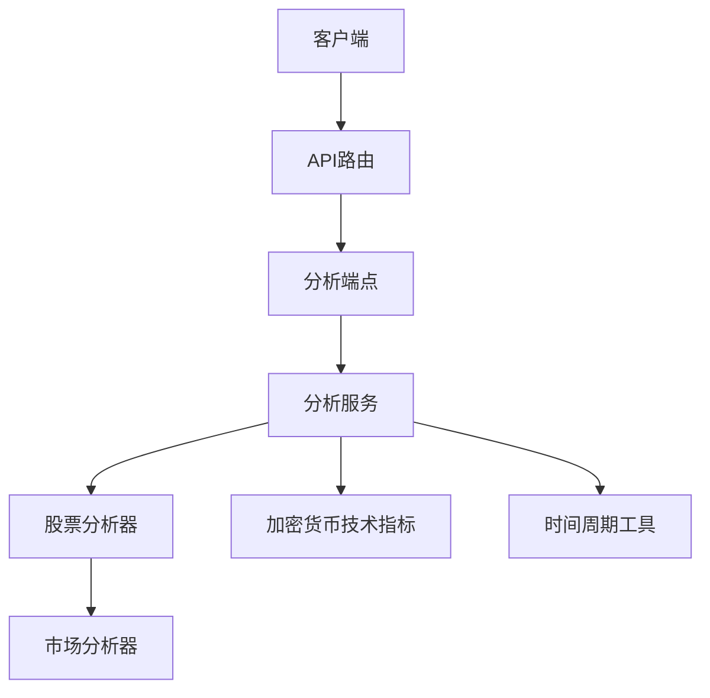
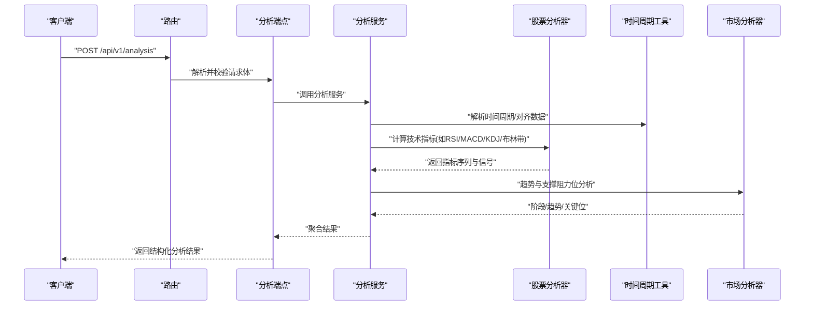
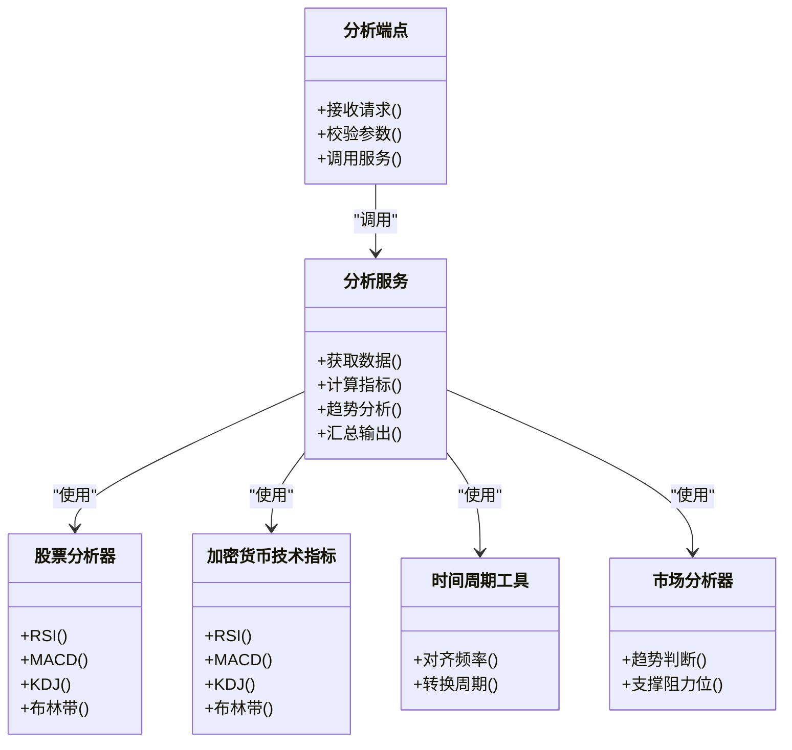

# 技术分析示例

<cite>
**本文档引用的文件**   
- [api/v1/endpoints/analysis.py](file://api/v1/endpoints/analysis.py)
- [api/v1/schemas/analysis.py](file://api/v1/schemas/analysis.py)
- [src/services/analysis_service.py](file://src/services/analysis_service.py)
- [src/stock_analyzer.py](file://src/stock_analyzer.py)
- [src/crypto_technical.py](file://src/crypto_technical.py)
- [src/utils/timeframe.py](file://src/utils/timeframe.py)
- [src/market_analyzer.py](file://src/market_analyzer.py)
- [api/app.py](file://api/app.py)
- [api/v1/router.py](file://api/v1/router.py)
</cite>

## 目录
1. [简介](#简介)
2. [项目结构](#项目结构)
3. [核心组件](#核心组件)
4. [架构总览](#架构总览)
5. [详细组件分析](#详细组件分析)
6. [依赖关系分析](#依赖关系分析)
7. [性能考虑](#性能考虑)
8. [故障排查指南](#故障排查指南)
9. [结论](#结论)
10. [附录：API调用示例与参数说明](#附录api调用示例与参数说明)

## 简介
本文件面向需要调用“技术分析API”的开发者与量化使用者，提供从单指标到多指标组合、从趋势判断到支撑阻力位识别的完整调用示例。内容覆盖：
- 技术指标计算（RSI、MACD、KDJ、布林带等）
- 趋势分析与形态识别
- 支撑阻力位识别
- 时间周期设置与参数配置
- 单指标与多指标组合分析方法
- 实战场景与调用流程

## 项目结构
本项目采用分层架构：
- API层：定义路由、请求/响应模型与错误处理
- 服务层：封装业务逻辑，协调数据获取、指标计算与分析编排
- 分析器层：实现具体技术分析与市场状态判断
- 工具层：时间周期、数据处理等通用能力

图表来源
- [api/v1/router.py](file://api/v1/router.py)
- [api/v1/endpoints/analysis.py](file://api/v1/endpoints/analysis.py)
- [src/services/analysis_service.py](file://src/services/analysis_service.py)
- [src/stock_analyzer.py](file://src/stock_analyzer.py)
- [src/crypto_technical.py](file://src/crypto_technical.py)
- [src/utils/timeframe.py](file://src/utils/timeframe.py)
- [src/market_analyzer.py](file://src/market_analyzer.py)

章节来源
- [api/app.py](file://api/app.py)
- [api/v1/router.py](file://api/v1/router.py)

## 核心组件
- 分析端点：暴露REST接口，接收标的、时间范围、指标选择与参数
- 分析服务：组装数据、调度指标计算、生成分析报告
- 股票分析器：实现A股/港股/美股等技术指标与趋势判断
- 加密货币技术指标：针对加密资产的技术指标计算
- 时间周期工具：统一时间粒度转换与对齐

章节来源
- [api/v1/endpoints/analysis.py](file://api/v1/endpoints/analysis.py)
- [api/v1/schemas/analysis.py](file://api/v1/schemas/analysis.py)
- [src/services/analysis_service.py](file://src/services/analysis_service.py)
- [src/stock_analyzer.py](file://src/stock_analyzer.py)
- [src/crypto_technical.py](file://src/crypto_technical.py)
- [src/utils/timeframe.py](file://src/utils/timeframe.py)

## 架构总览
技术分析API的请求-响应时序如下：

图表来源
- [api/v1/endpoints/analysis.py](file://api/v1/endpoints/analysis.py)
- [src/services/analysis_service.py](file://src/services/analysis_service.py)
- [src/stock_analyzer.py](file://src/stock_analyzer.py)
- [src/utils/timeframe.py](file://src/utils/timeframe.py)
- [src/market_analyzer.py](file://src/market_analyzer.py)

## 详细组件分析

### 分析端点与请求模型
- 功能：接收分析请求，校验输入，委托服务层执行
- 关键参数：
  - 标的代码（支持A股/港股/美股/加密资产）
  - 时间范围（起止日期或长度）
  - 时间周期（日线、周线、分钟级等）
  - 指标选择（RSI、MACD、KDJ、布林带等）
  - 参数配置（周期、阈值、窗口大小等）
  - 输出格式（原始指标、信号、报告摘要）

章节来源
- [api/v1/endpoints/analysis.py](file://api/v1/endpoints/analysis.py)
- [api/v1/schemas/analysis.py](file://api/v1/schemas/analysis.py)

### 分析服务
- 功能：协调数据获取、指标计算、趋势与支撑阻力位分析，汇总输出
- 关键点：
  - 根据时间周期拉取历史数据
  - 按指标清单批量计算
  - 将指标结果交给市场分析器进行趋势与关键位判断
  - 返回结构化结果（指标值、信号、建议）

章节来源
- [src/services/analysis_service.py](file://src/services/analysis_service.py)

### 股票分析器
- 功能：实现主流技术指标与趋势判断
- 典型指标：
  - RSI（相对强弱指数）
  - MACD（移动平均收敛发散）
  - KDJ（随机指标）
  - 布林带（上下轨与带宽）
- 输出：指标序列、超买超卖信号、金叉死叉、突破信号

章节来源
- [src/stock_analyzer.py](file://src/stock_analyzer.py)

### 加密货币技术指标
- 功能：为加密资产提供与股票一致的技术指标计算能力
- 特点：适配加密数据的波动性与交易时段差异

章节来源
- [src/crypto_technical.py](file://src/crypto_technical.py)

### 时间周期工具
- 功能：统一时间粒度（分钟、小时、日、周、月），对齐数据频率
- 使用：在拉取数据与计算指标前进行频率标准化

章节来源
- [src/utils/timeframe.py](file://src/utils/timeframe.py)

### 市场分析器
- 功能：基于指标序列进行趋势阶段划分、支撑阻力位识别
- 输出：趋势方向、强度、关键价位、突破/回踩信号

章节来源
- [src/market_analyzer.py](file://src/market_analyzer.py)

## 依赖关系分析
- 端点依赖服务层，服务层依赖分析器与工具
- 指标计算与市场分析解耦，便于扩展新指标与新策略
- 时间周期工具被多处复用，保证数据一致性

图表来源
- [api/v1/endpoints/analysis.py](file://api/v1/endpoints/analysis.py)
- [src/services/analysis_service.py](file://src/services/analysis_service.py)
- [src/stock_analyzer.py](file://src/stock_analyzer.py)
- [src/crypto_technical.py](file://src/crypto_technical.py)
- [src/utils/timeframe.py](file://src/utils/timeframe.py)
- [src/market_analyzer.py](file://src/market_analyzer.py)

## 性能考虑
- 批量计算指标：减少多次IO与重复计算
- 缓存历史数据：对常用标的与周期做本地缓存
- 异步处理：长耗时任务可异步执行，前端轮询或SSE推送
- 合理窗口：避免过大窗口导致内存与计算压力
- 指标选择性：按需启用指标，降低无效计算

## 故障排查指南
- 常见错误：
  - 标的代码不存在或不可用
  - 时间范围非法或数据不足
  - 指标参数越界（如周期过小）
  - 网络超时或数据源异常
- 排查步骤：
  - 检查请求参数是否合法
  - 确认数据源可用性与权限
  - 缩小时间范围或调整指标参数重试
  - 查看服务端日志定位失败环节

章节来源
- [api/v1/endpoints/analysis.py](file://api/v1/endpoints/analysis.py)
- [src/services/analysis_service.py](file://src/services/analysis_service.py)

## 结论
通过统一的API入口与服务化架构，系统能够灵活组合多种技术指标，完成趋势判断与支撑阻力位识别。开发者可按需选择指标与参数，快速构建从单指标到多指标组合的分析流程，满足不同交易策略与风控需求。

## 附录：API调用示例与参数说明

### 基础调用（单指标：RSI）
- 目标：计算指定标的的RSI，用于超买超卖判断
- 关键参数：
  - 标的代码
  - 时间范围（起止日期或长度）
  - 时间周期（如日线）
  - RSI周期（默认14）
- 预期输出：RSI序列、当前值、信号（超买/超卖）

章节来源
- [api/v1/endpoints/analysis.py](file://api/v1/endpoints/analysis.py)
- [api/v1/schemas/analysis.py](file://api/v1/schemas/analysis.py)
- [src/stock_analyzer.py](file://src/stock_analyzer.py)

### 多指标组合（RSI+MACD+KDJ）
- 目标：综合动量与震荡指标，提高信号可靠性
- 关键参数：
  - 指标列表：RSI、MACD、KDJ
  - 各指标周期与阈值
  - 时间周期与数据长度
- 预期输出：各指标序列、交叉信号、共振信号（同向确认）

章节来源
- [src/services/analysis_service.py](file://src/services/analysis_service.py)
- [src/stock_analyzer.py](file://src/stock_analyzer.py)

### 趋势分析（均线+MACD+布林带）
- 目标：识别趋势方向与强度，辅助入场与止损
- 关键参数：
  - 均线周期（如MA20、MA60）
  - MACD参数（快慢周期、信号线）
  - 布林带周期与倍数
- 预期输出：趋势方向、突破信号、回踩确认

章节来源
- [src/market_analyzer.py](file://src/market_analyzer.py)
- [src/stock_analyzer.py](file://src/stock_analyzer.py)

### 支撑阻力位识别（价格行为+指标）
- 目标：定位关键价位，制定止盈止损
- 关键参数：
  - 价格区间与时间范围
  - 成交量配合（可选）
  - 指标过滤（如布林带收口/开口）
- 预期输出：支撑位、阻力位、突破概率评估

章节来源
- [src/market_analyzer.py](file://src/market_analyzer.py)
- [src/services/analysis_service.py](file://src/services/analysis_service.py)

### 加密资产技术分析（BTC/ETH）
- 目标：适配加密资产的波动特性与交易时段
- 关键参数：
  - 标的类型（加密）
  - 时间周期（分钟/小时/日）
  - 指标选择（与股票一致）
- 预期输出：加密专属的信号与风险提示

章节来源
- [src/crypto_technical.py](file://src/crypto_technical.py)
- [src/services/analysis_service.py](file://src/services/analysis_service.py)

### 时间周期设置
- 目标：统一数据频率，确保指标可比性
- 关键参数：
  - 目标周期（分钟、小时、日、周、月）
  - 数据对齐方式（开盘/收盘对齐）
- 预期输出：标准化后的时间序列

章节来源
- [src/utils/timeframe.py](file://src/utils/timeframe.py)

### 实战场景示例
- 短线交易：分钟级别KDJ+RSI共振，结合布林带突破
- 波段交易：日线MACD金叉+均线多头排列
- 趋势跟踪：周线级别趋势确认，回踩支撑位入场
- 风险控制：多指标背离预警，动态止损与止盈

章节来源
- [src/services/analysis_service.py](file://src/services/analysis_service.py)
- [src/market_analyzer.py](file://src/market_analyzer.py)