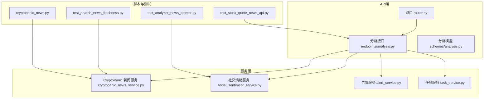
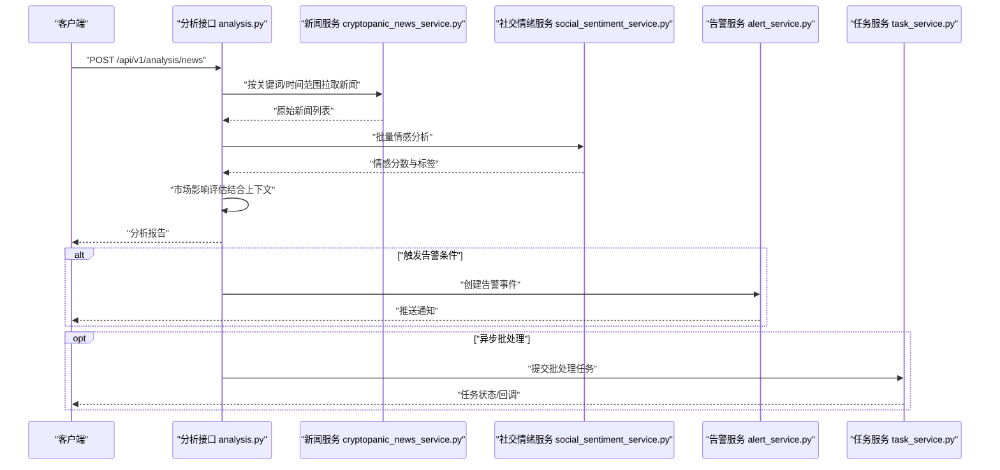
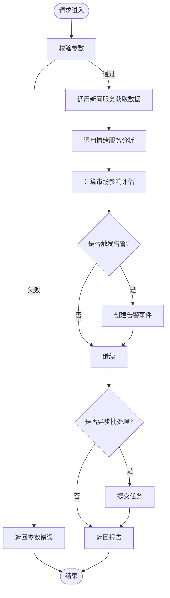
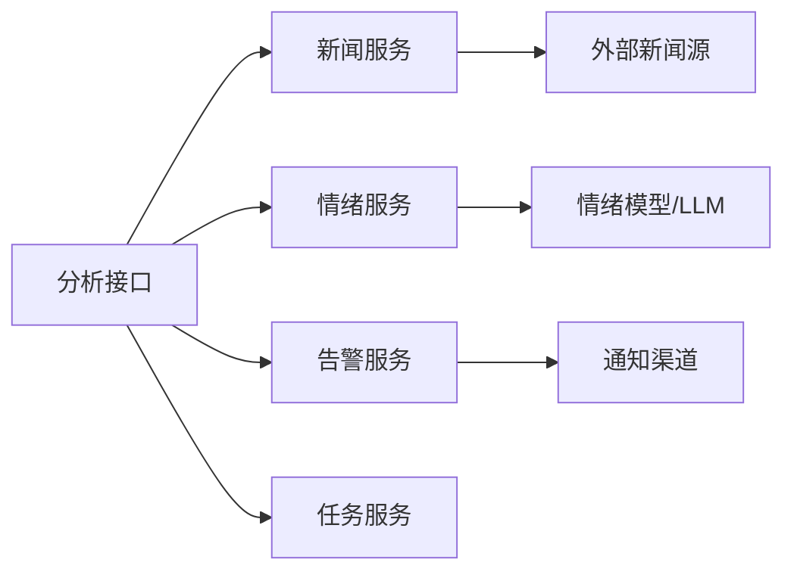

# 新闻分析示例

<cite>
**本文引用的文件**
- [api/v1/router.py](file://api/v1/router.py)
- [api/v1/endpoints/analysis.py](file://api/v1/endpoints/analysis.py)
- [api/v1/schemas/analysis.py](file://api/v1/schemas/analysis.py)
- [src/services/cryptopanic_news_service.py](file://src/services/cryptopanic_news_service.py)
- [src/services/social_sentiment_service.py](file://src/services/social_sentiment_service.py)
- [src/services/alert_service.py](file://src/services/alert_service.py)
- [src/services/task_service.py](file://src/services/task_service.py)
- [scripts/cryptopanic_news.py](file://scripts/cryptopanic_news.py)
- [tests/test_search_news_freshness.py](file://tests/test_search_news_freshness.py)
- [tests/test_analyzer_news_prompt.py](file://tests/test_analyzer_news_prompt.py)
- [tests/test_stock_quote_news_api.py](file://tests/test_stock_quote_news_api.py)
</cite>

## 目录
1. [简介](#简介)
2. [项目结构](#项目结构)
3. [核心组件](#核心组件)
4. [架构总览](#架构总览)
5. [详细组件分析](#详细组件分析)
6. [依赖关系分析](#依赖关系分析)
7. [性能考虑](#性能考虑)
8. [故障排查指南](#故障排查指南)
9. [结论](#结论)
10. [附录：API调用示例与场景](#附录api调用示例与场景)

## 简介
本文件面向需要集成或使用“新闻分析API”的开发者与业务用户，提供从数据采集、情感分析到市场影响评估的端到端调用示例。内容覆盖：
- 新闻源配置（如 CryptoPanic）与关键词设置
- 情感分析参数与输出解读
- 监控、舆情分析与事件驱动分析的典型用法
- 批量处理与实时推送的实现方式

## 项目结构
本项目采用分层架构：
- API层：FastAPI路由与请求/响应模型定义
- 服务层：新闻采集、情感分析、告警与任务调度等能力封装
- 脚本与测试：辅助工具与用例验证

**图表来源**
- [api/v1/router.py](file://api/v1/router.py)
- [api/v1/endpoints/analysis.py](file://api/v1/endpoints/analysis.py)
- [api/v1/schemas/analysis.py](file://api/v1/schemas/analysis.py)
- [src/services/cryptopanic_news_service.py](file://src/services/cryptopanic_news_service.py)
- [src/services/social_sentiment_service.py](file://src/services/social_sentiment_service.py)
- [src/services/alert_service.py](file://src/services/alert_service.py)
- [src/services/task_service.py](file://src/services/task_service.py)
- [scripts/cryptopanic_news.py](file://scripts/cryptopanic_news.py)
- [tests/test_search_news_freshness.py](file://tests/test_search_news_freshness.py)
- [tests/test_analyzer_news_prompt.py](file://tests/test_analyzer_news_prompt.py)
- [tests/test_stock_quote_news_api.py](file://tests/test_stock_quote_news_api.py)

**章节来源**
- [api/v1/router.py](file://api/v1/router.py)
- [api/v1/endpoints/analysis.py](file://api/v1/endpoints/analysis.py)
- [api/v1/schemas/analysis.py](file://api/v1/schemas/analysis.py)

## 核心组件
- 分析接口（Analysis Endpoints）
  - 负责接收新闻分析请求，校验参数，协调新闻采集、情感分析、市场影响评估与结果返回。
- 新闻服务（CryptoPanic News Service）
  - 对接外部新闻源，支持按关键词过滤、时间范围筛选、分页与去重。
- 社交情绪服务（Social Sentiment Service）
  - 对新闻文本进行情感打分与分类，支持多语言与可配置阈值。
- 告警服务（Alert Service）
  - 基于规则或阈值触发通知，支持多渠道推送。
- 任务服务（Task Service）
  - 管理异步任务、批处理与重试机制，支撑高吞吐与可靠性。

**章节来源**
- [api/v1/endpoints/analysis.py](file://api/v1/endpoints/analysis.py)
- [src/services/cryptopanic_news_service.py](file://src/services/cryptopanic_news_service.py)
- [src/services/social_sentiment_service.py](file://src/services/social_sentiment_service.py)
- [src/services/alert_service.py](file://src/services/alert_service.py)
- [src/services/task_service.py](file://src/services/task_service.py)

## 架构总览
下图展示了从客户端发起新闻分析请求到最终返回结果的完整流程，包括数据获取、情感分析、市场影响评估与可选的告警/任务编排。

**图表来源**
- [api/v1/endpoints/analysis.py](file://api/v1/endpoints/analysis.py)
- [src/services/cryptopanic_news_service.py](file://src/services/cryptopanic_news_service.py)
- [src/services/social_sentiment_service.py](file://src/services/social_sentiment_service.py)
- [src/services/alert_service.py](file://src/services/alert_service.py)
- [src/services/task_service.py](file://src/services/task_service.py)

## 详细组件分析

### 分析接口（Analysis Endpoints）
- 职责
  - 接收并校验请求体（关键词、时间窗口、情感阈值、是否启用告警等）。
  - 调用新闻服务获取数据，调用情绪服务进行分析，生成市场影响评估。
  - 可选择触发告警或提交后台任务进行批处理。
- 关键参数
  - 关键词集合、时间范围、情感阈值、是否包含历史对比、是否开启告警、是否异步处理等。
- 返回结构
  - 新闻摘要、情感分布、关键事件、市场影响评分与建议。

**图表来源**
- [api/v1/endpoints/analysis.py](file://api/v1/endpoints/analysis.py)
- [api/v1/schemas/analysis.py](file://api/v1/schemas/analysis.py)

**章节来源**
- [api/v1/endpoints/analysis.py](file://api/v1/endpoints/analysis.py)
- [api/v1/schemas/analysis.py](file://api/v1/schemas/analysis.py)

### 新闻服务（CryptoPanic News Service）
- 功能
  - 连接外部新闻源，支持关键词过滤、时间范围、分页、去重与缓存。
  - 提供统一的数据模型，便于后续情感分析模块消费。
- 配置项
  - API密钥、超时、重试策略、代理设置、数据源开关等。
- 使用建议
  - 合理设置关键词与时间窗口，避免过大查询导致延迟。
  - 启用缓存与去重，降低重复处理成本。

**章节来源**
- [src/services/cryptopanic_news_service.py](file://src/services/cryptopanic_news_service.py)
- [scripts/cryptopanic_news.py](file://scripts/cryptopanic_news.py)

### 社交情绪服务（Social Sentiment Service）
- 功能
  - 对新闻标题与正文进行情感打分与分类，支持多语言与自定义阈值。
  - 输出结构化情感指标（正面/中性/负面比例、强度、置信度）。
- 参数
  - 文本输入、语言代码、情感阈值、是否启用上下文增强等。
- 优化
  - 批量处理时注意分片与并发控制，避免限流。

**章节来源**
- [src/services/social_sentiment_service.py](file://src/services/social_sentiment_service.py)
- [tests/test_analyzer_news_prompt.py](file://tests/test_analyzer_news_prompt.py)

### 告警服务（Alert Service）
- 功能
  - 根据规则（如情感阈值、关键词命中、事件频率）触发告警。
  - 支持多渠道通知（邮件、IM、Webhook等）。
- 配置
  - 规则模板、渠道凭证、冷却时间与去重策略。

**章节来源**
- [src/services/alert_service.py](file://src/services/alert_service.py)

### 任务服务（Task Service）
- 功能
  - 管理异步任务队列，支持批处理、重试、进度查询与回调。
- 适用场景
  - 大规模新闻批处理、定时巡检、延迟执行与失败恢复。

**章节来源**
- [src/services/task_service.py](file://src/services/task_service.py)

## 依赖关系分析
- 耦合与内聚
  - 分析接口作为入口，低耦合地调用新闻与情绪服务；告警与任务服务为可选扩展。
- 外部依赖
  - 新闻源（CryptoPanic）、LLM或情绪模型、消息通道（用于告警）。
- 潜在风险
  - 外部服务限流与不可用需通过重试、降级与熔断策略保障稳定性。

**图表来源**
- [api/v1/endpoints/analysis.py](file://api/v1/endpoints/analysis.py)
- [src/services/cryptopanic_news_service.py](file://src/services/cryptopanic_news_service.py)
- [src/services/social_sentiment_service.py](file://src/services/social_sentiment_service.py)
- [src/services/alert_service.py](file://src/services/alert_service.py)
- [src/services/task_service.py](file://src/services/task_service.py)

**章节来源**
- [api/v1/endpoints/analysis.py](file://api/v1/endpoints/analysis.py)
- [src/services/cryptopanic_news_service.py](file://src/services/cryptopanic_news_service.py)
- [src/services/social_sentiment_service.py](file://src/services/social_sentiment_service.py)
- [src/services/alert_service.py](file://src/services/alert_service.py)
- [src/services/task_service.py](file://src/services/task_service.py)

## 性能考虑
- 批处理与并发
  - 将大批量新闻切分为批次，限制并发数以避免下游限流。
- 缓存与去重
  - 对新闻内容与情感结果做短期缓存，减少重复计算。
- 超时与重试
  - 设置合理的超时与指数退避重试，提升鲁棒性。
- 资源隔离
  - 将I/O密集型与CPU密集型任务分离，避免相互阻塞。

[本节为通用指导，不直接分析具体文件]

## 故障排查指南
- 常见问题
  - 新闻源不可用或限流：检查网络、代理与配额；启用重试与降级。
  - 情绪分析失败：确认输入文本编码与长度；调整模型参数与阈值。
  - 告警未触发：核对规则配置与阈值；检查通知渠道凭证。
  - 任务堆积：查看队列容量与消费者数量；扩容或优化处理逻辑。
- 定位方法
  - 查看接口日志与错误码；使用健康检查接口确认服务状态。
  - 通过测试用例复现问题，逐步缩小范围。

**章节来源**
- [tests/test_search_news_freshness.py](file://tests/test_search_news_freshness.py)
- [tests/test_analyzer_news_prompt.py](file://tests/test_analyzer_news_prompt.py)
- [tests/test_stock_quote_news_api.py](file://tests/test_stock_quote_news_api.py)

## 结论
本API提供了完整的新闻分析链路：从数据采集、情感分析到市场影响评估，并支持告警与异步批处理。通过合理配置新闻源与关键词、设定情感阈值与告警规则，可实现高效的新闻监控、舆情分析与事件驱动决策。

[本节为总结，不直接分析具体文件]

## 附录：API调用示例与场景

### 基础调用：单次新闻分析
- 目标
  - 输入关键词与时间范围，获取情感分析与市场影响评估。
- 步骤
  - 构造请求体（关键词、时间窗口、情感阈值、是否异步）。
  - 调用分析接口，等待返回报告。
- 参考实现
  - 接口定义与参数模型见分析接口与模型文件。

**章节来源**
- [api/v1/endpoints/analysis.py](file://api/v1/endpoints/analysis.py)
- [api/v1/schemas/analysis.py](file://api/v1/schemas/analysis.py)

### 新闻源配置：CryptoPanic
- 目标
  - 配置外部新闻源，启用关键词过滤与分页。
- 步骤
  - 设置API密钥、超时与重试策略。
  - 指定关键词与时间范围，启用去重与缓存。
- 参考实现
  - 新闻服务与脚本示例。

**章节来源**
- [src/services/cryptopanic_news_service.py](file://src/services/cryptopanic_news_service.py)
- [scripts/cryptopanic_news.py](file://scripts/cryptopanic_news.py)

### 情感分析参数与输出解读
- 目标
  - 调整情感阈值与语言选项，理解输出指标。
- 步骤
  - 设置语言代码、阈值与上下文增强开关。
  - 解析返回的情感分布与置信度。
- 参考实现
  - 情绪服务与相关测试用例。

**章节来源**
- [src/services/social_sentiment_service.py](file://src/services/social_sentiment_service.py)
- [tests/test_analyzer_news_prompt.py](file://tests/test_analyzer_news_prompt.py)

### 监控与舆情分析
- 目标
  - 持续监控特定关键词，触发舆情告警。
- 步骤
  - 配置监控规则（关键词、时间窗口、情感阈值）。
  - 订阅告警通道，接收实时通知。
- 参考实现
  - 告警服务与任务服务。

**章节来源**
- [src/services/alert_service.py](file://src/services/alert_service.py)
- [src/services/task_service.py](file://src/services/task_service.py)

### 事件驱动分析
- 目标
  - 在重大事件发生时快速生成分析报告。
- 步骤
  - 监听事件源（如新闻热点），触发分析任务。
  - 输出事件影响评估与应对建议。
- 参考实现
  - 分析接口与任务服务组合。

**章节来源**
- [api/v1/endpoints/analysis.py](file://api/v1/endpoints/analysis.py)
- [src/services/task_service.py](file://src/services/task_service.py)

### 批量新闻处理
- 目标
  - 高效处理大量新闻，降低延迟与成本。
- 步骤
  - 分批提交任务，限制并发，启用缓存与去重。
  - 轮询任务状态，汇总结果。
- 参考实现
  - 任务服务与测试用例。

**章节来源**
- [src/services/task_service.py](file://src/services/task_service.py)
- [tests/test_search_news_freshness.py](file://tests/test_search_news_freshness.py)

### 实时新闻推送
- 目标
  - 实现近实时的新闻推送与即时分析。
- 步骤
  - 使用短轮询或长连接获取新新闻。
  - 触发轻量级情感分析，必要时发送告警。
- 参考实现
  - 分析接口与情绪服务。

**章节来源**
- [api/v1/endpoints/analysis.py](file://api/v1/endpoints/analysis.py)
- [src/services/social_sentiment_service.py](file://src/services/social_sentiment_service.py)