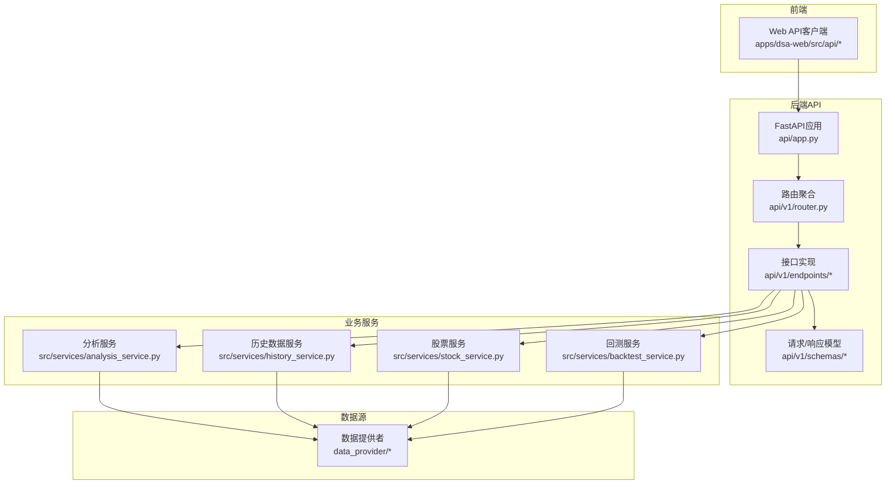
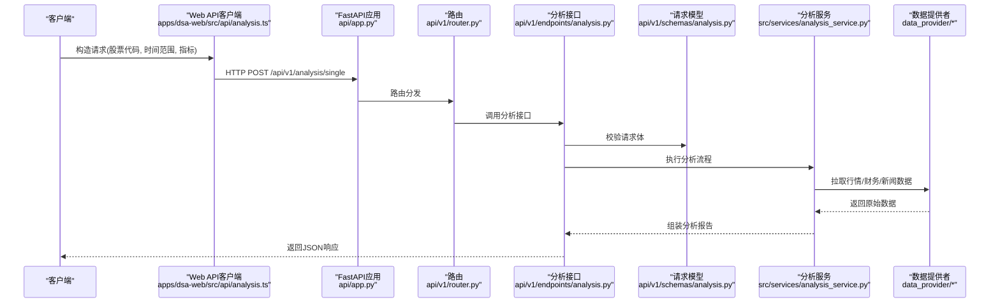
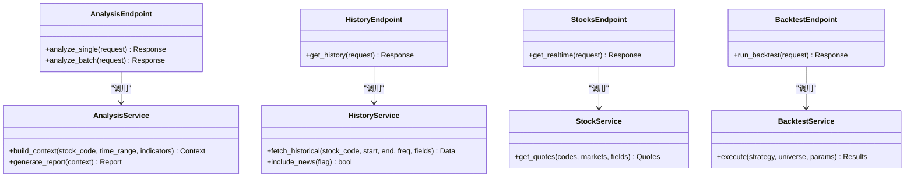

# 股票分析API示例

<cite>
**本文引用的文件**   
- [api/v1/router.py](file://api/v1/router.py)
- [api/v1/endpoints/analysis.py](file://api/v1/endpoints/analysis.py)
- [api/v1/schemas/analysis.py](file://api/v1/schemas/analysis.py)
- [api/v1/endpoints/history.py](file://api/v1/endpoints/history.py)
- [api/v1/schemas/history.py](file://api/v1/schemas/history.py)
- [api/v1/endpoints/stocks.py](file://api/v1/endpoints/stocks.py)
- [api/v1/schemas/stocks.py](file://api/v1/schemas/stocks.py)
- [api/v1/endpoints/backtest.py](file://api/v1/endpoints/backtest.py)
- [api/v1/schemas/backtest.py](file://api/v1/schemas/backtest.py)
- [api/app.py](file://api/app.py)
- [src/services/analysis_service.py](file://src/services/analysis_service.py)
- [src/services/history_service.py](file://src/services/history_service.py)
- [src/services/stock_service.py](file://src/services/stock_service.py)
- [src/services/backtest_service.py](file://src/services/backtest_service.py)
- [apps/dsa-web/src/api/analysis.ts](file://apps/dsa-web/src/api/analysis.ts)
- [apps/dsa-web/src/api/history.ts](file://apps/dsa-web/src/api/history.ts)
- [apps/dsa-web/src/api/stocks.ts](file://apps/dsa-web/src/api/stocks.ts)
- [apps/dsa-web/src/api/backtest.ts](file://apps/dsa-web/src/api/backtest.ts)
</cite>

## 目录
1. [简介](#简介)
2. [项目结构](#项目结构)
3. [核心组件](#核心组件)
4. [架构总览](#架构总览)
5. [详细组件分析](#详细组件分析)
6. [依赖关系分析](#依赖关系分析)
7. [性能考虑](#性能考虑)
8. [故障排查指南](#故障排查指南)
9. [结论](#结论)
10. [附录](#附录)

## 简介
本文件面向希望调用“股票分析API”的开发者，提供个股分析、技术分析、基本面分析、新闻分析等功能的接口使用示例与说明。文档涵盖：
- 请求参数说明（股票代码、时间范围、分析指标等）
- 响应数据格式
- 批量分析、实时数据获取、历史数据分析的高级用法
- Python SDK、JavaScript客户端与curl命令的多语言调用方式

该API基于FastAPI构建，前端为React应用，后端服务通过服务层与数据源对接，支持A股、港股、美股及加密货币等多市场数据。

## 项目结构
本项目采用前后端分离架构：
- 后端：api 模块定义路由、中间件、错误处理；v1 版本下按功能划分 endpoints 与 schemas；业务逻辑集中在 src/services；数据获取由 data_provider 实现。
- 前端：apps/dsa-web 包含 API 客户端封装、页面与状态管理。

图表来源
- [api/app.py](file://api/app.py)
- [api/v1/router.py](file://api/v1/router.py)
- [api/v1/endpoints/analysis.py](file://api/v1/endpoints/analysis.py)
- [api/v1/endpoints/history.py](file://api/v1/endpoints/history.py)
- [api/v1/endpoints/stocks.py](file://api/v1/endpoints/stocks.py)
- [api/v1/endpoints/backtest.py](file://api/v1/endpoints/backtest.py)
- [src/services/analysis_service.py](file://src/services/analysis_service.py)
- [src/services/history_service.py](file://src/services/history_service.py)
- [src/services/stock_service.py](file://src/services/stock_service.py)
- [src/services/backtest_service.py](file://src/services/backtest_service.py)

章节来源
- [api/app.py](file://api/app.py)
- [api/v1/router.py](file://api/v1/router.py)

## 核心组件
- 路由与中间件：统一注册API路由，集中处理鉴权与错误。
- 接口实现：按功能划分 endpoints，接收并校验请求体，调用对应服务。
- 数据模型：Pydantic schema 定义请求与响应的字段、类型与约束。
- 服务层：封装业务逻辑，协调数据源与外部工具。
- 数据提供者：适配多数据源（如Tushare、AkShare、YFinance等）。

章节来源
- [api/v1/endpoints/analysis.py](file://api/v1/endpoints/analysis.py)
- [api/v1/schemas/analysis.py](file://api/v1/schemas/analysis.py)
- [api/v1/endpoints/history.py](file://api/v1/endpoints/history.py)
- [api/v1/schemas/history.py](file://api/v1/schemas/history.py)
- [api/v1/endpoints/stocks.py](file://api/v1/endpoints/stocks.py)
- [api/v1/schemas/stocks.py](file://api/v1/schemas/stocks.py)
- [api/v1/endpoints/backtest.py](file://api/v1/endpoints/backtest.py)
- [api/v1/schemas/backtest.py](file://api/v1/schemas/backtest.py)
- [src/services/analysis_service.py](file://src/services/analysis_service.py)
- [src/services/history_service.py](file://src/services/history_service.py)
- [src/services/stock_service.py](file://src/services/stock_service.py)
- [src/services/backtest_service.py](file://src/services/backtest_service.py)

## 架构总览
下图展示一次“个股分析”请求从前端到后端的完整调用链，包括鉴权、参数校验、服务编排与数据获取。

图表来源
- [apps/dsa-web/src/api/analysis.ts](file://apps/dsa-web/src/api/analysis.ts)
- [api/app.py](file://api/app.py)
- [api/v1/router.py](file://api/v1/router.py)
- [api/v1/endpoints/analysis.py](file://api/v1/endpoints/analysis.py)
- [api/v1/schemas/analysis.py](file://api/v1/schemas/analysis.py)
- [src/services/analysis_service.py](file://src/services/analysis_service.py)

## 详细组件分析

### 个股分析接口（单只股票）
- 功能：对指定股票进行技术面、基本面、新闻面的综合分析，输出结构化报告。
- 典型路径：POST /api/v1/analysis/single
- 请求体关键字段（以schema为准）：
  - stock_code: 股票代码（支持A/H/U市场前缀或自动识别）
  - time_range: 时间范围（如最近N日、自定义起止日期）
  - indicators: 技术指标列表（如MA、MACD、RSI、布林带等）
  - fundamentals: 基本面指标开关（PE/PB/ROE/营收增速等）
  - news_scope: 新闻范围（关键词、来源、时间窗口）
  - language: 报告语言（中文/英文）
- 响应体关键字段：
  - summary: 综合摘要
  - technical: 技术面结论与关键指标值
  - fundamental: 基本面评分与关键比率
  - news: 新闻要点与情绪倾向
  - risk: 风险提示与建议
  - metadata: 数据来源、时间戳、版本号

章节来源
- [api/v1/endpoints/analysis.py](file://api/v1/endpoints/analysis.py)
- [api/v1/schemas/analysis.py](file://api/v1/schemas/analysis.py)
- [src/services/analysis_service.py](file://src/services/analysis_service.py)

#### 调用示例
- curl
  - 方法：POST
  - 路径：/api/v1/analysis/single
  - 头部：Content-Type: application/json
  - 主体：包含 stock_code、time_range、indicators、fundamentals、news_scope、language
- Python SDK
  - 使用 requests 或项目内封装客户端，构造请求体并发送POST请求
- JavaScript客户端
  - 参考 apps/dsa-web/src/api/analysis.ts 中的函数签名与参数映射

### 批量分析接口
- 功能：一次性提交多只股票的分析任务，支持异步队列与进度查询。
- 典型路径：POST /api/v1/analysis/batch
- 请求体关键字段：
  - stocks: 股票列表（每项含 stock_code、可选覆盖参数）
  - options: 全局选项（时间范围、指标、语言等）
  - async: 是否异步执行（true/false）
- 响应体关键字段：
  - task_id: 任务ID（异步时）
  - results: 同步结果数组（每项含单只股票的分析结果）
  - status: 任务状态（pending/running/completed/failed）

章节来源
- [api/v1/endpoints/analysis.py](file://api/v1/endpoints/analysis.py)
- [api/v1/schemas/analysis.py](file://api/v1/schemas/analysis.py)
- [src/services/analysis_service.py](file://src/services/analysis_service.py)

#### 调用示例
- curl：POST /api/v1/analysis/batch，主体包含 stocks 与 options
- Python SDK：循环或并发提交任务，根据 async 标志轮询任务状态
- JavaScript客户端：封装批量提交与状态轮询逻辑

### 历史数据分析接口
- 功能：获取指定股票的历史K线、成交量、财务指标与新闻事件序列。
- 典型路径：GET/POST /api/v1/history
- 请求体关键字段：
  - stock_code: 股票代码
  - start_date/end_date: 起止日期
  - frequency: 频率（日线/周线/月线）
  - fields: 字段选择（open/close/high/low/volume等）
  - include_news: 是否包含新闻事件
- 响应体关键字段：
  - data: 时间序列数据数组
  - meta: 元信息（股票名称、交易所、数据源、更新时间）

章节来源
- [api/v1/endpoints/history.py](file://api/v1/endpoints/history.py)
- [api/v1/schemas/history.py](file://api/v1/schemas/history.py)
- [src/services/history_service.py](file://src/services/history_service.py)

#### 调用示例
- curl：GET/POST /api/v1/history，携带 stock_code、时间范围与字段选择
- Python SDK：构造查询对象并调用历史数据服务
- JavaScript客户端：参考 apps/dsa-web/src/api/history.ts 的参数映射

### 实时数据获取接口
- 功能：获取当前或最新行情快照、盘口数据与资金流向。
- 典型路径：GET /api/v1/stocks/realtime
- 请求体关键字段：
  - stock_codes: 股票代码数组
  - markets: 市场过滤（A/H/U/Crypto）
  - fields: 所需字段（价格、涨跌幅、成交量、换手率等）
- 响应体关键字段：
  - quotes: 实时报价数组
  - timestamp: 数据时间戳
  - source: 数据源标识

章节来源
- [api/v1/endpoints/stocks.py](file://api/v1/endpoints/stocks.py)
- [api/v1/schemas/stocks.py](file://api/v1/schemas/stocks.py)
- [src/services/stock_service.py](file://src/services/stock_service.py)

#### 调用示例
- curl：GET /api/v1/stocks/realtime?stock_codes=...&markets=...
- Python SDK：批量查询并缓存结果
- JavaScript客户端：定时刷新或WebSocket订阅（若启用）

### 回测与分析接口
- 功能：对策略在历史数据进行回测，输出收益曲线、风险指标与交易明细。
- 典型路径：POST /api/v1/backtest/run
- 请求体关键字段：
  - strategy: 策略配置（入场/出场规则、仓位管理）
  - universe: 标的池（股票列表或指数）
  - params: 回测参数（起始/结束日期、初始资金、手续费、滑点）
  - output_fields: 输出字段（净值、回撤、夏普比率等）
- 响应体关键字段：
  - metrics: 回测指标汇总
  - trades: 交易明细
  - equity_curve: 净值曲线数据
  - report: 文本化报告摘要

章节来源
- [api/v1/endpoints/backtest.py](file://api/v1/endpoints/backtest.py)
- [api/v1/schemas/backtest.py](file://api/v1/schemas/backtest.py)
- [src/services/backtest_service.py](file://src/services/backtest_service.py)

#### 调用示例
- curl：POST /api/v1/backtest/run，主体包含策略与参数
- Python SDK：序列化策略配置并发起回测任务
- JavaScript客户端：可视化渲染回测结果

### 高级用法：组合分析与流式处理
- 组合分析：将历史数据、实时行情与新闻事件融合，生成多维度的决策信号。
- 流式处理：对于长耗时任务（如批量分析、回测），服务端可推送进度事件，客户端逐步更新UI。

章节来源
- [src/services/analysis_service.py](file://src/services/analysis_service.py)
- [src/services/history_service.py](file://src/services/history_service.py)
- [src/services/stock_service.py](file://src/services/stock_service.py)
- [src/services/backtest_service.py](file://src/services/backtest_service.py)

## 依赖关系分析
- 路由层依赖中间件（鉴权、错误处理）与Pydantic模型校验。
- 接口实现依赖服务层，服务层再依赖数据提供者与外部LLM/搜索服务。
- 前端客户端封装HTTP调用，遵循后端schema约定。

图表来源
- [api/v1/endpoints/analysis.py](file://api/v1/endpoints/analysis.py)
- [api/v1/endpoints/history.py](file://api/v1/endpoints/history.py)
- [api/v1/endpoints/stocks.py](file://api/v1/endpoints/stocks.py)
- [api/v1/endpoints/backtest.py](file://api/v1/endpoints/backtest.py)
- [src/services/analysis_service.py](file://src/services/analysis_service.py)
- [src/services/history_service.py](file://src/services/history_service.py)
- [src/services/stock_service.py](file://src/services/stock_service.py)
- [src/services/backtest_service.py](file://src/services/backtest_service.py)

章节来源
- [api/v1/router.py](file://api/v1/router.py)
- [api/app.py](file://api/app.py)

## 性能考虑
- 批量分析建议开启异步模式，避免阻塞主线程。
- 历史数据查询应合理设置时间范围与频率，减少不必要的数据量。
- 实时数据获取可采用缓存与增量更新策略，降低重复请求。
- 数据源切换与降级：当某数据源不可用时，自动切换到备用源。
- 前端分页与懒加载：对长列表与大图资源进行优化。

[本节为通用指导，不直接分析具体文件]

## 故障排查指南
- 常见错误码：
  - 400：请求参数校验失败（检查stock_code、时间范围、指标字段）
  - 401/403：鉴权失败（检查Token或权限配置）
  - 404：接口不存在或路径错误
  - 429：请求频率限制（降低请求速率）
  - 500：服务器内部错误（查看日志与数据源状态）
- 调试步骤：
  - 使用curl最小化请求复现问题
  - 检查后端日志与服务健康状态
  - 验证数据源连通性与配额
  - 前端网络面板查看请求与响应细节

章节来源
- [api/v1/errors.py](file://api/v1/errors.py)
- [api/middlewares/error_handler.py](file://api/middlewares/error_handler.py)

## 结论
本API提供了完整的股票分析能力，覆盖个股分析、历史数据、实时行情与回测等场景。通过清晰的请求/响应模型与服务分层设计，便于在不同语言环境中集成。建议在生产环境启用异步批量处理、缓存与降级策略，以提升稳定性与性能。

[本节为总结性内容，不直接分析具体文件]

## 附录

### 请求与响应字段速查表
- 个股分析（analysis.single）
  - 请求：stock_code、time_range、indicators、fundamentals、news_scope、language
  - 响应：summary、technical、fundamental、news、risk、metadata
- 批量分析（analysis.batch）
  - 请求：stocks[]、options、async
  - 响应：task_id、results[]、status
- 历史数据（history）
  - 请求：stock_code、start_date、end_date、frequency、fields、include_news
  - 响应：data[]、meta
- 实时行情（stocks.realtime）
  - 请求：stock_codes[]、markets、fields
  - 响应：quotes[]、timestamp、source
- 回测（backtest.run）
  - 请求：strategy、universe、params、output_fields
  - 响应：metrics、trades[]、equity_curve[]、report

章节来源
- [api/v1/schemas/analysis.py](file://api/v1/schemas/analysis.py)
- [api/v1/schemas/history.py](file://api/v1/schemas/history.py)
- [api/v1/schemas/stocks.py](file://api/v1/schemas/stocks.py)
- [api/v1/schemas/backtest.py](file://api/v1/schemas/backtest.py)

### 多语言调用示例指引
- curl
  - 使用POST/GET方法与相应路径，设置Content-Type与必要参数
- Python SDK
  - 参考 apps/dsa-web/src/api/analysis.ts、apps/dsa-web/src/api/history.ts、apps/dsa-web/src/api/stocks.ts、apps/dsa-web/src/api/backtest.ts 中的参数结构与调用方式，转换为Python请求
- JavaScript客户端
  - 直接使用 apps/dsa-web/src/api/* 中的封装函数，传入对应参数对象

章节来源
- [apps/dsa-web/src/api/analysis.ts](file://apps/dsa-web/src/api/analysis.ts)
- [apps/dsa-web/src/api/history.ts](file://apps/dsa-web/src/api/history.ts)
- [apps/dsa-web/src/api/stocks.ts](file://apps/dsa-web/src/api/stocks.ts)
- [apps/dsa-web/src/api/backtest.ts](file://apps/dsa-web/src/api/backtest.ts)