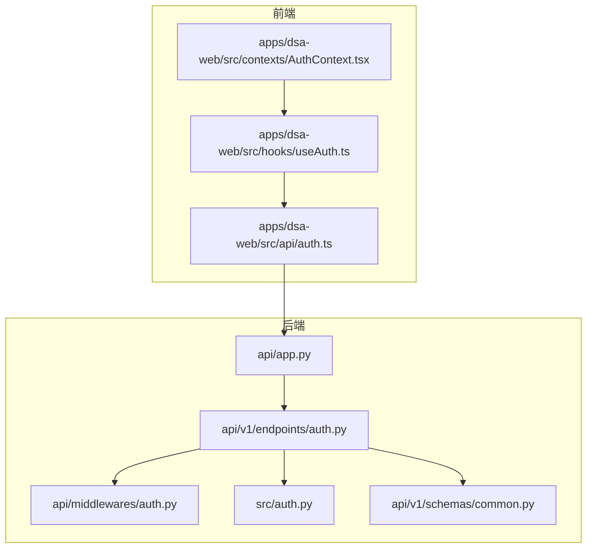
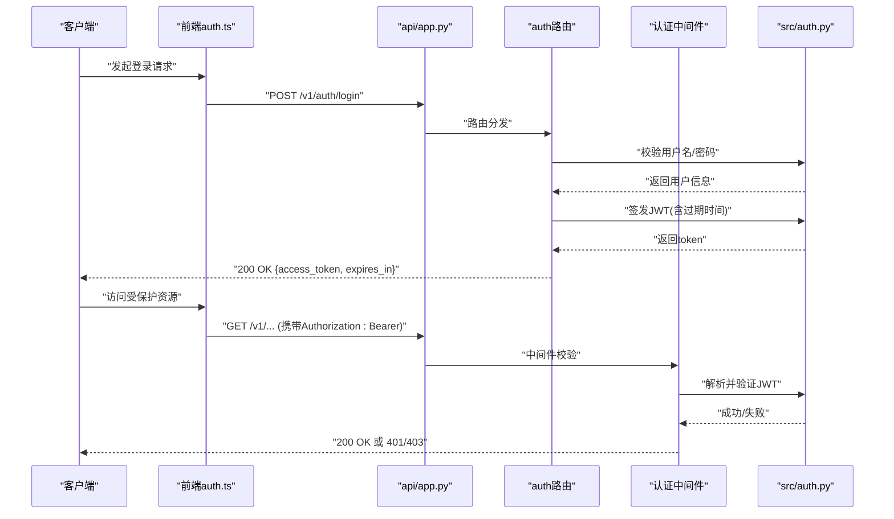
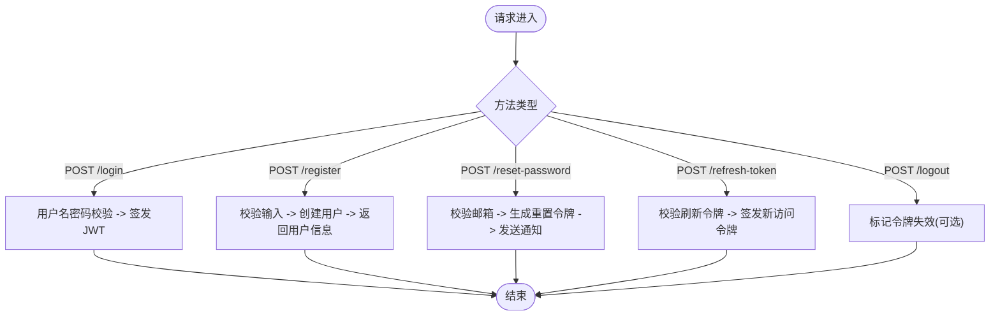
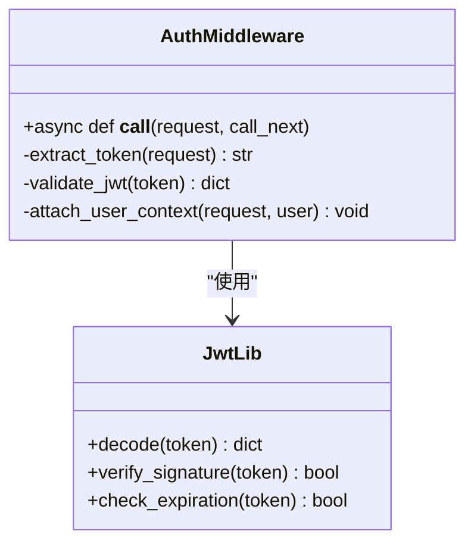
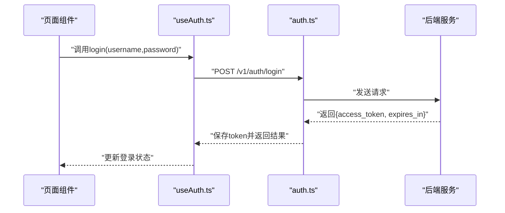
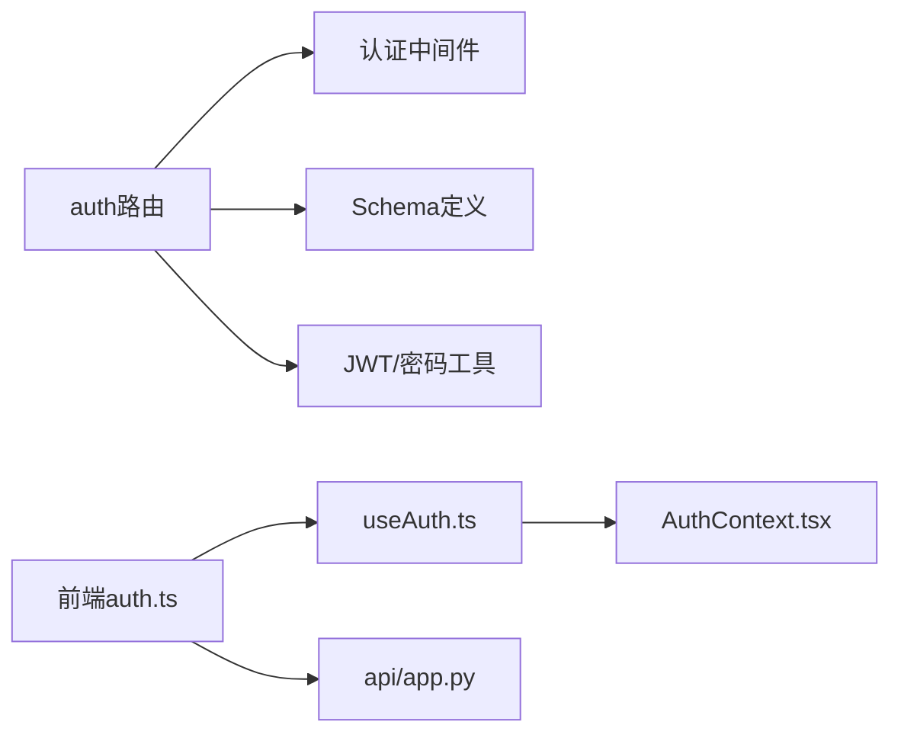

# 认证API示例

<cite>
**本文引用的文件**   
- [api/v1/endpoints/auth.py](file://api/v1/endpoints/auth.py)
- [api/middlewares/auth.py](file://api/middlewares/auth.py)
- [src/auth.py](file://src/auth.py)
- [apps/dsa-web/src/api/auth.ts](file://apps/dsa-web/src/api/auth.ts)
- [apps/dsa-web/src/hooks/useAuth.ts](file://apps/dsa-web/src/hooks/useAuth.ts)
- [apps/dsa-web/src/contexts/AuthContext.tsx](file://apps/dsa-web/src/contexts/AuthContext.tsx)
- [api/v1/schemas/common.py](file://api/v1/schemas/common.py)
- [api/app.py](file://api/app.py)
- [tests/test_auth_api.py](file://tests/test_auth_api.py)
</cite>

## 目录
1. [简介](#简介)
2. [项目结构](#项目结构)
3. [核心组件](#核心组件)
4. [架构总览](#架构总览)
5. [详细组件分析](#详细组件分析)
6. [依赖分析](#依赖分析)
7. [性能考虑](#性能考虑)
8. [故障排查指南](#故障排查指南)
9. [结论](#结论)
10. [附录：调用示例与最佳实践](#附录调用示例与最佳实践)

## 简介
本文件面向开发者，提供认证相关API的完整调用示例与说明，覆盖用户登录、注册、密码重置、JWT令牌管理（签发、刷新、校验）、OAuth2流程以及权限验证。文档包含请求/响应格式、错误处理、安全最佳实践，并提供Python SDK、JavaScript客户端和curl命令的多语言调用示例。

## 项目结构
认证能力在后端由FastAPI路由与中间件实现，前端通过TypeScript API封装与React上下文管理认证状态。关键路径如下：
- 后端认证路由：api/v1/endpoints/auth.py
- 认证中间件：api/middlewares/auth.py
- JWT与认证工具：src/auth.py
- 前端认证API封装：apps/dsa-web/src/api/auth.ts
- 前端认证Hook与上下文：apps/dsa-web/src/hooks/useAuth.ts、apps/dsa-web/src/contexts/AuthContext.tsx
- 通用Schema定义：api/v1/schemas/common.py
- 应用装配：api/app.py
- 认证接口测试：tests/test_auth_api.py

图表来源 
- [api/app.py](file://api/app.py)
- [api/v1/endpoints/auth.py](file://api/v1/endpoints/auth.py)
- [api/middlewares/auth.py](file://api/middlewares/auth.py)
- [src/auth.py](file://src/auth.py)
- [api/v1/schemas/common.py](file://api/v1/schemas/common.py)
- [apps/dsa-web/src/api/auth.ts](file://apps/dsa-web/src/api/auth.ts)
- [apps/dsa-web/src/hooks/useAuth.ts](file://apps/dsa-web/src/hooks/useAuth.ts)
- [apps/dsa-web/src/contexts/AuthContext.tsx](file://apps/dsa-web/src/contexts/AuthContext.tsx)

章节来源
- [api/app.py](file://api/app.py)
- [api/v1/endpoints/auth.py](file://api/v1/endpoints/auth.py)
- [api/middlewares/auth.py](file://api/middlewares/auth.py)
- [src/auth.py](file://src/auth.py)
- [api/v1/schemas/common.py](file://api/v1/schemas/common.py)
- [apps/dsa-web/src/api/auth.ts](file://apps/dsa-web/src/api/auth.ts)
- [apps/dsa-web/src/hooks/useAuth.ts](file://apps/dsa-web/src/hooks/useAuth.ts)
- [apps/dsa-web/src/contexts/AuthContext.tsx](file://apps/dsa-web/src/contexts/AuthContext.tsx)

## 核心组件
- 认证路由层：提供登录、注册、密码重置、令牌签发与刷新等HTTP端点。
- 认证中间件：统一鉴权拦截、JWT校验、权限检查。
- 认证库：JWT签发/解析、密码哈希、令牌策略。
- 前端封装：统一的认证API调用、错误处理、Token存储与自动刷新。
- Schema定义：输入输出数据模型，保证前后端契约一致。

章节来源
- [api/v1/endpoints/auth.py](file://api/v1/endpoints/auth.py)
- [api/middlewares/auth.py](file://api/middlewares/auth.py)
- [src/auth.py](file://src/auth.py)
- [api/v1/schemas/common.py](file://api/v1/schemas/common.py)
- [apps/dsa-web/src/api/auth.ts](file://apps/dsa-web/src/api/auth.ts)

## 架构总览
下图展示从前端到后端的认证请求链路，包括登录、令牌签发、后续受保护接口的鉴权流程。

图表来源 
- [api/app.py](file://api/app.py)
- [api/v1/endpoints/auth.py](file://api/v1/endpoints/auth.py)
- [api/middlewares/auth.py](file://api/middlewares/auth.py)
- [src/auth.py](file://src/auth.py)

## 详细组件分析

### 认证路由（登录、注册、密码重置、令牌）
- 登录：支持用户名+密码认证，成功后返回访问令牌与过期时间。
- 注册：创建新用户，返回用户基本信息。
- 密码重置：发送重置链接或临时口令（根据配置），确保邮箱验证。
- 令牌刷新：使用刷新令牌换取新的访问令牌。
- 登出：使当前令牌失效（若支持黑名单）。

图表来源 
- [api/v1/endpoints/auth.py](file://api/v1/endpoints/auth.py)

章节来源
- [api/v1/endpoints/auth.py](file://api/v1/endpoints/auth.py)

### 认证中间件（鉴权与权限）
- 统一拦截受保护路由，提取Authorization头中的Bearer Token。
- 解析JWT，校验签名与过期时间。
- 将用户上下文注入请求，供业务逻辑使用。
- 基于角色或权限进行细粒度授权。

图表来源 
- [api/middlewares/auth.py](file://api/middlewares/auth.py)
- [src/auth.py](file://src/auth.py)

章节来源
- [api/middlewares/auth.py](file://api/middlewares/auth.py)
- [src/auth.py](file://src/auth.py)

### 前端认证封装（TypeScript）
- 封装登录、注册、密码重置、令牌刷新等API调用。
- 自动附加Authorization头，处理401/403错误。
- 本地存储Token，支持刷新机制。
- 暴露useAuth Hook，提供登录状态、用户信息与登出操作。

图表来源 
- [apps/dsa-web/src/api/auth.ts](file://apps/dsa-web/src/api/auth.ts)
- [apps/dsa-web/src/hooks/useAuth.ts](file://apps/dsa-web/src/hooks/useAuth.ts)

章节来源
- [apps/dsa-web/src/api/auth.ts](file://apps/dsa-web/src/api/auth.ts)
- [apps/dsa-web/src/hooks/useAuth.ts](file://apps/dsa-web/src/hooks/useAuth.ts)
- [apps/dsa-web/src/contexts/AuthContext.tsx](file://apps/dsa-web/src/contexts/AuthContext.tsx)

### 数据模型（Schema）
- 登录请求：用户名、密码。
- 登录响应：访问令牌、过期时间。
- 注册请求：用户名、邮箱、密码等。
- 密码重置请求：邮箱或用户标识。
- 刷新令牌请求：刷新令牌。
- 通用错误响应：错误码、消息。

章节来源
- [api/v1/schemas/common.py](file://api/v1/schemas/common.py)

## 依赖分析
- 后端依赖：FastAPI路由、Pydantic Schema、JWT库、密码哈希库。
- 前端依赖：Fetch/Axios、LocalStorage、React Context/Hook。
- 中间件依赖：JWT解析、用户上下文注入。

图表来源 
- [api/v1/endpoints/auth.py](file://api/v1/endpoints/auth.py)
- [api/middlewares/auth.py](file://api/middlewares/auth.py)
- [api/v1/schemas/common.py](file://api/v1/schemas/common.py)
- [src/auth.py](file://src/auth.py)
- [apps/dsa-web/src/api/auth.ts](file://apps/dsa-web/src/api/auth.ts)
- [apps/dsa-web/src/hooks/useAuth.ts](file://apps/dsa-web/src/hooks/useAuth.ts)
- [apps/dsa-web/src/contexts/AuthContext.tsx](file://apps/dsa-web/src/contexts/AuthContext.tsx)
- [api/app.py](file://api/app.py)

章节来源
- [api/v1/endpoints/auth.py](file://api/v1/endpoints/auth.py)
- [api/middlewares/auth.py](file://api/middlewares/auth.py)
- [api/v1/schemas/common.py](file://api/v1/schemas/common.py)
- [src/auth.py](file://src/auth.py)
- [apps/dsa-web/src/api/auth.ts](file://apps/dsa-web/src/api/auth.ts)
- [apps/dsa-web/src/hooks/useAuth.ts](file://apps/dsa-web/src/hooks/useAuth.ts)
- [apps/dsa-web/src/contexts/AuthContext.tsx](file://apps/dsa-web/src/contexts/AuthContext.tsx)
- [api/app.py](file://api/app.py)

## 性能考虑
- 令牌刷新：避免频繁重新登录，合理设置过期时间。
- 缓存策略：前端缓存用户信息，减少重复请求。
- 并发控制：限制登录尝试次数，防止暴力破解。
- 异步处理：密码重置邮件发送采用异步任务。

[本节为通用指导，不直接分析具体文件]

## 故障排查指南
- 401未授权：检查Authorization头是否正确携带Bearer Token。
- 403禁止访问：确认用户权限是否足够。
- 令牌过期：触发刷新流程，获取新令牌。
- 网络错误：检查后端服务状态与网络连通性。

章节来源
- [tests/test_auth_api.py](file://tests/test_auth_api.py)

## 结论
本项目提供了完整的认证API体系，涵盖登录、注册、密码重置、JWT管理与权限校验。前端封装简化了调用复杂度，中间件确保了安全性与一致性。遵循本文档的最佳实践与示例，可快速集成并稳定运行。

[本节为总结，不直接分析具体文件]

## 附录：调用示例与最佳实践

### 用户登录
- 请求方法：POST /v1/auth/login
- 请求体：用户名、密码
- 响应体：访问令牌、过期时间

curl示例
- curl -X POST https://your-domain.com/v1/auth/login -H "Content-Type: application/json" -d '{"username":"user","password":"pass"}'

Python SDK示例
- 使用requests或httpx发送POST请求，携带JSON主体，解析响应中的access_token与expires_in字段。

JavaScript客户端示例
- 使用fetch或axios调用登录接口，保存返回的access_token至localStorage或内存。

章节来源
- [api/v1/endpoints/auth.py](file://api/v1/endpoints/auth.py)
- [api/v1/schemas/common.py](file://api/v1/schemas/common.py)
- [apps/dsa-web/src/api/auth.ts](file://apps/dsa-web/src/api/auth.ts)

### 用户注册
- 请求方法：POST /v1/auth/register
- 请求体：用户名、邮箱、密码
- 响应体：用户基本信息

curl示例
- curl -X POST https://your-domain.com/v1/auth/register -H "Content-Type: application/json" -d '{"username":"newuser","email":"user@example.com","password":"securepass"}'

Python SDK示例
- 发送注册请求，处理成功或失败响应，提示用户注册结果。

JavaScript客户端示例
- 调用注册API，成功后跳转登录页或显示欢迎信息。

章节来源
- [api/v1/endpoints/auth.py](file://api/v1/endpoints/auth.py)
- [api/v1/schemas/common.py](file://api/v1/schemas/common.py)
- [apps/dsa-web/src/api/auth.ts](file://apps/dsa-web/src/api/auth.ts)

### 密码重置
- 请求方法：POST /v1/auth/reset-password
- 请求体：邮箱或用户标识
- 响应体：操作结果（如已发送邮件）

curl示例
- curl -X POST https://your-domain.com/v1/auth/reset-password -H "Content-Type: application/json" -d '{"email":"user@example.com"}'

Python SDK示例
- 发送重置请求，等待用户点击邮件链接完成重置。

JavaScript客户端示例
- 调用重置接口，提示用户检查邮箱。

章节来源
- [api/v1/endpoints/auth.py](file://api/v1/endpoints/auth.py)
- [api/v1/schemas/common.py](file://api/v1/schemas/common.py)
- [apps/dsa-web/src/api/auth.ts](file://apps/dsa-web/src/api/auth.ts)

### JWT令牌管理
- 签发：登录成功后获得access_token。
- 刷新：使用refresh_token换取新access_token。
- 校验：中间件自动校验令牌有效性。
- 登出：可选地使令牌失效。

curl示例
- 刷新令牌：curl -X POST https://your-domain.com/v1/auth/refresh-token -H "Content-Type: application/json" -d '{"refresh_token":"your_refresh_token"}'

Python SDK示例
- 实现令牌刷新逻辑，自动处理过期与重试。

JavaScript客户端示例
- 在请求前检查令牌有效期，必要时触发刷新。

章节来源
- [api/v1/endpoints/auth.py](file://api/v1/endpoints/auth.py)
- [src/auth.py](file://src/auth.py)
- [api/middlewares/auth.py](file://api/middlewares/auth.py)
- [apps/dsa-web/src/api/auth.ts](file://apps/dsa-web/src/api/auth.ts)

### OAuth2流程
- 授权码模式：重定向至授权服务器，回调时交换code为token。
- 隐式模式：直接在浏览器中获取token（不推荐）。
- 客户端模式：适用于机器对机器场景。

curl示例
- 授权码模式第一步：curl -L "https://oauth-provider.com/authorize?client_id=your_client_id&redirect_uri=https://your-domain.com/callback&response_type=code"

Python SDK示例
- 使用OAuth2库（如requests-oauthlib）实现授权码流程。

JavaScript客户端示例
- 使用Auth0或Keycloak SDK简化OAuth2集成。

章节来源
- [api/v1/endpoints/auth.py](file://api/v1/endpoints/auth.py)
- [src/auth.py](file://src/auth.py)

### 权限验证
- 基于角色的访问控制（RBAC）：在中间件中检查用户角色。
- 细粒度权限：在路由层验证操作权限。
- 动态权限：从数据库或配置加载权限规则。

curl示例
- 访问受保护资源：curl -H "Authorization: Bearer your_access_token" https://your-domain.com/v1/protected-resource

Python SDK示例
- 在请求头中附加Authorization，处理403错误。

JavaScript客户端示例
- 全局拦截器附加令牌，处理权限错误提示。

章节来源
- [api/middlewares/auth.py](file://api/middlewares/auth.py)
- [api/v1/endpoints/auth.py](file://api/v1/endpoints/auth.py)
- [apps/dsa-web/src/api/auth.ts](file://apps/dsa-web/src/api/auth.ts)

### 错误处理与安全最佳实践
- 错误处理：统一错误响应格式，区分401与403。
- 安全实践：使用HTTPS、最小权限原则、令牌短期有效。
- 常见问题：令牌丢失、跨域问题、并发登录限制。

章节来源
- [tests/test_auth_api.py](file://tests/test_auth_api.py)
- [api/middlewares/auth.py](file://api/middlewares/auth.py)
- [src/auth.py](file://src/auth.py)