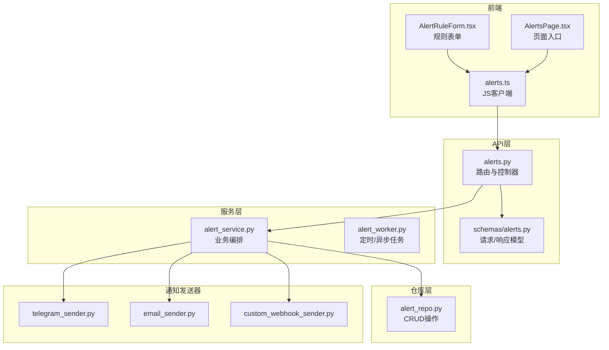
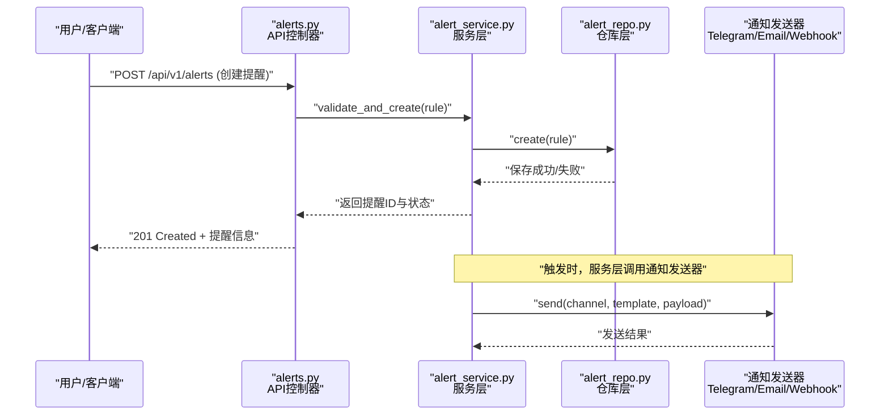

# 通知提醒API示例

<cite>
**本文档引用的文件**   
- [api/v1/endpoints/alerts.py](file://api/v1/endpoints/alerts.py)
- [api/v1/schemas/alerts.py](file://api/v1/schemas/alerts.py)
- [src/services/alert_service.py](file://src/services/alert_service.py)
- [src/repositories/alert_repo.py](file://src/repositories/alert_repo.py)
- [src/notification_sender/telegram_sender.py](file://src/notification_sender/telegram_sender.py)
- [src/notification_sender/email_sender.py](file://src/notification_sender/email_sender.py)
- [src/notification_sender/custom_webhook_sender.py](file://src/notification_sender/custom_webhook_sender.py)
- [src/notification_capabilities.py](file://src/notification_capabilities.py)
- [src/notification_routing.py](file://src/notification_routing.py)
- [apps/dsa-web/src/api/alerts.ts](file://apps/dsa-web/src/api/alerts.ts)
- [apps/dsa-web/src/components/alerts/AlertRuleForm.tsx](file://apps/dsa-web/src/components/alerts/AlertRuleForm.tsx)
- [apps/dsa-web/src/pages/AlertsPage.tsx](file://apps/dsa-web/src/pages/AlertsPage.tsx)
- [tests/test_alert_api.py](file://tests/test_alert_api.py)
- [docs/alerts.md](file://docs/alerts.md)
</cite>

## 目录
1. [简介](#简介)
2. [项目结构](#项目结构)
3. [核心组件](#核心组件)
4. [架构总览](#架构总览)
5. [详细组件分析](#详细组件分析)
6. [依赖关系分析](#依赖关系分析)
7. [性能考虑](#性能考虑)
8. [故障排查指南](#故障排查指南)
9. [结论](#结论)
10. [附录](#附录)

## 简介
本文件面向开发者与使用者，提供“通知提醒”功能的完整API调用示例与最佳实践。覆盖价格提醒、技术指标提醒、新闻提醒等场景，包含：
- 完整的提醒规则配置项说明
- 触发条件与组合逻辑
- 多渠道通知推送（Telegram、Email、Webhook等）
- 批量创建提醒的高级用法
- Python SDK、JavaScript客户端与curl命令的多种调用方式

该功能由后端REST API暴露，前端通过JS客户端调用，服务层负责规则解析、数据校验与调度，仓库层持久化提醒规则，通知发送器负责多渠道投递。

## 项目结构
围绕“通知提醒”的核心代码分布在以下模块：
- API层：路由与请求响应定义
- Schema层：Pydantic模型约束
- 服务层：业务逻辑编排
- 仓库层：数据持久化
- 通知发送器：多渠道消息投递
- 前端：Web端表单与列表交互

图表来源
- [api/v1/endpoints/alerts.py](file://api/v1/endpoints/alerts.py)
- [api/v1/schemas/alerts.py](file://api/v1/schemas/alerts.py)
- [src/services/alert_service.py](file://src/services/alert_service.py)
- [src/repositories/alert_repo.py](file://src/repositories/alert_repo.py)
- [src/notification_sender/telegram_sender.py](file://src/notification_sender/telegram_sender.py)
- [src/notification_sender/email_sender.py](file://src/notification_sender/email_sender.py)
- [src/notification_sender/custom_webhook_sender.py](file://src/notification_sender/custom_webhook_sender.py)
- [apps/dsa-web/src/api/alerts.ts](file://apps/dsa-web/src/api/alerts.ts)
- [apps/dsa-web/src/components/alerts/AlertRuleForm.tsx](file://apps/dsa-web/src/components/alerts/AlertRuleForm.tsx)
- [apps/dsa-web/src/pages/AlertsPage.tsx](file://apps/dsa-web/src/pages/AlertsPage.tsx)

章节来源
- [api/v1/endpoints/alerts.py](file://api/v1/endpoints/alerts.py)
- [api/v1/schemas/alerts.py](file://api/v1/schemas/alerts.py)
- [src/services/alert_service.py](file://src/services/alert_service.py)
- [src/repositories/alert_repo.py](file://src/repositories/alert_repo.py)
- [src/notification_sender/telegram_sender.py](file://src/notification_sender/telegram_sender.py)
- [src/notification_sender/email_sender.py](file://src/notification_sender/email_sender.py)
- [src/notification_sender/custom_webhook_sender.py](file://src/notification_sender/custom_webhook_sender.py)
- [apps/dsa-web/src/api/alerts.ts](file://apps/dsa-web/src/api/alerts.ts)
- [apps/dsa-web/src/components/alerts/AlertRuleForm.tsx](file://apps/dsa-web/src/components/alerts/AlertRuleForm.tsx)
- [apps/dsa-web/src/pages/AlertsPage.tsx](file://apps/dsa-web/src/pages/AlertsPage.tsx)

## 核心组件
- 提醒规则模型：统一描述提醒类型、标的、条件、阈值、频率、渠道等字段，确保请求与响应一致性。
- 提醒服务：负责规则校验、条件计算、去重与限流、批量创建、触发记录与通知分发。
- 提醒仓库：提供提醒规则的增删改查与分页查询。
- 通知发送器：封装各渠道（Telegram、Email、Webhook等）的发送接口，支持模板渲染与错误重试。
- 前端客户端：封装HTTP请求、错误处理与表单绑定，便于用户快速创建与管理提醒。

章节来源
- [api/v1/schemas/alerts.py](file://api/v1/schemas/alerts.py)
- [src/services/alert_service.py](file://src/services/alert_service.py)
- [src/repositories/alert_repo.py](file://src/repositories/alert_repo.py)
- [src/notification_sender/telegram_sender.py](file://src/notification_sender/telegram_sender.py)
- [src/notification_sender/email_sender.py](file://src/notification_sender/email_sender.py)
- [src/notification_sender/custom_webhook_sender.py](file://src/notification_sender/custom_webhook_sender.py)
- [apps/dsa-web/src/api/alerts.ts](file://apps/dsa-web/src/api/alerts.ts)

## 架构总览
提醒系统采用分层架构：API层接收请求并返回响应；服务层实现业务逻辑；仓库层负责数据访问；通知发送器负责多渠道投递；前端通过JS客户端进行交互。

图表来源
- [api/v1/endpoints/alerts.py](file://api/v1/endpoints/alerts.py)
- [src/services/alert_service.py](file://src/services/alert_service.py)
- [src/repositories/alert_repo.py](file://src/repositories/alert_repo.py)
- [src/notification_sender/telegram_sender.py](file://src/notification_sender/telegram_sender.py)
- [src/notification_sender/email_sender.py](file://src/notification_sender/email_sender.py)
- [src/notification_sender/custom_webhook_sender.py](file://src/notification_sender/custom_webhook_sender.py)

## 详细组件分析

### 提醒规则模型与字段说明
提醒规则用于定义“何时对什么标的发出何种通知”。常见字段包括：
- 提醒类型：价格提醒、技术指标提醒、新闻提醒
- 标的标识：股票代码、指数代码、加密货币代码
- 条件表达式：比较运算符、阈值、时间窗口、指标名称
- 通知渠道：Telegram、Email、Webhook等
- 频率限制：冷却时间、每日上限、重复抑制
- 元数据：标签、优先级、启用状态

章节来源
- [api/v1/schemas/alerts.py](file://api/v1/schemas/alerts.py)
- [src/notification_capabilities.py](file://src/notification_capabilities.py)

### 价格提醒API
- 用途：当标的价格达到或突破阈值时触发通知
- 典型字段：标的、方向（上涨/下跌）、阈值、时间窗口、渠道
- 触发条件：实时行情或周期快照对比
- 通知内容：当前价、阈值、涨跌幅、时间戳

章节来源
- [api/v1/endpoints/alerts.py](file://api/v1/endpoints/alerts.py)
- [src/services/alert_service.py](file://src/services/alert_service.py)

### 技术指标提醒API
- 用途：基于RSI、MACD、均线等技术指标的条件触发
- 典型字段：指标名称、参数、条件（上穿/下穿/超买超卖）、时间窗口
- 触发条件：指标值满足条件且持续一定周期
- 通知内容：指标值、信号类型、历史趋势摘要

章节来源
- [api/v1/endpoints/alerts.py](file://api/v1/endpoints/alerts.py)
- [src/services/alert_service.py](file://src/services/alert_service.py)

### 新闻提醒API
- 用途：基于关键词、来源或情感分析的突发新闻提醒
- 典型字段：关键词、来源过滤、情感阈值、时间窗口
- 触发条件：新闻匹配规则命中且新鲜度达标
- 通知内容：标题、摘要、链接、情感评分、相关标的

章节来源
- [api/v1/endpoints/alerts.py](file://api/v1/endpoints/alerts.py)
- [src/services/alert_service.py](file://src/services/alert_service.py)

### 批量创建提醒
- 用途：一次性创建多条提醒规则，提升效率
- 输入：数组形式的规则列表
- 处理：逐条校验、去重、批量写入
- 输出：成功/失败统计与明细

章节来源
- [api/v1/endpoints/alerts.py](file://api/v1/endpoints/alerts.py)
- [src/services/alert_service.py](file://src/services/alert_service.py)
- [src/repositories/alert_repo.py](file://src/repositories/alert_repo.py)

### 条件组合与高级用法
- AND/OR组合：多个条件可组合为复杂表达式
- 时间窗口：限定触发时间段或持续时间
- 频率控制：冷却时间与每日上限避免噪音
- 多通道：同一提醒可同时推送到多个渠道

章节来源
- [api/v1/schemas/alerts.py](file://api/v1/schemas/alerts.py)
- [src/notification_routing.py](file://src/notification_routing.py)

### 通知渠道设置
- 支持的渠道：Telegram、Email、Webhook等
- 配置项：渠道密钥、目标地址、模板变量
- 测试能力：单条测试发送与回执确认

章节来源
- [src/notification_sender/telegram_sender.py](file://src/notification_sender/telegram_sender.py)
- [src/notification_sender/email_sender.py](file://src/notification_sender/email_sender.py)
- [src/notification_sender/custom_webhook_sender.py](file://src/notification_sender/custom_webhook_sender.py)

### 前端集成与调用
- JS客户端：封装API调用、错误处理与重试
- 表单组件：可视化编辑提醒规则
- 页面入口：列表展示、新增、编辑、删除与触发历史

章节来源
- [apps/dsa-web/src/api/alerts.ts](file://apps/dsa-web/src/api/alerts.ts)
- [apps/dsa-web/src/components/alerts/AlertRuleForm.tsx](file://apps/dsa-web/src/components/alerts/AlertRuleForm.tsx)
- [apps/dsa-web/src/pages/AlertsPage.tsx](file://apps/dsa-web/src/pages/AlertsPage.tsx)

### API调用示例（curl）
- 创建单条提醒：使用POST提交JSON规则
- 批量创建提醒：POST数组形式规则
- 查询提醒列表：GET带分页与过滤参数
- 更新/删除提醒：PUT/PATCH与DELETE方法

章节来源
- [api/v1/endpoints/alerts.py](file://api/v1/endpoints/alerts.py)
- [tests/test_alert_api.py](file://tests/test_alert_api.py)

### Python SDK调用示例
- 初始化客户端：传入基础URL与认证信息
- 创建提醒：调用create方法传入规则对象
- 批量创建：调用batch_create方法传入规则列表
- 查询与更新：调用list、update、delete等方法

章节来源
- [apps/dsa-web/src/api/alerts.ts](file://apps/dsa-web/src/api/alerts.ts)
- [tests/test_alert_api.py](file://tests/test_alert_api.py)

### JavaScript客户端调用示例
- 导入客户端：引入alerts模块
- 创建提醒：调用create函数并处理回调
- 批量创建：调用batchCreate并处理结果
- 错误处理：捕获网络与业务异常

章节来源
- [apps/dsa-web/src/api/alerts.ts](file://apps/dsa-web/src/api/alerts.ts)
- [apps/dsa-web/src/components/alerts/AlertRuleForm.tsx](file://apps/dsa-web/src/components/alerts/AlertRuleForm.tsx)

## 依赖关系分析
提醒系统的依赖关系清晰：API依赖Schema与服务；服务依赖仓库与通知发送器；前端依赖JS客户端。

```mermaid
classDiagram
class AlertController {
+create_rule()
+batch_create()
+list_rules()
+update_rule()
+delete_rule()
}
class AlertService {
+validate_and_create()
+evaluate_conditions()
+send_notification()
+handle_frequency_limit()
}
class AlertRepository {
+create()
+find_by_id()
+list_with_filters()
+update()
+delete()
}
class TelegramSender {
+send(message)
+test_connection()
}
class EmailSender {
+send(subject, body)
+test_connection()
}
class WebhookSender {
+send(url, payload)
+test_connection()
}
AlertController --> AlertService : "调用"
AlertService --> AlertRepository : "读写"
AlertService --> TelegramSender : "通知"
AlertService --> EmailSender : "通知"
AlertService --> WebhookSender : "通知"
```

图表来源
- [api/v1/endpoints/alerts.py](file://api/v1/endpoints/alerts.py)
- [src/services/alert_service.py](file://src/services/alert_service.py)
- [src/repositories/alert_repo.py](file://src/repositories/alert_repo.py)
- [src/notification_sender/telegram_sender.py](file://src/notification_sender/telegram_sender.py)
- [src/notification_sender/email_sender.py](file://src/notification_sender/email_sender.py)
- [src/notification_sender/custom_webhook_sender.py](file://src/notification_sender/custom_webhook_sender.py)

章节来源
- [api/v1/endpoints/alerts.py](file://api/v1/endpoints/alerts.py)
- [src/services/alert_service.py](file://src/services/alert_service.py)
- [src/repositories/alert_repo.py](file://src/repositories/alert_repo.py)
- [src/notification_sender/telegram_sender.py](file://src/notification_sender/telegram_sender.py)
- [src/notification_sender/email_sender.py](file://src/notification_sender/email_sender.py)
- [src/notification_sender/custom_webhook_sender.py](file://src/notification_sender/custom_webhook_sender.py)

## 性能考虑
- 批量操作：优先使用批量创建减少网络往返
- 条件评估：缓存指标与行情数据，避免重复计算
- 频率限制：合理设置冷却时间与上限，降低负载
- 异步处理：通知发送采用异步队列，避免阻塞主流程
- 连接池：数据库与外部服务使用连接池提升吞吐

[本节为通用指导，不直接分析具体文件]

## 故障排查指南
- 规则校验失败：检查字段类型、必填项与取值范围
- 触发不生效：确认数据源可用、指标计算正确、时间窗口设置
- 通知未送达：检查渠道配置、网络连通性与模板变量
- 频繁触发：调整频率限制与去重策略
- 前端报错：查看网络请求与错误码，核对API契约

章节来源
- [tests/test_alert_api.py](file://tests/test_alert_api.py)
- [src/services/alert_service.py](file://src/services/alert_service.py)
- [src/notification_sender/telegram_sender.py](file://src/notification_sender/telegram_sender.py)
- [src/notification_sender/email_sender.py](file://src/notification_sender/email_sender.py)
- [src/notification_sender/custom_webhook_sender.py](file://src/notification_sender/custom_webhook_sender.py)

## 结论
本通知提醒API提供了灵活、可扩展的规则引擎与多渠道通知能力，适用于价格、技术指标与新闻等多种场景。通过批量创建、条件组合与频率控制，可满足复杂监控需求。建议结合前端表单与SDK快速集成，并在生产环境做好监控与告警。

[本节为总结性内容，不直接分析具体文件]

## 附录
- 文档参考：[docs/alerts.md](file://docs/alerts.md)
- 测试用例：[tests/test_alert_api.py](file://tests/test_alert_api.py)
- 前端API封装：[apps/dsa-web/src/api/alerts.ts](file://apps/dsa-web/src/api/alerts.ts)

章节来源
- [docs/alerts.md](file://docs/alerts.md)
- [tests/test_alert_api.py](file://tests/test_alert_api.py)
- [apps/dsa-web/src/api/alerts.ts](file://apps/dsa-web/src/api/alerts.ts)