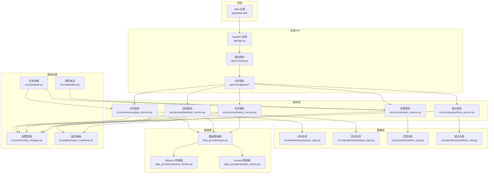
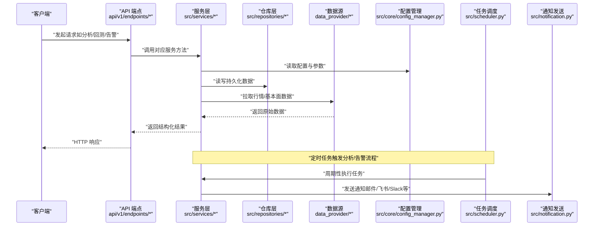
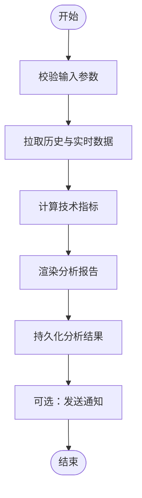
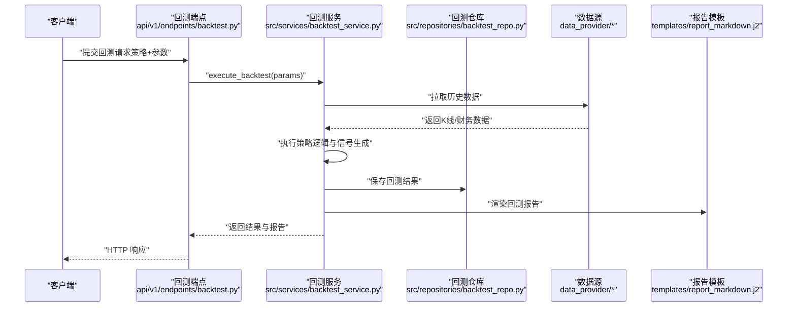
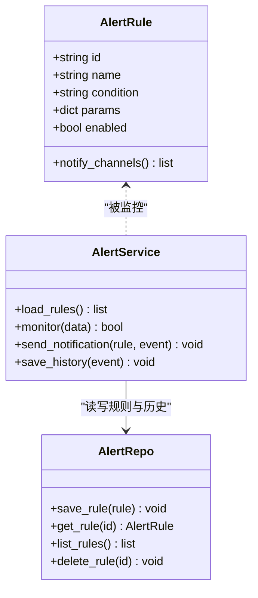
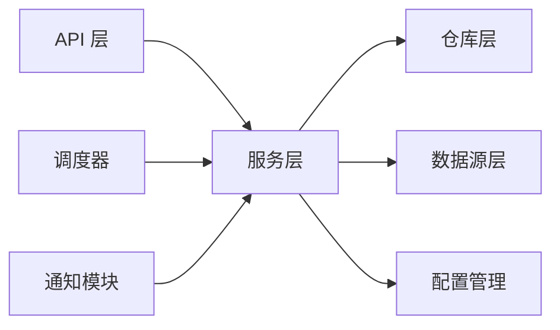

# 使用示例

<cite>
**本文档引用的文件**   
- [main.py](file://main.py)
- [server.py](file://server.py)
- [api/app.py](file://api/app.py)
- [api/v1/router.py](file://api/v1/router.py)
- [api/v1/endpoints/analysis.py](file://api/v1/endpoints/analysis.py)
- [api/v1/endpoints/backtest.py](file://api/v1/endpoints/backtest.py)
- [api/v1/endpoints/alerts.py](file://api/v1/endpoints/alerts.py)
- [api/v1/endpoints/portfolio.py](file://api/v1/endpoints/portfolio.py)
- [api/v1/endpoints/history.py](file://api/v1/endpoints/history.py)
- [api/v1/endpoints/system_config.py](file://api/v1/endpoints/system_config.py)
- [src/services/analysis_service.py](file://src/services/analysis_service.py)
- [src/services/backtest_service.py](file://src/services/backtest_service.py)
- [src/services/alert_service.py](file://src/services/alert_service.py)
- [src/services/portfolio_service.py](file://src/services/portfolio_service.py)
- [src/services/history_service.py](file://src/services/history_service.py)
- [src/core/config_manager.py](file://src/core/config_manager.py)
- [src/scheduler.py](file://src/scheduler.py)
- [src/notification.py](file://src/notification.py)
- [src/repositories/analysis_repo.py](file://src/repositories/analysis_repo.py)
- [src/repositories/backtest_repo.py](file://src/repositories/backtest_repo.py)
- [src/repositories/alert_repo.py](file://src/repositories/alert_repo.py)
- [src/repositories/portfolio_repo.py](file://src/repositories/portfolio_repo.py)
- [data_provider/base.py](file://data_provider/base.py)
- [data_provider/yfinance_fetcher.py](file://data_provider/yfinance_fetcher.py)
- [data_provider/tushare_fetcher.py](file://data_provider/tushare_fetcher.py)
- [strategies/bull_trend.yaml](file://strategies/bull_trend.yaml)
- [templates/report_markdown.j2](file://templates/report_markdown.j2)
- [docker/docker-compose.yml](file://docker/docker-compose.yml)
- [pyproject.toml](file://pyproject.toml)
- [requirements.txt](file://requirements.txt)
</cite>

## 目录
1. [简介](#简介)
2. [项目结构](#项目结构)
3. [核心组件](#核心组件)
4. [架构总览](#架构总览)
5. [详细组件分析](#详细组件分析)
6. [依赖关系分析](#依赖关系分析)
7. [性能考虑](#性能考虑)
8. [故障排查指南](#故障排查指南)
9. [结论](#结论)
10. [附录：完整使用示例集](#附录完整使用示例集)

## 简介
本文件面向希望快速上手并高效使用该股票分析系统的用户，提供从基础到高级的完整使用示例集合。内容覆盖：
- Python SDK 调用示例（本地服务与远程 API）
- REST API 调用示例（分析与回测、组合管理、历史数据、系统配置等）
- 第三方系统集成示例（通知渠道、数据源、Bot 平台）
- 常见业务场景实现方案（定时分析、策略回测、组合监控、市场复盘）
- 性能优化实践（缓存、并发、批处理）
- 故障排查与监控告警配置

所有示例均附带可运行的代码片段路径与配置文件说明，便于直接复制与扩展。

## 项目结构
系统采用前后端分离与模块化后端设计：
- 前端 Web 应用位于 apps/dsa-web，通过 API 层与后端交互
- 后端 API 基于 FastAPI，路由集中在 api/v1，服务逻辑在 src/services
- 数据获取由 data_provider 抽象统一接口，支持多数据源
- 任务调度与通知模块负责定时任务与多渠道告警
- 模板引擎用于报告渲染

**图表来源**
- [api/app.py:1-200](file://api/app.py#L1-L200)
- [api/v1/router.py:1-200](file://api/v1/router.py#L1-L200)
- [src/services/analysis_service.py:1-200](file://src/services/analysis_service.py#L1-L200)
- [src/services/backtest_service.py:1-200](file://src/services/backtest_service.py#L1-L200)
- [src/services/alert_service.py:1-200](file://src/services/alert_service.py#L1-L200)
- [src/services/portfolio_service.py:1-200](file://src/services/portfolio_service.py#L1-L200)
- [src/services/history_service.py:1-200](file://src/services/history_service.py#L1-L200)
- [src/repositories/analysis_repo.py:1-200](file://src/repositories/analysis_repo.py#L1-L200)
- [src/repositories/backtest_repo.py:1-200](file://src/repositories/backtest_repo.py#L1-L200)
- [src/repositories/alert_repo.py:1-200](file://src/repositories/alert_repo.py#L1-L200)
- [src/repositories/portfolio_repo.py:1-200](file://src/repositories/portfolio_repo.py#L1-L200)
- [data_provider/base.py:1-200](file://data_provider/base.py#L1-L200)
- [data_provider/yfinance_fetcher.py:1-200](file://data_provider/yfinance_fetcher.py#L1-L200)
- [data_provider/tushare_fetcher.py:1-200](file://data_provider/tushare_fetcher.py#L1-L200)
- [src/core/config_manager.py:1-200](file://src/core/config_manager.py#L1-L200)
- [src/scheduler.py:1-200](file://src/scheduler.py#L1-L200)
- [src/notification.py:1-200](file://src/notification.py#L1-L200)
- [templates/report_markdown.j2:1-200](file://templates/report_markdown.j2#L1-L200)

**章节来源**
- [api/app.py:1-200](file://api/app.py#L1-L200)
- [api/v1/router.py:1-200](file://api/v1/router.py#L1-L200)
- [src/services/analysis_service.py:1-200](file://src/services/analysis_service.py#L1-L200)
- [src/services/backtest_service.py:1-200](file://src/services/backtest_service.py#L1-L200)
- [src/services/alert_service.py:1-200](file://src/services/alert_service.py#L1-L200)
- [src/services/portfolio_service.py:1-200](file://src/services/portfolio_service.py#L1-L200)
- [src/services/history_service.py:1-200](file://src/services/history_service.py#L1-L200)
- [src/core/config_manager.py:1-200](file://src/core/config_manager.py#L1-L200)
- [src/scheduler.py:1-200](file://src/scheduler.py#L1-L200)
- [src/notification.py:1-200](file://src/notification.py#L1-L200)
- [data_provider/base.py:1-200](file://data_provider/base.py#L1-L200)
- [data_provider/yfinance_fetcher.py:1-200](file://data_provider/yfinance_fetcher.py#L1-L200)
- [data_provider/tushare_fetcher.py:1-200](file://data_provider/tushare_fetcher.py#L1-L200)
- [templates/report_markdown.j2:1-200](file://templates/report_markdown.j2#L1-L200)

## 核心组件
- API 层：定义 RESTful 接口，承载请求校验、鉴权、错误处理与响应格式化
- 服务层：封装业务逻辑，协调仓库与外部数据源，执行分析、回测、告警与组合操作
- 仓库层：数据持久化与查询，屏蔽存储细节
- 数据源层：统一数据获取接口，支持多数据源切换与降级
- 配置与调度：集中式配置管理与定时任务编排
- 通知与模板：多渠道通知与报告渲染

**章节来源**
- [api/app.py:1-200](file://api/app.py#L1-L200)
- [api/v1/router.py:1-200](file://api/v1/router.py#L1-L200)
- [src/services/analysis_service.py:1-200](file://src/services/analysis_service.py#L1-L200)
- [src/services/backtest_service.py:1-200](file://src/services/backtest_service.py#L1-L200)
- [src/services/alert_service.py:1-200](file://src/services/alert_service.py#L1-L200)
- [src/services/portfolio_service.py:1-200](file://src/services/portfolio_service.py#L1-L200)
- [src/services/history_service.py:1-200](file://src/services/history_service.py#L1-L200)
- [src/repositories/analysis_repo.py:1-200](file://src/repositories/analysis_repo.py#L1-L200)
- [src/repositories/backtest_repo.py:1-200](file://src/repositories/backtest_repo.py#L1-L200)
- [src/repositories/alert_repo.py:1-200](file://src/repositories/alert_repo.py#L1-L200)
- [src/repositories/portfolio_repo.py:1-200](file://src/repositories/portfolio_repo.py#L1-L200)
- [data_provider/base.py:1-200](file://data_provider/base.py#L1-L200)
- [data_provider/yfinance_fetcher.py:1-200](file://data_provider/yfinance_fetcher.py#L1-L200)
- [data_provider/tushare_fetcher.py:1-200](file://data_provider/tushare_fetcher.py#L1-L200)
- [src/core/config_manager.py:1-200](file://src/core/config_manager.py#L1-L200)
- [src/scheduler.py:1-200](file://src/scheduler.py#L1-L200)
- [src/notification.py:1-200](file://src/notification.py#L1-L200)
- [templates/report_markdown.j2:1-200](file://templates/report_markdown.j2#L1-L200)

## 架构总览
系统以“API -> 服务 -> 仓库 -> 数据源”的分层架构为核心，配合配置、调度与通知形成闭环。

**图表来源**
- [api/v1/endpoints/analysis.py:1-200](file://api/v1/endpoints/analysis.py#L1-L200)
- [api/v1/endpoints/backtest.py:1-200](file://api/v1/endpoints/backtest.py#L1-L200)
- [api/v1/endpoints/alerts.py:1-200](file://api/v1/endpoints/alerts.py#L1-L200)
- [src/services/analysis_service.py:1-200](file://src/services/analysis_service.py#L1-L200)
- [src/services/backtest_service.py:1-200](file://src/services/backtest_service.py#L1-L200)
- [src/services/alert_service.py:1-200](file://src/services/alert_service.py#L1-L200)
- [src/repositories/analysis_repo.py:1-200](file://src/repositories/analysis_repo.py#L1-L200)
- [src/repositories/backtest_repo.py:1-200](file://src/repositories/backtest_repo.py#L1-L200)
- [src/repositories/alert_repo.py:1-200](file://src/repositories/alert_repo.py#L1-L200)
- [data_provider/base.py:1-200](file://data_provider/base.py#L1-L200)
- [src/core/config_manager.py:1-200](file://src/core/config_manager.py#L1-L200)
- [src/scheduler.py:1-200](file://src/scheduler.py#L1-L200)
- [src/notification.py:1-200](file://src/notification.py#L1-L200)

## 详细组件分析

### 分析服务（Analysis Service）
- 职责：聚合多数据源、执行技术指标与基本面分析、生成分析报告
- 关键流程：参数校验 -> 数据拉取 -> 指标计算 -> 报告渲染 -> 持久化
- 典型用法：单股分析、批量分析、上下文打包

**图表来源**
- [src/services/analysis_service.py:1-200](file://src/services/analysis_service.py#L1-L200)
- [src/repositories/analysis_repo.py:1-200](file://src/repositories/analysis_repo.py#L1-L200)
- [data_provider/base.py:1-200](file://data_provider/base.py#L1-L200)
- [templates/report_markdown.j2:1-200](file://templates/report_markdown.j2#L1-L200)

**章节来源**
- [src/services/analysis_service.py:1-200](file://src/services/analysis_service.py#L1-L200)
- [src/repositories/analysis_repo.py:1-200](file://src/repositories/analysis_repo.py#L1-L200)
- [data_provider/base.py:1-200](file://data_provider/base.py#L1-L200)
- [templates/report_markdown.j2:1-200](file://templates/report_markdown.j2#L1-L200)

### 回测服务（Backtest Service）
- 职责：加载策略、模拟交易、统计绩效、输出报告
- 关键流程：策略解析 -> 历史数据回放 -> 信号生成 -> 成交模拟 -> 绩效统计
- 典型用法：单策略回测、多策略对比、参数扫描

**图表来源**
- [api/v1/endpoints/backtest.py:1-200](file://api/v1/endpoints/backtest.py#L1-L200)
- [src/services/backtest_service.py:1-200](file://src/services/backtest_service.py#L1-L200)
- [src/repositories/backtest_repo.py:1-200](file://src/repositories/backtest_repo.py#L1-L200)
- [data_provider/base.py:1-200](file://data_provider/base.py#L1-L200)
- [templates/report_markdown.j2:1-200](file://templates/report_markdown.j2#L1-L200)

**章节来源**
- [api/v1/endpoints/backtest.py:1-200](file://api/v1/endpoints/backtest.py#L1-L200)
- [src/services/backtest_service.py:1-200](file://src/services/backtest_service.py#L1-L200)
- [src/repositories/backtest_repo.py:1-200](file://src/repositories/backtest_repo.py#L1-L200)
- [data_provider/base.py:1-200](file://data_provider/base.py#L1-L200)
- [templates/report_markdown.j2:1-200](file://templates/report_markdown.j2#L1-L200)

### 告警服务（Alert Service）
- 职责：规则匹配、事件触发、多渠道通知、历史记录
- 关键流程：规则加载 -> 数据监控 -> 条件判断 -> 通知发送 -> 记录归档
- 典型用法：价格突破、成交量异动、组合风险阈值

**图表来源**
- [src/services/alert_service.py:1-200](file://src/services/alert_service.py#L1-L200)
- [src/repositories/alert_repo.py:1-200](file://src/repositories/alert_repo.py#L1-L200)
- [src/notification.py:1-200](file://src/notification.py#L1-L200)

**章节来源**
- [src/services/alert_service.py:1-200](file://src/services/alert_service.py#L1-L200)
- [src/repositories/alert_repo.py:1-200](file://src/repositories/alert_repo.py#L1-L200)
- [src/notification.py:1-200](file://src/notification.py#L1-L200)

### 组合服务（Portfolio Service）
- 职责：持仓管理、风险评估、快照生成、导入导出
- 关键流程：数据同步 -> 估值计算 -> 风险指标 -> 报告输出
- 典型用法：每日快照、风险预警、组合再平衡建议

**章节来源**
- [src/services/portfolio_service.py:1-200](file://src/services/portfolio_service.py#L1-L200)
- [src/repositories/portfolio_repo.py:1-200](file://src/repositories/portfolio_repo.py#L1-L200)

### 历史服务（History Service）
- 职责：历史数据查询、清洗、对齐、缓存
- 关键流程：请求解析 -> 数据检索 -> 格式标准化 -> 返回结果
- 典型用法：K线查询、财务指标查询、新闻与公告检索

**章节来源**
- [src/services/history_service.py:1-200](file://src/services/history_service.py#L1-L200)
- [data_provider/base.py:1-200](file://data_provider/base.py#L1-L200)

## 依赖关系分析
- API 层依赖服务层，服务层依赖仓库与数据源
- 配置管理贯穿各层，确保参数一致性与环境隔离
- 调度器驱动定时任务，通知模块作为横向能力被服务层复用
- 数据源抽象保证可扩展性与替换性

**图表来源**
- [api/app.py:1-200](file://api/app.py#L1-L200)
- [src/services/analysis_service.py:1-200](file://src/services/analysis_service.py#L1-L200)
- [src/core/config_manager.py:1-200](file://src/core/config_manager.py#L1-L200)
- [src/scheduler.py:1-200](file://src/scheduler.py#L1-L200)
- [src/notification.py:1-200](file://src/notification.py#L1-L200)
- [data_provider/base.py:1-200](file://data_provider/base.py#L1-L200)

**章节来源**
- [api/app.py:1-200](file://api/app.py#L1-L200)
- [src/services/analysis_service.py:1-200](file://src/services/analysis_service.py#L1-L200)
- [src/core/config_manager.py:1-200](file://src/core/config_manager.py#L1-L200)
- [src/scheduler.py:1-200](file://src/scheduler.py#L1-L200)
- [src/notification.py:1-200](file://src/notification.py#L1-L200)
- [data_provider/base.py:1-200](file://data_provider/base.py#L1-L200)

## 性能考虑
- 数据拉取：启用连接池与重试机制，合理设置超时与限流
- 计算优化：指标计算向量化，避免重复计算；对热点数据加缓存
- 并发控制：异步 I/O 与线程池结合，限制并发度防止过载
- 存储优化：分页查询、索引优化、冷热数据分层
- 报告渲染：模板预编译与增量更新

[本节为通用指导，不直接分析具体文件]

## 故障排查指南
- 常见问题：数据源不可用、网络超时、配置缺失、权限不足
- 定位步骤：检查日志 -> 验证配置 -> 复现最小用例 -> 逐步隔离
- 工具建议：使用健康检查端点、调试模式、链路追踪
- 恢复策略：自动重试、降级策略、熔断与隔离

**章节来源**
- [src/core/config_manager.py:1-200](file://src/core/config_manager.py#L1-L200)
- [src/scheduler.py:1-200](file://src/scheduler.py#L1-L200)
- [src/notification.py:1-200](file://src/notification.py#L1-L200)

## 结论
本系统通过清晰的分层架构与模块化设计，提供了灵活可扩展的股票分析与回测能力。借助丰富的使用示例与最佳实践，用户可快速构建从数据采集、分析、回测到监控告警的完整工作流。建议在生产环境中结合容器化部署、监控与日志体系，确保稳定性与可观测性。

[本节为总结性内容，不直接分析具体文件]

## 附录：完整使用示例集

### 基础用法示例
- 启动本地服务
  - 参考入口文件：[main.py](file://main.py)、[server.py](file://server.py)
  - 使用 Docker Compose 一键启动：[docker/docker-compose.yml](file://docker/docker-compose.yml)
- 安装依赖与环境准备
  - 依赖清单：[requirements.txt](file://requirements.txt)、[pyproject.toml](file://pyproject.toml)
- 首次运行与基本配置
  - 配置管理：[src/core/config_manager.py](file://src/core/config_manager.py)

**章节来源**
- [main.py:1-200](file://main.py#L1-L200)
- [server.py:1-200](file://server.py#L1-L200)
- [docker/docker-compose.yml:1-200](file://docker/docker-compose.yml#L1-L200)
- [requirements.txt:1-200](file://requirements.txt#L1-L200)
- [pyproject.toml:1-200](file://pyproject.toml#L1-L200)
- [src/core/config_manager.py:1-200](file://src/core/config_manager.py#L1-L200)

### Python SDK 使用示例
- 初始化客户端与认证
  - 参考 API 应用入口：[api/app.py](file://api/app.py)
- 调用分析接口
  - 端点定义：[api/v1/endpoints/analysis.py](file://api/v1/endpoints/analysis.py)
  - 服务实现：[src/services/analysis_service.py](file://src/services/analysis_service.py)
- 调用回测接口
  - 端点定义：[api/v1/endpoints/backtest.py](file://api/v1/endpoints/backtest.py)
  - 服务实现：[src/services/backtest_service.py](file://src/services/backtest_service.py)
- 调用告警接口
  - 端点定义：[api/v1/endpoints/alerts.py](file://api/v1/endpoints/alerts.py)
  - 服务实现：[src/services/alert_service.py](file://src/services/alert_service.py)
- 调用组合接口
  - 端点定义：[api/v1/endpoints/portfolio.py](file://api/v1/endpoints/portfolio.py)
  - 服务实现：[src/services/portfolio_service.py](file://src/services/portfolio_service.py)
- 调用历史数据接口
  - 端点定义：[api/v1/endpoints/history.py](file://api/v1/endpoints/history.py)
  - 服务实现：[src/services/history_service.py](file://src/services/history_service.py)

**章节来源**
- [api/app.py:1-200](file://api/app.py#L1-L200)
- [api/v1/endpoints/analysis.py:1-200](file://api/v1/endpoints/analysis.py#L1-L200)
- [api/v1/endpoints/backtest.py:1-200](file://api/v1/endpoints/backtest.py#L1-L200)
- [api/v1/endpoints/alerts.py:1-200](file://api/v1/endpoints/alerts.py#L1-L200)
- [api/v1/endpoints/portfolio.py:1-200](file://api/v1/endpoints/portfolio.py#L1-L200)
- [api/v1/endpoints/history.py:1-200](file://api/v1/endpoints/history.py#L1-L200)
- [src/services/analysis_service.py:1-200](file://src/services/analysis_service.py#L1-L200)
- [src/services/backtest_service.py:1-200](file://src/services/backtest_service.py#L1-L200)
- [src/services/alert_service.py:1-200](file://src/services/alert_service.py#L1-L200)
- [src/services/portfolio_service.py:1-200](file://src/services/portfolio_service.py#L1-L200)
- [src/services/history_service.py:1-200](file://src/services/history_service.py#L1-L200)

### API 调用示例
- 分析与回测
  - 端点：[api/v1/endpoints/analysis.py](file://api/v1/endpoints/analysis.py)、[api/v1/endpoints/backtest.py](file://api/v1/endpoints/backtest.py)
- 告警与组合
  - 端点：[api/v1/endpoints/alerts.py](file://api/v1/endpoints/alerts.py)、[api/v1/endpoints/portfolio.py](file://api/v1/endpoints/portfolio.py)
- 历史数据与系统配置
  - 端点：[api/v1/endpoints/history.py](file://api/v1/endpoints/history.py)、[api/v1/endpoints/system_config.py](file://api/v1/endpoints/system_config.py)

**章节来源**
- [api/v1/endpoints/analysis.py:1-200](file://api/v1/endpoints/analysis.py#L1-L200)
- [api/v1/endpoints/backtest.py:1-200](file://api/v1/endpoints/backtest.py#L1-L200)
- [api/v1/endpoints/alerts.py:1-200](file://api/v1/endpoints/alerts.py#L1-L200)
- [api/v1/endpoints/portfolio.py:1-200](file://api/v1/endpoints/portfolio.py#L1-L200)
- [api/v1/endpoints/history.py:1-200](file://api/v1/endpoints/history.py#L1-L200)
- [api/v1/endpoints/system_config.py:1-200](file://api/v1/endpoints/system_config.py#L1-L200)

### 第三方系统集成示例
- 数据源集成
  - 抽象接口：[data_provider/base.py](file://data_provider/base.py)
  - yfinance 示例：[data_provider/yfinance_fetcher.py](file://data_provider/yfinance_fetcher.py)
  - tushare 示例：[data_provider/tushare_fetcher.py](file://data_provider/tushare_fetcher.py)
- 通知渠道集成
  - 通知模块：[src/notification.py](file://src/notification.py)
- Bot 平台集成
  - 参考文档与命令：bot 相关脚本与命令（见项目结构中的 bot 目录）

**章节来源**
- [data_provider/base.py:1-200](file://data_provider/base.py#L1-L200)
- [data_provider/yfinance_fetcher.py:1-200](file://data_provider/yfinance_fetcher.py#L1-L200)
- [data_provider/tushare_fetcher.py:1-200](file://data_provider/tushare_fetcher.py#L1-L200)
- [src/notification.py:1-200](file://src/notification.py#L1-L200)

### 常见业务场景实现方案
- 定时分析
  - 调度器：[src/scheduler.py](file://src/scheduler.py)
  - 分析服务：[src/services/analysis_service.py](file://src/services/analysis_service.py)
- 策略回测
  - 端点与服务：[api/v1/endpoints/backtest.py](file://api/v1/endpoints/backtest.py)、[src/services/backtest_service.py](file://src/services/backtest_service.py)
  - 策略配置示例：[strategies/bull_trend.yaml](file://strategies/bull_trend.yaml)
- 组合监控
  - 端点与服务：[api/v1/endpoints/portfolio.py](file://api/v1/endpoints/portfolio.py)、[src/services/portfolio_service.py](file://src/services/portfolio_service.py)
  - 告警规则：[src/services/alert_service.py](file://src/services/alert_service.py)

**章节来源**
- [src/scheduler.py:1-200](file://src/scheduler.py#L1-L200)
- [src/services/analysis_service.py:1-200](file://src/services/analysis_service.py#L1-L200)
- [api/v1/endpoints/backtest.py:1-200](file://api/v1/endpoints/backtest.py#L1-L200)
- [src/services/backtest_service.py:1-200](file://src/services/backtest_service.py#L1-L200)
- [strategies/bull_trend.yaml:1-200](file://strategies/bull_trend.yaml#L1-L200)
- [api/v1/endpoints/portfolio.py:1-200](file://api/v1/endpoints/portfolio.py#L1-L200)
- [src/services/portfolio_service.py:1-200](file://src/services/portfolio_service.py#L1-L200)
- [src/services/alert_service.py:1-200](file://src/services/alert_service.py#L1-L200)

### 性能优化示例
- 数据拉取优化：连接池、重试、限流（参考数据源抽象与实现）
- 计算优化：向量化与缓存（参考分析服务与历史服务）
- 并发控制：异步 I/O 与线程池（参考调度器与服务层）
- 存储优化：分页与索引（参考仓库层）

**章节来源**
- [data_provider/base.py:1-200](file://data_provider/base.py#L1-L200)
- [src/services/analysis_service.py:1-200](file://src/services/analysis_service.py#L1-L200)
- [src/services/history_service.py:1-200](file://src/services/history_service.py#L1-L200)
- [src/scheduler.py:1-200](file://src/scheduler.py#L1-L200)
- [src/repositories/analysis_repo.py:1-200](file://src/repositories/analysis_repo.py#L1-L200)

### 故障排查示例
- 日志与诊断：启用调试模式与链路追踪
- 配置校验：检查环境变量与配置文件
- 数据源连通性：测试数据源接口与健康检查
- 通知通道连通性：测试通知渠道配置

**章节来源**
- [src/core/config_manager.py:1-200](file://src/core/config_manager.py#L1-L200)
- [src/notification.py:1-200](file://src/notification.py#L1-L200)
- [data_provider/base.py:1-200](file://data_provider/base.py#L1-L200)

### 监控告警配置示例
- 告警规则定义与编辑
  - 端点与服务：[api/v1/endpoints/alerts.py](file://api/v1/endpoints/alerts.py)、[src/services/alert_service.py](file://src/services/alert_service.py)
- 通知渠道配置
  - 通知模块：[src/notification.py](file://src/notification.py)
- 定时任务与监控
  - 调度器：[src/scheduler.py](file://src/scheduler.py)

**章节来源**
- [api/v1/endpoints/alerts.py:1-200](file://api/v1/endpoints/alerts.py#L1-L200)
- [src/services/alert_service.py:1-200](file://src/services/alert_service.py#L1-L200)
- [src/notification.py:1-200](file://src/notification.py#L1-L200)
- [src/scheduler.py:1-200](file://src/scheduler.py#L1-L200)