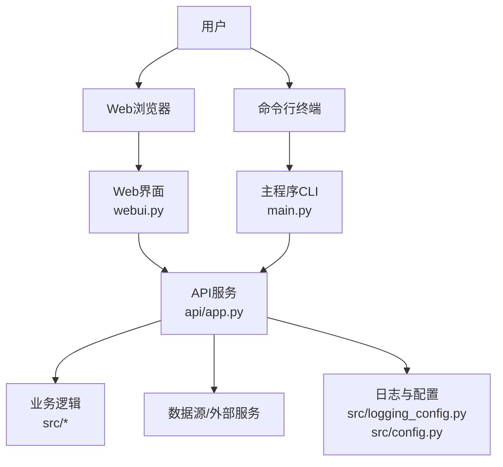
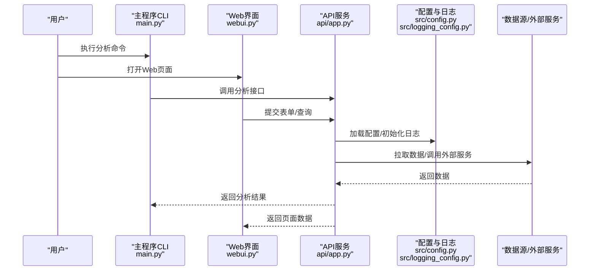
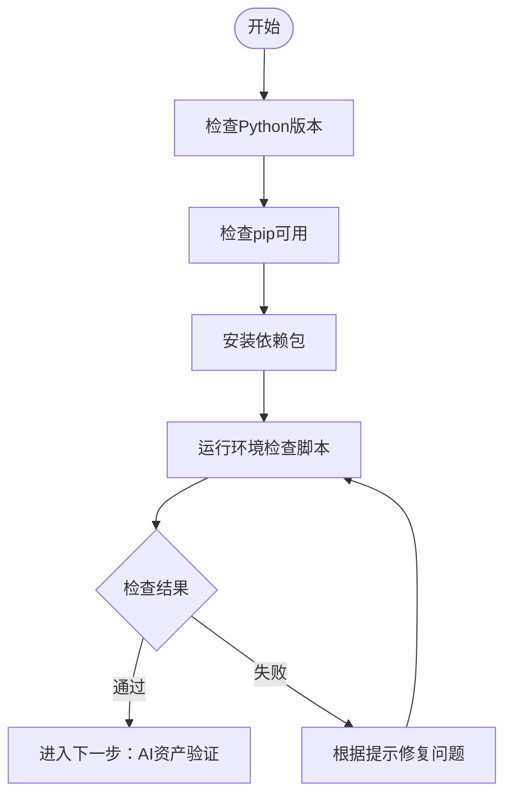
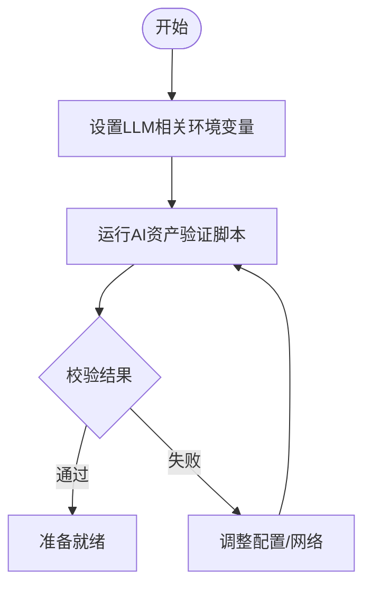
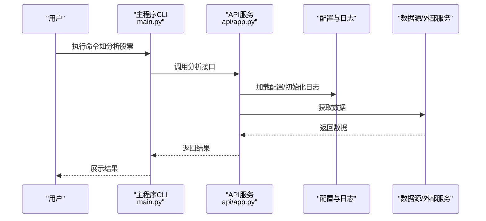
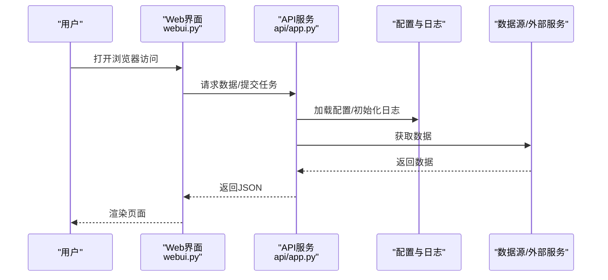
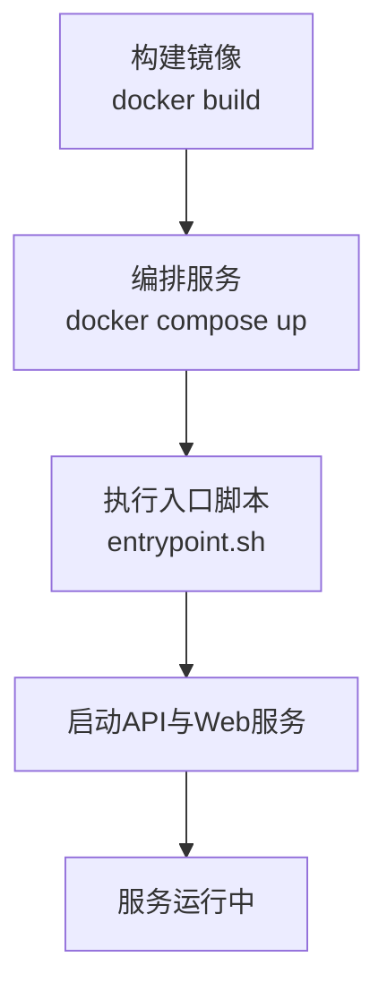
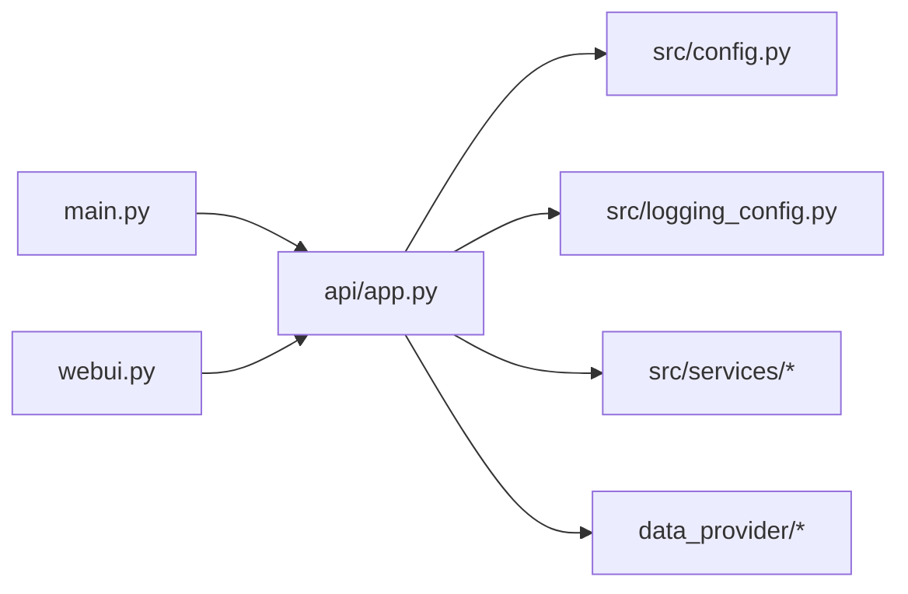

# 基础使用示例

<cite>
**本文引用的文件**   
- [README.md](file://README.md)
- [main.py](file://main.py)
- [server.py](file://server.py)
- [webui.py](file://webui.py)
- [pyproject.toml](file://pyproject.toml)
- [requirements.txt](file://requirements.txt)
- [scripts/check_env.py](file://scripts/check_env.py)
- [scripts/check_ai_assets.py](file://scripts/check_ai_assets.py)
- [docker/Dockerfile](file://docker/Dockerfile)
- [docker/docker-compose.yml](file://docker/docker-compose.yml)
- [docker/entrypoint.sh](file://docker/entrypoint.sh)
- [api/app.py](file://api/app.py)
- [src/config.py](file://src/config.py)
- [src/logging_config.py](file://src/logging_config.py)
</cite>

## 目录
1. [简介](#简介)
2. [项目结构](#项目结构)
3. [核心组件](#核心组件)
4. [架构总览](#架构总览)
5. [详细组件分析](#详细组件分析)
6. [依赖分析](#依赖分析)
7. [性能考虑](#性能考虑)
8. [故障排查指南](#故障排查指南)
9. [结论](#结论)
10. [附录](#附录)

## 简介
本指南面向首次接触该系统的用户，目标是帮助你快速完成环境检查、安装依赖、配置环境变量、验证AI资产、启动主程序与Web服务器，并给出常见问题的排查方法。通过本文，你将能够：
- 在本地或容器中完成系统搭建
- 使用环境检查脚本和AI资产验证工具进行自检
- 以命令行方式启动主程序与API服务
- 了解关键环境变量与配置文件的作用
- 快速定位并解决常见问题

## 项目结构
仓库采用前后端分离与多入口设计：
- 后端API服务由FastAPI应用提供，入口位于 api/app.py
- 主程序（CLI）入口为 main.py，用于调度与分析任务
- Web界面入口为 webui.py，提供前端页面访问
- 脚本目录 scripts 包含环境检查与资产校验工具
- docker 目录提供容器化部署方案
- src 为核心业务逻辑与配置管理模块

**图表来源** 
- [webui.py](file://webui.py)
- [main.py](file://main.py)
- [api/app.py](file://api/app.py)
- [src/config.py](file://src/config.py)
- [src/logging_config.py](file://src/logging_config.py)

**章节来源**
- [README.md](file://README.md)
- [pyproject.toml](file://pyproject.toml)
- [requirements.txt](file://requirements.txt)

## 核心组件
- 环境检查脚本：scripts/check_env.py，用于检测Python版本、依赖包、路径与环境变量是否满足运行要求
- AI资产验证工具：scripts/check_ai_assets.py，用于校验LLM密钥、渠道配置、模型可用性
- 主程序：main.py，提供CLI命令执行分析与调度任务
- API服务：api/app.py，基于FastAPI暴露REST接口，供Web与外部调用
- Web界面：webui.py，提供可视化操作面板
- 配置与日志：src/config.py、src/logging_config.py，负责配置加载与日志初始化

**章节来源**
- [scripts/check_env.py](file://scripts/check_env.py)
- [scripts/check_ai_assets.py](file://scripts/check_ai_assets.py)
- [main.py](file://main.py)
- [api/app.py](file://api/app.py)
- [webui.py](file://webui.py)
- [src/config.py](file://src/config.py)
- [src/logging_config.py](file://src/logging_config.py)

## 架构总览
系统整体流程如下：
- 用户在终端或浏览器发起请求
- CLI或Web界面调用API服务
- API服务执行业务逻辑，读取配置与日志设置，调用数据源与外部服务
- 返回结果给调用方

**图表来源** 
- [main.py](file://main.py)
- [webui.py](file://webui.py)
- [api/app.py](file://api/app.py)
- [src/config.py](file://src/config.py)
- [src/logging_config.py](file://src/logging_config.py)

## 详细组件分析

### 环境检查脚本使用方法
- 作用：检查Python版本、依赖包、必要路径与环境变量
- 使用方式：在仓库根目录执行脚本，查看输出是否符合预期
- 典型步骤：
  - 确认已安装Python与pip
  - 安装依赖（见“安装与依赖”）
  - 运行环境检查脚本，修复缺失项
  - 再次运行确认通过

**图表来源** 
- [scripts/check_env.py](file://scripts/check_env.py)

**章节来源**
- [scripts/check_env.py](file://scripts/check_env.py)

### AI资产验证工具的使用
- 作用：校验LLM密钥、渠道配置、模型连通性
- 使用方式：在仓库根目录执行校验脚本，按提示输入或检查环境变量
- 典型步骤：
  - 配置必要的LLM环境变量（如密钥、URL、模型名）
  - 运行AI资产验证脚本
  - 根据错误信息调整配置并重试

**图表来源** 
- [scripts/check_ai_assets.py](file://scripts/check_ai_assets.py)

**章节来源**
- [scripts/check_ai_assets.py](file://scripts/check_ai_assets.py)

### 主程序启动方式（CLI）
- 入口：main.py
- 功能：执行分析任务、调度工作流、批量处理等
- 使用方式：在终端中直接运行主程序，传入相应参数
- 建议：先完成环境检查与AI资产验证，再启动主程序

**图表来源** 
- [main.py](file://main.py)
- [api/app.py](file://api/app.py)
- [src/config.py](file://src/config.py)
- [src/logging_config.py](file://src/logging_config.py)

**章节来源**
- [main.py](file://main.py)
- [api/app.py](file://api/app.py)

### 服务器启动方式（API与Web）
- API服务：api/app.py，提供REST接口
- Web界面：webui.py，提供前端页面
- 启动顺序：
  - 先启动API服务
  - 再启动Web界面（如需）
- 端口与地址：参考各自入口文件的默认配置

**图表来源** 
- [webui.py](file://webui.py)
- [api/app.py](file://api/app.py)
- [src/config.py](file://src/config.py)
- [src/logging_config.py](file://src/logging_config.py)

**章节来源**
- [webui.py](file://webui.py)
- [api/app.py](file://api/app.py)

### 容器化部署（可选）
- Docker镜像构建与运行：
  - 使用docker/Dockerfile构建镜像
  - 使用docker/docker-compose.yml编排服务
  - entrypoint.sh作为容器入口脚本
- 适用场景：生产环境或需要隔离运行的场景

**图表来源** 
- [docker/Dockerfile](file://docker/Dockerfile)
- [docker/docker-compose.yml](file://docker/docker-compose.yml)
- [docker/entrypoint.sh](file://docker/entrypoint.sh)

**章节来源**
- [docker/Dockerfile](file://docker/Dockerfile)
- [docker/docker-compose.yml](file://docker/docker-compose.yml)
- [docker/entrypoint.sh](file://docker/entrypoint.sh)

## 依赖分析
- Python依赖：requirements.txt列出运行时依赖
- 项目元数据：pyproject.toml定义包信息与构建配置
- 模块依赖关系：
  - main.py与webui.py均依赖api/app.py提供的接口
  - api/app.py依赖src下的配置与业务模块
  - 日志与配置由src/logging_config.py与src/config.py统一管理

**图表来源** 
- [main.py](file://main.py)
- [webui.py](file://webui.py)
- [api/app.py](file://api/app.py)
- [src/config.py](file://src/config.py)
- [src/logging_config.py](file://src/logging_config.py)

**章节来源**
- [requirements.txt](file://requirements.txt)
- [pyproject.toml](file://pyproject.toml)

## 性能考虑
- 并发与限流：API层可根据负载启用限流与连接池
- 缓存策略：对热点数据（如指数、新闻）启用缓存减少重复请求
- 异步IO：数据拉取与LLM调用建议使用异步提升吞吐
- 资源监控：关注CPU、内存与网络I/O，避免瓶颈
- 日志级别：开发阶段开启DEBUG，生产环境调整为INFO或WARNING

[本节为通用指导，不直接分析具体文件]

## 故障排查指南
- 环境问题：
  - Python版本不匹配：升级或切换至兼容版本
  - 依赖缺失：重新安装requirements.txt中的包
  - 路径错误：确保脚本与工作目录正确
- LLM配置问题：
  - 密钥无效或过期：更新环境变量或配置文件
  - 网络不可达：检查代理与防火墙设置
  - 模型不可用：更换模型或渠道
- 启动失败：
  - 端口占用：修改端口或关闭占用进程
  - 权限不足：以管理员或具备权限的用户运行
- 日志定位：
  - 查看日志文件与控制台输出
  - 提高日志级别以获取更多上下文

**章节来源**
- [src/logging_config.py](file://src/logging_config.py)
- [src/config.py](file://src/config.py)

## 结论
通过本指南，你已经掌握了环境检查、依赖安装、AI资产验证、主程序与服务器启动的基本流程。建议在正式使用前完成所有自检步骤，并根据实际需求调整配置与性能参数。遇到问题时，优先检查环境与LLM配置，结合日志信息进行定位与修复。

## 附录

### 安装与依赖
- 安装Python与pip
- 克隆仓库到本地
- 安装依赖包（参考requirements.txt）
- 验证安装成功（运行环境检查脚本）

**章节来源**
- [requirements.txt](file://requirements.txt)
- [scripts/check_env.py](file://scripts/check_env.py)

### 环境变量配置示例
- 常用环境变量：
  - LLM相关：密钥、URL、模型名称、渠道标识
  - 数据源：API密钥、代理地址、超时设置
  - 日志：级别、输出路径、格式
- 配置位置：
  - 环境变量（推荐）
  - 配置文件（如有）
- 注意事项：
  - 敏感信息不要硬编码
  - 区分开发与生产环境

[本节为通用指导，不直接分析具体文件]

### 命令行参数说明
- 主程序（main.py）：
  - 支持分析、批量处理、状态查询等子命令
  - 可通过--help查看帮助信息
- API服务（api/app.py）：
  - 支持端口、主机、调试模式等参数
- Web界面（webui.py）：
  - 支持端口、静态资源路径等参数

**章节来源**
- [main.py](file://main.py)
- [api/app.py](file://api/app.py)
- [webui.py](file://webui.py)

### 常见问题与解决方案
- 无法连接LLM：
  - 检查网络与代理
  - 验证密钥与模型名称
- 数据拉取失败：
  - 检查数据源API状态
  - 重试或切换数据源
- 端口冲突：
  - 修改端口或释放占用
- 权限问题：
  - 使用合适权限运行

**章节来源**
- [scripts/check_ai_assets.py](file://scripts/check_ai_assets.py)
- [scripts/check_env.py](file://scripts/check_env.py)