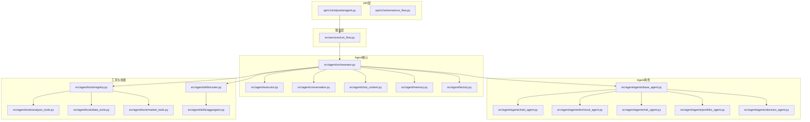
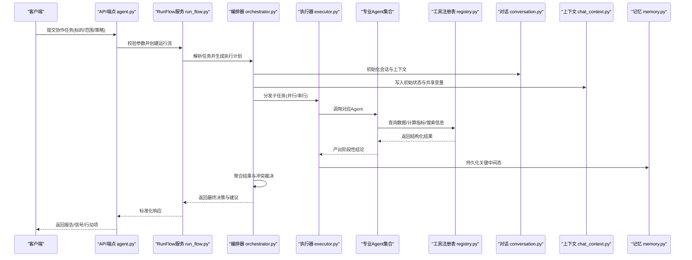
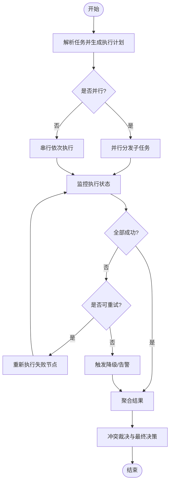
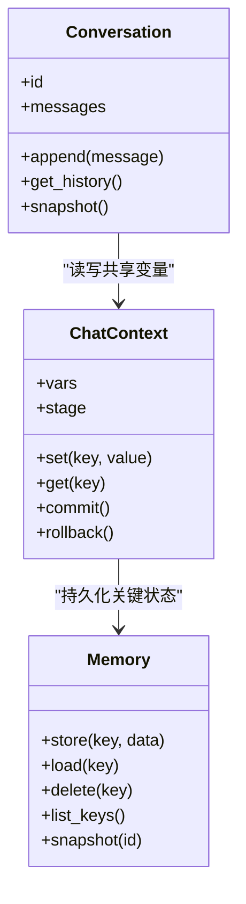
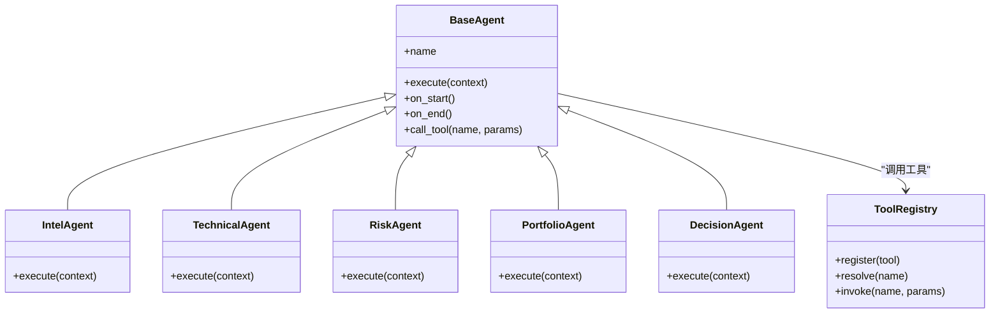
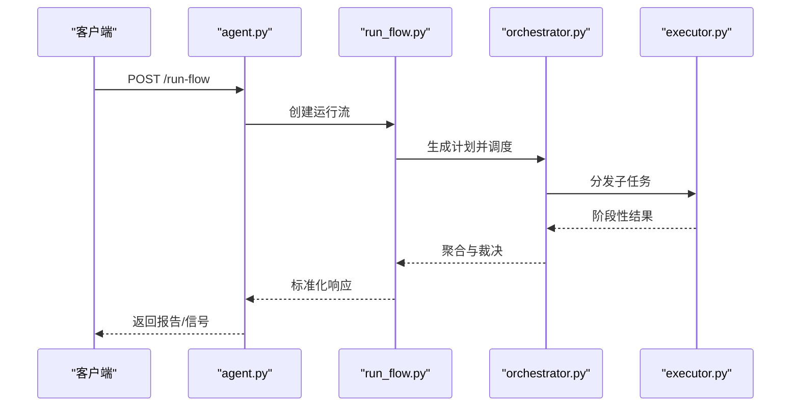
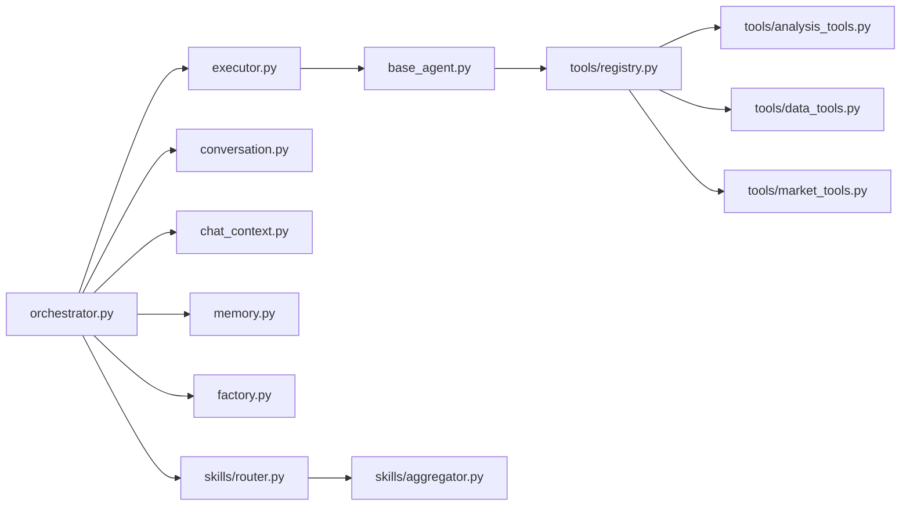
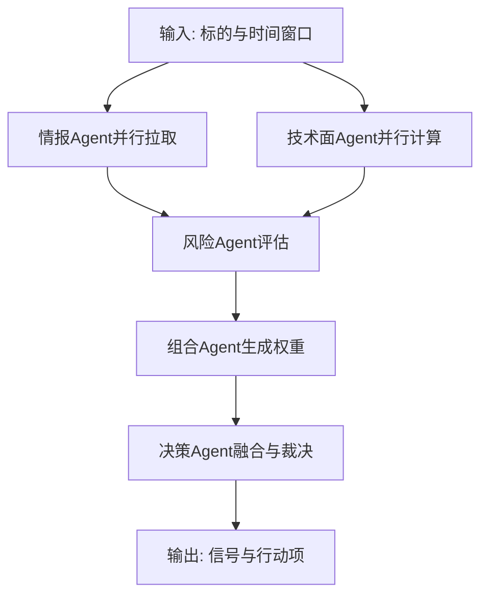

# 多智能体协作模式

<cite>
**本文引用的文件**   
- [src/agent/orchestrator.py](file://src/agent/orchestrator.py)
- [src/agent/executor.py](file://src/agent/executor.py)
- [src/agent/conversation.py](file://src/agent/conversation.py)
- [src/agent/chat_context.py](file://src/agent/chat_context.py)
- [src/agent/memory.py](file://src/agent/memory.py)
- [src/agent/factory.py](file://src/agent/factory.py)
- [src/agent/agents/base_agent.py](file://src/agent/agents/base_agent.py)
- [src/agent/agents/intel_agent.py](file://src/agent/agents/intel_agent.py)
- [src/agent/agents/technical_agent.py](file://src/agent/agents/technical_agent.py)
- [src/agent/agents/risk_agent.py](file://src/agent/agents/risk_agent.py)
- [src/agent/agents/portfolio_agent.py](file://src/agent/agents/portfolio_agent.py)
- [src/agent/agents/decision_agent.py](file://src/agent/agents/decision_agent.py)
- [src/agent/tools/registry.py](file://src/agent/tools/registry.py)
- [src/agent/tools/analysis_tools.py](file://src/agent/tools/analysis_tools.py)
- [src/agent/tools/data_tools.py](file://src/agent/tools/data_tools.py)
- [src/agent/tools/market_tools.py](file://src/agent/tools/market_tools.py)
- [src/agent/skills/router.py](file://src/agent/skills/router.py)
- [src/agent/skills/aggregator.py](file://src/agent/skills/aggregator.py)
- [src/services/run_flow.py](file://src/services/run_flow.py)
- [api/v1/endpoints/agent.py](file://api/v1/endpoints/agent.py)
- [api/v1/schemas/run_flow.py](file://api/v1/schemas/run_flow.py)
- [tests/test_multi_agent.py](file://tests/test_multi_agent.py)
</cite>

## 目录
1. [简介](#简介)
2. [项目结构](#项目结构)
3. [核心组件](#核心组件)
4. [架构总览](#架构总览)
5. [详细组件分析](#详细组件分析)
6. [依赖关系分析](#依赖关系分析)
7. [性能考量](#性能考量)
8. [故障排查指南](#故障排查指南)
9. [结论](#结论)
10. [附录：实战示例与最佳实践](#附录实战示例与最佳实践)

## 简介
本文件面向希望在实际业务中落地“多智能体协作”的读者，围绕任务分配、结果整合与冲突解决三大主题，给出可操作的使用示例与最佳实践。系统以编排器为核心，将多个专业Agent（情报、技术面、风险、组合、决策）串联或并联执行，通过共享对话上下文与记忆机制实现状态管理，并通过工具注册中心与技能路由完成能力扩展。文档同时覆盖错误处理、幂等性与可观测性建议，帮助你在复杂市场分析流程中稳定运行多Agent流水线。

## 项目结构
多智能体相关代码主要位于 src/agent 与 api/v1 下，服务层在 src/services 提供运行流编排能力，测试用例在 tests 中验证协作行为。

图表来源
- [api/v1/endpoints/agent.py](file://api/v1/endpoints/agent.py)
- [api/v1/schemas/run_flow.py](file://api/v1/schemas/run_flow.py)
- [src/services/run_flow.py](file://src/services/run_flow.py)
- [src/agent/orchestrator.py](file://src/agent/orchestrator.py)
- [src/agent/executor.py](file://src/agent/executor.py)
- [src/agent/conversation.py](file://src/agent/conversation.py)
- [src/agent/chat_context.py](file://src/agent/chat_context.py)
- [src/agent/memory.py](file://src/agent/memory.py)
- [src/agent/factory.py](file://src/agent/factory.py)
- [src/agent/agents/base_agent.py](file://src/agent/agents/base_agent.py)
- [src/agent/agents/intel_agent.py](file://src/agent/agents/intel_agent.py)
- [src/agent/agents/technical_agent.py](file://src/agent/agents/technical_agent.py)
- [src/agent/agents/risk_agent.py](file://src/agent/agents/risk_agent.py)
- [src/agent/agents/portfolio_agent.py](file://src/agent/agents/portfolio_agent.py)
- [src/agent/agents/decision_agent.py](file://src/agent/agents/decision_agent.py)
- [src/agent/tools/registry.py](file://src/agent/tools/registry.py)
- [src/agent/tools/analysis_tools.py](file://src/agent/tools/analysis_tools.py)
- [src/agent/tools/data_tools.py](file://src/agent/tools/data_tools.py)
- [src/agent/tools/market_tools.py](file://src/agent/tools/market_tools.py)
- [src/agent/skills/router.py](file://src/agent/skills/router.py)
- [src/agent/skills/aggregator.py](file://src/agent/skills/aggregator.py)

章节来源
- [src/agent/orchestrator.py](file://src/agent/orchestrator.py)
- [src/agent/executor.py](file://src/agent/executor.py)
- [src/agent/conversation.py](file://src/agent/conversation.py)
- [src/agent/chat_context.py](file://src/agent/chat_context.py)
- [src/agent/memory.py](file://src/agent/memory.py)
- [src/agent/factory.py](file://src/agent/factory.py)
- [src/agent/agents/base_agent.py](file://src/agent/agents/base_agent.py)
- [src/agent/agents/intel_agent.py](file://src/agent/agents/intel_agent.py)
- [src/agent/agents/technical_agent.py](file://src/agent/agents/technical_agent.py)
- [src/agent/agents/risk_agent.py](file://src/agent/agents/risk_agent.py)
- [src/agent/agents/portfolio_agent.py](file://src/agent/agents/portfolio_agent.py)
- [src/agent/agents/decision_agent.py](file://src/agent/agents/decision_agent.py)
- [src/agent/tools/registry.py](file://src/agent/tools/registry.py)
- [src/agent/tools/analysis_tools.py](file://src/agent/tools/analysis_tools.py)
- [src/agent/tools/data_tools.py](file://src/agent/tools/data_tools.py)
- [src/agent/tools/market_tools.py](file://src/agent/tools/market_tools.py)
- [src/agent/skills/router.py](file://src/agent/skills/router.py)
- [src/agent/skills/aggregator.py](file://src/agent/skills/aggregator.py)
- [src/services/run_flow.py](file://src/services/run_flow.py)
- [api/v1/endpoints/agent.py](file://api/v1/endpoints/agent.py)
- [api/v1/schemas/run_flow.py](file://api/v1/schemas/run_flow.py)

## 核心组件
- 编排器 Orchestrator：负责任务分解、调度、并行/串行执行、结果聚合与冲突裁决。
- 执行器 Executor：封装单步执行、重试、超时、熔断与事件上报。
- 对话 Conversation 与上下文 ChatContext：维护会话历史、变量共享、阶段状态与审计日志。
- 记忆 Memory：短期/长期记忆存取，支持快照与回溯。
- Agent工厂 Factory：按类型创建并装配Agent实例，注入工具与配置。
- 基础Agent BaseAgent：统一接口、生命周期钩子、工具调用与输出规范。
- 专业Agent：情报、技术面、风险、组合、决策等角色各司其职。
- 工具注册表 Registry：集中注册与分析、数据、市场类工具。
- 技能路由 Router 与聚合 Aggregator：动态选择技能并汇总多源结果。
- 运行流 RunFlow：对外暴露的任务编排服务，对接API与前端。

章节来源
- [src/agent/orchestrator.py](file://src/agent/orchestrator.py)
- [src/agent/executor.py](file://src/agent/executor.py)
- [src/agent/conversation.py](file://src/agent/conversation.py)
- [src/agent/chat_context.py](file://src/agent/chat_context.py)
- [src/agent/memory.py](file://src/agent/memory.py)
- [src/agent/factory.py](file://src/agent/factory.py)
- [src/agent/agents/base_agent.py](file://src/agent/agents/base_agent.py)
- [src/agent/tools/registry.py](file://src/agent/tools/registry.py)
- [src/agent/skills/router.py](file://src/agent/skills/router.py)
- [src/agent/skills/aggregator.py](file://src/agent/skills/aggregator.py)
- [src/services/run_flow.py](file://src/services/run_flow.py)

## 架构总览
下图展示一次典型的多Agent协作请求从API到执行与回传的完整链路。

图表来源
- [api/v1/endpoints/agent.py](file://api/v1/endpoints/agent.py)
- [src/services/run_flow.py](file://src/services/run_flow.py)
- [src/agent/orchestrator.py](file://src/agent/orchestrator.py)
- [src/agent/executor.py](file://src/agent/executor.py)
- [src/agent/conversation.py](file://src/agent/conversation.py)
- [src/agent/chat_context.py](file://src/agent/chat_context.py)
- [src/agent/memory.py](file://src/agent/memory.py)
- [src/agent/tools/registry.py](file://src/agent/tools/registry.py)

## 详细组件分析

### 编排器与执行器
- 编排器负责将复杂任务拆解为子任务图，决定并发度、依赖关系与重试策略；在执行失败时触发降级路径或人工介入。
- 执行器保证每个子任务的幂等、超时控制与资源回收，并将事件推送到对话上下文供前端可视化。

图表来源
- [src/agent/orchestrator.py](file://src/agent/orchestrator.py)
- [src/agent/executor.py](file://src/agent/executor.py)

章节来源
- [src/agent/orchestrator.py](file://src/agent/orchestrator.py)
- [src/agent/executor.py](file://src/agent/executor.py)

### 对话上下文与记忆
- 对话Conversation维护消息历史、轮次与引用关系，便于回放与审计。
- 上下文ChatContext提供键值存储、阶段状态机与跨Agent共享变量，确保一致性。
- 记忆Memory支持短期缓存与长期持久化，支持快照与版本对比。

图表来源
- [src/agent/conversation.py](file://src/agent/conversation.py)
- [src/agent/chat_context.py](file://src/agent/chat_context.py)
- [src/agent/memory.py](file://src/agent/memory.py)

章节来源
- [src/agent/conversation.py](file://src/agent/conversation.py)
- [src/agent/chat_context.py](file://src/agent/chat_context.py)
- [src/agent/memory.py](file://src/agent/memory.py)

### Agent角色与工具
- 基础Agent定义统一接口与生命周期钩子，所有专业Agent继承该基类。
- 工具注册表集中管理分析、数据与市场类工具，Agent按需调用。
- 技能路由根据输入特征选择合适技能，聚合器汇总多技能输出。

图表来源
- [src/agent/agents/base_agent.py](file://src/agent/agents/base_agent.py)
- [src/agent/agents/intel_agent.py](file://src/agent/agents/intel_agent.py)
- [src/agent/agents/technical_agent.py](file://src/agent/agents/technical_agent.py)
- [src/agent/agents/risk_agent.py](file://src/agent/agents/risk_agent.py)
- [src/agent/agents/portfolio_agent.py](file://src/agent/agents/portfolio_agent.py)
- [src/agent/agents/decision_agent.py](file://src/agent/agents/decision_agent.py)
- [src/agent/tools/registry.py](file://src/agent/tools/registry.py)

章节来源
- [src/agent/agents/base_agent.py](file://src/agent/agents/base_agent.py)
- [src/agent/agents/intel_agent.py](file://src/agent/agents/intel_agent.py)
- [src/agent/agents/technical_agent.py](file://src/agent/agents/technical_agent.py)
- [src/agent/agents/risk_agent.py](file://src/agent/agents/risk_agent.py)
- [src/agent/agents/portfolio_agent.py](file://src/agent/agents/portfolio_agent.py)
- [src/agent/agents/decision_agent.py](file://src/agent/agents/decision_agent.py)
- [src/agent/tools/registry.py](file://src/agent/tools/registry.py)

### 运行流与服务层
- RunFlow服务接收外部请求，构建执行计划，协调编排器与执行器，返回标准化结果。
- API端点负责参数校验、鉴权与响应格式化。

图表来源
- [api/v1/endpoints/agent.py](file://api/v1/endpoints/agent.py)
- [src/services/run_flow.py](file://src/services/run_flow.py)
- [src/agent/orchestrator.py](file://src/agent/orchestrator.py)
- [src/agent/executor.py](file://src/agent/executor.py)

章节来源
- [src/services/run_flow.py](file://src/services/run_flow.py)
- [api/v1/endpoints/agent.py](file://api/v1/endpoints/agent.py)
- [api/v1/schemas/run_flow.py](file://api/v1/schemas/run_flow.py)

## 依赖关系分析
- 低耦合：Agent通过工具注册表间接依赖具体工具，避免硬编码。
- 高内聚：每个Agent专注单一职责，由编排器组合成工作流。
- 可扩展：新增Agent或工具只需注册与声明依赖，无需改动核心流程。
- 可观测：对话与记忆提供审计与回溯能力，便于定位问题。

图表来源
- [src/agent/orchestrator.py](file://src/agent/orchestrator.py)
- [src/agent/executor.py](file://src/agent/executor.py)
- [src/agent/conversation.py](file://src/agent/conversation.py)
- [src/agent/chat_context.py](file://src/agent/chat_context.py)
- [src/agent/memory.py](file://src/agent/memory.py)
- [src/agent/factory.py](file://src/agent/factory.py)
- [src/agent/agents/base_agent.py](file://src/agent/agents/base_agent.py)
- [src/agent/tools/registry.py](file://src/agent/tools/registry.py)
- [src/agent/tools/analysis_tools.py](file://src/agent/tools/analysis_tools.py)
- [src/agent/tools/data_tools.py](file://src/agent/tools/data_tools.py)
- [src/agent/tools/market_tools.py](file://src/agent/tools/market_tools.py)
- [src/agent/skills/router.py](file://src/agent/skills/router.py)
- [src/agent/skills/aggregator.py](file://src/agent/skills/aggregator.py)

章节来源
- [src/agent/orchestrator.py](file://src/agent/orchestrator.py)
- [src/agent/tools/registry.py](file://src/agent/tools/registry.py)
- [src/agent/skills/router.py](file://src/agent/skills/router.py)

## 性能考量
- 并发与限流：对无副作用的数据查询采用并行拉取，设置全局并发上限与队列长度，避免下游过载。
- 缓存与去重：对热点指标与搜索结果启用短时缓存，结合Key去重减少重复计算。
- 超时与熔断：为每个子任务设置合理超时，连续失败触发熔断，快速失败保护整体流程。
- 内存与序列化：大对象使用流式处理与增量写入，避免一次性加载导致OOM。
- 可观测性：记录关键耗时与错误码，便于定位瓶颈与优化。

[本节为通用指导，不直接分析具体文件]

## 故障排查指南
- 常见问题
  - 子任务超时：检查工具调用链路与网络延迟，适当调整超时阈值。
  - 结果不一致：确认上下文变量是否被并发修改，必要时加锁或改为不可变对象。
  - 工具未找到：核对工具注册名与调用名一致，检查注册顺序与命名空间。
  - 记忆丢失：确认快照与持久化开关，检查存储后端可用性。
- 诊断步骤
  - 查看对话历史与上下文快照，定位异常轮次。
  - 检查执行器事件日志，确认失败节点与重试次数。
  - 使用记忆列表与快照对比，还原状态变化轨迹。
  - 针对特定工具进行独立调用测试，隔离问题域。

章节来源
- [src/agent/executor.py](file://src/agent/executor.py)
- [src/agent/chat_context.py](file://src/agent/chat_context.py)
- [src/agent/memory.py](file://src/agent/memory.py)
- [src/agent/tools/registry.py](file://src/agent/tools/registry.py)

## 结论
多智能体协作通过清晰的职责划分、统一的上下文与记忆机制、以及强大的编排与执行能力，能够在复杂市场分析场景中高效协同。遵循本文的最佳实践，可实现稳定的任务分配、可靠的结果整合与有效的冲突解决，从而提升系统的可维护性与可扩展性。

[本节为总结，不直接分析具体文件]

## 附录：实战示例与最佳实践

### 场景一：市场分析流水线（多Agent分工合作）
- 目标：对指定股票池进行基本面、技术面与风险评估，输出综合交易信号。
- 分工
  - 情报Agent：抓取新闻、公告与舆情，提炼关键事件。
  - 技术面Agent：计算趋势、动量与波动指标，识别形态。
  - 风险Agent：评估回撤、相关性、流动性与尾部风险。
  - 组合Agent：基于约束条件生成权重与调仓建议。
  - 决策Agent：融合各Agent结论，输出最终信号与行动项。
- 协作要点
  - 任务分配：编排器按依赖关系生成DAG，并行执行情报与技术面，再串行进入风险与组合。
  - 结果整合：聚合器对各Agent评分进行加权与归一化，消除量纲差异。
  - 冲突解决：当技术面看多而风险看空时，决策Agent依据风控阈值与历史胜率进行裁决。
  - 上下文共享：通过ChatContext传递标的、时间窗口与策略参数，确保一致性。
  - 状态管理：每步完成后写入Memory快照，支持回溯与A/B对比。
  - 错误处理：工具调用失败走降级路径（如用历史均值替代缺失指标），并记录告警。

[此图为概念流程图，不映射具体源码文件]

### 场景二：实时行情下的快速决策
- 目标：在盘中突发波动时，快速触发多Agent联动，给出止损/加仓建议。
- 关键点
  - 事件驱动：行情事件触发编排器重建轻量级执行计划。
  - 短上下文：仅保留最近N条消息与关键指标，降低延迟。
  - 快速失败：若关键数据缺失，直接退回保守策略。
  - 审计留痕：所有决策附带证据链与置信度。

[本节为概念说明，不直接分析具体文件]

### 最佳实践清单
- 明确契约：为每个Agent定义输入输出Schema，避免隐式约定。
- 幂等设计：子任务具备幂等性，支持重试与回滚。
- 最小权限：工具访问遵循最小权限原则，限制敏感操作。
- 可观测性：埋点关键指标（耗时、成功率、错误码）。
- 渐进增强：先跑通串行流程，再引入并行与缓存。
- 灰度发布：新Agent或工具先在沙箱环境验证，逐步放量。

[本节为通用指导，不直接分析具体文件]

### 参考测试用例
- 多Agent协作行为验证与边界条件覆盖，可作为集成测试模板。

章节来源
- [tests/test_multi_agent.py](file://tests/test_multi_agent.py)