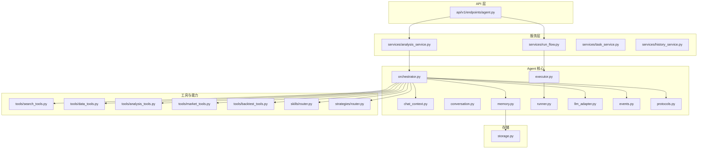
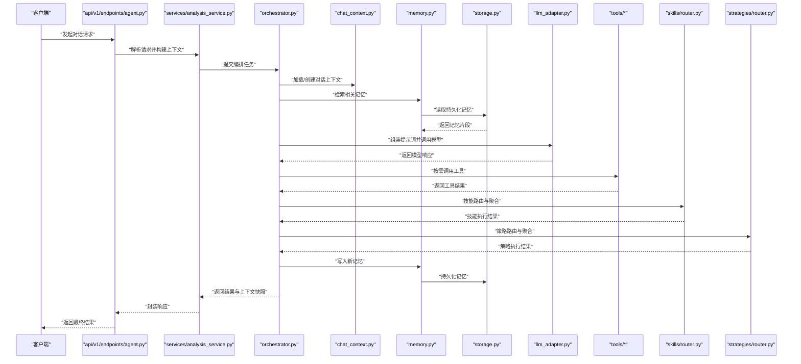
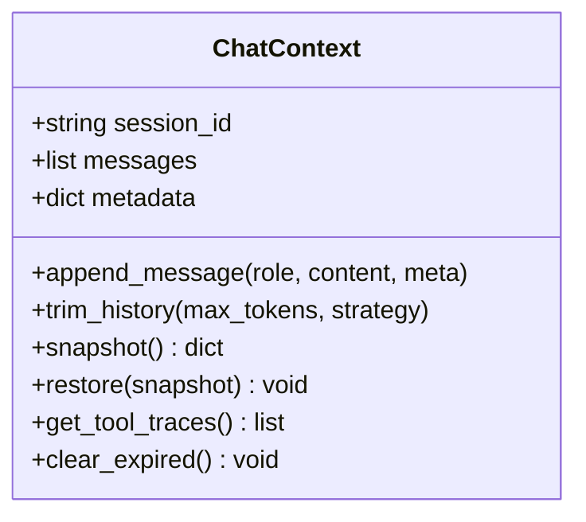
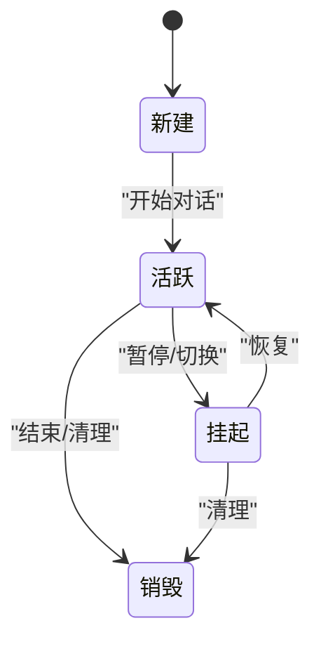
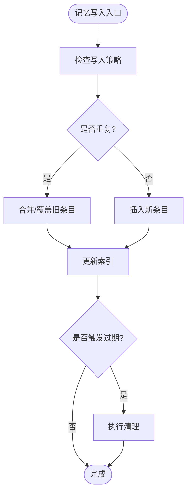
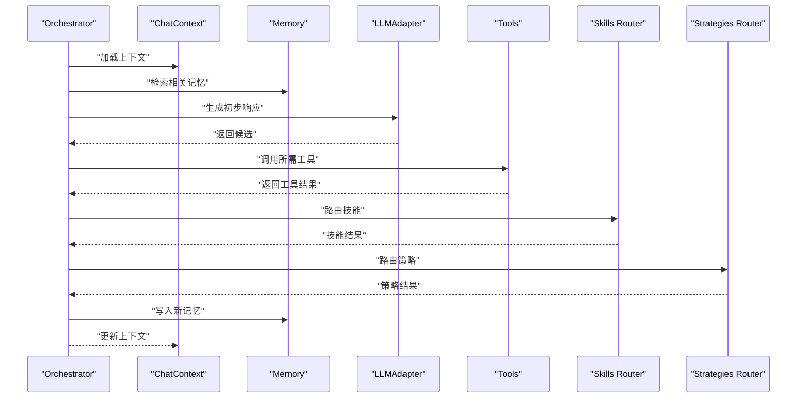
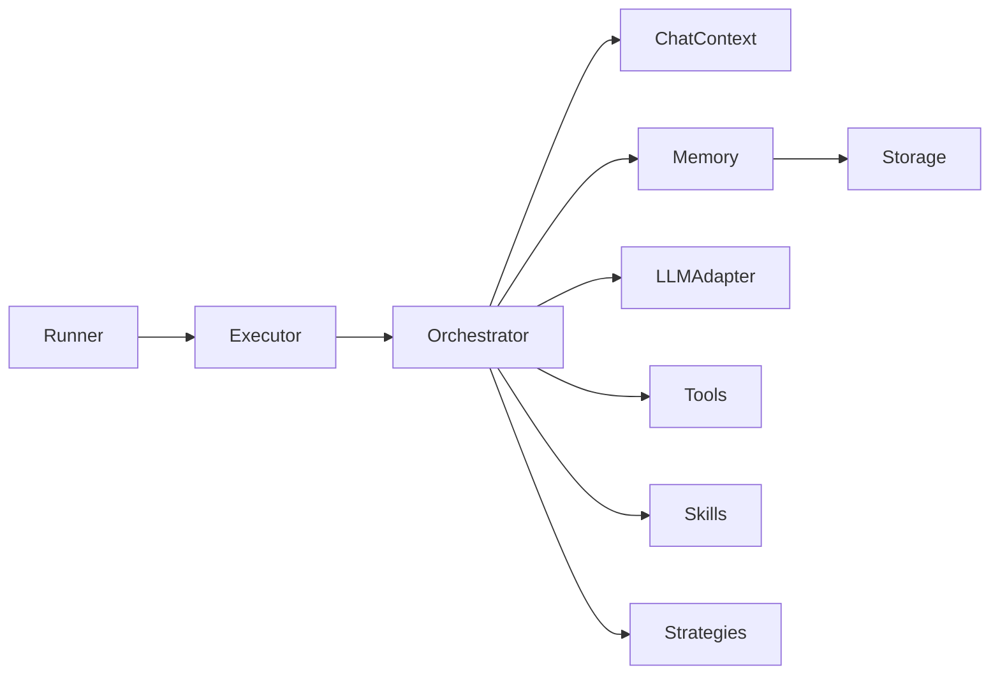

# 对话上下文与记忆管理

<cite>
**本文引用的文件**   
- [src/agent/chat_context.py](file://src/agent/chat_context.py)
- [src/agent/conversation.py](file://src/agent/conversation.py)
- [src/agent/memory.py](file://src/agent/memory.py)
- [src/agent/orchestrator.py](file://src/agent/orchestrator.py)
- [src/agent/executor.py](file://src/agent/executor.py)
- [src/agent/factory.py](file://src/agent/factory.py)
- [src/agent/llm_adapter.py](file://src/agent/llm_adapter.py)
- [src/agent/events.py](file://src/agent/events.py)
- [src/agent/protocols.py](file://src/agent/protocols.py)
- [src/agent/research.py](file://src/agent/research.py)
- [src/agent/runner.py](file://src/agent/runner.py)
- [src/agent/provider_trace.py](file://src/agent/provider_trace.py)
- [src/agent/stock_scope.py](file://src/agent/stock_scope.py)
- [src/agent/tools/search_tools.py](file://src/agent/tools/search_tools.py)
- [src/agent/tools/data_tools.py](file://src/agent/tools/data_tools.py)
- [src/agent/tools/analysis_tools.py](file://src/agent/tools/analysis_tools.py)
- [src/agent/tools/market_tools.py](file://src/agent/tools/market_tools.py)
- [src/agent/tools/backtest_tools.py](file://src/agent/tools/backtest_tools.py)
- [src/agent/skills/router.py](file://src/agent/skills/router.py)
- [src/agent/skills/base.py](file://src/agent/skills/base.py)
- [src/agent/skills/aggregator.py](file://src/agent/skills/aggregator.py)
- [src/agent/skills/defaults.py](file://src/agent/skills/defaults.py)
- [src/agent/skills/skill_agent.py](file://src/agent/skills/skill_agent.py)
- [src/agent/strategies/router.py](file://src/agent/strategies/router.py)
- [src/agent/strategies/aggregator.py](file://src/agent/strategies/aggregator.py)
- [src/agent/strategies/strategy_agent.py](file://src/agent/strategies/strategy_agent.py)
- [src/agent/agents/base_agent.py](file://src/agent/agents/base_agent.py)
- [src/agent/agents/decision_agent.py](file://src/agent/agents/decision_agent.py)
- [src/agent/agents/intel_agent.py](file://src/agent/agents/intel_agent.py)
- [src/agent/agents/portfolio_agent.py](file://src/agent/agents/portfolio_agent.py)
- [src/agent/agents/risk_agent.py](file://src/agent/agents/risk_agent.py)
- [src/agent/agents/technical_agent.py](file://src/agent/agents/technical_agent.py)
- [src/services/analysis_service.py](file://src/services/analysis_service.py)
- [src/services/run_flow.py](file://src/services/run_flow.py)
- [src/services/task_service.py](file://src/services/task_service.py)
- [src/services/history_service.py](file://src/services/history_service.py)
- [src/storage.py](file://src/storage.py)
- [api/v1/endpoints/agent.py](file://api/v1/endpoints/agent.py)
- [api/v1/schemas/analysis.py](file://api/v1/schemas/analysis.py)
- [tests/test_chat_context.py](file://tests/test_chat_context.py)
- [tests/test_conversation_manager.py](file://tests/test_conversation_manager.py)
- [tests/test_analysis_context_builder.py](file://tests/test_analysis_context_builder.py)
</cite>

## 目录
1. [简介](#简介)
2. [项目结构](#项目结构)
3. [核心组件](#核心组件)
4. [架构总览](#架构总览)
5. [详细组件分析](#详细组件分析)
6. [依赖关系分析](#依赖关系分析)
7. [性能考虑](#性能考虑)
8. [故障排查指南](#故障排查指南)
9. [结论](#结论)
10. [附录：使用示例与最佳实践](#附录使用示例与最佳实践)

## 简介
本文件面向“对话上下文管理与记忆系统”的使用与实现，聚焦以下目标：
- 如何设置与管理对话上下文、持久化记忆与会话状态
- 长对话优化、内存管理与数据清理的最佳实践
- 通过具体代码路径展示上下文传递、记忆检索与状态恢复的使用方法
- 结合 Agent 编排、工具调用、技能路由与策略聚合，形成端到端可复用的对话工作流

## 项目结构
围绕对话上下文与记忆的核心代码集中在 src/agent 与相关服务层。关键模块职责如下：
- chat_context.py：对话上下文封装与生命周期管理
- conversation.py：会话模型与状态机（创建、切换、恢复）
- memory.py：记忆存储抽象与持久化接口
- orchestrator.py / executor.py / runner.py：对话执行编排、任务调度与运行控制
- llm_adapter.py：大模型适配与参数透传
- events.py / protocols.py：事件系统与协议定义
- tools/*：搜索、数据、分析、市场、回测等工具集
- skills/* 与 strategies/*：技能与策略路由、聚合与执行
- services/*：上层业务编排（分析、运行流、任务、历史）
- storage.py：通用存储抽象（用于上下文与记忆的持久化）
- api/v1/endpoints/agent.py：Agent API 入口，暴露上下文与记忆操作

图表来源
- [api/v1/endpoints/agent.py](file://api/v1/endpoints/agent.py)
- [src/services/analysis_service.py](file://src/services/analysis_service.py)
- [src/services/run_flow.py](file://src/services/run_flow.py)
- [src/services/task_service.py](file://src/services/task_service.py)
- [src/services/history_service.py](file://src/services/history_service.py)
- [src/agent/chat_context.py](file://src/agent/chat_context.py)
- [src/agent/conversation.py](file://src/agent/conversation.py)
- [src/agent/memory.py](file://src/agent/memory.py)
- [src/agent/orchestrator.py](file://src/agent/orchestrator.py)
- [src/agent/executor.py](file://src/agent/executor.py)
- [src/agent/runner.py](file://src/agent/runner.py)
- [src/agent/llm_adapter.py](file://src/agent/llm_adapter.py)
- [src/agent/events.py](file://src/agent/events.py)
- [src/agent/protocols.py](file://src/agent/protocols.py)
- [src/agent/tools/search_tools.py](file://src/agent/tools/search_tools.py)
- [src/agent/tools/data_tools.py](file://src/agent/tools/data_tools.py)
- [src/agent/tools/analysis_tools.py](file://src/agent/tools/analysis_tools.py)
- [src/agent/tools/market_tools.py](file://src/agent/tools/market_tools.py)
- [src/agent/tools/backtest_tools.py](file://src/agent/tools/backtest_tools.py)
- [src/agent/skills/router.py](file://src/agent/skills/router.py)
- [src/agent/strategies/router.py](file://src/agent/strategies/router.py)
- [src/storage.py](file://src/storage.py)

章节来源
- [api/v1/endpoints/agent.py](file://api/v1/endpoints/agent.py)
- [src/agent/chat_context.py](file://src/agent/chat_context.py)
- [src/agent/conversation.py](file://src/agent/conversation.py)
- [src/agent/memory.py](file://src/agent/memory.py)
- [src/agent/orchestrator.py](file://src/agent/orchestrator.py)
- [src/agent/executor.py](file://src/agent/executor.py)
- [src/agent/runner.py](file://src/agent/runner.py)
- [src/agent/llm_adapter.py](file://src/agent/llm_adapter.py)
- [src/agent/events.py](file://src/agent/events.py)
- [src/agent/protocols.py](file://src/agent/protocols.py)
- [src/storage.py](file://src/storage.py)

## 核心组件
- 对话上下文（ChatContext）
  - 负责维护当前对话的输入、输出、中间结果、工具调用痕迹、时间戳与元数据
  - 提供追加消息、裁剪历史、快照与恢复等方法
- 会话（Conversation）
  - 管理会话生命周期（创建、激活、挂起、恢复、销毁）
  - 维护会话级配置（如模型参数、工具权限、记忆策略）
- 记忆（Memory）
  - 抽象记忆读写接口，支持短期/长期记忆、索引与检索
  - 与存储后端（storage）对接，实现持久化与清理策略
- 编排器（Orchestrator）
  - 协调上下文、记忆、LLM 适配器、工具与技能/策略路由
  - 驱动执行流程，处理事件与错误
- 执行器（Executor）与运行器（Runner）
  - 将编排计划转化为具体步骤，管理并发、超时与重试
- LLM 适配器（LLMAdapter）
  - 统一不同模型的调用接口，透传上下文与参数
- 事件与协议（Events, Protocols）
  - 定义对话过程中的事件类型与契约，便于扩展与调试

章节来源
- [src/agent/chat_context.py](file://src/agent/chat_context.py)
- [src/agent/conversation.py](file://src/agent/conversation.py)
- [src/agent/memory.py](file://src/agent/memory.py)
- [src/agent/orchestrator.py](file://src/agent/orchestrator.py)
- [src/agent/executor.py](file://src/agent/executor.py)
- [src/agent/runner.py](file://src/agent/runner.py)
- [src/agent/llm_adapter.py](file://src/agent/llm_adapter.py)
- [src/agent/events.py](file://src/agent/events.py)
- [src/agent/protocols.py](file://src/agent/protocols.py)

## 架构总览
下图展示了从 API 到 Agent 核心、再到工具与存储的完整调用链，以及上下文与记忆在其中的流转。

图表来源
- [api/v1/endpoints/agent.py](file://api/v1/endpoints/agent.py)
- [src/services/analysis_service.py](file://src/services/analysis_service.py)
- [src/agent/orchestrator.py](file://src/agent/orchestrator.py)
- [src/agent/chat_context.py](file://src/agent/chat_context.py)
- [src/agent/memory.py](file://src/agent/memory.py)
- [src/storage.py](file://src/storage.py)
- [src/agent/llm_adapter.py](file://src/agent/llm_adapter.py)
- [src/agent/tools/search_tools.py](file://src/agent/tools/search_tools.py)
- [src/agent/tools/data_tools.py](file://src/agent/tools/data_tools.py)
- [src/agent/tools/analysis_tools.py](file://src/agent/tools/analysis_tools.py)
- [src/agent/tools/market_tools.py](file://src/agent/tools/market_tools.py)
- [src/agent/tools/backtest_tools.py](file://src/agent/tools/backtest_tools.py)
- [src/agent/skills/router.py](file://src/agent/skills/router.py)
- [src/agent/strategies/router.py](file://src/agent/strategies/router.py)

## 详细组件分析

### 对话上下文（ChatContext）
- 设计要点
  - 以“消息序列 + 元数据”的形式组织上下文，支持按长度或重要性裁剪
  - 提供快照（snapshot）与恢复（restore）机制，便于会话中断后重建
  - 与记忆系统解耦，仅持有必要引用与键值映射
- 典型用法
  - 初始化上下文：传入会话ID、初始消息、工具列表与配置
  - 追加消息：记录用户输入与模型输出，附带时间戳与来源
  - 裁剪历史：基于窗口大小或权重阈值进行压缩
  - 导出与导入：用于跨进程或跨实例迁移

图表来源
- [src/agent/chat_context.py](file://src/agent/chat_context.py)

章节来源
- [src/agent/chat_context.py](file://src/agent/chat_context.py)

### 会话（Conversation）
- 设计要点
  - 会话状态机：新建、活跃、挂起、恢复、销毁
  - 会话级配置：模型参数、工具权限、记忆策略、超时与重试
  - 与上下文绑定：每个会话对应一个上下文实例
- 典型用法
  - 创建会话：指定会话ID与配置
  - 切换会话：保存当前上下文快照并加载目标会话
  - 恢复会话：从持久化快照重建上下文与记忆指针

图表来源
- [src/agent/conversation.py](file://src/agent/conversation.py)

章节来源
- [src/agent/conversation.py](file://src/agent/conversation.py)

### 记忆（Memory）
- 设计要点
  - 短期记忆：会话内高频信息，快速读写
  - 长期记忆：跨会话重要知识，支持索引与检索
  - 记忆策略：写入时机、去重、过期与压缩
- 典型用法
  - 检索记忆：根据关键词、语义或时间范围查询
  - 写入记忆：增量更新与批量写入
  - 清理记忆：按策略删除过期或低价值条目

图表来源
- [src/agent/memory.py](file://src/agent/memory.py)
- [src/storage.py](file://src/storage.py)

章节来源
- [src/agent/memory.py](file://src/agent/memory.py)
- [src/storage.py](file://src/storage.py)

### 编排器（Orchestrator）
- 设计要点
  - 协调上下文、记忆、LLM、工具、技能与策略
  - 定义执行阶段：准备、推理、工具调用、聚合、输出
  - 事件驱动：发布/订阅对话事件，便于监控与调试
- 典型用法
  - 构建编排计划：根据用户意图选择工具与技能
  - 执行计划：逐步推进，处理异常与重试
  - 产出结果：整合各阶段结果，更新上下文与记忆

图表来源
- [src/agent/orchestrator.py](file://src/agent/orchestrator.py)
- [src/agent/chat_context.py](file://src/agent/chat_context.py)
- [src/agent/memory.py](file://src/agent/memory.py)
- [src/agent/llm_adapter.py](file://src/agent/llm_adapter.py)
- [src/agent/tools/search_tools.py](file://src/agent/tools/search_tools.py)
- [src/agent/skills/router.py](file://src/agent/skills/router.py)
- [src/agent/strategies/router.py](file://src/agent/strategies/router.py)

章节来源
- [src/agent/orchestrator.py](file://src/agent/orchestrator.py)

### 执行器（Executor）与运行器（Runner）
- 设计要点
  - Executor：将编排计划分解为可执行的步骤，管理并发与资源
  - Runner：负责步骤的实际执行，包含超时、重试与日志
- 典型用法
  - 注册步骤：定义步骤类型、依赖与回调
  - 执行步骤：按依赖顺序执行，捕获异常并上报事件
  - 清理资源：释放临时对象与连接

章节来源
- [src/agent/executor.py](file://src/agent/executor.py)
- [src/agent/runner.py](file://src/agent/runner.py)

### LLM 适配器（LLMAdapter）
- 设计要点
  - 统一不同模型的调用接口，支持参数透传与追踪
  - 与上下文集成：自动注入系统提示、历史与工具描述
- 典型用法
  - 初始化适配器：配置模型、密钥与限流
  - 调用模型：传入上下文与参数，获取响应
  - 追踪用量：记录 token 消耗与延迟

章节来源
- [src/agent/llm_adapter.py](file://src/agent/llm_adapter.py)
- [src/agent/provider_trace.py](file://src/agent/provider_trace.py)

### 事件与协议（Events, Protocols）
- 设计要点
  - Events：定义对话过程中的事件类型（如消息发送、工具调用、错误）
  - Protocols：定义组件间交互的契约（如记忆接口、工具接口）
- 典型用法
  - 订阅事件：监听关键节点，用于监控与审计
  - 实现协议：自定义工具或记忆后端需遵循的接口

章节来源
- [src/agent/events.py](file://src/agent/events.py)
- [src/agent/protocols.py](file://src/agent/protocols.py)

### 工具与能力（Tools, Skills, Strategies）
- 工具（Tools）
  - search_tools.py：搜索与信息获取
  - data_tools.py：数据拉取与预处理
  - analysis_tools.py：分析与指标计算
  - market_tools.py：市场信息与行情
  - backtest_tools.py：回测与评估
- 技能（Skills）
  - router.py：技能路由与选择
  - base.py：技能基类与生命周期
  - aggregator.py：多技能结果聚合
  - defaults.py：默认技能集合
  - skill_agent.py：技能执行代理
- 策略（Strategies）
  - router.py：策略路由与选择
  - aggregator.py：多策略结果聚合
  - strategy_agent.py：策略执行代理

章节来源
- [src/agent/tools/search_tools.py](file://src/agent/tools/search_tools.py)
- [src/agent/tools/data_tools.py](file://src/agent/tools/data_tools.py)
- [src/agent/tools/analysis_tools.py](file://src/agent/tools/analysis_tools.py)
- [src/agent/tools/market_tools.py](file://src/agent/tools/market_tools.py)
- [src/agent/tools/backtest_tools.py](file://src/agent/tools/backtest_tools.py)
- [src/agent/skills/router.py](file://src/agent/skills/router.py)
- [src/agent/skills/base.py](file://src/agent/skills/base.py)
- [src/agent/skills/aggregator.py](file://src/agent/skills/aggregator.py)
- [src/agent/skills/defaults.py](file://src/agent/skills/defaults.py)
- [src/agent/skills/skill_agent.py](file://src/agent/skills/skill_agent.py)
- [src/agent/strategies/router.py](file://src/agent/strategies/router.py)
- [src/agent/strategies/aggregator.py](file://src/agent/strategies/aggregator.py)
- [src/agent/strategies/strategy_agent.py](file://src/agent/strategies/strategy_agent.py)

### Agent 家族（Agents）
- base_agent.py：Agent 基类，定义通用行为
- decision_agent.py：决策型 Agent
- intel_agent.py：情报收集与分析 Agent
- portfolio_agent.py：投资组合管理 Agent
- risk_agent.py：风险评估 Agent
- technical_agent.py：技术分析 Agent

章节来源
- [src/agent/agents/base_agent.py](file://src/agent/agents/base_agent.py)
- [src/agent/agents/decision_agent.py](file://src/agent/agents/decision_agent.py)
- [src/agent/agents/intel_agent.py](file://src/agent/agents/intel_agent.py)
- [src/agent/agents/portfolio_agent.py](file://src/agent/agents/portfolio_agent.py)
- [src/agent/agents/risk_agent.py](file://src/agent/agents/risk_agent.py)
- [src/agent/agents/technical_agent.py](file://src/agent/agents/technical_agent.py)

## 依赖关系分析
- 组件耦合
  - Orchestrator 强依赖 ChatContext、Memory、LLMAdapter、Tools、Skills、Strategies
  - Memory 依赖 Storage 抽象，便于替换后端
  - Executor/Runner 依赖 Orchestrator 的计划与事件系统
- 外部依赖
  - LLM 提供商（通过 LLMAdapter 抽象）
  - 存储后端（通过 Storage 抽象）
- 潜在循环依赖
  - 确保 Tools/Skills/Strategies 不反向依赖 Orchestrator，避免循环

图表来源
- [src/agent/orchestrator.py](file://src/agent/orchestrator.py)
- [src/agent/chat_context.py](file://src/agent/chat_context.py)
- [src/agent/memory.py](file://src/agent/memory.py)
- [src/agent/llm_adapter.py](file://src/agent/llm_adapter.py)
- [src/agent/tools/search_tools.py](file://src/agent/tools/search_tools.py)
- [src/agent/skills/router.py](file://src/agent/skills/router.py)
- [src/agent/strategies/router.py](file://src/agent/strategies/router.py)
- [src/agent/executor.py](file://src/agent/executor.py)
- [src/agent/runner.py](file://src/agent/runner.py)
- [src/storage.py](file://src/storage.py)

章节来源
- [src/agent/orchestrator.py](file://src/agent/orchestrator.py)
- [src/agent/memory.py](file://src/agent/memory.py)
- [src/storage.py](file://src/storage.py)

## 性能考虑
- 长对话优化
  - 上下文裁剪：基于窗口大小与重要性评分压缩历史
  - 记忆摘要：定期生成会话摘要，减少冗余
  - 异步工具调用：并行拉取数据与搜索，降低等待时间
- 内存管理
  - 及时释放临时对象与连接
  - 使用生成器与流式处理，避免一次性加载大量数据
  - 限制单次请求的消息数量与工具调用次数
- 数据清理
  - 设置记忆过期策略与清理周期
  - 归档或冷存储低频访问的记忆
  - 监控内存占用与 GC 行为，调整阈值

[本节为通用指导，无需特定文件来源]

## 故障排查指南
- 常见问题
  - 上下文丢失：检查会话恢复逻辑与快照完整性
  - 记忆检索失败：确认索引与存储后端可用性
  - 工具调用超时：检查网络与限流策略
  - LLM 调用失败：验证密钥、配额与模型参数
- 调试建议
  - 启用事件订阅，观察关键节点
  - 打印上下文快照与记忆片段
  - 使用 Provider Trace 跟踪 LLM 调用详情

章节来源
- [src/agent/events.py](file://src/agent/events.py)
- [src/agent/provider_trace.py](file://src/agent/provider_trace.py)
- [src/agent/memory.py](file://src/agent/memory.py)
- [src/agent/chat_context.py](file://src/agent/chat_context.py)

## 结论
本系统通过清晰的上下文管理、灵活的记忆抽象与强大的编排能力，实现了可扩展、高性能的对话工作流。结合工具、技能与策略路由，能够应对复杂的股票分析场景。在实际使用中，应重点关注长对话优化、内存管理与数据清理，以确保系统的稳定性与效率。

[本节为总结性内容，无需特定文件来源]

## 附录：使用示例与最佳实践

### 设置与管理对话上下文
- 初始化上下文
  - 参考路径：[src/agent/chat_context.py](file://src/agent/chat_context.py)
- 追加消息与裁剪历史
  - 参考路径：[src/agent/chat_context.py](file://src/agent/chat_context.py)
- 快照与恢复
  - 参考路径：[src/agent/chat_context.py](file://src/agent/chat_context.py)

章节来源
- [src/agent/chat_context.py](file://src/agent/chat_context.py)

### 持久化记忆与会话状态
- 记忆写入与检索
  - 参考路径：[src/agent/memory.py](file://src/agent/memory.py)
- 存储后端对接
  - 参考路径：[src/storage.py](file://src/storage.py)
- 会话状态机
  - 参考路径：[src/agent/conversation.py](file://src/agent/conversation.py)

章节来源
- [src/agent/memory.py](file://src/agent/memory.py)
- [src/storage.py](file://src/storage.py)
- [src/agent/conversation.py](file://src/agent/conversation.py)

### 上下文传递、记忆检索与状态恢复
- 上下文传递
  - 参考路径：[src/agent/orchestrator.py](file://src/agent/orchestrator.py)
- 记忆检索
  - 参考路径：[src/agent/memory.py](file://src/agent/memory.py)
- 状态恢复
  - 参考路径：[src/agent/conversation.py](file://src/agent/conversation.py)

章节来源
- [src/agent/orchestrator.py](file://src/agent/orchestrator.py)
- [src/agent/memory.py](file://src/agent/memory.py)
- [src/agent/conversation.py](file://src/agent/conversation.py)

### 长对话优化与内存管理
- 上下文裁剪策略
  - 参考路径：[src/agent/chat_context.py](file://src/agent/chat_context.py)
- 记忆摘要与清理
  - 参考路径：[src/agent/memory.py](file://src/agent/memory.py)
- 异步与并发控制
  - 参考路径：[src/agent/executor.py](file://src/agent/executor.py)
  - 参考路径：[src/agent/runner.py](file://src/agent/runner.py)

章节来源
- [src/agent/chat_context.py](file://src/agent/chat_context.py)
- [src/agent/memory.py](file://src/agent/memory.py)
- [src/agent/executor.py](file://src/agent/executor.py)
- [src/agent/runner.py](file://src/agent/runner.py)

### 数据清理与最佳实践
- 记忆过期策略
  - 参考路径：[src/agent/memory.py](file://src/agent/memory.py)
- 会话清理与归档
  - 参考路径：[src/agent/conversation.py](file://src/agent/conversation.py)
- 存储后端清理
  - 参考路径：[src/storage.py](file://src/storage.py)

章节来源
- [src/agent/memory.py](file://src/agent/memory.py)
- [src/agent/conversation.py](file://src/agent/conversation.py)
- [src/storage.py](file://src/storage.py)

### API 集成示例
- 通过 API 发起对话
  - 参考路径：[api/v1/endpoints/agent.py](file://api/v1/endpoints/agent.py)
- 请求与响应结构
  - 参考路径：[api/v1/schemas/analysis.py](file://api/v1/schemas/analysis.py)

章节来源
- [api/v1/endpoints/agent.py](file://api/v1/endpoints/agent.py)
- [api/v1/schemas/analysis.py](file://api/v1/schemas/analysis.py)

### 测试与验证
- 上下文管理测试
  - 参考路径：[tests/test_chat_context.py](file://tests/test_chat_context.py)
- 会话管理器测试
  - 参考路径：[tests/test_conversation_manager.py](file://tests/test_conversation_manager.py)
- 上下文构建测试
  - 参考路径：[tests/test_analysis_context_builder.py](file://tests/test_analysis_context_builder.py)

章节来源
- [tests/test_chat_context.py](file://tests/test_chat_context.py)
- [tests/test_conversation_manager.py](file://tests/test_conversation_manager.py)
- [tests/test_analysis_context_builder.py](file://tests/test_analysis_context_builder.py)