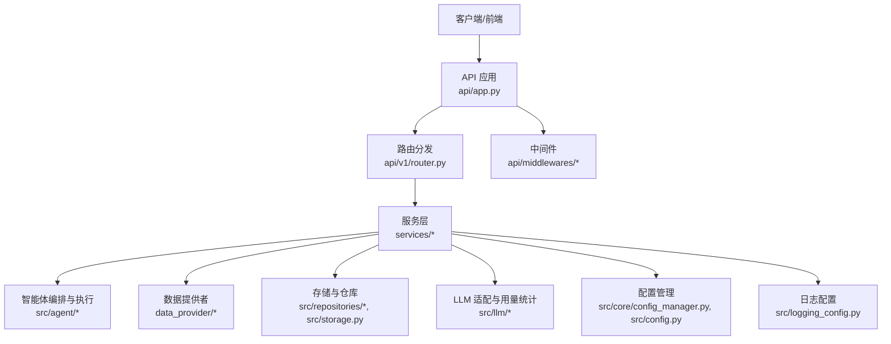
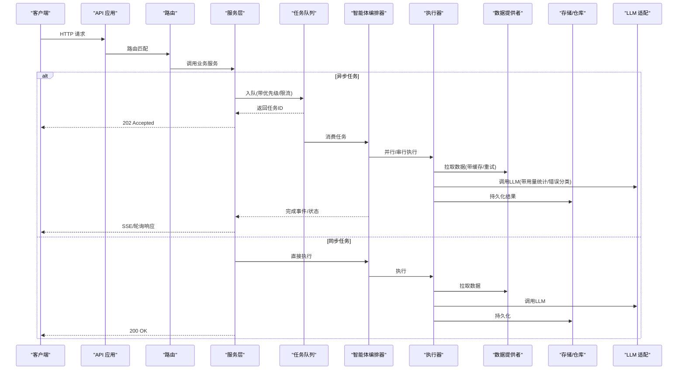
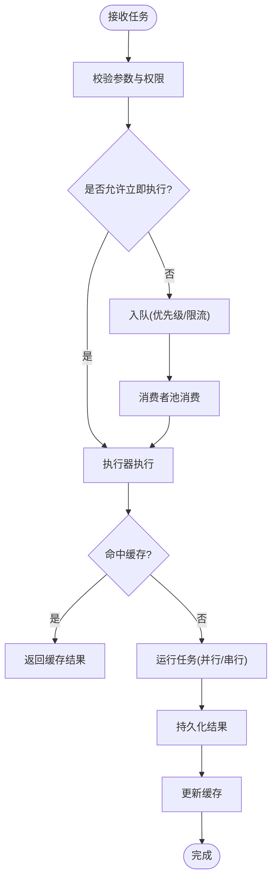
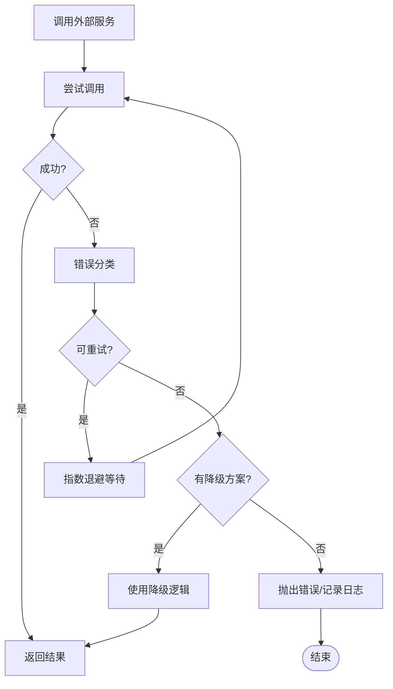
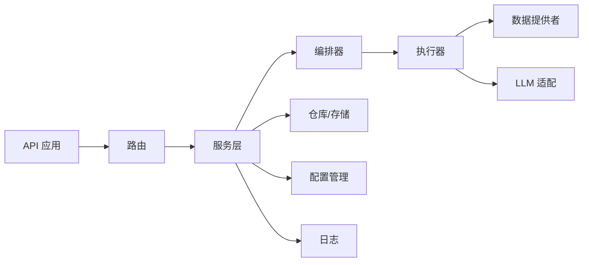

# 性能优化与故障恢复

<cite>
**本文引用的文件**   
- [main.py](file://main.py)
- [server.py](file://server.py)
- [api/app.py](file://api/app.py)
- [api/v1/router.py](file://api/v1/router.py)
- [api/middlewares/error_handler.py](file://api/middlewares/error_handler.py)
- [src/config.py](file://src/config.py)
- [src/core/config_manager.py](file://src/core/config_manager.py)
- [src/services/task_queue.py](file://src/services/task_queue.py)
- [src/services/task_service.py](file://src/services/task_service.py)
- [src/agent/orchestrator.py](file://src/agent/orchestrator.py)
- [src/agent/executor.py](file://src/agent/executor.py)
- [src/llm/errors.py](file://src/llm/errors.py)
- [src/llm/usage.py](file://src/llm/usage.py)
- [data_provider/base.py](file://data_provider/base.py)
- [src/repositories/analysis_repo.py](file://src/repositories/analysis_repo.py)
- [src/storage.py](file://src/storage.py)
- [src/logging_config.py](file://src/logging_config.py)
- [docker/Dockerfile](file://docker/Dockerfile)
- [docker/docker-compose.yml](file://docker/docker-compose.yml)
</cite>

## 目录
1. [简介](#简介)
2. [项目结构](#项目结构)
3. [核心组件](#核心组件)
4. [架构总览](#架构总览)
5. [详细组件分析](#详细组件分析)
6. [依赖关系分析](#依赖关系分析)
7. [性能考虑](#性能考虑)
8. [故障排查指南](#故障排查指南)
9. [结论](#结论)
10. [附录](#附录)

## 简介
本文件面向智能体系统的性能优化与故障恢复，聚焦并发执行、缓存策略、资源管理、错误处理、重试机制、降级策略、监控指标收集、性能调优和问题诊断。文档以仓库实际代码为依据，提供可操作的配置示例与实践建议，帮助读者在生产环境中稳定高效地运行系统。

## 项目结构
系统采用前后端分离与模块化后端设计：
- API 层：FastAPI 应用入口、路由与中间件
- 服务层：任务队列、任务调度、LLM 调用、数据获取、存储与报表渲染
- 智能体层：编排器、执行器、工具与技能
- 数据提供者：多源行情与基本面数据拉取
- 基础设施：配置管理、日志、Docker 部署

图示来源
- [api/app.py](file://api/app.py)
- [api/v1/router.py](file://api/v1/router.py)
- [src/services/task_queue.py](file://src/services/task_queue.py)
- [src/agent/orchestrator.py](file://src/agent/orchestrator.py)
- [data_provider/base.py](file://data_provider/base.py)
- [src/repositories/analysis_repo.py](file://src/repositories/analysis_repo.py)
- [src/storage.py](file://src/storage.py)
- [src/llm/usage.py](file://src/llm/usage.py)
- [src/core/config_manager.py](file://src/core/config_manager.py)
- [src/logging_config.py](file://src/logging_config.py)

章节来源
- [main.py](file://main.py)
- [server.py](file://server.py)
- [api/app.py](file://api/app.py)
- [api/v1/router.py](file://api/v1/router.py)

## 核心组件
- 应用启动与生命周期：通过主入口与服务进程初始化，注册中间件、路由与全局配置
- 任务队列与并发：基于队列的任务分发与消费者池，支持限流与背压
- 智能体编排与执行：编排器协调多个智能体并行或串行执行，执行器负责具体任务派发
- LLM 适配与用量：统一调用接口、错误分类与用量统计
- 数据提供者抽象：统一拉取接口、超时与重试、缓存键生成
- 存储与仓库：读写封装、事务与一致性保障
- 配置与日志：集中式配置加载、运行时开关与结构化日志

章节来源
- [src/services/task_queue.py](file://src/services/task_queue.py)
- [src/services/task_service.py](file://src/services/task_service.py)
- [src/agent/orchestrator.py](file://src/agent/orchestrator.py)
- [src/agent/executor.py](file://src/agent/executor.py)
- [src/llm/errors.py](file://src/llm/errors.py)
- [src/llm/usage.py](file://src/llm/usage.py)
- [data_provider/base.py](file://data_provider/base.py)
- [src/repositories/analysis_repo.py](file://src/repositories/analysis_repo.py)
- [src/storage.py](file://src/storage.py)
- [src/core/config_manager.py](file://src/core/config_manager.py)
- [src/logging_config.py](file://src/logging_config.py)

## 架构总览
下图展示请求从进入 API 到服务层、智能体编排、数据获取与存储的完整链路，并标注关键的性能与容错点（并发、缓存、重试、降级）。

图示来源
- [api/app.py](file://api/app.py)
- [api/v1/router.py](file://api/v1/router.py)
- [src/services/task_queue.py](file://src/services/task_queue.py)
- [src/agent/orchestrator.py](file://src/agent/orchestrator.py)
- [src/agent/executor.py](file://src/agent/executor.py)
- [data_provider/base.py](file://data_provider/base.py)
- [src/repositories/analysis_repo.py](file://src/repositories/analysis_repo.py)
- [src/storage.py](file://src/storage.py)
- [src/llm/usage.py](file://src/llm/usage.py)

## 详细组件分析

### 并发执行与任务队列
- 任务队列负责将高耗时任务异步化，支持优先级、限流与背压，避免阻塞请求线程
- 消费者池大小与批处理参数影响吞吐与延迟，需结合 CPU/IO 特性调优
- 任务幂等性与去重键可减少重复执行与资源浪费

图示来源
- [src/services/task_queue.py](file://src/services/task_queue.py)
- [src/services/task_service.py](file://src/services/task_service.py)
- [src/agent/orchestrator.py](file://src/agent/orchestrator.py)
- [src/agent/executor.py](file://src/agent/executor.py)

章节来源
- [src/services/task_queue.py](file://src/services/task_queue.py)
- [src/services/task_service.py](file://src/services/task_service.py)
- [src/agent/orchestrator.py](file://src/agent/orchestrator.py)
- [src/agent/executor.py](file://src/agent/executor.py)

### 缓存策略
- 在数据拉取与 LLM 调用路径引入缓存，使用稳定的缓存键（如标的+时间窗口+参数哈希）
- 设置合理的过期时间与失效策略，避免脏读与雪崩
- 对热点查询启用本地内存缓存，对跨实例共享数据使用分布式缓存

章节来源
- [data_provider/base.py](file://data_provider/base.py)
- [src/repositories/analysis_repo.py](file://src/repositories/analysis_repo.py)
- [src/storage.py](file://src/storage.py)

### 资源管理与限流
- 限制并发度与连接池大小，防止下游服务过载
- 使用令牌桶或漏桶算法进行速率控制，保护系统稳定性
- 合理设置超时与退避策略，避免级联失败

章节来源
- [src/services/task_queue.py](file://src/services/task_queue.py)
- [src/agent/orchestrator.py](file://src/agent/orchestrator.py)

### 错误处理、重试与降级
- 区分可重试与不可重试错误，针对网络抖动、限流与临时故障实施指数退避重试
- 实现降级路径：当 LLM 不可用时回退到规则引擎或缓存结果；数据源不可用时切换备用源
- 统一错误分类与上报，便于监控告警与问题定位

图示来源
- [src/llm/errors.py](file://src/llm/errors.py)
- [data_provider/base.py](file://data_provider/base.py)
- [src/repositories/analysis_repo.py](file://src/repositories/analysis_repo.py)

章节来源
- [src/llm/errors.py](file://src/llm/errors.py)
- [data_provider/base.py](file://data_provider/base.py)
- [src/repositories/analysis_repo.py](file://src/repositories/analysis_repo.py)

### 监控指标与用量统计
- 采集 LLM 调用次数、延迟分布、错误率与用量（token 计数）
- 暴露健康检查与系统指标（队列长度、消费者数、缓存命中率）
- 将关键指标写入日志与监控系统，支持告警与回溯

章节来源
- [src/llm/usage.py](file://src/llm/usage.py)
- [src/logging_config.py](file://src/logging_config.py)

### 配置与运行时开关
- 集中式配置管理支持热更新与灰度发布
- 关键开关包括：并发度、超时、重试次数、缓存 TTL、降级开关
- 配置项按环境隔离，确保生产与测试一致

章节来源
- [src/core/config_manager.py](file://src/core/config_manager.py)
- [src/config.py](file://src/config.py)

## 依赖关系分析
- API 层依赖路由与服务层，服务层依赖智能体编排与执行、数据提供者、存储与 LLM 适配
- 配置与日志为横切关注点，贯穿各层
- 数据提供者与存储模块解耦，便于替换与扩展

图示来源
- [api/app.py](file://api/app.py)
- [api/v1/router.py](file://api/v1/router.py)
- [src/services/task_queue.py](file://src/services/task_queue.py)
- [src/agent/orchestrator.py](file://src/agent/orchestrator.py)
- [src/agent/executor.py](file://src/agent/executor.py)
- [data_provider/base.py](file://data_provider/base.py)
- [src/repositories/analysis_repo.py](file://src/repositories/analysis_repo.py)
- [src/storage.py](file://src/storage.py)
- [src/core/config_manager.py](file://src/core/config_manager.py)
- [src/logging_config.py](file://src/logging_config.py)

章节来源
- [api/app.py](file://api/app.py)
- [api/v1/router.py](file://api/v1/router.py)
- [src/services/task_queue.py](file://src/services/task_queue.py)
- [src/agent/orchestrator.py](file://src/agent/orchestrator.py)
- [src/agent/executor.py](file://src/agent/executor.py)
- [data_provider/base.py](file://data_provider/base.py)
- [src/repositories/analysis_repo.py](file://src/repositories/analysis_repo.py)
- [src/storage.py](file://src/storage.py)
- [src/core/config_manager.py](file://src/core/config_manager.py)
- [src/logging_config.py](file://src/logging_config.py)

## 性能考虑
- 并发与吞吐
  - 调整消费者池大小与批处理参数，匹配 IO/CPU 瓶颈
  - 使用异步 I/O 与连接池减少上下文切换与连接开销
- 缓存与命中率
  - 热点数据优先缓存，合理设置 TTL 与失效策略
  - 监控缓存命中率与内存占用，避免溢出
- 超时与退避
  - 设置合理的超时阈值与重试次数，避免长时间阻塞
  - 使用指数退避与抖动降低重试风暴
- 资源隔离
  - 不同任务类型使用独立队列与池，避免相互干扰
  - 限制最大并发与内存使用，防止单点过载
- 监控与观测
  - 采集关键指标（延迟、错误率、队列长度、缓存命中率）
  - 建立告警规则与仪表盘，快速定位瓶颈

[本节为通用指导，不直接分析具体文件]

## 故障排查指南
- 常见问题定位
  - 查看错误分类与堆栈信息，识别可重试与不可重试错误
  - 检查队列积压与消费者状态，确认是否存在阻塞任务
  - 核对缓存命中率与 TTL，避免频繁穿透与雪崩
- 日志与追踪
  - 使用结构化日志记录关键路径与参数，便于回溯
  - 开启链路追踪，串联 API、服务、数据源与 LLM 调用
- 降级与恢复
  - 启用降级开关，切换到备用数据源或规则引擎
  - 逐步恢复流量，观察指标变化，确认稳定性
- 性能调优步骤
  - 先解决错误与超时，再优化并发与缓存
  - 分阶段调整参数，配合监控验证效果

章节来源
- [api/middlewares/error_handler.py](file://api/middlewares/error_handler.py)
- [src/logging_config.py](file://src/logging_config.py)
- [src/llm/errors.py](file://src/llm/errors.py)

## 结论
通过合理的并发执行、缓存策略、资源管理与错误处理，系统可在高负载下保持稳定与高性能。结合监控指标与问题诊断实践，能够快速定位与解决问题，持续优化性能与可靠性。

## 附录
- 部署与环境
  - Docker 镜像构建与容器编排，确保资源限制与健康检查
  - 环境变量与配置文件隔离，保证不同环境一致性

章节来源
- [docker/Dockerfile](file://docker/Dockerfile)
- [docker/docker-compose.yml](file://docker/docker-compose.yml)