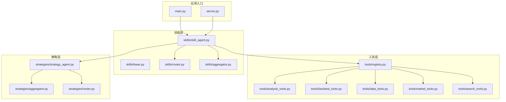
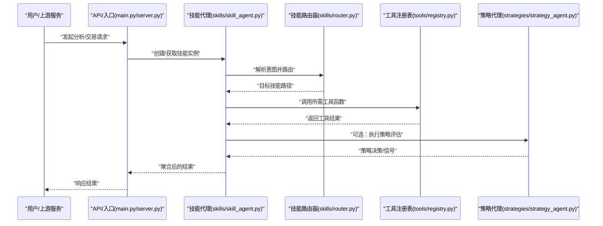
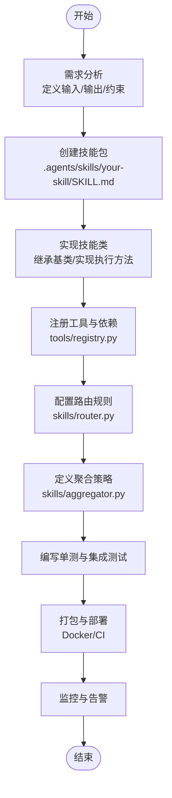
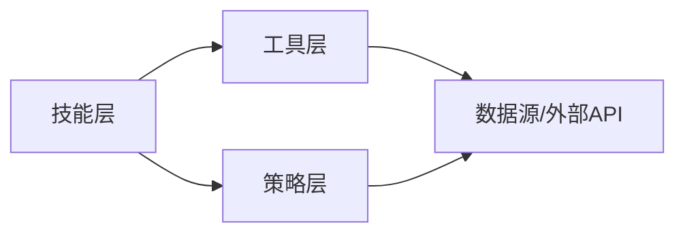

# 技能扩展与自定义

<cite>
**本文档引用的文件**   
- [SKILL.md](file://SKILL.md)
- [.agents/skills/analyze-issue/SKILL.md](file://.agents/skills/analyze-issue/SKILL.md)
- [.agents/skills/analyze-pr/SKILL.md](file://.agents/skills/analyze-pr/SKILL.md)
- [.agents/skills/fix-issue/SKILL.md](file://.agents/skills/fix-issue/SKILL.md)
- [src/agent/skills/base.py](file://src/agent/skills/base.py)
- [src/agent/skills/router.py](file://src/agent/skills/router.py)
- [src/agent/skills/aggregator.py](file://src/agent/skills/aggregator.py)
- [src/agent/skills/skill_agent.py](file://src/agent/skills/skill_agent.py)
- [src/agent/tools/registry.py](file://src/agent/tools/registry.py)
- [src/agent/tools/analysis_tools.py](file://src/agent/tools/analysis_tools.py)
- [src/agent/tools/backtest_tools.py](file://src/agent/tools/backtest_tools.py)
- [src/agent/tools/data_tools.py](file://src/agent/tools/data_tools.py)
- [src/agent/tools/market_tools.py](file://src/agent/tools/market_tools.py)
- [src/agent/tools/search_tools.py](file://src/agent/tools/search_tools.py)
- [src/agent/strategies/strategy_agent.py](file://src/agent/strategies/strategy_agent.py)
- [src/agent/strategies/aggregator.py](file://src/agent/strategies/aggregator.py)
- [src/agent/strategies/router.py](file://src/agent/strategies/router.py)
- [main.py](file://main.py)
- [server.py](file://server.py)
- [pyproject.toml](file://pyproject.toml)
</cite>

## 目录
1. [简介](#简介)
2. [项目结构](#项目结构)
3. [核心组件](#核心组件)
4. [架构总览](#架构总览)
5. [详细组件分析](#详细组件分析)
6. [依赖关系分析](#依赖关系分析)
7. [性能考虑](#性能考虑)
8. [故障排查指南](#故障排查指南)
9. [结论](#结论)
10. [附录](#附录)

## 简介
本文件面向希望为智能体系统开发“技能”“工具”和“策略”的开发者，提供从需求分析到部署测试的完整实践指南。内容涵盖：
- 技能包管理与注册机制
- 工具函数编写与注册
- 策略配置与编排
- 版本控制与兼容性处理
- 端到端示例流程（以仓库中现有技能为例）

## 项目结构
本项目采用分层模块化设计，围绕“技能-工具-策略”三大扩展点组织代码：
- 技能层：定义可被智能体调用的能力单元，支持描述性元数据、路由与聚合
- 工具层：实现具体可调用函数，按领域划分（分析、回测、数据、市场、搜索）
- 策略层：封装交易或分析策略，支持多策略聚合与路由选择
- 运行入口：服务启动、API 路由、任务调度等

图表来源
- [main.py](file://main.py)
- [server.py](file://server.py)
- [src/agent/skills/base.py](file://src/agent/skills/base.py)
- [src/agent/skills/router.py](file://src/agent/skills/router.py)
- [src/agent/skills/aggregator.py](file://src/agent/skills/aggregator.py)
- [src/agent/skills/skill_agent.py](file://src/agent/skills/skill_agent.py)
- [src/agent/tools/registry.py](file://src/agent/tools/registry.py)
- [src/agent/tools/analysis_tools.py](file://src/agent/tools/analysis_tools.py)
- [src/agent/tools/backtest_tools.py](file://src/agent/tools/backtest_tools.py)
- [src/agent/tools/data_tools.py](file://src/agent/tools/data_tools.py)
- [src/agent/tools/market_tools.py](file://src/agent/tools/market_tools.py)
- [src/agent/tools/search_tools.py](file://src/agent/tools/search_tools.py)
- [src/agent/strategies/strategy_agent.py](file://src/agent/strategies/strategy_agent.py)
- [src/agent/strategies/aggregator.py](file://src/agent/strategies/aggregator.py)
- [src/agent/strategies/router.py](file://src/agent/strategies/router.py)

章节来源
- [SKILL.md](file://SKILL.md)
- [pyproject.toml](file://pyproject.toml)

## 核心组件
- 技能基类与描述：定义技能的元数据、输入输出契约、执行钩子与错误处理约定
- 技能路由器：根据上下文将请求分发到对应技能实现
- 技能聚合器：组合多个技能结果，进行合并、去重与排序
- 技能代理：统一加载、缓存与生命周期管理技能实例
- 工具注册表：集中注册工具函数，提供类型化参数校验与文档生成
- 工具集：按领域划分的工具实现，如技术分析、回测、数据获取、行情、搜索
- 策略代理：加载并执行策略，支持多策略聚合与路由
- 策略聚合与路由：对多策略结果进行融合与选择

章节来源
- [src/agent/skills/base.py](file://src/agent/skills/base.py)
- [src/agent/skills/router.py](file://src/agent/skills/router.py)
- [src/agent/skills/aggregator.py](file://src/agent/skills/aggregator.py)
- [src/agent/skills/skill_agent.py](file://src/agent/skills/skill_agent.py)
- [src/agent/tools/registry.py](file://src/agent/tools/registry.py)
- [src/agent/tools/analysis_tools.py](file://src/agent/tools/analysis_tools.py)
- [src/agent/tools/backtest_tools.py](file://src/agent/tools/backtest_tools.py)
- [src/agent/tools/data_tools.py](file://src/agent/tools/data_tools.py)
- [src/agent/tools/market_tools.py](file://src/agent/tools/market_tools.py)
- [src/agent/tools/search_tools.py](file://src/agent/tools/search_tools.py)
- [src/agent/strategies/strategy_agent.py](file://src/agent/strategies/strategy_agent.py)
- [src/agent/strategies/aggregator.py](file://src/agent/strategies/aggregator.py)
- [src/agent/strategies/router.py](file://src/agent/strategies/router.py)

## 架构总览
下图展示“技能-工具-策略”在运行时的交互关系，以及入口如何驱动整个扩展体系。

图表来源
- [main.py](file://main.py)
- [server.py](file://server.py)
- [src/agent/skills/skill_agent.py](file://src/agent/skills/skill_agent.py)
- [src/agent/skills/router.py](file://src/agent/skills/router.py)
- [src/agent/tools/registry.py](file://src/agent/tools/registry.py)
- [src/agent/strategies/strategy_agent.py](file://src/agent/strategies/strategy_agent.py)

## 详细组件分析

### 技能包与描述（.agents/skills/*）
- 每个技能包包含一个 SKILL.md，用于描述技能名称、用途、输入输出、使用示例与注意事项
- 建议遵循统一的命名规范与目录结构，便于自动发现与加载
- 示例技能包：
  - 问题分析技能：用于问题分类、复现步骤提取与修复建议
  - PR 分析技能：用于变更影响面评估、风险识别与回归检查
  - 问题修复技能：用于定位根因、生成补丁与验证方案

章节来源
- [.agents/skills/analyze-issue/SKILL.md](file://.agents/skills/analyze-issue/SKILL.md)
- [.agents/skills/analyze-pr/SKILL.md](file://.agents/skills/analyze-pr/SKILL.md)
- [.agents/skills/fix-issue/SKILL.md](file://.agents/skills/fix-issue/SKILL.md)

### 技能基类与协议（skills/base.py）
- 定义技能抽象接口：初始化、执行、清理、错误处理与日志记录
- 提供输入校验、上下文注入与结果序列化
- 建议子类实现：
  - 明确的输入输出模型
  - 幂等性与重试策略
  - 超时与资源释放

章节来源
- [src/agent/skills/base.py](file://src/agent/skills/base.py)

### 技能路由器（skills/router.py）
- 基于意图识别与上下文匹配，将请求路由到具体技能
- 支持优先级、权重与条件分支
- 建议：
  - 维护路由规则的可配置化
  - 提供调试日志与命中统计

章节来源
- [src/agent/skills/router.py](file://src/agent/skills/router.py)

### 技能聚合器（skills/aggregator.py）
- 合并多个技能输出，支持去重、排序、过滤与摘要生成
- 提供冲突解决与一致性校验
- 建议：
  - 可扩展的合并策略（加权平均、投票、阈值判定）
  - 增量更新与缓存

章节来源
- [src/agent/skills/aggregator.py](file://src/agent/skills/aggregator.py)

### 技能代理（skills/skill_agent.py）
- 负责技能的生命周期管理：加载、缓存、热更新与销毁
- 协调路由器与聚合器，统一异常处理与追踪
- 建议：
  - 异步执行与并发控制
  - 健康检查与降级策略

章节来源
- [src/agent/skills/skill_agent.py](file://src/agent/skills/skill_agent.py)

### 工具注册表（tools/registry.py）
- 集中注册工具函数，提供名称到实现的映射
- 支持参数校验、默认值与文档生成
- 建议：
  - 版本兼容字段与弃用标记
  - 权限与访问控制

章节来源
- [src/agent/tools/registry.py](file://src/agent/tools/registry.py)

### 工具集（tools/*）
- 分析工具：技术指标计算、形态识别、因子构建
- 回测工具：历史数据回放、策略评估、绩效统计
- 数据工具：行情与基本面数据获取、清洗与对齐
- 市场工具：指数、板块、资金流、情绪指标
- 搜索工具：新闻、公告、研报检索与摘要

章节来源
- [src/agent/tools/analysis_tools.py](file://src/agent/tools/analysis_tools.py)
- [src/agent/tools/backtest_tools.py](file://src/agent/tools/backtest_tools.py)
- [src/agent/tools/data_tools.py](file://src/agent/tools/data_tools.py)
- [src/agent/tools/market_tools.py](file://src/agent/tools/market_tools.py)
- [src/agent/tools/search_tools.py](file://src/agent/tools/search_tools.py)

### 策略代理与聚合（strategies/*）
- 策略代理：加载策略配置、执行策略逻辑、输出信号
- 策略聚合：多策略结果融合，支持动态权重与切换
- 策略路由：根据市场环境或资产类别选择合适策略

章节来源
- [src/agent/strategies/strategy_agent.py](file://src/agent/strategies/strategy_agent.py)
- [src/agent/strategies/aggregator.py](file://src/agent/strategies/aggregator.py)
- [src/agent/strategies/router.py](file://src/agent/strategies/router.py)

### 端到端示例：从需求到部署测试
以下流程以“新增一个市场分析技能”为例：
- 需求分析：明确输入（标的、时间窗口、指标）、输出（评分、信号、报告片段）
- 技能包创建：在 .agents/skills/your-skill 下创建 SKILL.md，描述用法与示例
- 技能实现：继承基类，实现执行逻辑；通过工具注册表注册所需工具
- 路由与聚合：在路由器中添加规则，在聚合器中定义合并策略
- 配置与版本：在 pyproject.toml 或配置文件中声明依赖与版本约束
- 单元测试：覆盖正常路径、边界条件与异常场景
- 集成测试：端到端调用 API，验证结果一致性与性能
- 部署与监控：容器化打包，设置健康检查与告警

[此图为概念流程图，不直接映射具体源码文件]

## 依赖关系分析
技能、工具与策略之间存在清晰的依赖层次：
- 技能依赖工具与策略
- 工具之间相对独立，通过注册表解耦
- 策略可复用工具，但不反向依赖技能

图表来源
- [src/agent/skills/base.py](file://src/agent/skills/base.py)
- [src/agent/tools/registry.py](file://src/agent/tools/registry.py)
- [src/agent/strategies/strategy_agent.py](file://src/agent/strategies/strategy_agent.py)

章节来源
- [pyproject.toml](file://pyproject.toml)

## 性能考虑
- 并发与异步：技能与工具调用建议使用异步框架，避免阻塞
- 缓存与去重：对热点数据与中间结果进行缓存，减少重复计算
- 超时与熔断：对外部 API 设置合理超时与重试上限，失败快速失败
- 资源管理：显式释放连接与内存，避免泄漏
- 监控与度量：记录关键指标（延迟、吞吐、错误率），便于优化

## 故障排查指南
- 技能加载失败：检查 SKILL.md 格式与必填字段，确认依赖已安装
- 工具未找到：核对注册表中的名称与版本，确保导入路径正确
- 路由不命中：查看路由规则优先级与条件，增加调试日志
- 聚合结果异常：检查合并策略与数据类型，添加一致性校验
- 性能退化：定位慢调用，启用采样日志与火焰图分析

章节来源
- [src/agent/skills/base.py](file://src/agent/skills/base.py)
- [src/agent/tools/registry.py](file://src/agent/tools/registry.py)
- [src/agent/skills/router.py](file://src/agent/skills/router.py)
- [src/agent/skills/aggregator.py](file://src/agent/skills/aggregator.py)

## 结论
通过统一的技能、工具与策略扩展体系，项目实现了高内聚、低耦合的可插拔架构。开发者可以按需扩展能力，配合完善的注册、路由与聚合机制，快速交付高质量的分析与交易功能。建议在开发过程中严格遵循契约、完善测试与监控，确保系统的稳定性与可演进性。

## 附录
- 最佳实践清单
  - 明确输入输出契约，提供类型提示与默认值
  - 保持幂等性与可重试性
  - 使用配置化管理版本与特性开关
  - 编写可读性强的文档与示例
  - 持续集成与自动化测试
- 兼容性处理
  - 向后兼容字段与弃用标记
  - 渐进式迁移与灰度发布
  - 版本矩阵与依赖锁定