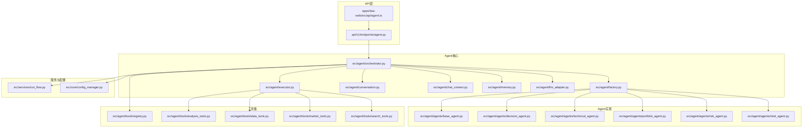
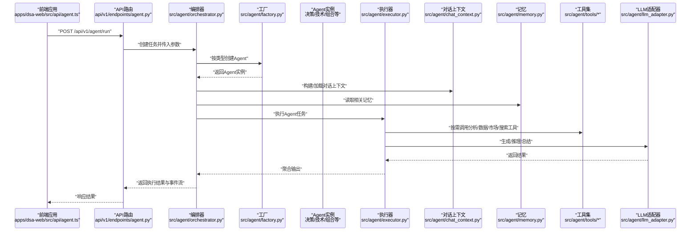
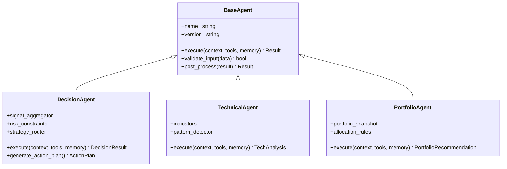
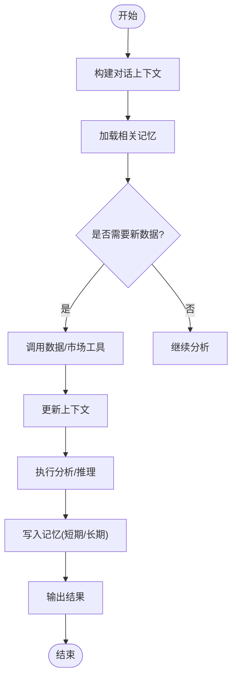
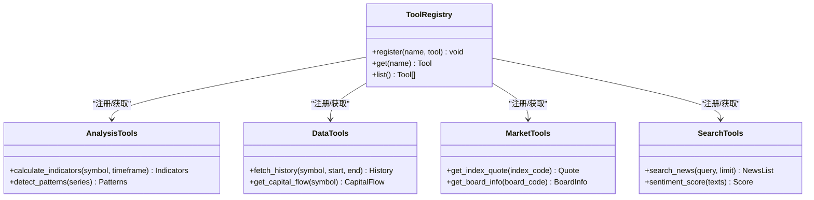
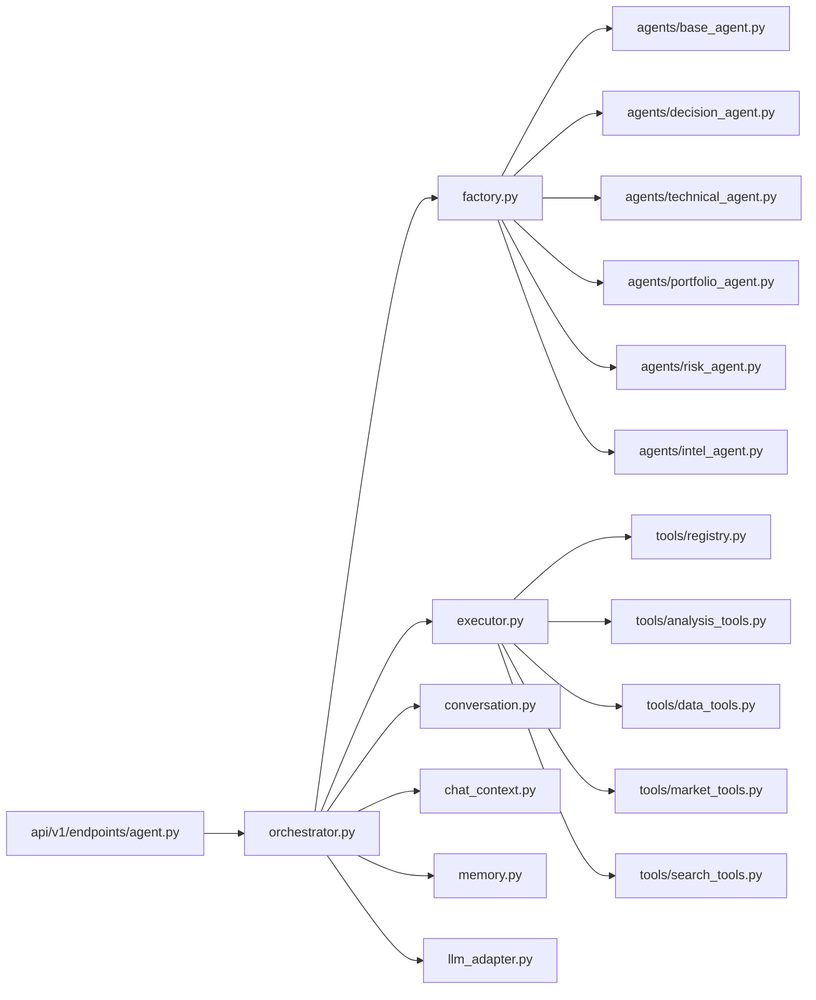

# 智能体使用示例

<cite>
**本文引用的文件**   
- [src/agent/orchestrator.py](file://src/agent/orchestrator.py)
- [src/agent/factory.py](file://src/agent/factory.py)
- [src/agent/executor.py](file://src/agent/executor.py)
- [src/agent/conversation.py](file://src/agent/conversation.py)
- [src/agent/chat_context.py](file://src/agent/chat_context.py)
- [src/agent/memory.py](file://src/agent/memory.py)
- [src/agent/llm_adapter.py](file://src/agent/llm_adapter.py)
- [src/agent/tools/registry.py](file://src/agent/tools/registry.py)
- [src/agent/tools/analysis_tools.py](file://src/agent/tools/analysis_tools.py)
- [src/agent/tools/data_tools.py](file://src/agent/tools/data_tools.py)
- [src/agent/tools/market_tools.py](file://src/agent/tools/market_tools.py)
- [src/agent/tools/search_tools.py](file://src/agent/tools/search_tools.py)
- [src/agent/agents/base_agent.py](file://src/agent/agents/base_agent.py)
- [src/agent/agents/decision_agent.py](file://src/agent/agents/decision_agent.py)
- [src/agent/agents/technical_agent.py](file://src/agent/agents/technical_agent.py)
- [src/agent/agents/portfolio_agent.py](file://src/agent/agents/portfolio_agent.py)
- [src/agent/agents/risk_agent.py](file://src/agent/agents/risk_agent.py)
- [src/agent/agents/intel_agent.py](file://src/agent/agents/intel_agent.py)
- [api/v1/endpoints/agent.py](file://api/v1/endpoints/agent.py)
- [apps/dsa-web/src/api/agent.ts](file://apps/dsa-web/src/api/agent.ts)
- [src/services/run_flow.py](file://src/services/run_flow.py)
- [src/core/config_manager.py](file://src/core/config_manager.py)
- [tests/test_multi_agent.py](file://tests/test_multi_agent.py)
- [tests/test_chat_context.py](file://tests/test_chat_context.py)
- [tests/test_agent_executor.py](file://tests/test_agent_executor.py)
</cite>

## 目录
1. [简介](#简介)
2. [项目结构](#项目结构)
3. [核心组件](#核心组件)
4. [架构总览](#架构总览)
5. [详细组件分析](#详细组件分析)
6. [依赖关系分析](#依赖关系分析)
7. [性能考虑](#性能考虑)
8. [故障排查指南](#故障排查指南)
9. [结论](#结论)
10. [附录：API与调用示例](#附录api与调用示例)

## 简介
本文件面向希望快速上手并深度使用“智能体系统”的开发者与分析师，提供从单Agent到多Agent协作的完整使用示例。内容覆盖决策智能体、技术分析师、投资组合经理等典型角色；展示技能扩展与自定义Agent开发；给出对话上下文管理、记忆系统与工具调用的最佳实践；并提供性能优化与故障恢复的配置示例。文档以仓库实际代码为依据，所有示例均可在现有API与前端调用中复现。

## 项目结构
智能体系统位于 src/agent 目录，围绕 Orchestrator（编排器）、Factory（工厂）、Executor（执行器）构建，配合 Conversation（会话）、ChatContext（对话上下文）、Memory（记忆）以及 Tools（工具集）形成完整的Agent运行环境。对外通过 API v1 暴露接口，前端通过 apps/dsa-web 调用。

**图表来源** 
- [api/v1/endpoints/agent.py](file://api/v1/endpoints/agent.py)
- [apps/dsa-web/src/api/agent.ts](file://apps/dsa-web/src/api/agent.ts)
- [src/agent/orchestrator.py](file://src/agent/orchestrator.py)
- [src/agent/factory.py](file://src/agent/factory.py)
- [src/agent/executor.py](file://src/agent/executor.py)
- [src/agent/conversation.py](file://src/agent/conversation.py)
- [src/agent/chat_context.py](file://src/agent/chat_context.py)
- [src/agent/memory.py](file://src/agent/memory.py)
- [src/agent/llm_adapter.py](file://src/agent/llm_adapter.py)
- [src/agent/tools/registry.py](file://src/agent/tools/registry.py)
- [src/agent/tools/analysis_tools.py](file://src/agent/tools/analysis_tools.py)
- [src/agent/tools/data_tools.py](file://src/agent/tools/data_tools.py)
- [src/agent/tools/market_tools.py](file://src/agent/tools/market_tools.py)
- [src/agent/tools/search_tools.py](file://src/agent/tools/search_tools.py)
- [src/services/run_flow.py](file://src/services/run_flow.py)
- [src/core/config_manager.py](file://src/core/config_manager.py)

**章节来源**
- [src/agent/orchestrator.py](file://src/agent/orchestrator.py)
- [src/agent/factory.py](file://src/agent/factory.py)
- [src/agent/executor.py](file://src/agent/executor.py)
- [api/v1/endpoints/agent.py](file://api/v1/endpoints/agent.py)
- [apps/dsa-web/src/api/agent.ts](file://apps/dsa-web/src/api/agent.ts)

## 核心组件
- 编排器 Orchestrator：负责调度多个Agent、管理任务流、协调上下文与记忆、触发工具调用与LLM适配。
- 工厂 Factory：根据类型或策略创建具体Agent实例（如决策智能体、技术分析智能体、投资组合经理等）。
- 执行器 Executor：封装单次Agent执行的输入准备、工具绑定、LLM调用、结果解析与错误处理。
- 会话 Conversation：维护一次交互的生命周期，包括消息历史、状态流转与事件回调。
- 对话上下文 ChatContext：结构化存储当前任务的上下文信息（标的范围、时间窗口、指标集合等），支持冻结与快照。
- 记忆 Memory：持久化短期/长期记忆，支持检索与摘要，避免重复计算与上下文膨胀。
- LLM适配器：统一不同LLM提供商的调用方式，包含参数映射、用量统计与重试策略。
- 工具集 Registry + 工具模块：注册与分析、数据、市场、搜索相关的工具，供Agent按需调用。

**章节来源**
- [src/agent/orchestrator.py](file://src/agent/orchestrator.py)
- [src/agent/factory.py](file://src/agent/factory.py)
- [src/agent/executor.py](file://src/agent/executor.py)
- [src/agent/conversation.py](file://src/agent/conversation.py)
- [src/agent/chat_context.py](file://src/agent/chat_context.py)
- [src/agent/memory.py](file://src/agent/memory.py)
- [src/agent/llm_adapter.py](file://src/agent/llm_adapter.py)
- [src/agent/tools/registry.py](file://src/agent/tools/registry.py)

## 架构总览
下图展示了从前端发起请求到多Agent协作执行的端到端流程，包括上下文构建、记忆存取、工具调用与LLM适配。

**图表来源** 
- [apps/dsa-web/src/api/agent.ts](file://apps/dsa-web/src/api/agent.ts)
- [api/v1/endpoints/agent.py](file://api/v1/endpoints/agent.py)
- [src/agent/orchestrator.py](file://src/agent/orchestrator.py)
- [src/agent/factory.py](file://src/agent/factory.py)
- [src/agent/executor.py](file://src/agent/executor.py)
- [src/agent/chat_context.py](file://src/agent/chat_context.py)
- [src/agent/memory.py](file://src/agent/memory.py)
- [src/agent/tools/registry.py](file://src/agent/tools/registry.py)
- [src/agent/llm_adapter.py](file://src/agent/llm_adapter.py)

## 详细组件分析

### 决策智能体（Decision Agent）
- 职责：基于市场与技术信号进行买卖决策，结合风险约束与组合目标输出可执行建议。
- 关键能力：信号聚合、规则引擎、策略路由、输出标准化。
- 典型调用：通过API提交标的与时间窗口，获取决策信号与建议动作。

**图表来源** 
- [src/agent/agents/base_agent.py](file://src/agent/agents/base_agent.py)
- [src/agent/agents/decision_agent.py](file://src/agent/agents/decision_agent.py)
- [src/agent/agents/technical_agent.py](file://src/agent/agents/technical_agent.py)
- [src/agent/agents/portfolio_agent.py](file://src/agent/agents/portfolio_agent.py)

**章节来源**
- [src/agent/agents/decision_agent.py](file://src/agent/agents/decision_agent.py)
- [src/agent/agents/base_agent.py](file://src/agent/agents/base_agent.py)

### 技术分析师（Technical Analyst）
- 职责：计算技术指标、识别形态、生成趋势判断与交易信号。
- 关键能力：指标库、模式检测、时间框架切换、信号置信度评估。
- 典型调用：传入K线数据或标的列表，返回技术分析与可视化建议。

**章节来源**
- [src/agent/agents/technical_agent.py](file://src/agent/agents/technical_agent.py)
- [src/agent/tools/analysis_tools.py](file://src/agent/tools/analysis_tools.py)

### 投资组合经理（Portfolio Manager）
- 职责：基于组合快照与风险偏好，生成资产配置与调仓建议。
- 关键能力：组合快照、分配规则、再平衡策略、回测对齐。
- 典型调用：提交组合持仓与目标权重，返回调仓计划与风险提示。

**章节来源**
- [src/agent/agents/portfolio_agent.py](file://src/agent/agents/portfolio_agent.py)
- [src/agent/tools/data_tools.py](file://src/agent/tools/data_tools.py)

### 风险智能体（Risk Agent）
- 职责：评估市场与组合风险，提供风控阈值与预警。
- 关键能力：风险指标、压力测试、相关性分析、限额控制。

**章节来源**
- [src/agent/agents/risk_agent.py](file://src/agent/agents/risk_agent.py)

### 情报智能体（Intel Agent）
- 职责：采集新闻、舆情与宏观数据，辅助基本面与情绪面分析。
- 关键能力：搜索工具、情感分析、事件抽取、摘要生成。

**章节来源**
- [src/agent/agents/intel_agent.py](file://src/agent/agents/intel_agent.py)
- [src/agent/tools/search_tools.py](file://src/agent/tools/search_tools.py)

### 对话上下文与记忆系统
- 对话上下文 ChatContext：结构化保存任务参数、标的范围、时间窗口、指标集合，支持冻结与快照，便于回放与调试。
- 记忆 Memory：短期记忆用于会话内缓存，长期记忆用于跨会话复用，支持检索与压缩，减少LLM上下文成本。

**图表来源** 
- [src/agent/chat_context.py](file://src/agent/chat_context.py)
- [src/agent/memory.py](file://src/agent/memory.py)
- [src/agent/tools/data_tools.py](file://src/agent/tools/data_tools.py)
- [src/agent/tools/market_tools.py](file://src/agent/tools/market_tools.py)

**章节来源**
- [src/agent/chat_context.py](file://src/agent/chat_context.py)
- [src/agent/memory.py](file://src/agent/memory.py)

### 工具调用与注册机制
- 工具注册 Registry：集中管理可用工具，提供按名称查找与权限控制。
- 工具分类：分析工具（指标与形态）、数据工具（行情与基本面）、市场工具（指数与板块）、搜索工具（新闻与舆情）。
- 最佳实践：按需启用、限制并发、缓存热点数据、记录调用轨迹。

**图表来源** 
- [src/agent/tools/registry.py](file://src/agent/tools/registry.py)
- [src/agent/tools/analysis_tools.py](file://src/agent/tools/analysis_tools.py)
- [src/agent/tools/data_tools.py](file://src/agent/tools/data_tools.py)
- [src/agent/tools/market_tools.py](file://src/agent/tools/market_tools.py)
- [src/agent/tools/search_tools.py](file://src/agent/tools/search_tools.py)

**章节来源**
- [src/agent/tools/registry.py](file://src/agent/tools/registry.py)
- [src/agent/tools/analysis_tools.py](file://src/agent/tools/analysis_tools.py)
- [src/agent/tools/data_tools.py](file://src/agent/tools/data_tools.py)
- [src/agent/tools/market_tools.py](file://src/agent/tools/market_tools.py)
- [src/agent/tools/search_tools.py](file://src/agent/tools/search_tools.py)

### LLM适配与参数管理
- 统一接口：屏蔽不同提供商差异，提供一致的调用与参数映射。
- 用量统计：记录Token消耗与延迟，便于成本与性能分析。
- 重试与降级：失败自动重试，必要时切换到备用模型或简化提示。

**章节来源**
- [src/agent/llm_adapter.py](file://src/agent/llm_adapter.py)
- [src/core/config_manager.py](file://src/core/config_manager.py)

## 依赖关系分析
- Orchestrator 依赖 Factory、Executor、Conversation、ChatContext、Memory、LLMAdapter 与工具集。
- Factory 依赖各Agent实现类，按类型或策略创建实例。
- Executor 依赖工具集与LLM适配器，负责执行与结果聚合。
- API层与前端通过HTTP/SSE与后端交互，调用编排器完成多Agent协作。

**图表来源** 
- [api/v1/endpoints/agent.py](file://api/v1/endpoints/agent.py)
- [src/agent/orchestrator.py](file://src/agent/orchestrator.py)
- [src/agent/factory.py](file://src/agent/factory.py)
- [src/agent/executor.py](file://src/agent/executor.py)
- [src/agent/conversation.py](file://src/agent/conversation.py)
- [src/agent/chat_context.py](file://src/agent/chat_context.py)
- [src/agent/memory.py](file://src/agent/memory.py)
- [src/agent/llm_adapter.py](file://src/agent/llm_adapter.py)
- [src/agent/tools/registry.py](file://src/agent/tools/registry.py)
- [src/agent/tools/analysis_tools.py](file://src/agent/tools/analysis_tools.py)
- [src/agent/tools/data_tools.py](file://src/agent/tools/data_tools.py)
- [src/agent/tools/market_tools.py](file://src/agent/tools/market_tools.py)
- [src/agent/tools/search_tools.py](file://src/agent/tools/search_tools.py)
- [src/agent/agents/base_agent.py](file://src/agent/agents/base_agent.py)
- [src/agent/agents/decision_agent.py](file://src/agent/agents/decision_agent.py)
- [src/agent/agents/technical_agent.py](file://src/agent/agents/technical_agent.py)
- [src/agent/agents/portfolio_agent.py](file://src/agent/agents/portfolio_agent.py)
- [src/agent/agents/risk_agent.py](file://src/agent/agents/risk_agent.py)
- [src/agent/agents/intel_agent.py](file://src/agent/agents/intel_agent.py)

**章节来源**
- [src/agent/orchestrator.py](file://src/agent/orchestrator.py)
- [src/agent/factory.py](file://src/agent/factory.py)
- [src/agent/executor.py](file://src/agent/executor.py)
- [api/v1/endpoints/agent.py](file://api/v1/endpoints/agent.py)

## 性能考虑
- 上下文裁剪：优先使用记忆摘要与快照，避免过长上下文导致LLM延迟与成本上升。
- 工具缓存：对热点数据（如指数报价、板块信息）进行缓存，减少重复请求。
- 并发控制：限制工具调用并发数，避免外部数据源限流。
- 模型选择：根据任务复杂度动态选择轻量或重型模型，必要时降级提示长度。
- SSE流式输出：前端采用SSE接收增量结果，提升用户体验与可观测性。

[本节为通用指导，不直接分析具体文件]

## 故障排查指南
- 常见问题
  - LLM调用失败：检查网络、密钥与配额；查看重试与降级策略是否生效。
  - 工具调用超时：确认数据源可用性，增加超时与重试配置；检查并发限制。
  - 上下文丢失：确保对话上下文正确冻结与传递；验证记忆读写路径。
  - 多Agent协作异常：检查编排器任务流与事件回调；核对Agent间数据契约。
- 定位方法
  - 查看API日志与SSE事件流，定位失败阶段。
  - 使用测试用例与诊断脚本复现场景。
  - 通过配置管理器调整参数，逐步缩小问题范围。

**章节来源**
- [src/agent/llm_adapter.py](file://src/agent/llm_adapter.py)
- [src/core/config_manager.py](file://src/core/config_manager.py)
- [tests/test_agent_executor.py](file://tests/test_agent_executor.py)
- [tests/test_chat_context.py](file://tests/test_chat_context.py)

## 结论
本系统通过清晰的模块化设计与完善的工具生态，实现了从单Agent到多Agent协作的灵活扩展。借助对话上下文与记忆系统，能够有效降低LLM成本并提升稳定性。通过API与前端集成，用户可便捷地调用决策智能体、技术分析师与投资组合经理等角色，满足多样化分析需求。建议在实战中结合业务场景定制Agent与工具，并持续优化上下文管理与工具缓存策略。

[本节为总结性内容，不直接分析具体文件]

## 附录：API与调用示例

### 单Agent调用示例（决策智能体）
- 步骤
  - 前端通过 api/agent.ts 发起POST请求至 /api/v1/agent/run。
  - 指定 agent_type=decision，传入标的、时间窗口与风险约束。
  - 后端编排器创建决策智能体，执行分析并返回决策信号与建议动作。
- 参考文件
  - [apps/dsa-web/src/api/agent.ts](file://apps/dsa-web/src/api/agent.ts)
  - [api/v1/endpoints/agent.py](file://api/v1/endpoints/agent.py)
  - [src/agent/agents/decision_agent.py](file://src/agent/agents/decision_agent.py)

**章节来源**
- [apps/dsa-web/src/api/agent.ts](file://apps/dsa-web/src/api/agent.ts)
- [api/v1/endpoints/agent.py](file://api/v1/endpoints/agent.py)
- [src/agent/agents/decision_agent.py](file://src/agent/agents/decision_agent.py)

### 多Agent协作示例（技术+组合+风险）
- 步骤
  - 前端发起多Agent任务，指定技术分析师生成信号，投资组合经理生成调仓建议，风险智能体评估风险。
  - 编排器依次调度各Agent，聚合结果并输出综合报告。
- 参考文件
  - [src/agent/orchestrator.py](file://src/agent/orchestrator.py)
  - [src/agent/factory.py](file://src/agent/factory.py)
  - [src/agent/agents/technical_agent.py](file://src/agent/agents/technical_agent.py)
  - [src/agent/agents/portfolio_agent.py](file://src/agent/agents/portfolio_agent.py)
  - [src/agent/agents/risk_agent.py](file://src/agent/agents/risk_agent.py)

**章节来源**
- [src/agent/orchestrator.py](file://src/agent/orchestrator.py)
- [src/agent/factory.py](file://src/agent/factory.py)
- [src/agent/agents/technical_agent.py](file://src/agent/agents/technical_agent.py)
- [src/agent/agents/portfolio_agent.py](file://src/agent/agents/portfolio_agent.py)
- [src/agent/agents/risk_agent.py](file://src/agent/agents/risk_agent.py)

### 自定义Agent开发示例
- 步骤
  - 继承 BaseAgent，实现 execute、validate_input、post_process。
  - 在 Factory 中注册新Agent类型，并在API中暴露调用入口。
  - 可选：新增工具并在 Registry 中注册，供自定义Agent使用。
- 参考文件
  - [src/agent/agents/base_agent.py](file://src/agent/agents/base_agent.py)
  - [src/agent/factory.py](file://src/agent/factory.py)
  - [src/agent/tools/registry.py](file://src/agent/tools/registry.py)

**章节来源**
- [src/agent/agents/base_agent.py](file://src/agent/agents/base_agent.py)
- [src/agent/factory.py](file://src/agent/factory.py)
- [src/agent/tools/registry.py](file://src/agent/tools/registry.py)

### 对话上下文与记忆最佳实践
- 上下文管理
  - 使用 ChatContext 冻结关键参数，避免后续修改影响分析一致性。
  - 通过快照功能回溯分析过程，便于调试与审计。
- 记忆系统
  - 短期记忆用于会话内缓存，长期记忆用于跨会话复用。
  - 定期压缩与清理记忆，控制存储与检索成本。
- 参考文件
  - [src/agent/chat_context.py](file://src/agent/chat_context.py)
  - [src/agent/memory.py](file://src/agent/memory.py)

**章节来源**
- [src/agent/chat_context.py](file://src/agent/chat_context.py)
- [src/agent/memory.py](file://src/agent/memory.py)

### 工具调用最佳实践
- 按需启用：仅注册与使用必要工具，减少开销。
- 缓存热点：对高频数据（指数、板块）设置缓存与过期策略。
- 限流与重试：合理设置并发与重试次数，避免外部服务限流。
- 参考文件
  - [src/agent/tools/registry.py](file://src/agent/tools/registry.py)
  - [src/agent/tools/data_tools.py](file://src/agent/tools/data_tools.py)
  - [src/agent/tools/market_tools.py](file://src/agent/tools/market_tools.py)
  - [src/agent/tools/search_tools.py](file://src/agent/tools/search_tools.py)

**章节来源**
- [src/agent/tools/registry.py](file://src/agent/tools/registry.py)
- [src/agent/tools/data_tools.py](file://src/agent/tools/data_tools.py)
- [src/agent/tools/market_tools.py](file://src/agent/tools/market_tools.py)
- [src/agent/tools/search_tools.py](file://src/agent/tools/search_tools.py)

### 性能优化与故障恢复配置示例
- 性能优化
  - 调整LLM参数（温度、最大令牌数）与模型选择。
  - 启用SSE流式输出，提升前端体验。
  - 使用 Run Flow 服务监控任务执行与资源占用。
- 故障恢复
  - 配置重试与降级策略，失败时切换备用模型或简化提示。
  - 通过配置管理器动态调整超时、并发与缓存策略。
- 参考文件
  - [src/agent/llm_adapter.py](file://src/agent/llm_adapter.py)
  - [src/core/config_manager.py](file://src/core/config_manager.py)
  - [src/services/run_flow.py](file://src/services/run_flow.py)

**章节来源**
- [src/agent/llm_adapter.py](file://src/agent/llm_adapter.py)
- [src/core/config_manager.py](file://src/core/config_manager.py)
- [src/services/run_flow.py](file://src/services/run_flow.py)

### 多Agent协作测试与验证
- 使用测试用例验证多Agent协作流程与边界条件。
- 关注上下文传递、记忆读写与工具调用成功率。
- 参考文件
  - [tests/test_multi_agent.py](file://tests/test_multi_agent.py)

**章节来源**
- [tests/test_multi_agent.py](file://tests/test_multi_agent.py)