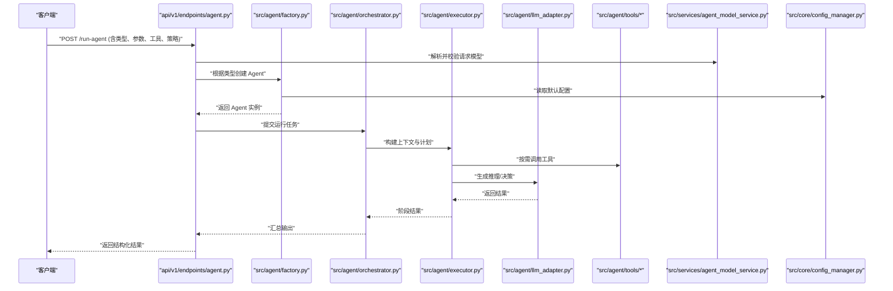
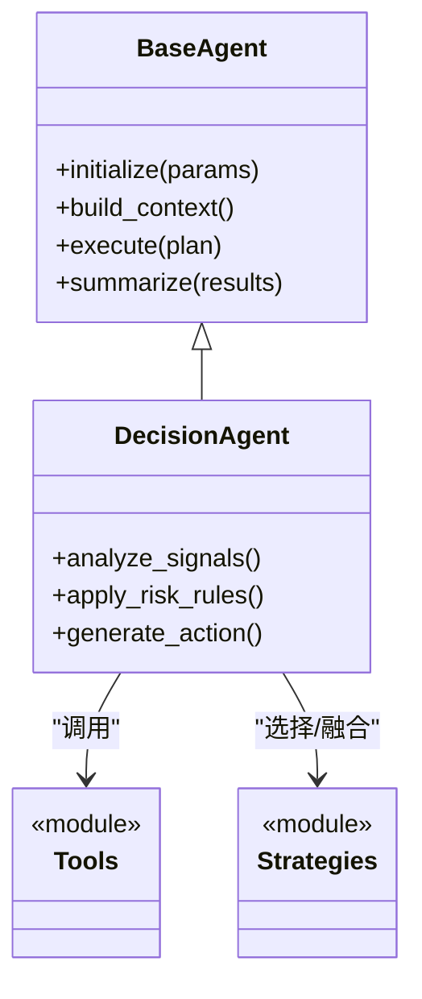
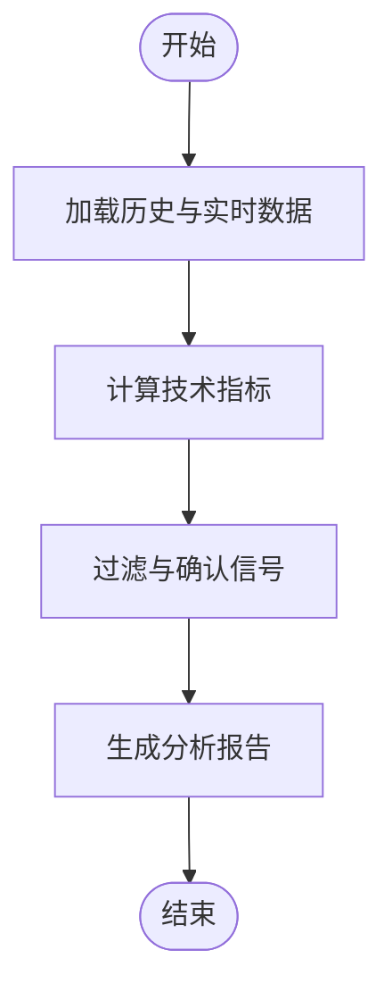
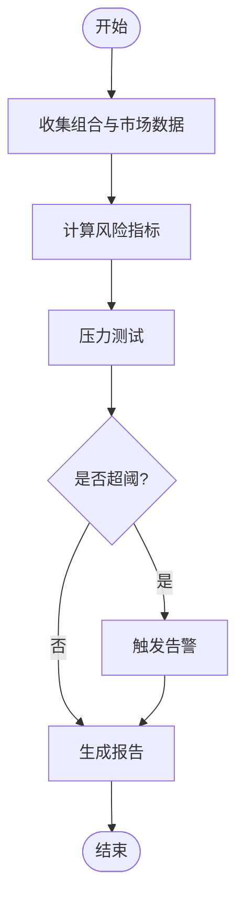
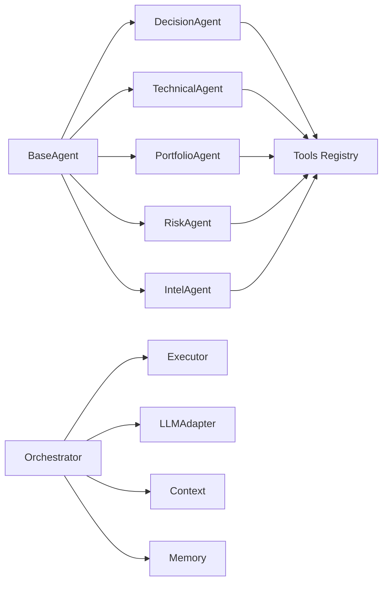
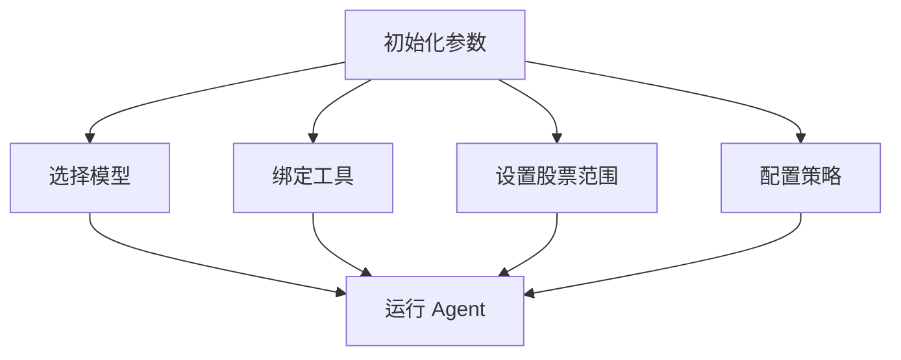
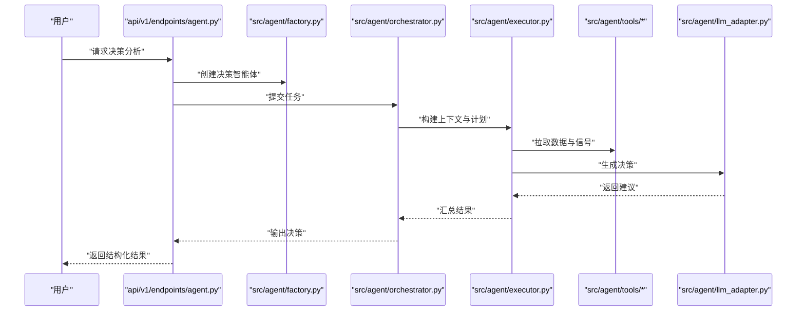
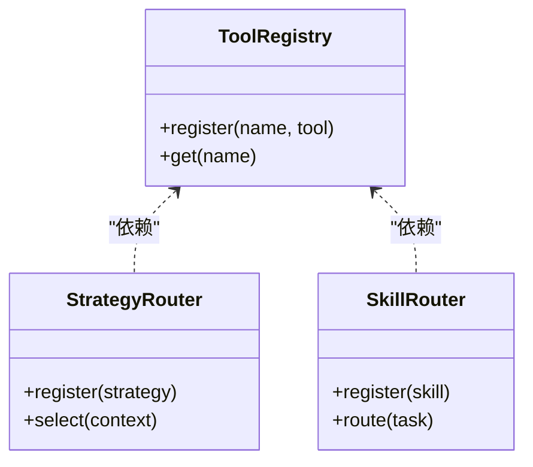

# 智能体类型与配置

<cite>
**本文档引用的文件**   
- [src/agent/factory.py](file://src/agent/factory.py)
- [src/agent/orchestrator.py](file://src/agent/orchestrator.py)
- [src/agent/executor.py](file://src/agent/executor.py)
- [src/agent/llm_adapter.py](file://src/agent/llm_adapter.py)
- [src/agent/chat_context.py](file://src/agent/chat_context.py)
- [src/agent/memory.py](file://src/agent/memory.py)
- [src/agent/stock_scope.py](file://src/agent/stock_scope.py)
- [src/agent/tools/registry.py](file://src/agent/tools/registry.py)
- [src/agent/tools/analysis_tools.py](file://src/agent/tools/analysis_tools.py)
- [src/agent/tools/data_tools.py](file://src/agent/tools/data_tools.py)
- [src/agent/tools/market_tools.py](file://src/agent/tools/market_tools.py)
- [src/agent/tools/backtest_tools.py](file://src/agent/tools/backtest_tools.py)
- [src/agent/tools/search_tools.py](file://src/agent/tools/search_tools.py)
- [src/agent/agents/base_agent.py](file://src/agent/agents/base_agent.py)
- [src/agent/agents/decision_agent.py](file://src/agent/agents/decision_agent.py)
- [src/agent/agents/intel_agent.py](file://src/agent/agents/intel_agent.py)
- [src/agent/agents/portfolio_agent.py](file://src/agent/agents/portfolio_agent.py)
- [src/agent/agents/risk_agent.py](file://src/agent/agents/risk_agent.py)
- [src/agent/agents/technical_agent.py](file://src/agent/agents/technical_agent.py)
- [src/agent/skills/router.py](file://src/agent/skills/router.py)
- [src/agent/skills/aggregator.py](file://src/agent/skills/aggregator.py)
- [src/agent/skills/skill_agent.py](file://src/agent/skills/skill_agent.py)
- [src/agent/strategies/router.py](file://src/agent/strategies/router.py)
- [src/agent/strategies/aggregator.py](file://src/agent/strategies/aggregator.py)
- [src/agent/strategies/strategy_agent.py](file://src/agent/strategies/strategy_agent.py)
- [api/v1/endpoints/agent.py](file://api/v1/endpoints/agent.py)
- [api/v1/schemas/run_flow.py](file://api/v1/schemas/run_flow.py)
- [api/v1/schemas/common.py](file://api/v1/schemas/common.py)
- [src/services/agent_model_service.py](file://src/services/agent_model_service.py)
- [src/core/config_manager.py](file://src/core/config_manager.py)
- [src/config.py](file://src/config.py)
</cite>

## 目录
1. [简介](#简介)
2. [项目结构](#项目结构)
3. [核心组件](#核心组件)
4. [架构总览](#架构总览)
5. [详细组件分析](#详细组件分析)
6. [依赖关系分析](#依赖关系分析)
7. [性能考量](#性能考量)
8. [故障排查指南](#故障排查指南)
9. [结论](#结论)
10. [附录：Agent 配置与使用示例](#附录agent-配置与使用示例)

## 简介
本文件面向希望快速上手并深度定制“智能体（Agent）”的用户，系统性地介绍决策智能体、技术分析师、投资组合经理、风险分析师等不同类型的 Agent 的配置方法、初始化参数、工具绑定与策略配置，并提供从基础到高级的调用示例。文档基于代码仓库中的 Agent 框架、工具注册表、LLM 适配层、运行编排器与服务端 API 进行梳理，确保内容与实际实现一致。

## 项目结构
本项目采用分层模块化设计，Agent 相关能力集中在 src/agent 目录下，API 暴露于 api/v1，服务与配置位于 src/services 与 src/core。关键目录说明如下：
- src/agent/agents：具体 Agent 类型实现（决策、技术、组合、风险等）
- src/agent/tools：工具集（数据分析、市场数据、回测、搜索等）
- src/agent/skills：技能路由与聚合，支持按场景装配能力
- src/agent/strategies：策略路由与聚合，支持策略编排
- src/agent：通用基础设施（上下文、记忆、执行器、LLM 适配、编排器等）
- api/v1/endpoints/agent.py：Agent 运行与配置的 HTTP 接口
- api/v1/schemas：请求/响应模型定义
- src/services/agent_model_service.py：模型管理与选择服务
- src/core/config_manager.py：配置管理
- src/config.py：全局配置入口

```mermaid
graph TB
subgraph "API 层"
A["api/v1/endpoints/agent.py"]
S["api/v1/schemas/*.py"]
end
subgraph "Agent 核心"
F["src/agent/factory.py"]
O["src/agent/orchestrator.py"]
E["src/agent/executor.py"]
L["src/agent/llm_adapter.py"]
Ctx["src/agent/chat_context.py"]
Mem["src/agent/memory.py"]
Scope["src/agent/stock_scope.py"]
end
subgraph "Agent 类型"
Base["src/agent/agents/base_agent.py"]
Dec["src/agent/agents/decision_agent.py"]
Tech["src/agent/agents/technical_agent.py"]
Port["src/agent/agents/portfolio_agent.py"]
Risk["src/agent/agents/risk_agent.py"]
Intel["src/agent/agents/intel_agent.py"]
end
subgraph "工具与技能"
Tools["src/agent/tools/*"]
Skills["src/agent/skills/*"]
Strat["src/agent/strategies/*"]
end
subgraph "服务与配置"
AMS["src/services/agent_model_service.py"]
CM["src/core/config_manager.py"]
CFG["src/config.py"]
end
A --> F
A --> O
F --> Base
Base --> Dec
Base --> Tech
Base --> Port
Base --> Risk
Base --> Intel
O --> E
O --> L
O --> Ctx
O --> Mem
O --> Scope
O --> Tools
O --> Skills
O --> Strat
O --> AMS
O --> CM
O --> CFG
```



**图表来源** 
- [api/v1/endpoints/agent.py](file://api/v1/endpoints/agent.py)
- [src/agent/factory.py](file://src/agent/factory.py)
- [src/agent/orchestrator.py](file://src/agent/orchestrator.py)
- [src/agent/executor.py](file://src/agent/executor.py)
- [src/agent/llm_adapter.py](file://src/agent/llm_adapter.py)
- [src/agent/chat_context.py](file://src/agent/chat_context.py)
- [src/agent/memory.py](file://src/agent/memory.py)
- [src/agent/stock_scope.py](file://src/agent/stock_scope.py)
- [src/agent/agents/base_agent.py](file://src/agent/agents/base_agent.py)
- [src/agent/agents/decision_agent.py](file://src/agent/agents/decision_agent.py)
- [src/agent/agents/technical_agent.py](file://src/agent/agents/technical_agent.py)
- [src/agent/agents/portfolio_agent.py](file://src/agent/agents/portfolio_agent.py)
- [src/agent/agents/risk_agent.py](file://src/agent/agents/risk_agent.py)
- [src/agent/agents/intel_agent.py](file://src/agent/agents/intel_agent.py)
- [src/agent/tools/registry.py](file://src/agent/tools/registry.py)
- [src/agent/skills/router.py](file://src/agent/skills/router.py)
- [src/agent/strategies/router.py](file://src/agent/strategies/router.py)
- [src/services/agent_model_service.py](file://src/services/agent_model_service.py)
- [src/core/config_manager.py](file://src/core/config_manager.py)
- [src/config.py](file://src/config.py)

**章节来源**
- [api/v1/endpoints/agent.py](file://api/v1/endpoints/agent.py)
- [src/agent/factory.py](file://src/agent/factory.py)
- [src/agent/orchestrator.py](file://src/agent/orchestrator.py)
- [src/agent/executor.py](file://src/agent/executor.py)
- [src/agent/llm_adapter.py](file://src/agent/llm_adapter.py)
- [src/agent/chat_context.py](file://src/agent/chat_context.py)
- [src/agent/memory.py](file://src/agent/memory.py)
- [src/agent/stock_scope.py](file://src/agent/stock_scope.py)
- [src/agent/tools/registry.py](file://src/agent/tools/registry.py)
- [src/agent/skills/router.py](file://src/agent/skills/router.py)
- [src/agent/strategies/router.py](file://src/agent/strategies/router.py)
- [src/services/agent_model_service.py](file://src/services/agent_model_service.py)
- [src/core/config_manager.py](file://src/core/config_manager.py)
- [src/config.py](file://src/config.py)

## 核心组件
- 工厂与编排器
  - 工厂负责根据类型创建具体 Agent 实例，注入工具、技能、策略与 LLM 适配器。
  - 编排器协调上下文构建、记忆存取、执行调度与结果汇总。
- 执行器与 LLM 适配
  - 执行器负责将任务分解为步骤，调用工具与 LLM 生成中间结果。
  - LLM 适配器统一不同模型的调用方式与参数映射。
- 上下文与记忆
  - 聊天上下文维护对话历史、状态与约束；记忆模块提供短期/长期存储。
- 股票范围与工具注册
  - 股票范围限定分析标的；工具注册表集中管理可用工具及其元数据。
- 技能与策略路由
  - 技能路由按场景装配能力；策略路由按规则选择策略组合。

**章节来源**
- [src/agent/factory.py](file://src/agent/factory.py)
- [src/agent/orchestrator.py](file://src/agent/orchestrator.py)
- [src/agent/executor.py](file://src/agent/executor.py)
- [src/agent/llm_adapter.py](file://src/agent/llm_adapter.py)
- [src/agent/chat_context.py](file://src/agent/chat_context.py)
- [src/agent/memory.py](file://src/agent/memory.py)
- [src/agent/stock_scope.py](file://src/agent/stock_scope.py)
- [src/agent/tools/registry.py](file://src/agent/tools/registry.py)
- [src/agent/skills/router.py](file://src/agent/skills/router.py)
- [src/agent/strategies/router.py](file://src/agent/strategies/router.py)

## 架构总览
下图展示了从 API 到 Agent 执行的端到端流程，包括模型选择、上下文构建、工具调用与结果返回。



**图表来源** 
- [api/v1/endpoints/agent.py](file://api/v1/endpoints/agent.py)
- [src/agent/factory.py](file://src/agent/factory.py)
- [src/agent/orchestrator.py](file://src/agent/orchestrator.py)
- [src/agent/executor.py](file://src/agent/executor.py)
- [src/agent/llm_adapter.py](file://src/agent/llm_adapter.py)
- [src/agent/tools/registry.py](file://src/agent/tools/registry.py)
- [src/services/agent_model_service.py](file://src/services/agent_model_service.py)
- [src/core/config_manager.py](file://src/core/config_manager.py)

## 详细组件分析

### 决策智能体（Decision Agent）
- 职责：综合多源信息（行情、基本面、新闻、策略信号）生成交易决策或行动建议。
- 典型参数：
  - 模型选择（provider/model）、温度与最大生成长度
  - 上下文窗口与记忆策略
  - 工具集合（数据分析、市场数据、搜索）
  - 策略路由（趋势、均值回归、事件驱动等）
- 工具绑定：优先绑定技术分析工具与新闻搜索工具，必要时接入回测工具验证。
- 策略配置：可设置多策略投票或加权融合，支持阈值与风控规则。



**图表来源** 
- [src/agent/agents/base_agent.py](file://src/agent/agents/base_agent.py)
- [src/agent/agents/decision_agent.py](file://src/agent/agents/decision_agent.py)
- [src/agent/tools/registry.py](file://src/agent/tools/registry.py)
- [src/agent/strategies/router.py](file://src/agent/strategies/router.py)

**章节来源**
- [src/agent/agents/base_agent.py](file://src/agent/agents/base_agent.py)
- [src/agent/agents/decision_agent.py](file://src/agent/agents/decision_agent.py)
- [src/agent/tools/registry.py](file://src/agent/tools/registry.py)
- [src/agent/strategies/router.py](file://src/agent/strategies/router.py)

### 技术分析师（Technical Analyst）
- 职责：基于技术指标与量价数据进行形态识别、趋势判断与信号生成。
- 典型参数：
  - 指标库与周期（MA、RSI、MACD、布林带等）
  - 数据源与频率（日线、分钟线）
  - 过滤条件（成交量、波动率、涨跌停）
- 工具绑定：技术分析工具、历史数据工具、实时行情工具。
- 策略配置：单指标触发、多指标共振、形态确认。



**图表来源** 
- [src/agent/agents/technical_agent.py](file://src/agent/agents/technical_agent.py)
- [src/agent/tools/data_tools.py](file://src/agent/tools/data_tools.py)
- [src/agent/tools/market_tools.py](file://src/agent/tools/market_tools.py)

**章节来源**
- [src/agent/agents/technical_agent.py](file://src/agent/agents/technical_agent.py)
- [src/agent/tools/data_tools.py](file://src/agent/tools/data_tools.py)
- [src/agent/tools/market_tools.py](file://src/agent/tools/market_tools.py)

### 投资组合经理（Portfolio Manager）
- 职责：资产配置、权重优化、再平衡与绩效归因。
- 典型参数：
  - 资产池与约束（行业、地域、流动性）
  - 目标收益与风险预算
  - 再平衡频率与阈值
- 工具绑定：组合快照、历史回测、风险指标、新闻情绪。
- 策略配置：均值方差、风险平价、黑-Litterman、因子模型等。

```mermaid
sequenceDiagram
participant PM as "投资组合经理"
participant Data as "数据工具"
participant Risk as "风险工具"
participant Opt as "优化引擎"
PM->>Data : "获取持仓与市场数据"
PM->>Risk : "计算风险暴露与相关性"
PM->>Opt : "求解最优权重"
Opt-->>PM : "新权重与预期收益"
PM-->>PM : "生成再平衡指令"
```

**图表来源** 
- [src/agent/agents/portfolio_agent.py](file://src/agent/agents/portfolio_agent.py)
- [src/agent/tools/data_tools.py](file://src/agent/tools/data_tools.py)
- [src/agent/tools/backtest_tools.py](file://src/agent/tools/backtest_tools.py)

**章节来源**
- [src/agent/agents/portfolio_agent.py](file://src/agent/agents/portfolio_agent.py)
- [src/agent/tools/data_tools.py](file://src/agent/tools/data_tools.py)
- [src/agent/tools/backtest_tools.py](file://src/agent/tools/backtest_tools.py)

### 风险分析师（Risk Analyst）
- 职责：VaR、压力测试、尾部风险、流动性与相关性风险监测。
- 典型参数：
  - 风险度量方法与置信水平
  - 压力情景与冲击假设
  - 监控阈值与告警规则
- 工具绑定：回测工具、市场数据、组合快照、新闻情绪。
- 策略配置：动态阈值、滚动窗口、跨资产联动。



**图表来源** 
- [src/agent/agents/risk_agent.py](file://src/agent/agents/risk_agent.py)
- [src/agent/tools/backtest_tools.py](file://src/agent/tools/backtest_tools.py)
- [src/agent/tools/market_tools.py](file://src/agent/tools/market_tools.py)

**章节来源**
- [src/agent/agents/risk_agent.py](file://src/agent/agents/risk_agent.py)
- [src/agent/tools/backtest_tools.py](file://src/agent/tools/backtest_tools.py)
- [src/agent/tools/market_tools.py](file://src/agent/tools/market_tools.py)

### 情报智能体（Intel Agent）
- 职责：新闻抓取、舆情分析、事件抽取与影响评估。
- 典型参数：
  - 数据源（新闻、社交、公告）
  - 语言与关键词过滤
  - 情感分析与实体识别
- 工具绑定：搜索工具、文本处理、时间序列关联。
- 策略配置：事件优先级、传播路径、影响量化。

**章节来源**
- [src/agent/agents/intel_agent.py](file://src/agent/agents/intel_agent.py)
- [src/agent/tools/search_tools.py](file://src/agent/tools/search_tools.py)

## 依赖关系分析
- 组件耦合
  - Agent 类型均继承自基类，通过工厂注入工具与策略，降低直接耦合。
  - 编排器依赖执行器、LLM 适配器、上下文与记忆，形成稳定的运行时骨架。
- 外部依赖
  - LLM 提供方通过适配器抽象，便于替换与扩展。
  - 工具与技能通过注册表与路由器解耦，支持热插拔。
- 潜在循环依赖
  - 工具与策略之间无直接循环；通过编排器与执行器间接交互。



**图表来源** 
- [src/agent/agents/base_agent.py](file://src/agent/agents/base_agent.py)
- [src/agent/agents/decision_agent.py](file://src/agent/agents/decision_agent.py)
- [src/agent/agents/technical_agent.py](file://src/agent/agents/technical_agent.py)
- [src/agent/agents/portfolio_agent.py](file://src/agent/agents/portfolio_agent.py)
- [src/agent/agents/risk_agent.py](file://src/agent/agents/risk_agent.py)
- [src/agent/agents/intel_agent.py](file://src/agent/agents/intel_agent.py)
- [src/agent/tools/registry.py](file://src/agent/tools/registry.py)
- [src/agent/orchestrator.py](file://src/agent/orchestrator.py)
- [src/agent/executor.py](file://src/agent/executor.py)
- [src/agent/llm_adapter.py](file://src/agent/llm_adapter.py)
- [src/agent/chat_context.py](file://src/agent/chat_context.py)
- [src/agent/memory.py](file://src/agent/memory.py)

**章节来源**
- [src/agent/agents/base_agent.py](file://src/agent/agents/base_agent.py)
- [src/agent/orchestrator.py](file://src/agent/orchestrator.py)
- [src/agent/tools/registry.py](file://src/agent/tools/registry.py)

## 性能考量
- 并发与批处理
  - 工具调用与 LLM 请求应支持异步与重试，避免阻塞主线程。
- 缓存与预取
  - 历史数据与技术指标可缓存，减少重复计算。
- 上下文裁剪
  - 控制上下文长度与记忆大小，防止超出模型限制。
- 资源隔离
  - 不同 Agent 类型可独立进程或线程池，避免相互干扰。

[本节为通用指导，不直接分析具体文件]

## 故障排查指南
- 常见问题
  - 模型不可用：检查 LLM 适配器配置与网络连通性。
  - 工具未注册：确认工具在注册表中正确声明且权限允许。
  - 上下文溢出：调整上下文窗口与记忆策略。
  - 策略冲突：检查策略路由规则与阈值设置。
- 定位方法
  - 启用详细日志与追踪，查看执行器步骤与 LLM 调用轨迹。
  - 使用最小化参数复现问题，逐步排除。

**章节来源**
- [src/agent/executor.py](file://src/agent/executor.py)
- [src/agent/llm_adapter.py](file://src/agent/llm_adapter.py)
- [src/agent/tools/registry.py](file://src/agent/tools/registry.py)
- [src/agent/chat_context.py](file://src/agent/chat_context.py)

## 结论
本项目的 Agent 框架以清晰的层次与解耦设计，支持多种智能体类型的灵活配置与扩展。通过工厂与编排器统一管理生命周期，结合工具与技能路由，用户可按需装配能力与策略。遵循本文的配置与使用示例，可快速搭建从基础到高级的智能体工作流。

[本节为总结，不直接分析具体文件]

## 附录：Agent 配置与使用示例

### 基础配置（所有 Agent 通用）
- 初始化参数
  - 模型：provider、model、temperature、max_tokens
  - 上下文：context_window、memory_strategy
  - 股票范围：codes、universe、filters
- 工具绑定
  - 通过工具注册表选择所需工具集（数据分析、市场数据、搜索、回测）
- 策略配置
  - 通过策略路由选择单一或多策略，设置权重与阈值



**图表来源** 
- [src/agent/factory.py](file://src/agent/factory.py)
- [src/agent/orchestrator.py](file://src/agent/orchestrator.py)
- [src/agent/stock_scope.py](file://src/agent/stock_scope.py)
- [src/agent/tools/registry.py](file://src/agent/tools/registry.py)
- [src/agent/strategies/router.py](file://src/agent/strategies/router.py)

**章节来源**
- [src/agent/factory.py](file://src/agent/factory.py)
- [src/agent/orchestrator.py](file://src/agent/orchestrator.py)
- [src/agent/stock_scope.py](file://src/agent/stock_scope.py)
- [src/agent/tools/registry.py](file://src/agent/tools/registry.py)
- [src/agent/strategies/router.py](file://src/agent/strategies/router.py)

### 决策智能体示例
- 初始化
  - 选择模型与上下文窗口
  - 绑定数据分析、市场数据与搜索工具
  - 配置策略路由（趋势+事件驱动）
- 调用
  - 传入股票代码与时间范围
  - 指定决策目标（买入/卖出/持有）
  - 设置风控阈值与输出格式



**图表来源** 
- [api/v1/endpoints/agent.py](file://api/v1/endpoints/agent.py)
- [src/agent/factory.py](file://src/agent/factory.py)
- [src/agent/orchestrator.py](file://src/agent/orchestrator.py)
- [src/agent/executor.py](file://src/agent/executor.py)
- [src/agent/tools/registry.py](file://src/agent/tools/registry.py)
- [src/agent/llm_adapter.py](file://src/agent/llm_adapter.py)

**章节来源**
- [api/v1/endpoints/agent.py](file://api/v1/endpoints/agent.py)
- [src/agent/factory.py](file://src/agent/factory.py)
- [src/agent/orchestrator.py](file://src/agent/orchestrator.py)
- [src/agent/executor.py](file://src/agent/executor.py)
- [src/agent/tools/registry.py](file://src/agent/tools/registry.py)
- [src/agent/llm_adapter.py](file://src/agent/llm_adapter.py)

### 技术分析师示例
- 初始化
  - 选择指标库与周期
  - 绑定历史数据与实时行情工具
- 调用
  - 输入标的与时间窗口
  - 指定形态识别与信号确认规则
  - 输出分析报告与可视化建议

**章节来源**
- [src/agent/agents/technical_agent.py](file://src/agent/agents/technical_agent.py)
- [src/agent/tools/data_tools.py](file://src/agent/tools/data_tools.py)
- [src/agent/tools/market_tools.py](file://src/agent/tools/market_tools.py)

### 投资组合经理示例
- 初始化
  - 定义资产池与约束
  - 绑定组合快照、回测与风险工具
- 调用
  - 输入当前持仓与目标风险预算
  - 选择优化方法（均值方差/风险平价）
  - 输出新权重与再平衡指令

**章节来源**
- [src/agent/agents/portfolio_agent.py](file://src/agent/agents/portfolio_agent.py)
- [src/agent/tools/data_tools.py](file://src/agent/tools/data_tools.py)
- [src/agent/tools/backtest_tools.py](file://src/agent/tools/backtest_tools.py)

### 风险分析师示例
- 初始化
  - 选择风险度量方法与置信水平
  - 绑定回测与市场数据工具
- 调用
  - 输入组合快照与压力情景
  - 输出 VaR、尾部风险与告警建议

**章节来源**
- [src/agent/agents/risk_agent.py](file://src/agent/agents/risk_agent.py)
- [src/agent/tools/backtest_tools.py](file://src/agent/tools/backtest_tools.py)
- [src/agent/tools/market_tools.py](file://src/agent/tools/market_tools.py)

### 高级定制选项
- 自定义工具
  - 在工具注册表中声明新工具，并在 Agent 初始化时绑定
- 自定义策略
  - 在策略路由中注册新策略，设置选择规则与权重
- 上下文与记忆
  - 调整上下文窗口与记忆策略，控制长短期信息保留
- 模型切换
  - 通过模型服务动态切换 provider/model，支持 A/B 测试



**图表来源** 
- [src/agent/tools/registry.py](file://src/agent/tools/registry.py)
- [src/agent/strategies/router.py](file://src/agent/strategies/router.py)
- [src/agent/skills/router.py](file://src/agent/skills/router.py)

**章节来源**
- [src/agent/tools/registry.py](file://src/agent/tools/registry.py)
- [src/agent/strategies/router.py](file://src/agent/strategies/router.py)
- [src/agent/skills/router.py](file://src/agent/skills/router.py)

### API 调用示例（HTTP）
- 请求模型
  - 包含 agent_type、params、tools、strategies、context 等字段
- 响应结构
  - 包含结果、中间步骤、错误信息与追踪 ID

**章节来源**
- [api/v1/endpoints/agent.py](file://api/v1/endpoints/agent.py)
- [api/v1/schemas/run_flow.py](file://api/v1/schemas/run_flow.py)
- [api/v1/schemas/common.py](file://api/v1/schemas/common.py)

### 配置管理示例
- 全局配置
  - 通过配置管理器加载默认值与环境变量覆盖
- 模型服务
  - 动态选择与缓存模型，支持降级与重试

**章节来源**
- [src/core/config_manager.py](file://src/core/config_manager.py)
- [src/config.py](file://src/config.py)
- [src/services/agent_model_service.py](file://src/services/agent_model_service.py)