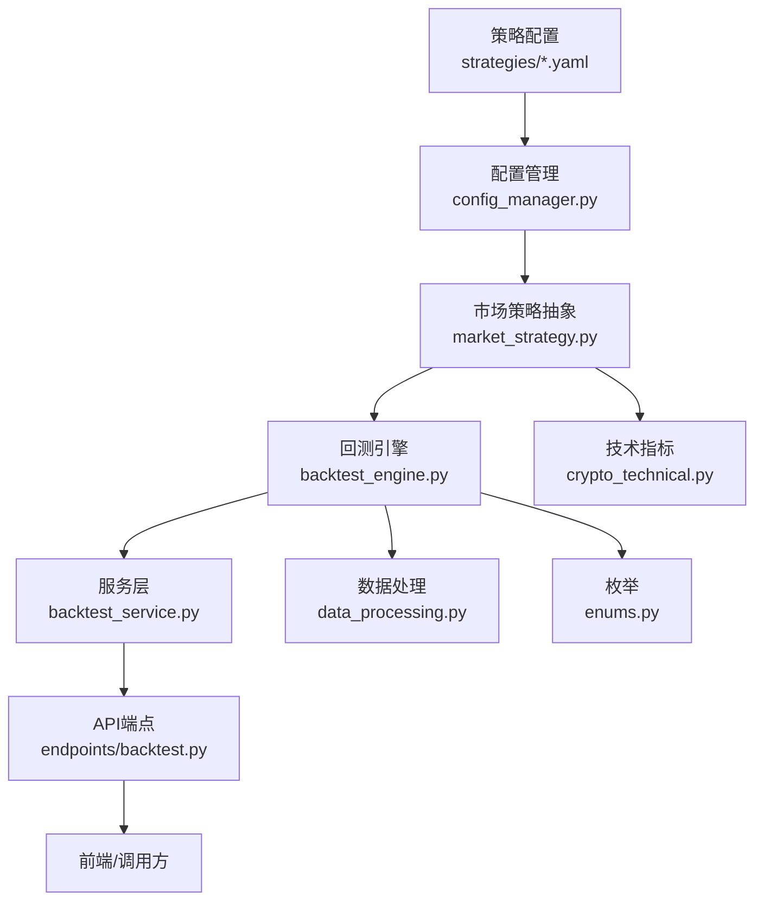
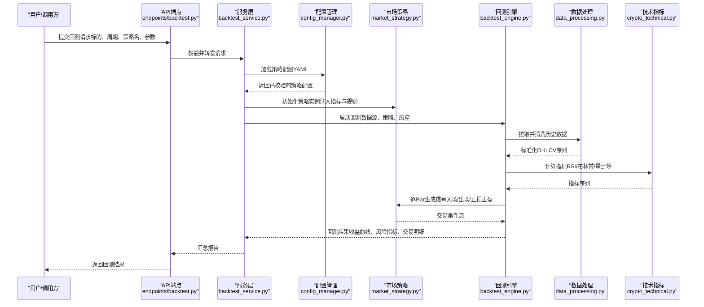
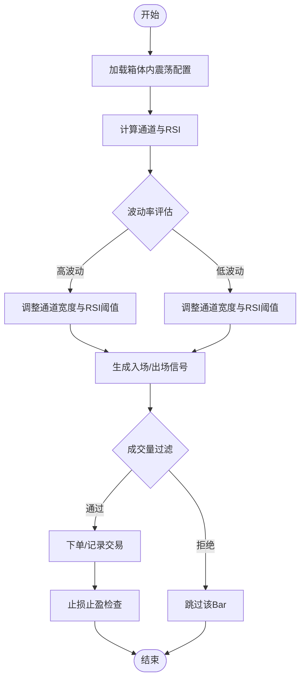
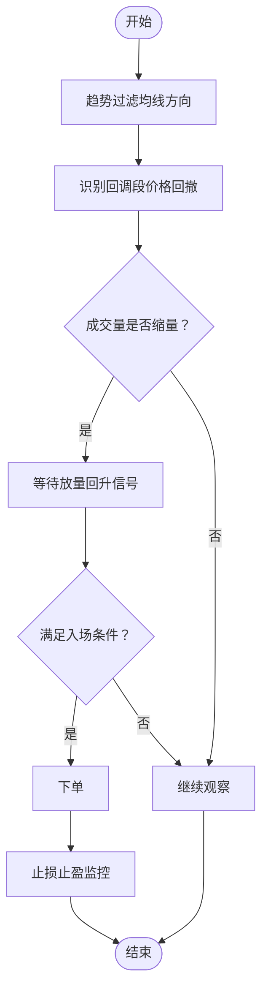
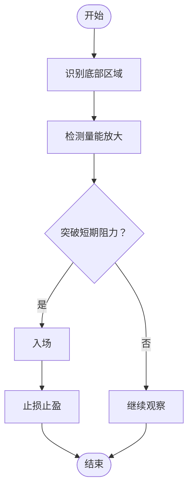
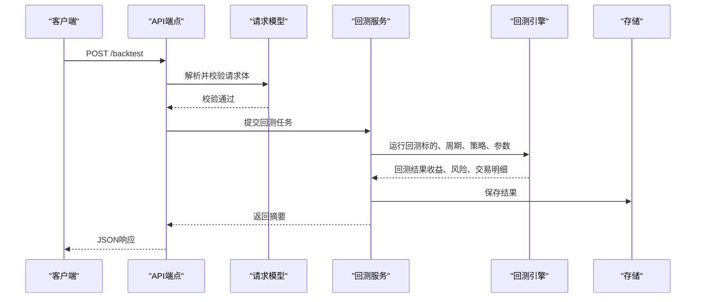
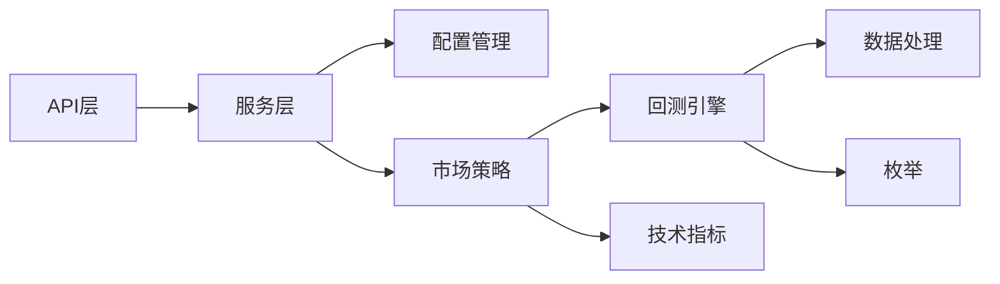

# 均值回归策略

<cite>
**本文引用的文件**   
- [strategies/box_oscillation.yaml](file://strategies/box_oscillation.yaml)
- [strategies/shrink_pullback.yaml](file://strategies/shrink_pullback.yaml)
- [strategies/bottom_volume.yaml](file://strategies/bottom_volume.yaml)
- [src/core/backtest_engine.py](file://src/core/backtest_engine.py)
- [src/services/backtest_service.py](file://src/services/backtest_service.py)
- [api/v1/endpoints/backtest.py](file://api/v1/endpoints/backtest.py)
- [api/v1/schemas/backtest.py](file://api/v1/schemas/backtest.py)
- [src/core/market_strategy.py](file://src/core/market_strategy.py)
- [src/core/config_manager.py](file://src/core/config_manager.py)
- [src/utils/data_processing.py](file://src/utils/data_processing.py)
- [src/crypto_technical.py](file://src/crypto_technical.py)
- [src/enums.py](file://src/enums.py)
</cite>

## 目录
1. [简介](#简介)
2. [项目结构](#项目结构)
3. [核心组件](#核心组件)
4. [架构总览](#架构总览)
5. [详细组件分析](#详细组件分析)
6. [依赖分析](#依赖分析)
7. [性能考虑](#性能考虑)
8. [故障排查指南](#故障排查指南)
9. [结论](#结论)
10. [附录](#附录)

## 简介
本文件面向“均值回归”类策略的配置与实现，聚焦箱体震荡、缩量回调等典型场景。内容涵盖：
- 超买超卖指标配置（如RSI、布林带）
- 回归区间设定（通道/均线偏离度）
- 成交量配合条件（缩量回调、放量确认）
- 不同波动率环境下的参数优化建议
- 回测性能分析与实盘执行注意事项

本仓库在 strategies 目录下提供多种策略的YAML配置示例，并在后端通过回测引擎与服务层进行加载、校验与执行。

## 项目结构
与均值回归策略相关的代码主要分布在以下位置：
- 策略配置：strategies/*.yaml（箱体内震荡、缩量回调、底部放量等）
- 回测引擎：src/core/backtest_engine.py（回测执行、信号生成、绩效统计）
- 服务层：src/services/backtest_service.py（任务编排、结果持久化）
- API层：api/v1/endpoints/backtest.py、api/v1/schemas/backtest.py（请求/响应模型与路由）
- 市场策略抽象：src/core/market_strategy.py（策略基类与通用逻辑）
- 配置管理：src/core/config_manager.py（策略配置读取与校验）
- 数据处理：src/utils/data_processing.py（数据清洗、对齐、窗口计算）
- 技术指标：src/crypto_technical.py（通用技术指标封装）
- 枚举定义：src/enums.py（信号类型、状态码等）

**图表来源** 
- [strategies/box_oscillation.yaml](file://strategies/box_oscillation.yaml)
- [strategies/shrink_pullback.yaml](file://strategies/shrink_pullback.yaml)
- [src/core/config_manager.py](file://src/core/config_manager.py)
- [src/core/market_strategy.py](file://src/core/market_strategy.py)
- [src/core/backtest_engine.py](file://src/core/backtest_engine.py)
- [src/services/backtest_service.py](file://src/services/backtest_service.py)
- [api/v1/endpoints/backtest.py](file://api/v1/endpoints/backtest.py)
- [src/utils/data_processing.py](file://src/utils/data_processing.py)
- [src/crypto_technical.py](file://src/crypto_technical.py)
- [src/enums.py](file://src/enums.py)

**章节来源**
- [src/core/backtest_engine.py](file://src/core/backtest_engine.py)
- [src/services/backtest_service.py](file://src/services/backtest_service.py)
- [api/v1/endpoints/backtest.py](file://api/v1/endpoints/backtest.py)
- [api/v1/schemas/backtest.py](file://api/v1/schemas/backtest.py)
- [src/core/market_strategy.py](file://src/core/market_strategy.py)
- [src/core/config_manager.py](file://src/core/config_manager.py)
- [src/utils/data_processing.py](file://src/utils/data_processing.py)
- [src/crypto_technical.py](file://src/crypto_technical.py)
- [src/enums.py](file://src/enums.py)

## 核心组件
- 策略配置（YAML）
  - 箱体内震荡：定义通道上下轨、RSI超买超卖阈值、入场/出场规则、止损止盈、仓位控制等
  - 缩量回调：定义回调深度、成交量萎缩比例、趋势过滤、入场触发、止损止盈
  - 底部放量：定义底部区域判定、量能放大阈值、突破确认、风控参数
- 配置管理
  - 负责读取YAML、字段校验、默认值填充、版本兼容
- 市场策略抽象
  - 统一策略接口、指标计算管线、信号合成、持仓与交易事件生成
- 回测引擎
  - 基于历史数据回放，按日/分钟级推进，计算指标、生成信号、模拟成交、统计绩效
- 服务层
  - 接收API请求，调度回测任务，落库结果，返回摘要与明细
- 数据处理
  - 数据清洗、缺失值处理、复权、对齐时间戳、滚动窗口计算
- 技术指标
  - RSI、布林带、MA、ATR、成交量比率等常用指标的封装
- 枚举
  - 信号类型、状态码、订单类型等常量定义

**章节来源**
- [src/core/config_manager.py](file://src/core/config_manager.py)
- [src/core/market_strategy.py](file://src/core/market_strategy.py)
- [src/core/backtest_engine.py](file://src/core/backtest_engine.py)
- [src/services/backtest_service.py](file://src/services/backtest_service.py)
- [src/utils/data_processing.py](file://src/utils/data_processing.py)
- [src/crypto_technical.py](file://src/crypto_technical.py)
- [src/enums.py](file://src/enums.py)

## 架构总览
下图展示从策略配置到回测执行的端到端流程：

**图表来源** 
- [api/v1/endpoints/backtest.py](file://api/v1/endpoints/backtest.py)
- [src/services/backtest_service.py](file://src/services/backtest_service.py)
- [src/core/config_manager.py](file://src/core/config_manager.py)
- [src/core/market_strategy.py](file://src/core/market_strategy.py)
- [src/core/backtest_engine.py](file://src/core/backtest_engine.py)
- [src/utils/data_processing.py](file://src/utils/data_processing.py)
- [src/crypto_technical.py](file://src/crypto_technical.py)

## 详细组件分析

### 箱体内震荡（均值回归）策略
- 核心思想
  - 价格在通道内均值回归，触及上轨超买卖出，触及下轨超买买入；结合RSI过滤极端行情
- 关键配置项
  - 通道宽度（布林带或固定百分比）、RSI超买/超卖阈值、入场触发条件、止损止盈、滑点与手续费
- 成交量配合
  - 入场时要求量能不异常放大，避免假突破；反转信号可辅以量缩确认
- 波动率环境适配
  - 高波动：放宽通道宽度、提高RSI阈值、收紧止损
  - 低波动：收窄通道、降低RSI阈值、适度放宽止损

**图表来源** 
- [strategies/box_oscillation.yaml](file://strategies/box_oscillation.yaml)
- [src/core/market_strategy.py](file://src/core/market_strategy.py)
- [src/crypto_technical.py](file://src/crypto_technical.py)
- [src/utils/data_processing.py](file://src/utils/data_processing.py)

**章节来源**
- [strategies/box_oscillation.yaml](file://strategies/box_oscillation.yaml)
- [src/core/market_strategy.py](file://src/core/market_strategy.py)
- [src/crypto_technical.py](file://src/crypto_technical.py)
- [src/utils/data_processing.py](file://src/utils/data_processing.py)

### 缩量回调策略
- 核心思想
  - 上升趋势中的回调阶段出现缩量，随后放量回升时入场；跌破关键支撑则止损
- 关键配置项
  - 回调深度（ATR或价格回撤比例）、缩量阈值（成交量相对均值的比值）、趋势过滤（均线方向）、入场触发（放量阳线）、止损止盈
- 成交量配合
  - 缩量确认回调有效，放量确认反转；若放量下跌则视为破位
- 波动率环境适配
  - 高波动：使用ATR动态止损、提高缩量阈值、缩短持有期
  - 低波动：降低缩量阈值、放宽入场条件

**图表来源** 
- [strategies/shrink_pullback.yaml](file://strategies/shrink_pullback.yaml)
- [src/core/market_strategy.py](file://src/core/market_strategy.py)
- [src/crypto_technical.py](file://src/crypto_technical.py)
- [src/utils/data_processing.py](file://src/utils/data_processing.py)

**章节来源**
- [strategies/shrink_pullback.yaml](file://strategies/shrink_pullback.yaml)
- [src/core/market_strategy.py](file://src/core/market_strategy.py)
- [src/crypto_technical.py](file://src/crypto_technical.py)
- [src/utils/data_processing.py](file://src/utils/data_processing.py)

### 底部放量策略（辅助均值回归）
- 核心思想
  - 长期下跌后出现底部放量，伴随价格企稳与突破短期阻力，作为均值回归的左侧信号
- 关键配置项
  - 底部区域判定（价格分位数或波动率压缩）、量能放大阈值、突破确认（收盘价高于短期均线）、止损止盈
- 成交量配合
  - 放量必须显著高于近期均值；若放量但价格未突破，需延长观察期

**图表来源** 
- [strategies/bottom_volume.yaml](file://strategies/bottom_volume.yaml)
- [src/core/market_strategy.py](file://src/core/market_strategy.py)
- [src/crypto_technical.py](file://src/crypto_technical.py)
- [src/utils/data_processing.py](file://src/utils/data_processing.py)

**章节来源**
- [strategies/bottom_volume.yaml](file://strategies/bottom_volume.yaml)
- [src/core/market_strategy.py](file://src/core/market_strategy.py)
- [src/crypto_technical.py](file://src/crypto_technical.py)
- [src/utils/data_processing.py](file://src/utils/data_processing.py)

### 回测执行流程（API到引擎）

**图表来源** 
- [api/v1/endpoints/backtest.py](file://api/v1/endpoints/backtest.py)
- [api/v1/schemas/backtest.py](file://api/v1/schemas/backtest.py)
- [src/services/backtest_service.py](file://src/services/backtest_service.py)
- [src/core/backtest_engine.py](file://src/core/backtest_engine.py)

**章节来源**
- [api/v1/endpoints/backtest.py](file://api/v1/endpoints/backtest.py)
- [api/v1/schemas/backtest.py](file://api/v1/schemas/backtest.py)
- [src/services/backtest_service.py](file://src/services/backtest_service.py)
- [src/core/backtest_engine.py](file://src/core/backtest_engine.py)

## 依赖分析
- 模块耦合
  - API依赖服务层，服务层依赖配置管理与策略抽象，策略依赖数据处理与技术指标，回测引擎贯穿全流程
- 外部依赖
  - 数据源（历史数据获取）、技术指标库（封装于crypto_technical.py）、存储（回测结果持久化）
- 潜在循环依赖
  - 通过分层与接口抽象避免：API→服务→策略→引擎→数据/指标，单向依赖清晰

**图表来源** 
- [api/v1/endpoints/backtest.py](file://api/v1/endpoints/backtest.py)
- [src/services/backtest_service.py](file://src/services/backtest_service.py)
- [src/core/config_manager.py](file://src/core/config_manager.py)
- [src/core/market_strategy.py](file://src/core/market_strategy.py)
- [src/core/backtest_engine.py](file://src/core/backtest_engine.py)
- [src/utils/data_processing.py](file://src/utils/data_processing.py)
- [src/crypto_technical.py](file://src/crypto_technical.py)
- [src/enums.py](file://src/enums.py)

**章节来源**
- [api/v1/endpoints/backtest.py](file://api/v1/endpoints/backtest.py)
- [src/services/backtest_service.py](file://src/services/backtest_service.py)
- [src/core/config_manager.py](file://src/core/config_manager.py)
- [src/core/market_strategy.py](file://src/core/market_strategy.py)
- [src/core/backtest_engine.py](file://src/core/backtest_engine.py)
- [src/utils/data_processing.py](file://src/utils/data_processing.py)
- [src/crypto_technical.py](file://src/crypto_technical.py)
- [src/enums.py](file://src/enums.py)

## 性能考虑
- 数据预处理
  - 批量拉取与缓存历史数据，减少重复IO；对齐时间戳与复权处理一次性完成
- 指标计算
  - 向量化计算优先，避免逐BarPython循环；滑动窗口采用增量更新
- 回测引擎
  - 并行回测多标的/多参数组合；按需启用内存映射；限制并发避免OOM
- 存储与传输
  - 回测结果分页返回；仅返回必要字段；压缩大对象（如交易明细）

[本节为通用指导，不直接分析具体文件]

## 故障排查指南
- 常见错误
  - 配置校验失败：字段缺失、类型不符、范围越界
  - 数据问题：缺失值、复权不一致、时间戳错位
  - 指标异常：除零、NaN传播、窗口不足
  - 回测崩溃：内存溢出、并发冲突、锁竞争
- 定位方法
  - 查看API返回的错误码与消息
  - 检查配置文件的必填项与取值范围
  - 打印中间指标序列，定位NaN来源
  - 降低并发与数据规模，逐步复现
- 修复建议
  - 完善输入校验与默认值
  - 增加数据质量检查与告警
  - 对指标计算加入边界保护
  - 优化内存占用与并发控制

**章节来源**
- [api/v1/endpoints/backtest.py](file://api/v1/endpoints/backtest.py)
- [api/v1/schemas/backtest.py](file://api/v1/schemas/backtest.py)
- [src/core/config_manager.py](file://src/core/config_manager.py)
- [src/utils/data_processing.py](file://src/utils/data_processing.py)
- [src/crypto_technical.py](file://src/crypto_technical.py)

## 结论
- 均值回归策略在箱体内震荡与缩量回调场景中具备良好适用性
- 通过RSI与通道/均线偏离度构建超买超卖信号，结合成交量过滤提升胜率
- 在不同波动率环境下需动态调整通道宽度、RSI阈值与止损止盈
- 回测引擎与服务层提供了可扩展、可配置的框架，便于策略迭代与性能优化
- 实盘执行需关注滑点、流动性、风控与系统稳定性

[本节为总结，不直接分析具体文件]

## 附录
- 策略配置示例清单
  - 箱体内震荡：[strategies/box_oscillation.yaml](file://strategies/box_oscillation.yaml)
  - 缩量回调：[strategies/shrink_pullback.yaml](file://strategies/shrink_pullback.yaml)
  - 底部放量：[strategies/bottom_volume.yaml](file://strategies/bottom_volume.yaml)
- 回测相关接口与模型
  - 端点：[api/v1/endpoints/backtest.py](file://api/v1/endpoints/backtest.py)
  - 模型：[api/v1/schemas/backtest.py](file://api/v1/schemas/backtest.py)
- 核心实现
  - 回测引擎：[src/core/backtest_engine.py](file://src/core/backtest_engine.py)
  - 服务层：[src/services/backtest_service.py](file://src/services/backtest_service.py)
  - 策略抽象：[src/core/market_strategy.py](file://src/core/market_strategy.py)
  - 配置管理：[src/core/config_manager.py](file://src/core/config_manager.py)
  - 数据处理：[src/utils/data_processing.py](file://src/utils/data_processing.py)
  - 技术指标：[src/crypto_technical.py](file://src/crypto_technical.py)
  - 枚举定义：[src/enums.py](file://src/enums.py)