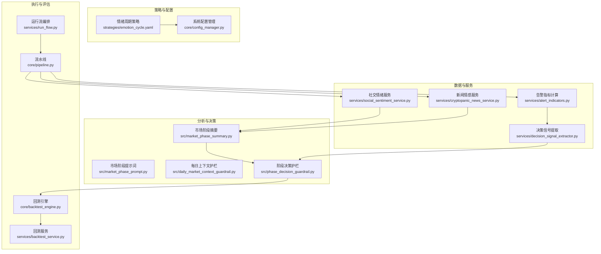
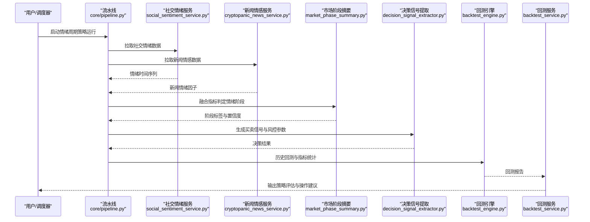
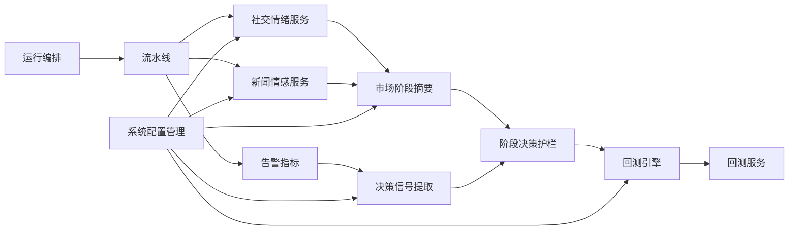

# 情绪周期策略

<cite>
**本文引用的文件**   
- [emotion_cycle.yaml](file://strategies/emotion_cycle.yaml)
- [social_sentiment_service.py](file://src/services/social_sentiment_service.py)
- [cryptopanic_news_service.py](file://src/services/cryptopanic_news_service.py)
- [market_phase_summary.py](file://src/market_phase_summary.py)
- [market_phase_prompt.py](file://src/market_phase_prompt.py)
- [daily_market_context_guardrail.py](file://src/daily_market_context_guardrail.py)
- [phase_decision_guardrail.py](file://src/phase_decision_guardrail.py)
- [backtest_engine.py](file://src/core/backtest_engine.py)
- [backtest_service.py](file://src/services/backtest_service.py)
- [alert_indicators.py](file://src/services/alert_indicators.py)
- [decision_signal_extractor.py](file://src/services/decision_signal_extractor.py)
- [analysis_service.py](file://src/services/analysis_service.py)
- [run_flow.py](file://src/services/run_flow.py)
- [pipeline.py](file://src/core/pipeline.py)
- [config_manager.py](file://src/core/config_manager.py)
- [system_config_service.py](file://src/services/system_config_service.py)
</cite>

## 目录
1. [简介](#简介)
2. [项目结构](#项目结构)
3. [核心组件](#核心组件)
4. [架构总览](#架构总览)
5. [详细组件分析](#详细组件分析)
6. [依赖关系分析](#依赖关系分析)
7. [性能考虑](#性能考虑)
8. [故障排查指南](#故障排查指南)
9. [结论](#结论)
10. [附录](#附录)

## 简介
本文件面向“情绪周期策略”的配置与使用，覆盖市场情绪指标配置、情绪周期识别、买卖信号生成，以及社交媒体数据集成、新闻情感分析与技术指标结合的方法。文档同时提供不同情绪阶段的操作策略与风险管理配置建议，并给出情绪指标验证与策略效果评估方法，帮助读者快速落地可回测、可监控的情绪驱动交易流程。

## 项目结构
围绕情绪周期策略，代码库的关键位置包括：
- 策略定义与参数：位于 strategies 目录下的 YAML 配置文件
- 情绪与新闻数据服务：services 目录下的社交情绪与新闻服务
- 市场阶段与决策护栏：用于将多源信号收敛为稳定决策
- 回测引擎与服务：用于策略效果评估与指标验证
- 告警与决策信号提取：用于生成可执行的交易信号与风控规则
- 运行编排与流水线：串联数据获取、分析、决策与通知

图表来源
- [emotion_cycle.yaml](file://strategies/emotion_cycle.yaml)
- [social_sentiment_service.py](file://src/services/social_sentiment_service.py)
- [cryptopanic_news_service.py](file://src/services/cryptopanic_news_service.py)
- [market_phase_summary.py](file://src/market_phase_summary.py)
- [market_phase_prompt.py](file://src/market_phase_prompt.py)
- [daily_market_context_guardrail.py](file://src/daily_market_context_guardrail.py)
- [phase_decision_guardrail.py](file://src/phase_decision_guardrail.py)
- [backtest_engine.py](file://src/core/backtest_engine.py)
- [backtest_service.py](file://src/services/backtest_service.py)
- [run_flow.py](file://src/services/run_flow.py)
- [pipeline.py](file://src/core/pipeline.py)

章节来源
- [emotion_cycle.yaml](file://strategies/emotion_cycle.yaml)
- [social_sentiment_service.py](file://src/services/social_sentiment_service.py)
- [cryptopanic_news_service.py](file://src/services/cryptopanic_news_service.py)
- [market_phase_summary.py](file://src/market_phase_summary.py)
- [market_phase_prompt.py](file://src/market_phase_prompt.py)
- [daily_market_context_guardrail.py](file://src/daily_market_context_guardrail.py)
- [phase_decision_guardrail.py](file://src/phase_decision_guardrail.py)
- [backtest_engine.py](file://src/core/backtest_engine.py)
- [backtest_service.py](file://src/services/backtest_service.py)
- [run_flow.py](file://src/services/run_flow.py)
- [pipeline.py](file://src/core/pipeline.py)

## 核心组件
- 情绪周期策略配置（YAML）
  - 定义情绪指标阈值、周期识别窗口、信号触发条件、仓位与止损止盈等风控参数
  - 支持按标的或指数维度覆盖默认值
- 社交情绪服务
  - 聚合社交媒体讨论热度、情绪得分与趋势变化，输出标准化情绪时间序列
- 新闻情感服务
  - 抓取财经新闻并进行情感打分，形成新闻情绪因子
- 市场阶段摘要与提示词
  - 将情绪因子与技术指标融合，判定当前市场处于何种情绪周期阶段
- 决策信号提取与告警指标
  - 基于阶段与指标阈值生成买入/卖出/观望信号，并附带置信度与风险提示
- 回测引擎与服务
  - 对策略进行历史回测，输出收益曲线、最大回撤、胜率、盈亏比等关键指标
- 运行编排与流水线
  - 统一调度数据拉取、分析、决策、回测与通知任务

章节来源
- [emotion_cycle.yaml](file://strategies/emotion_cycle.yaml)
- [social_sentiment_service.py](file://src/services/social_sentiment_service.py)
- [cryptopanic_news_service.py](file://src/services/cryptopanic_news_service.py)
- [market_phase_summary.py](file://src/market_phase_summary.py)
- [market_phase_prompt.py](file://src/market_phase_prompt.py)
- [alert_indicators.py](file://src/services/alert_indicators.py)
- [decision_signal_extractor.py](file://src/services/decision_signal_extractor.py)
- [backtest_engine.py](file://src/core/backtest_engine.py)
- [backtest_service.py](file://src/services/backtest_service.py)
- [run_flow.py](file://src/services/run_flow.py)
- [pipeline.py](file://src/core/pipeline.py)

## 架构总览
情绪周期策略的端到端流程如下：
- 数据层：从社交平台与新闻源拉取情绪相关数据，清洗并标准化
- 分析层：计算情绪指标、技术因子，综合判定市场情绪周期阶段
- 决策层：依据阶段与阈值生成交易信号，叠加风控规则
- 执行层：通过回测引擎验证策略有效性，或通过运行编排触发实盘/模拟交易
- 监控层：告警与通知，持续跟踪策略表现与异常

图表来源
- [pipeline.py](file://src/core/pipeline.py)
- [social_sentiment_service.py](file://src/services/social_sentiment_service.py)
- [cryptopanic_news_service.py](file://src/services/cryptopanic_news_service.py)
- [market_phase_summary.py](file://src/market_phase_summary.py)
- [decision_signal_extractor.py](file://src/services/decision_signal_extractor.py)
- [backtest_engine.py](file://src/core/backtest_engine.py)
- [backtest_service.py](file://src/services/backtest_service.py)

## 详细组件分析

### 情绪周期策略配置（YAML）
- 作用：集中管理情绪指标阈值、周期识别窗口、信号触发条件、仓位管理与止损止盈等
- 关键点：
  - 情绪指标：社交情绪均值/方差、新闻情绪强度、情绪动量
  - 周期识别：滚动窗口、平滑滤波、阶段切换阈值
  - 信号生成：多因子共振、置信度门槛、避免频繁反转
  - 风控：单笔风险上限、最大持仓、波动率自适应仓位
- 使用方式：在策略运行时加载 YAML 配置，覆盖默认参数；支持按标的或指数维度差异化配置

章节来源
- [emotion_cycle.yaml](file://strategies/emotion_cycle.yaml)

### 社交情绪服务
- 作用：聚合社交平台讨论热度与情绪得分，输出标准化情绪时间序列
- 关键点：
  - 数据源：社交平台 API、关键词过滤、去重与噪声抑制
  - 指标：情绪得分、热度指数、情绪动量、极端情绪检测
  - 输出：标准化时间序列与质量评分（缺失、延迟、异常）
- 集成方式：流水线中作为数据节点被调用，供阶段判定与信号生成使用

章节来源
- [social_sentiment_service.py](file://src/services/social_sentiment_service.py)

### 新闻情感服务
- 作用：抓取财经新闻并进行情感打分，形成新闻情绪因子
- 关键点：
  - 数据源：新闻聚合平台、RSS、API 接口
  - 处理：文本清洗、实体识别、情感分类、权重分配
  - 输出：新闻情绪强度、主题分布、时效性评分
- 集成方式：与社交情绪服务并行采集，融合进入市场阶段判定

章节来源
- [cryptopanic_news_service.py](file://src/services/cryptopanic_news_service.py)

### 市场阶段摘要与提示词
- 作用：将情绪因子与技术指标融合，判定当前市场处于何种情绪周期阶段
- 关键点：
  - 输入：社交情绪、新闻情绪、技术指标（如均线、RSI、波动率）
  - 算法：滑动窗口统计、状态机切换、LLM 辅助解释（可选）
  - 输出：阶段标签（如“恐慌筑底”、“情绪修复”、“乐观加速”、“狂热见顶”）、置信度
- 提示词：用于 LLM 辅助生成可读的阶段说明与操作建议

章节来源
- [market_phase_summary.py](file://src/market_phase_summary.py)
- [market_phase_prompt.py](file://src/market_phase_prompt.py)

### 每日上下文护栏与阶段决策护栏
- 作用：确保每日分析上下文一致性与决策稳定性，减少误判与过度交易
- 关键点：
  - 每日上下文护栏：数据新鲜度校验、缺失回退、异常值处理
  - 阶段决策护栏：阶段切换确认、信号一致性检查、风控约束
- 输出：经过护栏修正后的阶段与信号，提升稳健性

章节来源
- [daily_market_context_guardrail.py](file://src/daily_market_context_guardrail.py)
- [phase_decision_guardrail.py](file://src/phase_decision_guardrail.py)

### 告警指标与决策信号提取
- 作用：基于阶段与指标阈值生成买入/卖出/观望信号，并附带置信度与风险提示
- 关键点：
  - 指标：情绪动量、新闻情绪强度、技术指标共振
  - 信号：方向、入场时机、仓位比例、止损止盈、持有期
  - 风控：波动率调整、事件风险规避、流动性约束
- 输出：结构化决策信号，供回测引擎或执行模块使用

章节来源
- [alert_indicators.py](file://src/services/alert_indicators.py)
- [decision_signal_extractor.py](file://src/services/decision_signal_extractor.py)

### 回测引擎与服务
- 作用：对情绪周期策略进行历史回测，输出收益曲线、最大回撤、胜率、盈亏比等关键指标
- 关键点：
  - 回测范围：时间区间、标的池、滑点与手续费设置
  - 指标：年化收益、夏普比率、最大回撤、胜率、平均盈亏比
  - 报告：可视化图表与文字总结，便于策略优化
- 服务：封装回测流程，提供 API 或命令行入口

章节来源
- [backtest_engine.py](file://src/core/backtest_engine.py)
- [backtest_service.py](file://src/services/backtest_service.py)

### 运行编排与流水线
- 作用：统一调度数据拉取、分析、决策、回测与通知任务
- 关键点：
  - 编排：任务依赖图、并发控制、失败重试
  - 流水线：数据节点、分析节点、决策节点、执行节点
  - 监控：日志、指标、告警
- 输出：完整的策略运行快照与报告

章节来源
- [run_flow.py](file://src/services/run_flow.py)
- [pipeline.py](file://src/core/pipeline.py)

### 系统配置管理
- 作用：集中管理策略参数、数据源配置、通知渠道等
- 关键点：
  - 配置项：情绪阈值、回测参数、API Key、通道配置
  - 动态更新：热重载、版本兼容、权限控制
  - 审计：变更日志、回滚机制

章节来源
- [config_manager.py](file://src/core/config_manager.py)
- [system_config_service.py](file://src/services/system_config_service.py)

## 依赖关系分析
情绪周期策略的核心依赖关系如下：
- 数据依赖：社交情绪服务、新闻情感服务
- 分析依赖：市场阶段摘要、提示词、护栏
- 决策依赖：告警指标、决策信号提取
- 执行依赖：回测引擎与服务、运行编排与流水线
- 配置依赖：系统配置管理

图表来源
- [social_sentiment_service.py](file://src/services/social_sentiment_service.py)
- [cryptopanic_news_service.py](file://src/services/cryptopanic_news_service.py)
- [market_phase_summary.py](file://src/market_phase_summary.py)
- [phase_decision_guardrail.py](file://src/phase_decision_guardrail.py)
- [alert_indicators.py](file://src/services/alert_indicators.py)
- [decision_signal_extractor.py](file://src/services/decision_signal_extractor.py)
- [backtest_engine.py](file://src/core/backtest_engine.py)
- [backtest_service.py](file://src/services/backtest_service.py)
- [run_flow.py](file://src/services/run_flow.py)
- [pipeline.py](file://src/core/pipeline.py)
- [config_manager.py](file://src/core/config_manager.py)

章节来源
- [social_sentiment_service.py](file://src/services/social_sentiment_service.py)
- [cryptopanic_news_service.py](file://src/services/cryptopanic_news_service.py)
- [market_phase_summary.py](file://src/market_phase_summary.py)
- [phase_decision_guardrail.py](file://src/phase_decision_guardrail.py)
- [alert_indicators.py](file://src/services/alert_indicators.py)
- [decision_signal_extractor.py](file://src/services/decision_signal_extractor.py)
- [backtest_engine.py](file://src/core/backtest_engine.py)
- [backtest_service.py](file://src/services/backtest_service.py)
- [run_flow.py](file://src/services/run_flow.py)
- [pipeline.py](file://src/core/pipeline.py)
- [config_manager.py](file://src/core/config_manager.py)

## 性能考虑
- 数据拉取并发：社交与新闻数据并行采集，降低整体时延
- 指标计算优化：滑动窗口与增量更新，避免重复计算
- 缓存策略：情绪因子与阶段标签短期缓存，提高响应速度
- 回测性能：向量化计算、分块读取历史数据、并行标的回测
- 资源限制：线程池与队列大小调优，防止内存溢出与阻塞

[本节为通用指导，不直接分析具体文件]

## 故障排查指南
- 数据源异常
  - 现象：情绪数据缺失或延迟
  - 排查：检查 API Key、网络连通性、限流与重试策略
  - 解决：启用备用数据源、降级到历史均值、告警通知
- 阶段判定不稳定
  - 现象：频繁切换阶段导致信号抖动
  - 排查：检查阈值设置、平滑参数、护栏逻辑
  - 解决：增大确认窗口、引入一致性检查、降低敏感度
- 回测结果异常
  - 现象：收益曲线不平滑、指标不合理
  - 排查：检查滑点、手续费、数据对齐、缺失值处理
  - 解决：修正参数、增加鲁棒性测试、分段回测验证
- 通知与告警失效
  - 现象：未收到策略运行结果或异常告警
  - 排查：检查通知渠道配置、消息格式、权限
  - 解决：重新配置通道、简化消息模板、增加调试日志

章节来源
- [social_sentiment_service.py](file://src/services/social_sentiment_service.py)
- [cryptopanic_news_service.py](file://src/services/cryptopanic_news_service.py)
- [market_phase_summary.py](file://src/market_phase_summary.py)
- [phase_decision_guardrail.py](file://src/phase_decision_guardrail.py)
- [backtest_engine.py](file://src/core/backtest_engine.py)
- [backtest_service.py](file://src/services/backtest_service.py)

## 结论
情绪周期策略通过社交情绪与新闻情感的融合，结合技术指标与市场阶段判定，形成稳定的买卖信号与风控体系。借助回测引擎与运行编排，可实现从策略配置、数据分析、决策生成到效果评估的闭环。建议在实盘前充分进行回测与压力测试，持续优化阈值与护栏逻辑，确保策略在不同市场环境下具备稳健表现。

[本节为总结性内容，不直接分析具体文件]

## 附录

### 不同情绪阶段的操作策略与风险管理
- 恐慌筑底阶段
  - 操作：分批建仓、轻仓试错、严格止损
  - 风控：波动率放大时降低仓位，避免追空
- 情绪修复阶段
  - 操作：逢低加仓、趋势跟随、逐步止盈
  - 风控：关注量能配合与基本面催化
- 乐观加速阶段
  - 操作：顺势加仓、移动止盈、控制回撤
  - 风控：警惕过热信号与政策扰动
- 狂热见顶阶段
  - 操作：减仓清仓、锁定利润、等待回调
  - 风控：避免逆势抄底，保持现金储备

[本节为概念性内容，不直接分析具体文件]

### 情绪指标验证与策略效果评估方法
- 指标验证
  - 相关性分析：情绪因子与价格变动的滞后相关性
  - 稳定性检验：滚动窗口下的指标漂移与衰减
  - 替代性测试：不同数据源与模型的情感打分对比
- 策略评估
  - 收益指标：年化收益、超额收益、信息比率
  - 风险指标：最大回撤、波动率、下行风险
  - 交易质量：胜率、盈亏比、换手率、滑点影响
  - 稳健性：跨市场、跨周期、参数敏感性分析

[本节为概念性内容，不直接分析具体文件]