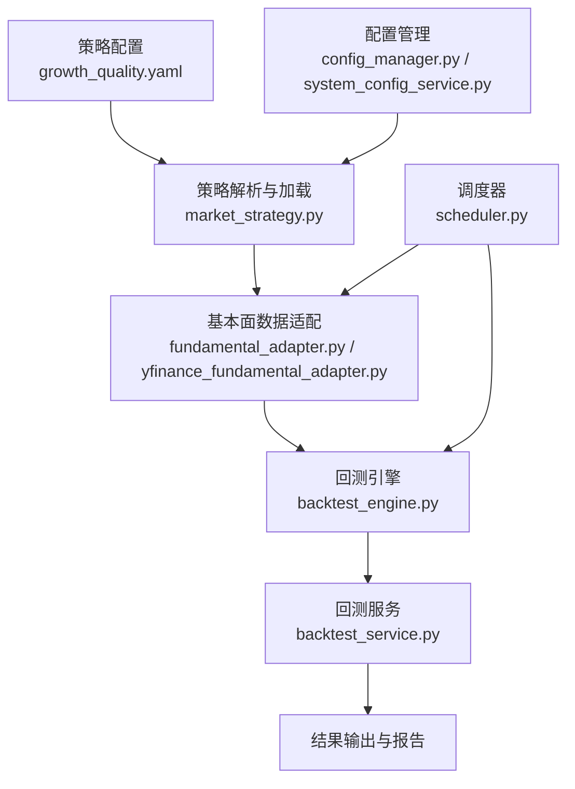
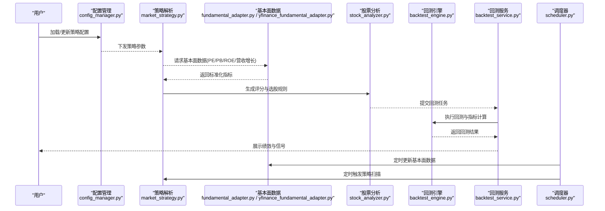
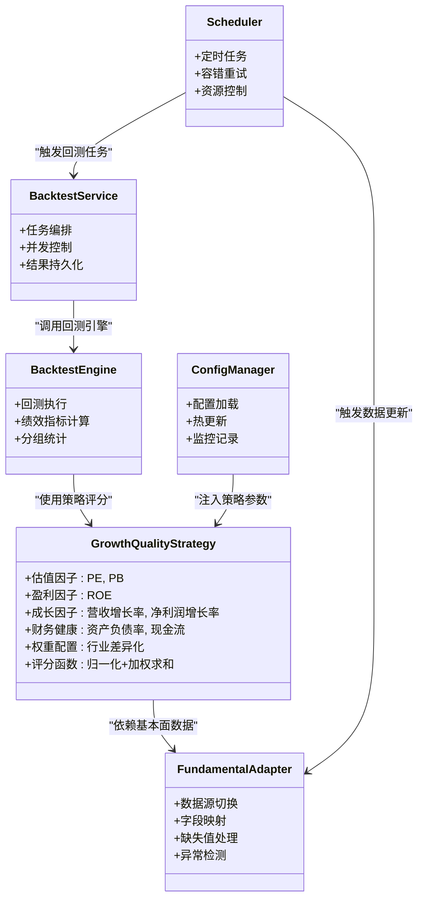

# 成长质量策略

<cite>
**本文引用的文件**   
- [growth_quality.yaml](file://strategies/growth_quality.yaml)
- [backtest_engine.py](file://src/core/backtest_engine.py)
- [backtest_service.py](file://src/services/backtest_service.py)
- [fundamental_adapter.py](file://data_provider/fundamental_adapter.py)
- [yfinance_fundamental_adapter.py](file://data_provider/yfinance_fundamental_adapter.py)
- [config_manager.py](file://src/core/config_manager.py)
- [system_config_service.py](file://src/services/system_config_service.py)
- [scheduler.py](file://src/scheduler.py)
- [market_strategy.py](file://src/core/market_strategy.py)
- [stock_analyzer.py](file://src/stock_analyzer.py)
- [analysis_service.py](file://src/services/analysis_service.py)
</cite>

## 目录
1. [简介](#简介)
2. [项目结构](#项目结构)
3. [核心组件](#核心组件)
4. [架构总览](#架构总览)
5. [详细组件分析](#详细组件分析)
6. [依赖关系分析](#依赖关系分析)
7. [性能考虑](#性能考虑)
8. [故障排查指南](#故障排查指南)
9. [结论](#结论)
10. [附录](#附录)

## 简介
本文件面向“成长质量策略”的配置与使用，覆盖基本面选股指标、财务健康度评估、成长性筛选条件，并详细说明 PE/PB 估值、ROE 盈利能力、营收增长率等核心参数的配置方法。同时提供不同行业板块的策略调整建议与回测优化要点，以及基本面数据更新与策略监控的配置指引。

## 项目结构
与成长质量策略相关的代码与配置主要分布在以下位置：
- 策略定义：strategies/growth_quality.yaml（策略参数与规则）
- 回测引擎：src/core/backtest_engine.py（回测执行与指标计算）
- 回测服务：src/services/backtest_service.py（任务编排与结果聚合）
- 基本面数据适配：data_provider/fundamental_adapter.py、data_provider/yfinance_fundamental_adapter.py（多源基本面数据接入）
- 配置管理：src/core/config_manager.py、src/services/system_config_service.py（系统级配置与动态刷新）
- 调度器：src/scheduler.py（定时任务与数据更新）
- 市场策略与股票分析：src/core/market_strategy.py、src/stock_analyzer.py、src/services/analysis_service.py（策略解析与信号生成）

图表来源
- [growth_quality.yaml](file://strategies/growth_quality.yaml)
- [market_strategy.py](file://src/core/market_strategy.py)
- [fundamental_adapter.py](file://data_provider/fundamental_adapter.py)
- [yfinance_fundamental_adapter.py](file://data_provider/yfinance_fundamental_adapter.py)
- [backtest_engine.py](file://src/core/backtest_engine.py)
- [backtest_service.py](file://src/services/backtest_service.py)
- [config_manager.py](file://src/core/config_manager.py)
- [system_config_service.py](file://src/services/system_config_service.py)
- [scheduler.py](file://src/scheduler.py)

章节来源
- [growth_quality.yaml](file://strategies/growth_quality.yaml)
- [backtest_engine.py](file://src/core/backtest_engine.py)
- [backtest_service.py](file://src/services/backtest_service.py)
- [fundamental_adapter.py](file://data_provider/fundamental_adapter.py)
- [yfinance_fundamental_adapter.py](file://data_provider/yfinance_fundamental_adapter.py)
- [config_manager.py](file://src/core/config_manager.py)
- [system_config_service.py](file://src/services/system_config_service.py)
- [scheduler.py](file://src/scheduler.py)
- [market_strategy.py](file://src/core/market_strategy.py)
- [stock_analyzer.py](file://src/stock_analyzer.py)
- [analysis_service.py](file://src/services/analysis_service.py)

## 核心组件
- 策略配置文件 growth_quality.yaml：定义选股因子、阈值、权重与过滤规则，包括估值（PE/PB）、盈利（ROE）、成长（营收增长、利润增长）、财务健康（负债率、现金流）等维度。
- 基本面数据适配器 fundamental_adapter.py 与 yfinance_fundamental_adapter.py：统一拉取与标准化多源基本面数据，提供 PE/PB、ROE、营收增长率等字段。
- 回测引擎 backtest_engine.py：基于策略配置进行历史回测，计算收益、回撤、胜率等指标，支持按行业或风格分组统计。
- 回测服务 backtest_service.py：封装回测任务生命周期，处理并发、重试、结果持久化与可视化。
- 配置管理 config_manager.py 与 system_config_service.py：集中管理策略参数、数据源开关、监控告警等系统配置，支持热更新。
- 调度器 scheduler.py：定时触发基本面数据更新、策略扫描与回测任务。
- 市场策略 market_strategy.py 与股票分析 stock_analyzer.py：将策略配置转换为可执行的选股与评分逻辑，输出信号与排名。

章节来源
- [growth_quality.yaml](file://strategies/growth_quality.yaml)
- [fundamental_adapter.py](file://data_provider/fundamental_adapter.py)
- [yfinance_fundamental_adapter.py](file://data_provider/yfinance_fundamental_adapter.py)
- [backtest_engine.py](file://src/core/backtest_engine.py)
- [backtest_service.py](file://src/services/backtest_service.py)
- [config_manager.py](file://src/core/config_manager.py)
- [system_config_service.py](file://src/services/system_config_service.py)
- [scheduler.py](file://src/scheduler.py)
- [market_strategy.py](file://src/core/market_strategy.py)
- [stock_analyzer.py](file://src/stock_analyzer.py)

## 架构总览
成长质量策略的数据流与控制流如下：
- 策略配置加载：从 growth_quality.yaml 读取因子与阈值，经 market_strategy.py 解析为内部模型。
- 基本面数据获取：通过 fundamental_adapter.py 与 yfinance_fundamental_adapter.py 拉取最新数据，并进行清洗与对齐。
- 策略评分与选股：stock_analyzer.py 根据配置计算综合得分，输出候选池与排序。
- 回测执行：backtest_engine.py 在历史区间内模拟交易，计算绩效指标；backtest_service.py 负责任务编排与结果存储。
- 监控与更新：scheduler.py 定期触发数据更新与策略扫描；config_manager.py 与 system_config_service.py 提供配置热更新与监控开关。

图表来源
- [config_manager.py](file://src/core/config_manager.py)
- [market_strategy.py](file://src/core/market_strategy.py)
- [fundamental_adapter.py](file://data_provider/fundamental_adapter.py)
- [yfinance_fundamental_adapter.py](file://data_provider/yfinance_fundamental_adapter.py)
- [stock_analyzer.py](file://src/stock_analyzer.py)
- [backtest_engine.py](file://src/core/backtest_engine.py)
- [backtest_service.py](file://src/services/backtest_service.py)
- [scheduler.py](file://src/scheduler.py)

## 详细组件分析

### 策略配置示例（growth_quality.yaml）
- 基本面选股指标
  - 估值因子：PE（市盈率）、PB（市净率），支持分位数或绝对阈值过滤。
  - 盈利因子：ROE（净资产收益率），可设置最低门槛与滚动窗口。
  - 成长因子：营收增长率、净利润增长率，支持同比/环比与平滑处理。
  - 财务健康：资产负债率、经营性现金流净额、利息保障倍数等。
- 权重与评分
  - 各因子权重可调，支持行业差异化权重。
  - 综合得分采用归一化与加权求和，输出候选池排名。
- 过滤与风控
  - 剔除 ST、停牌、流动性不足标的。
  - 单行业暴露上限、个股集中度限制。

章节来源
- [growth_quality.yaml](file://strategies/growth_quality.yaml)

### 基本面数据适配（fundamental_adapter.py / yfinance_fundamental_adapter.py）
- 数据源选择：根据配置切换不同数据提供商，保证字段一致性。
- 字段映射：将原始数据映射为标准字段（如 PE_TTM、PB_LYR、ROE_TTM、Revenue_Growth_YoY）。
- 缺失值处理：插值、前向填充、跨期对齐，确保回测稳定性。
- 异常检测：对极端值与负值进行标记与修正，避免评分失真。

章节来源
- [fundamental_adapter.py](file://data_provider/fundamental_adapter.py)
- [yfinance_fundamental_adapter.py](file://data_provider/yfinance_fundamental_adapter.py)

### 回测引擎与服务（backtest_engine.py / backtest_service.py）
- 回测流程：按日频或周频模拟买入持有，计算累计收益、最大回撤、夏普比率、胜率等。
- 分组统计：按行业、市值、风格进行分层回测，识别策略在不同子集的稳健性。
- 任务管理：支持并发执行、失败重试、结果缓存与导出。
- 可视化：输出关键指标与曲线图，便于对比与调参。

章节来源
- [backtest_engine.py](file://src/core/backtest_engine.py)
- [backtest_service.py](file://src/services/backtest_service.py)

### 配置管理与监控（config_manager.py / system_config_service.py）
- 配置项：策略参数、数据源开关、监控阈值、告警通道。
- 热更新：运行时修改配置并即时生效，无需重启服务。
- 监控：记录配置变更、数据更新状态、回测任务进度与错误日志。

章节来源
- [config_manager.py](file://src/core/config_manager.py)
- [system_config_service.py](file://src/services/system_config_service.py)

### 调度与自动化（scheduler.py）
- 定时任务：每日收盘后更新基本面数据，每周触发策略扫描与回测。
- 容错机制：任务失败自动重试，异常通知与降级策略。
- 资源控制：限制并发数，避免数据源限流与系统过载。

章节来源
- [scheduler.py](file://src/scheduler.py)

### 策略解析与信号生成（market_strategy.py / stock_analyzer.py）
- 策略解析：将 YAML 配置转换为内部评分模型，支持动态权重与行业模板。
- 信号生成：根据阈值与排名输出买入/观察/卖出信号，附带置信度与理由。
- 组合约束：结合仓位与风险预算，生成可执行的交易计划。

章节来源
- [market_strategy.py](file://src/core/market_strategy.py)
- [stock_analyzer.py](file://src/stock_analyzer.py)

### 分析服务（analysis_service.py）
- 上下文构建：整合基本面、技术面与市场环境信息，形成分析上下文。
- 报告渲染：生成结构化报告，包含因子表现、信号明细与风险提示。
- 交互接口：提供 API 供前端或外部系统调用，支持批量查询与订阅。

章节来源
- [analysis_service.py](file://src/services/analysis_service.py)

## 依赖关系分析
- 策略配置依赖基本面数据字段，需保证数据源稳定与字段一致。
- 回测引擎依赖策略解析结果与历史价格数据，需确保时间对齐与复权处理。
- 配置管理与调度器共同驱动策略运行，需关注配置同步与任务队列的可靠性。

图表来源
- [growth_quality.yaml](file://strategies/growth_quality.yaml)
- [fundamental_adapter.py](file://data_provider/fundamental_adapter.py)
- [backtest_engine.py](file://src/core/backtest_engine.py)
- [backtest_service.py](file://src/services/backtest_service.py)
- [config_manager.py](file://src/core/config_manager.py)
- [scheduler.py](file://src/scheduler.py)

章节来源
- [growth_quality.yaml](file://strategies/growth_quality.yaml)
- [fundamental_adapter.py](file://data_provider/fundamental_adapter.py)
- [backtest_engine.py](file://src/core/backtest_engine.py)
- [backtest_service.py](file://src/services/backtest_service.py)
- [config_manager.py](file://src/core/config_manager.py)
- [scheduler.py](file://src/scheduler.py)

## 性能考虑
- 数据层优化：批量拉取与缓存基本面数据，减少重复请求与网络开销。
- 计算层优化：因子计算向量化，避免逐行循环；使用内存数据库加速查询。
- 回测优化：并行回测不同参数组合，结果异步写入与增量更新。
- 监控与告警：对数据延迟、计算耗时与失败率设置阈值，及时预警。

## 故障排查指南
- 数据缺失或异常
  - 检查数据源连接与权限，确认字段映射是否正确。
  - 查看缺失值处理与异常检测日志，必要时调整插值策略。
- 回测结果异常
  - 核对时间对齐与复权处理，确认交易成本与滑点设置。
  - 检查策略权重与阈值是否合理，避免过度拟合。
- 配置更新不生效
  - 确认配置热更新机制是否启用，检查配置校验与版本管理。
  - 查看调度器任务状态，确保任务队列无阻塞。
- 监控与告警
  - 检查监控指标采集与告警通道配置，确保通知可达。
  - 对高频失败的任务进行降频与重试策略调整。

章节来源
- [fundamental_adapter.py](file://data_provider/fundamental_adapter.py)
- [yfinance_fundamental_adapter.py](file://data_provider/yfinance_fundamental_adapter.py)
- [backtest_engine.py](file://src/core/backtest_engine.py)
- [backtest_service.py](file://src/services/backtest_service.py)
- [config_manager.py](file://src/core/config_manager.py)
- [system_config_service.py](file://src/services/system_config_service.py)
- [scheduler.py](file://src/scheduler.py)

## 结论
成长质量策略通过基本面因子与财务健康指标的综合评分，筛选具备持续成长能力的标的。合理的配置与回测优化能够提升策略的稳健性与收益风险比。建议结合行业特性动态调整权重与阈值，并建立完善的监控与数据更新机制，确保策略长期有效。

## 附录
- 行业板块调整建议
  - 科技与医药：提高营收增长率与研发强度权重，容忍较高 PE。
  - 消费与制造：侧重 ROE 与现金流，降低 PB 阈值以规避高估值风险。
  - 金融与地产：关注资产负债率与利息保障倍数，控制杠杆暴露。
- 回测优化要点
  - 多周期验证：使用滚动窗口与样本外测试，避免过拟合。
  - 参数敏感性分析：对关键阈值进行网格搜索与稳健性检验。
  - 交易成本建模：纳入佣金、印花税与滑点，贴近真实交易。
- 基本面数据更新与监控
  - 每日收盘后更新财报与估值数据，周末进行季度汇总。
  - 监控数据完整性与时效性，设置延迟与缺失告警。
  - 策略扫描与回测任务分离，避免资源竞争与阻塞。