# 策略配置示例

<cite>
**本文引用的文件**   
- [strategies/bottom_volume.yaml](file://strategies/bottom_volume.yaml)
- [strategies/box_oscillation.yaml](file://strategies/box_oscillation.yaml)
- [strategies/bull_trend.yaml](file://strategies/bull_trend.yaml)
- [strategies/emotion_cycle.yaml](file://strategies/emotion_cycle.yaml)
- [strategies/growth_quality.yaml](file://strategies/growth_quality.yaml)
- [strategies/one_yang_three_yin.yaml](file://strategies/one_yang_three_yin.yaml)
- [strategies/shrink_pullback.yaml](file://strategies/shrink_pullback.yaml)
- [strategies/volume_breakout.yaml](file://strategies/volume_breakout.yaml)
- [strategies/wave_theory.yaml](file://strategies/wave_theory.yaml)
- [src/core/backtest_engine.py](file://src/core/backtest_engine.py)
- [src/core/crypto_backtest_engine.py](file://src/core/crypto_backtest_engine.py)
- [src/services/backtest_service.py](file://src/services/backtest_service.py)
- [src/services/crypto_backtest_service.py](file://src/services/crypto_backtest_service.py)
- [api/v1/endpoints/backtest.py](file://api/v1/endpoints/backtest.py)
- [api/v1/schemas/backtest.py](file://api/v1/schemas/backtest.py)
- [src/core/market_strategy.py](file://src/core/market_strategy.py)
- [src/agent/strategies/strategy_agent.py](file://src/agent/strategies/strategy_agent.py)
- [src/agent/strategies/aggregator.py](file://src/agent/strategies/aggregator.py)
- [src/agent/strategies/router.py](file://src/agent/strategies/router.py)
- [src/services/system_config_service.py](file://src/services/system_config_service.py)
- [api/v1/endpoints/system_config.py](file://api/v1/endpoints/system_config.py)
- [src/config.py](file://src/config.py)
- [src/core/config_manager.py](file://src/core/config_manager.py)
- [src/core/config_registry.py](file://src/core/config_registry.py)
- [src/repositories/backtest_repo.py](file://src/repositories/backtest_repo.py)
- [src/repositories/crypto_backtest_repo.py](file://src/repositories/crypto_backtest_repo.py)
- [src/notification.py](file://src/notification.py)
- [src/notification_sender/email_sender.py](file://src/notification_sender/email_sender.py)
- [src/notification_sender/telegram_sender.py](file://src/notification_sender/telegram_sender.py)
- [src/notification_sender/wechat_sender.py](file://src/notification_sender/wechat_sender.py)
- [tests/test_backtest_engine.py](file://tests/test_backtest_engine.py)
- [tests/test_backtest_service.py](file://tests/test_backtest_service.py)
- [tests/test_market_strategy.py](file://tests/test_market_strategy.py)
</cite>

## 目录
1. [简介](#简介)
2. [项目结构](#项目结构)
3. [核心组件](#核心组件)
4. [架构总览](#架构总览)
5. [详细组件分析](#详细组件分析)
6. [依赖分析](#依赖分析)
7. [性能考虑](#性能考虑)
8. [故障排查指南](#故障排查指南)
9. [结论](#结论)
10. [附录](#附录)

## 简介
本文件提供一套完整的交易策略配置示例集合，覆盖趋势跟踪、均值回归、动量策略等经典方法，并给出参数调优、回测结果分析与风险控制配置。同时展示自定义策略开发流程与策略组合使用方法，以及实盘交易的参数配置与执行监控示例。文档基于仓库中的策略定义文件与回测/服务层实现进行说明，帮助读者快速上手与扩展。

## 项目结构
- 策略定义位于 strategies 目录，采用 YAML 格式描述指标、阈值与信号规则，便于版本化与共享。
- 回测引擎与服务分别位于 src/core 与 src/services，负责加载策略、计算指标、生成信号与统计回测结果。
- API 层在 api/v1 下暴露回测与系统配置接口，前端通过该接口发起回测与查看结果。
- 通知与监控模块支持多种渠道，用于实盘执行与风控告警。

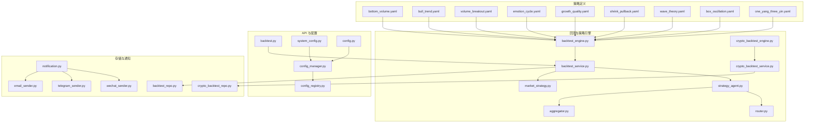

**图表来源** 
- [strategies/bottom_volume.yaml](file://strategies/bottom_volume.yaml)
- [strategies/bull_trend.yaml](file://strategies/bull_trend.yaml)
- [strategies/volume_breakout.yaml](file://strategies/volume_breakout.yaml)
- [strategies/emotion_cycle.yaml](file://strategies/emotion_cycle.yaml)
- [strategies/growth_quality.yaml](file://strategies/growth_quality.yaml)
- [strategies/shrink_pullback.yaml](file://strategies/shrink_pullback.yaml)
- [strategies/wave_theory.yaml](file://strategies/wave_theory.yaml)
- [strategies/box_oscillation.yaml](file://strategies/box_oscillation.yaml)
- [strategies/one_yang_three_yin.yaml](file://strategies/one_yang_three_yin.yaml)
- [src/core/backtest_engine.py](file://src/core/backtest_engine.py)
- [src/core/crypto_backtest_engine.py](file://src/core/crypto_backtest_engine.py)
- [src/services/backtest_service.py](file://src/services/backtest_service.py)
- [src/services/crypto_backtest_service.py](file://src/services/crypto_backtest_service.py)
- [src/core/market_strategy.py](file://src/core/market_strategy.py)
- [src/agent/strategies/strategy_agent.py](file://src/agent/strategies/strategy_agent.py)
- [src/agent/strategies/aggregator.py](file://src/agent/strategies/aggregator.py)
- [src/agent/strategies/router.py](file://src/agent/strategies/router.py)
- [api/v1/endpoints/backtest.py](file://api/v1/endpoints/backtest.py)
- [api/v1/endpoints/system_config.py](file://api/v1/endpoints/system_config.py)
- [src/config.py](file://src/config.py)
- [src/core/config_manager.py](file://src/core/config_manager.py)
- [src/core/config_registry.py](file://src/core/config_registry.py)
- [src/repositories/backtest_repo.py](file://src/repositories/backtest_repo.py)
- [src/repositories/crypto_backtest_repo.py](file://src/repositories/crypto_backtest_repo.py)
- [src/notification.py](file://src/notification.py)
- [src/notification_sender/email_sender.py](file://src/notification_sender/email_sender.py)
- [src/notification_sender/telegram_sender.py](file://src/notification_sender/telegram_sender.py)
- [src/notification_sender/wechat_sender.py](file://src/notification_sender/wechat_sender.py)

**章节来源**
- [src/core/backtest_engine.py](file://src/core/backtest_engine.py)
- [src/services/backtest_service.py](file://src/services/backtest_service.py)
- [api/v1/endpoints/backtest.py](file://api/v1/endpoints/backtest.py)
- [api/v1/schemas/backtest.py](file://api/v1/schemas/backtest.py)

## 核心组件
- 策略定义（YAML）：以声明式方式描述技术指标、阈值与信号条件，便于复用与版本管理。
- 回测引擎：读取历史数据，按策略计算指标与信号，输出回测统计与交易明细。
- 策略编排：通过策略代理、聚合器与路由器组合多策略，形成复合决策。
- 配置管理：集中管理系统与环境变量，支持动态更新与校验。
- 通知与监控：多渠道发送执行与风控告警，支撑实盘运行。

**章节来源**
- [src/core/backtest_engine.py](file://src/core/backtest_engine.py)
- [src/core/market_strategy.py](file://src/core/market_strategy.py)
- [src/agent/strategies/strategy_agent.py](file://src/agent/strategies/strategy_agent.py)
- [src/agent/strategies/aggregator.py](file://src/agent/strategies/aggregator.py)
- [src/agent/strategies/router.py](file://src/agent/strategies/router.py)
- [src/config.py](file://src/config.py)
- [src/core/config_manager.py](file://src/core/config_manager.py)
- [src/core/config_registry.py](file://src/core/config_registry.py)

## 架构总览
下图展示了从策略定义到回测执行、结果存储与通知的端到端流程。

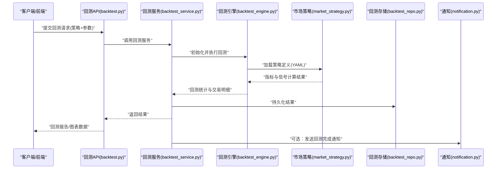

**图表来源** 
- [api/v1/endpoints/backtest.py](file://api/v1/endpoints/backtest.py)
- [src/services/backtest_service.py](file://src/services/backtest_service.py)
- [src/core/backtest_engine.py](file://src/core/backtest_engine.py)
- [src/core/market_strategy.py](file://src/core/market_strategy.py)
- [src/repositories/backtest_repo.py](file://src/repositories/backtest_repo.py)
- [src/notification.py](file://src/notification.py)

## 详细组件分析

### 趋势跟踪策略示例（均线突破 + 波动率过滤）
- 策略要点：使用短期与长期均线交叉作为入场信号，结合ATR或布林带宽度进行波动率过滤；出场可采用反向信号或固定止损止盈。
- 关键参数：短期均线周期、长期均线周期、ATR倍数、止损比例、止盈比例、仓位权重。
- 回测关注：胜率、盈亏比、最大回撤、夏普比率、交易频率。
- 风险配置：单票最大仓位、整体回撤阈值、日内最大亏损限制。

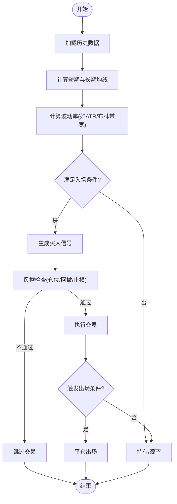

**图表来源** 
- [src/core/backtest_engine.py](file://src/core/backtest_engine.py)
- [src/core/market_strategy.py](file://src/core/market_strategy.py)
- [src/services/backtest_service.py](file://src/services/backtest_service.py)

**章节来源**
- [strategies/bull_trend.yaml](file://strategies/bull_trend.yaml)
- [src/core/backtest_engine.py](file://src/core/backtest_engine.py)
- [src/core/market_strategy.py](file://src/core/market_strategy.py)

### 均值回归策略示例（通道震荡 + 超买超卖）
- 策略要点：基于价格通道（如布林带上下轨）或RSI/KDJ等超买超卖指标，在偏离均值过大时反向入场，回归均值时出场。
- 关键参数：通道宽度、RSI阈值、KDJ阈值、回归目标位、滑点与手续费。
- 回测关注：胜率、平均持仓时间、换手率、区间收益稳定性。
- 风险配置：极端行情熔断、连续亏损次数上限、波动率异常检测。

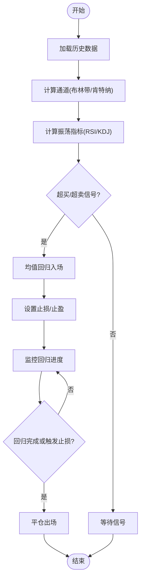

**图表来源** 
- [src/core/backtest_engine.py](file://src/core/backtest_engine.py)
- [src/core/market_strategy.py](file://src/core/market_strategy.py)

**章节来源**
- [strategies/box_oscillation.yaml](file://strategies/box_oscillation.yaml)
- [src/core/backtest_engine.py](file://src/core/backtest_engine.py)
- [src/core/market_strategy.py](file://src/core/market_strategy.py)

### 动量策略示例（放量突破 + 趋势确认）
- 策略要点：价格突破近期高点且伴随成交量放大，叠加趋势指标（如MACD、ADX）确认动量方向。
- 关键参数：突破窗口、成交量倍数、MACD参数、ADX阈值、移动止损。
- 回测关注：趋势段捕获率、假突破率、回撤控制、资金利用率。
- 风险配置：突破失败止损、趋势转弱出场、流动性不足过滤。

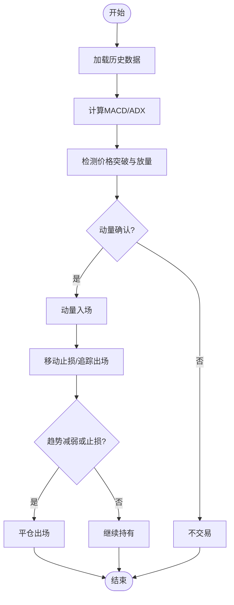

**图表来源** 
- [src/core/backtest_engine.py](file://src/core/backtest_engine.py)
- [src/core/market_strategy.py](file://src/core/market_strategy.py)

**章节来源**
- [strategies/volume_breakout.yaml](file://strategies/volume_breakout.yaml)
- [src/core/backtest_engine.py](file://src/core/backtest_engine.py)
- [src/core/market_strategy.py](file://src/core/market_strategy.py)

### 情绪周期策略示例（情绪指标 + 反转信号）
- 策略要点：利用情绪指标（如涨跌家数、涨停跌停比、舆情热度）识别市场情绪极值，配合技术面反转信号入场。
- 关键参数：情绪阈值、反转确认指标、持仓周期、分批建仓比例。
- 回测关注：情绪拐点命中率、反转后收益分布、情绪衰减期表现。
- 风险配置：情绪持续极端时的对冲、事件驱动熔断。

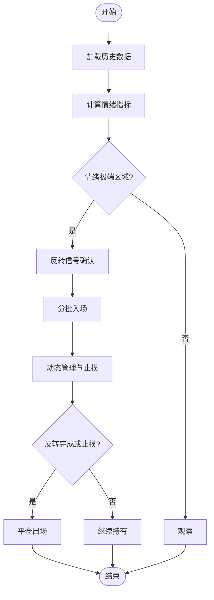

**图表来源** 
- [src/core/backtest_engine.py](file://src/core/backtest_engine.py)
- [src/core/market_strategy.py](file://src/core/market_strategy.py)

**章节来源**
- [strategies/emotion_cycle.yaml](file://strategies/emotion_cycle.yaml)
- [src/core/backtest_engine.py](file://src/core/backtest_engine.py)
- [src/core/market_strategy.py](file://src/core/market_strategy.py)

### 成长质量策略示例（基本面筛选 + 技术择时）
- 策略要点：先通过基本面指标（营收增长、ROE、现金流）筛选优质标的，再用技术面择时入场。
- 关键参数：基本面评分阈值、财务周期、技术入场条件、再平衡频率。
- 回测关注：选股有效性、择时增益、组合稳定性、因子暴露。
- 风险配置：基本面恶化剔除、行业集中度限制、估值过高减仓。

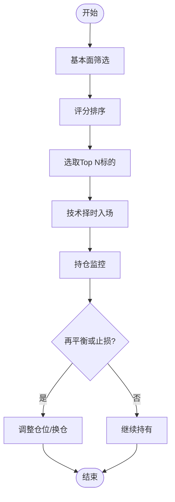

**图表来源** 
- [src/core/backtest_engine.py](file://src/core/backtest_engine.py)
- [src/core/market_strategy.py](file://src/core/market_strategy.py)

**章节来源**
- [strategies/growth_quality.yaml](file://strategies/growth_quality.yaml)
- [src/core/backtest_engine.py](file://src/core/backtest_engine.py)
- [src/core/market_strategy.py](file://src/core/market_strategy.py)

### 缩量回调策略示例（量价关系 + 支撑位）
- 策略要点：上涨趋势中缩量回调至支撑位（如前低、均线）企稳后入场，放量拉升时加仓。
- 关键参数：回调幅度、缩量比例、支撑类型、加仓条件。
- 回测关注：回调成功率、加仓收益贡献、止损效率。
- 风险配置：跌破支撑止损、量能异常处理。

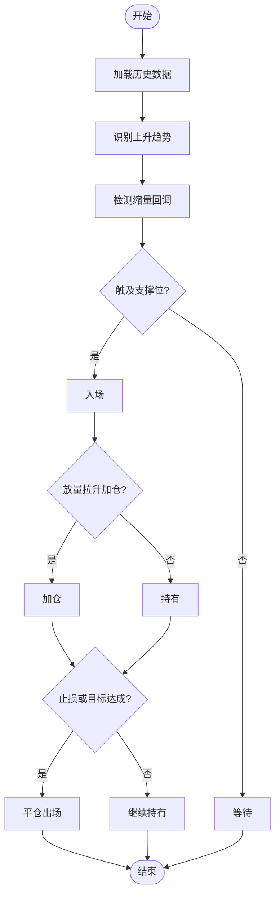

**图表来源** 
- [src/core/backtest_engine.py](file://src/core/backtest_engine.py)
- [src/core/market_strategy.py](file://src/core/market_strategy.py)

**章节来源**
- [strategies/shrink_pullback.yaml](file://strategies/shrink_pullback.yaml)
- [src/core/backtest_engine.py](file://src/core/backtest_engine.py)
- [src/core/market_strategy.py](file://src/core/market_strategy.py)

### 波浪理论策略示例（波段划分 + 目标位）
- 策略要点：依据波浪理论划分主升浪与调整浪，在浪底附近布局，目标位为前高或斐波那契扩展位。
- 关键参数：波浪识别规则、斐波那契比例、止损位置、波段过滤。
- 回测关注：波浪识别准确率、目标位命中率、波段收益分布。
- 风险配置：假突破止损、波浪修正保护。

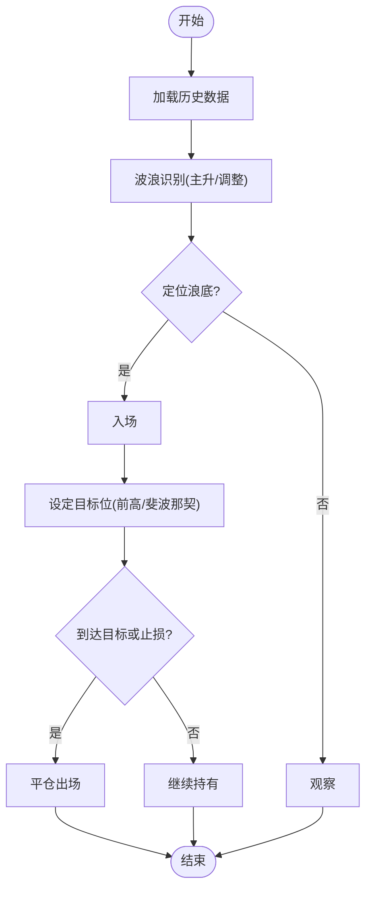

**图表来源** 
- [src/core/backtest_engine.py](file://src/core/backtest_engine.py)
- [src/core/market_strategy.py](file://src/core/market_strategy.py)

**章节来源**
- [strategies/wave_theory.yaml](file://strategies/wave_theory.yaml)
- [src/core/backtest_engine.py](file://src/core/backtest_engine.py)
- [src/core/market_strategy.py](file://src/core/market_strategy.py)

### 底部放量策略示例（量能异动 + 形态确认）
- 策略要点：价格在低位出现放量阳线或形态突破，结合均线拐头与指标共振确认。
- 关键参数：放量倍数、形态类型、均线周期、确认指标。
- 回测关注：底部信号有效性、突破后涨幅、假信号率。
- 风险配置：放量回落止损、形态失败退出。

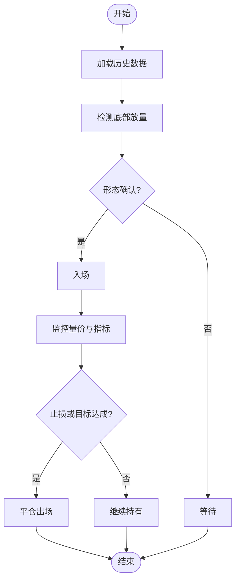

**图表来源** 
- [src/core/backtest_engine.py](file://src/core/backtest_engine.py)
- [src/core/market_strategy.py](file://src/core/market_strategy.py)

**章节来源**
- [strategies/bottom_volume.yaml](file://strategies/bottom_volume.yaml)
- [src/core/backtest_engine.py](file://src/core/backtest_engine.py)
- [src/core/market_strategy.py](file://src/core/market_strategy.py)

### 一阳三阴策略示例（K线组合 + 趋势过滤）
- 策略要点：出现“一阳三阴”组合后，结合趋势过滤（如均线方向）与成交量确认入场。
- 关键参数：K线组合规则、趋势过滤条件、成交量阈值、止损止盈。
- 回测关注：组合胜率、趋势一致性、止损效率。
- 风险配置：趋势反转退出、连续失败减仓。

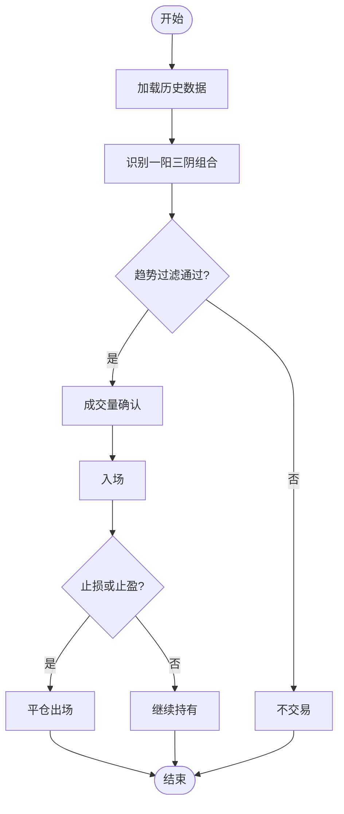

**图表来源** 
- [src/core/backtest_engine.py](file://src/core/backtest_engine.py)
- [src/core/market_strategy.py](file://src/core/market_strategy.py)

**章节来源**
- [strategies/one_yang_three_yin.yaml](file://strategies/one_yang_three_yin.yaml)
- [src/core/backtest_engine.py](file://src/core/backtest_engine.py)
- [src/core/market_strategy.py](file://src/core/market_strategy.py)

### 策略组合与路由
- 组合方式：通过策略代理与聚合器将多个策略信号合并，采用投票、加权或优先级规则生成最终决策。
- 路由机制：根据市场环境（趋势/震荡）选择适配的策略子集，提升鲁棒性。
- 参数调优：对组合权重、阈值与风控参数进行网格或贝叶斯优化，评估夏普与回撤。

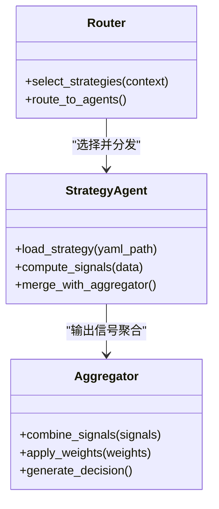

**图表来源** 
- [src/agent/strategies/strategy_agent.py](file://src/agent/strategies/strategy_agent.py)
- [src/agent/strategies/aggregator.py](file://src/agent/strategies/aggregator.py)
- [src/agent/strategies/router.py](file://src/agent/strategies/router.py)

**章节来源**
- [src/agent/strategies/strategy_agent.py](file://src/agent/strategies/strategy_agent.py)
- [src/agent/strategies/aggregator.py](file://src/agent/strategies/aggregator.py)
- [src/agent/strategies/router.py](file://src/agent/strategies/router.py)

### 回测结果分析与参数调优
- 结果字段：收益率曲线、最大回撤、胜率、盈亏比、交易次数、持仓时长分布。
- 调优方法：参数网格搜索、滚动窗口验证、Walk-Forward分析；避免过拟合需加入样本外测试。
- 可视化：收益图、回撤图、交易热力图、指标相关性矩阵。

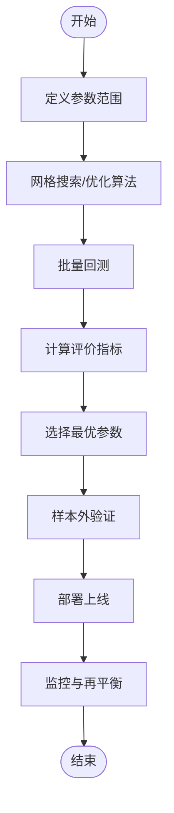

**图表来源** 
- [src/services/backtest_service.py](file://src/services/backtest_service.py)
- [src/core/backtest_engine.py](file://src/core/backtest_engine.py)
- [src/repositories/backtest_repo.py](file://src/repositories/backtest_repo.py)

**章节来源**
- [src/services/backtest_service.py](file://src/services/backtest_service.py)
- [src/core/backtest_engine.py](file://src/core/backtest_engine.py)
- [src/repositories/backtest_repo.py](file://src/repositories/backtest_repo.py)

### 实盘交易参数配置与执行监控
- 账户与通道：配置券商/交易所接入、订单类型、滑点容忍度、手续费模型。
- 风控参数：单笔最大下单量、日最大亏损、整体回撤熔断、流动性过滤。
- 执行监控：订单状态跟踪、成交回报、异常重试、延迟与吞吐量监控。
- 通知渠道：邮件、Telegram、微信等，用于关键事件告警。

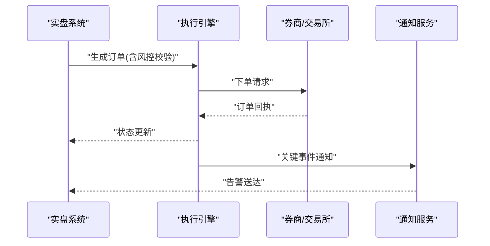

**图表来源** 
- [src/notification.py](file://src/notification.py)
- [src/notification_sender/email_sender.py](file://src/notification_sender/email_sender.py)
- [src/notification_sender/telegram_sender.py](file://src/notification_sender/telegram_sender.py)
- [src/notification_sender/wechat_sender.py](file://src/notification_sender/wechat_sender.py)

**章节来源**
- [src/notification.py](file://src/notification.py)
- [src/notification_sender/email_sender.py](file://src/notification_sender/email_sender.py)
- [src/notification_sender/telegram_sender.py](file://src/notification_sender/telegram_sender.py)
- [src/notification_sender/wechat_sender.py](file://src/notification_sender/wechat_sender.py)

## 依赖分析
- 策略定义与引擎：YAML策略文件被回测引擎加载，计算指标与信号。
- 服务层与API：回测服务封装引擎调用，API暴露接口供前端使用。
- 配置与注册：配置管理器与注册表统一管理策略与系统参数。
- 存储与通知：回测结果持久化，通知模块用于执行与风控告警。

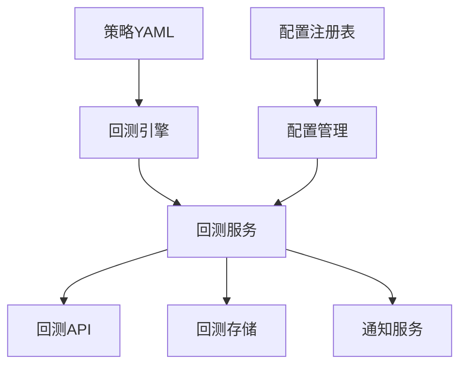

**图表来源** 
- [src/core/backtest_engine.py](file://src/core/backtest_engine.py)
- [src/services/backtest_service.py](file://src/services/backtest_service.py)
- [api/v1/endpoints/backtest.py](file://api/v1/endpoints/backtest.py)
- [src/repositories/backtest_repo.py](file://src/repositories/backtest_repo.py)
- [src/config.py](file://src/config.py)
- [src/core/config_manager.py](file://src/core/config_manager.py)
- [src/core/config_registry.py](file://src/core/config_registry.py)

**章节来源**
- [src/core/backtest_engine.py](file://src/core/backtest_engine.py)
- [src/services/backtest_service.py](file://src/services/backtest_service.py)
- [api/v1/endpoints/backtest.py](file://api/v1/endpoints/backtest.py)
- [src/repositories/backtest_repo.py](file://src/repositories/backtest_repo.py)
- [src/config.py](file://src/config.py)
- [src/core/config_manager.py](file://src/core/config_manager.py)
- [src/core/config_registry.py](file://src/core/config_registry.py)

## 性能考虑
- 数据加载与缓存：历史数据预取与缓存减少重复IO，提升回测速度。
- 并行计算：指标计算与多策略并行执行，充分利用CPU资源。
- 内存管理：大数组分块处理，避免内存峰值过高。
- I/O优化：批量写入回测结果，减少磁盘频繁访问。
- 网络与外部依赖：异步请求与超时重试，降低阻塞风险。

[本节为通用指导，无需特定文件引用]

## 故障排查指南
- 回测失败：检查策略YAML语法、参数合法性、数据源可用性。
- 信号异常：核对指标计算逻辑、阈值设置、数据对齐与缺失处理。
- 执行错误：确认订单参数、风控规则、通道连接与认证信息。
- 通知未达：检查通知渠道配置、权限与网络连通性。
- 性能瓶颈：定位慢查询与高内存占用，优化数据结构与并发策略。

**章节来源**
- [tests/test_backtest_engine.py](file://tests/test_backtest_engine.py)
- [tests/test_backtest_service.py](file://tests/test_backtest_service.py)
- [tests/test_market_strategy.py](file://tests/test_market_strategy.py)

## 结论
通过声明式策略定义与模块化回测引擎，本项目提供了灵活且可扩展的交易策略配置体系。结合参数调优、风险控制与多渠道通知，可覆盖从研究到实盘的完整流程。建议在实践中持续迭代策略与风控参数，并结合样本外验证与实时监控确保稳健性。

[本节为总结性内容，无需特定文件引用]

## 附录
- 常用策略模板：参考 strategies 目录下各YAML文件，按需修改参数与规则。
- 回测接口：通过 api/v1/endpoints/backtest.py 提供的接口发起回测与获取结果。
- 系统配置：通过 api/v1/endpoints/system_config.py 与 src/services/system_config_service.py 管理全局配置。

[本节为补充信息，无需特定文件引用]