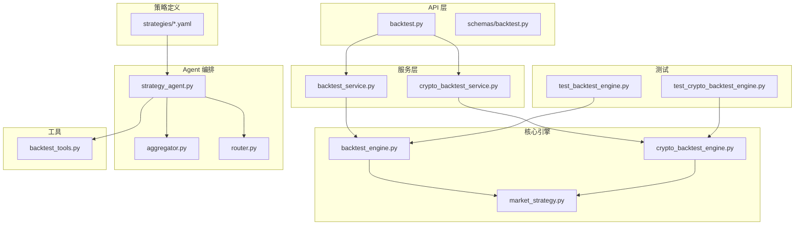
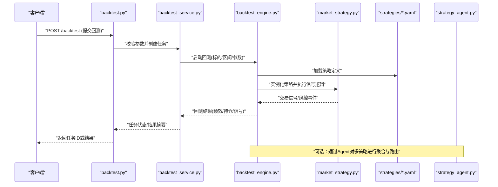
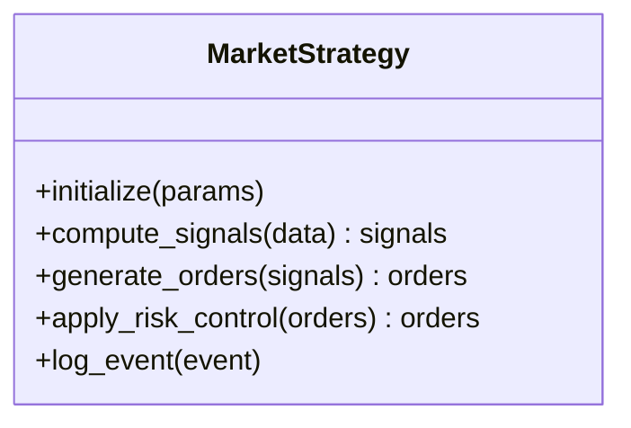
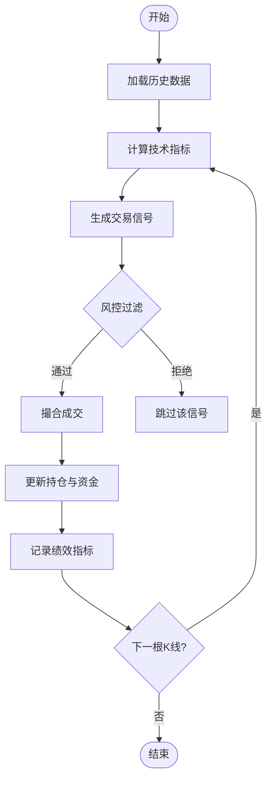
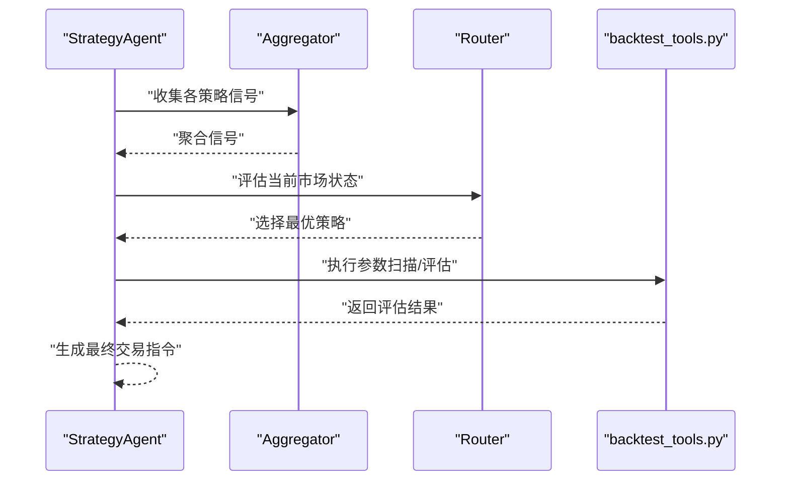
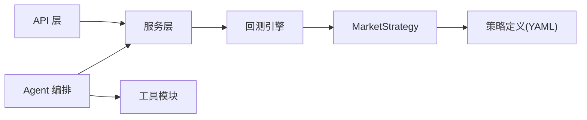

# 自定义策略开发

<cite>
**本文引用的文件**
- [src/core/backtest_engine.py](file://src/core/backtest_engine.py)
- [src/core/crypto_backtest_engine.py](file://src/core/crypto_backtest_engine.py)
- [src/core/market_strategy.py](file://src/core/market_strategy.py)
- [src/services/backtest_service.py](file://src/services/backtest_service.py)
- [src/services/crypto_backtest_service.py](file://src/services/crypto_backtest_service.py)
- [api/v1/endpoints/backtest.py](file://api/v1/endpoints/backtest.py)
- [api/v1/schemas/backtest.py](file://api/v1/schemas/backtest.py)
- [strategies/bull_trend.yaml](file://strategies/bull_trend.yaml)
- [strategies/volume_breakout.yaml](file://strategies/volume_breakout.yaml)
- [strategies/README.md](file://strategies/README.md)
- [src/agent/strategies/strategy_agent.py](file://src/agent/strategies/strategy_agent.py)
- [src/agent/strategies/aggregator.py](file://src/agent/strategies/aggregator.py)
- [src/agent/strategies/router.py](file://src/agent/strategies/router.py)
- [src/agent/tools/backtest_tools.py](file://src/agent/tools/backtest_tools.py)
- [tests/test_backtest_engine.py](file://tests/test_backtest_engine.py)
- [tests/test_crypto_backtest_engine.py](file://tests/test_crypto_backtest_engine.py)
</cite>

## 目录
1. [简介](#简介)
2. [项目结构](#项目结构)
3. [核心组件](#核心组件)
4. [架构总览](#架构总览)
5. [详细组件分析](#详细组件分析)
6. [依赖关系分析](#依赖关系分析)
7. [性能考虑](#性能考虑)
8. [故障排查指南](#故障排查指南)
9. [结论](#结论)
10. [附录](#附录)

## 简介
本指南面向希望在该项目中开发“自定义交易策略”的工程师与量化研究者，系统讲解：
- 策略类的继承结构与扩展点
- 技术指标调用方法与数据接入方式
- 回测引擎接口使用与参数配置
- 从简单到复杂策略的开发流程与最佳实践
- 策略测试、参数优化、性能调优的完整示例
- 策略组合与动态切换的实现方法

本项目提供股票与加密货币两类回测引擎，以及基于 YAML 的策略定义与 Agent 驱动的策略编排能力。通过统一的服务层与 API 层，用户可快速完成策略开发、回测验证与在线运行。

## 项目结构
围绕策略开发与回测的核心目录与文件如下：
- 回测引擎：src/core/backtest_engine.py、src/core/crypto_backtest_engine.py
- 市场策略抽象：src/core/market_strategy.py
- 服务层：src/services/backtest_service.py、src/services/crypto_backtest_service.py
- API 层：api/v1/endpoints/backtest.py、api/v1/schemas/backtest.py
- 策略定义（YAML）：strategies/*.yaml
- Agent 策略编排：src/agent/strategies/*
- 工具与集成：src/agent/tools/backtest_tools.py
- 测试用例：tests/test_backtest_engine.py、tests/test_crypto_backtest_engine.py

图表来源
- [api/v1/endpoints/backtest.py](file://api/v1/endpoints/backtest.py)
- [api/v1/schemas/backtest.py](file://api/v1/schemas/backtest.py)
- [src/services/backtest_service.py](file://src/services/backtest_service.py)
- [src/services/crypto_backtest_service.py](file://src/services/crypto_backtest_service.py)
- [src/core/backtest_engine.py](file://src/core/backtest_engine.py)
- [src/core/crypto_backtest_engine.py](file://src/core/crypto_backtest_engine.py)
- [src/core/market_strategy.py](file://src/core/market_strategy.py)
- [strategies/bull_trend.yaml](file://strategies/bull_trend.yaml)
- [strategies/volume_breakout.yaml](file://strategies/volume_breakout.yaml)
- [src/agent/strategies/strategy_agent.py](file://src/agent/strategies/strategy_agent.py)
- [src/agent/strategies/aggregator.py](file://src/agent/strategies/aggregator.py)
- [src/agent/strategies/router.py](file://src/agent/strategies/router.py)
- [src/agent/tools/backtest_tools.py](file://src/agent/tools/backtest_tools.py)
- [tests/test_backtest_engine.py](file://tests/test_backtest_engine.py)
- [tests/test_crypto_backtest_engine.py](file://tests/test_crypto_backtest_engine.py)

章节来源
- [strategies/README.md](file://strategies/README.md)

## 核心组件
- 市场策略抽象（MarketStrategy）
  - 定义策略生命周期钩子与统一接口，便于在股票与加密回测引擎中复用。
  - 关键职责：初始化参数、计算信号、生成交易指令、风险控制与日志记录。
- 股票回测引擎（BacktestEngine）
  - 负责历史数据加载、指标计算、信号触发、成交模拟与绩效统计。
- 加密货币回测引擎（CryptoBacktestEngine）
  - 针对加密资产特性（如 24x7 交易、不同时间粒度）进行适配。
- 服务层（BacktestService / CryptoBacktestService）
  - 封装引擎调用、参数校验、任务调度与结果持久化。
- API 层（/backtest）
  - 暴露 RESTful 接口，支持提交回测任务、查询状态与获取结果。
- 策略定义（YAML）
  - 以声明式方式描述策略参数、指标阈值与风控规则，便于版本管理与热更新。
- Agent 策略编排（StrategyAgent + Aggregator + Router）
  - 将多个策略聚合、路由与动态切换，实现策略组合与自适应选择。

章节来源
- [src/core/market_strategy.py](file://src/core/market_strategy.py)
- [src/core/backtest_engine.py](file://src/core/backtest_engine.py)
- [src/core/crypto_backtest_engine.py](file://src/core/crypto_backtest_engine.py)
- [src/services/backtest_service.py](file://src/services/backtest_service.py)
- [src/services/crypto_backtest_service.py](file://src/services/crypto_backtest_service.py)
- [api/v1/endpoints/backtest.py](file://api/v1/endpoints/backtest.py)
- [api/v1/schemas/backtest.py](file://api/v1/schemas/backtest.py)
- [strategies/bull_trend.yaml](file://strategies/bull_trend.yaml)
- [strategies/volume_breakout.yaml](file://strategies/volume_breakout.yaml)
- [src/agent/strategies/strategy_agent.py](file://src/agent/strategies/strategy_agent.py)
- [src/agent/strategies/aggregator.py](file://src/agent/strategies/aggregator.py)
- [src/agent/strategies/router.py](file://src/agent/strategies/router.py)

## 架构总览
下图展示了从 API 请求到回测执行与结果返回的整体流程，并体现策略定义与 Agent 编排的集成点。

图表来源
- [api/v1/endpoints/backtest.py](file://api/v1/endpoints/backtest.py)
- [src/services/backtest_service.py](file://src/services/backtest_service.py)
- [src/core/backtest_engine.py](file://src/core/backtest_engine.py)
- [src/core/market_strategy.py](file://src/core/market_strategy.py)
- [strategies/bull_trend.yaml](file://strategies/bull_trend.yaml)
- [src/agent/strategies/strategy_agent.py](file://src/agent/strategies/strategy_agent.py)

## 详细组件分析

### 市场策略抽象（MarketStrategy）
- 设计要点
  - 统一的策略基类，定义初始化、信号计算、交易生成、风险过滤等钩子。
  - 为股票与加密引擎提供一致的扩展点，降低重复实现成本。
- 扩展建议
  - 新增策略时继承 MarketStrategy，仅实现必要钩子；参数通过 YAML 注入。
  - 将指标计算封装为独立函数或工具模块，保持策略逻辑清晰。
- 典型流程
  - 初始化：读取参数、准备数据窗口
  - 信号计算：基于技术指标与条件判断产生买入/卖出信号
  - 风控过滤：止损、仓位限制、波动率过滤
  - 输出：标准化交易指令供引擎执行

图表来源
- [src/core/market_strategy.py](file://src/core/market_strategy.py)

章节来源
- [src/core/market_strategy.py](file://src/core/market_strategy.py)

### 股票回测引擎（BacktestEngine）
- 功能范围
  - 历史数据加载与对齐、技术指标计算、信号触发、成交撮合、资金与持仓管理、绩效统计。
- 关键接口
  - 启动回测：传入标的代码、时间区间、策略参数
  - 事件回调：信号、成交、风控事件
  - 结果导出：净值曲线、交易明细、指标统计
- 性能要点
  - 向量化指标计算、批处理订单、内存池复用
  - 避免频繁 IO，采用缓存与增量更新

图表来源
- [src/core/backtest_engine.py](file://src/core/backtest_engine.py)

章节来源
- [src/core/backtest_engine.py](file://src/core/backtest_engine.py)
- [tests/test_backtest_engine.py](file://tests/test_backtest_engine.py)

### 加密货币回测引擎（CryptoBacktestEngine）
- 差异点
  - 支持 24x7 交易、分钟级高频数据、滑点与手续费模型更贴近加密市场。
- 适配策略
  - 时间戳对齐、跨交易所数据源兼容、流动性与深度估算。
- 与股票引擎的关系
  - 共享 MarketStrategy 抽象，差异化体现在数据与撮合细节。

章节来源
- [src/core/crypto_backtest_engine.py](file://src/core/crypto_backtest_engine.py)
- [tests/test_crypto_backtest_engine.py](file://tests/test_crypto_backtest_engine.py)

### 服务层（BacktestService / CryptoBacktestService）
- 职责
  - 参数校验、任务队列管理、异步执行、结果持久化与查询。
- 集成点
  - 对接 API 层与引擎层，屏蔽底层实现差异。
- 可扩展性
  - 支持并发回测、任务优先级、失败重试与监控告警。

章节来源
- [src/services/backtest_service.py](file://src/services/backtest_service.py)
- [src/services/crypto_backtest_service.py](file://src/services/crypto_backtest_service.py)

### API 层（/backtest）
- 端点说明
  - 提交回测任务、查询任务状态、获取结果详情。
- 请求/响应
  - 使用 Pydantic Schema 进行严格校验，确保输入安全与一致性。
- 错误处理
  - 统一错误码与消息，便于前端展示与调试。

章节来源
- [api/v1/endpoints/backtest.py](file://api/v1/endpoints/backtest.py)
- [api/v1/schemas/backtest.py](file://api/v1/schemas/backtest.py)

### 策略定义（YAML）
- 作用
  - 声明式配置策略参数、指标阈值、风控规则与执行偏好。
- 优势
  - 无需修改代码即可调整策略行为，便于 A/B 测试与版本管理。
- 示例策略
  - bull_trend.yaml：趋势跟踪策略
  - volume_breakout.yaml：放量突破策略

章节来源
- [strategies/bull_trend.yaml](file://strategies/bull_trend.yaml)
- [strategies/volume_breakout.yaml](file://strategies/volume_breakout.yaml)
- [strategies/README.md](file://strategies/README.md)

### Agent 策略编排（StrategyAgent + Aggregator + Router）
- 策略聚合（Aggregator）
  - 合并多个策略的信号，按权重或投票机制生成最终决策。
- 策略路由（Router）
  - 根据市场状态或绩效表现动态切换策略，提升鲁棒性。
- 工具集成（backtest_tools）
  - 提供回测工具函数，辅助 Agent 进行参数扫描与评估。

图表来源
- [src/agent/strategies/strategy_agent.py](file://src/agent/strategies/strategy_agent.py)
- [src/agent/strategies/aggregator.py](file://src/agent/strategies/aggregator.py)
- [src/agent/strategies/router.py](file://src/agent/strategies/router.py)
- [src/agent/tools/backtest_tools.py](file://src/agent/tools/backtest_tools.py)

章节来源
- [src/agent/strategies/strategy_agent.py](file://src/agent/strategies/strategy_agent.py)
- [src/agent/strategies/aggregator.py](file://src/agent/strategies/aggregator.py)
- [src/agent/strategies/router.py](file://src/agent/strategies/router.py)
- [src/agent/tools/backtest_tools.py](file://src/agent/tools/backtest_tools.py)

## 依赖关系分析
- 低耦合高内聚
  - MarketStrategy 作为抽象层，隔离股票与加密引擎的差异。
  - 服务层屏蔽引擎实现，API 层仅依赖服务接口。
- 外部依赖
  - 数据源适配器（data_provider）用于历史与实时数据获取。
  - 存储与持久化（repositories/storage）用于结果归档。
- 潜在循环依赖
  - 通过分层与接口解耦避免循环引用；必要时引入事件总线或消息队列。

图表来源
- [api/v1/endpoints/backtest.py](file://api/v1/endpoints/backtest.py)
- [src/services/backtest_service.py](file://src/services/backtest_service.py)
- [src/core/backtest_engine.py](file://src/core/backtest_engine.py)
- [src/core/market_strategy.py](file://src/core/market_strategy.py)
- [strategies/bull_trend.yaml](file://strategies/bull_trend.yaml)
- [src/agent/strategies/strategy_agent.py](file://src/agent/strategies/strategy_agent.py)
- [src/agent/tools/backtest_tools.py](file://src/agent/tools/backtest_tools.py)

章节来源
- [src/core/backtest_engine.py](file://src/core/backtest_engine.py)
- [src/core/crypto_backtest_engine.py](file://src/core/crypto_backtest_engine.py)
- [src/services/backtest_service.py](file://src/services/backtest_service.py)
- [src/services/crypto_backtest_service.py](file://src/services/crypto_backtest_service.py)
- [api/v1/endpoints/backtest.py](file://api/v1/endpoints/backtest.py)

## 性能考虑
- 数据与指标计算
  - 优先使用向量化计算，减少 Python 循环开销。
  - 对常用指标建立缓存，避免重复计算。
- 订单与撮合
  - 批量处理订单，减少锁竞争与对象创建。
  - 合理设置滑点与手续费模型，平衡精度与速度。
- 并发与资源
  - 服务层支持并发回测，注意线程/进程隔离与资源上限。
  - 使用连接池与异步 IO 提升吞吐。
- 内存管理
  - 控制数据窗口大小，及时释放中间变量。
  - 流式处理长序列数据，避免一次性加载。

[本节为通用指导，不直接分析具体文件]

## 故障排查指南
- 常见问题
  - 参数校验失败：检查 API Schema 与 YAML 字段类型及取值范围。
  - 数据缺失或对齐异常：确认数据源可用性与时间戳格式。
  - 信号未触发：核对指标阈值与风控规则是否过于严格。
  - 回测结果异常：检查成交模型、滑点与手续费设置。
- 调试建议
  - 启用详细日志，定位信号与订单生成环节。
  - 使用最小数据集复现问题，逐步扩大范围。
  - 借助测试用例对比预期与真实输出。

章节来源
- [api/v1/schemas/backtest.py](file://api/v1/schemas/backtest.py)
- [tests/test_backtest_engine.py](file://tests/test_backtest_engine.py)
- [tests/test_crypto_backtest_engine.py](file://tests/test_crypto_backtest_engine.py)

## 结论
通过统一的策略抽象、双引擎支持与 YAML 声明式配置，本项目为自定义策略开发提供了高效、可扩展的基础设施。结合 Agent 编排与工具链，可实现从简单策略到复杂组合策略的快速迭代与稳健运行。建议在开发过程中遵循分层解耦、参数外置、测试先行与性能优化的最佳实践。

[本节为总结性内容，不直接分析具体文件]

## 附录
- 开发流程建议
  - 明确策略逻辑与风控规则
  - 编写 MarketStrategy 子类与单元测试
  - 用 YAML 配置参数并进行小规模回测
  - 通过 API 提交任务并观察结果
  - 使用 Agent 进行策略聚合与动态切换
  - 持续优化指标计算与撮合模型
- 参考文件路径
  - 策略定义：strategies/*.yaml
  - 引擎实现：src/core/backtest_engine.py、src/core/crypto_backtest_engine.py
  - 服务与 API：src/services/backtest_service.py、api/v1/endpoints/backtest.py
  - Agent 编排：src/agent/strategies/*、src/agent/tools/backtest_tools.py

[本节为补充信息，不直接分析具体文件]