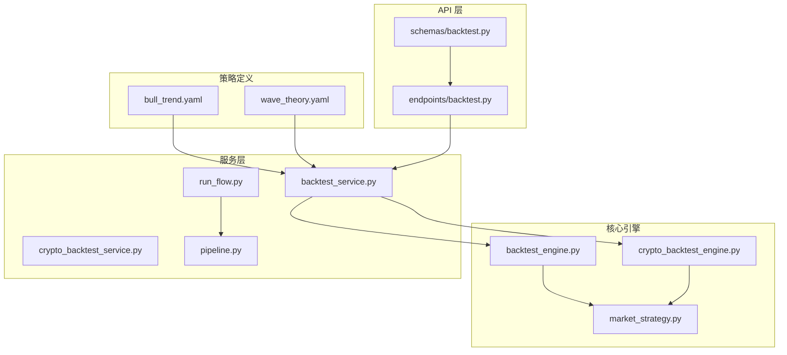
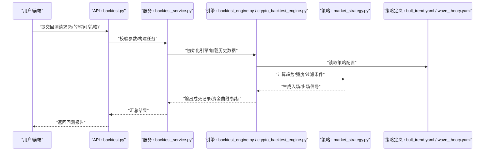
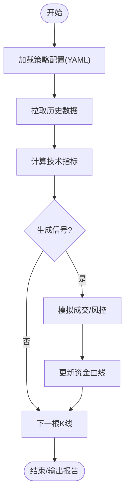
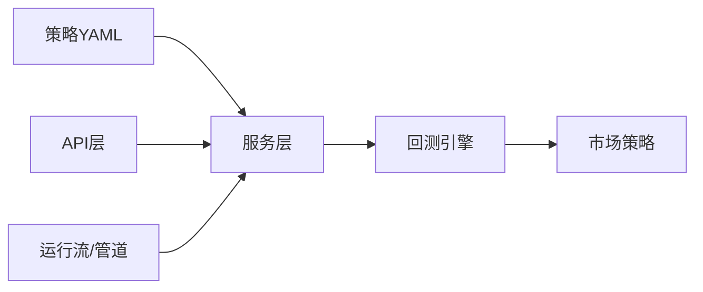

# 趋势跟踪策略

<cite>
**本文引用的文件**   
- [bull_trend.yaml](file://strategies/bull_trend.yaml)
- [wave_theory.yaml](file://strategies/wave_theory.yaml)
- [backtest_engine.py](file://src/core/backtest_engine.py)
- [crypto_backtest_engine.py](file://src/core/crypto_backtest_engine.py)
- [market_strategy.py](file://src/core/market_strategy.py)
- [backtest_service.py](file://src/services/backtest_service.py)
- [crypto_backtest_service.py](file://src/services/crypto_backtest_service.py)
- [backtest.py](file://api/v1/endpoints/backtest.py)
- [backtest.py](file://api/v1/schemas/backtest.py)
- [run_flow.py](file://src/services/run_flow.py)
- [pipeline.py](file://src/core/pipeline.py)
</cite>

## 目录
1. [简介](#简介)
2. [项目结构](#项目结构)
3. [核心组件](#核心组件)
4. [架构总览](#架构总览)
5. [详细组件分析](#详细组件分析)
6. [依赖关系分析](#依赖关系分析)
7. [性能考虑](#性能考虑)
8. [故障排查指南](#故障排查指南)
9. [结论](#结论)
10. [附录：趋势策略配置示例与调优](#附录趋势策略配置示例与调优)

## 简介
本文件面向“趋势跟踪策略”的配置与实践，覆盖牛市趋势、波浪理论等经典趋势策略的完整配置说明。重点解释趋势识别参数、入场出场条件、止损止盈设置，并提供不同市场环境下的参数调优方法与回测结果分析方法。同时给出趋势强度指标与过滤条件的配置示例，帮助读者快速搭建可回测、可复用的趋势策略工作流。

## 项目结构
本项目将策略定义以 YAML 形式存放在 strategies 目录，由后端引擎加载并执行回测；API 层提供回测接口，服务层编排数据、指标计算与交易逻辑，核心引擎负责信号生成与绩效统计。

图表来源 
- [bull_trend.yaml](file://strategies/bull_trend.yaml)
- [wave_theory.yaml](file://strategies/wave_theory.yaml)
- [backtest_engine.py](file://src/core/backtest_engine.py)
- [crypto_backtest_engine.py](file://src/core/crypto_backtest_engine.py)
- [market_strategy.py](file://src/core/market_strategy.py)
- [backtest_service.py](file://src/services/backtest_service.py)
- [crypto_backtest_service.py](file://src/services/crypto_backtest_service.py)
- [backtest.py](file://api/v1/endpoints/backtest.py)
- [backtest.py](file://api/v1/schemas/backtest.py)
- [run_flow.py](file://src/services/run_flow.py)
- [pipeline.py](file://src/core/pipeline.py)

章节来源
- [backtest_engine.py](file://src/core/backtest_engine.py)
- [crypto_backtest_engine.py](file://src/core/crypto_backtest_engine.py)
- [market_strategy.py](file://src/core/market_strategy.py)
- [backtest_service.py](file://src/services/backtest_service.py)
- [crypto_backtest_service.py](file://src/services/crypto_backtest_service.py)
- [backtest.py](file://api/v1/endpoints/backtest.py)
- [backtest.py](file://api/v1/schemas/backtest.py)
- [run_flow.py](file://src/services/run_flow.py)
- [pipeline.py](file://src/core/pipeline.py)

## 核心组件
- 策略定义（YAML）：集中描述趋势识别、入场出场、止损止盈、仓位管理、过滤条件等。
- 回测引擎：解析策略、计算指标、生成信号、模拟成交与资金曲线。
- 市场策略模块：封装趋势判断、强度评估与多周期共振逻辑。
- 服务层：编排数据获取、指标计算、策略执行与结果持久化。
- API 层：暴露回测任务创建、查询与结果下载接口。

章节来源
- [backtest_engine.py](file://src/core/backtest_engine.py)
- [crypto_backtest_engine.py](file://src/core/crypto_backtest_engine.py)
- [market_strategy.py](file://src/core/market_strategy.py)
- [backtest_service.py](file://src/services/backtest_service.py)
- [crypto_backtest_service.py](file://src/services/crypto_backtest_service.py)
- [backtest.py](file://api/v1/endpoints/backtest.py)
- [backtest.py](file://api/v1/schemas/backtest.py)

## 架构总览
下图展示从 API 请求到策略执行与结果返回的整体流程，强调趋势策略在回测中的关键路径。

图表来源 
- [backtest.py](file://api/v1/endpoints/backtest.py)
- [backtest_service.py](file://src/services/backtest_service.py)
- [backtest_engine.py](file://src/core/backtest_engine.py)
- [crypto_backtest_engine.py](file://src/core/crypto_backtest_engine.py)
- [market_strategy.py](file://src/core/market_strategy.py)
- [bull_trend.yaml](file://strategies/bull_trend.yaml)
- [wave_theory.yaml](file://strategies/wave_theory.yaml)

## 详细组件分析

### 牛市趋势策略（bull_trend.yaml）
- 趋势识别
  - 多周期均线系统：短中长期均线排列用于判定多头趋势。
  - 趋势强度：结合动量与波动率指标（如 RSI、MACD、ATR）量化趋势强度。
  - 过滤条件：成交量放大、突破形态、宏观/板块共振。
- 入场条件
  - 价格突破关键阻力或均线金叉确认。
  - 强度阈值满足（例如 RSI 区间、MACD 柱状图转正）。
  - 过滤通过（量能、波动率、相关性）。
- 出场条件
  - 趋势破坏（长周期均线死叉、跌破支撑）。
  - 强度回落至阈值以下。
  - 触发止损/止盈。
- 止损止盈
  - 固定比例止损、ATR 倍数止损、移动止损（追踪止损）。
  - 分批止盈（目标位与回撤保护）。
- 仓位管理
  - 基于风险预算与波动率调整头寸大小。
  - 最大持仓与单标的风险上限。

章节来源
- [bull_trend.yaml](file://strategies/bull_trend.yaml)
- [market_strategy.py](file://src/core/market_strategy.py)
- [backtest_engine.py](file://src/core/backtest_engine.py)

### 波浪理论策略（wave_theory.yaml）
- 趋势识别
  - 浪型结构：主升浪（第3浪）、回调浪（第2/4浪）、终结浪（第5浪）。
  - 斐波那契回撤/扩展：用于定位浪顶浪底与目标位。
  - 趋势强度：结合 MACD 背离、RSI 超买超卖、成交量分布。
- 入场条件
  - 第3浪启动确认（放量突破前高、MACD 加速）。
  - 第4浪回调结束（斐波那契 0.382/0.618 支撑企稳）。
- 出场条件
  - 第5浪衰竭（顶背离、量能萎缩）。
  - 结构破坏（跌破关键支撑或均线）。
- 止损止盈
  - 以浪形边界为参考设置止损（如第4浪低点下方）。
  - 目标位按斐波那契扩展（如 1.618/2.618）。
- 过滤条件
  - 多时间框架共振（日线+周线同向）。
  - 波动率环境（低波动时谨慎追涨）。

章节来源
- [wave_theory.yaml](file://strategies/wave_theory.yaml)
- [market_strategy.py](file://src/core/market_strategy.py)
- [backtest_engine.py](file://src/core/backtest_engine.py)

### 回测引擎与服务（engine/service）
- 回测引擎
  - 解析策略 YAML，加载历史数据，逐根 K 线计算指标与信号。
  - 模拟成交、滑点、手续费，生成资金曲线与交易明细。
- 加密资产回测引擎
  - 针对加密货币市场的特性（24x7、高波动）进行适配。
- 服务层
  - 编排数据源、指标计算、策略执行与结果存储。
  - 支持并行回测与任务队列。

图表来源 
- [backtest_engine.py](file://src/core/backtest_engine.py)
- [crypto_backtest_engine.py](file://src/core/crypto_backtest_engine.py)
- [backtest_service.py](file://src/services/backtest_service.py)

章节来源
- [backtest_engine.py](file://src/core/backtest_engine.py)
- [crypto_backtest_engine.py](file://src/core/crypto_backtest_engine.py)
- [backtest_service.py](file://src/services/backtest_service.py)

### API 与 Schema（API/Schemas）
- 端点
  - 创建回测任务、查询状态、获取结果。
- Schema
  - 定义请求/响应结构，包含策略名、标的、时间范围、参数等。

章节来源
- [backtest.py](file://api/v1/endpoints/backtest.py)
- [backtest.py](file://api/v1/schemas/backtest.py)

### 运行流与管道（RunFlow/Pipeline）
- RunFlow
  - 编排任务生命周期（调度、监控、日志）。
- Pipeline
  - 数据预处理、指标流水线、信号生成管线。

章节来源
- [run_flow.py](file://src/services/run_flow.py)
- [pipeline.py](file://src/core/pipeline.py)

## 依赖关系分析
- 策略 YAML 被服务层加载，传递给回测引擎。
- 引擎依赖市场策略模块进行趋势判断与强度评估。
- API 层依赖服务层完成业务编排。
- 管道与运行流贯穿数据与任务生命周期。

图表来源 
- [backtest_service.py](file://src/services/backtest_service.py)
- [backtest_engine.py](file://src/core/backtest_engine.py)
- [market_strategy.py](file://src/core/market_strategy.py)
- [run_flow.py](file://src/services/run_flow.py)
- [pipeline.py](file://src/core/pipeline.py)

章节来源
- [backtest_service.py](file://src/services/backtest_service.py)
- [backtest_engine.py](file://src/core/backtest_engine.py)
- [market_strategy.py](file://src/core/market_strategy.py)
- [run_flow.py](file://src/services/run_flow.py)
- [pipeline.py](file://src/core/pipeline.py)

## 性能考虑
- 指标计算优化：缓存常用指标、避免重复计算。
- 数据加载优化：按需拉取、增量更新。
- 并行回测：多标的/多参数网格并行。
- 内存管理：分块处理大序列，及时释放中间变量。
- 事件驱动：仅在信号变化时触发交易逻辑。

[本节为通用指导，不直接分析具体文件]

## 故障排查指南
- 常见错误
  - 策略 YAML 格式错误：检查键名与层级。
  - 数据缺失或时间戳异常：核对数据源与对齐。
  - 指标未收敛：检查窗口长度与初始值。
  - 信号震荡频繁：调整强度阈值与过滤条件。
- 调试建议
  - 开启详细日志，输出每根 K 线的指标与信号。
  - 使用最小数据集验证策略逻辑。
  - 逐步放宽/收紧参数观察稳定性。

章节来源
- [backtest_engine.py](file://src/core/backtest_engine.py)
- [backtest_service.py](file://src/services/backtest_service.py)

## 结论
通过 YAML 化的策略定义与模块化引擎，本项目能够灵活配置牛市趋势与波浪理论等经典趋势策略。借助趋势强度与过滤条件，可有效提升信号质量与稳健性。配合回测服务与 API，可实现端到端的策略开发与验证闭环。

[本节为总结性内容，不直接分析具体文件]

## 附录：趋势策略配置示例与调优

### 牛市趋势策略配置要点
- 趋势识别参数
  - 短期/中期/长期均线周期（如 5/20/60）。
  - 趋势强度阈值（RSI 区间、MACD 柱状图正负）。
- 入场条件
  - 价格突破 + 均线金叉 + 强度达标 + 量能放大。
- 出场条件
  - 长周期均线死叉 + 强度回落 + 跌破支撑。
- 止损止盈
  - ATR 倍数止损（如 1.5~2.5 倍）。
  - 移动止损（追踪止损步长）。
  - 分批止盈（目标位 1.0/1.618/2.618 扩展）。
- 过滤条件
  - 多周期共振（日线与周线同向）。
  - 波动率过滤（VIX/ATR 阈值）。
  - 相关性过滤（板块内龙头优先）。

章节来源
- [bull_trend.yaml](file://strategies/bull_trend.yaml)
- [market_strategy.py](file://src/core/market_strategy.py)

### 波浪理论策略配置要点
- 浪型识别
  - 主升浪（第3浪）启动确认：放量突破、MACD 加速。
  - 回调浪（第2/4浪）结束：斐波那契 0.382/0.618 支撑企稳。
- 入场条件
  - 第3浪启动或第4浪回调结束。
- 出场条件
  - 第5浪衰竭（顶背离、量能萎缩）。
  - 结构破坏（跌破关键支撑）。
- 止损止盈
  - 止损设在第4浪低点下方。
  - 目标位按斐波那契扩展（1.618/2.618）。
- 过滤条件
  - 多时间框架共振。
  - 波动率环境（低波动谨慎追涨）。

章节来源
- [wave_theory.yaml](file://strategies/wave_theory.yaml)
- [market_strategy.py](file://src/core/market_strategy.py)

### 不同市场环境下的参数调优方法
- 牛市环境
  - 缩短均线周期，提高趋势强度阈值，放宽止损。
  - 增加动量指标权重（MACD、RSI）。
- 震荡市
  - 延长均线周期，降低强度阈值，收紧止损。
  - 引入均值回归与布林带通道。
- 熊市环境
  - 反向信号为主，严格止损，减少仓位。
  - 强化过滤条件（量能、波动率、相关性）。
- 高波动环境
  - 使用 ATR 动态止损，降低杠杆。
  - 增加过滤条件（波动率上限）。

章节来源
- [backtest_engine.py](file://src/core/backtest_engine.py)
- [market_strategy.py](file://src/core/market_strategy.py)

### 回测结果分析与解读
- 关键指标
  - 年化收益率、最大回撤、夏普比率、胜率、盈亏比。
- 可视化
  - 资金曲线、交易明细、信号标注图。
- 稳健性检验
  - 参数敏感性分析（网格搜索）。
  - 样本外测试与滚动窗口回测。

章节来源
- [backtest_service.py](file://src/services/backtest_service.py)
- [backtest_engine.py](file://src/core/backtest_engine.py)

### 趋势强度指标与过滤条件配置示例
- 强度指标
  - RSI（14）：区间 50~70 作为多头强度。
  - MACD（12,26,9）：柱状图转正且放大。
  - ATR（14）：波动率适中（非极端）。
- 过滤条件
  - 成交量：高于过去 N 日均值。
  - 多周期共振：日线与周线同向。
  - 相关性：板块内龙头优先。

章节来源
- [bull_trend.yaml](file://strategies/bull_trend.yaml)
- [wave_theory.yaml](file://strategies/wave_theory.yaml)
- [market_strategy.py](file://src/core/market_strategy.py)