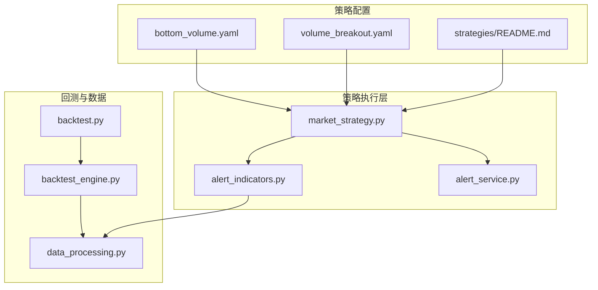
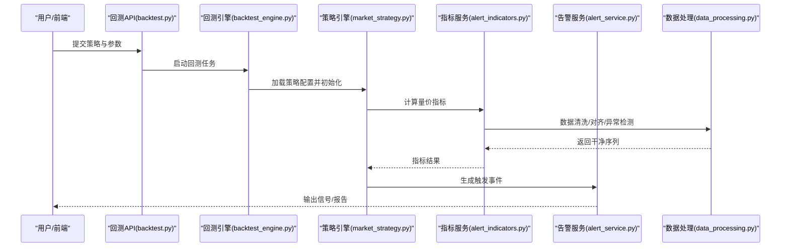
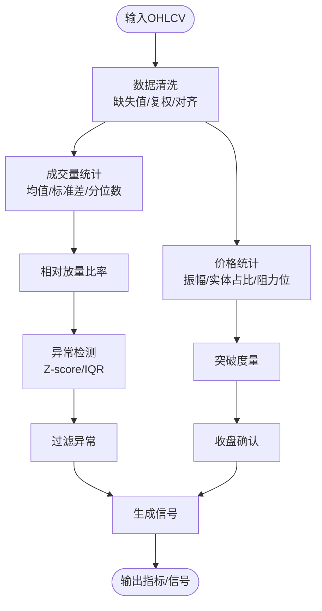
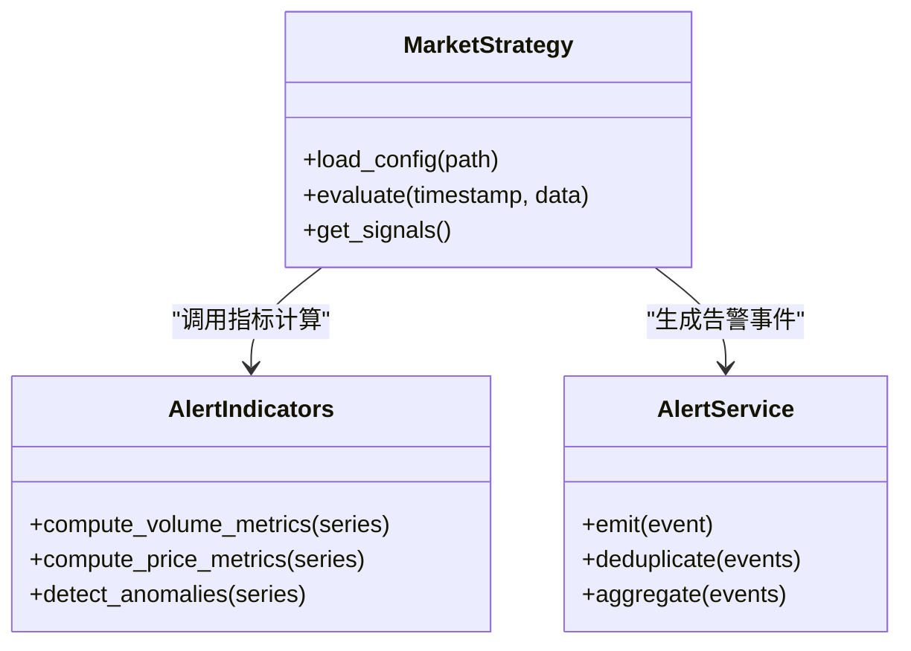
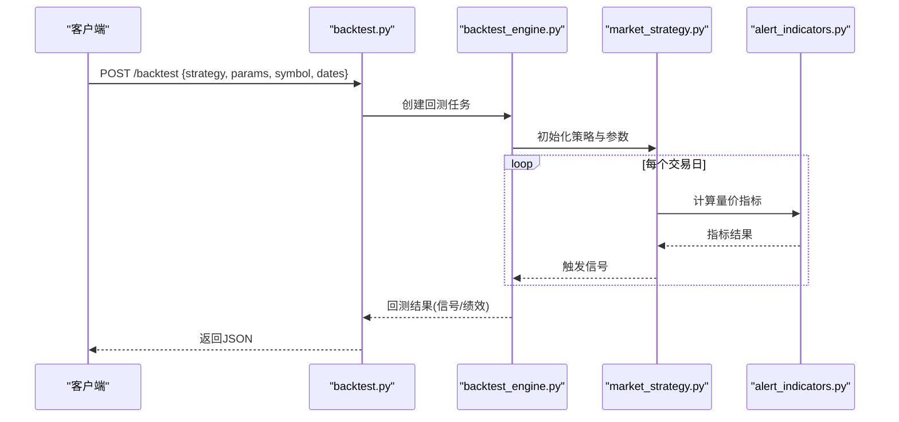
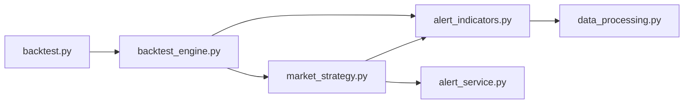

# 量价关系策略

<cite>
**本文引用的文件**   
- [strategies/bottom_volume.yaml](file://strategies/bottom_volume.yaml)
- [strategies/volume_breakout.yaml](file://strategies/volume_breakout.yaml)
- [strategies/README.md](file://strategies/README.md)
- [src/core/market_strategy.py](file://src/core/market_strategy.py)
- [src/services/alert_indicators.py](file://src/services/alert_indicators.py)
- [src/services/alert_service.py](file://src/services/alert_service.py)
- [api/v1/endpoints/backtest.py](file://api/v1/endpoints/backtest.py)
- [src/core/backtest_engine.py](file://src/core/backtest_engine.py)
- [src/utils/data_processing.py](file://src/utils/data_processing.py)
</cite>

## 目录
1. [简介](#简介)
2. [项目结构](#项目结构)
3. [核心组件](#核心组件)
4. [架构总览](#架构总览)
5. [详细组件分析](#详细组件分析)
6. [依赖分析](#依赖分析)
7. [性能考虑](#性能考虑)
8. [故障排查指南](#故障排查指南)
9. [结论](#结论)
10. [附录](#附录)

## 简介
本文件面向“基于量价关系的策略配置”，提供底部放量、放量突破等经典量价策略的完整配置示例与使用说明。内容涵盖：
- 成交量分析方法与指标选择
- 价格形态识别与突破确认条件
- 不同市场阶段的策略应用与参数调整
- 成交量异常检测与假突破过滤的配置方法
- 回测与实盘联动的关键路径

## 项目结构
与量价策略相关的代码与配置主要分布在以下位置：
- 策略定义：strategies/*.yaml（如 bottom_volume.yaml、volume_breakout.yaml）
- 策略引擎与服务：src/core/market_strategy.py、src/services/alert_indicators.py、src/services/alert_service.py
- 回测接口与引擎：api/v1/endpoints/backtest.py、src/core/backtest_engine.py
- 数据处理工具：src/utils/data_processing.py

图表来源
- [strategies/bottom_volume.yaml](file://strategies/bottom_volume.yaml)
- [strategies/volume_breakout.yaml](file://strategies/volume_breakout.yaml)
- [strategies/README.md](file://strategies/README.md)
- [src/core/market_strategy.py](file://src/core/market_strategy.py)
- [src/services/alert_indicators.py](file://src/services/alert_indicators.py)
- [src/services/alert_service.py](file://src/services/alert_service.py)
- [api/v1/endpoints/backtest.py](file://api/v1/endpoints/backtest.py)
- [src/core/backtest_engine.py](file://src/core/backtest_engine.py)
- [src/utils/data_processing.py](file://src/utils/data_processing.py)

章节来源
- [strategies/README.md](file://strategies/README.md)
- [src/core/market_strategy.py](file://src/core/market_strategy.py)
- [src/services/alert_indicators.py](file://src/services/alert_indicators.py)
- [src/services/alert_service.py](file://src/services/alert_service.py)
- [api/v1/endpoints/backtest.py](file://api/v1/endpoints/backtest.py)
- [src/core/backtest_engine.py](file://src/core/backtest_engine.py)
- [src/utils/data_processing.py](file://src/utils/data_processing.py)

## 核心组件
- 策略配置文件（YAML）
  - 底部放量：通过相对成交量的放大阈值、价格区间收敛度、时间窗口等参数，捕捉低位资金介入信号。
  - 放量突破：结合阻力位、波动率、成交量放大倍数与收盘确认，过滤震荡中的假突破。
- 策略引擎（market_strategy.py）
  - 负责加载策略配置、解析规则、调度指标计算与触发评估。
- 指标服务（alert_indicators.py）
  - 实现量价指标计算（如成交量均值/标准差、相对放量比率、价格形态度量、突破判定）。
- 告警服务（alert_service.py）
  - 将策略结果转化为可观测的告警事件，支持去抖、聚合与通知路由。
- 回测接口与引擎（backtest.py, backtest_engine.py）
  - 提供批量历史回放、参数扫描与绩效统计能力，支撑策略调优。
- 数据处理（data_processing.py）
  - 提供缺失值处理、异常值检测、标准化与对齐等基础能力。

章节来源
- [src/core/market_strategy.py](file://src/core/market_strategy.py)
- [src/services/alert_indicators.py](file://src/services/alert_indicators.py)
- [src/services/alert_service.py](file://src/services/alert_service.py)
- [api/v1/endpoints/backtest.py](file://api/v1/endpoints/backtest.py)
- [src/core/backtest_engine.py](file://src/core/backtest_engine.py)
- [src/utils/data_processing.py](file://src/utils/data_processing.py)

## 架构总览
量价策略从配置到执行的典型流程如下：

图表来源
- [api/v1/endpoints/backtest.py](file://api/v1/endpoints/backtest.py)
- [src/core/backtest_engine.py](file://src/core/backtest_engine.py)
- [src/core/market_strategy.py](file://src/core/market_strategy.py)
- [src/services/alert_indicators.py](file://src/services/alert_indicators.py)
- [src/services/alert_service.py](file://src/services/alert_service.py)
- [src/utils/data_processing.py](file://src/utils/data_processing.py)

## 详细组件分析

### 底部放量策略（bottom_volume.yaml）
- 适用场景
  - 长期下跌后的横盘筑底阶段，出现资金试探性建仓。
- 关键量价要素
  - 相对放量：当日成交量显著高于近期均值（如N日均量倍数）。
  - 价格收敛：振幅收窄、K线实体变小，显示抛压减弱。
  - 时间窗口：在底部区域持续观察，避免一次性脉冲误判。
- 推荐参数范围
  - 放量倍数：1.5~3.0（根据波动性与流动性调整）
  - 观察窗口：10~30个交易日
  - 价格收敛阈值：振幅或实体占比阈值
- 触发逻辑要点
  - 满足放量+收敛+时间窗口的复合条件，方可视为有效底部信号。
- 参数调整建议
  - 高波动标的提高放量倍数与观察窗口；低波动标的适当降低阈值以提升灵敏度。

章节来源
- [strategies/bottom_volume.yaml](file://strategies/bottom_volume.yaml)
- [src/services/alert_indicators.py](file://src/services/alert_indicators.py)
- [src/utils/data_processing.py](file://src/utils/data_processing.py)

### 放量突破策略（volume_breakout.yaml）
- 适用场景
  - 趋势形成初期或中继整理后向上突破，伴随资金推动。
- 关键量价要素
  - 阻力位：前高、密集成交区上沿、重要均线或通道上轨。
  - 放量确认：突破当日或次日成交量显著放大。
  - 收盘确认：收盘价站稳阻力位之上，避免盘中瞬时突破。
- 推荐参数范围
  - 突破幅度：0.5%~2%（视波动率而定）
  - 放量倍数：1.5~3.0
  - 确认周期：1~3个交易日
- 触发逻辑要点
  - 价格突破+放量+收盘确认三者同时满足，减少假突破概率。
- 参数调整建议
  - 震荡市放宽突破幅度、提高放量倍数；趋势市适度收紧以提前入场。

章节来源
- [strategies/volume_breakout.yaml](file://strategies/volume_breakout.yaml)
- [src/services/alert_indicators.py](file://src/services/alert_indicators.py)
- [src/utils/data_processing.py](file://src/utils/data_processing.py)

### 量价指标计算与异常检测（alert_indicators.py + data_processing.py）
- 指标计算
  - 成交量均值/标准差、相对放量比率、波动率估计、价格形态度量（如实体占比、上下影线长度）。
- 异常检测
  - 使用统计方法识别成交量极端值（如Z-score、IQR），过滤非正常交易日的干扰。
- 数据预处理
  - 缺失值插补、复权处理、频率对齐、滚动窗口计算。

图表来源
- [src/services/alert_indicators.py](file://src/services/alert_indicators.py)
- [src/utils/data_processing.py](file://src/utils/data_processing.py)

章节来源
- [src/services/alert_indicators.py](file://src/services/alert_indicators.py)
- [src/utils/data_processing.py](file://src/utils/data_processing.py)

### 策略引擎与告警（market_strategy.py + alert_service.py）
- 策略引擎
  - 读取YAML配置，构建规则树，按时间步迭代计算指标并评估触发条件。
- 告警服务
  - 对触发事件进行去抖、聚合、分类，并输出结构化信号供前端或外部系统消费。

图表来源
- [src/core/market_strategy.py](file://src/core/market_strategy.py)
- [src/services/alert_indicators.py](file://src/services/alert_indicators.py)
- [src/services/alert_service.py](file://src/services/alert_service.py)

章节来源
- [src/core/market_strategy.py](file://src/core/market_strategy.py)
- [src/services/alert_service.py](file://src/services/alert_service.py)

### 回测流程（backtest.py + backtest_engine.py）
- 回测接口
  - 接收策略名称、参数、标的与时间范围，提交回测任务。
- 回测引擎
  - 加载历史数据，逐日运行策略，记录信号与绩效指标（胜率、盈亏比、回撤等）。
- 参数扫描
  - 支持多组参数组合的回测对比，辅助寻找稳健参数区间。

图表来源
- [api/v1/endpoints/backtest.py](file://api/v1/endpoints/backtest.py)
- [src/core/backtest_engine.py](file://src/core/backtest_engine.py)
- [src/core/market_strategy.py](file://src/core/market_strategy.py)
- [src/services/alert_indicators.py](file://src/services/alert_indicators.py)

章节来源
- [api/v1/endpoints/backtest.py](file://api/v1/endpoints/backtest.py)
- [src/core/backtest_engine.py](file://src/core/backtest_engine.py)

## 依赖分析
- 模块耦合
  - market_strategy.py 依赖 alert_indicators.py 与 alert_service.py，形成“策略-指标-告警”的清晰分层。
  - backtest_engine.py 依赖 strategy 与 indicators，保证回测与实盘一致的逻辑。
- 外部依赖
  - 数据处理依赖 data_processing.py 提供的清洗与异常检测能力。
- 潜在风险
  - 指标计算复杂度随窗口增大而上升，需关注内存与CPU占用。
  - 异常检测阈值设置不当可能导致过多过滤或漏报。

图表来源
- [src/core/market_strategy.py](file://src/core/market_strategy.py)
- [src/services/alert_indicators.py](file://src/services/alert_indicators.py)
- [src/services/alert_service.py](file://src/services/alert_service.py)
- [src/core/backtest_engine.py](file://src/core/backtest_engine.py)
- [api/v1/endpoints/backtest.py](file://api/v1/endpoints/backtest.py)
- [src/utils/data_processing.py](file://src/utils/data_processing.py)

章节来源
- [src/core/market_strategy.py](file://src/core/market_strategy.py)
- [src/services/alert_indicators.py](file://src/services/alert_indicators.py)
- [src/services/alert_service.py](file://src/services/alert_service.py)
- [src/core/backtest_engine.py](file://src/core/backtest_engine.py)
- [api/v1/endpoints/backtest.py](file://api/v1/endpoints/backtest.py)
- [src/utils/data_processing.py](file://src/utils/data_processing.py)

## 性能考虑
- 指标计算优化
  - 使用滚动窗口与向量化计算，避免重复遍历。
  - 对长窗口指标采用增量更新或分段计算。
- 异常检测效率
  - 优先使用近似统计（滑动均值/方差）而非全量排序。
- 回测性能
  - 并行化标的级回测，限制并发数避免内存峰值。
  - 缓存中间指标结果，减少重复计算。

[本节为通用指导，不直接分析具体文件]

## 故障排查指南
- 常见问题
  - 信号过少：检查放量倍数与观察窗口是否过大；确认数据质量与复权是否正确。
  - 假突破频繁：提高收盘确认要求，增加阻力位强度度量；引入异常检测过滤。
  - 回测结果不稳定：缩小参数搜索空间，增加样本外验证；检查滑点与手续费设置。
- 定位步骤
  - 查看指标输出日志，确认成交量与价格形态指标是否符合预期。
  - 逐步放宽阈值，观察信号变化趋势。
  - 使用回测引擎的参数扫描功能，定位稳健参数区间。

章节来源
- [src/services/alert_indicators.py](file://src/services/alert_indicators.py)
- [src/services/alert_service.py](file://src/services/alert_service.py)
- [src/core/backtest_engine.py](file://src/core/backtest_engine.py)

## 结论
量价关系策略的核心在于“量先行、价确认”。通过合理的成交量分析与价格形态识别，配合严格的突破确认与异常检测，可以在不同市场阶段获得稳定的信号质量。建议在震荡市中侧重底部放量与假突破过滤，在趋势市中侧重放量突破与快速确认。利用回测引擎进行参数扫描与样本外验证，是提升策略稳健性的关键。

[本节为总结性内容，不直接分析具体文件]

## 附录
- 策略配置参考
  - 底部放量：strategies/bottom_volume.yaml
  - 放量突破：strategies/volume_breakout.yaml
  - 策略说明：strategies/README.md
- 关键实现文件
  - 策略引擎：src/core/market_strategy.py
  - 指标服务：src/services/alert_indicators.py
  - 告警服务：src/services/alert_service.py
  - 回测接口：api/v1/endpoints/backtest.py
  - 回测引擎：src/core/backtest_engine.py
  - 数据处理：src/utils/data_processing.py

章节来源
- [strategies/bottom_volume.yaml](file://strategies/bottom_volume.yaml)
- [strategies/volume_breakout.yaml](file://strategies/volume_breakout.yaml)
- [strategies/README.md](file://strategies/README.md)
- [src/core/market_strategy.py](file://src/core/market_strategy.py)
- [src/services/alert_indicators.py](file://src/services/alert_indicators.py)
- [src/services/alert_service.py](file://src/services/alert_service.py)
- [api/v1/endpoints/backtest.py](file://api/v1/endpoints/backtest.py)
- [src/core/backtest_engine.py](file://src/core/backtest_engine.py)
- [src/utils/data_processing.py](file://src/utils/data_processing.py)