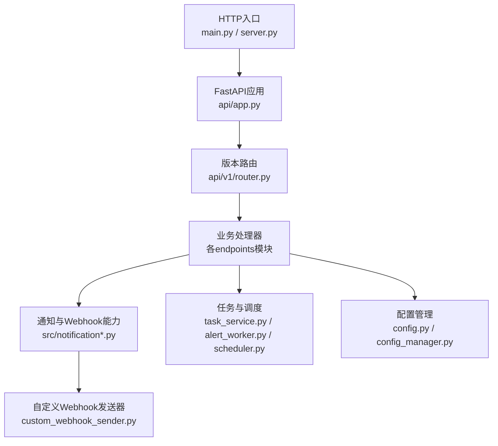
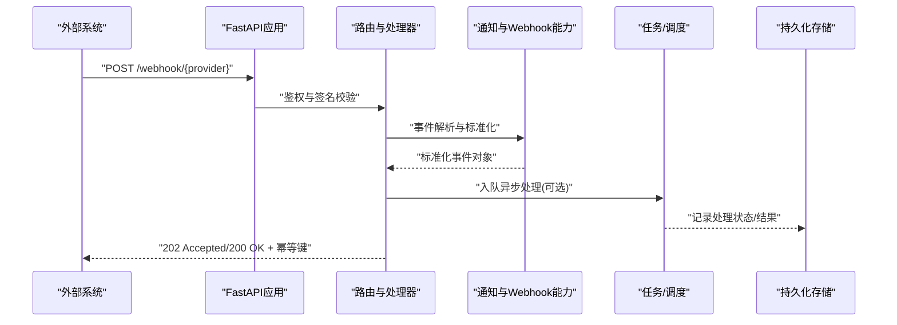
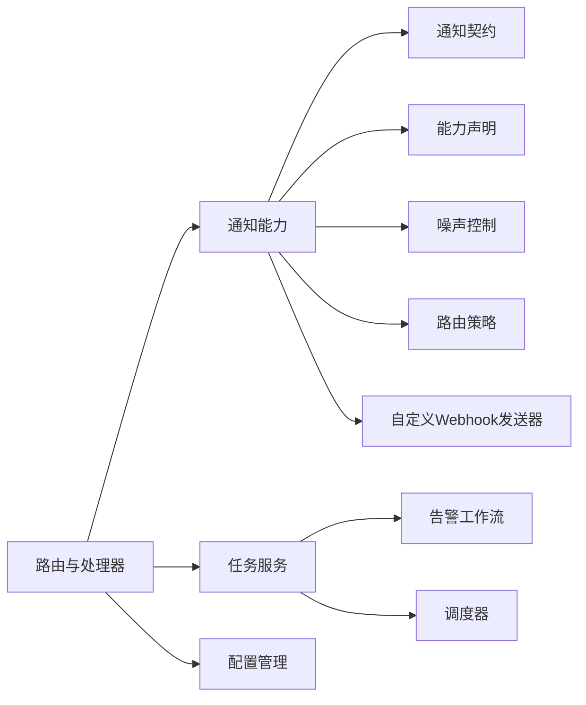

# Webhook集成

<cite>
**本文档引用的文件**   
- [main.py](file://main.py)
- [server.py](file://server.py)
- [api/app.py](file://api/app.py)
- [api/v1/router.py](file://api/v1/router.py)
- [src/notification_sender/custom_webhook_sender.py](file://src/notification_sender/custom_webhook_sender.py)
- [src/notification.py](file://src/notification.py)
- [src/notification_contracts.py](file://src/notification_contracts.py)
- [src/notification_capabilities.py](file://src/notification_capabilities.py)
- [src/notification_noise.py](file://src/notification_noise.py)
- [src/notification_routing.py](file://src/notification_routing.py)
- [src/services/alert_worker.py](file://src/services/alert_worker.py)
- [src/services/task_service.py](file://src/services/task_service.py)
- [src/scheduler.py](file://src/scheduler.py)
- [src/config.py](file://src/config.py)
- [src/core/config_manager.py](file://src/core/config_manager.py)
- [tests/test_notification.py](file://tests/test_notification.py)
- [tests/test_notification_sender.py](file://tests/test_notification_sender.py)
</cite>

## 目录
1. [简介](#简介)
2. [项目结构](#项目结构)
3. [核心组件](#核心组件)
4. [架构总览](#架构总览)
5. [详细组件分析](#详细组件分析)
6. [依赖关系分析](#依赖关系分析)
7. [性能考虑](#性能考虑)
8. [故障排查指南](#故障排查指南)
9. [结论](#结论)
10. [附录](#附录)

## 简介
本文件面向需要在系统中接入Webhook集成的开发者，提供从外部系统（如GitHub、支付网关、第三方服务）接收并处理Webhook请求的完整指南。内容涵盖：
- Webhook端点配置与路由
- 签名验证与安全校验
- 事件解析与处理流程
- 响应格式规范与幂等性建议
- 常见场景示例（GitHub事件、支付回调、第三方通知）
- 错误处理、重试与监控

本项目以FastAPI作为HTTP服务框架，通过统一的路由与中间件体系暴露接口；在通知与任务层面，提供了自定义Webhook发送器与调度/队列机制，便于扩展为“接收+处理”的闭环。

## 项目结构
与Webhook相关的代码主要分布在以下位置：
- HTTP服务入口与路由注册：api/app.py、api/v1/router.py、server.py、main.py
- 通知与Webhook能力：src/notification*.py、src/notification_sender/custom_webhook_sender.py
- 任务与调度：src/services/task_service.py、src/services/alert_worker.py、src/scheduler.py
- 配置管理：src/config.py、src/core/config_manager.py
- 测试用例：tests/test_notification.py、tests/test_notification_sender.py

图表来源
- [main.py](file://main.py)
- [server.py](file://server.py)
- [api/app.py](file://api/app.py)
- [api/v1/router.py](file://api/v1/router.py)
- [src/notification_sender/custom_webhook_sender.py](file://src/notification_sender/custom_webhook_sender.py)
- [src/notification.py](file://src/notification.py)
- [src/services/task_service.py](file://src/services/task_service.py)
- [src/services/alert_worker.py](file://src/services/alert_worker.py)
- [src/scheduler.py](file://src/scheduler.py)
- [src/config.py](file://src/config.py)
- [src/core/config_manager.py](file://src/core/config_manager.py)

章节来源
- [main.py](file://main.py)
- [server.py](file://server.py)
- [api/app.py](file://api/app.py)
- [api/v1/router.py](file://api/v1/router.py)

## 核心组件
- HTTP服务与路由层
  - FastAPI应用初始化与中间件挂载
  - 版本化路由注册，便于扩展Webhook端点
- 通知与Webhook能力
  - 统一的Webhook发送器抽象与实现
  - 通知契约、能力声明、噪声控制与路由策略
- 任务与调度
  - 异步任务队列与告警工作流
  - 定时调度与后台任务编排
- 配置管理
  - 环境变量与运行时配置加载
  - 安全密钥与回调URL的配置项

章节来源
- [src/notification_sender/custom_webhook_sender.py](file://src/notification_sender/custom_webhook_sender.py)
- [src/notification.py](file://src/notification.py)
- [src/notification_contracts.py](file://src/notification_contracts.py)
- [src/notification_capabilities.py](file://src/notification_capabilities.py)
- [src/notification_noise.py](file://src/notification_noise.py)
- [src/notification_routing.py](file://src/notification_routing.py)
- [src/services/task_service.py](file://src/services/task_service.py)
- [src/services/alert_worker.py](file://src/services/alert_worker.py)
- [src/scheduler.py](file://src/scheduler.py)
- [src/config.py](file://src/config.py)
- [src/core/config_manager.py](file://src/core/config_manager.py)

## 架构总览
下图展示了从外部系统发起Webhook请求到内部处理的端到端流程，包括签名校验、事件解析、任务入队与异步处理。

图表来源
- [api/app.py](file://api/app.py)
- [api/v1/router.py](file://api/v1/router.py)
- [src/notification.py](file://src/notification.py)
- [src/services/task_service.py](file://src/services/task_service.py)
- [src/services/alert_worker.py](file://src/services/alert_worker.py)

## 详细组件分析

### Webhook端点与路由
- 端点设计建议
  - 使用版本化路径，如 /api/v1/webhook/github、/api/v1/webhook/payment、/api/v1/webhook/third-party
  - 每个Provider独立路由，便于差异化签名校验与事件映射
- 路由注册
  - 在版本路由中集中注册Webhook端点，保持与其他API一致的风格
- 请求体与响应
  - 请求体按Provider约定解析，转换为内部标准事件模型
  - 响应建议返回202 Accepted表示已接受处理，或200 OK表示同步成功；必须包含幂等键（如X-Idempotency-Key）

章节来源
- [api/v1/router.py](file://api/v1/router.py)
- [api/app.py](file://api/app.py)

### 签名验证与安全校验
- 通用校验步骤
  - 校验Content-Type与必要头部（如X-Signature、X-Timestamp、X-Event-Type）
  - 基于共享密钥对请求体进行HMAC签名校验
  - 校验时间戳防重放，拒绝过期请求
  - 校验来源IP白名单（可选）
- Provider差异
  - GitHub：使用sha256签名，位于X-Hub-Signature-256
  - 支付网关：常见于X-Pay-Signature或Authorization头
  - 第三方服务：遵循其文档约定的Header与算法
- 失败处理
  - 返回401/403并记录审计日志
  - 避免泄露具体错误原因，仅提示签名无效

章节来源
- [src/notification.py](file://src/notification.py)
- [src/config.py](file://src/config.py)
- [src/core/config_manager.py](file://src/core/config_manager.py)

### 事件解析与标准化
- 事件模型
  - 定义统一的事件结构（类型、时间戳、源、数据载荷、幂等键）
  - 针对Provider做适配转换，输出标准事件
- 解析流程
  - 读取原始请求体与头部
  - 根据Provider选择解析器
  - 校验必填字段与数据类型
  - 生成标准化事件对象

章节来源
- [src/notification_contracts.py](file://src/notification_contracts.py)
- [src/notification_capabilities.py](file://src/notification_capabilities.py)

### 事件处理与响应
- 同步处理
  - 轻量校验后直接返回200/202，适合快速确认
- 异步处理
  - 将事件入队，由后台任务消费处理，提高吞吐与稳定性
- 幂等性与去重
  - 基于幂等键缓存处理结果，防止重复处理
  - 支持TTL与过期清理

章节来源
- [src/services/task_service.py](file://src/services/task_service.py)
- [src/services/alert_worker.py](file://src/services/alert_worker.py)
- [src/notification_noise.py](file://src/notification_noise.py)

### 自定义Webhook发送器
- 发送器职责
  - 封装HTTP客户端调用，支持重试、超时、错误码处理
  - 支持动态配置目标URL、Headers与Body模板
- 使用方式
  - 在通知管道中调用发送器，将标准化事件转为Provider期望的Payload
  - 记录发送结果与重试次数，便于监控与排障

章节来源
- [src/notification_sender/custom_webhook_sender.py](file://src/notification_sender/custom_webhook_sender.py)

### 任务与调度
- 任务队列
  - 将耗时操作放入队列，保证Webhook端点的低延迟响应
- 告警工作流
  - 结合告警规则触发Webhook回调，形成闭环
- 定时调度
  - 周期性任务驱动数据拉取与报告生成，必要时触发Webhook通知

章节来源
- [src/services/task_service.py](file://src/services/task_service.py)
- [src/services/alert_worker.py](file://src/services/alert_worker.py)
- [src/scheduler.py](file://src/scheduler.py)

### 配置与环境变量
- 关键配置项
  - WEBHOOK_SECRET：用于签名校验的共享密钥
  - WEBHOOK_TIMEOUT：HTTP请求超时时间
  - WEBHOOK_RETRY：最大重试次数与退避策略
  - PROVIDER_*：各Provider特定配置（如GitHub Token、支付网关Key）
- 配置加载
  - 通过配置管理器统一加载，支持默认值与环境覆盖

章节来源
- [src/config.py](file://src/config.py)
- [src/core/config_manager.py](file://src/core/config_manager.py)

## 依赖关系分析
Webhook相关模块之间的依赖关系如下：

图表来源
- [api/v1/router.py](file://api/v1/router.py)
- [src/notification.py](file://src/notification.py)
- [src/notification_contracts.py](file://src/notification_contracts.py)
- [src/notification_capabilities.py](file://src/notification_capabilities.py)
- [src/notification_noise.py](file://src/notification_noise.py)
- [src/notification_routing.py](file://src/notification_routing.py)
- [src/notification_sender/custom_webhook_sender.py](file://src/notification_sender/custom_webhook_sender.py)
- [src/services/task_service.py](file://src/services/task_service.py)
- [src/services/alert_worker.py](file://src/services/alert_worker.py)
- [src/scheduler.py](file://src/scheduler.py)
- [src/config.py](file://src/config.py)

章节来源
- [src/notification.py](file://src/notification.py)
- [src/notification_contracts.py](file://src/notification_contracts.py)
- [src/notification_capabilities.py](file://src/notification_capabilities.py)
- [src/notification_noise.py](file://src/notification_noise.py)
- [src/notification_routing.py](file://src/notification_routing.py)
- [src/notification_sender/custom_webhook_sender.py](file://src/notification_sender/custom_webhook_sender.py)
- [src/services/task_service.py](file://src/services/task_service.py)
- [src/services/alert_worker.py](file://src/services/alert_worker.py)
- [src/scheduler.py](file://src/scheduler.py)
- [src/config.py](file://src/config.py)

## 性能考虑
- 端点响应时间
  - 优先返回202 Accepted，将耗时逻辑放入后台任务
- 并发与限流
  - 使用连接池与超时控制，避免阻塞
  - 对高频Provider实施速率限制与熔断
- 幂等与去重
  - 基于幂等键与短期缓存减少重复处理
- 序列化与传输
  - 合理压缩Payload，避免过大请求体
- 监控与可观测性
  - 记录请求耗时、错误率、重试次数与队列积压

[本节为通用指导，不直接分析具体文件]

## 故障排查指南
- 常见问题
  - 签名校验失败：检查密钥、算法、时间戳与请求体一致性
  - 超时或网络错误：调整超时与重试策略，检查网络连通性
  - 事件解析失败：核对Provider文档与字段映射
  - 重复处理：确认幂等键是否唯一且有效
- 诊断手段
  - 启用详细日志，记录请求头、签名摘要与错误堆栈
  - 使用测试用例模拟不同Provider的Payload与异常场景
- 参考测试
  - 通知与发送器的单元测试有助于快速定位问题

章节来源
- [tests/test_notification.py](file://tests/test_notification.py)
- [tests/test_notification_sender.py](file://tests/test_notification_sender.py)

## 结论
通过统一的路由、签名校验、事件标准化与任务调度，系统能够稳定地接收并处理来自多方的Webhook请求。结合配置管理与监控，可实现高可用、可扩展的Webhook集成方案。建议在接入新Provider时，严格遵循契约与最佳实践，确保安全性与可靠性。

[本节为总结，不直接分析具体文件]

## 附录

### 常见场景示例

#### GitHub事件
- 端点：/api/v1/webhook/github
- 签名：X-Hub-Signature-256（HMAC-SHA256）
- 事件类型：push、pull_request、issue_comment等
- 处理要点：校验时间戳、解析payload、去重与幂等

章节来源
- [api/v1/router.py](file://api/v1/router.py)
- [src/notification.py](file://src/notification.py)
- [src/config.py](file://src/config.py)

#### 支付回调
- 端点：/api/v1/webhook/payment
- 签名：X-Pay-Signature或Authorization
- 事件类型：payment.success、payment.failed、refund等
- 处理要点：金额与订单号校验、幂等更新订单状态、异步通知下游

章节来源
- [src/notification_contracts.py](file://src/notification_contracts.py)
- [src/services/task_service.py](file://src/services/task_service.py)

#### 第三方服务通知
- 端点：/api/v1/webhook/third-party
- 签名：按Provider文档实现
- 事件类型：自定义，需映射为标准事件
- 处理要点：字段映射、容错与降级、重试与补偿

章节来源
- [src/notification_capabilities.py](file://src/notification_capabilities.py)
- [src/notification_routing.py](file://src/notification_routing.py)

### 响应格式规范
- 成功响应
  - 200 OK：同步处理完成
  - 202 Accepted：已接受处理，异步执行
- 错误响应
  - 400 Bad Request：参数或签名错误
  - 401 Unauthorized：认证失败
  - 429 Too Many Requests：限流
  - 500 Internal Server Error：服务端异常
- 幂等键
  - 建议在响应中包含幂等键，供上游确认与重试

章节来源
- [api/app.py](file://api/app.py)
- [src/notification_noise.py](file://src/notification_noise.py)

### 安全与合规建议
- 密钥管理
  - 使用环境变量或密钥管理服务，禁止硬编码
- 传输安全
  - 强制HTTPS，校验证书链
- 访问控制
  - 限制来源IP与User-Agent，启用WAF防护
- 审计与日志
  - 记录关键操作与异常，保留最小必要信息

章节来源
- [src/config.py](file://src/config.py)
- [src/core/config_manager.py](file://src/core/config_manager.py)