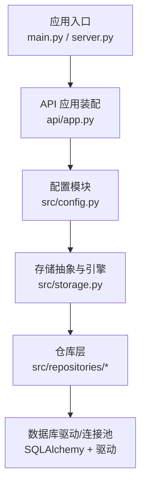
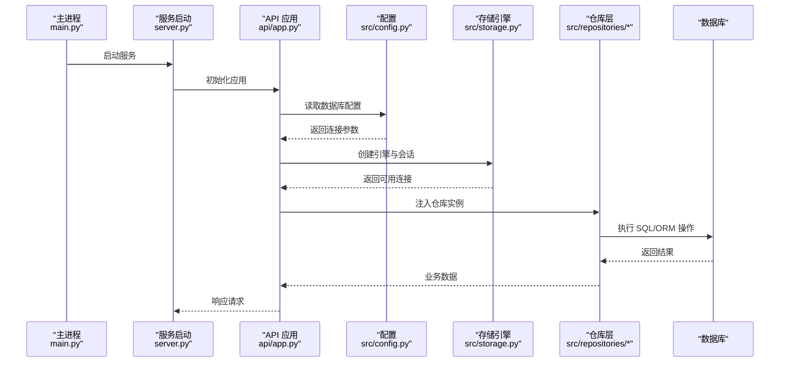
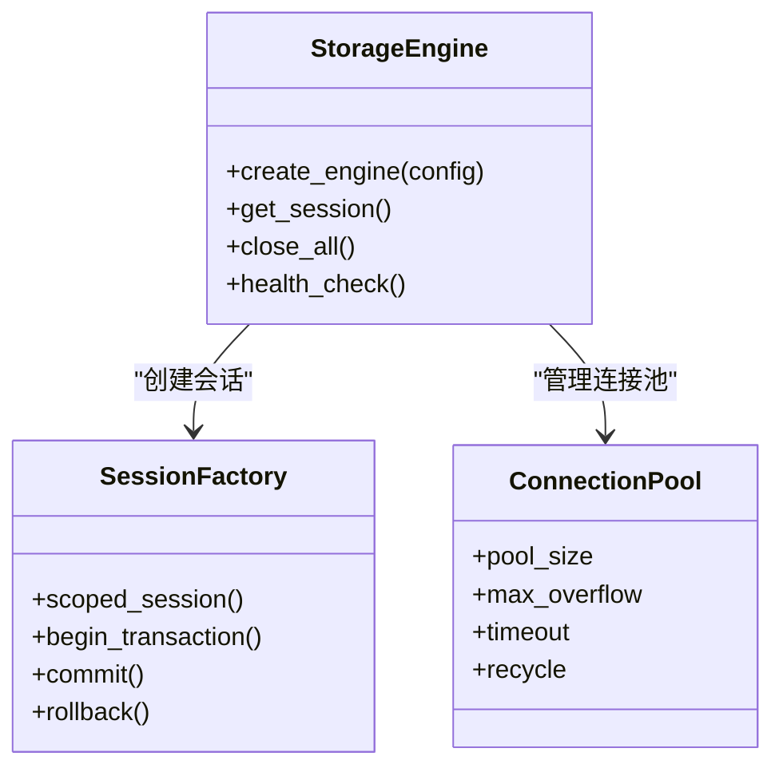
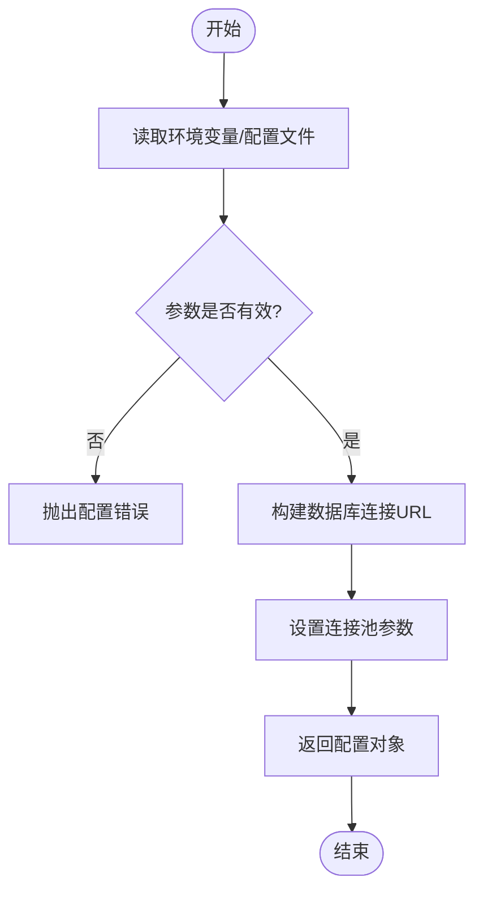
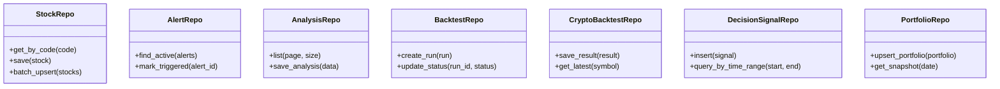
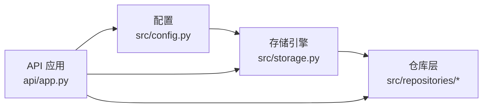

# 数据库连接

<cite>
**本文引用的文件**   
- [src/storage.py](file://src/storage.py)
- [src/config.py](file://src/config.py)
- [src/repositories/__init__.py](file://src/repositories/__init__.py)
- [src/repositories/stock_repo.py](file://src/repositories/stock_repo.py)
- [src/repositories/alert_repo.py](file://src/repositories/alert_repo.py)
- [src/repositories/analysis_repo.py](file://src/repositories/analysis_repo.py)
- [src/repositories/backtest_repo.py](file://src/repositories/backtest_repo.py)
- [src/repositories/crypto_backtest_repo.py](file://src/repositories/crypto_backtest_repo.py)
- [src/repositories/decision_signal_repo.py](file://src/repositories/decision_signal_repo.py)
- [src/repositories/portfolio_repo.py](file://src/repositories/portfolio_repo.py)
- [api/app.py](file://api/app.py)
- [server.py](file://server.py)
- [main.py](file://main.py)
</cite>

## 目录
1. [简介](#简介)
2. [项目结构](#项目结构)
3. [核心组件](#核心组件)
4. [架构总览](#架构总览)
5. [详细组件分析](#详细组件分析)
6. [依赖关系分析](#依赖关系分析)
7. [性能考虑](#性能考虑)
8. [故障排查指南](#故障排查指南)
9. [结论](#结论)
10. [附录](#附录)

## 简介
本文件面向“数据库连接”主题，系统性梳理本项目中数据库连接的配置、使用与管理方式。内容覆盖：
- 支持的数据库类型与连接参数（如 SQLite、PostgreSQL、MySQL）
- 连接池配置与生命周期管理
- 事务管理与错误处理
- 数据迁移与备份恢复策略建议
- 性能优化与常见问题排查

说明：本项目采用仓库模式组织数据访问层，通过统一的存储抽象与配置模块进行数据库接入。下文将基于源码结构与实现细节展开分析，并给出可操作的配置与运维建议。

## 项目结构
与数据库连接相关的代码主要分布在以下位置：
- 存储抽象与引擎初始化：src/storage.py
- 配置加载与环境变量解析：src/config.py
- 仓库层（Repository）封装具体表操作：src/repositories/*
- 应用启动与依赖注入：api/app.py、server.py、main.py

图表来源
- [main.py:1-200](file://main.py#L1-L200)
- [server.py:1-200](file://server.py#L1-L200)
- [api/app.py:1-200](file://api/app.py#L1-L200)
- [src/config.py:1-200](file://src/config.py#L1-L200)
- [src/storage.py:1-200](file://src/storage.py#L1-L200)
- [src/repositories/__init__.py:1-200](file://src/repositories/__init__.py#L1-L200)

章节来源
- [src/storage.py:1-200](file://src/storage.py#L1-L200)
- [src/config.py:1-200](file://src/config.py#L1-L200)
- [api/app.py:1-200](file://api/app.py#L1-L200)
- [server.py:1-200](file://server.py#L1-L200)
- [main.py:1-200](file://main.py#L1-L200)

## 核心组件
- 存储抽象与引擎（storage）
  - 负责创建数据库引擎、会话工厂、连接池参数以及基础查询/写入能力。
  - 提供统一的连接字符串解析与多数据库支持（SQLite、PostgreSQL、MySQL）。
- 配置模块（config）
  - 集中读取环境变量与配置文件，生成数据库连接参数（URL、池大小、超时等）。
  - 提供默认值与校验逻辑，确保运行时稳定性。
- 仓库层（repositories）
  - 对业务实体（股票、预警、分析、回测、决策信号、组合等）的增删改查进行封装。
  - 通过依赖注入或全局单例获取会话，保证事务边界清晰。

章节来源
- [src/storage.py:1-200](file://src/storage.py#L1-L200)
- [src/config.py:1-200](file://src/config.py#L1-L200)
- [src/repositories/__init__.py:1-200](file://src/repositories/__init__.py#L1-L200)
- [src/repositories/stock_repo.py:1-200](file://src/repositories/stock_repo.py#L1-L200)
- [src/repositories/alert_repo.py:1-200](file://src/repositories/alert_repo.py#L1-L200)
- [src/repositories/analysis_repo.py:1-200](file://src/repositories/analysis_repo.py#L1-L200)
- [src/repositories/backtest_repo.py:1-200](file://src/repositories/backtest_repo.py#L1-L200)
- [src/repositories/crypto_backtest_repo.py:1-200](file://src/repositories/crypto_backtest_repo.py#L1-L200)
- [src/repositories/decision_signal_repo.py:1-200](file://src/repositories/decision_signal_repo.py#L1-L200)
- [src/repositories/portfolio_repo.py:1-200](file://src/repositories/portfolio_repo.py#L1-L200)

## 架构总览
下图展示从应用启动到数据库访问的关键流程：应用入口加载配置，构建存储引擎，注入仓库实例，最终由 SQLAlchemy 驱动完成连接与查询。

图表来源
- [main.py:1-200](file://main.py#L1-L200)
- [server.py:1-200](file://server.py#L1-L200)
- [api/app.py:1-200](file://api/app.py#L1-L200)
- [src/config.py:1-200](file://src/config.py#L1-L200)
- [src/storage.py:1-200](file://src/storage.py#L1-L200)
- [src/repositories/__init__.py:1-200](file://src/repositories/__init__.py#L1-L200)

## 详细组件分析

### 存储抽象与引擎（storage）
- 职责
  - 根据配置创建数据库引擎（支持 SQLite、PostgreSQL、MySQL）。
  - 管理连接池参数（最大连接数、最小连接数、超时、回收策略）。
  - 提供会话工厂与上下文管理器，确保事务一致性。
- 关键设计
  - 统一连接字符串格式，屏蔽不同数据库差异。
  - 可选启用连接池预热与空闲连接清理。
  - 提供健康检查接口用于监控连接可用性。

图表来源
- [src/storage.py:1-200](file://src/storage.py#L1-L200)

章节来源
- [src/storage.py:1-200](file://src/storage.py#L1-L200)

### 配置模块（config）
- 职责
  - 读取环境变量与配置文件，生成数据库 URL、认证信息、连接池参数。
  - 提供默认值与校验，避免运行时异常。
- 关键设计
  - 支持多环境（开发、测试、生产）切换。
  - 敏感信息通过环境变量注入，避免硬编码。
  - 提供调试开关以输出连接状态。

图表来源
- [src/config.py:1-200](file://src/config.py#L1-L200)

章节来源
- [src/config.py:1-200](file://src/config.py#L1-L200)

### 仓库层（repositories）
- 职责
  - 封装各业务实体的数据访问逻辑（CRUD、批量操作、分页查询等）。
  - 通过会话上下文管理事务边界，确保数据一致性。
- 关键设计
  - 每个实体一个仓库类，职责单一。
  - 统一错误处理与日志记录。
  - 支持读写分离扩展点（如需）。

图表来源
- [src/repositories/stock_repo.py:1-200](file://src/repositories/stock_repo.py#L1-L200)
- [src/repositories/alert_repo.py:1-200](file://src/repositories/alert_repo.py#L1-L200)
- [src/repositories/analysis_repo.py:1-200](file://src/repositories/analysis_repo.py#L1-L200)
- [src/repositories/backtest_repo.py:1-200](file://src/repositories/backtest_repo.py#L1-L200)
- [src/repositories/crypto_backtest_repo.py:1-200](file://src/repositories/crypto_backtest_repo.py#L1-L200)
- [src/repositories/decision_signal_repo.py:1-200](file://src/repositories/decision_signal_repo.py#L1-L200)
- [src/repositories/portfolio_repo.py:1-200](file://src/repositories/portfolio_repo.py#L1-L200)

章节来源
- [src/repositories/__init__.py:1-200](file://src/repositories/__init__.py#L1-200)
- [src/repositories/stock_repo.py:1-200](file://src/repositories/stock_repo.py#L1-200)
- [src/repositories/alert_repo.py:1-200](file://src/repositories/alert_repo.py#L1-200)
- [src/repositories/analysis_repo.py:1-200](file://src/repositories/analysis_repo.py#L1-200)
- [src/repositories/backtest_repo.py:1-200](file://src/repositories/backtest_repo.py#L1-200)
- [src/repositories/crypto_backtest_repo.py:1-200](file://src/repositories/crypto_backtest_repo.py#L1-200)
- [src/repositories/decision_signal_repo.py:1-200](file://src/repositories/decision_signal_repo.py#L1-200)
- [src/repositories/portfolio_repo.py:1-200](file://src/repositories/portfolio_repo.py#L1-200)

### 应用装配与依赖注入（api/app.py、server.py、main.py）
- 职责
  - 在应用启动时加载配置、初始化存储引擎、注册中间件与路由。
  - 将仓库实例注入到路由处理器或服务层。
- 关键设计
  - 分层清晰：入口 -> 应用 -> 配置 -> 存储 -> 仓库。
  - 支持优雅关闭与资源释放。

章节来源
- [api/app.py:1-200](file://api/app.py#L1-200)
- [server.py:1-200](file://server.py#L1-200)
- [main.py:1-200](file://main.py#L1-200)

## 依赖关系分析
- 耦合与内聚
  - storage 与 config 低耦合，通过配置对象解耦数据库选择。
  - repositories 仅依赖 storage 提供的会话与基础能力，保持高内聚。
- 外部依赖
  - SQLAlchemy 作为 ORM/连接管理核心。
  - 数据库驱动（pysqlite、psycopg2、mysqlclient 等）按需安装。
- 潜在循环依赖
  - 当前仓库层不反向依赖 storage，避免循环引用。

图表来源
- [src/config.py:1-200](file://src/config.py#L1-200)
- [src/storage.py:1-200](file://src/storage.py#L1-200)
- [src/repositories/__init__.py:1-200](file://src/repositories/__init__.py#L1-200)
- [api/app.py:1-200](file://api/app.py#L1-200)

章节来源
- [src/config.py:1-200](file://src/config.py#L1-200)
- [src/storage.py:1-200](file://src/storage.py#L1-200)
- [src/repositories/__init__.py:1-200](file://src/repositories/__init__.py#L1-200)
- [api/app.py:1-200](file://api/app.py#L1-200)

## 性能考虑
- 连接池调优
  - 根据并发量调整 pool_size 与 max_overflow，避免连接耗尽。
  - 合理设置 timeout 与 recycle，防止长事务占用连接。
- 查询优化
  - 使用索引字段过滤与分页，减少全表扫描。
  - 批量插入/更新以减少往返次数。
- 缓存策略
  - 热点数据（如股票列表、指数映射）可引入内存缓存。
- 监控与告警
  - 暴露连接池使用率、慢查询统计，便于定位瓶颈。

[本节为通用指导，无需特定文件来源]

## 故障排查指南
- 连接失败
  - 检查数据库 URL、用户名、密码、主机与端口是否正确。
  - 确认防火墙与安全组放行相应端口。
- 连接池耗尽
  - 观察活跃连接数与等待队列，必要时扩容 pool_size。
  - 排查未正确关闭的会话或长事务。
- 事务异常
  - 捕获并记录异常堆栈，确认是否在合适边界提交/回滚。
  - 检查死锁与锁等待时间。
- 性能问题
  - 开启慢查询日志，定位耗时 SQL。
  - 分析执行计划，补充缺失索引。

章节来源
- [src/storage.py:1-200](file://src/storage.py#L1-200)
- [src/config.py:1-200](file://src/config.py#L1-200)

## 结论
本项目通过统一的存储抽象与配置模块，实现了多数据库类型的灵活接入与连接池管理。仓库层封装了业务数据访问，保证了事务一致性与错误处理的一致性。在生产环境中，建议结合连接池调优、索引优化与监控告警，持续提升数据库性能与稳定性。

[本节为总结性内容，无需特定文件来源]

## 附录
- 常见数据库连接示例（概念性）
  - SQLite：适用于本地开发与轻量场景，连接字符串通常为文件路径形式。
  - PostgreSQL：生产推荐，具备强一致性与丰富生态。
  - MySQL：广泛使用，注意字符集与排序规则配置。
- 数据迁移建议
  - 使用版本化迁移脚本，确保跨环境一致性。
  - 在部署流水线中自动执行迁移，失败即回滚。
- 备份与恢复
  - 定期全量备份与增量备份结合。
  - 制定恢复演练计划，验证 RTO/RPO 目标。

[本节为通用指导，无需特定文件来源]