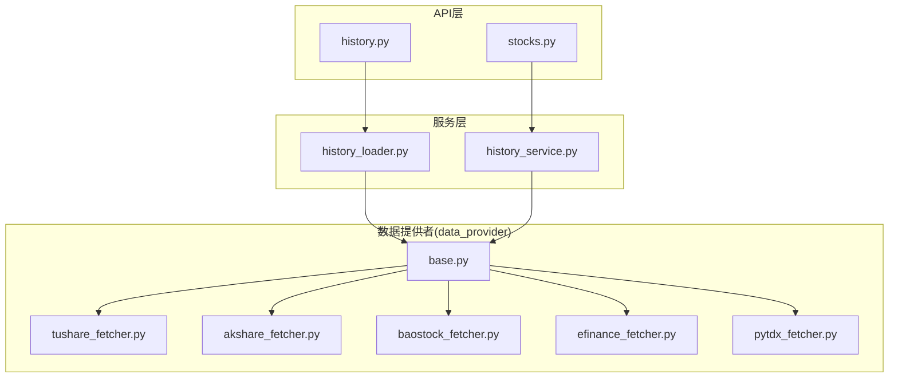
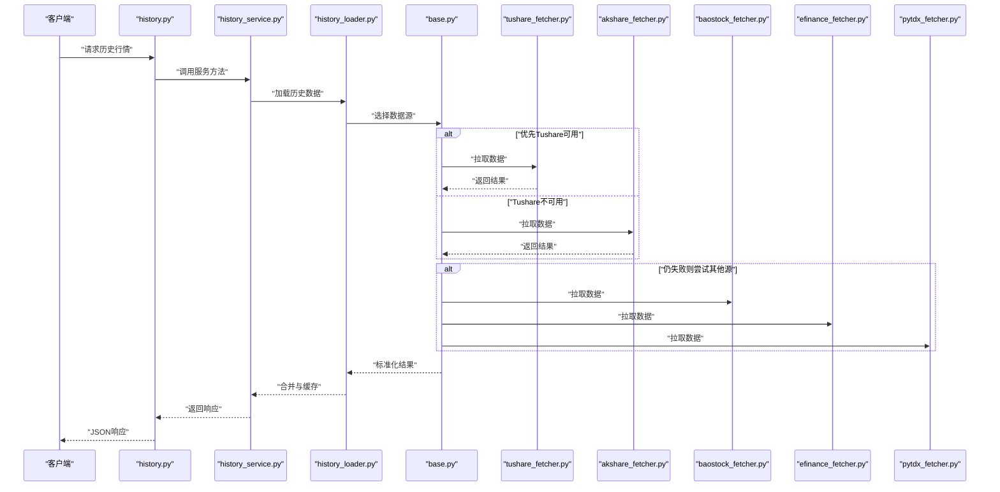
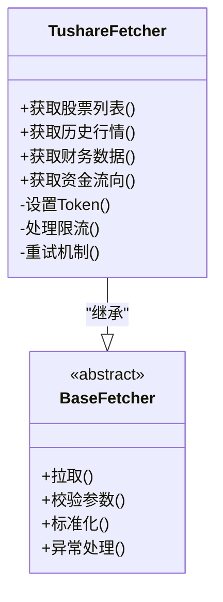
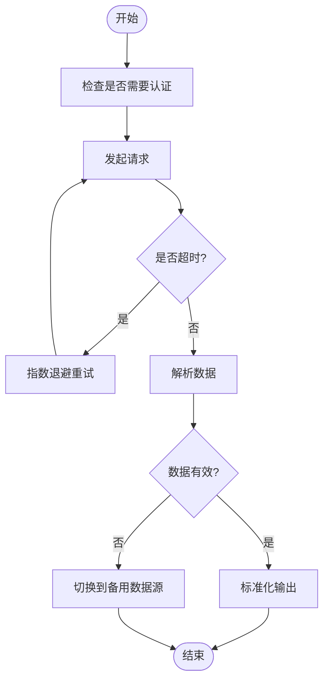
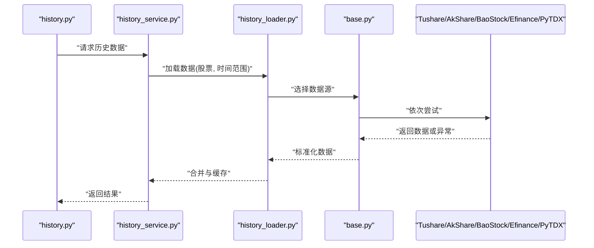
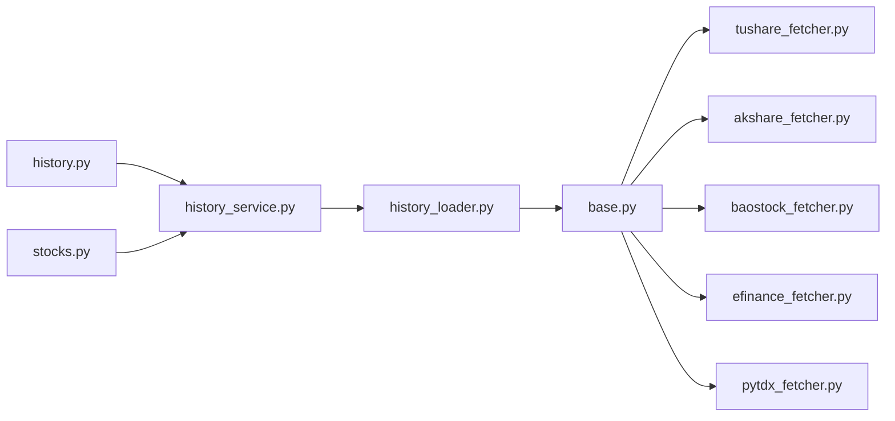

# A股数据源

<cite>
**本文引用的文件**   
- [data_provider/base.py](file://data_provider/base.py)
- [data_provider/tushare_fetcher.py](file://data_provider/tushare_fetcher.py)
- [data_provider/akshare_fetcher.py](file://data_provider/akshare_fetcher.py)
- [data_provider/baostock_fetcher.py](file://data_provider/baostock_fetcher.py)
- [data_provider/efinance_fetcher.py](file://data_provider/efinance_fetcher.py)
- [data_provider/pytdx_fetcher.py](file://data_provider/pytdx_fetcher.py)
- [src/services/history_loader.py](file://src/services/history_loader.py)
- [src/services/history_service.py](file://src/services/history_service.py)
- [api/v1/endpoints/history.py](file://api/v1/endpoints/history.py)
- [api/v1/endpoints/stocks.py](file://api/v1/endpoints/stocks.py)
- [tests/test_tushare_fetcher_http_client.py](file://tests/test_tushare_fetcher_http_client.py)
- [tests/test_akshare_history_timeout.py](file://tests/test_akshare_history_timeout.py)
</cite>

## 目录
1. [简介](#简介)
2. [项目结构](#项目结构)
3. [核心组件](#核心组件)
4. [架构总览](#架构总览)
5. [详细组件分析](#详细组件分析)
6. [依赖关系分析](#依赖关系分析)
7. [性能与限流策略](#性能与限流策略)
8. [故障排查指南](#故障排查指南)
9. [结论](#结论)
10. [附录：配置与示例](#附录配置与示例)

## 简介
本文件面向A股数据源的集成与使用，覆盖Tushare、AkShare、BaoStock、Efinance和PyTDX等主流数据提供商。文档从系统架构、组件职责、数据流、错误处理、重试与缓存策略等方面展开，帮助读者快速理解并正确接入各数据源，获取股票基本信息、历史行情、财务数据、资金流向等关键数据。

## 项目结构
本项目采用分层与按功能模块组织的方式：
- data_provider：统一的数据获取抽象层与各数据源实现（Tushare/AkShare/BaoStock/Efinance/PyTDX等）
- src/services：业务服务层，封装历史数据加载、组合与调度
- api/v1：对外API路由与端点，暴露历史行情、股票信息等接口
- tests：针对各数据源与网络行为的测试用例，覆盖超时、重试、HTTP客户端行为等

图表来源
- [api/v1/endpoints/history.py](file://api/v1/endpoints/history.py)
- [api/v1/endpoints/stocks.py](file://api/v1/endpoints/stocks.py)
- [src/services/history_loader.py](file://src/services/history_loader.py)
- [src/services/history_service.py](file://src/services/history_service.py)
- [data_provider/base.py](file://data_provider/base.py)
- [data_provider/tushare_fetcher.py](file://data_provider/tushare_fetcher.py)
- [data_provider/akshare_fetcher.py](file://data_provider/akshare_fetcher.py)
- [data_provider/baostock_fetcher.py](file://data_provider/baostock_fetcher.py)
- [data_provider/efinance_fetcher.py](file://data_provider/efinance_fetcher.py)
- [data_provider/pytdx_fetcher.py](file://data_provider/pytdx_fetcher.py)

章节来源
- [data_provider/base.py](file://data_provider/base.py)
- [src/services/history_loader.py](file://src/services/history_loader.py)
- [src/services/history_service.py](file://src/services/history_service.py)
- [api/v1/endpoints/history.py](file://api/v1/endpoints/history.py)
- [api/v1/endpoints/stocks.py](file://api/v1/endpoints/stocks.py)

## 核心组件
- 数据提供者基类与协议：定义统一的拉取接口、参数校验、返回数据结构与异常约定，确保不同数据源可被上层一致调用。
- 具体数据源实现：
  - Tushare：通过Token认证访问，提供股票列表、历史行情、财务指标、资金流向等能力
  - AkShare：无Token或轻量鉴权，覆盖广泛的市场数据，适合批量历史数据拉取
  - BaoStock：本地化数据源，适合离线回测与历史数据补全
  - Efinance：聚焦A股实时与历史行情，接口简洁
  - PyTDX：基于通达信协议的底层数据通道，适合高频或低延迟场景
- 服务层：
  - history_loader：负责历史数据的加载、合并与缓存
  - history_service：编排多数据源、容错与降级策略
- API层：
  - history.py：历史行情查询接口
  - stocks.py：股票基本信息与搜索接口

章节来源
- [data_provider/base.py](file://data_provider/base.py)
- [data_provider/tushare_fetcher.py](file://data_provider/tushare_fetcher.py)
- [data_provider/akshare_fetcher.py](file://data_provider/akshare_fetcher.py)
- [data_provider/baostock_fetcher.py](file://data_provider/baostock_fetcher.py)
- [data_provider/efinance_fetcher.py](file://data_provider/efinance_fetcher.py)
- [data_provider/pytdx_fetcher.py](file://data_provider/pytdx_fetcher.py)
- [src/services/history_loader.py](file://src/services/history_loader.py)
- [src/services/history_service.py](file://src/services/history_service.py)
- [api/v1/endpoints/history.py](file://api/v1/endpoints/history.py)
- [api/v1/endpoints/stocks.py](file://api/v1/endpoints/stocks.py)

## 架构总览
整体数据流遵循“API -> 服务层 -> 数据提供者”的分层模式，支持多数据源并行与降级。

图表来源
- [api/v1/endpoints/history.py](file://api/v1/endpoints/history.py)
- [src/services/history_service.py](file://src/services/history_service.py)
- [src/services/history_loader.py](file://src/services/history_loader.py)
- [data_provider/base.py](file://data_provider/base.py)
- [data_provider/tushare_fetcher.py](file://data_provider/tushare_fetcher.py)
- [data_provider/akshare_fetcher.py](file://data_provider/akshare_fetcher.py)
- [data_provider/baostock_fetcher.py](file://data_provider/baostock_fetcher.py)
- [data_provider/efinance_fetcher.py](file://data_provider/efinance_fetcher.py)
- [data_provider/pytdx_fetcher.py](file://data_provider/pytdx_fetcher.py)

## 详细组件分析

### 数据提供者基类与协议
- 职责：定义统一的拉取接口、参数校验、返回结构、异常类型与重试/限流钩子
- 关键点：
  - 统一输入输出规范，便于上层聚合与降级
  - 抽象网络请求、鉴权、限流、重试等横切关注点
  - 为各数据源实现提供一致的扩展点

章节来源
- [data_provider/base.py](file://data_provider/base.py)

### Tushare数据源
- 认证方式：Token认证，需在环境或配置中设置
- 数据能力：股票列表、历史行情、财务指标、资金流向等
- 限流策略：遵循官方速率限制，建议指数退避重试
- 错误处理：区分网络异常、鉴权失败、数据缺失等，进行降级到AkShare/BaoStock

图表来源
- [data_provider/tushare_fetcher.py](file://data_provider/tushare_fetcher.py)
- [data_provider/base.py](file://data_provider/base.py)

章节来源
- [data_provider/tushare_fetcher.py](file://data_provider/tushare_fetcher.py)
- [tests/test_tushare_fetcher_http_client.py](file://tests/test_tushare_fetcher_http_client.py)

### AkShare数据源
- 认证方式：通常无需Token，部分接口可能受限
- 数据能力：广泛的A股历史行情、指数、板块、资金流向等
- 限流策略：避免高频并发，合理休眠与重试
- 错误处理：网络超时、数据格式不一致等，需健壮解析

图表来源
- [data_provider/akshare_fetcher.py](file://data_provider/akshare_fetcher.py)
- [tests/test_akshare_history_timeout.py](file://tests/test_akshare_history_timeout.py)

章节来源
- [data_provider/akshare_fetcher.py](file://data_provider/akshare_fetcher.py)
- [tests/test_akshare_history_timeout.py](file://tests/test_akshare_history_timeout.py)

### BaoStock数据源
- 认证方式：本地数据库或文件，无需网络认证
- 数据能力：历史行情、财务数据、指数数据，适合离线回测
- 限流策略：本地IO为主，注意批量读取的性能
- 错误处理：数据缺失、版本不匹配等

章节来源
- [data_provider/baostock_fetcher.py](file://data_provider/baostock_fetcher.py)

### Efinance数据源
- 认证方式：通常无需认证
- 数据能力：A股实时与历史行情，接口简洁
- 限流策略：控制并发与频率
- 错误处理：网络异常、字段缺失等

章节来源
- [data_provider/efinance_fetcher.py](file://data_provider/efinance_fetcher.py)

### PyTDX数据源
- 认证方式：基于通达信协议连接，可能需要服务器地址与端口
- 数据能力：底层行情数据，适合高频与低延迟场景
- 限流策略：连接池与请求队列管理
- 错误处理：连接断开、协议错误等

章节来源
- [data_provider/pytdx_fetcher.py](file://data_provider/pytdx_fetcher.py)

### 服务层：历史数据加载与编排
- history_loader：负责数据加载、合并、缓存键生成与命中
- history_service：编排多数据源调用、降级与重试策略

图表来源
- [src/services/history_service.py](file://src/services/history_service.py)
- [src/services/history_loader.py](file://src/services/history_loader.py)
- [data_provider/base.py](file://data_provider/base.py)

章节来源
- [src/services/history_loader.py](file://src/services/history_loader.py)
- [src/services/history_service.py](file://src/services/history_service.py)

### API层：历史行情与股票信息接口
- history.py：历史行情查询，支持时间范围、复权方式、数据源选择
- stocks.py：股票基本信息、搜索、代码映射

章节来源
- [api/v1/endpoints/history.py](file://api/v1/endpoints/history.py)
- [api/v1/endpoints/stocks.py](file://api/v1/endpoints/stocks.py)

## 依赖关系分析
- 数据提供者之间松耦合，通过基类协议解耦
- 服务层对数据提供者有直接依赖，但通过策略模式与降级逻辑降低紧耦合
- API层仅依赖服务层，保持接口稳定

图表来源
- [api/v1/endpoints/history.py](file://api/v1/endpoints/history.py)
- [api/v1/endpoints/stocks.py](file://api/v1/endpoints/stocks.py)
- [src/services/history_service.py](file://src/services/history_service.py)
- [src/services/history_loader.py](file://src/services/history_loader.py)
- [data_provider/base.py](file://data_provider/base.py)
- [data_provider/tushare_fetcher.py](file://data_provider/tushare_fetcher.py)
- [data_provider/akshare_fetcher.py](file://data_provider/akshare_fetcher.py)
- [data_provider/baostock_fetcher.py](file://data_provider/baostock_fetcher.py)
- [data_provider/efinance_fetcher.py](file://data_provider/efinance_fetcher.py)
- [data_provider/pytdx_fetcher.py](file://data_provider/pytdx_fetcher.py)

章节来源
- [data_provider/base.py](file://data_provider/base.py)
- [src/services/history_service.py](file://src/services/history_service.py)
- [src/services/history_loader.py](file://src/services/history_loader.py)

## 性能与限流策略
- 并发与批处理：对历史数据拉取采用分批与并发控制，避免单点瓶颈
- 缓存策略：按股票+时间范围生成缓存键，命中后直接返回
- 重试机制：指数退避与最大重试次数，区分可重试与不可重试错误
- 限流策略：根据数据源限制调整请求频率，必要时排队与节流
- 降级策略：主数据源失败时自动切换到备用数据源，保证可用性

[本节为通用指导，不直接分析具体文件]

## 故障排查指南
- 常见错误：
  - 认证失败：检查Token或凭据配置是否正确
  - 网络超时：增加超时阈值与重试次数，检查网络稳定性
  - 数据缺失：确认时间范围与复权方式，切换数据源验证
  - 限流触发：降低并发与频率，启用排队与节流
- 调试建议：
  - 开启详细日志，记录请求参数与响应结构
  - 使用测试用例模拟异常场景，验证重试与降级逻辑
  - 监控缓存命中率与数据新鲜度

章节来源
- [tests/test_tushare_fetcher_http_client.py](file://tests/test_tushare_fetcher_http_client.py)
- [tests/test_akshare_history_timeout.py](file://tests/test_akshare_history_timeout.py)

## 结论
本项目通过统一的数据提供者抽象与服务层编排，实现了对Tushare、AkShare、BaoStock、Efinance与PyTDX等多数据源的灵活集成。结合重试、限流、缓存与降级策略，保障了数据获取的稳定性与性能。读者可根据实际需求选择合适的数据源与策略，快速构建可靠的A股数据管道。

## 附录：配置与示例
- 配置要点：
  - Tushare：设置Token与环境变量
  - AkShare：无需认证，注意频率限制
  - BaoStock：本地数据路径配置
  - Efinance：默认即可，必要时调整并发
  - PyTDX：配置通达信服务器地址与端口
- 数据获取示例（概念性说明）：
  - 股票基本信息：调用stocks接口，传入股票代码或名称
  - 历史行情：调用history接口，指定股票、起止日期、复权方式
  - 财务数据：通过Tushare或BaoStock获取利润表、资产负债表等
  - 资金流向：通过AkShare或Tushare获取主力净流入等指标
- 错误处理与重试：
  - 捕获网络异常与数据异常，执行指数退避重试
  - 失败时自动降级到备用数据源
- 缓存策略：
  - 按股票+时间范围生成缓存键
  - 设置合理的过期时间与更新策略

[本节为通用指导，不直接分析具体文件]