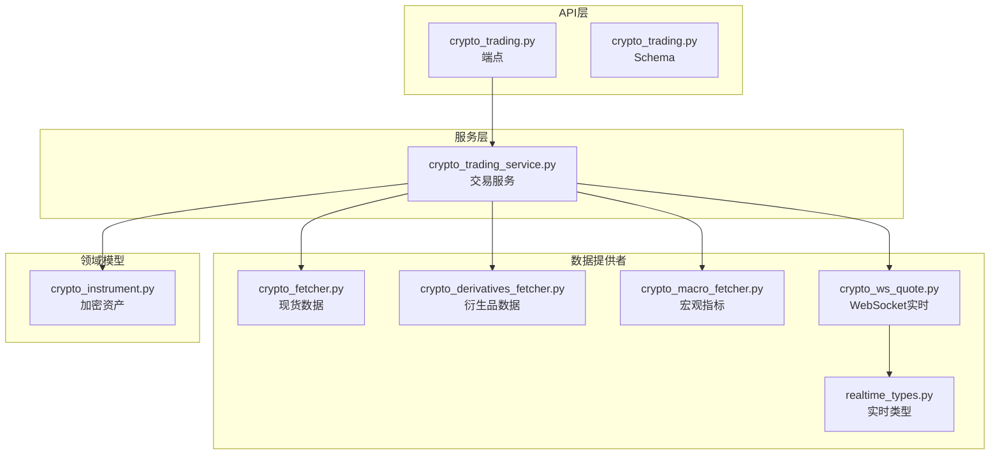
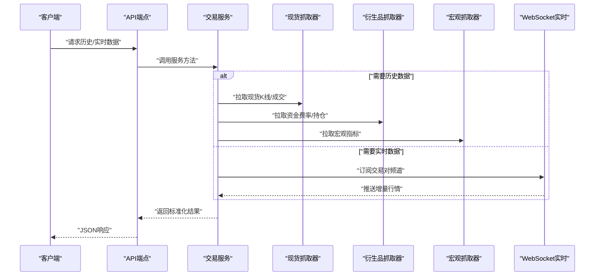
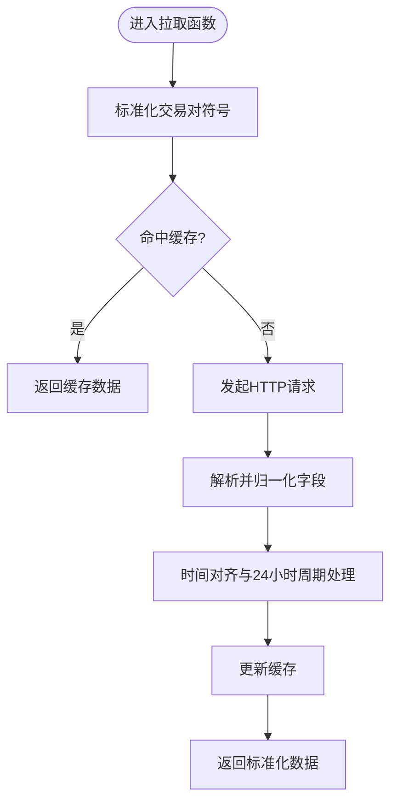
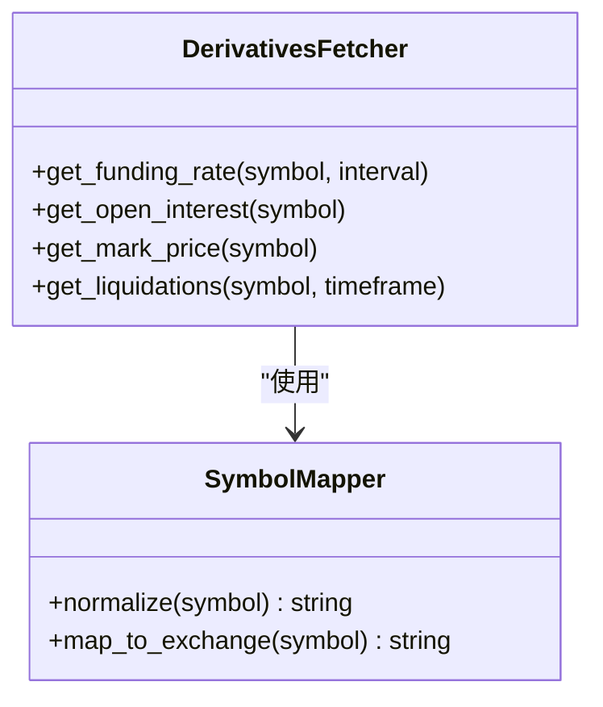
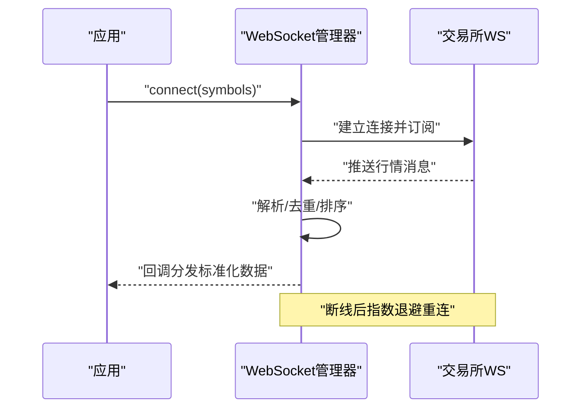
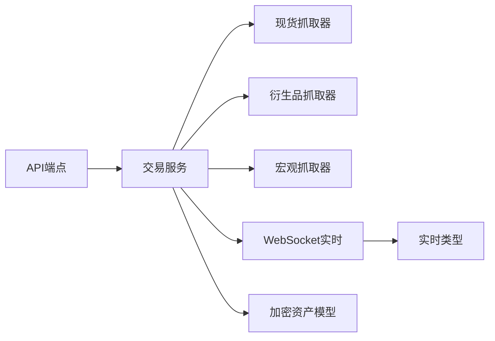

# 加密货币数据源

<cite>
**本文引用的文件**   
- [data_provider/crypto_fetcher.py](file://data_provider/crypto_fetcher.py)
- [data_provider/crypto_derivatives_fetcher.py](file://data_provider/crypto_derivatives_fetcher.py)
- [data_provider/crypto_macro_fetcher.py](file://data_provider/crypto_macro_fetcher.py)
- [data_provider/crypto_ws_quote.py](file://data_provider/crypto_ws_quote.py)
- [api/v1/endpoints/crypto_trading.py](file://api/v1/endpoints/crypto_trading.py)
- [api/v1/schemas/crypto_trading.py](file://api/v1/schemas/crypto_trading.py)
- [src/services/crypto_trading_service.py](file://src/services/crypto_trading_service.py)
- [src/schemas/crypto_instrument.py](file://src/schemas/crypto_instrument.py)
- [data_provider/realtime_types.py](file://data_provider/realtime_types.py)
</cite>

## 目录
1. [简介](#简介)
2. [项目结构](#项目结构)
3. [核心组件](#核心组件)
4. [架构总览](#架构总览)
5. [详细组件分析](#详细组件分析)
6. [依赖关系分析](#依赖关系分析)
7. [性能考量](#性能考量)
8. [故障排查指南](#故障排查指南)
9. [结论](#结论)
10. [附录](#附录)

## 简介
本文件面向“加密货币数据源”的获取与使用，覆盖现货交易、衍生品交易、宏观经济指标以及WebSocket实时行情的数据接入。文档重点说明：
- 加密货币交易对格式规范与交易所API差异处理
- 24小时交易时间（跨日）数据处理策略
- 价格、成交量、持仓量、资金费率等关键数据的获取方式
- WebSocket连接管理、消息解析与断线重连实现要点
- API层接口定义与服务层调用流程

## 项目结构
本项目围绕数据提供者（fetchers）、实时行情（WebSocket）、服务层（services）与API层（endpoints/schemas）组织代码。与加密货币相关的关键位置如下：
- data_provider：各数据源抓取器与类型定义
- api/v1：REST API路由、请求/响应模型
- src/services：业务服务编排与数据聚合
- src/schemas：领域数据模型（如加密资产）

图表来源
- [data_provider/crypto_fetcher.py](file://data_provider/crypto_fetcher.py)
- [data_provider/crypto_derivatives_fetcher.py](file://data_provider/crypto_derivatives_fetcher.py)
- [data_provider/crypto_macro_fetcher.py](file://data_provider/crypto_macro_fetcher.py)
- [data_provider/crypto_ws_quote.py](file://data_provider/crypto_ws_quote.py)
- [data_provider/realtime_types.py](file://data_provider/realtime_types.py)
- [src/services/crypto_trading_service.py](file://src/services/crypto_trading_service.py)
- [api/v1/endpoints/crypto_trading.py](file://api/v1/endpoints/crypto_trading.py)
- [api/v1/schemas/crypto_trading.py](file://api/v1/schemas/crypto_trading.py)
- [src/schemas/crypto_instrument.py](file://src/schemas/crypto_instrument.py)

章节来源
- [api/v1/endpoints/crypto_trading.py](file://api/v1/endpoints/crypto_trading.py)
- [api/v1/schemas/crypto_trading.py](file://api/v1/schemas/crypto_trading.py)
- [src/services/crypto_trading_service.py](file://src/services/crypto_trading_service.py)
- [data_provider/crypto_fetcher.py](file://data_provider/crypto_fetcher.py)
- [data_provider/crypto_derivatives_fetcher.py](file://data_provider/crypto_derivatives_fetcher.py)
- [data_provider/crypto_macro_fetcher.py](file://data_provider/crypto_macro_fetcher.py)
- [data_provider/crypto_ws_quote.py](file://data_provider/crypto_ws_quote.py)
- [data_provider/realtime_types.py](file://data_provider/realtime_types.py)
- [src/schemas/crypto_instrument.py](file://src/schemas/crypto_instrument.py)

## 核心组件
- 现货数据抓取器：统一封装多交易所现货K线、深度、成交等数据，提供标准化输出。
- 衍生品数据抓取器：聚合合约、永续合约的资金费率、持仓量、标记价格等。
- 宏观指标抓取器：拉取链上或宏观层面的关键指标（如稳定币流向、Gas、ETF流入流出等）。
- WebSocket实时行情：维护长连接，订阅交易对频道，解析并分发增量行情。
- 交易服务：将上述数据源整合为统一的查询接口，供API层调用。
- API端点与Schema：定义REST接口契约与数据结构，保证前后端一致。

章节来源
- [data_provider/crypto_fetcher.py](file://data_provider/crypto_fetcher.py)
- [data_provider/crypto_derivatives_fetcher.py](file://data_provider/crypto_derivatives_fetcher.py)
- [data_provider/crypto_macro_fetcher.py](file://data_provider/crypto_macro_fetcher.py)
- [data_provider/crypto_ws_quote.py](file://data_provider/crypto_ws_quote.py)
- [src/services/crypto_trading_service.py](file://src/services/crypto_trading_service.py)
- [api/v1/endpoints/crypto_trading.py](file://api/v1/endpoints/crypto_trading.py)
- [api/v1/schemas/crypto_trading.py](file://api/v1/schemas/crypto_trading.py)

## 架构总览
整体采用分层架构：API层暴露HTTP接口；服务层编排数据源；数据提供者负责对接不同交易所与数据源；WebSocket模块提供低延迟实时数据通道。

图表来源
- [api/v1/endpoints/crypto_trading.py](file://api/v1/endpoints/crypto_trading.py)
- [src/services/crypto_trading_service.py](file://src/services/crypto_trading_service.py)
- [data_provider/crypto_fetcher.py](file://data_provider/crypto_fetcher.py)
- [data_provider/crypto_derivatives_fetcher.py](file://data_provider/crypto_derivatives_fetcher.py)
- [data_provider/crypto_macro_fetcher.py](file://data_provider/crypto_macro_fetcher.py)
- [data_provider/crypto_ws_quote.py](file://data_provider/crypto_ws_quote.py)

## 详细组件分析

### 现货数据抓取器（crypto_fetcher）
- 职责：统一多交易所现货数据（K线、逐笔、盘口），进行字段归一化与时间戳对齐。
- 关键点：
  - 交易对格式：支持多种交易所符号映射（如BTCUSDT、BTC-USDT、BTC_USDT），内部统一为标准化键值。
  - 时间处理：按UTC存储，兼容24小时跨日周期（例如从19:00到次日19:00），确保K线边界正确。
  - 错误处理：网络异常、限流、空响应时回退或重试，记录日志便于诊断。
  - 性能：批量请求、分页拉取、缓存热点数据减少重复请求。

图表来源
- [data_provider/crypto_fetcher.py](file://data_provider/crypto_fetcher.py)

章节来源
- [data_provider/crypto_fetcher.py](file://data_provider/crypto_fetcher.py)

### 衍生品数据抓取器（crypto_derivatives_fetcher）
- 职责：聚合合约与永续合约数据，包括资金费率、标记价格、持仓量、爆仓数据等。
- 关键点：
  - 资金费率：按合约ID或交易对维度聚合，计算最近结算周期费率。
  - 持仓量：区分全仓/逐仓，汇总多空比与总持仓变化。
  - 标记价格：用于风控与结算，需与指数价格偏差阈值校验。
  - 容错：部分交易所字段缺失时的默认值与降级策略。

图表来源
- [data_provider/crypto_derivatives_fetcher.py](file://data_provider/crypto_derivatives_fetcher.py)

章节来源
- [data_provider/crypto_derivatives_fetcher.py](file://data_provider/crypto_derivatives_fetcher.py)

### 宏观指标抓取器（crypto_macro_fetcher）
- 职责：拉取链上与宏观指标，如稳定币净流入、Gas价格、ETF资金流、交易所余额变动等。
- 关键点：
  - 数据源多样性：聚合多个公开API或链上索引服务。
  - 指标口径：统一单位与频率（分钟/小时/日），提供同比/环比计算。
  - 可用性：当主源不可用时切换到备用源，保障连续性。

章节来源
- [data_provider/crypto_macro_fetcher.py](file://data_provider/crypto_macro_fetcher.py)

### WebSocket实时行情（crypto_ws_quote）
- 职责：建立并维护WebSocket连接，订阅交易对频道，解析增量消息并分发。
- 关键点：
  - 连接管理：自动重连、心跳检测、指数退避策略。
  - 消息处理：按频道路由、去重、乱序修复、时间戳校正。
  - 资源控制：并发限制、内存上限、背压处理。
  - 错误恢复：网络中断、认证失败、订阅失败的重试与告警。

图表来源
- [data_provider/crypto_ws_quote.py](file://data_provider/crypto_ws_quote.py)

章节来源
- [data_provider/crypto_ws_quote.py](file://data_provider/crypto_ws_quote.py)

### 交易服务（crypto_trading_service）
- 职责：协调现货、衍生品、宏观与实时数据，对外提供统一查询接口。
- 关键点：
  - 参数校验：交易对、时间范围、粒度、交易所过滤。
  - 数据聚合：合并多源数据，处理缺失与冲突。
  - 缓存策略：热点数据短期缓存，降低下游压力。
  - 错误传播：上游异常转换为标准错误码与提示。

章节来源
- [src/services/crypto_trading_service.py](file://src/services/crypto_trading_service.py)

### API端点与Schema（crypto_trading endpoints & schemas）
- 职责：定义REST接口契约与数据结构，保证前后端一致性。
- 关键点：
  - 端点设计：历史K线、资金费率、持仓量、实时报价等。
  - Schema验证：Pydantic模型约束输入输出，提升健壮性。
  - 错误处理：统一错误码、提示信息与调试信息。

章节来源
- [api/v1/endpoints/crypto_trading.py](file://api/v1/endpoints/crypto_trading.py)
- [api/v1/schemas/crypto_trading.py](file://api/v1/schemas/crypto_trading.py)

### 领域模型（crypto_instrument）
- 职责：定义加密资产的基础信息与分类（币种、合约类型、基础资产等）。
- 关键点：
  - 标准化字段：symbol、base、quote、contract_type、exchange等。
  - 扩展属性：支持自定义标签与元数据。

章节来源
- [src/schemas/crypto_instrument.py](file://src/schemas/crypto_instrument.py)

### 实时类型定义（realtime_types）
- 职责：统一实时数据结构的类型定义，确保消息体一致性。
- 关键点：
  - 字段命名：时间戳、价格、数量、方向等。
  - 版本兼容：支持字段演进与向后兼容。

章节来源
- [data_provider/realtime_types.py](file://data_provider/realtime_types.py)

## 依赖关系分析
组件间依赖清晰，服务层作为编排中心，向下依赖数据提供者，向上暴露API。

图表来源
- [api/v1/endpoints/crypto_trading.py](file://api/v1/endpoints/crypto_trading.py)
- [src/services/crypto_trading_service.py](file://src/services/crypto_trading_service.py)
- [data_provider/crypto_fetcher.py](file://data_provider/crypto_fetcher.py)
- [data_provider/crypto_derivatives_fetcher.py](file://data_provider/crypto_derivatives_fetcher.py)
- [data_provider/crypto_macro_fetcher.py](file://data_provider/crypto_macro_fetcher.py)
- [data_provider/crypto_ws_quote.py](file://data_provider/crypto_ws_quote.py)
- [data_provider/realtime_types.py](file://data_provider/realtime_types.py)
- [src/schemas/crypto_instrument.py](file://src/schemas/crypto_instrument.py)

章节来源
- [api/v1/endpoints/crypto_trading.py](file://api/v1/endpoints/crypto_trading.py)
- [src/services/crypto_trading_service.py](file://src/services/crypto_trading_service.py)
- [data_provider/crypto_fetcher.py](file://data_provider/crypto_fetcher.py)
- [data_provider/crypto_derivatives_fetcher.py](file://data_provider/crypto_derivatives_fetcher.py)
- [data_provider/crypto_macro_fetcher.py](file://data_provider/crypto_macro_fetcher.py)
- [data_provider/crypto_ws_quote.py](file://data_provider/crypto_ws_quote.py)
- [data_provider/realtime_types.py](file://data_provider/realtime_types.py)
- [src/schemas/crypto_instrument.py](file://src/schemas/crypto_instrument.py)

## 性能考量
- 批量与分页：优先批量拉取，避免频繁小请求。
- 缓存策略：热点数据（如最新价、资金费率）短期缓存，降低延迟。
- 连接复用：WebSocket单连接多订阅，减少握手开销。
- 超时与重试：合理设置超时与重试次数，避免雪崩。
- 内存与背压：限制队列长度，丢弃过期消息，防止内存泄漏。

[本节为通用指导，不直接分析具体文件]

## 故障排查指南
- 网络连接问题：检查代理、防火墙、DNS解析；查看WebSocket心跳与重连日志。
- 交易所限流：观察HTTP状态码与错误码，调整请求频率与退避策略。
- 数据不一致：对比多源数据，定位字段映射与时间对齐问题。
- 缓存失效：清理缓存并重新拉取，确认TTL设置是否合理。
- 订阅失败：检查交易对符号映射与交易所频道名称是否正确。

章节来源
- [data_provider/crypto_ws_quote.py](file://data_provider/crypto_ws_quote.py)
- [data_provider/crypto_fetcher.py](file://data_provider/crypto_fetcher.py)
- [data_provider/crypto_derivatives_fetcher.py](file://data_provider/crypto_derivatives_fetcher.py)

## 结论
本项目通过分层架构与统一抽象，实现了加密货币现货、衍生品、宏观指标与实时行情的多源数据接入。标准化的交易对格式、24小时时间处理与稳健的WebSocket连接管理，为上层分析与交易提供了可靠的数据基础。建议在生产环境中加强监控与告警，持续优化缓存与连接策略，以提升稳定性与性能。

[本节为总结，不直接分析具体文件]

## 附录
- 交易对格式示例：BTCUSDT、BTC-USDT、BTC_USDT → 标准化为 BTC/USDT
- 24小时周期：以UTC为准，跨日边界需正确处理K线闭合与统计
- WebSocket重连：指数退避（1s→2s→4s→...），最大重试次数与退避上限
- 资金费率：按结算周期聚合，注意正负号含义（多头支付/空头支付）
- 持仓量：区分全仓/逐仓，关注多空比与总持仓变化趋势

[本节为概念性内容，不直接分析具体文件]